# Find the Missing Gradients, Patterns and Shapes in Photoshop

> Source: [https://www.photoshopessentials.com/basics/find-missing-shapes-gradients-and-patterns-in-photoshop-cc-2020/](https://www.photoshopessentials.com/basics/find-missing-shapes-gradients-and-patterns-in-photoshop-cc-2020/)
> Downloaded and converted to Markdown.

Photoshop's classic gradients, patterns and shapes from previous versions, and most of the new patterns and shapes, are hidden by default. Here's where to find them!

In this tutorial, I show you where to find and how to load the missing gradients, patterns and shapes in Photoshop! Back in Photoshop 2020, Adobe replaced the classic gradients, patterns and shapes that had been part of Photoshop for years with brand new ones. And it looks like the new ones are now all we have. But the old ones are not gone, they're just hidden. Adobe now calls them *legacy* gradients, patterns and shapes, and in this tutorial, I'll show you where to find them.

And the legacy ones are not all that's missing. In fact, only a few of Photoshop's new patterns and shapes are available to us by default. Most are hidden, including *hundreds* of new shapes just waiting to be found. I'll show you where to find them and how to load them so you'll have access to every gradient, pattern and shape that's included with Photoshop!

To follow along, you'll need Photoshop 2020 or later. You can [get the latest Photoshop version here](https://adobe.prf.hn/click/camref:1100lrdjJ/destination:https%3A%2F%2Fwww.adobe.com%2Fproducts%2Fphotoshop.html).

Let's get started!

## Setting up Photoshop

To load more gradients, patterns or shapes into Photoshop, you don't need to have an image or a document open. But you do need to be in Photoshop's main interface rather than on the Home Screen.

If you have opened Photoshop without opening an image, or you have closed your document and have no other documents open, you'll be taken to the Home Screen as we see here:

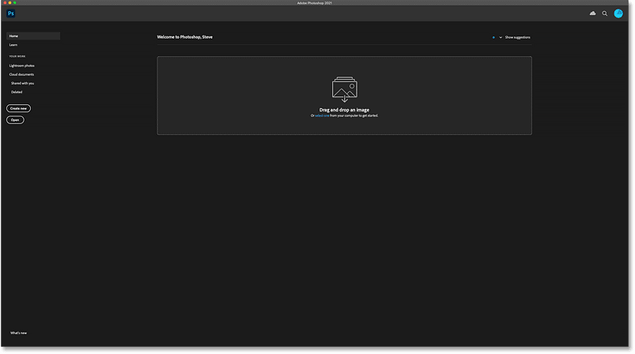
*Photoshop's Home Screen.*

To switch from the Home Screen to the main interface, click the **Photoshop icon** in the top left corner:

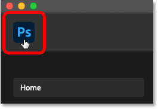
*Clicking the Photoshop icon.*

And now we're in the main workspace with the panels along the right. We'll need some of these panels to load our gradients, patterns and shapes:

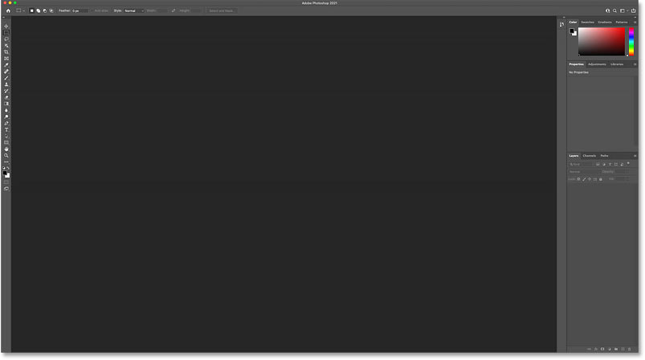
*Photoshop's main interface.*

## How to load Photoshop's missing gradients

Let's start by loading Photoshop's missing gradients. All of the new gradients that were added back in Photoshop 2020 are available to us by default. But the classic or "legacy" gradients from previous versions are hidden. So here's how to load them.

### Step 1: Open the Gradients panel

First, open the **Gradients panel**. You'll find it in the same panel group as the Color, Swatches and Patterns panels:

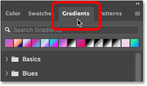
*Opening the Gradients panel.*

If you are not seeing the Gradients panel, you can open it by going up to the **Window** menu in the Menu Bar and choosing **Gradients**. But if a checkmark appears next to its name, it means that the panel is already open and selecting it from the menu will close it:

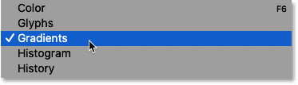
*Going to Window > Gradients.*

#### Photoshop's default gradients

In the Gradients panel, the gradients are divided into groups based on theme (Basics, Blues, Purples, and so on). And all of these groups are new as of Photoshop 2020.

You can scroll through the groups using the scroll bar along the right of the panel:

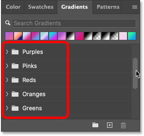
*The default gradient groups.*

Or you can resize the panel to make it longer and view more groups at once:

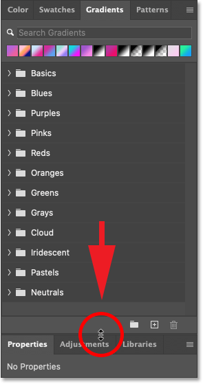
*Dragging the divider line between the panel groups.*

#### How to open a group

To open a group and view the gradients inside it, click the **arrow** next to its folder icon:

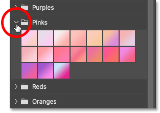
*Clicking the arrow to open a group.*

#### How to resize the thumbnails

You can resize the gradient thumbnails by clicking the Gradients panel **menu icon** in the top right corner:

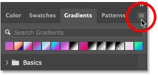
*Clicking the menu icon.*

And choosing **Small** or **Large Thumbnail** from the list:

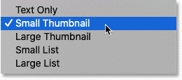
*The thumbnail size options.*

#### How to close a group

To close the group, click again on the same **arrow** beside the folder:

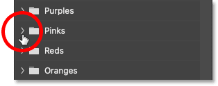
*Closing the group.*

#### Tip! How to open and close all groups at once

Before we look at how to load more gradients, here's a quick tip. If you press and hold the **Ctrl** (Win) / **Command** (Mac) key on your keyboard and open a group, you'll open *every* group at once. You can then scroll through the thumbnails to view the gradients. Hold Ctrl (Win) / Command (Mac) again while closing a group to close them all at once.

This trick works not only in the Gradients panel but also in the Patterns and Shapes panels which we'll look at in a moment:

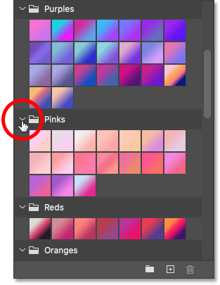
*Hold Ctrl (Win) / Command (Mac) to open or close all groups at once.*

[Learn more: Create a rainbow gradient in Photoshop!](/basics/how-to-create-a-rainbow-gradient-in-photoshop/)

### Step 2: Click the Gradients panel menu icon

All of the gradients we've seen so far are new as of Photoshop 2020. What's missing are the legacy gradients from earlier versions. To load them, click the Gradients panel **menu icon**:

*Clicking the menu icon.*

### Step 3: Choose "Legacy Gradients"

Then from the menu, choose **Legacy Gradients**:

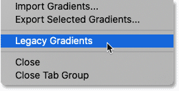
*Choosing "Legacy Gradients".*

### Step 4: Open the Legacy Gradients group

A new Legacy Gradients group appears below the others:

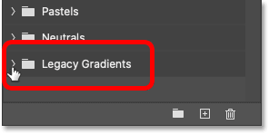
*The new Legacy Gradients group.*

### Step 5: Choose a legacy gradient

Open the group, and inside are all of Photoshop's gradients from the past. The first group at the top holds the default gradients from earlier versions. And the other groups below it are different gradient sets that you could load in separately:

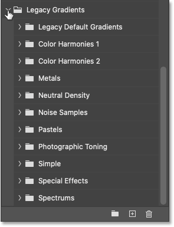
*Photoshop's legacy gradients.*

#### How to view all legacy gradients at once

Using the trick we learned earlier, if you press and hold the **Ctrl** (Win) / **Command** (Mac) key on your keyboard while opening one of these legacy groups, you'll open all of them at once. You can then scroll through the thumbnails to quickly see what's available without needing to open each group individually:

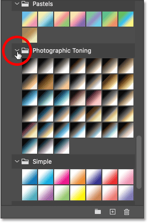
*Opening all legacy gradient groups at once.*

And that's how to load the missing gradients in Photoshop!

[Learn more: How to apply gradients from the Gradients panel](/basics/new-ways-to-add-gradients-in-photoshop-cc-2020/)

## How to load Photoshop's missing patterns

Next, we'll learn how to load the missing patterns. Unlike the Gradients panel where the only gradients missing are from older Photoshop versions, the Patterns panel is missing the legacy patterns plus most of the new patterns from Photoshop 2020. So here's how to load them.

### Step 1: Open the Patterns panel

Open the **Patterns panel** which is located beside the Gradients panel:

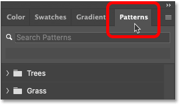
*Opening the Patterns panel.*

If you're not seeing it, go up to the **Window** menu and choose **Patterns**:

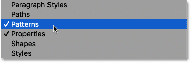
*Going to Window > Patterns.*

#### Photoshop's default patterns

Just like with gradients, patterns are divided into groups based on theme. Only three groups are listed by default (Trees, Grass and Water) but all three are new as of Photoshop 2020:

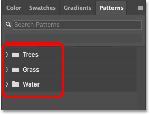
*The new default pattern groups.*

Click the **arrow** next to a folder to open the group and view the patterns inside it:

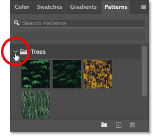
*Opening one of the groups.*

You can change the thumbnail size by clicking the **menu icon**:

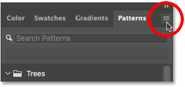
*Clicking the menu icon.*

And choosing a new size. I'll switch from **Large Thumbnail** to **Small**:

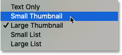
*The pattern thumbnail size options.*

And to close a group, click again on the arrow:

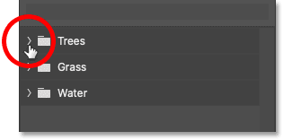
*Closing the group.*

### Step 2: Click the Patterns panel menu icon

To load more new patterns from Photoshop 2020, plus all of the older patterns from earlier versions, click the Patterns panel **menu icon**:

*Clicking the menu icon.*

### Step 3: Choose "Legacy Patterns and More"

And choose **Legacy Patterns and More**:

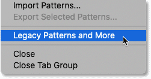
*Choosing "Legacy Patterns and More".*

### Step 4: Open the Legacy Patterns and More group

Then twirl open the new Legacy Patterns and More folder:

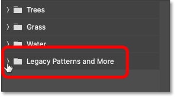
*Opening the Legacy Patterns and More group.*

### Step 5: Choose a new or legacy pattern

And inside are two more folders, one for **2019 Patterns** and one for **Legacy Patterns**:

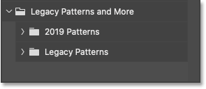
*The 2019 Patterns and Legacy Patterns folders.*

#### The 2019 patterns

2019 Patterns holds five more groups first added in Photoshop 2020 (which sounds confusing, but Photoshop 2020 was actually released in 2019):

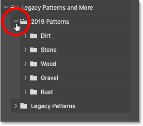
*The 2019 patterns.*

#### The legacy patterns

And Legacy Patterns holds all of the classic pattern sets from earlier Photoshop versions:

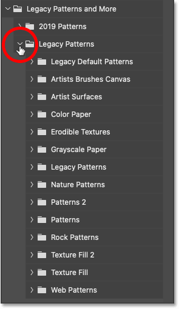
*The legacy patterns.*

Again, you can press and hold the **Ctrl** (Win) / **Command** (Mac) key on your keyboard while opening a pattern group to open all of them at once:

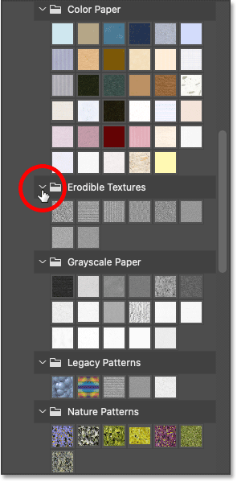
*All legacy groups open at once.*

And that's how to load the missing patterns in Photoshop!

## How to load Photoshop's missing shapes

We'll finish off this tutorial by learning how to load the missing shapes, and there are *lots* of shapes missing. To load them, we need the Shapes panel.

### Step 1: Open the Shapes panel

Unlike the Gradients and Patterns panels, the Shapes panel is not part of Photoshop's default workspace. So to open it, go up to the **Window** menu and choose **Shapes**:

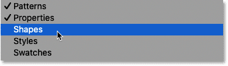
*Going to Window > Shapes.*

The Shapes panel opens in the secondary panel column to the left of Photoshop's main panels. You can show and hide the panel by clicking its icon:

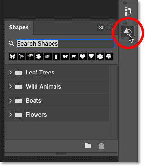
*The Shapes panel.*

#### Photoshop's default shapes

By default, only four shape groups (Leaf Trees, Wild Animals, Boats, and Flowers) are listed, all new from Photoshop 2020:

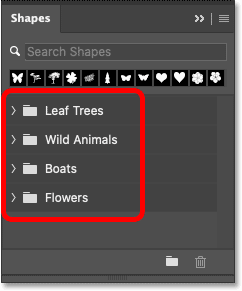
*The four default shape groups.*

Again if we twirl a group open, we see the shapes inside it:

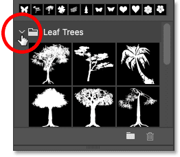
*Opening the Leaf Trees group.*

And if you click the panel's **menu icon**:

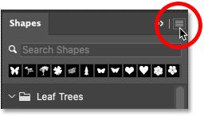
*Clicking the menu icon.*

You can change the thumbnail size:

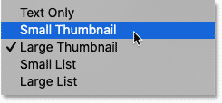
*The shape thumbnail size options.*

### Step 2: Click the Shapes panel menu icon

But Photoshop actually includes *hundreds* of new shapes from 2020, plus all of the classic shapes from earlier versions. To load them, click the Shapes panel **menu icon**:

*Clicking the menu icon.*

### Step 3: Choose "Legacy Shapes and More"

And choose **Legacy Shapes and More**:

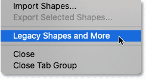
*Choosing "Legacy Shapes and More".*

### Step 4: Open the Legacy Shapes and More group

Twirl open the new Legacy Shapes and More folder:

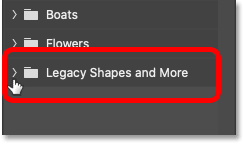
*The Legacy Shapes and More group.*

### Step 5: Choose a new or legacy shape

And inside are two more folders, **2019 Shapes** and **All Legacy Default Shapes**:

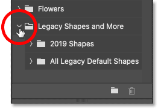
*The 2019 Shapes and All Legacy Default Shapes folders.*

#### 2019 Shapes

Unlike the 2019 Patterns folder which included only a few more groups from Photoshop 2020, the 2019 Shapes folder holds 30 more groups with hundreds more shapes in total. You'll find shapes of people, animals, vehicles, games, dinosaurs and more:

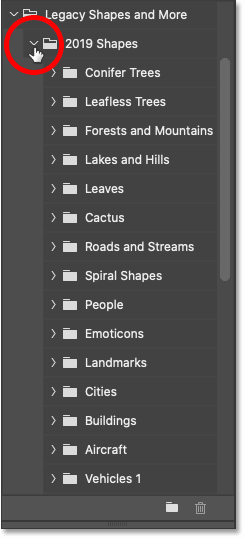
*The 2019 shapes.*

[Learn more: How to draw shapes from the Shapes panel](/basics/drawing-custom-shapes-with-the-shapes-panel-in-photoshop-cc-2020/)

#### All Legacy Default Shapes

And the All Legacy Default Shapes folder holds all of the shapes from previous Photoshop versions:

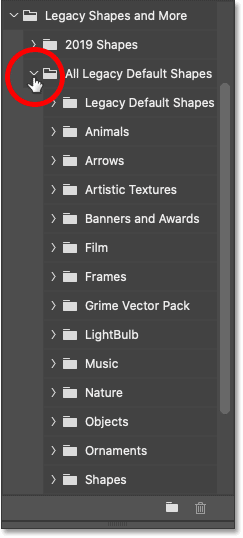
*The legacy shapes.*