# Focus Area Selections – Photoshop CC 2014

> Source: [https://www.photoshopessentials.com/basics/selections/cc/2014/focus-area/](https://www.photoshopessentials.com/basics/selections/cc/2014/focus-area/)
> Downloaded and converted to Markdown.

**Focus Area** is a brand new selection tool in Photoshop, introduced as part of the **2014 Creative Cloud updates**. With Focus Area, we can now make selections based on the in-focus area of an image!

In other words, if we have an image where we need to isolate a person or subject from the background, and that person or subject happens to be in focus (inside the depth of field) while the background is blurred and out of focus, Photoshop can now analyze the image, figure out what's in focus and what's not, and make a selection of just the area we need. In this two-part tutorial, we'll see how it works!

Why a two-part tutorial? As we'll see, making a focus-based selection in Photoshop is really a two-step process. First, we use the new Focus Area tools to make an initial selection of our subject, and we'll learn everything we need to know about how to do that in this first part of the tutorial. In Part Two, we'll cover the next step where we clean up and fine-tune our selection using Photoshop's powerful Refine Edge command.

Just a quick note before we begin. You'll need to be a monthly subscriber to the [Adobe Creative Cloud](https://prf.hn/l/dlXjD2w) to access **Photoshop CC 2014** and the new updates. Focus Area is not available in earlier versions of Photoshop.

This tutorial is from our [How to make selections in Photoshop](/basics/make-selections-photoshop/) series.

Here's the image I'll be working with ([girl with puppy photo](http://www.shutterstock.com/pic-142291096/stock-photo-children-girl-kissing-her-puppy-chihuahua-doggy-on-the-wood-fence.html) from Shutterstock). Notice that the girl and the puppy are both in focus while the area behind them is blurred out, exactly the sort of image that Photoshop's new Focus Area selection tool was designed for:

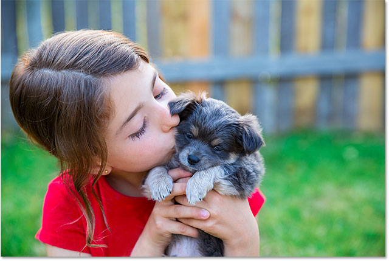
*The original image.*

For this first look at Focus Area, I'll do something relatively simple with this image, like keep the girl and puppy in color while converting the background to black and white. For that, I'll first need to make a selection of my two subjects in the foreground. Let's get started!

### Selecting Focus Area

With your image open in Photoshop CC 2014, select Focus Area by going up to the **Select** menu in the Menu Bar along the top of the screen and choosing **Focus Area**:

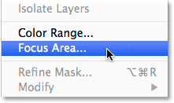
*Going to Select > Focus Area.*

### Letting Photoshop Analyze The Image

This opens the new Focus Area dialog box:

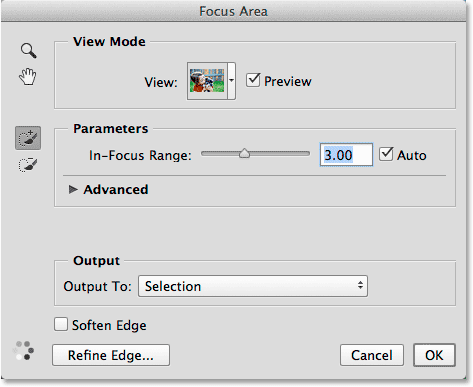
*The Focus Area dialog box.*

Right away, you'll see **animated dots** appearing in the lower left corner of the dialog box, telling us that Photoshop is up to something. What's it up to? It's analyzing the image, looking for areas that are in focus:

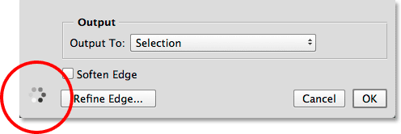
*Let Photoshop do its thing until the dots disappear.*

Wait until Photoshop is done analyzing the image, at which point the animated dots will vanish and our initial focus-based selection appears:

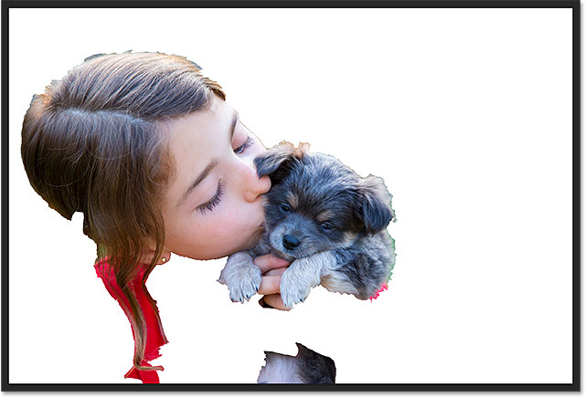
*The initial selection.*

### Changing The View Mode

Notice that my selection is appearing in front of a white background. For my image, this works fine, but we can change the background to something different using the **View **option at the top of the Focus Area dialog box. Click on the View thumbnail:

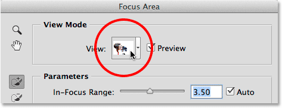
*Clicking the View thumbnail.*

This opens a list of other view modes we can choose from. If a white background makes it tough to see your selection, you can switch to a black background by choosing **On Black**, or choose **Overlay** to view it with the Quick Mask rubylith overlay. The **On Layers** view mode will show a transparent background, great for when you're trying to blend your selection with a different image on a layer below it. Or, choose **Black & White** to view the selection as a [layer mask](/basics/layers/layer-masks/). Notice that each view mode has a keyboard shortcut in parentheses, making it easy to switch between them from the keyboard (press **W** for On White, **B** for On Black, etc). If you don't want to remember all of the shortcuts, just press the letter **F** repeatedly to cycle through them:

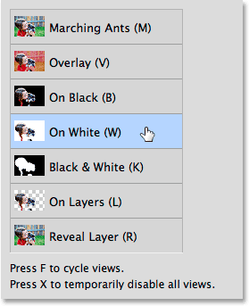
*Choose the best background for viewing your selection.*

### Changing The In-Focus Range To Expand Or Contract The Selection

Depending on your image, Photoshop may or may not have done a decent job with its initial selection, but no matter how it looks at first, Focus Area gives us lots of ways to improve and fine-tune it. The first way is by adjusting how in-focus an area has to be for Photoshop to include it as part of the selection. We do that using  the **In-Focus Range** slider. Dragging the slider towards the left will reduce the size of the selection, limiting it to just the most in-focus areas:

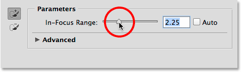
*Dragging the In-Focus Range slider towards the left.*

Here's my result after dragging the slider to the left. Areas that weren't quite as in focus as others have been removed from the selection, which in this case actually made things worse:

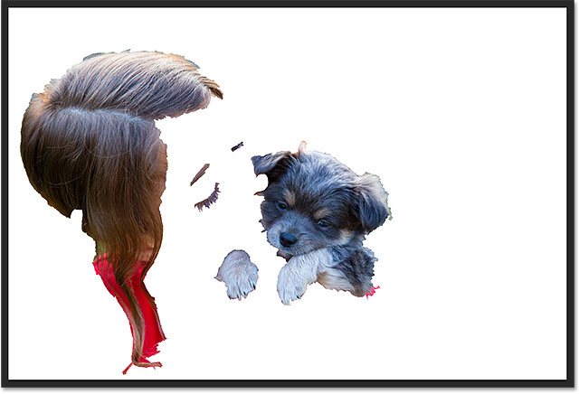
*The result after dragging the In-Focus Range slider towards the left.*

The opposite happens if we drag the In-Focus Range slider towards the right. Photoshop will expand the selection to include more areas of the image. That is, areas that are still generally in focus, at least compared with the background:

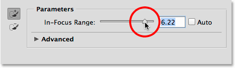
*Dragging the In-Focus Range slider towards the right.*

This time, dragging the slider improved the selection as Photoshop was able to include quite a bit more of my subjects. If you drag too far to the right, though, you'll end up selecting too much (possibly the entire image) so you'll need to play around with the slider a bit to find the best setting, and it will be different with each image. Again, don't worry that things  don't look perfect. The In-Focus Range slider is just the first step towards improving the selection:

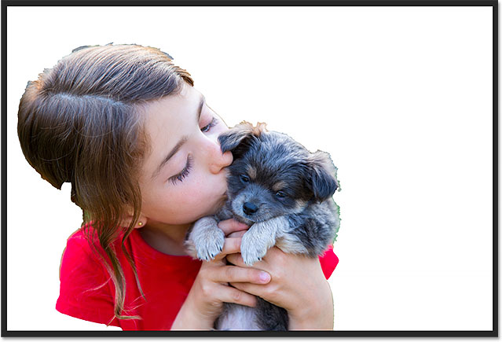
*Dragging the In-Focus Range slider towards the right gave me better results.*

### Adjusting The Image Noise Level

If your image contains a lot of noise (a common problem with photos shot with higher ISO settings) and you're having trouble isolating the in-focus areas from the out-of-focus areas, click on the word **Advanced** (or the little **triangle** to the left of the word) to twirl open the Advanced section:

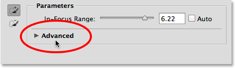
*Clicking on "Advanced" to twirl it open.*

Inside the Advanced section, you'll find the **Image Noise Level** slider. Drag the slider left or right to adjust how sensitive Focus Area is to image noise. This may or may not help to improve your selection. In my case, my image doesn't contain a lot of noise, but if yours does, it's worth giving the Image Noise Level slider a try:

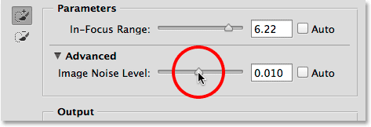
*The Image Noise Level slider in the Advanced section.*

### Taking Control With The Focus Area Add And Subtract Tools

Once you've improved upon the initial selection as much as possible with the In-Focus Range slider (as well as the Image Noise Level slider), it's time to take more manual control over the selection using two powerful brush tools - the **Focus Area Add Tool** and the **Focus Area Subtract Tool**. We can access them by clicking on their icons along the left of the Focus Area dialog box. The Focus Area Add Tool (the one on top with the plus sign in the icon) is selected by default:

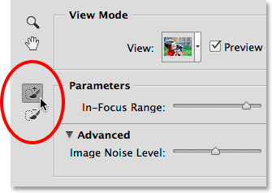
*The Focus Area Add (top) and Focus Area Subtract (bottom) Tools.*

As I look around my current selection, I see lots of obvious areas that are missing, like this chunk of the girl's hair:

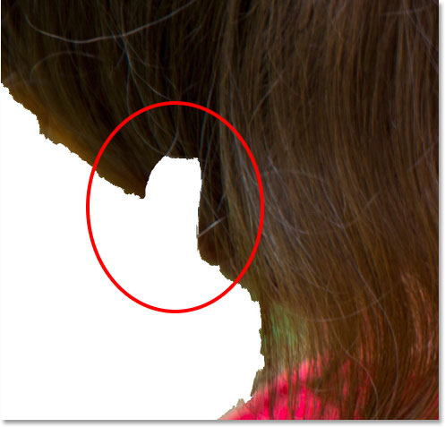
*One of several areas that need to be added manually to the selection.*

To add this area, I'll first make sure I have the **Focus Area Add Tool** selected:

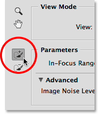
*Selecting the Focus Area Add Tool.*

Then, I'll simply click and paint over the hair inside that missing area. Notice the plus sign (+) in the center of the brush icon letting me know I'm in the Add To Selection mode:

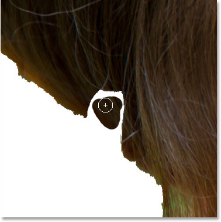
*Painting inside the missing hair.*

Also notice something very important.  I don't have to paint over the entire missing area, the way I would if I was painting with Photoshop's standard Brush Tool in Quick Mask mode or on a [layer mask](/basics/layers/layer-masks/). I only need to paint over a small sample of the area I want to add. The reason is because when we paint with either the Focus Area Add or Subtract Tool, Photoshop looks at the area we've painted over, then **re-analyzes the image** and looks for other areas that are **the same, or very similar,** to that area. It then adds or subtracts those additional areas  as well. As we see here, as soon as I release my mouse button, Photoshop re-analyzes the image (those animated dots will re-appear in the lower left corner of the dialog box), sees that the area surrounding where I painted looks pretty much the same as the area I actually painted over, and is able to fill in that entire missing area for me:

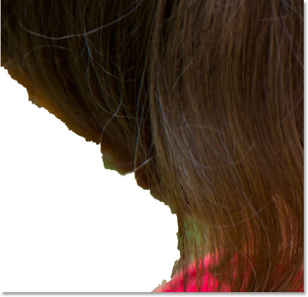
*Photoshop was able to include not just where I painted but the area around it as well.*

Here's why it's so important to understand how these Focus Area brush tools work and how they differ from standard brushes. I'm going to **undo** my last brush stroke by pressing **Ctrl+Z** (Win) / **Command+Z** (Mac) on my keyboard (Focus Area gives us one level of undo) so I'm back to having that chunk of hair missing from the selection. Then, I'll once again paint with the Focus Area Add Tool inside the missing area. This time, though, notice that I'm also painting a bit into the green background area behind the girl:

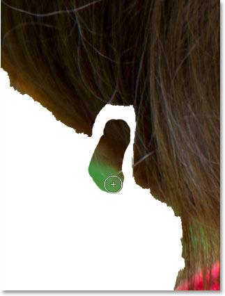
*Accidentally including some of the background in my brush stroke.*

As I mentioned a moment ago, Photoshop doesn't simply add the area we painted over to the selection. It also looks for other similar areas to add. In this case, because I accidentally painted over not just the girl's hair but also some of the green background area, when I release my mouse button, Photoshop adds  the area I painted over plus a huge section of the background in the lower left corner:

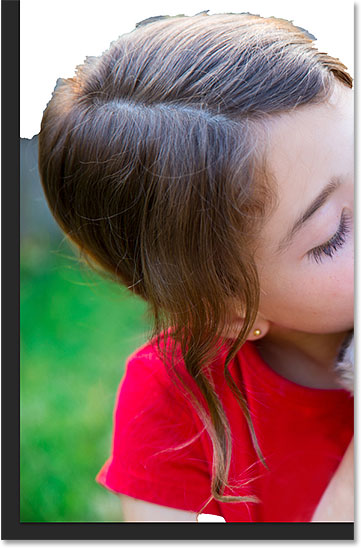
*The result of accidentally painting over part of the background with the Focus Area Add Tool.*

How do we remove unwanted areas from a selection? Well, if you've made a huge mistake like the one I just made, you may want to simply press **Ctrl+Z** (Win) / **Command+Z** (Mac) on your keyboard to undo it. But that only works in cases like this where you've made a mistake with your last brush stroke. For most unwanted areas, we need to switch to the **Focus Area Subtract Tool**, located directly below the Focus Area Add Tool on the left of the dialog box (it has the minus sign in its icon):

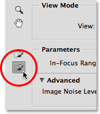
*Selecting the Focus Area Subtract Tool.*

**Quick Tip:** You can  switch between the Focus Area Add Tool and the Focus Area Select Tool from the keyboard just by pressing the letter **E**.

If the area you need to remove is relatively large and there isn't a lot of detail to it (as if often the case with an out-of-focus background), it often helps to paint with a larger brush. One way to change the brush size is with the slider in the Options Bar. Click on the little arrow to the right of the current **Size** value to access the slider, then drag it left or right:

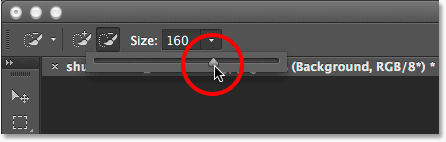
*Dragging the Size slider to the right to increase the brush size.*

A faster way, though, is to change the brush size from the keyboard. Press the **right bracket key** ( **]** ) repeatedly to increase the brush size, or the **left bracket key** ( **[** ) to decrease it. Then, simply paint a single stroke across part of the area you need to remove. Notice the minus sign in the center of the brush icon telling us we're in Subtract From Selection mode:

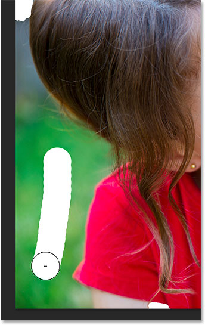
*Brushing with the Focus Area Subtract Tool over part of the unwanted background area.*

When I release my mouse button, Photoshop looks at the area I brushed over, analyzes the image for areas that are the same or very similar, and in this case, removes all of the unwanted background from that area. All it took was a single brush stroke:

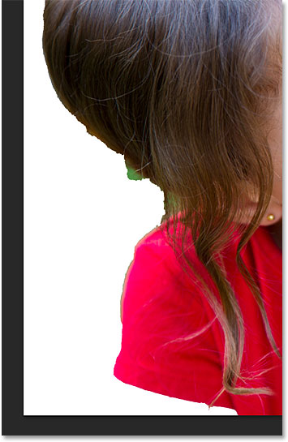
*The unwanted area in the lower left is gone.*

There's still a smaller area of green background visible directly under the hair, so to see it better, I'll zoom in on it. You'll find Photoshop's standard **Zoom Tool** and **Hand Tool** for zooming and scrolling around an image in the upper left corner of the Focus Area dialog box:

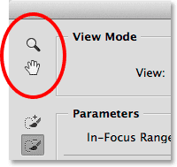
*The Zoom Tool (for zooming) and Hand Tool (for scrolling) are found in the upper left corner.*

However, I don't recommend actually selecting the tools with these icons because you'll deselect your Add or Subtract Tool in the process. Instead, it's easier to *temporarily* switch to the navigation tools from the keyboard. To zoom in on an area, press and hold **Ctrl+spacebar** (Win) / **Command+spacebar** (Mac) to temporarily access the **Zoom Tool**, then click on the image. To zoom out, press and hold **Alt+spacebar** (Win) / **Option+spacebar** (Mac) and click. To scroll around the image when you're zoomed in, press and hold the **spacebar** on its own to temporarily switch to the **Hand Tool**, then click and drag the image. When you release the keys, you'll instantly return to whichever brush tool (Add or Subtract) was previously active.

**See Also:** [Image Navigation Essentials - Zooming And Panning In Photoshop](/basics/image-navigation-essentials-zooming-panning-photoshop/)

Here, I'm zooming in on the problem area:

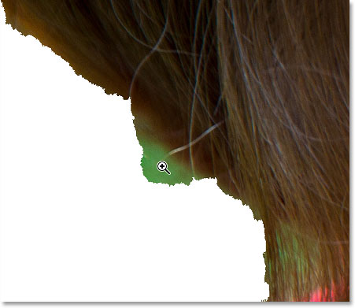
*Pressing Ctrl+spacebar (Win) / Command+spacebar (Mac) and clicking to zoom in.*

Since this area is small, I'll reduce the size of my brush by pressing the **left bracket key** ( **[** ) a few times. Then, I'll paint over that green area to remove as much as possible while doing my best to stay away from the hair:

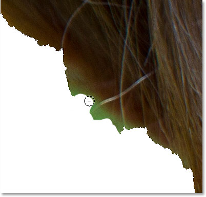
*Painting over the unwanted area with the Focus Area Subtract Tool (and a small brush size).*

Unfortunately, even though I thought I did a decent job of avoiding the hair, Photoshop still removed some of it from my selection:

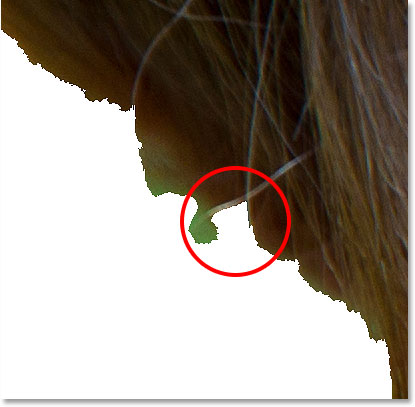
*A small section of hair was accidentally removed.*

When that happens (and it will, a lot), here's another handy trick. You can temporarily switch from the Focus Area Subtract Tool to the Focus Area Add Tool (and vice versa) simply by pressing and holding the **Alt** (Win) / **Option** (Mac) key on your keyboard. With the key held down, you'll switch to the opposite tool. In this case, I want to bring back that missing area of hair, so since I currently have the Subtract Tool selected, I'll press and hold my Alt (Win) / Option (Mac) key to temporarily switch to the Add Tool, then with the same small brush size, I'll paint a single stroke across that area:

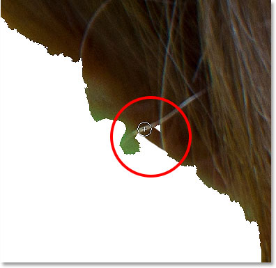
*Holding Alt (Win) / Option (Mac) and dragging across the area with the Focus Area Add Tool.*

I'll release my mouse button, and Photoshop re-adds that missing area to my selection:

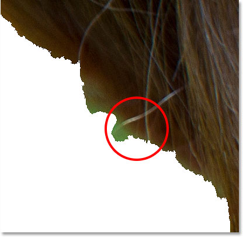
*The missing area has been restored.*

I'll then release my Alt (Win) / Option (Mac) key to switch back to the Subtract Tool and, this time with an even smaller brush, I'll continue painting away the remaining area of green background:

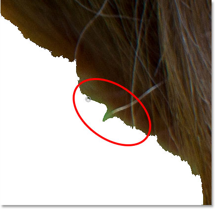
*Painting with a very small brush to clean things up.*

At this point, you may be thinking that my selection doesn't look all that great, and that's because it doesn't. The edges look very jagged and unnatural, and there's still a small bit of green background visible around part of the hair. But don't worry about how your selection edges look for now. All we're trying to do initially with Focus Area is separate, as best as possible, our in-focus subject from the out-of-focus background. As I mentioned at the beginning, making a selection with Focus Area is a two-stage process. First, we do as much as we can with the tools and controls in the Focus Area dialog box to create an initial selection, then we send it off to the Refine Edge command for fine-tuning, as we'll be doing in Part Two. But, that's jumping ahead. Let's continue on with Focus Area itself.

Here's another problem area. At the bottom of the image, the girl's arm is completely missing below her red shirt sleeve:

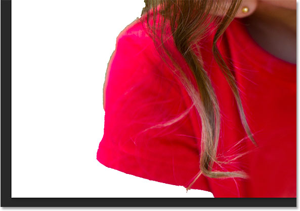
*Another big area missing from the selection.*

### Toggling The Preview On And Off

Of course, without being able to see my original image, it's not always easy to spot problem areas like this. Fortunately, we can compare the original image with our selection at any time by toggling the selection preview on and off. You'll find the **Preview** option directly to the right of the View thumbnail at the top of the dialog box. By default, the preview is turned on. Click inside its checkbox to deselect it and turn the preview off:

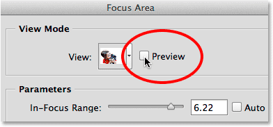
*Unchecking the Preview option.*

The original image will re-appear, and now I can clearly see her missing arm:

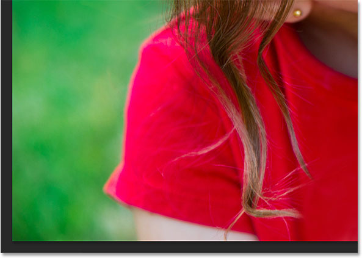
*With Preview off, we see the original image.*

To bring back the selection, click once again inside the Preview checkbox to turn it back on:

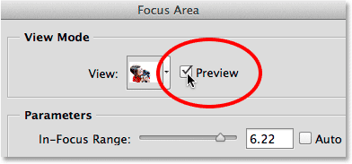
*Checking the Preview option.*

And now the selection re-appears so we can continue working on it. You can also toggle the preview on and off by pressing the letter **P** on your keyboard:

*With Preview on, we see the selection.*

I currently have the Focus Area Subtract Tool active, so to add her arm to the selection, I'll press the letter **E** on my keyboard to quickly switch to the Focus Area Add Tool. Then, I'll press the **right bracket key** ( **]** ) a few times to increase my brush size a little, and I'll paint a single brush stroke across the area where her arm should appear:

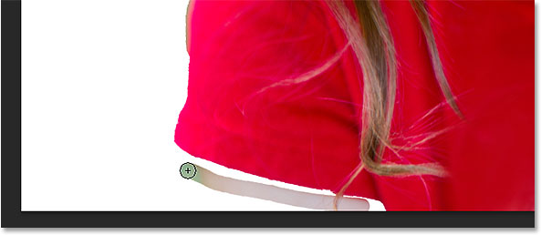
*Painting with the Focus Area Add Tool across the missing arm.*

I'll release my mouse button, and after a couple of seconds of Photoshop re-analyzing the image, it adds the girl's arm to the selection:

*The missing arm is added.*

It looks like I painted a bit too far into the background again, so to remove that remaining green background area on the left, I'll temporarily switch to the Focus Area Subtract Tool by pressing and holding the **Alt** (Win) / **Option** (Mac) key on my keyboard, then I'll paint over it:

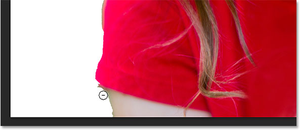
*Cleaning up the area with the Focus Area Subtract Tool.*

I'll quickly scroll around my image to clean up the remaining problem areas using the Focus Area Add and Subtract Tools and adjusting my brush size with the left and right bracket keys, just as we've seen in the above examples. Again, the point here is not to make your selection look professional because it won't. Not yet. This is just the first step, and all you should be aiming for right now is to select as much of your subject and as little of your background as possible. For very small sections, you may find that a single click with your mouse (along with a very small brush) gives you better results than trying to drag across the area, and remember that you can always press **Ctrl+Z** (Win) / **Command+Z** (Mac) to undo your last brush stroke if you really mess things up:

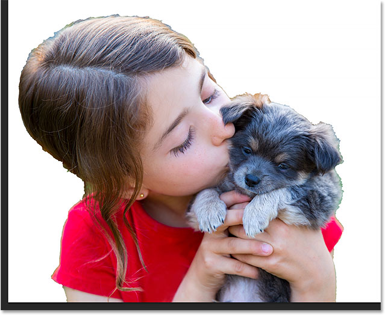
*My final selection, at least for now.*

### Softening The Selection Edges

As I've mentioned, Focus Area often produces harsh, jagged selection edges. Here, I've zoomed in to 400% around an area of the puppy's fur so we can see the edges more clearly:

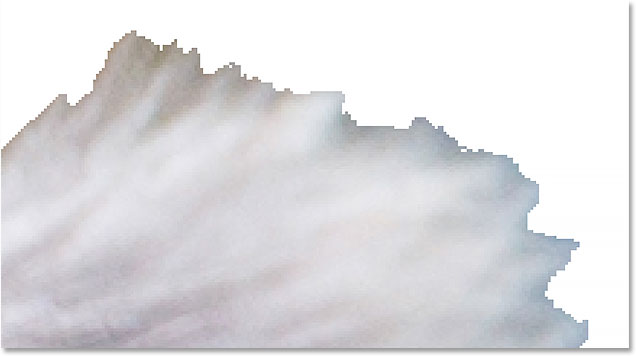
*Definitely not the best looking fur selection I've ever seen.*

We can soften the edges by selecting the **Soften Edges** option in the lower left of the dialog box:

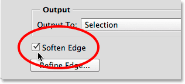
*Turning on Soften Edges.*

Photoshop then adds some anti-aliasing to the edges to blur and soften them. Whether or not you'll want to use the Soften Edges option will depend on your image and on the type of subject you're trying to select. If you're selecting, say, a building with very straight, sharp and  well-defined edges, you may not want to soften them. With other types of selections, especially things like hair or fur, it can be more useful. However, as we'll see when we move away from the Focus Area dialog box and onto Part Two of the tutorial, we can achieve *much* better results with Photoshop's Refine Edge command than we can with  Soften Edges, so you may  want to just ignore this option completely:

*The edges now appear softer, but nothing like what we'll be able to do with Refine Edges.*

### Outputting The Selection (And Why You Don't Want To Just Yet)

If you're happy with your selection at this point, the **Output To** option near the bottom of the Focus Area dialog box gives us several different output types to choose from. Clicking on the output type box will open the list of available options. We can output it as a traditional "marching ants" selection outline, or as a new layer, a layer mask,  and so on:

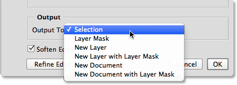
*The Output options.*

However, I’m going to recommend that you don’t output your selection just yet, and that’s because in pretty much all cases, you’re still going to want to improve things further.