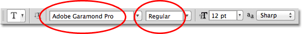
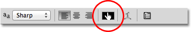
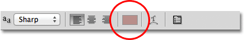
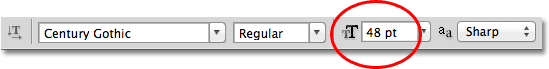
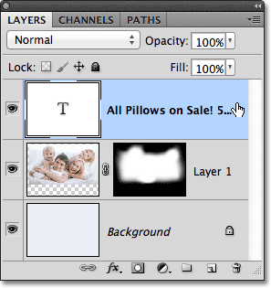
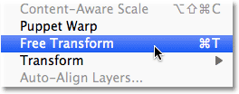
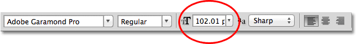

# An Easy Way To Set Your Type Size In Photoshop

> Source: [https://www.photoshopessentials.com/basics/type/font-size/](https://www.photoshopessentials.com/basics/type/font-size/)
> Downloaded and converted to Markdown.

In this tutorial in our series on [working with type in Photoshop](/basics/type/), we'll learn a great way to set the correct size for your type when adding text to your designs and images, one that lets you easily scale your text to any size you need and gives you a live preview of the results! If you're still using the Font Size option in the Options Bar to set your type size, you'll find this technique a whole lot easier.

This tutorial assumes you already have a basic understanding of how to add type to a Photoshop document. If you need a refresher on the basics, you'll want to check out our [Photoshop Type Essentials](/basics/type/photoshop-type-essentials/) tutorial first.

Here's a document that I currently have open on my screen:

*The original document.*

I want to add some text along the bottom of the document, so I'll select my **Type Tool** from the Tools panel:

*Selecting the Type Tool.*

With the Type Tool selected, I'll choose a font and font style from the Options Bar:

*The font (left) and font style (right) options.*

To change my type color, I'll click on the color swatch in the Options Bar. At the moment, my type is set to its default color of black:

*Clicking on the color swatch to change the type color.*

Clicking the color swatch opens Photoshop's **Color Picker**, but instead of choosing a color from the Color Picker, I'm going to sample a color directly from the image. To do that, with the Color Picker still open, I'll move my mouse cursor over the photo, which temporarily switches me to the **Eyedropper Tool**. I'll move the eyedropper over an area of the image that contains the color I want for my text, then I'll click on that area to sample the color:

*Sampling a color from the image to use as the type color.*

With my color sampled, I'll click OK to close out of the Color Picker. The color swatch in the Options Bar now displays the new color:

*The new type color appears in the color swatch.*

All I need to do now is choose a size for my type, but this is where we run into a bit of a problem. Normally, to set the font size, we use the **Font Size** option in the Options Bar. We can either enter a value manually into the input box or we can click on the small arrow to the right of the input box and choose from a list of common preset sizes. That's great if I happen to know the exact font size I need, but in this case, as in most cases, I don't, which means I have to guess, usually with little to no chance of getting it right. Since I have to pick something, I'll choose a preset size of 48 pt. That seems like a good choice:

*Choosing one of the preset type sizes.*

With my font size chosen and all of my other type options set, I'll click inside the document with the Type Tool in roughly the spot where I want my type to begin, then I'll add my text. When I'm done, I'll press **Ctrl+Enter** (Win) / **Command+Return** (Mac) on my keyboard to accept the text. Here's what my first attempt looks like with my type set to 48 pt:

*The initial font size was too small.*

Looks like my first guess at a font size was way off. The text is much too small, but I still don't know the specific size I need. All I know so far is that it needs to be larger than 48 pt. This leaves me with a few options. I could try choosing a different, larger size from the list of preset sizes (although the largest preset size is only 72 pt which still may not be large enough), or I could try entering my own value manually into the Font Size input box, but what should that value be? This "trial and error" approach to setting the font size in the Options Bar can get frustrating very quickly. There must be an easier way to do this.

As it turns out, there is, but it doesn't involve the Font Size option in the Options Bar. Instead, I'm going to use Photoshop's **[Free Transform](/basics/free-transform/)** command. To access the Free Transform command, first make sure your **Type layer** is selected in the Layers panel:

*Make sure your Type layer is selected (highlighted in blue) in the Layers panel.*

With the Type layer active, go up to the **Edit** menu in the Menu Bar along the top of the screen and choose **Free Transform**. You can also press **Ctrl+T** (Win) / **Command+T** (Mac) to quickly select Free Transform with the keyboard shortcut:

*Go to Edit > Free Transform.*

This places the Free Transform bounding box and handles around the text, and we can now scale the text to any size we need simply by dragging the handles! This will also give us a live preview of the results as we're resizing the text, which means we can easily scale it to the correct size with no guess work needed. Since type in Photoshop is made from [vectors](/basics/shapes/vectors-paths-pixels/), not pixels, we're free to scale it as much as we want without any loss of image quality.

To scale the text, hold down the **Shift** key on your keyboard, then click and drag any of the four **corner handles** (the little squares). Holding the Shift key down as you drag the handles tells Photoshop to keep the original aspect ratio of the type intact so you don't stretch and distort the shapes of the letters. When you're done scaling the text, release your mouse button, then release your Shift key (make sure you release your mouse button *before* releasing the Shift key, otherwise you may still end up distorting the text):

*Hold Shift while clicking and dragging any of the corner handles to scale the text.*

You can also move the text into position while Free Transform is active. Simply click anywhere inside the Free Transform bounding box and, with your mouse button still held down, drag the type to its new location. There's no need to hold the Shift key down when moving the text. Here, I'm centering my text in the document:

*Click and drag anywhere inside the Free Transform bounding box to move and reposition the text.*

When you're happy with the size and position of your type, press **Enter** (Win) / **Return** (Mac) on your keyboard to accept the change and exit out of Free Transform mode. The bounding box around the type will disappear:

*Press Enter (Win) / Return (Mac) to exit out of Free Transform when you're done.*

If we look back up in the Options Bar, we see that Photoshop has automatically updated the Font Size option with our new type size:

*The new type size is displayed in the Font Size option in the Options Bar.*