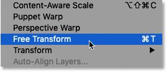
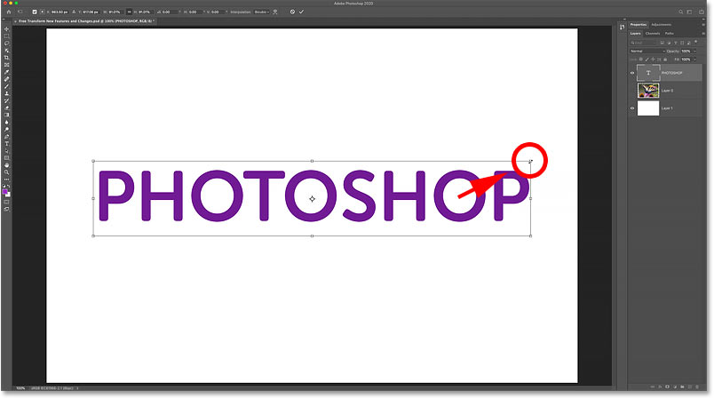
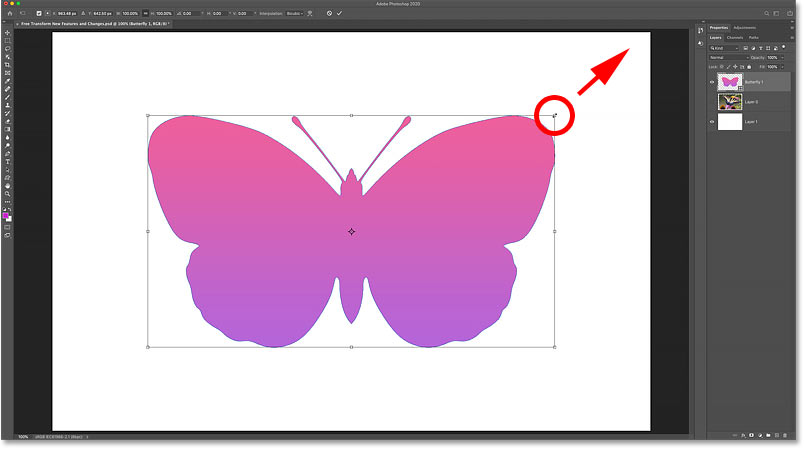
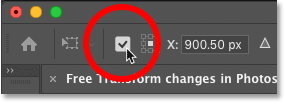
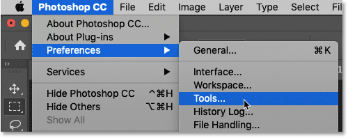
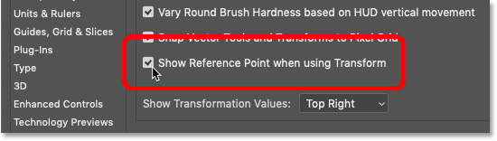

# Free Transform in Photoshop – New Features and Changes

> Source: [https://www.photoshopessentials.com/basics/free-transform-in-photoshop-cc-2019-new-features-and-changes/](https://www.photoshopessentials.com/basics/free-transform-in-photoshop-cc-2019-new-features-and-changes/)
> Downloaded and converted to Markdown.

Learn how Photoshop CC 2019 and CC 2020 change the way we use Free Transform to scale and transform images, shapes and type, and add new features designed to speed up your workflow!

In this tutorial, I show you the changes Adobe made to the Free Transform command as of Photoshop CC 2019, along with some additional fixes and improvements in Photoshop CC 2020. 

The biggest change from earlier versions of Photoshop is that Free Transform now scales objects proportionally by default. But in CC 2019, this change only applied to certain kinds of layers. Thankfully, as we'll see in this tutorial, Photoshop CC 2020 fixes that confusing issue.

Another big change in CC 2019 was that the transformation reference point, which normally appeared in the center of the Free Transform box, was now hidden by default. It's still hidden in CC 2020, but I'll show you a couple of ways to bring it back, including how to bring it back permanently. 

Photoshop CC 2019 also added new, faster ways to commit our transformations. And Photoshop CC 2020 makes Free Transform more flexible by adding multiple undos! Let's see how it works.

To follow along, you'll want to be using the [latest version of Photoshop](https://adobe.prf.hn/click/camref:1100lrdjJ/destination:https%3A%2F%2Fwww.adobe.com%2Fproducts%2Fphotoshop.html) and you'll want to make sure that your copy is [up to date](/basics/update-photoshop-cc/). For a complete look at Free Transform, check out my [how to use Free Transform in Photoshop](/basics/transform-and-warp-images-with-free-transform-in-photoshop-cc-2019/) tutorial.

Let's get started!

## New in CC 2019: Images scale proportionally by default

The biggest change with Free Transform as of Photoshop CC 2019 is that it now scales images proportionally by default. In previous versions of Photoshop, we had to press and hold the **Shift** key as we dragged a handle to lock the aspect ratio in place. 

But in CC 2019 and CC 2020, the aspect ratio is locked automatically. Holding Shift while dragging a handle scales the image *non*-proportionally. 

Here's an image I've placed into my Photoshop document ([butterfly image](https://adobe.prf.hn/click/camref:1100lrdjJ/destination:https%3A%2F%2Fstock.adobe.com%2Fimages%2Fswallowtail-butterfly-feeding-on-lantana%2F87474756) from Adobe Stock):

*A photo placed into a new document.*

[Related: How to move images between Photoshop documents](/basics/5-ways-move-images-photoshop-documents/)

### How to select Free Transform

I'll select the Free Transform command by going up to the **Edit** menu and choosing **Free Transform**. You can also select Free Transform with the keyboard shortcut, **Ctrl+T** (Win) / **Command+T** (Mac):

*Going to Edit > Free Transform.*

### How to scale an image proportionally

To scale an image proportionally, simply drag any of the transform handles (the little squares) around the image. 

Here I'm dragging the top left corner handle. And notice that while the image is getting smaller, its aspect ratio does not change:

*Dragging a corner handle to scale the image proportionally.*

### How to scale an image proportionally from its center

To scale proportionally from the center of an image, press and hold the **Alt** (Win) / **Option** (Mac) key as you drag a handle.

This time, I'm dragging the left side handle, and again the aspect ratio remains locked in place:

*Holding Alt (Win) / Option (Mac) to scale proportionally from the center.*

### How to scale an image non-proportionally

To scale an image non-proportionally, press and hold the **Shift** key as you drag a handle. And to scale non-proportionally from the center, hold **Shift+Alt** (Win) / **Shift+Option** (Mac) as you drag:

*Holding Shift to unlock the aspect ratio.*

## New in CC 2019: Type layers scale proportionally

Just like images, type layers now scale proportionally by default in Photoshop CC 2019 and CC 2020.

- Drag any transform handle to scale your type proportionally.
- Hold **Shift** while dragging a handle to scale type non-proportionally.
- Hold **Alt** (Win) / **Option** (Mac) to scale type from its center, or **Shift+Alt** (Win) / **Shift+Option** (Mac) to scale type non-proportionally from its center.

*Type layers behave the same as images when scaling with Free Transform.*

[Related: How to distort text in 3D with Free Transform](/photoshop-text/text-effects/distort-perspective-text/)

## New in CC 2020: Shape layers scale proportionally

While images and type layers scaled proportionally by default in Photoshop CC 2019, shape layers did not. Dragging a Free Transform handle on its own would scale the shape *non*-proportionally. And to lock the shape's aspect ratio in place, we needed to hold **Shift**. This lack of consistency made using Free Transform confusing.

But thankfully as of Photoshop CC 2020, shape layers, image layers and type layers now behave the same way.

- Drag any transform handle to scale a shape proportionally.
- Hold **Shift** while dragging to scale a shape non-proportionally.
- Hold **Alt** (Win) / **Option** (Mac) to scale a shape from its center, or **Shift+Alt** (Win) / **Shift+Option** (Mac) to scale a shape non-proportionally from its center.

*Shape layers now scale proportionally by default as of Photoshop CC 2020.*

[Related: How to use the new Shapes panel in Photoshop CC 2020](/basics/drawing-custom-shapes-with-the-shapes-panel-in-photoshop-cc-2020/)

## How to revert to the legacy Free Transform behavior

If you're a long-time Photoshop user and you prefer the old Free Transform behavior, Adobe has added a **Use Legacy Free Transform** option in Photoshop's Preferences. Check out my [Restore Legacy Free Transform](/basics/restore-legacy-free-transform-photoshop-cc-2019/) tutorial to learn how it works.

## Updated in CC 2020: Faster ways to commit transforms

Photoshop CC 2019 also introduced a faster way to commit a transformation. Just move your mouse cursor outside and away from the Free Transform box until your cursor changes to a black arrow. Then click on the document to accept and close Free Transform. 

But note that as of Photoshop CC 2020, this only works when *scaling* an object. It no longer works with Rotate or any of Photoshop's other transform commands.

Other quick ways to commit a transformation include choosing a different tool from the [toolbar](/basics/photoshop-tools-toolbar-overview/), or selecting a different layer in the [Layers panel](/basics/layers/layers-panel/). You can also click the **checkmark** in the Options Bar, double-click inside the Free Transform box, or press **Enter** (Win) / **Return** (Mac) on your keyboard):

*Clicking outside the Free Transform box to commit the scale.*

## New in CC 2019: The hidden transform reference point

If you've been using Photoshop for a while, you know that the Free Transform box displays a **reference point** in the center. The reference point is used to mark, or move, the center point of the transformation. I cover how to use the reference point in my complete [Free Transform tutorial](/basics/transform-and-warp-images-with-free-transform-in-photoshop-cc-2019/).

But as of Photoshop CC 2019, the reference point is hidden by default. Adobe chose to hide it so we avoid moving it by mistake. But the reference point is still there, and here's a couple of ways to show it:

*The hidden reference point in Photoshop CC 2019 and CC 2020.*

### How to temporarily show the reference point

To show the reference point temporarily, select the **Toggle Reference Point** checkbox in the Options Bar:

*The Toggle Reference Point checkbox.*

### How to permanently show the reference point

Or to always show the reference point, open Photoshop's Preferences.

On a Windows PC, go to **Edit** > **Preferences** > **Tools**. On a Mac, go to **Photoshop CC** > **Preferences** > **Tools**:

*Opening the Tools Preferences.*

And then in the Tools preferences, select **Show Reference Point when using Transform**:

*Turning on "Show Reference Point when using Transform".*

The next time you select Free Transform, the reference point will be visible in the center of the transform box:

*The reference point appears.*

## New in Photoshop CC 2020: Multiple undos

And finally, Photoshop CC 2020 adds multiple undos to the Free Transform command. In previous versions, Free Transform was limited to a single undo. But in CC 2020, as long as Free Transform is still active, you can press **Ctrl+Z** (Win) / **Command+Z** (Mac) repeatedly to undo as many transform steps as needed.

To redo a step in Free Transform, press **Shift+Ctrl+Z** (Win) / **Shift+Command+Z** (Mac). Press the shortcut repeatedly to redo multiple steps.

And there we have it! That's a quick look at the changes to Free Transform in Photoshop CC 2019 and CC 2020! Check out our [Photoshop Basics](/basics/) section for more tutorials! And don't forget, all of our tutorials are now available to [download as PDFs](/print-ready-pdfs)!