# Free Transform Essential Skills And Shortcuts

> Source: [https://www.photoshopessentials.com/basics/free-transform/](https://www.photoshopessentials.com/basics/free-transform/)
> Downloaded and converted to Markdown.

Photoshop's **Free Transform** command is one of its most useful and popular features, a one-stop shop for resizing, reshaping, rotating and moving images and selections within a document. In this tutorial, we learn the essential skills and shortcuts for getting the most out of this powerful feature, including how to switch to other helpful transform modes without leaving Free Transform!

This tutorial is for Photoshop CS5 and earlier. If you're using Photoshop CS6 or Photoshop CC (Creative Cloud), you'll want to check out our fully updated [Photoshop Free Transform Essential Skills](/basics/photoshops-free-transform-essentials/) tutorial.

Here's a simple pattern I have open on my screen:

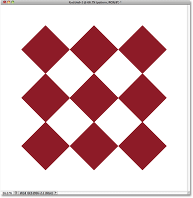
*A diamond-shape pattern courtesy of Photoshop's custom shapes.*

Before we go any further, I should point out that the pattern is sitting on its own layer above the white background in the Layers panel, and that the layer is active (highlighted in blue). This is important because the Free Transform command is not a selection tool and wouldn't be able to select the pattern on its own if it was not on its own layer. It will work on whatever happens to be selected, or on whatever is on the active layer (in my case, the pattern) if nothing is selected, but it has no ability to actually make selections:

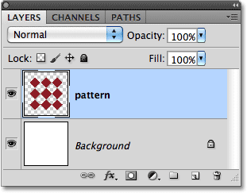
*The pattern sits on its own layer above the Background layer.*

Having said that, let's see all the things that Free Transform can do for us.

### Selecting Free Transform

The official way to select the Free Transform command is by going up to the **Edit** menu in the Menu Bar along the top of the screen and choosing **Free Transform** from the list:

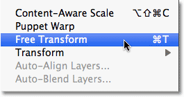
*Free Transform is found under the Edit menu.*

That's the official way, but nothing says "Hi! I'm new!" quite like the official way. An easier and faster way to select Free Transform is with the keyboard shortcut **Ctrl+T** (Win) / **Command+T** (Mac) (think "T" for "Transform"). Even if you don't like keyboard shortcuts, this is one you really should take a moment to memorize because chances are, you'll be using Free Transform a lot and selecting it from the Edit menu each time just slows you down.

Since my pattern layer is the active layer and nothing else is selected, as soon as I choose Free Transform, a thin bounding box appears around the pattern, and if we look closely, we see a small square in the top center, bottom center, left center, and right center, as well as a square in each of the four corners. These little squares are called **handles**, and we can transform whatever is inside the bounding box simply by dragging these handles around, as we'll see in a moment:

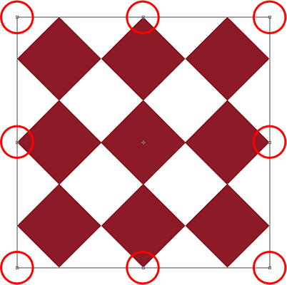
*The small handles are used to transform whatever is inside the bounding box.*

### Reshaping The Selected Area

Let's begin with a look at the most basic ways to reshape the selected area with Free Transform. To adjust the area's width, click on either the left or right handle and, with your mouse button still held down, simply drag the handle left or right. To adjust the height, click on either the top or bottom handle and, again with your mouse button still held down, drag it up or down. Here, I'm dragging the right side handle towards the right. Notice that the diamond shapes are stretching wider as I drag:

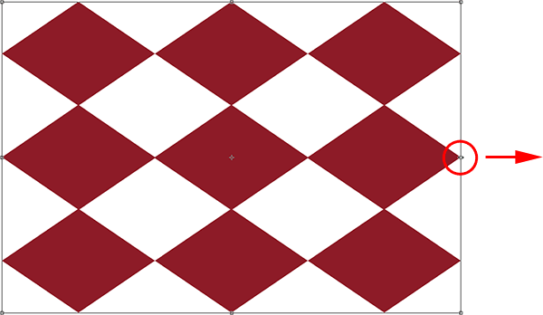
*Drag the left, right, top or bottom handles to adjust the width or height.*

Dragging one of these side handles by itself will move only the side you're dragging, but if you hold down your **Alt** (Win) / **Option** (Mac) key as you're dragging the handle, you'll reshape the area from its center, causing the opposite side to move at the same time but in the opposite direction. Here, with my Alt / Option key held down as I drag the right side handle towards the right, the left side also moves outward towards the left. The same would be true if I were to drag either the top or bottom handle while holding down Alt / Option. The opposite side would move at the same time in the opposite direction:

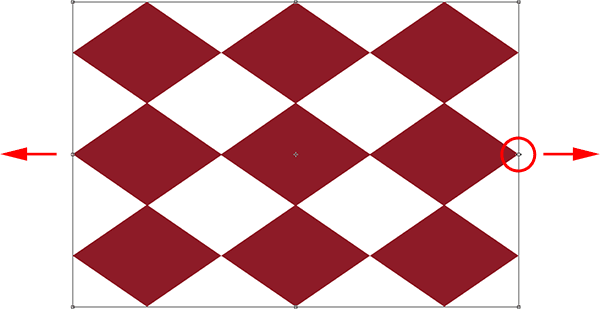
*Hold down Alt (Win) / Option (Mac) as you drag to reshape the area from its center.*

To adjust both the width and height together, click and drag any of the corner handles. Once again, holding down **Alt** (Win) / **Option** (Mac) as you drag a corner handle will reshape the area from its center, this time causing all four sides to move at once:

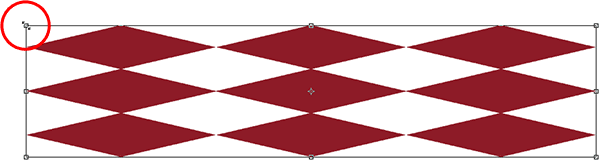
*Drag any of the corner handles to adjust the width and height together.*

### Resizing

One potential problem when reshaping things with Free Transform is that, well, we've reshaped them. They may be wider, thinner, taller or shorter, but they no longer look the way they did originally. Sometimes that's what we want, but more often, we just want to resize something, making it smaller or larger overall but keeping the original shape intact. For example, you may need to make a photo smaller so it fits better in a collage or other design layout. You don't want the person in the photo to suddenly appear tall and skinny or short and fat because you've reshaped the image. You just need the photo to be smaller. 

To resize something with Free Transform, hold down your **Shift** key, which will constrain the aspect ratio and prevent you from distorting the original shape, as you drag any of the corner handles. Just as we've seen a couple of times already, if you include the **Alt** (Win) / **Option** (Mac) key as well, you'll resize it from its center:

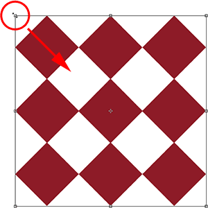
*To resize an image or selection, hold down Shift, then drag any of the corner handles.*

### Rotating

Rotating an image or selection with Free Transform is a little bit different and doesn't require us to drag any handles. Instead, move your cursor just outside the bounding box. You'll see it turn into a curved line with a small arrow on either end. Then just click and drag with your mouse to rotate it. If you hold down your **Shift** key as you drag, you'll rotate it in 15° increments (you'll see it snap into place as it rotates):

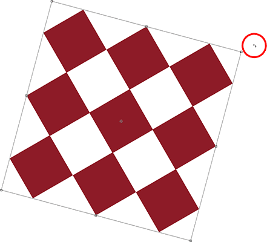
*To rotate the area, move your cursor outside the bounding box, then click and drag.*

It may be hard to see, but if you look closely in the center of the bounding box, there's a small **target symbol**. This symbol represents the center of the transformation, which is why, by default, it's in the center. It's also why my pattern rotated around its center, since it was actually rotating around that target symbol. We can change the rotation point simply by clicking on the target symbol and dragging it somewhere else. For example, if I want my pattern to rotate around its bottom right corner, all I need to do is drag the target symbol into that corner (it will snap into place when it gets close enough to the corner):

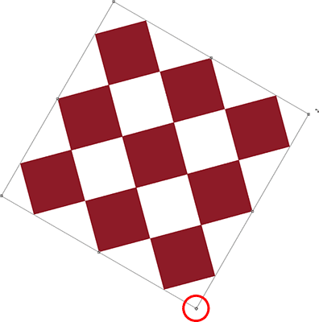
*Moving the target symbol changes the rotation point. The pattern is now rotating around its bottom right corner.*

### Moving

To move the image or selected area around inside the document with Free Transform active, click anywhere inside the bounding box (that is, anywhere *except* the target symbol) and drag it around with your mouse.

### More Transform Options

On its own, Free Transform can be a bit limited in what it can do. That's why Adobe includes additional transform modes that expand Photoshop's abilities. If you go up to the **Edit** menu and choose **Transform** (not Free Transform, just Transform), you'll see a list of these additional options, like Skew, Distort, and Perspective, as well as some rotating and flipping options:

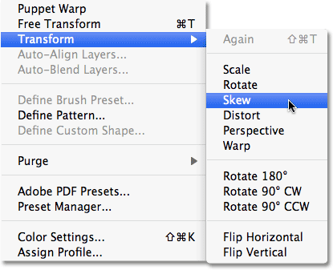
*More ways to transform images and selections are found under Edit > Transform.*

If you need to select one of these additional options and you already have Free Transform active, there's no need to select them from the Edit menu. Just **right-click** (Win) / **Control-click** (Mac) anywhere inside the document and the same options will appear in a convenient sub-menu. Let's take a look at how some of them work:

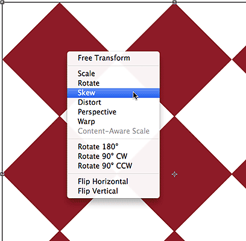
*Right-click (Win) / Control-click (Mac) to access the same additional transform options.*

### Skew

With **Skew** selected, if you click and drag any of the side handles, you'll tilt the image while keeping the sides parallel. Holding **Alt** (Win) / **Option** (Mac) as you drag a side handle will skew the image from its center, moving the opposite side at the same time but in the opposite direction:

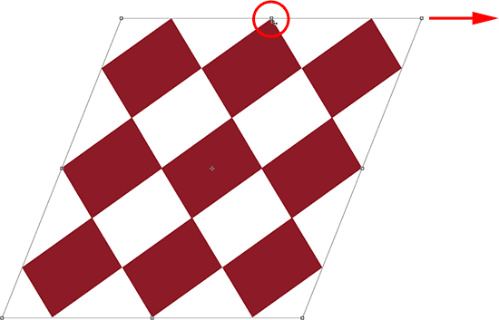
*Drag a side handle with Skew selected to tilt the image.*

Dragging a corner handle with Skew selected will scale the two sides that meet at that corner. Holding **Alt** (Win) / **Option** (Mac) will move the diagonally-opposite corner in the opposite direction at the same time:

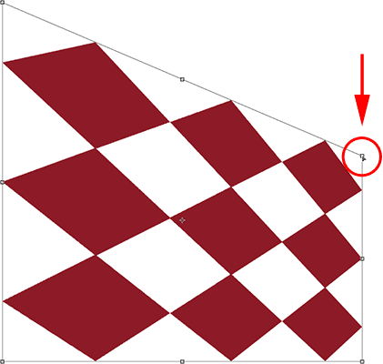
*Dragging a corner handle affects the two sides that join at the corner.*

### Distort

With **Distort** selected, click on a corner handle and simply drag it around in any direction. It's similar to Skew but with complete freedom of movement. Holding **Alt** (Win) / **Option** (Mac) as you drag the corner will move the diagonally-opposite corner in the opposite direction at the same time (if you didn't already guess I was going to say that):

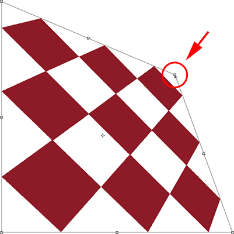
*With Distort, corner handles can be moved independently.*

Dragging a side handle in Distort mode is also similar to Skew in that it will tilt the image or selection, but again, you're given complete freedom of movement, allowing you to both skew and scale the area in a single drag. And yes, holding down **Alt** (Win) / **Option** (Mac) will move the opposite side along with it:

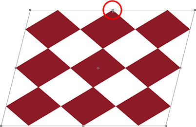
*Drag a side handle with Distort selected to skew and scale the image.*

### Perspective

In **Perspective** mode, dragging a corner handle either horizontally or vertically causes the opposite corner to move in the opposite direction, which can create a pseudo-3D effect. Here, I'm dragging the top left corner inward horizontally. As I drag, the top right corner moves inward as well:

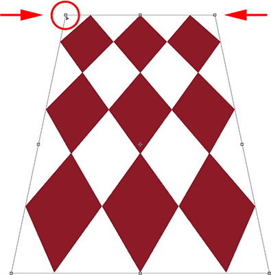
*The top right corner handle moves inward as I drag the top left corner handle inward.*

Then, while still in Perspective mode, I'll drag the bottom left corner outward horizontally, which also moves the bottom right corner outward horizontally:

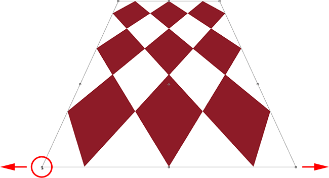
*Perspective mode can create some simple 3D-style effects.*

### Selecting Skew, Distort And Perspective From The Keyboard

With Free Transform active, you can temporarily switch to the Skew, Distort or Perspective modes directly from the keyboard without having to select them from any menu. To switch to either the Skew or Distort mode, just hold down your **Ctrl** (Win) / **Command** (Mac) key as you drag a side or corner handle. To switch to Perspective mode, hold down **Shift+Ctrl+Alt** (Win) / **Shift+Command+Option** (Mac) while dragging a corner handle. Releasing the keys switches you back to the standard Free Transform mode.

### Commit Or Cancel The Transformation

When you're done resizing, reshaping and/or moving the image or selection, press **Enter** (Win) / **Return** (Mac) to accept the transformation and exit out of the transform mode. To cancel the transformation, press the **Esc** key. Or, if you prefer that "official" way of doing things we talked about earlier, you can click the checkmark in the Options Bar to accept or the Ghostbusters symbol to cancel:

*The "Commit" (checkmark) and "Cancel" (circle with the slash through it) icons.*