# Get Over 1000 More Brushes In Photoshop CC 2018

> Source: [https://www.photoshopessentials.com/basics/get-more-brushes-photoshop-cc-2018/](https://www.photoshopessentials.com/basics/get-more-brushes-photoshop-cc-2018/)
> Downloaded and converted to Markdown.

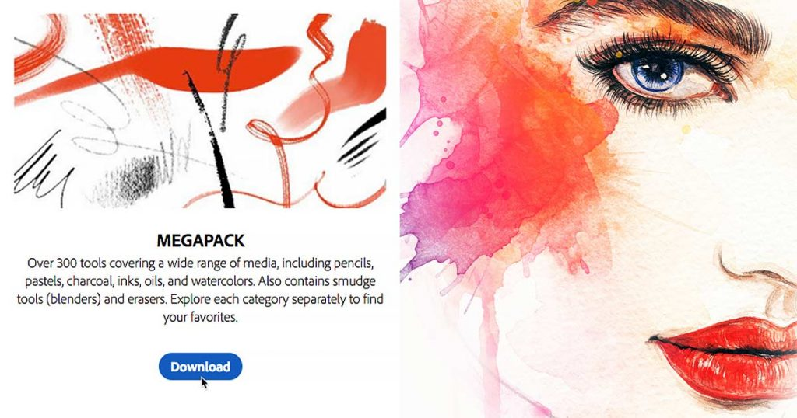

Photoshop CC 2018 replaces the classic brushes from earlier versions of Photoshop with brand new brushes from award-winning illustrator and designer Kyle T. Webster. Yet if you look in the Brushes panel, which is also new in CC 2018, you won't find many brushes to choose from. That's because Photoshop ships with only a sample of these new brushes. There are actually over 1000 new brushes available, including watercolor brushes, spatter brushes, impressionist, manga, and more! And if you're an Adobe Creative Cloud subscriber, you have access to every one of them! All you need to do is download them from Adobe's website and install them into Photoshop. Here's how to get more brushes!

## How To Get More Brushes In Photoshop

### Step 1: Open The Brushes Panel

To download all of the new brushes available in [Photoshop CC 2018](https://prf.hn/l/dlXjD2w), open your Brushes panel by going up to the **Window** menu in the Menu Bar and choosing **Brushes**:

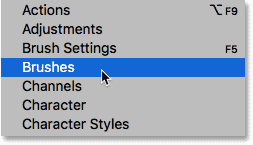

*Going to Window > Brushes.*

#### Photoshop's Default Brushes

By default, the Brushes panel includes four folders, each representing one of four brush sets included with Photoshop. The first set, General Brushes, is where you'll find Photoshop's standard round brushes. But the three sets below it (Dry Media, Wet Media and Special Effects Brushes) are new brush sets from Kyle T. Webster:

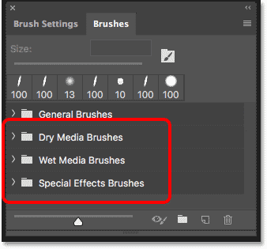

*The new brush sets in the Brushes panel.*

To view the brushes inside a set, click on the arrow to the left of a folder icon to twirl the set open. Here I've opened the Dry Media Brushes set which includes six different brushes. In total, you'll find 20 brushes in the Kyle T. Webster sets:

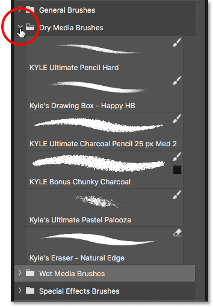

*Twirl a folder open to view the brushes inside.*

### Step 2: Select "Get More Brushes"

To access the more than 1000 additional brushes available to Adobe Creative Cloud subscribers, click the **menu icon** in the upper right corner of the Brushes panel:

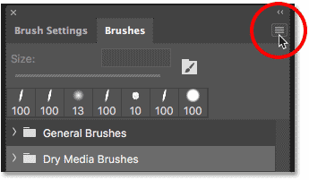

*Opening the Brushes panel menu.*

Then choose **Get More Brushes** from the menu:

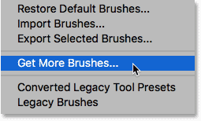

*To get more brushes, choose "Get More Brushes".*

This opens your web browser and takes you to Adobe's website where you'll find links to download 15 different brush sets, all from Kyle T. Webster:

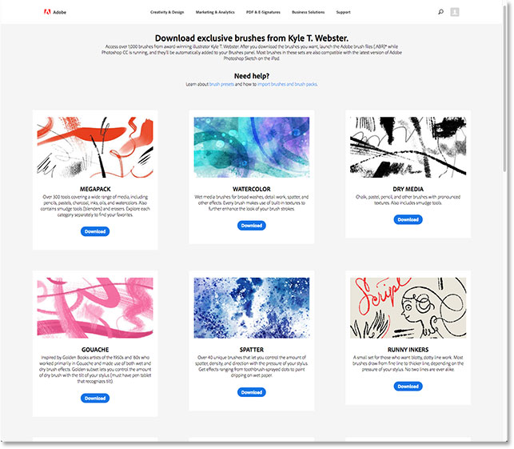

*All of the new brushes are found on Adobe's website.*

### Step 3: Download A Brush Set

To download one of the sets, click its **Download** button. I'll download the MEGAPACK which includes over 300 brushes:

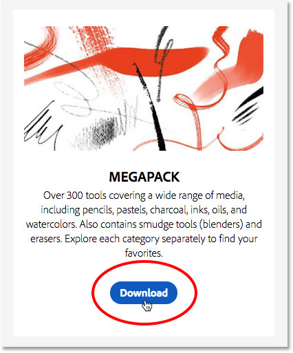

*Downloading one of the brush sets.*

### Step 4: Install The Brushes Into Photoshop

Once the file has downloaded, you'll find it in the "Downloads" folder on your computer. To install the brush set, first make sure that Photoshop is running. Then, double-click on the downloaded file. Brush sets have an ".abr" file extension after their name:

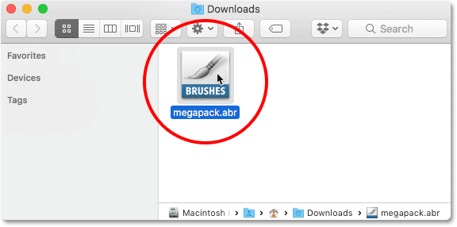

*Double-clicking on the downloaded brush set to install it.*

### Step 5: Select A Brush In The Brushes Panel

Once the brush set has been installed, you'll find it in the Brushes panel in Photoshop. Twirl the folder open to select a brush from the new set:

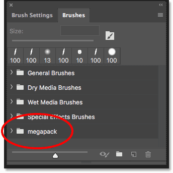

*Installed brush sets automatically appear in the Brushes panel.*

With all 15 brush sets downloaded and installed, you'll have more than 1000 new brushes to try out and experiment with:

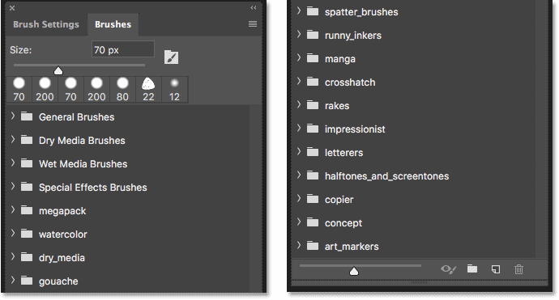

*A split-view of the Brushes panel showing all 15 new brush sets installed.*

And there we have it! That's how to access the entire collection of new brushes available to Adobe Creative Cloud subscribers in Photoshop CC 2018! Looking for the classic brush sets from earlier versions of Photoshop? See our [Legacy Brushes](/basics/restore-legacy-brushes-photoshop-cc-2018/) tutorial to learn how to restore them. And, learn how to save your brushes as [custom brush presets](/basics/save-custom-brush-presets-photoshop-cc2018/)! Visit our [Photoshop Basics](/basics/) section for more Photoshop tutorials!