# Getting to know the Photoshop Interface

> Source: [https://www.photoshopessentials.com/basics/getting-know-photoshop-interface/](https://www.photoshopessentials.com/basics/getting-know-photoshop-interface/)
> Downloaded and converted to Markdown.

Learn all about the Photoshop interface and its features. Topics include the Document window, the Toolbar, the Options Bar, Menu Bar, and Panels. Also covers Workspaces, as well as the new Search feature. For Photoshop CC and CS6.

In this tutorial, we begin our chapter on Photoshop's interface with a quick, general tour of the main features the interface has to offer. There's lots that we can do with Photoshop, and over the years, Photoshop has grown into a massive program. But the interface itself is actually quite simple. In fact, there's really only a handful of sections we need to know about. We'll look at each of them in this tutorial.

We'll start with the **Document window**, the main area where we view and edit our image. Then, we'll look at the **Toolbar** where we find Photoshop's many tools. Directly related to the Toolbar is the **Options Bar**. The Options Bar displays options for the tool we've selected. The **Menu Bar** along the top of the interface holds all sorts of options and commands related to files, image editing, selections, layers, type, and more. And the **panel area** along the right is where we find and use the many panels that Photoshop gives us to work with. We'll take a general look at all of these features here, and cover some of them in more detail in other lessons in this chapter.

We'll also learn about the new **Search** feature that was recently added to Photoshop. And we'll take our first look at **workspaces** and how they customize the appearance of the interface. I'll be using Photoshop CC but this tutorial is also compatible with Photoshop CS6. This is the first of 10 lessons in our [Learning the Photoshop Interface](/basics/learning-the-photoshop-interface/) series.

Let's get started!

## The Photoshop Interface

Here's what the Photoshop interface looks like once we've opened an image. We learned all about opening images in the [previous chapter](/opening-images-photoshop/) in this training series (super adorable photo from [Adobe Stock](https://prf.hn/l/A35npY4)):

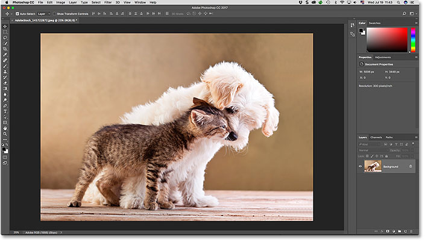
*The Photoshop CC interface. Photo credit: Adobe Stock.*

### The Document Window

The **Document window** is the large area in the center of the interface where the image is displayed. It's also where we edit the image. The actual area where the image is visible is known as the **canvas**. The dark area surrounding the image is the **pasteboard**. The pasteboard doesn't really serve a purpose other than to fill in the space around the image when the image itself is too small to fill the entire Document window:

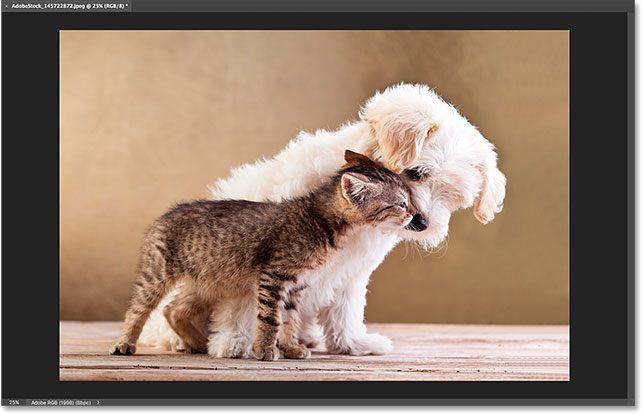
*The Document window displays the image.*

#### The Document Tab

At the top of the Document window is the document's **tab**. The tab displays the **name** and **file type** of the document ("AdobeStock_145722872.jpeg") and its current **zoom level** (25%). The tab is also how we switch between document windows when we have more than one image open in Photoshop. We'll learn more about working with multiple documents in another lesson:

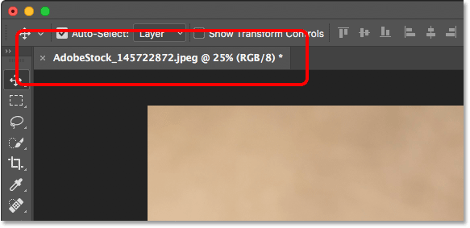
*The Document window tab.*

#### The Zoom Level And Status Bar

In the bottom left of the Document window, we find more information about the image. The current **zoom level** is displayed, just like it is in the document's tab. And to the right of the zoom level is the **Status Bar**. By default, the Status Bar displays the **color profile** of the image. In my case, it's Adobe RGB (1998). Yours may say something different, like sRGB IEC61966-2.1. We learned about color profiles in the [Essential Photoshop Color Settings](/basics/color-settings/) tutorial back in [Chapter 1:](/photoshop-getting-started/)

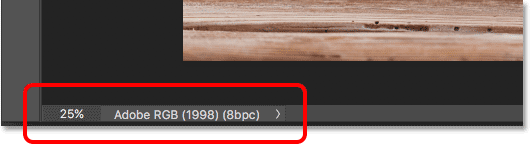
*The document's current zoom level (left) and the Status Bar (right).*

Click and hold on the Status Bar to view additional information about the image, like its Width and Height, Resolution, and color information (Channels):

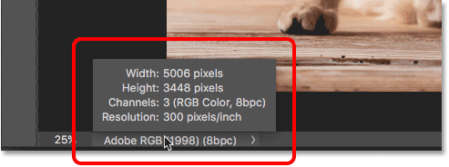
*The Status Bar displays more info about the image when you click and hold on it.*

You can also change the type of information that the Status Bar displays. Click on the **arrow** on the right of the Status Bar to open a menu where you can choose to view different details, like Document Sizes (the file size) or Dimensions (the width, height and resolution). I'll leave it set to the default, Document Profile:

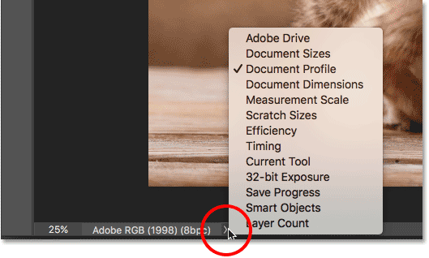
*Use the Status Bar to view many types of information about your document.*

### The Toolbar

The **Toolbar** (also known as the Toolbox or the Tools panel) is where Photoshop holds all of its tools. You'll find it along the left of Photoshop's interface. There's tools for making selections, for editing and retouching images, for painting, adding type or shapes to your document, and more:

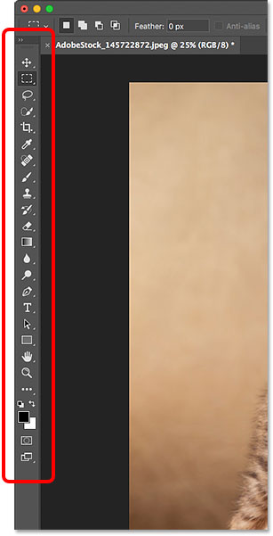
*The Toolbar in Photoshop.*

#### Expanding The Toolbar

By default, the Toolbar appears as a long, single column of tools. Clicking the **double-arrows** at the top will expand the Toolbar into a shorter, double column. Click the arrows again to return to the single-column layout:

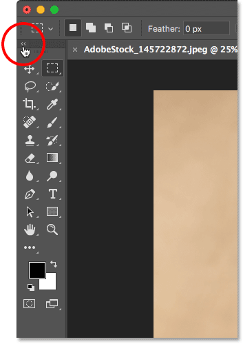
*The Toolbar can be viewed as a single (default) or double column.*

#### The Toolbar's Hidden Tools

Photoshop includes lots of tools. In fact, there are many more tools than what we see. Most of the tools in the Toolbar have other tools nested in with them in the same spot. Click and hold on a tool's icon to view a menu of the other tools hiding behind it.

For example, by default, the [**Rectangular Marquee Tool**](/basics/selections/rectangular-marquee-tool/) is selected. It's the second tool from the top. If I click and hold on the Rectangular Marquee Tool's icon, a fly-out menu appears. The menu shows me that the [**Elliptical Marquee Tool**](/basics/selections/elliptical-marquee-tool/), the **Single Row Marquee Tool** and the **Single Column Marquee Tool** can also be selected from that same spot. We'll learn more about the Toolbar in the next tutorial, and we'll learn how to use Photoshop's tools in other lessons throughout this training series:

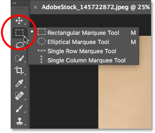
*Most of the spots in the Toolbar hold several tools, not just one.*

### The Options Bar

Directly linked to the Toolbar is Photoshop's **Options Bar**. The Options Bar displays options for whichever tool we've selected in the Toolbar. You'll find the Options Bar along the top of the interface, just above the document window. Here we see that, because I currently have the Rectangular Marquee Tool selected, the Options Bar is showing options for the Rectangular Marquee Tool:

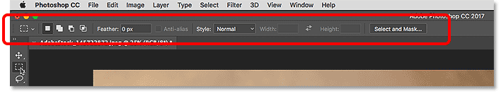
*Options for the selected tool appear in the Options Bar.*

If I choose a different tool from the Toolbar, like the **Crop Tool**:

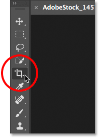
*Selecting the Crop Tool.*

Then the options in the Options Bar change. Instead of seeing options for the Rectangular Marquee Tool, we're now seeing options for the Crop Tool:

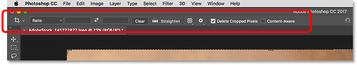
*The Options Bar updates each time a new tool is selected.*

### The Menu Bar

Along the very top of Photoshop's interface is the **Menu Bar**. The Menu Bar is where we find various options and commands, all grouped into categories. The **File** menu, for example, holds options for opening, saving and closing documents. The **Layer** menu lists options for working with layers. Photoshop's many filters are found under the **Filter** menu, and so on. We won't go through every category and menu item here, but we'll learn all about them in future lessons as they become important. Note that the "Photoshop CC" category on the left of the Menu Bar in the screenshot is only found in the Mac version of Photoshop:

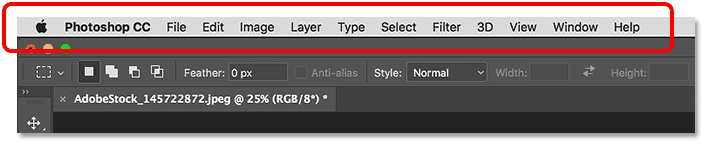
*The Menu Bar runs along the top of Photoshop.*

### The Panels

Along the right of Photoshop's interface is where we find the **panels**. Panels give us access to all sorts of commands and options, and there are different panels for different tasks. The most important panel is the [Layers panel](/basics/layers/layers-panel/). It's where we add, delete and work with layers in our document. But there are lots of other panels as well, all of which we'll be looking at later:

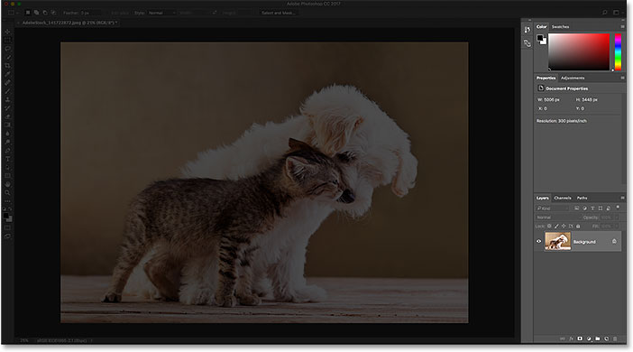
*The panels are located in a column along the right of Photoshop.*

#### Panel Groups

To save space on the screen, Adobe groups related panels together. For example, let's look at the Layers panel. Just like the Document window, each panel has a **tab** at the top which displays the panel's name. Notice, though, that there are two other tabs to the right of the Layers tab. One says **Channels** and the other says **Paths**. These are other panels that are nested in with the Layers panel in the same **panel group**. The name of the panel that's currently open in the group (in this case, the Layers panel) appears brighter than the others:

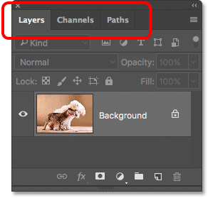
*The Layers panel is one of three panels in the group.*

### Switching Between Panels In A Group

To switch to a different panel in a group, click on its tab. Here, I've opened the Channels panel. To switch back to the Layers panel, again click on its tab:

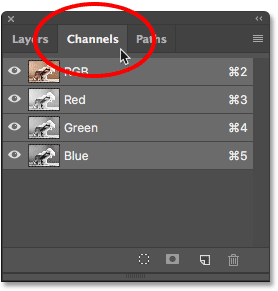
*Click the tabs in a group to switch between the panels.*

#### Where To Find More Panels In Photoshop

By default, only a handful of panels are displayed at first. But there are many more panels available to us in Photoshop. You'll find the complete list of panels under the **Window** menu in the Menu Bar:

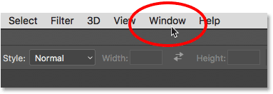
*Selecting the Window category in the Menu Bar.*

The panels are listed in a long, single column. I've split the column in half here just to help it fit better on the page. To select a panel, click on its name in the list. A checkmark to the left of a panel's name means that the panel is already open. Selecting a panel that's already open will close it.

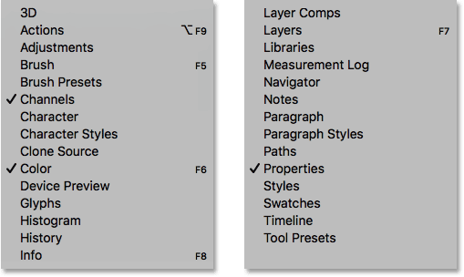
*All of Photoshop's panels can be accessed from the Window menu.*

### The Search Bar

New in Photoshop CC is the **Search bar**. The Search bar lets us quickly find tools or commands in Photoshop, as well as tutorials on different topics, or images from Adobe Stock. To use the Search feature, click on the **Search icon** (the magnifying glass) in the upper right of Photoshop. You'll find it just above the panel column. If you're using Photoshop CC but you're not seeing the Search icon, make sure your copy of Photoshop is [up to date](/basics/update-photoshop-cc/):

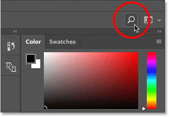
*Clicking the Search icon (only available in Photoshop CC).*

Clicking the icon opens the Search bar. Enter your search term at the top. For example, I'll enter "Crop". The Search bar then expands to show you the results. Here, we see that searching for "Crop" found Photoshop's **[Crop Tool](/photo-editing/crop-images-non-destructively-photoshop-cc/)** and the **[Perspective Crop Tool](/photo-editing/perspective-crop-tool-cs6/)**. It also found the **[Crop and Straighten Photos](/photo-editing/crop-straighten/)** command, the **Trim** command and the **Crop** command. Click on any tool or command in the list to quickly select it. Below the tools and commands is a tutorial from Adobe on how to [crop](/photo-editing/how-to-crop-images-photoshop-cc/) and [straighten photos](/photo-editing/how-to-rotate-and-straighten-images-in-photoshop-cc/), as well as images related to "Crop" on Adobe Stock (although farming crops isn't really what I had in mind). Clicking on a tutorial or an image will launch your web browser and take you to the Adobe or Adobe Stock website.

Directly below your search term at the top is a menu allowing you to limit the type of results. By default, **All** is selected. To limit the results to just Photoshop's tools, panels and commands, choose **Photoshop**. For tutorials on your search term, choose **Learn**. And to view only images from Adobe Stock, choose **Stock**:

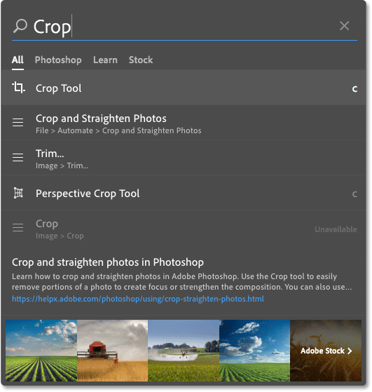
*Use the Search feature to quickly find what you're looking for.*

### Workspaces

Finally, let's look at workspaces. A **workspace** in Photoshop is a preset collection and arrangement of the various interface elements. Workspaces can control which of Photoshop's panels are displayed on the screen, along with how those panels are arranged. A workspace can change the layout of the tools in the Toolbar. Items in the Menu Bar, along with keyboard shortcuts, can also be customized as part of a workspace.

By default, Photoshop uses a workspace known as **Essentials**. The Essentials workspace is a general, all-purpose workspace, with an interface layout that's suitable for many different types of tasks. But there are other workspaces to choose from as well. We can switch between workspaces using the **Workspace** option in the upper right of Photoshop. In Photoshop CC, the Workspace option is represented by an icon. In Photoshop CS6, it's a selection box, with the name of the currently-selected workspace displayed in the box:

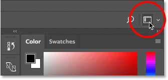
*The Workspace icon in Photoshop CC.*

Click on the icon (or the selection box) to open a menu of other workspaces we can choose from. Photoshop includes several built-in workspaces. Each one customizes the interface for a specific type of work. As I mentioned, Essentials is a general, all-purpose workspace. If you're a web designer, you may want to switch to the **Graphic and Web** workspace. For image editing, the **Photography** workspace is a good choice. Keep an eye on your panels and on your Toolbar as you switch between workspaces to see what's changing.

We'll look more closely at workspaces, including how to create and save your own custom workspaces, in another tutorial. Note that all of our tutorials use the default Essentials workspace, so I recommend sticking with Essentials as you're learning Photoshop:

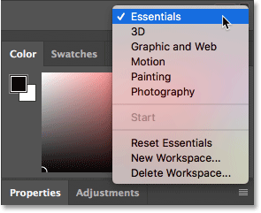
*Use the Workspace menu to easily switch between workspaces.*