# The Hidden Recent Files Panel In Photoshop CC

> Source: [https://www.photoshopessentials.com/basics/hidden-recent-files-panel-photoshop-cc/](https://www.photoshopessentials.com/basics/hidden-recent-files-panel-photoshop-cc/)
> Downloaded and converted to Markdown.

In this tutorial, we'll learn all about the hidden **Recent Files panel** in Photoshop CC and how it can help us when viewing and selecting our recently-opened files.

In a previous tutorial, we learned all about the Start screen in Photoshop. I mention it here because the Start screen and the Recent Files panel are very much related. If you haven't done so already, I highly recommend reading through the [Start screen tutorial](/basics/updated-start-workspace-photoshop-cc/) first before you continue.

The Start screen appears when we launch Photoshop CC, and it also appears when we close out of our documents. Along with options for creating new documents and opening existing images, one of the best features of the Start screen is that it conveniently displays our recent files as **thumbnail images**, making it easy to select and re-open the one we need.

Here's what my Start screen looks like after launching Photoshop, with my Recent Files thumbnails in the center. To re-open one of my recent files, all I need to do is click on its thumbnail. I'll select the second one from the left, top row:

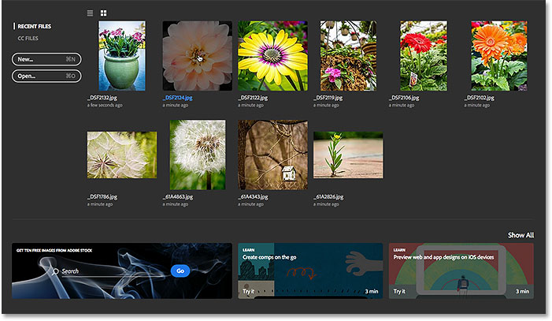
*Selecting an image from the Recent Files list.*

The image opens in Photoshop:

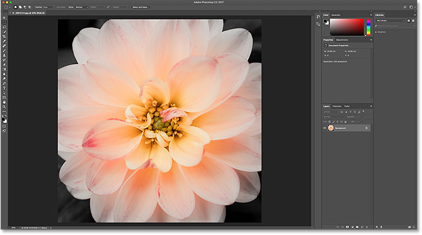
*The first image opens. © Steve Patterson.*

So far, so good. I've opened my first image. Now, what if I want to keep this first image open while I open a *second* image, one that's also from my Recent Files list? How do I get back to the Start screen so I can view my Recent Files thumbnails and choose a different image?

The simple answer is, I can't. At least, not without closing the image I've already opened. The reason is that the Start screen only appears when no other documents are open. To get back to the Start screen, and back to my Recent Files thumbnails, I have no choice but to close my current image.

The only way to access my recent files without closing my current image, at least by default, is by going up to the **File** menu in the Menu Bar along the top of the screen and choosing **Open Recent**. This displays my recent files as a list. But the problem is, they appear in the list only by name. If I don't remember the name of the image I'm looking for, I have no idea which one to select. We saw this same problem when we looked at [how to work with the Start screen disabled in Photoshop](/basics/disable-start-workspace-photoshop-cc/):

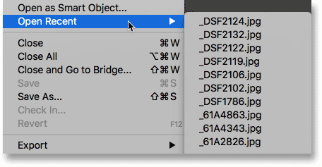
*The Open Recent command displays our recent files by name only.*

Wouldn't it be great if there was some way to view our recent files as thumbnails without needing to get back to the Start screen? Luckily, there *is* a way thanks to Photoshop's **Recent Files workspace**!

### How To Turn On The Recent Files Workspace

By default, the Recent Files workspace is turned off, but we can easily turn it on in Photoshop's Preferences. On a Windows PC, go up to the **Edit** menu at the top of the screen, choose **Preferences**, and then choose **General**. On a Mac (which is what I'm using here), go up to the **Photoshop CC** menu, choose **Preferences**, then choose **General**:

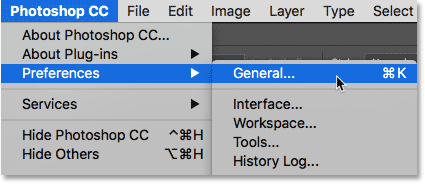
*Go to Edit (Win) / Preferences (Mac) > Preferences > General.*

This opens the Preferences dialog box set to the General options. Look for the option that says **Show "Recent Files" Workspace When Opening A File**. Click inside its checkbox to enable it:

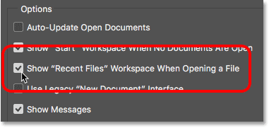
*Selecting 'Show "Recent Files" Workspace When Opening A File'.*

You'll need to quit and relaunch Photoshop for the change to take effect. To quit Photoshop, on a Windows PC, go up to the **File** menu and choose **Exit**. On a Mac, go up to the **File** menu and choose **Quit Photoshop CC**:

*Go to File > Exit (Win) / File > Quit Photoshop CC (Mac).*

Then, relaunch Photoshop the same way you normally would. Things won't look any different at first. Here, we see that I'm once again presented with the Start screen, just as I was before. I'll reselect the same image to open by clicking on its thumbnail in the Recent Files list:

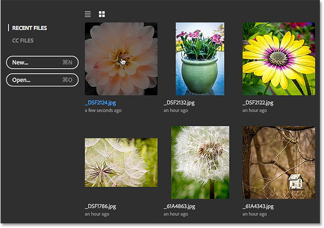
*Selecting the same image as last time.*

And here we see that the image has opened once again:

*The first image re-opens.*

### The Recent Files Panel

Now that I've enabled the Recent Files workspace, how can I view my recent files not as a name-only list but as thumbnails?

With the Recent Files workspace enabled, instead of viewing our recent files by going up to the File menu and choosing Open Recent like we did a moment ago, this time go up to the **File** menu and choose **Open**. Or, use the keyboard shortcut, **Ctrl+0** (Win) / **Command+0** (Mac):

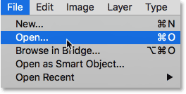
*Going to File > Open.*

As you do, keep an eye on the **panels** along the right of Photoshop's interface. I've dimmed the rest of the interface to make the panel area easier to see:

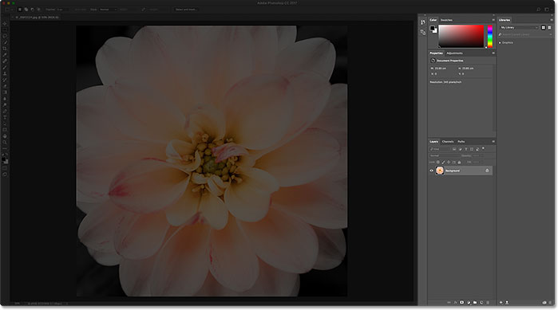
*Watch the panels along the right.*

Normally when we choose the Open command, it opens File Explorer on a Windows PC or Finder on a Mac, which we then use to navigate to the image we want to open. But when we choose the Open command with the Recent Files workspace enabled, all of the panels along the right disappear and are replaced with the **Recent Files panel**:

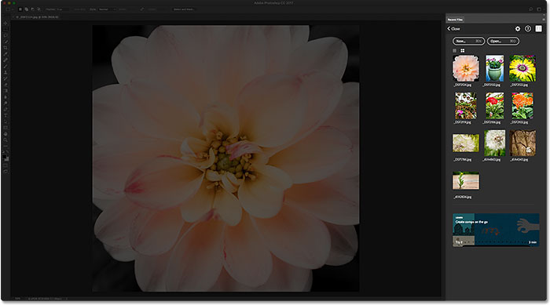
*The Recent Files panel appears in place of Photoshop's other panels.*

The Recent Files panel is essentially a mini Start screen, giving us quick access to most of the same options we'd find on the [actual Start screen](/basics/updated-start-workspace-photoshop-cc/). Along the top, we have a **New...** button for creating new Photoshop documents, and an **Open...** button for opening images that are not found in our Recent Files list:

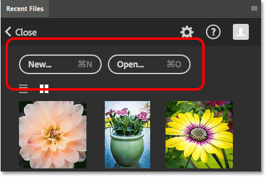
*The Recent Files panel includes the same New... and Open... buttons from the Start screen.*

There's even a **tile** along the bottom with content that changes over time, offering tutorials or downloadable assets, just like the tiles we find on the main Start screen. Clicking the tile will open your web browser and take you to Adobe's website where you'll find more information on the topic:

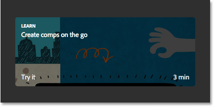
*Both the Start screen and the Recent Files panel include tiles with dynamically-changing content.*

But the main feature of the Recent Files panel is that it displays our recent files as **thumbnails**, just like we find on the actual Start screen. Depending on how many recent files you have, you may need to scroll through them. To re-open a file, just click on its thumbnail:

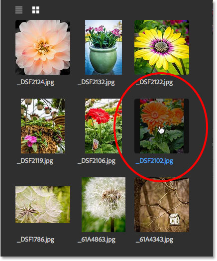
*Selecting an image to re-open in the Recent Files panel.*

And here, we see that my selected image opens in Photoshop:

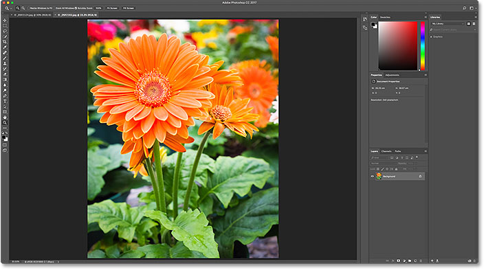
*The second image opens. © Steve Patterson.*

Notice that as soon as the image opens, the Recent Files panel disappears and Photoshop's original panels return:

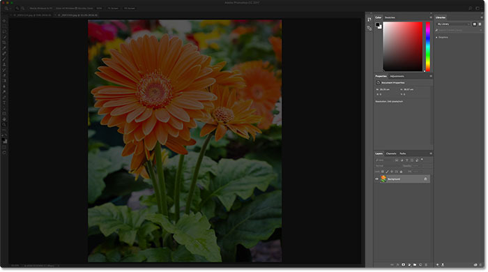
*The Recent Files panel closes when the selected image opens.*

Notice also that because I didn't need to close my original image to get to the Recent Files panel, I now have both images open at the same time, each in its own document. To switch back to my first image, all I need to do is click on its **tab** above the documents:

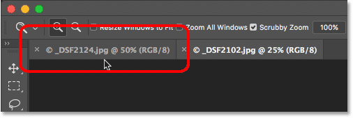
*Switch between open documents by clicking the tabs.*

And now the first image I opened re-appears:

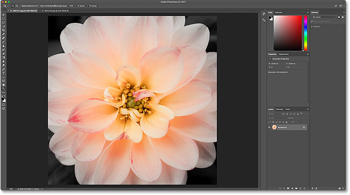
*Back to viewing the original image.*

### How To Turn Off The Recent Files Panel

Even though the Recent Files workspace in Photoshop CC is disabled by default, it can actually be very useful, especially if you need to re-open recent files on a regular basis. But if you want to turn it off, just press **Ctrl+K** (Win) / **Command+K** (Mac) on your keyboard to quickly return to Photoshop's General Preferences.

Then, uncheck the same **Show "Recent Files" Workspace When Opening A File** option to disable it. You'll again need to quit and relaunch Photoshop for the change to take effect:

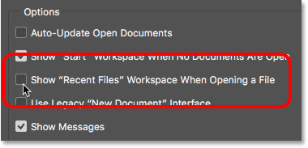
*Uncheck the 'Show "Recent Files" Workspace When Opening A File' option to turn it off.*