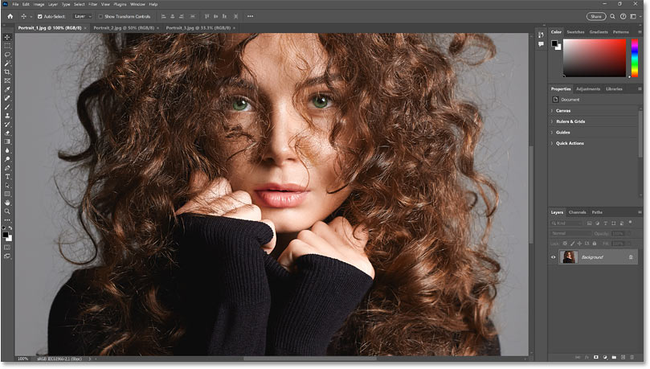
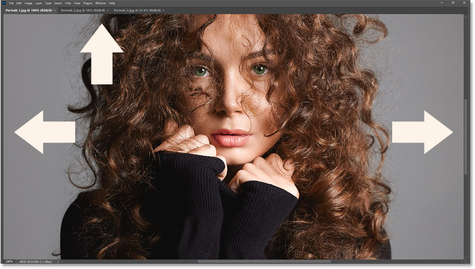
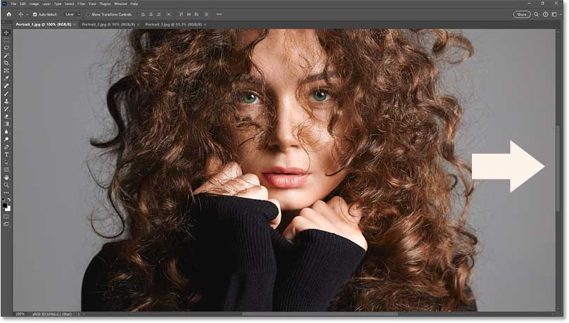
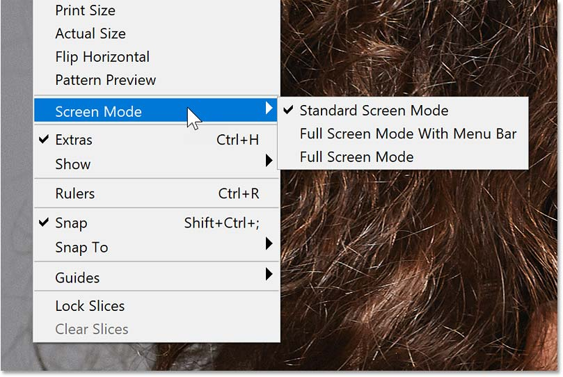
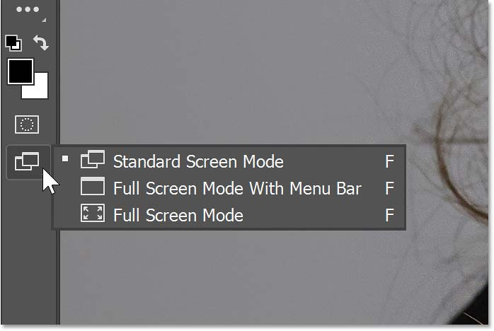
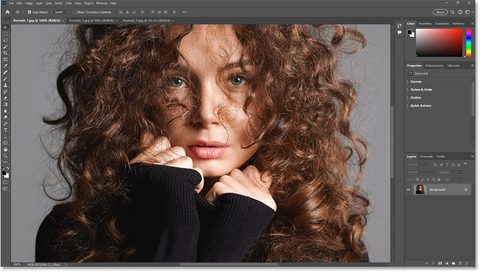
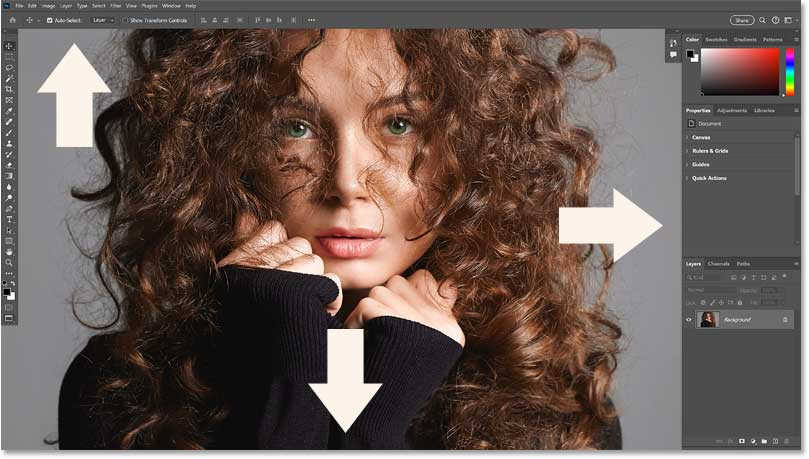
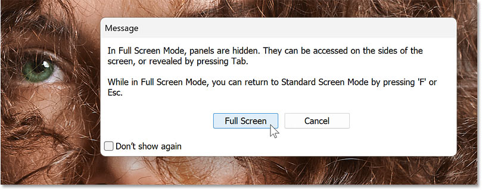
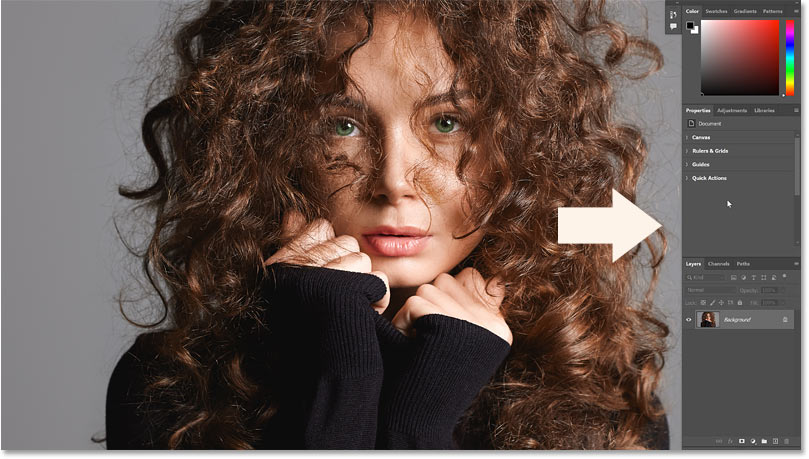

# Hide Photoshop with Screen Modes and Interface Tricks

> Source: [https://www.photoshopessentials.com/basics/hide-photoshop-with-screen-modes-and-interface-tricks/](https://www.photoshopessentials.com/basics/hide-photoshop-with-screen-modes-and-interface-tricks/)
> Downloaded and converted to Markdown.

Learn how to use Photoshop's screen modes and other tricks to hide the Photoshop interface and see more of your image as you work. For Photoshop 2025 and earlier.

Wish there was a way to see less of Photoshop’s interface and more of your image? In this tutorial, you learn how to take advantage of Photoshop’s screen modes, along with some some simple keyboard tricks, to hide the toolbar, the Options Bar, the panels and more.

I even show you how to work in Photoshop’s Full Screen Mode which hides the interface completely, allowing your image to take up the entire screen. You learn how to show just the interface elements you need, and then how to exit Full Screen Mode and return to the standard interface.

### Which Photoshop version do I need?

I'm using [Photoshop 2025](https://adobe.prf.hn/click/camref:1100lrdjJ/destination:https%3A%2F%2Fwww.adobe.com%2Fproducts%2Fphotoshop.html) but everything we'll cover in this tutorial works with any recent version.

Let's get started!

### The document setup

To follow along, go ahead and open any image in Photoshop. 

I’ll use [this image](https://prf.hn/l/YLv5xwy) from Adobe Stock.

*Opening an image in Photoshop.*

## Hide Photoshop’s interface from the keyboard

Let’s start with the keyboard shortcuts you can use to hide parts of [Photoshop’s interface](/basics/getting-know-photoshop-interface/) as you work.

Here’s a quick summary of the shortcuts:

- Press **Tab** (on both Windows and Mac) to hide Photoshop’s **toolbar**, **Options Bar** and **panels**.
- Press **Shift+Tab** (Windows and Mac) to hide just the **panels** along the right.
- Press the shortcut again to show those interface elements.

**Tip:** To take advantage of the extra screen space, hold the **spacebar** on your keyboard to temporarily access Photoshop’s [Hand Tool](/basics/photoshop-zoom/) and reposition your image.

In this screenshot, the [toolbar](/basics/photoshop-tools-toolbar-overview/) along the left, the Options Bar at the top and the [panels](/basics/managing-panels-photoshop-cc/) along the right are all hidden after pressing Tab. Pressing Tab again would bring them back.

*Press Tab to hide the tools, Options Bar and panels.*

And here, the panels along the right are hidden (the toolbar and Options Bar remain visible) after pressing Shift+Tab. Press Shift+Tab again to show the panels.

*Press Shift+Tab to hide the panels.*

## Using Photoshop’s screen modes to hide the interface

Photoshop also includes three **screen modes** that change the visibility of the interface:

- Standard Screen Mode
- Full Screen Mode With Menu Bar
- Full Screen Mode

Standard Screen Mode is the default mode and displays the entire interface. The opposite is Full Screen Mode which hides the interface completely, while Full Screen Mode With Menu Bar falls somewhere in between.

### Where to find the screen modes

Photoshop’s screen modes can be accessed from the **Menu Bar**, the **toolbar** or by using a **keyboard shortcut**.

In the Menu Bar, go to **View** > **Screen Mode** to switch between Standard, Full Screen With Menu Bar and Full Screen.

*Go to View > Screen Mode.*

Or in the toolbar, press and hold the **Screen Mode** icon (at the bottom) to choose a screen mode from the menu.

Notice that all three screen modes share the letter **F** as their keyboard shortcut, so you can cycle between them from the keyboard. 

**Tip:** To cycle backwards through the screen modes from your keyboard, press **Shift+F**.

*The screen mode options in the toolbar.*

## Standard Screen Mode

In Standard Screen Mode (the default mode), Photoshop’s entire interface is visible. This includes:

- the **toolbar** on the left,
- the **Menu Bar** along the top,
- the **Options Bar** below the Menu Bar, and
- the **panels** along the right.

Standard Screen Mode also includes interface elements related to the document window itself, including:

- the **tab area** above the image,
- the **scroll bars** on the right and bottom of the image, and
- the **Status Area** in the lower left corner (which shows information about the document).

*Photoshop’s Standard Screen Mode.*

## Full Screen Mode With Menu Bar

In Full Screen Mode With Menu Bar, all of the interface elements related to the document window itself disappear:

- the **tab area**,
- the **scroll bars**, and
- the **Status Area**

But the main interface elements (the toolbar, Menu Bar, Options Bar and panels) remain. Again you can take advantage of the extra space by holding the **spacebar** to access the **Hand Tool** and dragging your image to reposition it.

*Full Screen Mode With Menu Bar hides the document window elements.*

## Full Screen Mode

In Full Screen Mode, Photoshop’s interface is hidden completely, allowing your image to take up the entire screen. 

But when you select Full Screen Mode either from the Menu Bar or the toolbar, Photoshop may first display a warning that the interface will be hidden. Since that’s what we want, click the **Full Screen** button to accept it.

*Photoshop’s warning that the interface is about to disappear.*

Then in Full Screen Mode, hold the **spacebar** to access the **Hand Tool** and drag your image to reposition it.

*The image fills the screen in Full Screen Mode.*

## How to access Photoshop’s interface in Full Screen Mode

Even in Full Screen Mode, it’s easy to access the interface from the keyboard when you need it.

- Press **Tab** to show the **toolbar**, the **Options Bar** and the **panels**.
- Press **Shift+Tab** to show just the **panels** along the right.
- Press the shortcut again to hide the interface.

Also in Full Screen Mode, if you hover your mouse cursor near the **left edge** of the screen, you’ll show the **toolbar** so you can switch to a different tool. Then move away from the edge to hide the toolbar.

*Hover near the left edge to reveal the toolbar.*

Or hover your cursor near the **right edge** of the screen to show the **panels**. Then move away from the edge to hide them.

*Hover near the right edge to reveal the panels.*

## How to cycle through open documents in Full Screen Mode

If you have multiple documents open in Photoshop, you can cycle through them from the keyboard.

- Press **Ctrl+Tab** to cycle forward from one document to the next.
- Press **Ctrl+Shift+Tab** to cycle backwards through your documents.

## How to exit Full Screen Mode

To exit Full Screen Mode and return to Standard Screen Mode, you can either:

- press the **Esc** key, or
- press **F**.

## How to jump straight to Full Screen Mode from Standard Mode

Finally, you can jump directly from Standard Screen Mode to Full Screen Mode from your keyboard, without needing to go through Full Screen Mode With Menu Bar to get there.

- In Standard Screen Mode, press **Shift+F** to jump to Full Screen Mode.
- Then in Full Screen Mode, press **F** to jump back to Standard Screen Mode.

And there we have it! That’s how to view all, some or none of the interface using screen modes and keyboard tricks in Photoshop.