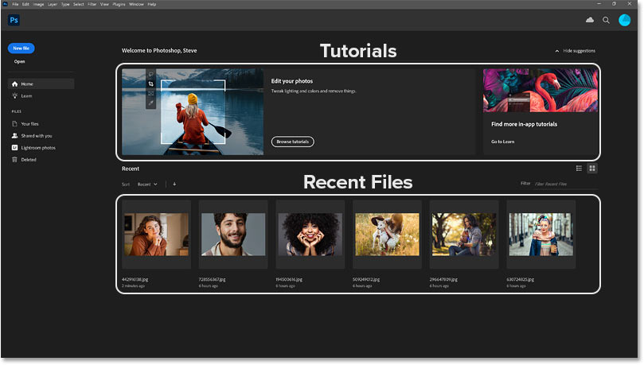
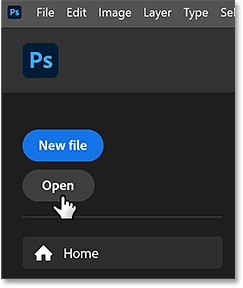
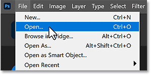
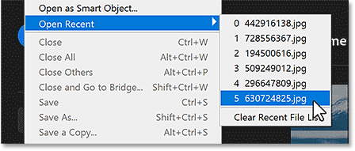
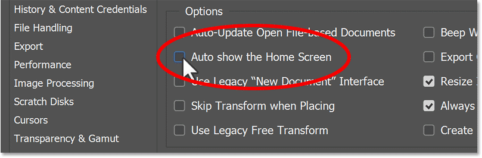
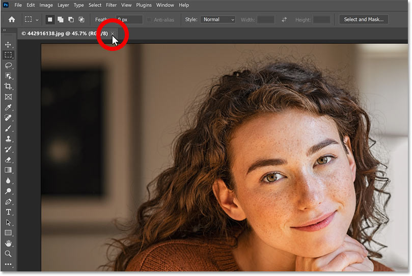
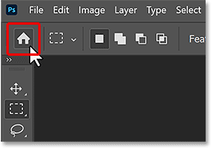
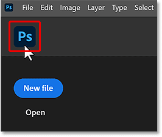

# How to Hide the Home Screen in Photoshop

> Source: [https://www.photoshopessentials.com/basics/hide-the-home-screen/](https://www.photoshopessentials.com/basics/hide-the-home-screen/)
> Downloaded and converted to Markdown.

Learn how (and why) to stop Photoshop's Home Screen from displaying automatically, and how to show the Home Screen again when you need it.

Photoshop’s Home Screen appears every time we launch Photoshop on its own without opening an image or a file. The Home Screen also appears when we close a document and have no other documents open.

You’ll know you’re on the Home Screen because it looks very different from the usual Photoshop interface. A **tutorials area** along the top and **Recent Files thumbnails** below it are the two most prominent features.

*Photoshop's Home Screen.*

## The problem with Photoshop’s Home Screen

But the main purpose of the Home Screen is to use the **New File** or **Open** buttons in the upper left to either [create a new Photoshop document](/basics/create-new-documents-photoshop-cc/ "How to create a new document in Photoshop") or [open an existing file](/basics/open-images-photoshop-cc/ "How to open images in Photoshop").

*The Home Screen’s New file and Open buttons.*

The problem is, we can already do that in Photoshop just by going to the **File** menu and choosing the **New** or **Open** commands.

*The File menu’s New and Open commands.*

We can even access our recent files from here.

*The file menu’s Recent Files list.*

## How to hide the Home Screen

Since there’s not much you can do on the Home Screen that you can’t do without it, here’s how to stop the Home Screen from displaying automatically when you launch Photoshop. I’ll then show you how to access the Home Screen when you need it.

### 1. Open Photoshop’s Preferences

- **Windows**: Go to Edit > Preferences > General
- **Mac**: Go to Photoshop > Settings > General

### 2. Turn off Auto-show

- Look for the **Auto show the Home Screen** option and uncheck it.
- Click OK to save your changes and close the Preferences dialog box.

*Uncheck "Auto show the Home Screen".*

### 3. Open and close a file

Even after turning Auto-show off, the Home Screen will continue to appear until you open and close a document. 

So to commit the change:

- Create a new Photoshop document or open an existing file.
- Close the document.

*Open and close a Photoshop document to commit the change.*

That’s it! Photoshop will now open in the standard workspace and the Home Screen will not appear.

## How to show the Home Screen

You can still open the Home Screen at any time from within Photoshop’s standard workspace. One reason you may want to is to see the Recent Files thumbnails.

To switch to the Home Screen from the standard workspace, click the **Home button** in the upper left.

*The Home button takes you to the Home Screen.*

Then to return to the standard workspace from the Home Screen without opening a file, click the **Photoshop icon** in the upper left.

*The Photoshop icon takes you back to the main interface.*

And there we have it! That’s how to hide (and show) the Home Screen in Photoshop.