# How to Avoid Losing Your Original Images in Photoshop

> Source: [https://www.photoshopessentials.com/basics/how-to-avoid-losing-your-original-images-in-photoshop/](https://www.photoshopessentials.com/basics/how-to-avoid-losing-your-original-images-in-photoshop/)
> Downloaded and converted to Markdown.

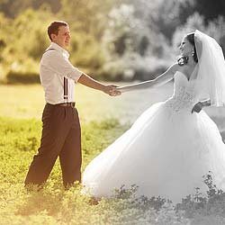

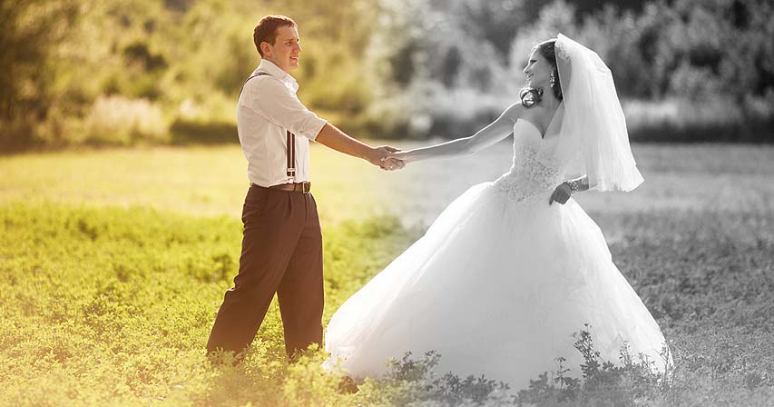

In this tutorial, I share a few simple but important tips you can use to keep your images safe and avoid overwriting and losing the original files when working in Photoshop!

Recently, I was contacted by someone who had used Photoshop to convert a color photo to black and white, which is great. But now, they needed the original full color version back, and they were not sure where to find it. This person was fairly new to Photoshop, and as it turned out, they made the unfortunate mistake of saving the black and white version over top of the original JPEG file. And since they did not know how to work non-destructively, they made all of their edits in Photoshop directly to the image. Which meant that once they closed Photoshop, the original color photo was lost forever. There was no way to bring it back.

For me, there is no worse feeling than having to give someone bad news. So I thought I would share some tips you can use to avoid making a similar mistake and keep your original images safe as you edit them in Photoshop. The first is a stand-alone tip to avoid overwriting the original image file. The other three tips are all related and show you how to work on your image non-destructively, so you'll not only protect the original image, but you'll have an easy way to restore it if you need to!

For best results, you'll want to be using the [latest version of Photoshop](https://prf.hn/l/dlXjD2w), but you can also follow along with an earlier version.

Let's get started!

## Tip #1: Save a copy of your image

This first tip for keeping your image safe is one that anyone can use, even if you're brand new to Photoshop. As soon as you've opened your image, and before you do anything else, save the image as a copy.

Here's an image I just opened ([wedding photo](https://prf.hn/l/QxRemAR) from Adobe Stock):

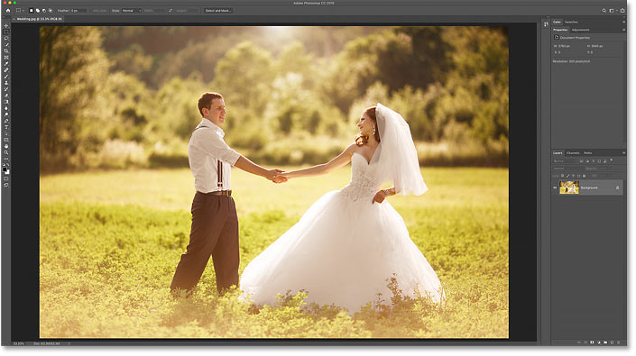
*The original image. Photo credit: Adobe Stock.*

And in the **tab** at the top of the document, we see the file's name. In my case, it's "Wedding.jpg":

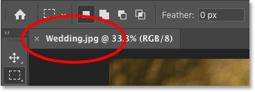
*The file name appears in the document's tab.*

If I make any changes to the image at this point, and then I save my changes by going up to the File menu in the Menu Bar and choosing Save, I'm going to overwrite this original file. Obviously, that would be bad. But an easy way to avoid overwriting the file is to save the image as a *copy*. Here's how to do it.

### How to save the image as a copy

Go up to the **File** menu and choose **Save As**:

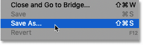
*Going to File > Save As.*

In the dialog box, give the file a different name, or just add something like "_copy" to the existing name. Then click **Save**:

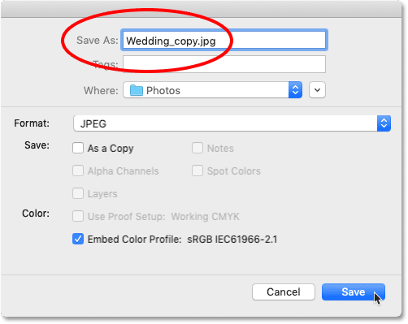
*Adding "_copy" to the original file name.*

If you're working with a [JPEG file](/essentials/jpeg-compression/), Photoshop will pop open the JPEG Options dialog box. For best results, choose **Maximum** quality, and under the Format Options, choose **Baseline Optimized**. Then click OK:

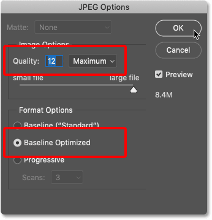
*Choosing the highest quality JPEG options.*

And now if we look in the [document's tab](/basics/tabbed-and-floating-documents-in-photoshop/), we see that the original file name ("Wedding.jpg") has been replaced with the name of the copy ("Wedding_copy.jpg"). This means that we're now working with the copy of our image, and the original is safe. When we're done editing the image and we save it, we'll be saving over the copy, not the original:

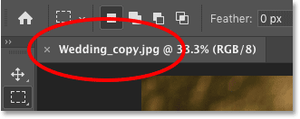
*All editing will now be done on a copy of the image.*

### Editing the image

I'll make a quick edit to my image by going up to the **Image** menu, choosing **Adjustments**, and then choosing **Desaturate**:

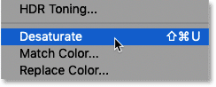
*Going to Image > Adjustments > Desaturate.*

This is not the best way to convert an image to black and white, but it's good enough for our purposes here:

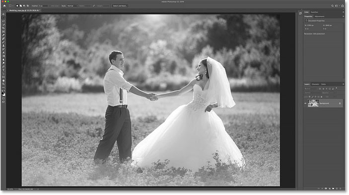
*The image after desaturating the color.*

### Saving and closing the document

Then I'll save my work by going up to the **File** menu and choosing **Save**:

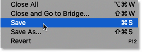
*Going to File > Save.*

Now if I was still working with my original image, then saving my change would have overwritten the original file. And if I was to close the document at this point, the original would be lost forever. But since I'm working on a copy, the change was saved with the copy while the original file remains safe.

I'll close the document by going up to the **File** menu and choosing **Close**:

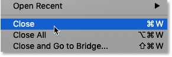
*Going to File > Close.*

### Reopening the original image

In Photoshop CC, closing a document when no other documents are open returns us to the **Home Screen** where we see thumbnails of our recently-opened files:

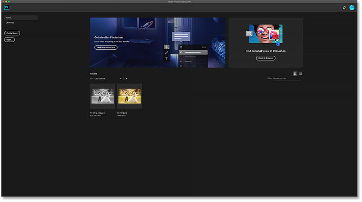
*The Home Screen in Photoshop CC.*

Notice that the copy of the image on the left appears in black and white, since that's the file where I saved my changes. But the original file on the right is still in color. I'll reopen the original by clicking its thumbnail:

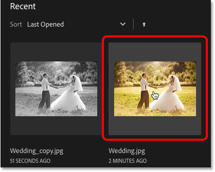
*Clicking the thumbnail to reopen the original image.*

And just like that, the original image reopens in Photoshop with all of its color still intact:

*The original full color image returns.*

## Tip #2: Save your file as a Photoshop document

The first tip we looked at for keeping your original images safe was a stand-alone tip. Just save the file as a copy, and then any time you save the image again, you'll overwrite the copy, not the original.

This second tip is similar to the first one. But rather than saving a copy and using the JPEG format, we're going to save the original file as a [Photoshop document](/basics/create-new-documents-photoshop-cc/). Now on its own, a Photoshop document will not prevent you from overwriting your original image. But by combining it with the next couple of steps we're going to look at, you'll have an easy way to restore the original image if you do happen to lose it.

### How to save the image as a Photoshop document

To save your file as a Photoshop document, go up to the **File** menu and choose **Save As**:

*Going to File > Save As.*

In the dialog box, change the **Format** to **Photoshop**. And notice that the file extension after the name changes to **.psd**, which stands for "Photoshop document". Click OK to save it:

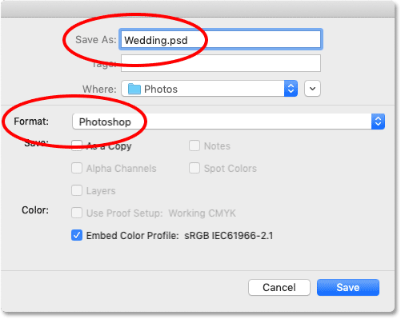
*Saving the document as a Photoshop .psd file.*

If we look again in the document's tab, we see that we're no longer working with our original .jpg file. Instead, we're working with the Photoshop .psd file, and we're ready to look at the next two tips:

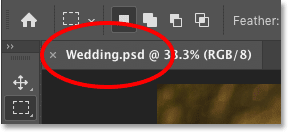
*The document tab showing the new .psd file.*

## Tip #3: Work on a separate layer

My third tip for keeping your images safe is to make all of your edits on a [separate layer](/photoshop-layers-learning-guide/). Now to benefit from this tip and the next tip we'll look at, make sure you've completed the previous step and saved your file as a Photoshop document.

In the [Layers panel](/basics/layers/layers-panel/), we see our image on the [Background layer](/basics/background-layer-photoshop-cc/), which is currently the only layer in the document:

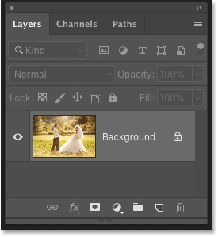
*The image opens on the Background layer.*

If we start making changes to this layer, we'll lose the original image. So a better way to work is to perform your edits on a *separate* layer. That way, no matter what we do on the separate layer, we'll always have the original image on the Background layer to return to.

### How to copy a layer

To make a copy of the Background layer, go up to the **Layer** menu, choose **New**, and then choose **Layer via Copy**. Or you can press the keyboard shortcut, **Ctrl+J** (Win) / **Command+J** (Mac):

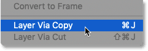
*Going to Layer > New > Layer via Copy.*

A copy appears above the original:

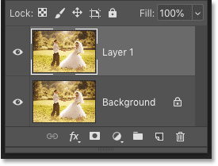
*The Layers panel showing both layers.*

By default, Photoshop gives new layers generic names, like "Layer 1". Since I'm going to convert my image to black and white again, I'll double-click on the name "Layer 1" and I'll rename it "Black and white". Then I'll press **Enter** (Win) / **Return** (Mac) to accept it:

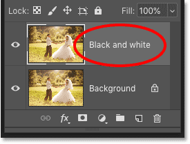
*Renaming the layer.*

### Applying a Black & White image adjustment

Back in Tip #1, I removed the color from the image using Photoshop's Desaturate command. But a much better way to convert an image to black and white is to use a Black & White image adjustment. To select it, go up to the **Image** menu, choose **Adjustments**, and then choose **Black & White**:

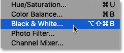
*Going to Image > Adjustments > Black & White.*

The Black and White dialog box includes various sliders you can drag to adjust the brightness of different parts of the image based on their original color. I cover these sliders in detail in my [Converting Photos to Black and White](/photo-editing/converting-color-photos-to-black-and-white-in-photoshop/) tutorial. For our purposes, I'll just click the **Auto** button to let Photoshop come up with something, and then I'll click OK to close the dialog box:

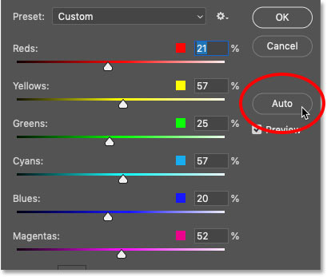
*Clicking the Auto button for the Black & White adjustment.*

And now, it *looks* like we've converted the image to black and white:

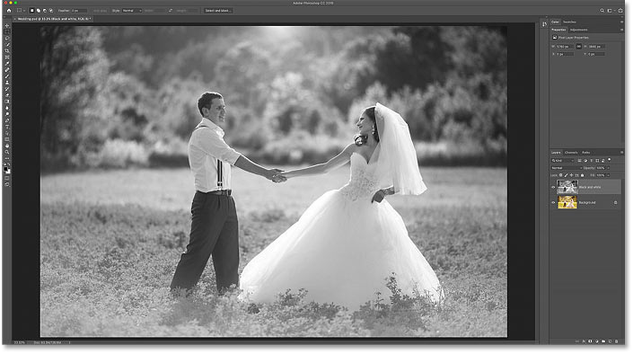
*The result after applying a Black & White image adjustment.*

### Keeping the edits separate from the original

But if we look again in the Layers panel, we see that what we've really done is converted just that one layer to black and white. The original image on the Background layer is still in color:

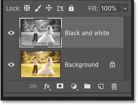
*Only the top layer was converted to black and white.*

If I turn the "Black and white" layer off by clicking its **visibility icon**:

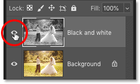
*Turning the "Black and white" layer off.*

We see the original color image:

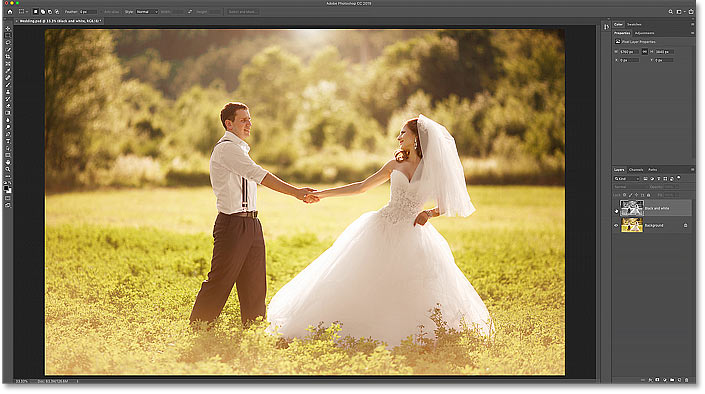
*Turning off the "Black and white" layer restores the original image.*

And if I turn the "Black and white" layer back on by again clicking its visibility icon:

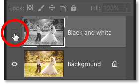
*Turning the "Black and white" layer back on.*

Then we're back to the black and white image:

*The black and white image returns.*

The great thing about Photoshop documents is that our layers are saved along with them. Which means that we can reopen the document and switch between the different versions of our image at any time.

### Saving and closing the document

I'll save my document by going up to the **File** menu and choosing **Save**:

*Going to File > Save.*

If Photoshop asks if you want to maximize the file's compatibility with other apps or with earlier versions of Photoshop, just click OK:

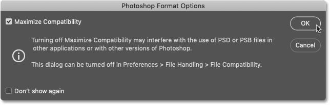
*Click OK to close the Maximize Compatibility dialog box.*

And then I'll close the document by going back to the **File** menu and choosing **Close**:

*Going to File > Close.*

This again returns us to the Home Screen where we see that I now have my original JPEG image (center), the black and white JPEG copy of the image (right), and my new Photoshop .psd file (left). Notice that the thumbnail for the Photoshop document is showing the black and white version of the image. But that's only because we saved the file with the "Black and white" layer turned on. We haven't actually made any permanent changes.

I'll reopen the Photoshop document by clicking its thumbnail:

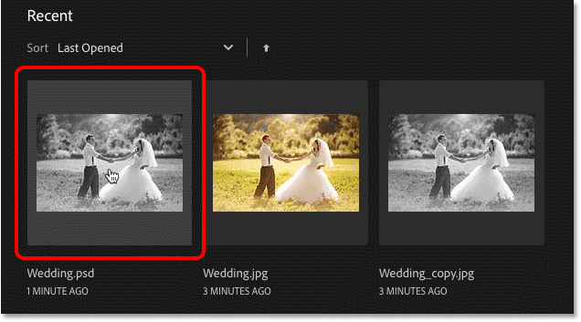
*Reopening the Photoshop document from the Home Screen.*

And the document reopens with both of our layers still intact. So we could save out a JPEG version of the black and white image if we wanted to. Or we could turn off the "Black and white" layer in the Layers panel and then save another JPEG of the original image if we needed it.

By using layers and saving our work as a Photoshop document, we were able to make our changes without losing access to the original photo:

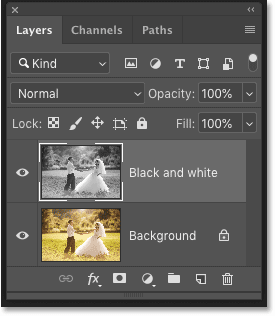
*Both layers are still intact after reopening the Photoshop document.*

## Tip #4: Use adjustment layers

In the previous tip, we learned that we can keep our edits separate from the original image by making our changes on a separate layer. But there's an even better way to work, and that's by using a special type of layer in Photoshop known as an *adjustment layer*. Adjustment layers not only keep our edits separate from the image, but they also keep the changes we make completely editable.

In the Layers panel, I'll delete my "Black and white" layer by dragging it down to the trash bin:

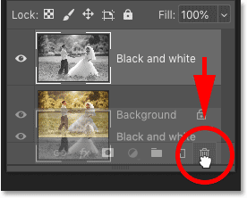
*Deleting the "Black and white" layer.*

So now I'm back to just my original image on the Background layer:

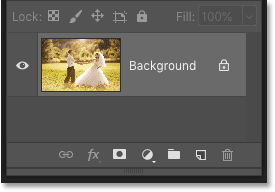
*Back to just the original photo.*

### Image adjustments vs adjustment layers

All of Photoshop's standard image adjustments are found by going up to the **Image** menu and choosing **Adjustments**. But the problem with these adjustments is that they are *static*, meaning that the edits are applied directly to the layer and the changes we make with them are permanent:

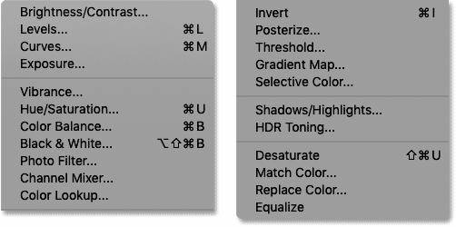
*Photoshop's list of standard image adjustments.*

However, most of these image adjustments are also available as adjustment layers. And unlike static adjustments, adjustment layers do not make any permanent changes. Instead, all of our edits are contained within the adjustment layer itself. What we see in the document is a *preview* of what those changes look like. And since none of our changes are permanent, we can always go back and edit the settings any time we need.

### Where to find Photoshop's adjustment layers

To add an adjustment layer, go to your Layers panel and click on the **New Fill or Adjustment Layer** icon at the bottom:

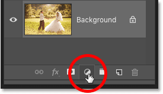
*Clicking the New Fill or Adjustment Layer icon.*

Not all of Photoshop's image adjustments are available as adjustment layers, but most of them are:

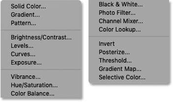
*Photoshop's list of fill and adjustment layers.*

### How to use an adjustment layer

For example, I'll choose a **Black & White** adjustment layer from the list:

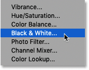
*Adding a Black & White adjustment layer.*

Once you've added an adjustment layer, it appears as its own separate layer in the Layers panel:

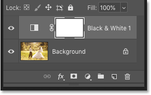
*The adjustment layer appears above the Background layer.*

And the controls and options for the adjustment layer appear in Photoshop's **Properties panel**. Here we see the exact same color sliders and Auto button that we saw previously in the standard Black & White adjustment's dialog box:

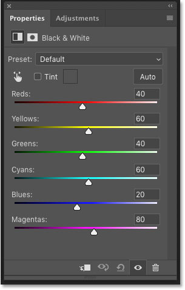
*The Properties panel.*

The only things we don't see are the OK and Cancel buttons, and that's because we never actually apply our settings to the image. The effect is all contained within the adjustment layer itself. And as we'll see in a moment, we can always come back and edit these settings later.

I'll click the **Auto** button, just like I did earlier:

*Clicking the Auto button.*

And we get the exact same result from the adjustment layer as we did from the standard image adjustment:

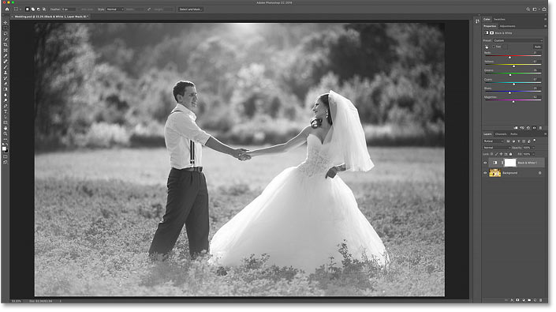
*The results using the standard adjustment and the adjustment layer are the same.*

### Saving and closing the document

I'll save my document by going up to the **File** menu and choosing **Save**:

*Going to File > Save.*

And then I'll close the document again by going back to the **File** menu and choosing **Close**:

*Going to File > Close.*

### Reopening the Photoshop document

Back on the Home Screen, I'll reopen my Photoshop document by clicking its thumbnail:

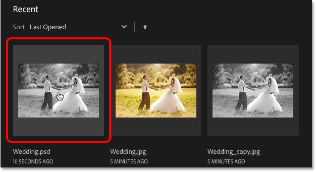
*Reopening the Photoshop file.*

And again, the document reopens with our layers still intact:

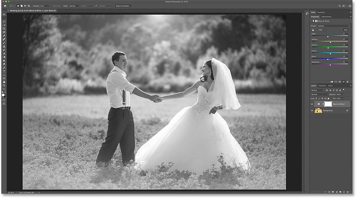
*The document still contains the original image and the adjustment layer.*

### Showing and hiding the adjustment layer

Just like with normal layers, we can toggle an adjustment layer on and off by clicking its **visibility icon** in the Layers panel. Turn the layer off to view your original image, and turn it back on to view the adjustment layer's effect:

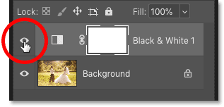
*Use the visibility icon to turn the adjustment on or off.*

### How to edit an adjustment layer

But unlike standard image adjustments that are applied permanently, adjustment layers remain editable. If you're not seeing the options for the adjustment layer in the Properties panel, make sure the adjustment layer is selected in the Layers panel:

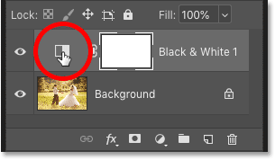
*Clicking to select the adjustment layer.*

And then in the Properties panel, you can make any changes you need. When you're done, you can save out another JPEG version of the effect, or you can turn off the adjustment layer to restore the original version of the image. Or you can just save and close your Photoshop document:

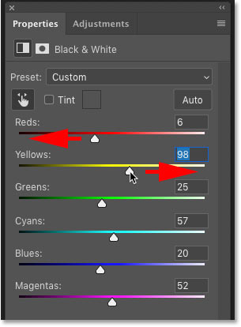
*Editing the adjustment layer settings in the Properties panel.*

And there we have it! That's a few easy ways to avoid losing your original image files when working in Photoshop! Check out our [Photoshop Basics](/basics/) section for more tutorials! And don't forget, all of our tutorials are now available to [download as PDFs](/print-ready-pdfs/)!