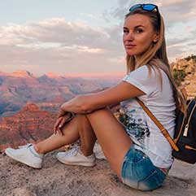
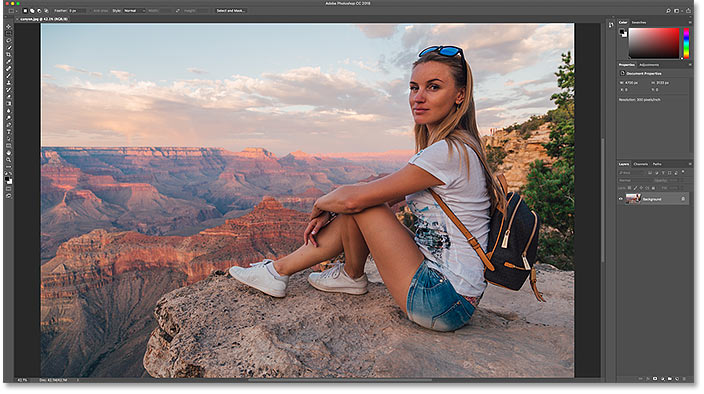
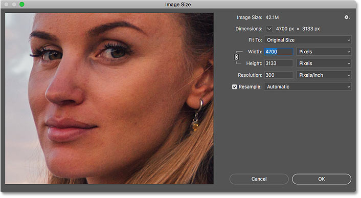
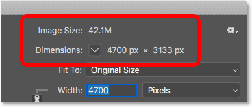
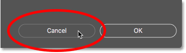
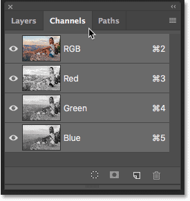
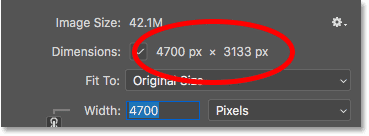
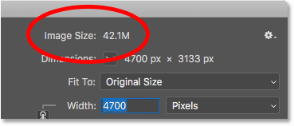

# How to Calculate Image Size in Photoshop

> Source: [https://www.photoshopessentials.com/basics/how-to-calculate-image-size-in-photoshop/](https://www.photoshopessentials.com/basics/how-to-calculate-image-size-in-photoshop/)
> Downloaded and converted to Markdown.

Learn how Photoshop calculates the file size of your image, why the image size changes as you change the number of pixels, and how easy it is to figure out the file size on your own!

In the previous lesson in this series on image size, we learned how to resize images for email and for sharing online using the Image Size command in Photoshop. In that lesson, we saw that by changing the number of pixels in the image, the image size in megabytes also changed. More pixels meant a larger file size, and fewer pixels made the file size smaller.

But how does that work? What does the number of pixels in an image have to do with its file size? In this quick lesson, I'll show you exactly how pixels and file size are related, and how the colors in your image also play an important role. By the end, you'll know how to easily figure out the size of an image on your own, and you'll know exactly where that image size number comes from in Photoshop's Image Size dialog box!

To follow along, you can open any image in Photoshop. I'll use [this photo](https://prf.hn/l/OVRD0Zj) that I downloaded from Adobe Stock:

*The original image. Photo credit: Adobe Stock.*

This is lesson 5 in my [Resizing Images in Photoshop](/basics/how-to-resize-images-in-photoshop-complete-guide/) series.

Let's get started!

## Where to find the current image size

To view the current size of your image, go up to the **Image** menu in the Menu Bar and choose **Image Size**:

*Going to Image > Image Size.*

This opens Photoshop's [Image Size dialog box](/basics/photoshops-image-size-command-features-and-tips/), with a preview window on the left and the image size options along the right. The preview window was added in [Photoshop CC](https://prf.hn/l/dlXjD2w):

*The Image Size dialog box in Photoshop CC.*

The current size, both in pixels (px) and in megabytes (M), is found at the top. The number next to the words **Image Size** shows the amount of space that the image is taking up in your computer's memory. And below that, next to the word **Dimensions**, is the width and height of the image in pixels. 

In my case, my image is taking up 42.1M of memory. And it has a width of 4700 px and a height of 3133 px. In a moment, I'll show exactly how the image size and pixel dimensions are related:

*The current image size, both in megabytes and in pixels.*

## How pixels and color affect the image size

To really understand how the number of pixels in an image affects its file size, we also need to know how Photoshop displays the colors in your image. That's because pixels alone don't create the file size. Much of the size comes from the way Photoshop displays the *color* of each pixel.

Most full color images use what's called **RGB color**. RGB stands for "Red, Green, and Blue", which are the three primary colors of light. Every color you see in your image is made by mixing some combination of red, green and blue together.

### Photoshop's color channels

Photoshop mixes red, green and blue using **color channels**. To see how that works, I'll close out of the Image Size dialog box for a moment by clicking the Cancel button:

*Canceling the Image Size command.*

Then I'll switch over to the **Channels panel**, which you'll find next to the Layers panel. And here we see the **Red**, **Green** and **Blue** channels that Photoshop is using. The RGB channel at the top isn't really a channel. It represents the full color image that we're seeing on the screen:

*All colors in your image are made by mixing red, green and blue.*

[Learn more about RGB color and color channels in Photoshop](/essentials/rgb/)

### How do color channels affect image size?

Each of the three color channels (Red, Green and Blue) takes up exactly **1 byte** in memory for **each and every pixel** in the image. For example, if your image contained 10 pixels, each pixel would need 1 byte for red, 1 byte for green and 1 byte for blue, for a total of **3 bytes**. 

Of course, most images contain *millions* of pixels, not just 10. But the amount of memory that each pixel needs doesn't change. It's always **3 bytes for every pixel**; one for red, one for green and one for blue.

## How to calculate the file size

So to figure out the file size of an image, all we need to do is take the total number of pixels, multiply it by 3, and we have our answer! Here's how to do it.

### Step 1: Find the total number of pixels in the image

First, we need the total number of pixels, and we find that in the Image Size dialog box. I'll re-open it by going back up to the **Image** menu and choosing **Image Size**:

*Going back to Image > Image Size.*

And again, we see in the **Dimensions** section that my image has a width of **4700 px** and a height of **3133 px**:

*The width and height of the image in pixels.*

To find the total number of pixels, multiply the width and height together. In this case, 4700 pixels x 3133 pixels = **14,725,100 pixels**. That's a lot of pixels. But as we learned, the pixel count alone isn't the whole story.

### Step 2: Multiply the total number of pixels by 3

Remember that each pixel in the image needs 3 bytes in memory; one for the Red channel, one for the Green channel, and one for the Blue channel. So to find the total file size, in bytes, multiply the total number of pixels by 3. In my case, 14,725,100 pixels x  3 bytes per pixel = **44,175,300 bytes**. 

### Step 3: Convert the image size from bytes to kilobytes

We have our total file size in bytes. But a byte is a very small unit of measurement, so it's not very practical to refer to the size of an image in bytes. Instead, we usually talk about image size in either *kilobytes* or, more commonly, in *megabytes*.

One kilobyte is equal to 1024 bytes. So to convert bytes to kilobytes, divide the total number of bytes by 1024. With my image, 44,175,300 bytes ÷ 1024 = **43,139.94 kilobytes** (or KB).

### Step 4: Convert the image size from kilobytes to megabytes

Even kilobytes is too small of a measurement type to be very practical for most images. So instead, we usually refer to file size in megabytes. One megabyte is equal to 1024 kilobytes. So to find the total image size in megabytes, divide the number of kilobytes (43,139.94) by 1024, which gives us **42.1 megabytes** (or MB, although for whatever reason, the Image Size dialog box shortens "MB" to just "M").

And if we look again at the Image Size dialog box, we see that sure enough, Photoshop is showing me that the size of my image is **42.1M**:

*Photoshop agrees with our calculations.*

## How to calculate image size - Quick summary

And that's really all there is to it! To figure out the image size, just follow these simple steps:

1. Multiply the width and height of the image, in pixels, to get the total pixel count.
2. Multiply the total pixel count by 3 to get the image size in bytes.
3. Divide the number of bytes by 1024 to get the image size in kilobytes.
4. Divide the number of kilobytes by 1024 to get the image size in megabytes.

And there we have it! In the next lesson, we'll look at [web resolution](/basics/the-truth-about-image-resolution-and-file-size-in-photoshop/), the popular belief that you need to lower the resolution of an image before uploading it online, and how easy it is to prove that it's just not true!

You can jump to any of the other lessons in this [Resizing Images in Photoshop](/basics/how-to-resize-images-in-photoshop-complete-guide/) chapter. Or visit our [Photoshop Basics](/basics/) section for more topics!