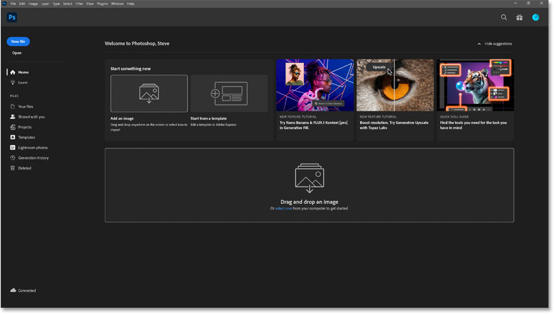
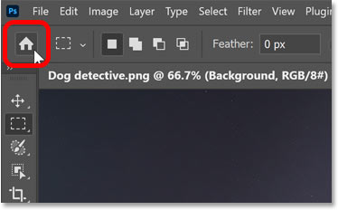
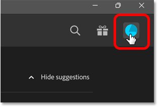
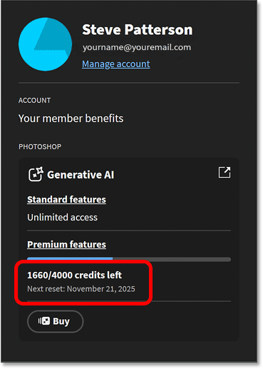
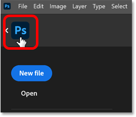

# How to Check Your Generative Credits in Photoshop

> Source: [https://www.photoshopessentials.com/basics/how-to-check-your-generative-credits-in-photoshop/](https://www.photoshopessentials.com/basics/how-to-check-your-generative-credits-in-photoshop/)
> Downloaded and converted to Markdown.

Not sure where to check your Adobe generative credits? This tutorial shows you exactly where to find your current credit balance directly in Photoshop.

Photoshop now includes a wide range of AI tools for creating, editing and compositing images. And Photoshop 2026 adds even more, including [Harmonize](/photo-editing/how-to-blend-anything-with-harmonize-in-photoshop-2026/), [Generative Upscale](/photo-editing/how-to-use-generative-upscale-in-photoshop-2026/) and the new partner models (Nano Banana and FLUX Kontext Pro) in Generative Fill.

Most of these AI tools require **generative credits**, whether they use Adobe's AI models (for **Standard features**) or partner model technology (for **Premium features**). The number of credits you get each month depends on your Adobe subscription.

But even if you have a [Creative Cloud Pro](https://adobe.prf.hn/click/camref:1100lrdjJ/destination:https%3A//www.adobe.com/products/photoshop.html) account with unlimited Standard features, those Premium features like Nano Banana can drain credits fast.

Thankfully, Adobe makes it easy to keep track of how many generative credits you have remaining, and you don't need to [open Adobe's website](https://helpx.adobe.com/ca/creative-cloud/apps/generative-ai/generative-credits-faq.html) and log in to your account.

You can view your current generative credits balance at any time directly in Photoshop. Here's where to find it.

### Step 1: Open the Photoshop Home Screen

First, make sure you're on Photoshop's [Home Screen](/basics/hide-the-home-screen/). If you launch Photoshop from the Creative Cloud Desktop app, the Home Screen usually appears automatically.

*Photoshop's Home Screen (where you want to be).*

You can't view your generative credits balance from the [main workspace](/basics/hide-photoshop-with-screen-modes-and-interface-tricks/), so if you're already working in a document, you'll need to switch to the Home Screen temporarily.

*Photoshop's main workspace (where you don't want to be).*

To switch from the main workspace to the Home Screen, click the **Home button** (the little house icon) in the upper left corner.

*Clicking the Home button.*

### Step 2: Open your Profile panel

On the Home Screen, click the **Profile** button in the upper right.

*Clicking the Profile button on Photoshop's Home Screen.*

### Step 3: View your generative credits balance

Your profile panel opens and shows your total number of generative credits for the month and the number of credits left.

There's also a **Buy** button in case your credits are at 0 and you need to purchase more before they reset on your subscription renewal date.

*Your generative credits balance appears here.*

### Step 4: Return to Photoshop's main workspace

To return to your document after viewing your generative credits balance, click the **PS logo** in the upper left of the Home Screen.

*The PS logo returns you to the main workspace.*

## Summary

And there we have it. Adobe's subscription model and generative credit structure are a confusing mess. But at least your current credit balance is always available on Photoshop's Home Screen whenever you need it.

Don't forget — all of our Photoshop tutorials are available to [download as PDFs](/print-ready-pdfs/)!