# How To Choose Text Colors From Images In Photoshop

> Source: [https://www.photoshopessentials.com/basics/how-to-choose-type-colors-from-images-with-photoshop/](https://www.photoshopessentials.com/basics/how-to-choose-type-colors-from-images-with-photoshop/)
> Downloaded and converted to Markdown.

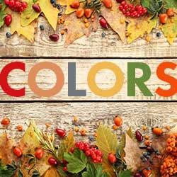

This tutorial shows you how to choose colors for your type in Photoshop by sampling them directly from an image. Step-by-step for Photoshop CC, CS6 and earlier.

Adding text to an image with Photoshop is simple enough, but making your text look like it *belongs* in the image isn't always easy. The font you choose is important, but so is the color. One way to unify text with an image is by choosing your font colors directly from the image itself. In this tutorial, I'll show you how to sample a single color for your type, and how to get more creative by choosing different colors from the image for different letters! I'll be using [Photoshop CC](https://prf.hn/l/dlXjD2w) but every step is fully compatible with Photoshop CS6 and earlier. 

Here's what my final result will look like, with the color of each individual letter sampled from a different part of the image. Of course, the goal of this tutorial is not to create this exact look but simply to learn the steps so you can use them to bring your own ideas to life:

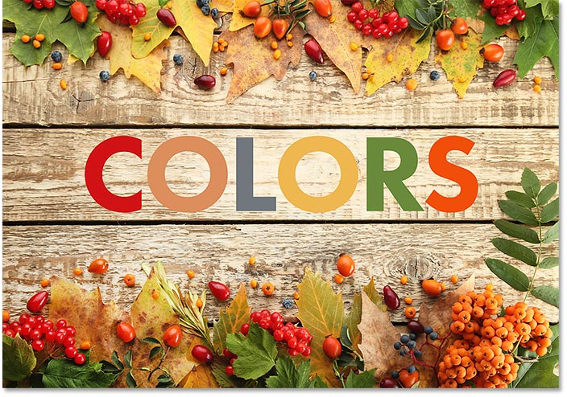
*The final result.*

Let's get started!

## How To Choose Type Colors From An Image With Photoshop

### Step 1: Open Your Image

Start by opening the image where you'll be adding your text. Here's the image I'll be using. I downloaded this one from [Adobe Stock](https://prf.hn/l/MDQ3G33):

*The original image, without the text. Photo credit: Adobe Stock.*

### Step 2: Add Your Text

Add your text to the image. I've gone ahead and added the word "COLORS". The letters are all in black which doesn't look great, so we'll learn how to change the colors next:

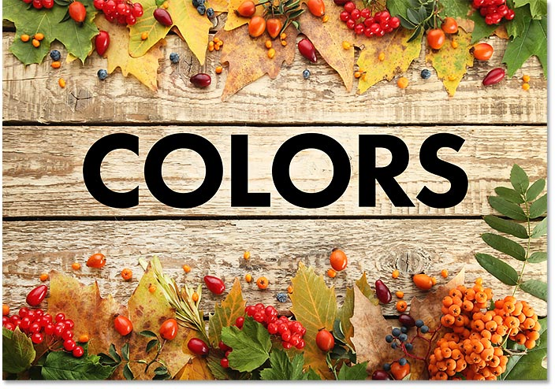
*The image after adding the initial text.*

### Step 3: Select The Type Tool

Choose the **Type Tool** from the Toolbar if it's not selected already:

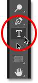
*Selecting the Type Tool.*

### Step 4: Select Your Type Layer

Make sure your **Type layer** is selected in the Layers panel:

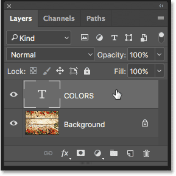
*Selecting the Type layer.*

### Step 5: Click The Type Color Swatch

Click on the **color swatch** in the Options Bar to change the color of your type:

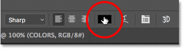
*Clicking the color swatch.*

### Step 6: Sample A Color From The Image

This opens Photoshop's **Color Picker**. Normally, to choose a new type color, we would choose one directly from the Color Picker itself, but that's not what we want to do here:

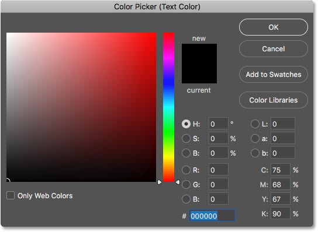
*The Color Picker opens.*

To choose a new type color from the image, move your mouse cursor over the image. Your cursor will change into the **Eyedropper Tool** icon. Click on a color in the image to sample it. I'll choose red from one of the berries:

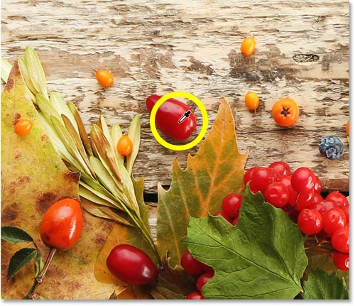
*Clicking on a red area in the image to sample the color.*

Instantly, the color you sampled becomes the new color for your text. If you don't like the color you chose, click on a different area to try again. When you're happy with the color, click OK to close the Color Picker. The text is already looking better:

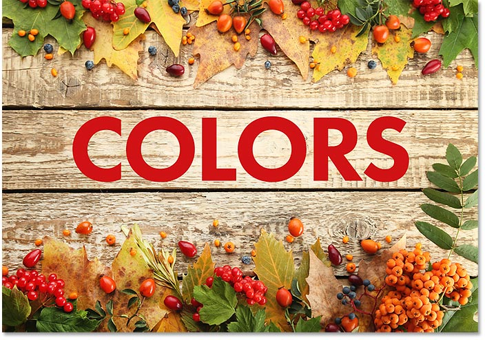
*The type after sampling a color from the image.*

### Step 7: Highlight A Single Letter With The Type Tool

So far, we've learned how to sample a single color from an image to use as the color for the entire text. What if we want to choose different colors from the image for different letters? With the Type Tool selected, click and drag across a letter to highlight it. I'll highlight the first letter "O":

*Highlight a single letter by clicking and dragging over it with the Type Tool.*

### Step 8: Click Again On The Type Color Swatch

With the letter highlighted, click again on the **color swatch** in the Options Bar:

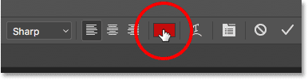
*Clicking the color swatch to change the color of the letter.*

### Step 9: Click On The Image To Sample A New Color

This again opens the **Color Picker**. Just as you did before, move your mouse cursor into the image and click on the new color you want to use. I'll sample a color from one of the leaves:

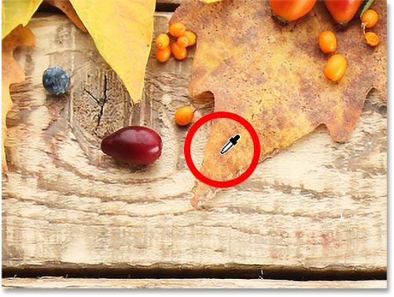
*Clicking to sample a new color for the highlighted letter.*

### Step 10: Click The Checkmark

Click OK to close the Color Picker. To deselect the letter, click the **checkmark** in the Options Bar:

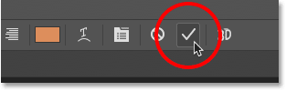
*Click the checkmark to accept the new color.*

And now, that one letter I highlighted is filled with a different color from the image than the others:

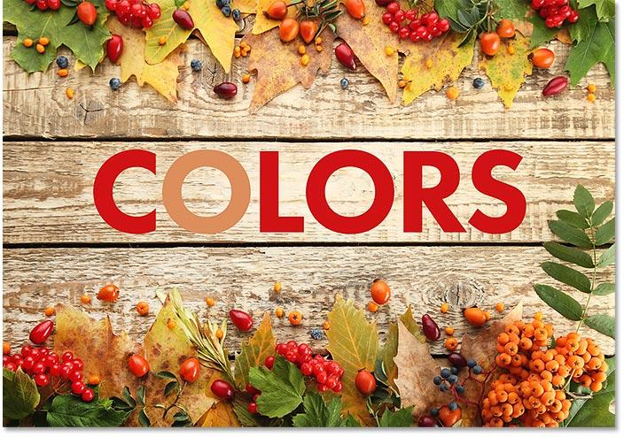
*The effect after changing the color for just one of the letters.*

### Repeat The Steps For The Other Letters

Follow the same steps to change the color for the other letters. First, highlight a letter with the Type Tool, and then click the color swatch in the Options Bar to open the Color Picker. Click on a new color in the image to sample it, and then click OK to close the Color Picker. When you're done changing the colors,  click the checkmark in the Options Bar.

Here's my final result after sampling different colors from the image for each of the remaining letters:

*The final result.*

And there we have it! That's how to choose colors for your text directly from the image with Photoshop! There are other creative ways to make text in an image stand out. Learn how to [transform type with Smart Objects](/basics/transform-type-smart-objects/) in Photoshop, or how to apply editable [Smart Filters](/basics/smart-filters-editable-type-photoshop/) to your text! Or, instead of placing text in an image, why not place an [image inside text](/photoshop-text/text-effects/image-in-text-photoshop-cs6/)! Visit our [Photoshop Basics](/basics/) section for more tutorials!