# How To Copy Smart Objects In Photoshop

> Source: [https://www.photoshopessentials.com/basics/how-to-copy-smart-objects-in-photoshop/](https://www.photoshopessentials.com/basics/how-to-copy-smart-objects-in-photoshop/)
> Downloaded and converted to Markdown.

In this tutorial, you'll learn two ways to copy a smart object in Photoshop. Why look at two ways to do the same thing? Well, depending on which way you choose, you'll get very different results.

Both ways for copying a smart object are found under the Layer menu in the Menu Bar. The first is by choosing the **New Layer via Copy** command, and the second is by choosing **New Smart Object via Copy**. One of these commands will create an identical copy of your smart object that shares the same content as the original. And the other will create an entirely *separate* copy that's completely independent of the original. If you don't know the difference between them, you can get confusing and unexpected results. So, let's see how they work!

I'll be using [Photoshop CC](https://prf.hn/l/dlXjD2w) but everything is fully compatible with Photoshop CS6. Let's get started!

## Setting up the document

To see the difference between New Layer via Copy and New Smart Object via Copy, we'll start by converting a layer into a smart object. Then, we'll make two copies of the smart object, first using the New Layer via Copy command and then using New Smart Object via Copy. Once the copies are in place, we'll edit the smart objects and compare the results.

To follow along, you can use any image you like. I'll use [this image](https://prf.hn/l/LbqONXg) that I downloaded from Adobe Stock.

*The image that will be converted to a smart object. Photo credit: Adobe Stock.*

If we look in the [Layers panel](/basics/layers/layers-panel/), we see the image on a layer named "Photo". The Background layer, filled with white, sits below it:

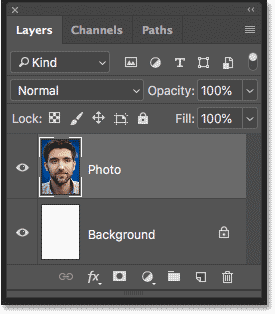
*The Layers panel showing the image above the Background layer.*

### Adding more canvas space

To make room for the copies, I'll add some extra canvas space to the document. To do that, I'll go up to the **Image** menu in the Menu Bar and I'll choose **Canvas Size**:

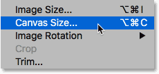
*Going to Image > Canvas Size.*

In the Canvas Size dialog box, I'll set the **Width** to **300 Percent** and the **Height** to **100 Percent**. I'll leave the **Relative** option unchecked. And in the **Anchor** grid, I'll leave the **center square** selected. Then I'll click OK to close the dialog box:

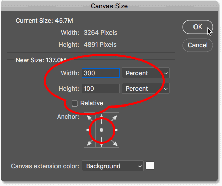
*The Canvas Size dialog box.*

To fit the new canvas on the screen, I'll go up to the **View** menu and choose **Fit on Screen**:

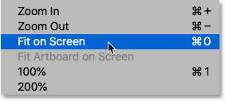
*Going to View > Fit on Screen.*

And here's the result after adding more canvas. We now have room to place a copy of the image on either side of it:

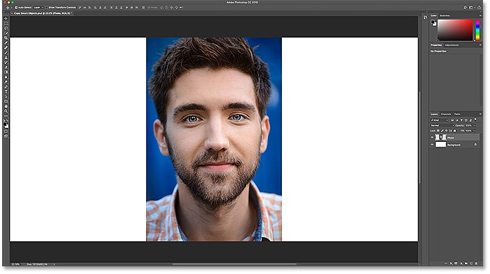
*More canvas has been added to the left and right of the image.*

### Converting the layer to a smart object

To convert the image into a smart object, I'll make sure I have the "Photo" layer selected in the Layers panel:

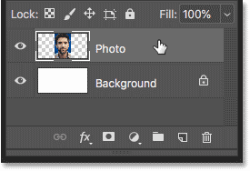
*Selecting the layer to convert to a smart object.*

And then, in the **Layer** menu in the Menu Bar, I'll choose **Smart Objects**, and then **Convert to Smart Object**:

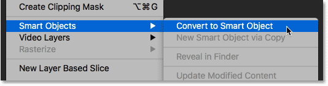
*Going to Layer > Smart Objects > Convert to Smart Object.*

Back in the Layers panel, a **smart object icon** appears in the layer's preview thumbnail, telling us that the layer is now a smart object:

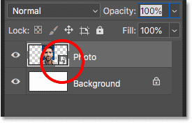
*The smart object icon.*

[Related: How to create smart objects in Photoshop](/basics/how-to-create-smart-objects-in-photoshop/)

### Renaming the smart object

Before we go any further, let's quickly rename the smart object so we'll know that this is the original. To rename it, I'll double-click on the name "Photo" and I'll change it to "Original". Then I'll press **Enter** (Win) / **Return** (Mac) to accept it:

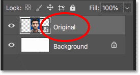
*Renaming the original smart object.*

## How to copy a smart object

So now that we've created an initial smart object, let's learn how to make a copy of it. There are two main ways to copy a smart object in Photoshop. One is by using the **New Layer via Copy** command, and the other is by using **New Smart Object via Copy**. Both are found under the Layer menu. Let's start with New Layer via Copy.

### New Layer via Copy

With your smart object selected in the Layers panel, go up to the **Layer** menu, choose **New**, and then choose **Layer via Copy**. Note that there's also a keyboard shortcut you can use, which is **Ctrl+J** (Win) / **Command+J** (Mac). The New Layer via Copy command is normally used for making copies of layers, but it can also be used with smart objects:

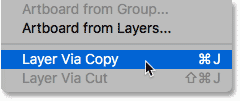
*Going to Layer > New > Layer via Copy.*

In the Layers panel, a copy of the smart object is added above the original:

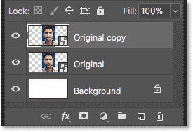
*The Layers panel showing the first copy.*

#### Moving the copy into place

To move the copy beside the original smart object in the document, I'll select Photoshop's **Move Tool** from the [Toolbar](/basics/photoshop-tools-toolbar-overview/):

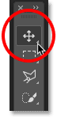
*Selecting the Move Tool.*

Then, I'll press and hold my **Shift** key, and I'll click and drag the copy over to the left of the original. The Shift key limits the direction you can move, making it easier to drag straight across. We now have the original smart object in the center, and the copy made with the New Layer via Copy command on the left:

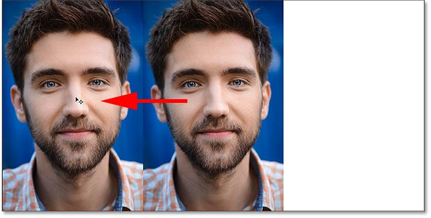
*Moving the copy of the smart object to the left of the original.*

#### Renaming the first copy

Again to help us keep track of things, I'll rename this first copy of the smart object in the Layers panel from "Original copy" to "Layer via Copy":

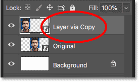
*Renaming the first copy "Layer via Copy"*

### New Smart Object via Copy

Next, let's make another copy of our smart object, this time using the New Smart Object via Copy command. In the Layers panel, I'll click on the original smart object to select it:

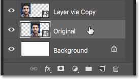
*Selecting the original smart object.*

Then, in the **Layer** menu in the Menu Bar, I'll choose **Smart Objects**, and then **New Smart Object via Copy**:

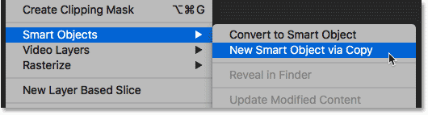
*Going to Layer > Smart Objects > New Layer via Copy.*

A second copy of the smart object is added above the original:

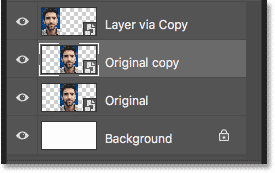
*A second copy appears.*

#### Renaming the second copy

I'll rename the second copy "Smart Object via Copy":

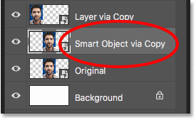
*Renaming the second copy.*

#### Changing the order of the smart objects

And then, just to keep things organized, I'll click and drag the "Smart Object via Copy" version above the others:

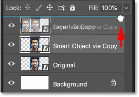
*Changing the order of the smart objects.*

I'll release my mouse button to drop it into place. And now we have the original smart object on the bottom, the New Layer via Copy version above it, and the copy made with New Smart Object via Copy at the top:

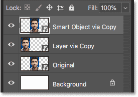
*Both copies have now been added.*

#### Moving the second copy into place

Finally, back in the document, I'll click with the Move Tool on the second copy and I'll drag it to the right of the original, holding my **Shift** key as I drag so it's easier to move straight across. We now have the original smart object in the center, the "Layer via Copy" smart object on the left and the "Smart Object via Copy" version on the right:

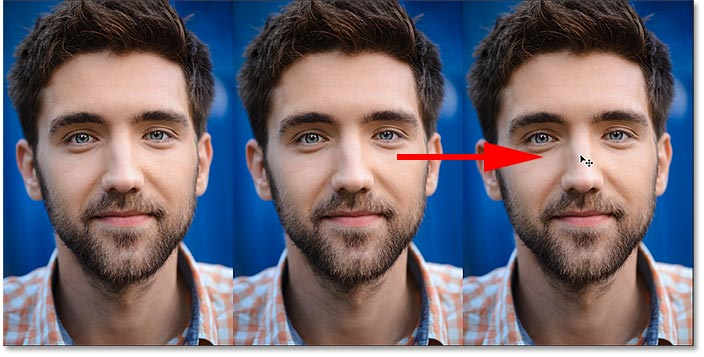
*The "Layer via Copy" (left), "Original" (center) and "Smart Object via Copy" (right) smart objects.*

## Comparing New Layer and New Smart Object via Copy

Now that we have our two copies in place, let's look at the difference between the New Layer via Copy command and New Smart Object via Copy. At the moment, both copies of our smart object look the same as the original. But there's a big difference between them, and the difference has to do with their content.

The copy we made using the New Layer via Copy command is a true copy of the original because both the original smart object and the copy *share the same content*. In other words, we're not really seeing a *copy* of the image. We're seeing the same image *twice*. If we edit the content inside the original smart object, the same change will appear in the copy. And changing the copy will display the same change in the original.

On the other hand, the copy we made using New Smart Object via Copy is a *new* smart object that's completely separate from the original, with its *own independent copy* of the content. Changing the original smart object will have no effect on the copy, and changing the copy will have no effect on the original.

### Editing the original smart object

To show you what I mean, let's see what happens when we edit the smart objects. I covered [how to edit smart objects](/basics/how-to-edit-and-replace-smart-object-contents-in-photoshop/) in detail in the previous tutorial, so here, I'll go through it quickly. I'll start by making a change to the original smart object. To open it and view its contents, I'll **double-click** on the "Original" smart object's **thumbnail** in the Layers panel:

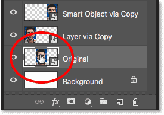
*Opening the original smart object.*

The contents of the smart object open in a separate document:

*The smart object document.*

#### Adding a Black & White adjustment layer

I'll convert the image in the original smart object to black and white. To do that, in the Layers panel, I'll click on the **New Fill or Adjustment Layer** icon at the bottom:

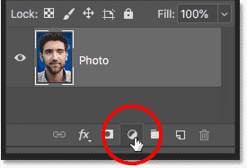
*Clicking the New Fill or Adjustment Layer icon.*

Then I'll choose **Black & White** from the list:

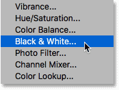
*Choosing "Black & White".*

A Black & White adjustment layer appears above the image:

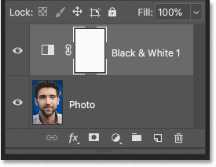
*The Black & White adjustment layer.*

And in the document, we see the image now in black and white:

*The result after adding the Black & White adjustment layer.*

#### Saving and closing the document

To have the change appear in the main document, we need to save and close the smart object's document. To save it, go up to the **File** menu and choose **Save**:

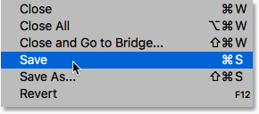
*Going to File > Save.*

And then to close the document, go back up to the **File** menu and choose **Close**:

*Going to File > Close.*

#### One change, two results

Back in the main document, we see the result. The change I made to the original smart object in the center also appears in the copy on the left (the one made using the New Layer via Copy command). That's because both of them are sharing the same content, so changing one also changes the other. Yet the copy on the right, made with the New Smart Object via Copy command, is unaffected. And that's because New Smart Object via Copy created an entirely new smart object with its own separate version of the image:

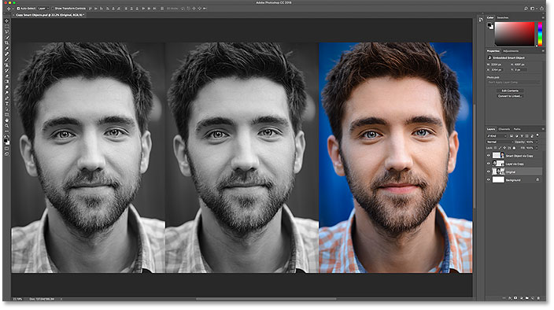
*Editing the original smart object affected one copy but not the other.*

### Editing the "New Layer via Copy" smart object

To see what we mean by two smart objects sharing the same content, I'll open the "Layer via Copy" smart object on the left by double-clicking on its thumbnail in the Layers panel:

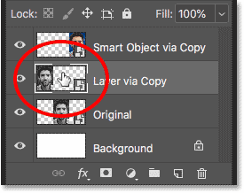
*Opening the "Layer via Copy" smart object.*

The contents again open in a separate document. But notice that it's actually the *same* document that we opened and made changes to earlier, with the same Black & White adjustment layer added in the Layers panel. Both the original smart object and the copy are displaying this same document:

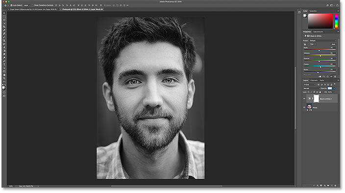
*The same content is shared by multiple smart objects.*

#### Deleting the adjustment layer

I'll delete the Black & White adjustment layer by dragging it down onto the **Trash Bin** at the bottom of the Layers panel:

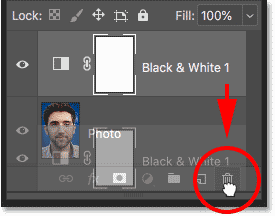
*Deleting the adjustment layer from the shared document.*

This restores the original color in the image:

*Deleting the Black & White adjustment layer restores the color.*

#### Saving the changes

I'll save the change by going up to the **File** menu and choosing **Save**:

*Going to File > Save.*

And then I'll close the smart object document by going up to the **File** menu and choosing **Close**:

*Going to File > Close.*

Back in the main document, we again see the result. Even though this time, I made the change to the copy on the left, the original smart object in the center is also affected. Again, it's because they're both sharing that same smart object document:

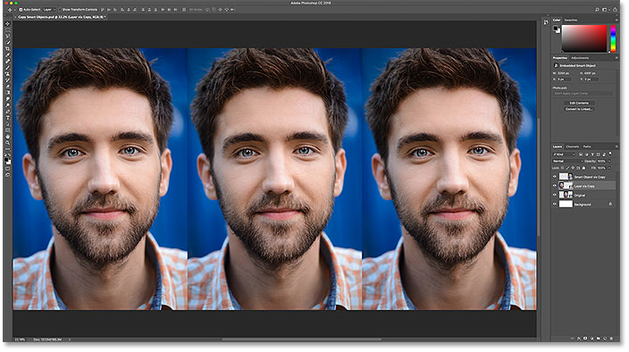
*Editing the "Layer via copy" smart object also changed the original.*

### Editing the "New Smart Object via Copy" version

But let's see what happens if we edit the smart object on the right, the one made using the New Smart Object via Copy command. To open it, I'll double-click on its thumbnail in the Layers panel:

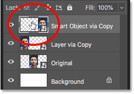
*Opening the copy made with New Smart Object via Copy.*

Again, the contents open in a separate document. But this time, it really is a *separate* document. It may *look* the same as the one we made changes to earlier, but because the New Smart Object via Copy command creates a brand new smart object, the contents here are completely separate from the original:

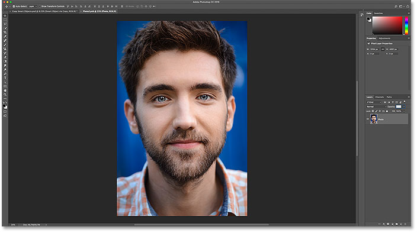
*The contents open in an independent document.*

#### Adding a Gradient Map adjustment layer

To make a change, I'll try something different by adding a Gradient Map adjustment layer. I'll click the **New Fill or Adjustment Layer** icon at the bottom of the Layers panel:

*Clicking the New Fill or Adjustment Layer icon.*

And then I'll choose **Gradient Map** from the list:

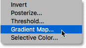
*Choosing "Gradient Map".*

A Gradient Map adjustment layer appears above the image:

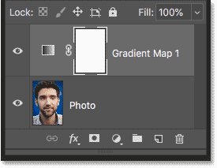
*The Gradient Map adjustment layer.*

In the **Properties panel**, I'll click on the small arrow to the right of the gradient swatch, and then I'll choose one of Photoshop's built-in gradients, like the Violet to Orange gradient, by double-clicking its thumbnail:

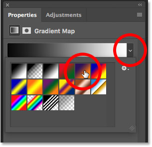
*Choosing a gradient.*

And finally, back in the Layers panel, I'll change the [blend mode](/photo-editing/layer-blend-modes/intro/) of the Gradient Map from Normal to **Color**:

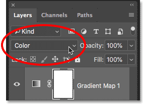
*Changing the adjustment layer's blend mode to Color.*

And here's the result, with the gradient colors now blending in with the image:

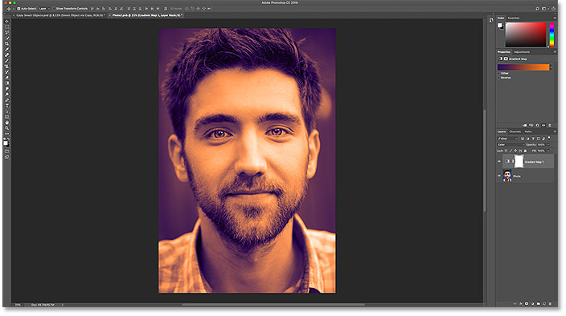
*The result after adding the Gradient Map adjustment layer.*

#### Saving the changes

Again, I'll save my changes by going up to the **File** menu and choosing **Save**:

*Going to File > Save.*

And then I'll close the smart object by going back up to the **File** menu and choosing **Close**:

*Going to File > Close.*

And in the main document, we see that this time, only the smart object on the right is showing our changes. Again, that's because the New Smart Object via Copy command made an entirely new version of the smart object with no connection to the original:

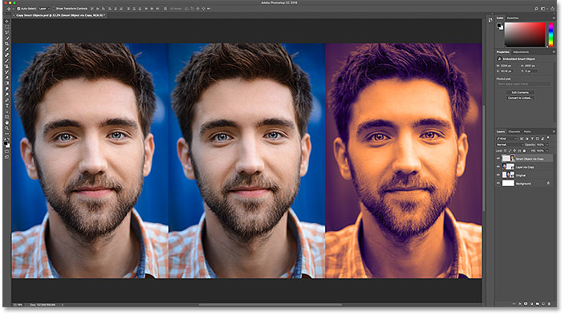
*Editing the copy made with New Smart Object via Copy affects only that one smart object.*

### Replacing the smart object contents

We've seen the difference between New Layer and New Smart Object via Copy when we edit a smart object. But the same is true when *replacing* a smart object's content. If we replace the content of the original smart object, any copies made using the New Layer via Copy command will also have their content replaced. But copies made with New Smart Object via Copy will be unaffected.

I'll select the original smart object in the Layers panel:

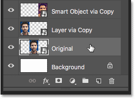
*Selecting the original smart object.*

Then, to replace the image inside it with a different image, I'll go up to the **Layer** menu, then I'll choose **Smart Objects**, and then **Replace Contents**:

*Going to Layer > Smart Objects > Replace Contents*

I'll navigate to the image I want to replace it with, and then I'll click on the image to select it, and click **Place**:

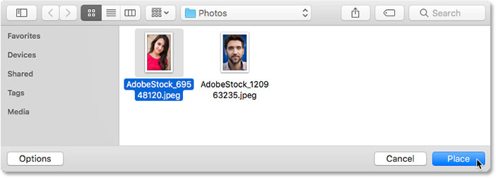
*Selecting the replacement content for the smart object.*

Photoshop instantly replaces the image in my original smart object with my [new image](https://stock.adobe.com/images/beautiful-young-woman/69548120). And because the copy on the left is sharing the same content as the original, it also had its content replaced. But because the smart object on the right is entirely separate, it's still showing its original content:

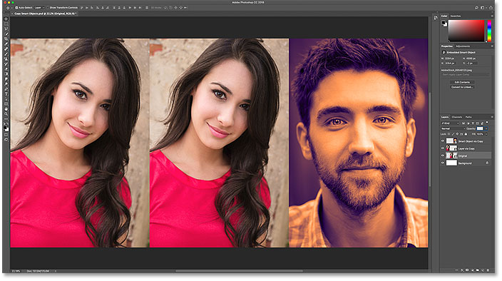
*The new content appears in both the original and the "Layer via Copy" smart objects.*

## Which way to copy a smart object is best?

Now that we know the difference between New Layer via Copy and New Smart Object via copy, which one should you use? If you're making copies of a smart object to use in a layout or template, where you'll need any changes you make to the original to appear in the copies as well, you'll want to use the New Layer via Copy command. And, if you just want to make a new smart object from an existing one, with no connection between them, use New Smart Object via Copy instead.

And there we have it! That's how to copy a smart object in Photoshop! For more on smart objects, learn how to [open and place images](/basics/how-to-create-smart-objects-in-photoshop/) as smart objects, how to [edit smart objects](/basics/how-to-edit-and-replace-smart-object-contents-in-photoshop/), how smart objects let us [scale and resize images](/basics/scale-resize-images-smart-objects-photoshop/) without losing quality, and how to apply filters as editable [smart filters](/basics/how-to-use-smart-filters-in-photoshop/)! You'll also find many more tutorials in our [Photoshop Basics](/basics/) section!