# How to Create a Rainbow Gradient in Photoshop

> Source: [https://www.photoshopessentials.com/basics/how-to-create-a-rainbow-gradient-in-photoshop/](https://www.photoshopessentials.com/basics/how-to-create-a-rainbow-gradient-in-photoshop/)
> Downloaded and converted to Markdown.

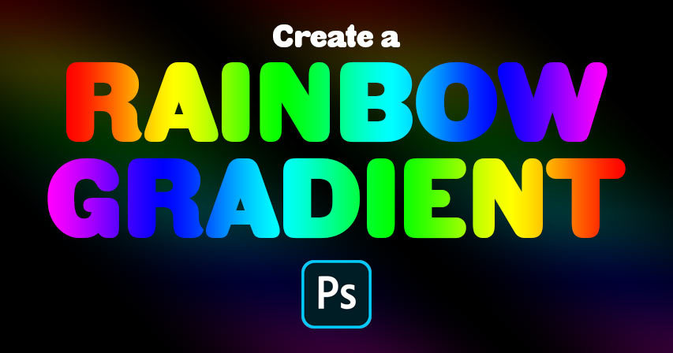

Learn how to create a simple rainbow gradient in Photoshop, how to save it as a rainbow gradient preset, and the fastest way to add your rainbow colors to images, shapes or text! For Photoshop CC 2020.

In this tutorial, I show you how easy it is to create your own rainbow gradient in Photoshop and how to save it as a custom preset. You'll also learn the fastest way to colorize an image with your rainbow colors, and how to add your rainbow gradient to text!

Along the way, we'll be using the Gradients panel which is new as of Photoshop 2020. So for best results, make sure that your copy of Photoshop is [up to date](/basics/update-photoshop-cc/). You can [get the latest Photoshop version here](https://adobe.prf.hn/click/camref:1100lrdjJ/destination:https%3A%2F%2Fwww.adobe.com%2Fproducts%2Fphotoshop.html).

Let's get started!

## Creating a new group for your custom gradients

Before we learn how to create the rainbow gradient, let's quickly create a new **gradient group** to store all of our custom gradients and keep them separate from Photoshop's default gradients. If you have already created a custom group, you can skip this section.

### Step 1: Open the Gradients panel

Start by opening the [Gradients panel](/basics/the-new-gradients-and-gradients-panel-in-photoshop-cc-2020/). You'll find it in the same panel group as the Color, Swatches and Patterns panels.

Notice that all of Photoshop's default gradients are divided into groups, like Basics, Blues, Purples, and so on. And each group is represented by a folder:

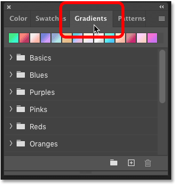
*The Gradients panel.*

### Step 2: Open the Gradients panel menu

Rather than placing the rainbow gradient into one of these default groups, we'll create our own custom group.

Click on the Gradients panel **menu icon** in the upper right:

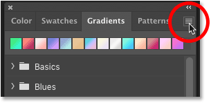
*Clicking the menu icon.*

### Step 3: Choose "New Gradient Group"

Then choose **New Gradient Group** from the menu:

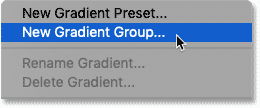
*Creating a new gradient group.*

### Step 4: Name the group "My Gradients"

Name the group "My Gradients", or something similar, and click OK:

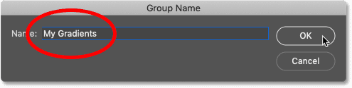
*The Group Name dialog box.*

Then back in the Gradients panel, scroll down past the default groups and the new group will appear at the bottom, ready to hold our rainbow gradient:

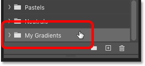
*The new "My Gradients" group.*

[See also: Give someone Rainbow Eye Colors in Photoshop!](/photo-effects/create-rainbow-eye-colors-in-photoshop-cc-2020/)

## How to create a rainbow gradient in Photoshop

Now let's learn how to create the rainbow gradient. As we'll see, it's really just a matter of choosing an existing gradient and then editing the colors.

### Step 1: Select the Gradient Tool

Start by selecting the **Gradient Tool** in the [toolbar](/basics/photoshop-tools-toolbar-overview/):

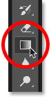
*Choosing the Gradient Tool.*

### Step 2: Open the Gradient Editor

Then in the **Options Bar**, click on the **gradient swatch** to open Photoshop's **Gradient Editor**.

Make sure you click on the color swatch itself, not the little arrow to the right of the swatch:

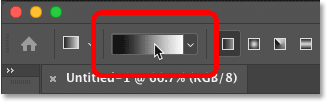
*Clicking the gradient color swatch.*

### Step 3: Select the "Black, White" gradient

In the **Presets** section of the Gradient Editor, twirl open the **Basics** folder and choose the **Black, White** gradient by clicking on its thumbnail. This is the gradient we'll start with:

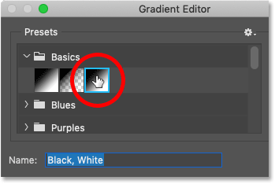
*Selecting the "Black, White" gradient in the Gradient Editor.*

### Step 4: Change the color black to red

Then go down to the gradient **preview bar** in the lower half of the Gradient Editor. 

Click on the **black color stop** below the left side of the preview bar to select it, and then click on the **color swatch** to change the color:

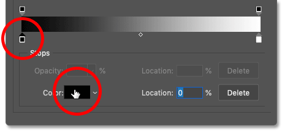
*Clicking the black color stop, and then clicking the color swatch.*

In the **Color Picker**, choose **red** by setting the **R** (Red) value to **255**, and leaving both the **G** (Green) and **B** (Blue) values at **0**. Then click OK to close the Color Picker:

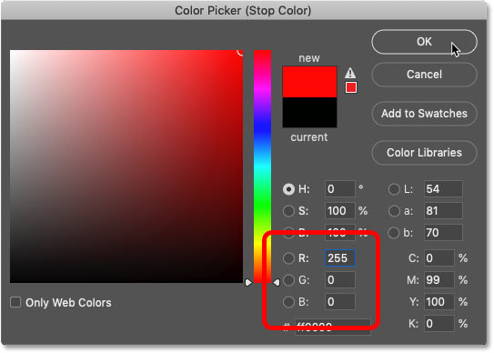
*Setting R to 255, G to 0 and B to 0 for red.*

### Step 5: Set the location of red to 0%

Back in the Gradient Editor, make sure the **Location** value for red is set to **0%**. 

And we now have the first color of our rainbow:

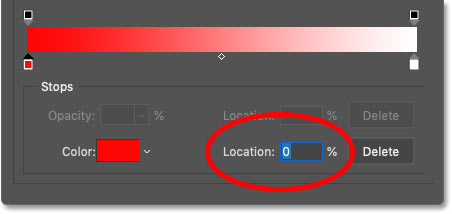
*Setting the location of red to 0 percent.*

### Step 6: Add a new color stop and choose yellow

Next, add a new color stop to the gradient by clicking in a blank area to the right of the red color stop.

Don't worry about where exactly you click. We'll set the location for the color stop in a moment:

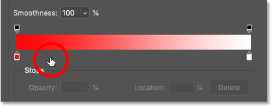
*Clicking to add a new color.*

Then click on the **color swatch** to change the color:

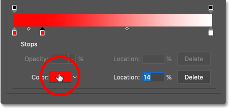
*Editing the color.*

In the Color Picker, choose **yellow** by leaving the **R** value at **255** and changing the **G** value to **255**. Leave the **B** value at **0** and click OK:

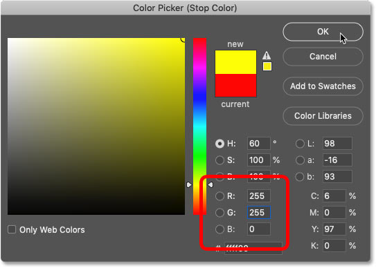
*Setting R to 255, G to 255 and B to 0 for yellow.*

### Step 7: Set yellow's location to 20%

And then back in the Gradient Editor, set the **Location** of yellow to **20%**. Two colors down, four to go:

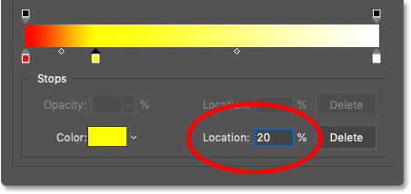
*Setting the location of yellow to 20 percent.*

### Step 8: Add another color stop and choose green

Next we'll add green. Click to the right of the yellow color stop to add a new color:

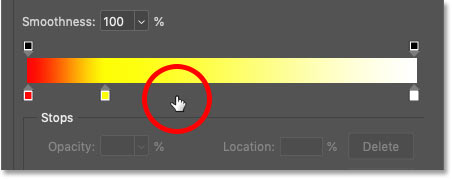
*Adding another new color stop.*

Then click on the **color swatch**:

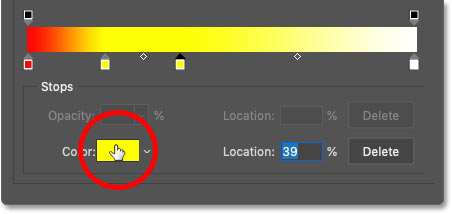
*Changing the new color.*

And in the Color Picker, choose **green** by setting **R** to **0**, and leaving **G** at **255** and **B** at **0**. Then click OK:

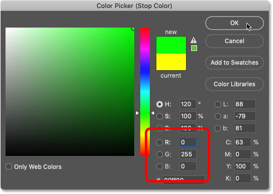
*Setting R to 0, G to 255 and B to 0 for green.*

### Step 9: Set green's location to 40%

Set the **Location** of green to **40%**:

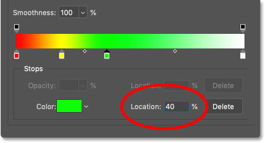
*Setting the location of green to 40 percent.*

### Step 10: Add another color step and choose cyan

The next color we need for our rainbow gradient is cyan. 

Click to the right of the green color stop to add a new color:

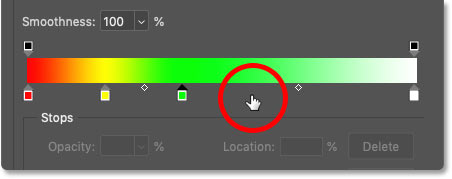
*Adding a third new color stop below the gradient.*

Then click the **color swatch**:

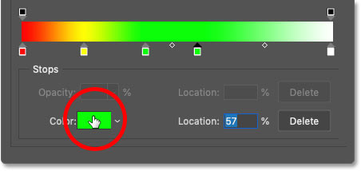
*Clicking the color swatch.*

And in the Color Picker, leave **R** at **0** and **G** at **255**, but change **B** to **255**:

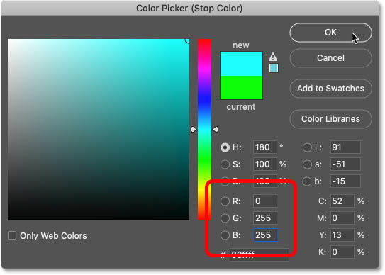
*Setting R to 0, G to 255 and B to 255 for cyan.*

Click OK to close the Color Picker, and then set cyan's **Location** to **60%**:

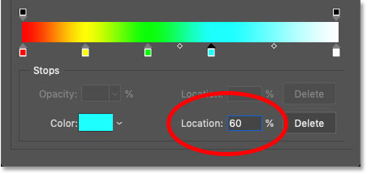
*Setting the location of cyan to 60 percent.*

### Step 11: Add a new color stop and choose blue

We have one more color stop to add, and then we'll edit the white color stop.

Click to the right of the cyan stop to add a new color:

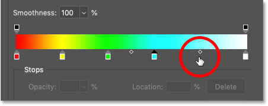
*Adding a fourth new color stop.*

Then click on the **color swatch**:

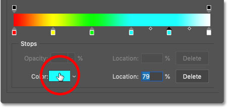
*Changing the color.*

And in the Color Picker, choose **blue** by leaving **R** at **0**, changing **G** to **0** and leaving **B** at **255**:

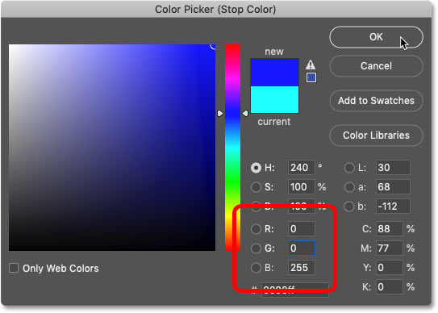
*Setting R to 0, G to 0 and B to 255 for blue.*

### Step 12: Set blue's location to 80%

Click OK to close the Color Picker, and then set the **Location** of blue to **80%**:

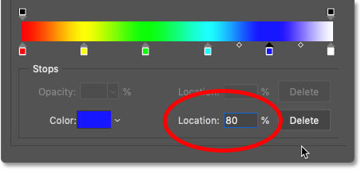
*Setting the location of blue to 80 percent.*

### Step 13: Change the color white to magenta

The last color we need for our rainbow gradient is magenta. 

Click on the **white color stop** below the far right of the gradient preview bar, and then click on the **color swatch**:

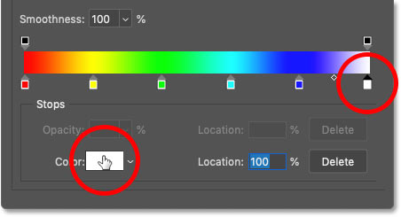
*Selecting the white color stop and clicking the color swatch.*

In the Color Picker, choose **magenta** by changing **R** to **255** and leaving **G** at **0** and **B** at **255**:

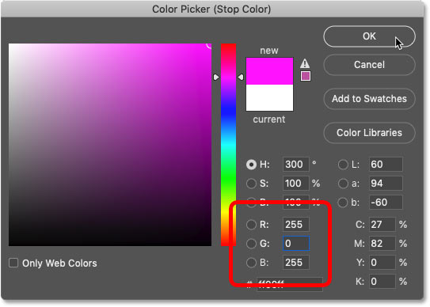
*Setting R to 255, G to 0 and B to 255 for magenta.*

### Step 14: Set magenta's location to 100%

And finally, make sure the **Location** value for magenta is at **100%**.

And we now have our rainbow gradient:

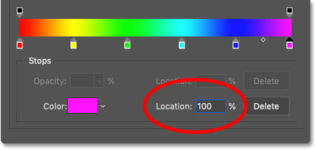
*Setting magenta's location to 100 percent.*

## How to save the rainbow gradient as a preset

So now that we've created the rainbow gradient, let's save it as a gradient preset. For this part, we'll need the custom gradient group that we made back in the first part of the tutorial.

### Step 1: Select your custom gradient group

Still in the Gradient Editor, select your custom group from the **Presets** area:

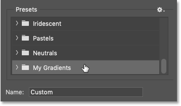
*Selecting the "My Gradients" group.*

### Step 2: Name the gradient "Rainbow"

Change the name of the gradient from "Custom" to "Rainbow":

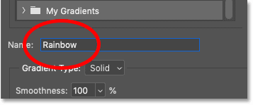
*Naming the gradient "Rainbow".*

### Step 3: Click "New"

And then to save the gradient as a preset, click the **New** button:

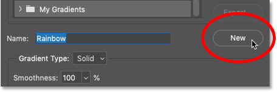
*Clicking "New" to save the preset.*

Back in the Presets area, your rainbow gradient appears as a thumbnail in your custom group, ready to be selected whenever you need it. At this point, you can click OK to close the Gradient Editor. 

Up next, I'll show you the fastest way to apply the rainbow gradient to an image or to text:

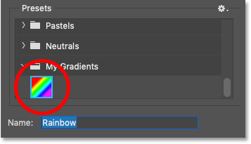
*The new rainbow gradient preset.*

## How to apply the rainbow gradient to an image

As of Photoshop CC 2020, the easiest way to apply the rainbow gradient to an image, [a shape](/basics/drawing-custom-shapes-with-the-shapes-panel-in-photoshop-cc-2020/) or text is by dragging and dropping it from the Gradients panel.

Here's [an image](https://clk.tradedoubler.com/click?p(264303)a(2982769)g(22913540)url(https://stock.adobe.com/ca/images/happy-and-free-boy-on-the-beach-with-seagulls/285959291)) I've opened in Photoshop that I downloaded from Adobe Stock:

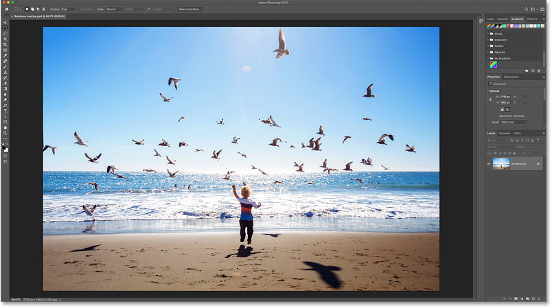
*The original photo. Credit: Adobe Stock.*

### Step 1: Open the Gradients panel

To colorize an image with the rainbow gradient, open the **Gradients panel**:

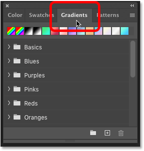
*Opening the Gradients panel.*

### Step 2: Drag the rainbow gradient onto the image

Twirl open the group that holds your rainbow gradient and select it by clicking on its thumbnail:

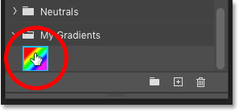
*Choosing the rainbow gradient.*

Then simply drag the gradient from the Gradients panel onto your image:

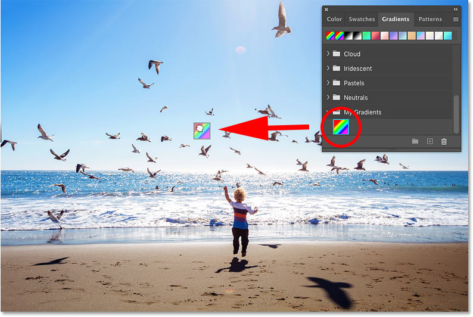
*Dragging the gradient from the Gradients panel and dropping it on the image.*

The gradient temporarily blocks the image from view. 

I'll show you how to change the direction of the colors in a moment:

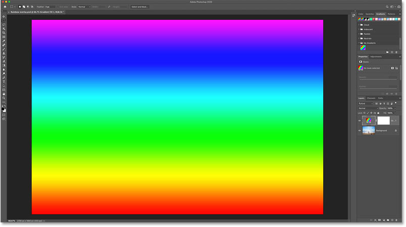
*The result after dragging and dropping the rainbow gradient.*

### Step 3: Change the Gradient fill layer's blend mode

In the [Layers panel](/basics/layers/layers-panel/), the gradient appears on its own **Gradient fill layer** above the image.

To blend the rainbow colors into the image, change the fill layer's **blend mode** to either **Color**, **Overlay** or **Soft Light**. Each mode will give you a different result, so choose the one that looks best:

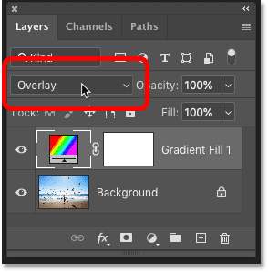
*Changing the Gradient fill layer's blend mode.*

### Step 4: Lower the layer opacity

If the colors are too intense, lower the **Opacity** of the fill layer. I'll lower mine to 40 percent:

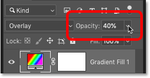
*Lowering the layer's opacity.*

And here's my result with the rainbow gradient set to the Overlay blend mode at 40 percent opacity:

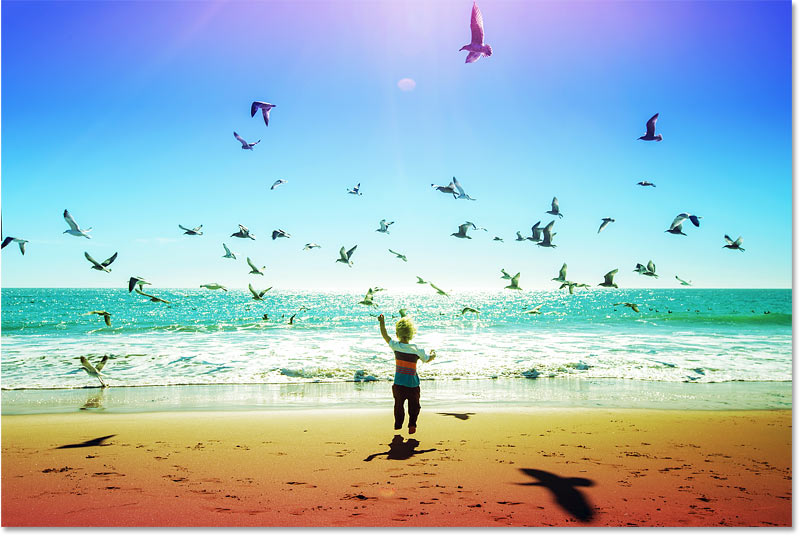
*The result with the rainbow gradient blended with the image.*

### Step 5: Change the gradient's direction

To change the direction of the gradient colors, double-click on the Gradient fill layer's **color swatch** in the Layers panel:

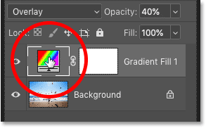
*Double-clicking on the color swatch.*

This opens the **Gradient Fill** dialog box where you can edit various options. 

To simply reverse the gradient colors, select the **Reverse** option. Or enter a new **Angle** value to change the gradient's direction. For example, to display the gradient from left to right, set the angle to **0°**. Or for a diagonal gradient, try **45°**. 

Click OK when you're done to close the dialog box:

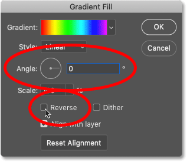
*The Gradient Fill options.*

[Related: Learn ALL the new ways to add gradients in Photoshop!](/basics/new-ways-to-add-gradients-in-photoshop-cc-2020/)

## How to add the rainbow gradient to text

It's just as easy to apply the rainbow gradient to text. But there's a difference in how we edit the gradient options:

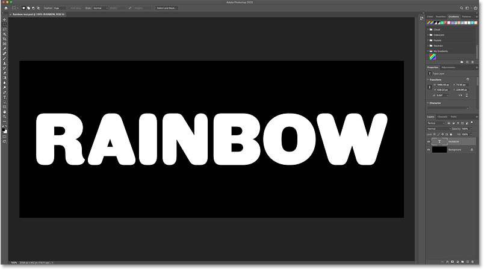
*A Photoshop document with white text in front of a black background.*

### Step 1: Drag the rainbow gradient onto the text

Click and drag the gradient from the Gradients panel onto the text in your document. 

Make sure you drop it directly on one of the letters, not on the background:

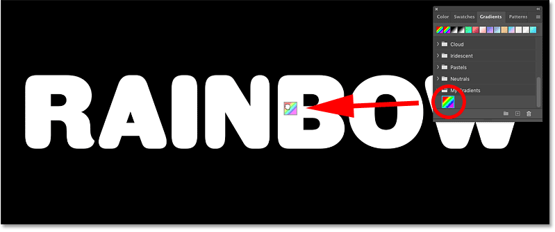
*Dragging and dropping the rainbow gradient onto the text.*

By default, the initial result will look like this, with the gradient running vertically through the letters:

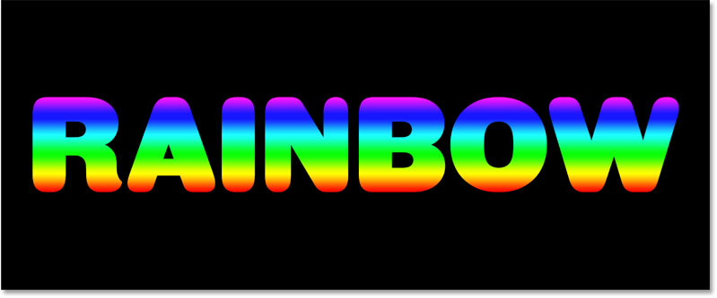
*The initial result.*

### Step 2: Edit the Gradient Overlay layer effect

A moment ago, we saw that Photoshop applies gradients as Gradient fill layers when we drop them onto an image. But when we drop a gradient onto *text*, the gradient is applied as a **Gradient Overlay** layer effect.

To change the gradient's direction, double-click on the words "Gradient Overlay" below the type layer in the Layers panel:

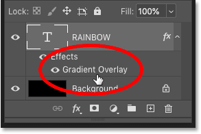
*Double-clicking on "Gradient Overlay".*

Instead of opening the Gradient Fill dialog box, Photoshop opens the **Layer Style** dialog box where we find the same **Reverse** and **Angle** options.

To change the direction from vertical to horizontal, set the **Angle** to **0°**:

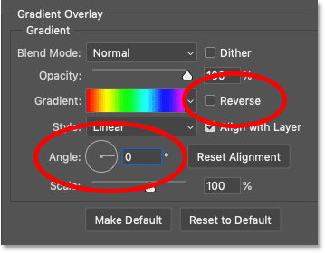
*The Reverse and Angle options for the Gradient Overlay.*

Click OK to close the Layer Style dialog box.

And the rainbow gradient now runs through the text from left to right:

*The final rainbow text effect.*