# How To Create Smart Objects In Photoshop

> Source: [https://www.photoshopessentials.com/basics/how-to-create-smart-objects-in-photoshop/](https://www.photoshopessentials.com/basics/how-to-create-smart-objects-in-photoshop/)
> Downloaded and converted to Markdown.

In this tutorial, I show you how to create smart objects in Photoshop! You'll learn how to open a new image into Photoshop as a smart object, how to convert an existing layer into a smart object, and how to place an image as a smart object into your Photoshop document. We'll also look at how to open raw files as smart objects, both from within Photoshop's Camera Raw plugin and from Adobe Lightroom. And we'll even learn how to place Adobe Illustrator files directly into Photoshop as smart objects!

### What are smart objects?

A smart object is a container that holds the contents of a layer. The container protects the contents inside it from harm. We can scale and resize the container, apply transformations, warps and distortions, and even apply Photoshop's filters to a smart object, all without any loss in quality and without making a single permanent change to the layer inside it.

We can make multiple copies of a smart object, all displaying the same content, and then edit or even replace the content and have our changes instantly appear in each and every copy. This makes smart objects perfect for creating reusable templates! We'll look at different ways to use smart objects throughout this series of tutorials.

In this first tutorial, we'll learn how to create smart objects in Photoshop. I'll be using [Photoshop CC](https://prf.hn/l/dlXjD2w) but you can also follow along with Photoshop CS6. Let's get started!

## How To Convert A Layer Into A Smart Object

Let's start by learning how to convert an existing layer into a smart object. Here's an [image](https://prf.hn/l/pmZBxe8) I currently have open in Photoshop:

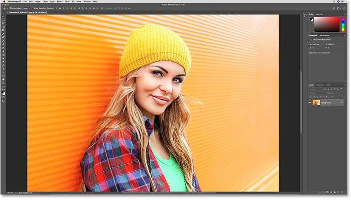
*The original image. Photo credit: Adobe Stock.*

In the [Layers panel](/basics/layers/layers-panel/), we see the image on the [Background layer](/basics/background-layer-photoshop-cc/):

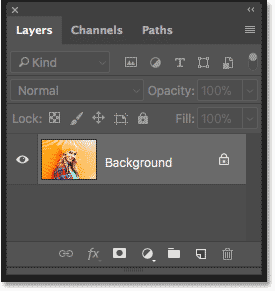
*The Layers panel showing the image on the Background layer.*

### Method 1: The Layer menu

There's a few ways that we can convert a layer into a smart object. One way is by going up to the **Layer** menu in the Menu Bar, choosing **Smart Objects**, and choosing **Convert to Smart Object**:

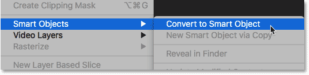
*Going to Layer > Smart Objects > Convert to Smart Object.*

It won't look like anything has happened to the image. But if we look again in the Layers panel, we now see a **smart object icon** in the lower right of the layer's preview thumbnail. This is how Photoshop tells us that the layer is now a smart object. I've enlarged it here to make the icon easier to see:

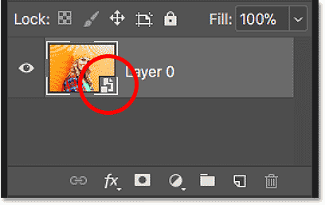
*The smart object icon.*

### Method 2: The Layers panel menu

Another way to convert a layer into a smart object is from the Layers panel menu. Click the **menu icon** in the upper right corner of the Layers panel:

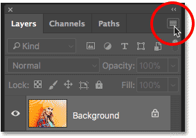
*Clicking the menu icon.*

Then choose **Convert to Smart Object** from the list:

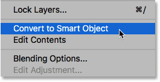
*Choosing "Convert to Smart Object" in the Layers panel menu.*

### Method 3: From the layer itself

A third way is to **right-click** (Win) / **Control-click** (Mac) directly on the layer in the Layers panel:

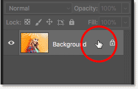
*Right-click (Win) / Control-click (Mac) on the layer.*

And then choose **Convert to Smart Object** from the menu:

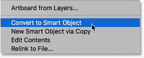
*Choose "Convert to Smart Object" from the list.*

### Method 4: With a selection tool active

And finally, if you have any of Photoshop's [selection tools](/basics/make-selections-photoshop/) active in the Toolbar (the Marquee Tools, the Lasso Tools or the Quick Selection Tool):

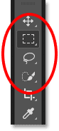
*Make sure you have a selection tool active.*

You can **right-click** (Win) / **Control-click** (Mac) directly on the image in the document and choose **Convert to Smart Object** from the menu. The only selection tool where the Convert to Smart Object command is not available is the [Magic Wand Tool](/basics/selections/magic-wand-tool/):

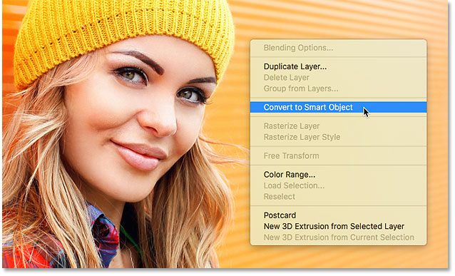
*Right-click (Win) / Control-click (Mac) and choose "Convert to Smart Object".*

## How To Open An Image As A Smart Object

So far, we've learned how to convert an existing layer into a smart object. But we can also open a new image as a smart object in Photoshop. Go up to the **File** menu in the Menu Bar and choose **Open as Smart Object**:

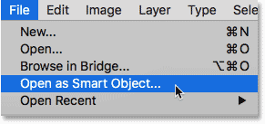
*Going to File > Open as Smart Object*

Navigate to the image on your computer that you want to open. Click on it to select it, and then click **Open**:

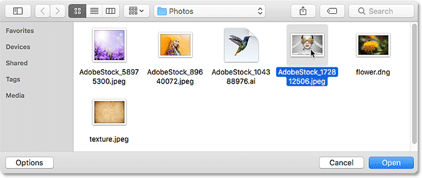
*Selecting the photo to open as a smart object.*

The [image](https://stock.adobe.com/images/portrait-of-beautiful-young-woman-with-colored-glasses-beauty-fashion-perfect-make-up-colorful-decoration-jewelry/172812506) opens in its own separate document:

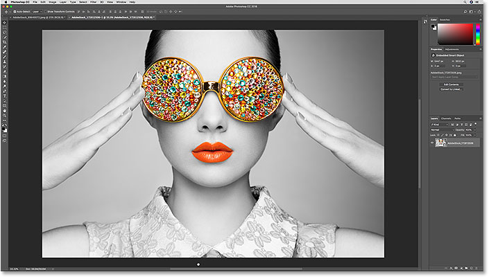
*Opening an image creates a new Photoshop document. Photo credit: Adobe Stock.*

And in the Layers panel, we see the same **smart object icon** in the lower right of the layer's preview thumbnail, telling us that Photoshop has automatically converted the image into a smart object for us:

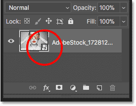
*The image opens as a smart object.*

## How To Open Raw Files As Smart Objects

Along with opening standard image files like JPEGs, we can also open raw files into Photoshop as smart objects. The benefit of opening a raw file as a smart object is that a copy of the raw file itself will be embedded into the Photoshop file, allowing us to reopen it in Camera Raw, edit it as much as we need, and have our changes instantly reflected in the document. To open a raw file as a smart object, go up to the **File** menu in the Menu Bar and choose **Open**:

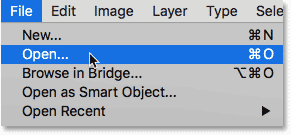
*Going to File > Open.*

Navigate to a raw file on your computer. Click on the file to select it, and then click **Open**. I'll open my "flower.dng" file:

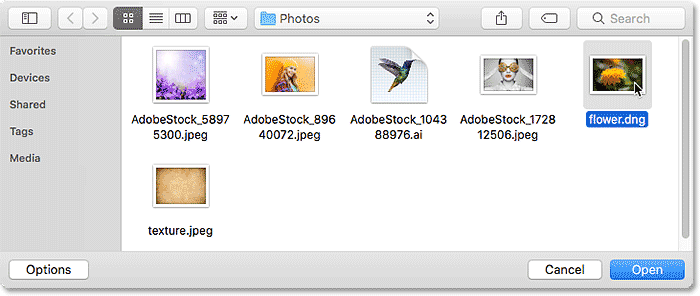
*Selecting a raw file.*

This opens the image into Photoshop's **Camera Raw** plugin:

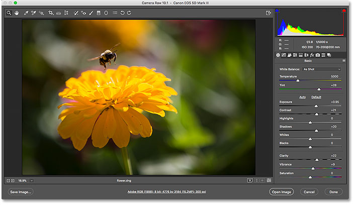
*The raw file opens in Camera Raw.*

### Turning "Open Image" into "Open Object"

If we look down in the bottom right corner, we see the **Open Image** button. But clicking Open Image will open the file into Photoshop as a normal [layer](/basics/understanding-photoshop-layers/), not as a smart object, and we'll lose all the benefits of having the raw file to work with:

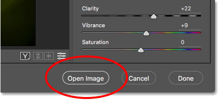
*The standard Open Image button. Don't click this.*

To open the raw file as an editable smart object, press and hold the **Shift** key on your keyboard. This turns the Open Image button into an **Open Object** button:

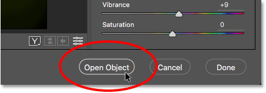
*Hold Shift to turn the Open Image button into Open Object.*

Click on Open Object to open the image into a new Photoshop document:

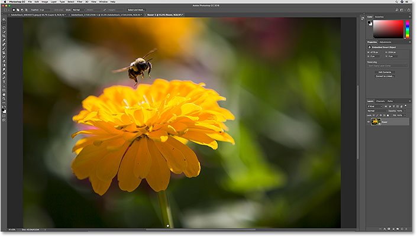
*The raw file opens in Photoshop.*

In the Layers panel, we see the now-familiar **smart object icon** in the lower right of the layer's preview thumbnail, telling us that the image was opened as a smart object:

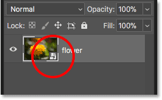
*The Layers panel showing the image as a smart object.*

### Editing a raw file opened as a smart object

As I mentioned, the main benefit of opening a raw file as a smart object is that the raw file itself is now embedded in the document. To reopen the raw file for further editing, double-click on its **thumbnail** in the Layer's panel:

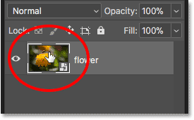
*Double-clicking on the smart object thumbnail.*

This reopens the image in Camera Raw. Make any edits you need, and then click OK to accept them. The changes will instantly appear in your Photoshop document. You can edit the Camera Raw settings as many times as you like with no loss in image quality:

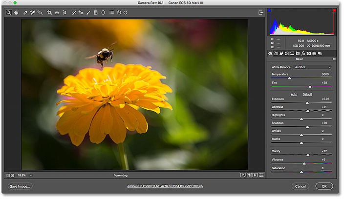
*The full power of Camera Raw is always available with the raw file opened as a smart object.*

### Opening raw files as smart objects from Lightroom

You can also open a raw file as a smart object in Photoshop directly from Adobe Lightroom. In Lightroom, go up to the **Photo** menu, choose **Edit In**, and then choose **Open as Smart Object in Photoshop**. Note, though, that once the image is open in Photoshop, double-clicking on its thumbnail in the Layers panel will open the raw file in Camera Raw, not in Lightroom. However, the editing options in both Camera Raw and Lightroom are exactly the same:

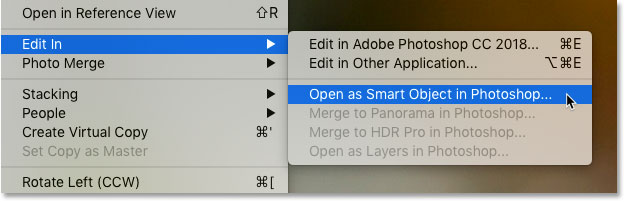
*In Lightroom, go to Photo > Edit In > Open as Smart Object in Photoshop*

## How To Place An Image As A Smart Object

Instead of opening an image into a brand new Photoshop document, we can also *place* an image into an existing document as a smart object. In Photoshop CC, go up to the **File** menu and choose **Place Embedded**. In Photoshop CS6, go to the **File** menu and choose **Place**. Note that in Photoshop CC, there's also an option called Place Linked. We'll look at the difference between Place Embedded and Place Linked in a separate tutorial:

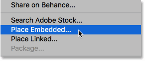
*Go to File > Place Embedded (CC) or Place (CS6).*

Navigate to the image that you want to place into your document. Click on it to select it, and then click **Place**. I'll choose my "texture.jpeg" image:

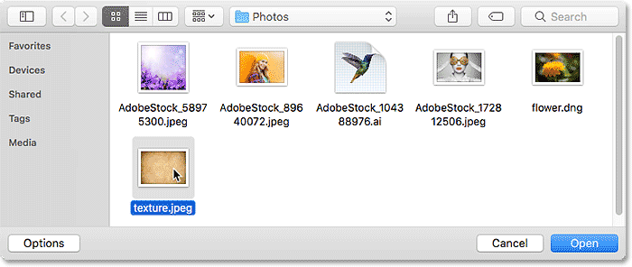
*Selecting the image to place into the document.*

### Resizing the placed image

Photoshop places the texture image into the flower document that I opened a moment ago. Before committing the placed image to the document, Photoshop first gives us the chance to scale and transform it. I want to blend my texture image into the flower photo. But because the texture and the photo are using different aspect ratios, some of the flower image is sticking out on the sides:

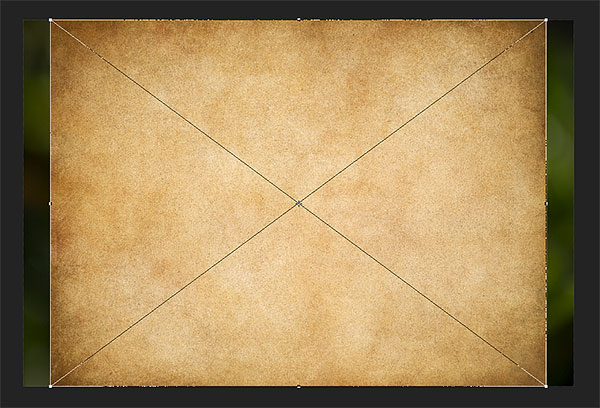
*The texture image doesn't completely cover the flower image below it.*

To scale the texture so it covers the entire image below it, I'll press and hold the **Alt** (Win) / **Option** (Mac) on my keyboard as I click on one of the **side handles** and drag it outward. Holding Alt (Win) / Option (Mac) tells Photoshop to resize the image from its center:

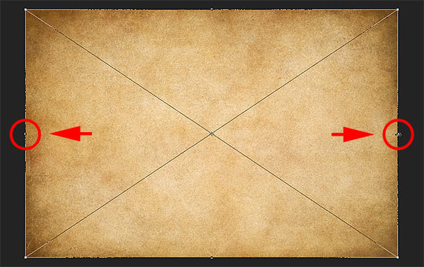
*Holding Alt (Win) / Option (Mac) and dragging the side handles outward.*

To accept it, I'll press **Enter** (Win) / **Return** (Mac) on my keyboard. And now, looking in the Layers panel, we see that my texture image has been placed into the document as a smart object. We also see the photo below it, also a smart object. The photo was opened as a smart object, which created the document, and the texture was then placed as a smart object into the same document:

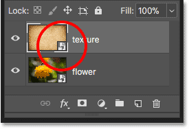
*The texture and the photo below it are both smart objects.*

[Related tutorial: Photoshop's Free Transform essential skills](/basics/photoshops-free-transform-essentials/)

### Using blend modes with smart objects

To blend the texture in with the photo, all I need to do is change the **blend mode** of the texture image. We can use [blend modes](/photo-editing/layer-blend-modes/intro/) with smart objects just like we can with normal layers. I'll change its blend mode from Normal to **Soft Light**:

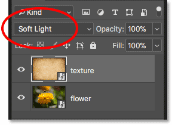
*Changing the blend mode of the texture smart object.*

And now the texture is blending in nicely with the photo below it:

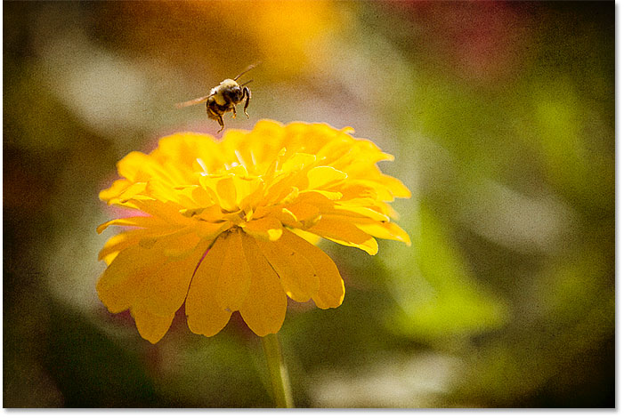
*The result after changing the blend mode of the texture smart object.*

### Applying Camera Raw as a smart filter (Photoshop CC)

Let's say that I like the texture itself but I don't like its color. I'd rather have a grayscale version of the texture so I can keep the original colors in the photo below it. The best way to convert a color image to grayscale (black and white) in Photoshop is by using Camera Raw. But because my texture smart object is holding a JPEG image, not a raw file, I can't just double-click on its thumbnail to open it in Camera Raw.

In Photoshop CC, what I *can* do is apply Camera Raw to the texture as a filter. And since we'll be applying the filter to a smart object, it will automatically become an editable smart filter! To use the Camera Raw Filter, I'll make sure my texture smart object is selected in the Layers panel. Then I'll go up to the **Filter** menu in the Menu Bar and choose **Camera Raw Filter**. Note that the Camera Raw Filter is only available in [Photoshop CC](https://goo.gl/oiav4c):

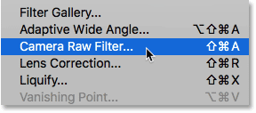
*Going to Filter > Camera Raw Filter.*

This opens the Camera Raw Filter dialog box, which gives us the same image editing features as the main Camera Raw plugin:

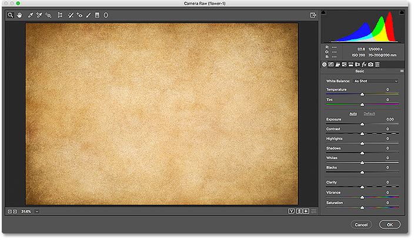
*The Camera Raw Filter.*

#### Converting the texture to grayscale

To convert the texture to grayscale, I'll open the **HSL / Grayscale** panel on the right of the dialog box by clicking its tab, and then I'll select the **Convert to Grayscale** option:

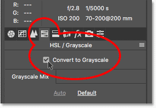
*Choosing "Convert to Grayscale".*

The preview area on the left shows the texture converted to grayscale. I'll click OK to accept it and close the dialog box:

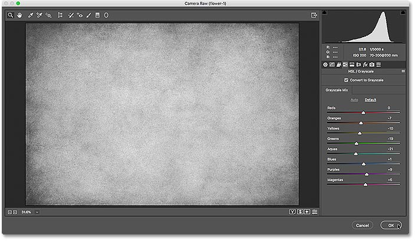
*The preview of what the grayscale version looks like.*

And just like that, I now have a grayscale version of my texture blending in with the photo's original colors:

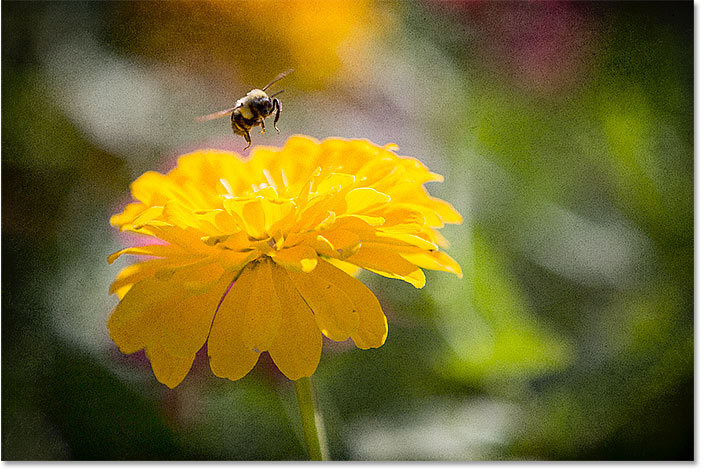
*The result after converting the texture to grayscale.*

### Working with smart filters

The advantage of applying a filter to a smart object is that Photoshop applies it as a **smart filter**. Smart filters are non-destructive, meaning that they won't make any permanent changes to the image. We can change a smart filter's settings at any time, and we can even turn smart filters on and off. In the Layers panel, we see the Camera Raw Filter listed as a smart filter below the texture:

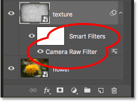
*Smart filters are listed below the smart object.*

If I want to revert back to the color version of my texture, all I need to do is turn off the Camera Raw smart filter. And I can do that just by clicking on the **visibility icon** beside the filter's name:

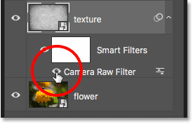
*Clicking the visibility icon to turn the Camera Raw Filter off.*

With the filter turned off, the color version of the texture is instantly restored, and I'm back to blending both the texture itself and its color in with the photo. We'll be learning all about smart filters in a separate tutorial:

*Turning the smart filter off instantly restored the texture's original color.*

## How To Paste Adobe Illustrator Files As Smart Objects

Finally, let's learn how to paste an Adobe Illustrator file into a Photoshop document as a smart object. This will not only keep the original vector shapes intact, but it will also allow us to reopen the file back into Illustrator if we need to make changes, and then have those changes instantly update in Photoshop.

### Step 1: Open the artwork in Illustrator

I'll switch over to Illustrator where I've opened a vector illustration of a hummingbird. I downloaded [this file](https://stock.adobe.com/images/hummingbird-golden-tailed-sapphire-hand-drawn-vector-illustration-of-a-flying-golden-tailed-sapphire-hummingbird-with-colorful-glossy-plumage-on-transparent-background/104388976) from Adobe Stock:

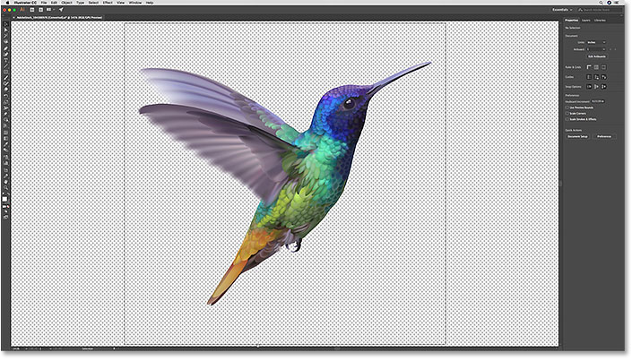
*Vector artwork open in Illustrator. Credit: Adobe Stock.*

### Step 2: Select and copy the artwork

To move artwork from Illustrator into Photoshop, go up to the **Select** menu (in Illustrator) and choose **All**:

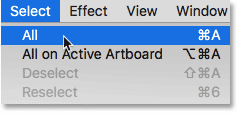
*In Illustrator, going to Select > All.*

With the artwork selected, go up to the **Edit** menu and choose **Copy**. This copies the artwork to the clipboard:

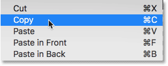
*Going to Edit > Copy.*

### Step 3: Switch over to Photoshop

Switch over to your document in Photoshop. I've opened [this image](https://stock.adobe.com/images/abstract-purple-spring-flowers-background/58975300) of flowers that I'm going to paste the hummingbird into:

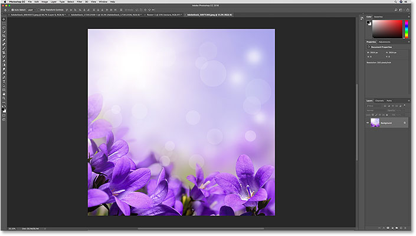
*The Photoshop document where the Illustrator file is headed. Photo credit: Adobe Stock.*

### Step 4: Paste the Illustrator artwork as a smart object

To paste the artwork from Illustrator into the Photoshop document, go up to the **Edit** menu (in Photoshop) and choose **Paste**:

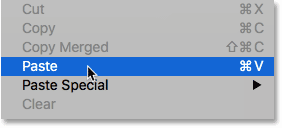
*In Photoshop, going to Edit > Paste.*

Photoshop will ask how you want to paste the artwork. Choose **Smart Object** from the list:

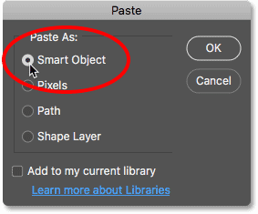
*In Photoshop, going to Edit > Paste.*

#### Scaling and positioning the artwork

Just as we saw earlier when placing a JPEG file into a document, Photoshop will first give you the chance to scale the artwork using the Free Transform handles. You can also drag inside the Free Transform box to move the artwork into position. In my case, I'll simply drag the hummingbird up a little bit higher into the sky above the flowers:

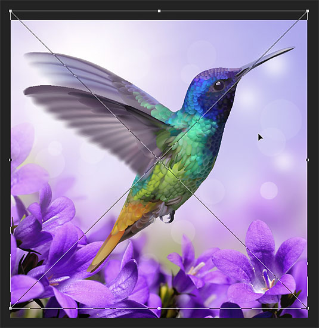
*Scale and position the artwork if needed.*

When you're ready, press **Enter** (Win) / **Return** (Mac) on your keyboard to place the vector art into your document:

*The vector art has been placed into the Photoshop document.*

If we look in the Layers panel, we see the artwork on a new vector smart object above the image, with the smart object icon in the lower right of its preview thumbnail. Since the smart object is holding the original vector art, you can scale and resize it as much as you need without any loss in quality. And if you double-click on the smart object's thumbnail, you'll open the artwork back into Illustrator where you can make any changes you need. When you save the file in Illustrator, the changes will be instantly updated in Photoshop:

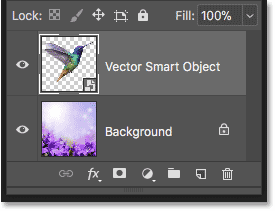
*The Illustrator artwork appears in a vector smart object.*

And there we have it! That's how to open, convert and place your images, raw files and even Illustrator files into Photoshop as editable, non-destructive smart objects! For more on smart objects, learn how to [scale and resize images without losing quality](/basics/scale-resize-images-smart-objects-photoshop/), and how smart objects make it easy to [transform and distort type](/basics/transform-type-smart-objects/)! Or visit our [Photoshop Basics](/basics/) section for more tutorials!