# How to Crop a Single Layer in Photoshop

> Source: [https://www.photoshopessentials.com/basics/how-to-crop-a-single-layer-in-photoshop/](https://www.photoshopessentials.com/basics/how-to-crop-a-single-layer-in-photoshop/)
> Downloaded and converted to Markdown.

Here are two ways to crop a single layer in Photoshop so you can crop the contents of one layer without cropping every layer at once. For Photoshop 2025 and earlier.

One question I’m asked a lot is, “How do you crop the contents of a single layer?” We can’t use the [Crop Tool](/basics/how-to-crop-images-photoshop-cc/) because it crops all layers at once. So in this tutorial, I show you two ways to do it. The first way is the easiest way to crop a layer, but the easy way is not always the best. So I also show you a better way that's both flexible (you can go back and edit the crop) and non-destructive.

### Which version of Photoshop do I need?

I'm using [Photoshop 2025](https://adobe.prf.hn/click/camref:1100lrdjJ/destination:https%3A%2F%2Fwww.adobe.com%2Fproducts%2Fphotoshop.html), released in October 2024, but any recent version will work.

### The document setup

Here I have a document with two layers, as we see in the [Layers panel](/basics/layers/layers-panel/).

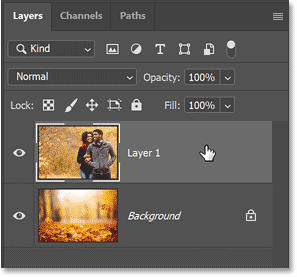
*Photoshop’s Layers panel.*

Each [layer](/basics/open-multiple-images-as-layers-in-photoshop/) holds a different image. Here’s the image on the top layer ([couple photo](https://adobe.prf.hn/click/camref:1100lrdjJ/destination:https%3A%2F%2Fstock.adobe.com%2Fimages%2Floving-afro-couple-dating-in-park-enjoying-autumn-day%2F286292824) from Adobe Stock). I want to crop away most of this image and keep just the area around the two people.

*The image on the layer that will be cropped.*

If I turn off the top layer by clicking its visibility icon:

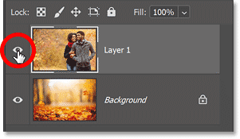
*Turning off the top layer.*

We see the image on the bottom layer ([leaves photo](https://prf.hn/l/ERLla1V) from Adobe Stock). Once I’ve cropped the other image, I’m going to move the cropped version into the center of this image .

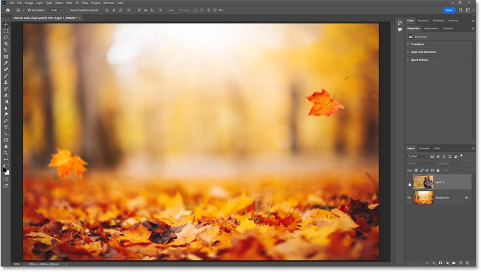
*The image on the Background layer.*

Let's get started!

## The easy way to crop a single layer in Photoshop

Here’s the fastest and easiest way to crop a single layer in Photoshop.

### Step 1: Select the layer you want to crop

In the Layers panel, make sure the layer you want to crop is selected.

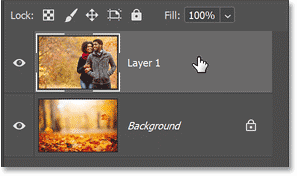
*Selecting the layer to crop.*

### Step 2: Choose the Rectangular Marquee Tool

Then in the [toolbar](/basics/photoshop-tools-toolbar-overview/), select the [Rectangular Marquee Tool](/basics/photoshop-selection-basics-the-rectangular-and-elliptical-marquee-tools/).

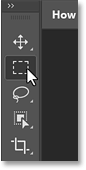
*Choosing the Rectangular Marquee Tool.*

### Step 3: Select the area to keep

Drag a selection outline around the part of the image you want to keep. Everything outside the selection will be cropped away. Here I’m dragging my selection around the two people.

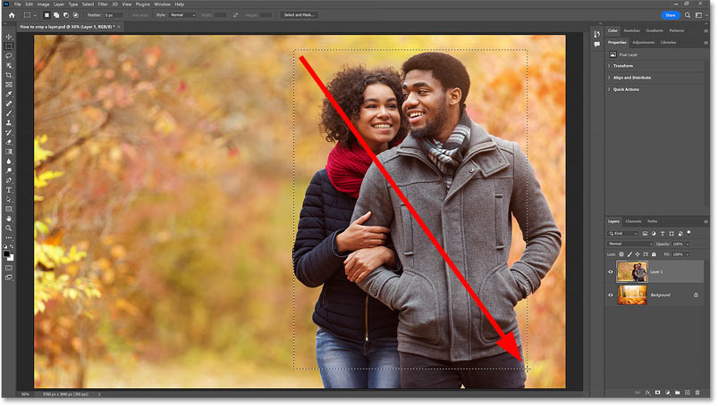
*Dragging a selection around the  area to keep.*

### Step 4: Resize the selection with Transform Selection

If you need to resize your selection outline before cropping the layer, go up to the Select menu in the Menu Bar and choose [Transform Selection](/basics/resize-selections-with-transform-selection/).

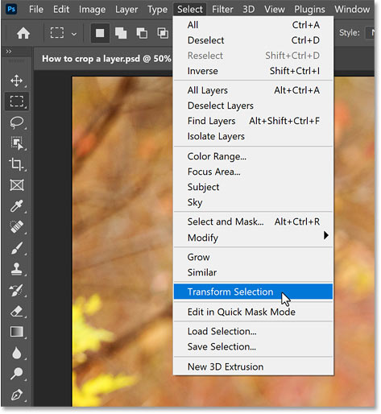
*Choosing Transform Selection from the Select menu.*

In the Options Bar, unlink the Width and Height fields to unlock the aspect ratio of the selection.

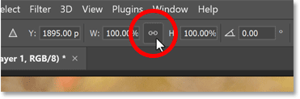
*Unlinking the Width and Height.*

Then drag any of the transform handles to resize the selection outline.

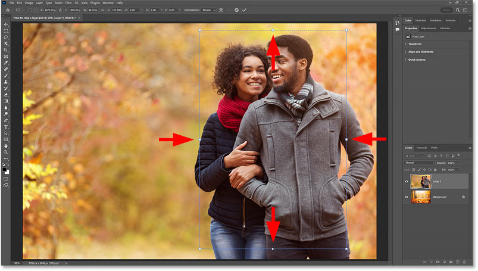
*Dragging the handles to resize the selection.*

Click the checkmark in the Options Bar to accept it and close Transform Selection.

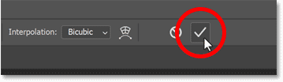
*Clicking the checkmark.*

### Step 5: Invert the selection

At the moment, everything on the layer that we want to keep is selected. But what we need is for everything we want to crop away to be selected. Which means we need to invert the selection. 

So go up to the Select menu and choose Inverse.

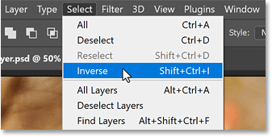
*Choosing Inverse from the Select menu.*

### Step 6: Crop the layer

Then to crop the layer, press the Delete key on your keyboard. Everything that was outside your initial selection gets cropped away.

*Press Delete to crop the layer.*

### Step 7: Remove the selection outline

To remove the selection outline, go back to the Select menu and choose Deselect.

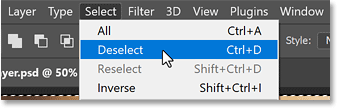
*Choosing Deselect from the Select menu.*

And that’s the easiest way to crop a layer. If I turn off the Background layer:

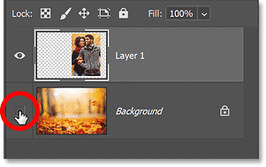
*Clicking the Background layer’s visibility icon*

We see that everything around my selection was cropped away and replaced with transparency (indicated by the checkerboard pattern).

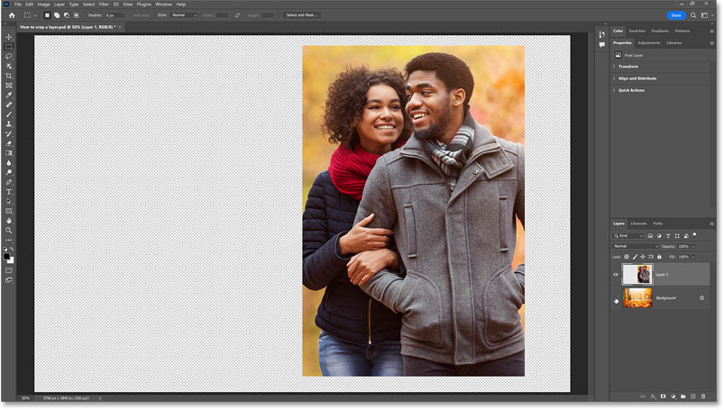
*The unwanted parts of the layer have been cropped away.*

### Why the easy way to crop a layer is not always best

But here’s the problem. We have now permanently deleted the pixels we cropped away, which means  there is no way to go back and edit the crop if we need to restore some of that missing area. At least, not without undoing the crop and starting over.

## How to crop a layer using a layer mask

So let me show you a better way to crop a layer in Photoshop, one that is both editable and non-destructive. Instead of deleting the unwanted pixels, we’ll simply hide them using a layer mask.

[Related: Extend an image like magic with Generative Fill in Photoshop](/photo-editing/extend-images-with-generative-fill/)

### Step 1: Select the area you want to keep

If you have not done so already, use the first 4 steps in the previous section to draw a selection outline around the part of the layer you want to keep.

In my case, I’m just going to undo my last few steps, by pressing Ctrl+Z on a Windows PC or Command+Z on a Mac a few times, to get back to my initial selection around the two people.

*Restoring the selection around the area to keep.*

### Step 2: Add a layer mask

In the Layers panel, click the Add Layer Mask icon.

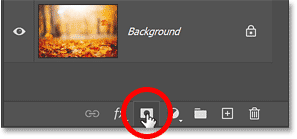
*Adding a layer mask.*

Photoshop crops away everything on the layer that was outside the selection. But this time, those pixels are not gone. They’re just hidden from view.

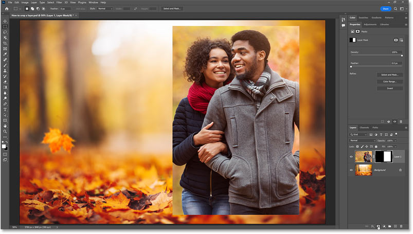
*The layer is cropped but nothing was deleted.*

Notice that we now have a [layer mask](/basics/understanding-photoshop-layer-masks/) on the layer, indicated by the mask thumbnail. The layer mask is hiding everything that was outside our selection. The white area on the mask is where the contents of the layer are still visible. And the black area is where the content is hidden.

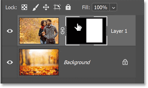
*The layer mask thumbnail.*

### How to toggle the layer mask on and off

You can toggle the layer mask on and off by holding Shift on your keyboard and clicking the layer mask thumbnail. With the mask turned off, the entire layer is once again visible. Click the mask thumbnail again to turn the layer mask back on.

*Turning off the mask shows the entire contents of the layer.*

### How to view the layer mask on the canvas

And to view the layer mask on the canvas, hold the Alt key on a Windows PC or the Option key on a Mac and click the layer mask thumbnail.

Viewing the layer mask makes it easy to see where the layer is visible (the white area) and where it is hidden (the black area). Hold Alt or Option and click the mask thumbnail again to return to the main image view.

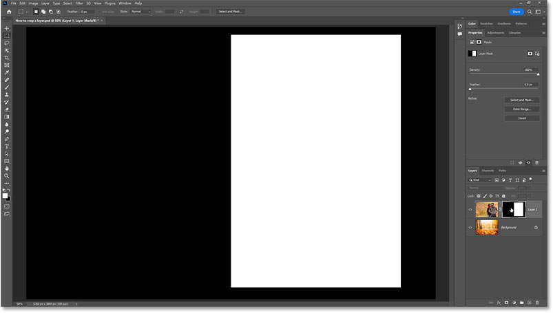
*Viewing the layer mask on the canvas.*

### Step 3: Unlink the mask from the layer

Since we are just hiding pixels, not deleting them, we can edit the crop simply by resizing the visible area of the layer mask.

In the Layers panel, click the link icon between the layer thumbnail and the mask thumbnail to unlink the mask from the layer. This will let us resize the mask without resizing the layer contents.

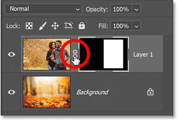
*Clicking the link icon to unlink the mask from the layer.*

### Step 4: Select the layer mask

Then click on the mask thumbnail to select it if it is not selected already. You should see a white border around the thumbnail.

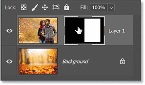
*Selecting the layer mask.*

### Step 5: Resize the layer mask with Free Transform

Go up to the Edit menu in the Menu Bar and choose [Free Transform](/basics/transform-and-warp-images-with-free-transform-in-photoshop-cc-2019/).

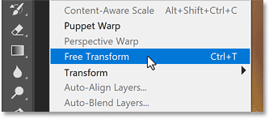
*Selecting Free Transform from the Edit menu.*

In the Options Bar, again make sure the link icon between the Width and Height fields is not selected so that the aspect ratio of the layer mask is unlocked.

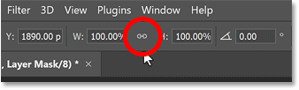
*The Width and Height should not be linked.*

Then drag any of the transform handles around the visible area of the layer mask to resize the crop.

*Dragging the handles to resize the layer mask.*

When you’re done, click the checkmark in the Options Bar to accept it and close Free Transform.

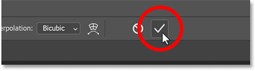
*Clicking the checkmark.*

## Moving the cropped layer

Now that I have cropped the top layer using a layer mask, I want to move the cropped image into the center of the background image.

So in the [toolbar](/basics/photoshop-tools-toolbar-overview/), I’ll select the Move Tool.

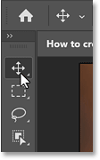
*Clicking the checkmark.*

But before I can move the image, I first need to relink the layer and the mask, otherwise I’ll end up moving one but not the other. So in the Layers panel, I’ll relink them by clicking in the empty space between the layer thumbnail and the mask thumbnail. The link icon reappears.

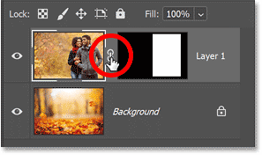
*Relinking the layer and the mask.*

And now I can drag the cropped image into the center.

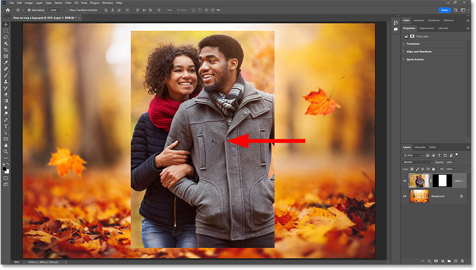
*Dragging the cropped layer into the center of the background image.*

## Adding layer effects to the cropped layer

I’ll quickly finish up by adding a stroke and drop shadow to the cropped image using [layer effects](/basics/copy-layer-effects-photoshop/).

In the Layers panel, I’ll click the fx icon.

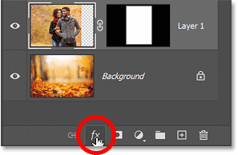
*Clicking the layer effects icon.*

Then I’ll choose Stroke.

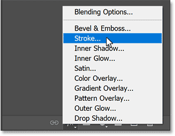
*Choosing Stroke.*

In the Layer Style dialog box, I’ll set the stroke Color to white, the Position to Inside, and the Size to 29 pixels.

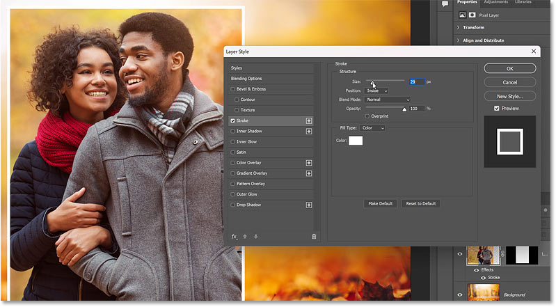
*The Stroke options.*

Then still in the Layer Style dialog box, I’ll select Drop Shadow from the column along the left.

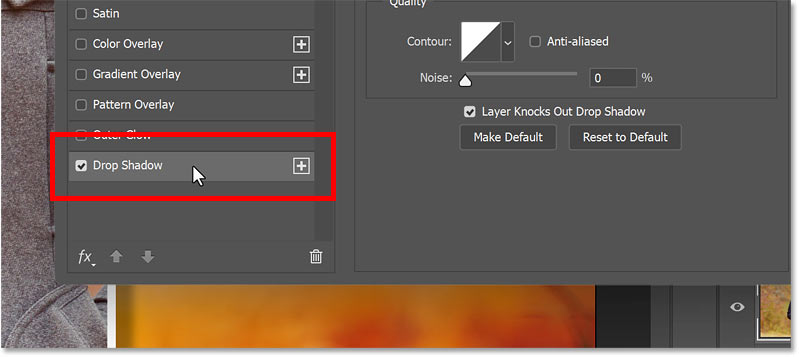
*Adding a Drop Shadow.*

And I can easily adjust the Angle and Distance of the shadow just by clicking and dragging on the image itself.

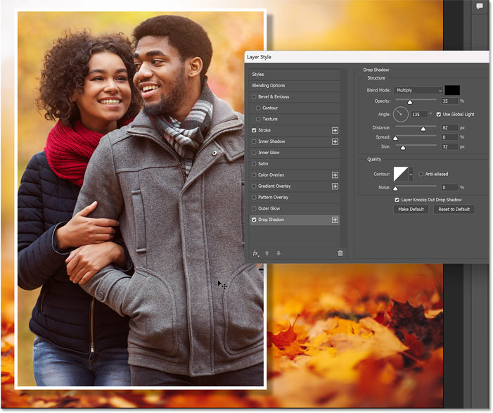
*Dragging on the image to position the Drop Shadow.*

Then I’ll click OK to close the dialog box.

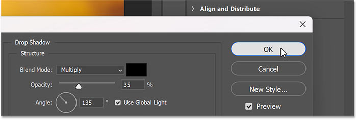
*Closing the dialog box.*

Here is the final result.

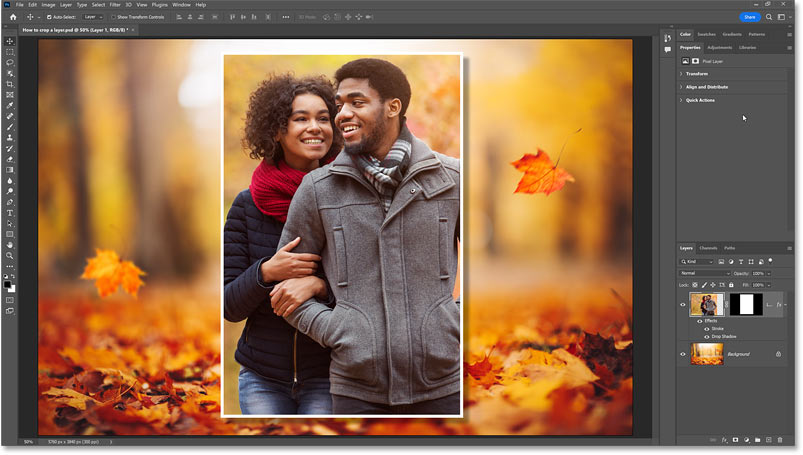
*The final effect with the cropped layer centered in the background image.*

And there we have it! That’s two ways to crop a single layer in Photoshop.