# How To Download Photos From Your Camera With Adobe Bridge

> Source: [https://www.photoshopessentials.com/basics/how-to-download-photos-from-your-camera-with-adobe-bridge/](https://www.photoshopessentials.com/basics/how-to-download-photos-from-your-camera-with-adobe-bridge/)
> Downloaded and converted to Markdown.

Learn how to download photos from your digital camera or memory card to your computer using Adobe Bridge and its Photo Downloader app. Preview and select images, save a backup of your files, add copyright information, and more! For Adobe Bridge CC and CS6.

In the previous tutorial in this series on Getting Started with Photoshop, we learned how to install Adobe Bridge CC**.** Bridge is a file browser included with Photoshop and with every Creative Cloud subscription. Now that Bridge is installed, let's learn how to use Bridge to get photos from our camera or memory card onto our computer. Once Adobe Bridge has downloaded our photos, we can begin using Bridge to organize our images and open them into Photoshop.

To download images, Bridge actually uses a separate, built-in app known as the **Photo Downloader**. In this tutorial, we'll learn how to access the Photo Downloader in Bridge, and how to use it to download our files. This tutorial is compatible with both Adobe Bridge CC and Adobe Bridge CS6. However, if you're a Photoshop CC user, make sure you've [installed Bridge CC](basics/install-adobe-bridge-cc/ "How to install Adobe Bridge CC") before you continue. Adobe Bridge CS6 installs automatically with Photoshop CS6, so CS6 users don't need to install Bridge separately.

Also, since we're learning how to download photos, it helps to have some photos to download. To follow along, you'll want to have your camera or memory card plugged into your computer.

This is lesson 3 of 8 in [Chapter 1 - Getting Started with Photoshop](/basics/getting-started-photoshop/ "Learn more").

Let's get started!

## How To Download Photos With Adobe Bridge

### Step 1: Launch Adobe Bridge

First, to download your photos, open Adobe Bridge. The easiest way to launch Bridge is from Photoshop. Go up to the **File** menu (in Photoshop) in the Menu Bar along the top of the screen and choose **Browse in Bridge**:

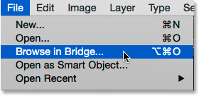
*In Photoshop, go to File > Browse in Bridge.*

### Step 2: Launch The Photo Downloader

With Bridge open, launch the Photo Downloader. As I mentioned, the Photo Downloader is a separate app that's built in to Adobe Bridge. To give the Photo Downloader something to download, make sure your camera or memory card is plugged in. Then, to open the Photo Downloader, go up to the **File** menu (in Bridge) at the top of the screen and choose **Get Photos from Camera**:

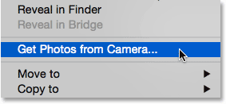
*In Bridge, go to File > Get Photos from Camera.*

Another way to launch the Photo Downloader is by clicking the **camera icon** in the **toolbar** that runs along the upper left of the Bridge interface:

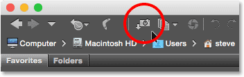
*Clicking the camera icon also opens the Photo Downloader.*

#### Launching The Photo Downloader Automatically (Mac Only)

Bridge can also launch the Photo Downloader automatically when you connect a camera or memory card to your computer. But for whatever reason, this option is only available on the Mac. Windows user can skip ahead to Step 3. 

On a Mac, when the Photo Downloader opens for the first time, Bridge will ask if the Photo Downloader should launch automatically each time a camera or memory card is connected. Choose **Yes** or **No** depending on your personal preference. To stop Bridge from asking this every time you launch the Photo Downloader, choose **Don't show again** before making your choice:

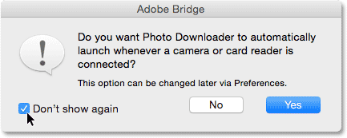
*Bridge asks if you want the Photo Downloader to launch automatically (Mac only).*

You can always change your mind later by turning the same option on or off in the Bridge Preferences. To open the Preferences, go up to the **Adobe Bridge CC** (or **Adobe Bridge CS6**) menu at the top of the screen and choose **Preferences** (again, this is for Mac users only):

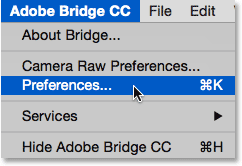
*Going to Adobe Bridge CC > Preferences.*

The Preferences dialog box will open to the General options. Look for the option that says **When a Camera is Connected, Launch Adobe Photo Downloader**. Check or uncheck this option to toggle it on or off. Then, click OK to close the Preferences dialog box:

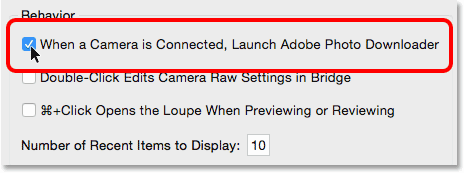
*Choose whether or not to launch the Photo Downloader automatically in the Bridge Preferences.*

### Step 3: Choose Your Camera Or Memory Card

With the Photo Downloader open, use the **Get Photos from** option at the top to select the source of your images. The source will be either your camera or memory card. Sometimes the Photo Downloader automatically detects the correct source for you. If it doesn't, choose the correct source from the list. If your camera or memory card is not listed, make sure it's connected properly to your computer. Then, click the **Refresh List** option.

In my case, I have my memory card connected via a USB card reader. Since my photos were taken with a Canon camera, the card appears in the list as "EOS_DIGITAL". Your card may be named something different depending on your camera's manufacturer:

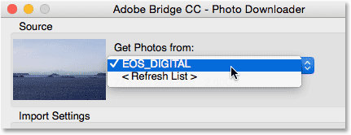
*Selecting my memory card as the source of the images to download.*

### Step 4: Switch To The Advanced Dialog

By default, the Photo Downloader appears in what Adobe calls the **Standard dialog**. The Standard dialog is a simplified version of the Photo Downloader interface. It gives us access to most, but not all, of the options available to us. A better choice is to use the **Advanced dialog**. The Advanced dialog isn't really "advanced". It just gives us more options. To switch from the Standard to the Advanced dialog, click the Advanced Dialog button in the lower left of the dialog box:

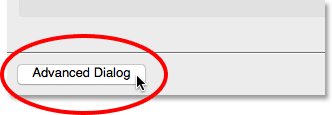
*Clicking the Advanced Dialog button in the bottom left corner.*

The Advanced dialog includes all of the options from the Standard dialog, plus a few additional and important features. We now have a large **preview area** displaying thumbnails of all the images on the camera or memory card. We also have options in the lower right for adding **copyright information** (metadata) to the images as they're being downloaded:

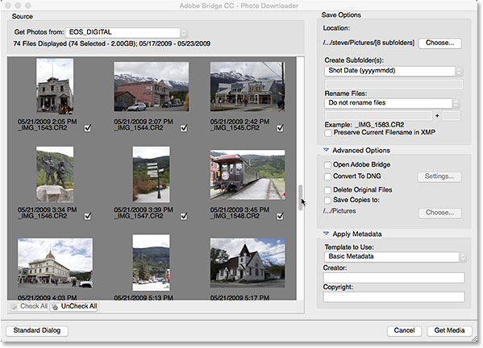
*The Advanced dialog version of the Photo Downloader, complete with thumbnail previews.*

### Step 5: Select The Images You Want To Download

Along with letting us view the images, the preview area also lets us choose which photos we want to download. In most cases, you'll want to download everything and then decide later which images are worth keeping. But if you know for a fact that there are images you don't need, there's a couple of ways to stop those images from downloading.

Below each thumbnail, along with the file's name, shot date and time, you'll see a **checkbox**. Every image with a check inside the box will be downloaded. By default, every image is checked. If there are only a few images you want to exclude, simply **uncheck** them. Depending on how many images you have, you may need to scroll through them using the scroll bar along the right:

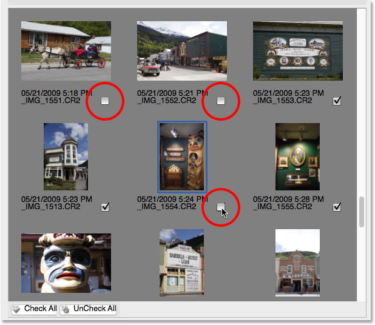
*Unchecking the images I don't want to download.*

If there are more than a few images you want to exclude, it may be faster to uncheck them all. Then, you can manually select the ones you want to keep. To do that, click the **UnCheck All** button below the preview area:

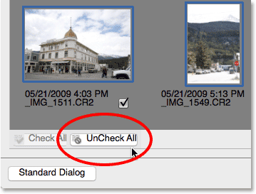
*The UnCheck All button instantly deselects all the images.*

Then, press and hold the **Ctrl** (Win) / **Command** (Mac) key on your keyboard and click on the images you want to download. A **highlight box** will appear around each image you select. Once they're all selected, click inside the checkbox of any of your highlighted images to select them all:

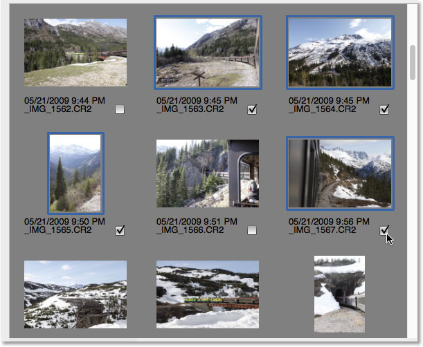
*Manually selecting the images I want to download.*

### Step 6: Choose Where You Want To Save The Images

Next, we need to specify the location on our computer where the Photo Downloader should save the images. We do that in the **Save Options** section in the upper right of the dialog box. Click the **Choose** button. Then, navigate to the folder or location where you want to save them. Here, I'll be saving mine to a folder named "photos" on my Desktop. Ideally, you'll want to save your images to a separate external hard drive, but I'll just choose this folder for now:

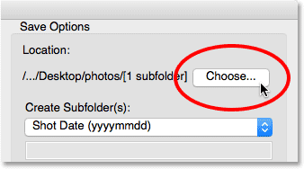
*Choose the location for storing your images.*

### Step 7: Create A Subfolder For The Images

To help keep your photos better organized, the Photo Downloader will create a subfolder in the location you specified. It will then save your images in the subfolder. By default, the subfolder will be named based on the date the photos were taken. Cick on the box below the words **Create Subfolder(s)** to open a list of preset naming options for the folder. Most of the options are just variations on the shot date. 

If you need something more specific, choose **Custom Name** from the list, Then, enter anything you like for the folder's name. Since I shot these photos in Alaska, I'll name my subfolder "Alaska". The Location section above updates to show a preview of the name you've entered:

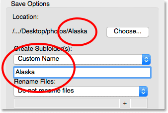
*Choosing a custom name for the subfolder.*

### Step 8: Rename The Files (Optional)

The Photo Downloader also includes a **Rename Files** option that lets us rename our images as they're being downloaded. While it may be tempting to rename them at this point, there's a couple of reasons why I recommend against it. The main reason is that you probably won't want to keep all of your images once you've had a chance to look them over. Renaming files first and then deleting ones we don't like means we end up with breaks in the naming sequence. It would be better to review the images first in Adobe Bridge. Then, we can delete the ones not worth keeping, and *then* rename the keepers. 

Also, Adobe Bridge includes a **Batch Rename** feature that makes it incredibly easy to rename multiple files at once. So, since we don't know which images we're going to keep, and we can easily rename them later, it's just not worth renaming them here.

#### Choosing A New File Name

By default, the Rename Files option is set to **Do not rename files**, so you can safely ignore it. But, if you do need to rename them here, click on the Rename Files box to choose from a list of preset naming options. Again, most of the presets are variations on the shot date. There's also a **Custom Name** option that lets us enter our own name for the files. I'll choose Custom Name, and then I'll enter "Alaska". An example of the new file name appears directly below the name field:

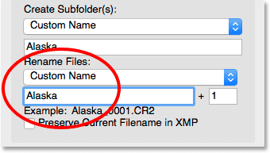
*Entering a new custom name for the files.*

#### Setting The Four-Digit Extension And Preserving The Original File Name

To the right of the name field is another field with a number in it. The number is the starting number of a **four-digit extension** that will be appended to the file names. The default value is 1, which means the sequence will begin with "0001"**. You can enter your own value as well. Again, an example of the new name, along with its four-digit extension, appears below the name field. In my case, the files would be renamed beginning with "Alaska_0001". 

If you want to embed the original file name with the image, select the **Preserve Current Filename in XMP** option. If you change your mind and decide not to rename the files, as I'm going to do, set the Rename Files box back to **Do not rename files**:

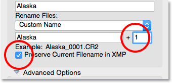
*The number box specifies the start of a four-digital extension. Preserve Current Filename in XMP stores the original name in the file.*

### Step 9: The Advanced Options

Directly below the Save Options is the **Advanced Options** section. But oddly enough, you won't find any advanced options here. Instead, you'll find the same four options that are also found in the Standard dialog. Still, these options are important, so let's take a look at them. You may need to click on the words "Advanced Options" to twirl the section open.

#### Open Adobe Bridge

The first option in the "Advanced" section is **Open Adobe Bridge**. Leave this option checked to have Bridge open to the folder containing your images once the download is complete:

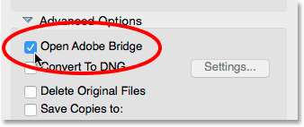
*Leave the "Open Adobe Bridge" option checked.*

#### Convert to DNG

The next option is **Convert to DNG**. DNG stands for "Digital Negative" and is Adobe's version of the **raw file format**. If your camera supports the raw format and your images were captured as raw files, it's a good idea to select this option. This will convert your images from your camera's raw file format to Adobe's DNG format as they're being downloaded. DNG files are smaller than your camera's native raw files so they'll take up less space without any loss in quality. DNG is also an open source format, not owned by any camera manufacturer. This can help keep your images compatible with future versions of Photoshop and other software. And, for reasons we'll look at in our Camera Raw section, the DNG format makes it easier to move files that have been edited in Camera Raw.

We'll learn more about the DNG format in another tutorial. For now, if you're familiar with DNG, go ahead and select this option, otherwise you can safely leave it unchecked. You can always convert your raw files to DNG later if you choose:

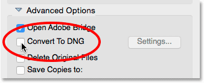
*Leaving the "Convert to DNG" option unchecked for now.*

#### Delete Original Files

The third option is **Delete Original Files**. This will delete your images from your camera or memory card as soon as the download is finished. Leave this option turned off. Otherwise, you could lose your files forever if something goes wrong during the download process. A better way to work is to leave the files on your memory card until you're sure they all made it to your computer safely. Then, to clear off the images, format the memory card in your camera the next time you go to shoot:

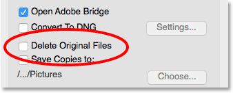
*Leave "Delete Original Files" unchecked to avoid losing your images.*

#### The "Save Copies to" Option

The fourth option, **Save Copies to**, will save a copy of your files to a second location. This is a great way to back up your images and is highly recommended. Whenever possible, choose a separate hard drive, not the same hard drive as the original location. External hard drives work great. This way, if one hard drive fails, you'll still have a copy of your images on the second drive. Enable the "Save Copies to" option by clicking inside its checkbox. Then click the **Choose** button and browse to the location where you want to save the backups. As the images are being downloaded from your camera or memory card, the Photo Downloader will save them to both your primary location (that you specified earlier) and this secondary location:

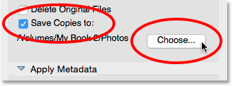
*Use the "Save Copies to" option to save a backup of your files.*

### Step 10: Add Your Copyright Information

Finally, below the Advanced Options is the **Apply Metadata** section. This section is only available in the Advanced dialog. Apply Metadata lets us add creator and copyright information to our images as they're being downloaded. Enter your name into the **Creator** field. Then enter your copyright info into the **Copyright** field. To add the copyright symbol ( **©** ), on a Windows PC, press and hold your **Alt** key and type **0169** on your keyboard's numeric keypad. On a Mac, it's even easier. Just press **Option+G** on your keyboard. As we'll see in another tutorial, Adobe Bridge gives us other ways to add copyright and other metadata to our images, including the ability to create and apply metadata templates. For now, we'll keep things simple and stick with the basic options:

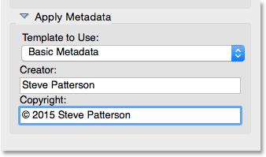
*Use the Apply Metadata section to add creator and copyright info to your images.*

### Step 11: Download Your Images

To download your images, click the **Get Media** button in the lower right corner of the Photo Downloader. Depending on the number of images, the size of the files and other factors, it may take a while for the download to complete. A progress bar will keep you updated with how it's going:

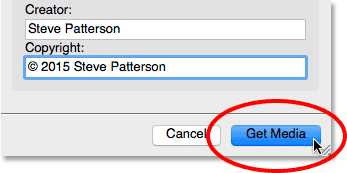
*Click the Get Media button to begin the transfer.*

Once all your images have been downloaded, Adobe Bridge will jump to the folder containing the photos so you can begin sorting through them. We learn how to review our images with Bridge in the next tutorial:

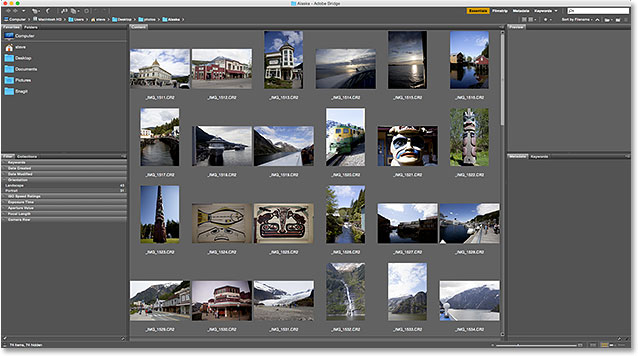
*Bridge takes you straight to your images once the download is complete.*