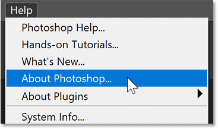
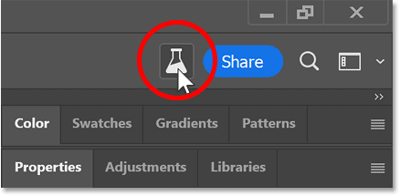
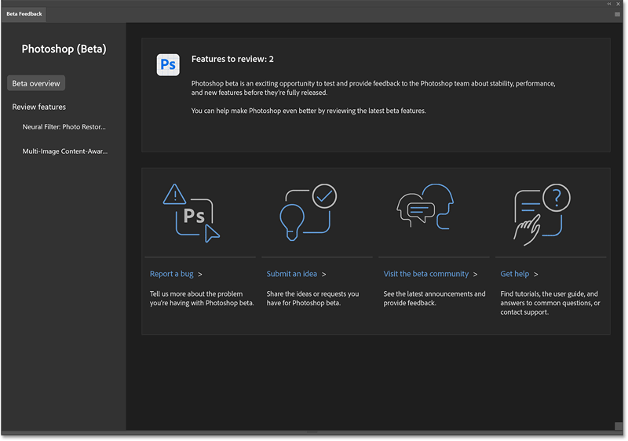
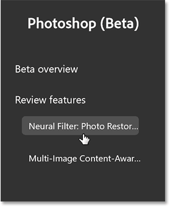
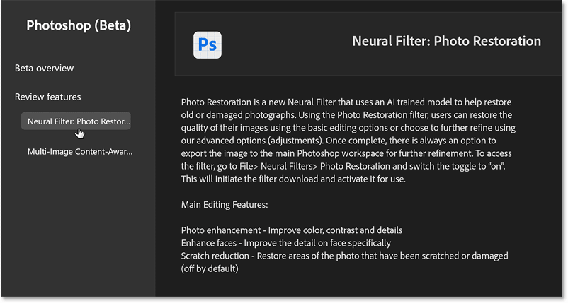
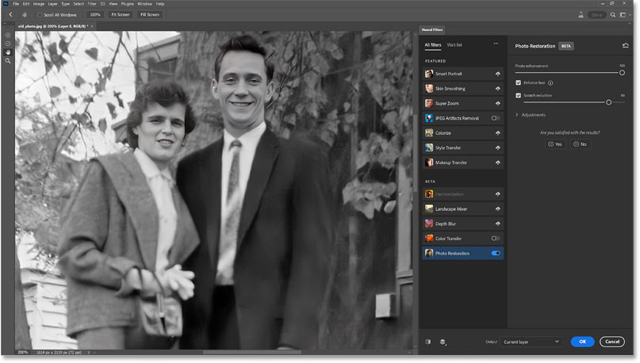
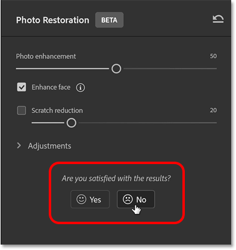
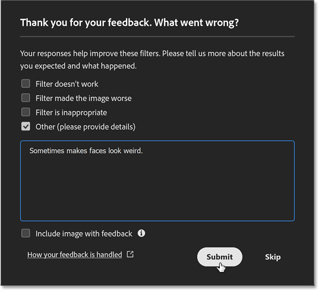

# How to Download the Photoshop Beta and Preview Upcoming Features

> Source: [https://www.photoshopessentials.com/basics/how-to-download-the-photoshop-beta/](https://www.photoshopessentials.com/basics/how-to-download-the-photoshop-beta/)
> Downloaded and converted to Markdown.

This step-by-step tutorial shows you how to download and install the latest Photoshop beta so you can try out upcoming features like the amazing new Generative Fill.

As a Creative Cloud subscriber, you have access not only to official Photoshop releases but also the beta versions. Downloading the latest Photoshop beta lets you preview upcoming features that Adobe’s Photoshop team is working on (like the mind-blowing new [Generative Fill](/photo-editing/extend-images-with-generative-fill/ "How to extend images with Generative Fill in Photoshop")). This means you can try out features before they are officially released, and even help improve them by reporting bugs, submitting ideas and joining the Photoshop beta online community.

You’ll need a [Creative Cloud subscription](https://adobe.prf.hn/click/camref:1100lrdjJ/destination:https%3A%2F%2Fwww.adobe.com%2Fproducts%2Fphotoshop.html "Get Adobe Photoshop") to download the Photoshop beta. Both the official Photoshop release and the beta version can be installed at the same time.

Let's get started!

## Step 1. Open the Creative Cloud desktop app

Open the **Creative Cloud Desktop app** (the same app you used to install the official Photoshop release).

*The Creative Cloud Desktop app.*

[Learn more about Adobe Creative Cloud](https://adobe.prf.hn/click/camref:1100lrdjJ/destination:https%3A%2F%2Fwww.adobe.com%2Fproducts%2Fphotoshop.html "Get Adobe Photoshop")

## Step 2: Select Beta apps

In the left column, click **Beta apps**.

*Selecting the Beta apps category.*

## Step 3: Install the Photoshop beta

Look for the **Photoshop (Beta)** app and click the **Install** button.

Depending on your Creative Cloud subscription, you may see beta versions of other Adobe apps as well. But we’ll stick with Photoshop.

*Installing the latest Photoshop beta release.*

## Step 4: Open the Photoshop beta

Once the Photoshop beta is downloaded and installed, you'll find it listed under **Installed beta apps**.

To open it, click the **Open** button.

Note that the Photoshop beta can only be opened from the Beta apps category. It will not appear in the "All apps" category with the official version.

*Opening the Photoshop beta.*

**Got the Photoshop beta?** Learn how to use Generative Fill with these tutorials:

- [Remove people and objects from photos with Generative Fill](/photo-editing/generative-fill-in-photoshop-remove-people-and-objects-from-photos/ "Learn more")
- [How to extend an image with Generative Fill](/photo-editing/extend-images-with-generative-fill/ "Learn more")
- [Add amazing water reflections with Generative Fill](/photo-effects/generative-fill-in-photoshop-how-to-add-water-reflections-to-an-image/ "Learn more")

## Step 5: Confirm you are running the Photoshop beta

The Photoshop beta opens to the Home Screen.

*The Photoshop beta and the official release look nearly identical.*

To confirm that you are running the beta version, on a Windows PC, open the **Help** menu in the Menu Bar and choose **About Photoshop**. On a Mac, you'll see **Photoshop (Beta)** in the Menu Bar (where it normally just says Photoshop). But if you want further confirmation, you can click on it and choose **About Photoshop**.

*Opening the About Photoshop screen.*

The About screen will display **Adobe Photoshop (Beta)**. The version number shown here may be different when you download it. Click anywhere to close the screen.

*The About screen confirms you are running the Photoshop beta.*

## The Beta Feedback button and dialog box

So now that you’ve installed and opened the Photoshop beta, how do you know which upcoming features are available to try out? And where do you find them? All the information you need is in the **Beta Feedback dialog box.**

Once you move from the Home Screen to Photoshop’s main interface (by creating a new document or opening an image), you’ll find a **Beta Feedback button** in the upper right (next to the [Share](/basics/remove-distractions-with-neutral-color-mode-in-photoshop-2022/ "Learn more") button). The Beta Feedback button is another way to tell that you are running the beta version. Click the button to open the **Beta Feedback dialog box**.

*The Beta Feedback button.*

### The Beta overview screen

In the dialog box, the main **Beta overview** screen tells you how many beta features are currently available for review. At the time I’m writing this, there are two features (a Photo Restoration Neural Filter and Multi-Image Content-Aware Fill). You’ll also find links to report a bug, submit an idea, visit the Photoshop beta community, or get help. Clicking any of these links will open Adobe’s website in your browser.

*The Beta overview screen.*

### Learning more about a beta feature

To learn more about a specific beta feature, including where to find it, click on its name under **Review features** in the column along the left.

*Selecting a beta feature to learn more.*

Here you'll find details about what the feature does (or at least, what it's supposed to do) and how to use it.

Unfortunately, some of the information is incorrect at the time I'm writing this. For example, it’s telling me that the Photo Restoration Neural Filter is found under the **File** menu when it’s actually found under the **Filter** menu (Filter > Neural Filters > Photo Restoration). Hopefully this will be corrected in the near future.

*The Beta Feedback dialog box provides all the information you need to get started with a feature.*

## How to provide feedback on a beta feature

Once you’ve tried out a beta feature, be sure to let Adobe know what you think of it so far.

After trying the **Photo Restoration Neural Filter** (which I will cover in a separate tutorial), I think it’s very impressive but still needs work.

*Trying the upcoming Photo Restoration Neural Filter.*

So in the panel along the right, under "Are you satisfied with the results?", I’ll click **No**.

*Telling Adobe that the beta feature still needs work.*

A dialog box opens where you can provide Adobe with more details. Click the Submit button to send them, or click Skip to cancel.

*Sharing my opinion about the beta feature with Adobe.*

And there we have it! That’s how to download and install the Photoshop beta release, preview upcoming features, provide feedback, and help shape the future of Photoshop!