# How to Draw Custom Shapes in Photoshop

> Source: [https://www.photoshopessentials.com/basics/how-to-draw-custom-shapes-in-photoshop/](https://www.photoshopessentials.com/basics/how-to-draw-custom-shapes-in-photoshop/)
> Downloaded and converted to Markdown.

Learn how to draw custom shapes in Photoshop using the Custom Shape Tool and the Shapes panel. Plus how to load hundreds of missing shapes, how to combine and merge shapes, and how to save your own custom shape presets! For Photoshop 2022.

In a previous tutorial, I showed you how to draw basic shapes in Photoshop, like rectangles, circles, lines and polygons, using the [geometric shape tools](/basics/how-to-draw-shapes-with-the-shape-tools/ "Learn more"). This time, you’ll learn how to draw more elaborate, pre-made custom shapes. And Photoshop gives us two ways to draw them. One is with the Custom Shape Tool, and the other is with the Shapes panel. This tutorial covers both.

Photoshop includes hundreds of custom shapes to choose from, but most of them are hidden by default. So along with showing you how to draw shapes, I’ll show you where to find all of the shapes that are missing. And once we know how to draw one shape at a time, I’ll show you how to combine and merge two or more shapes together, and how to save the result as a new custom preset.

Let's get started!

## Which version of Photoshop do I need?

Adobe has made lots of improvements to shapes in recent Photoshop versions. So for this tutorial, you’ll want to be using Photoshop 2022 or later. [Get the latest Photoshop version here](https://adobe.prf.hn/click/camref:1100lrdjJ/destination:https%3A%2F%2Fwww.adobe.com%2Fproducts%2Fphotoshop.html).

## Setting up the document

To follow along, all you need is a [new Photoshop document](/basics/create-new-documents-photoshop-cc/ "Learn more").

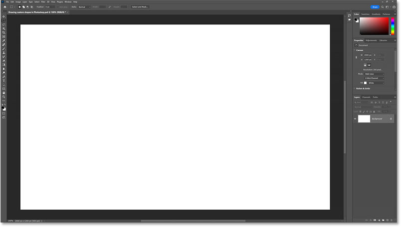

*Create a new Photoshop document to follow along.*

## How to draw shapes with the Custom Shape Tool

There are two ways to draw custom shapes in Photoshop. The first is with the Custom Shape Tool and the second is from the Shapes panel. We'll start by learning the more traditional way of drawing shapes using the Custom Shape Tool.

### Step 1: Select the Custom Shape Tool

The Custom Shape Tool is found in Photoshop’s [toolbar](/basics/photoshop-tools-toolbar-overview/ "Learn more"), nested in with the Rectangle Tool, Ellipse Tool and Photoshop’s other [geometric shape tools](/basics/how-to-draw-shapes-with-the-shape-tools/ "Learn more").

To select the Custom Shape Tool, click and hold on whichever shape tool’s icon is currently visible in the toolbar (either the Rectangle Tool or the tool you used last). Then choose the **Custom Shape Tool** from the fly-out menu.

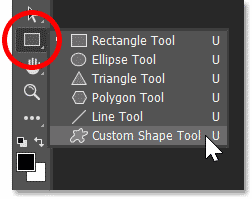

*Selecting the Custom Shape Tool.*

### Step 2: Open the Custom Shape Picker

With the Custom Shape Tool active, go up to the **Options Bar** and choose a shape by clicking on the current shape’s thumbnail.

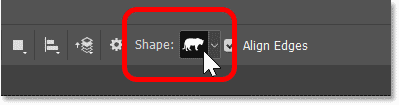

*Clicking on the current shape in the Options Bar.*

This opens the **Custom Shape Picker** showing all the shapes we can choose from. The shapes are divided into groups based on their theme.

But by default, only four groups are listed (Wild Animals, Leaf Trees, Boats and Flowers). I’ll show you how to load hundreds of additional shapes once we’ve learned how the Custom Shape Tool works.

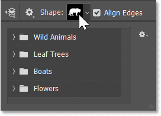

*The Custom Shape Picker.*

### Step 3: Choose a custom shape

Twirl open a shape group by clicking the arrow to the left of its folder icon. I’ll open the Wild Animals group. Then choose a shape from the group by clicking its thumbnail. I’ll choose the lion shape.

Press **Enter** (Win) / **Return** (Mac) on your keyboard to close the Shape Picker.

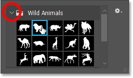

*Choosing a shape by clicking its thumbnail.*

### Step 4: Set the Tool Mode to Shape

Still in the Options Bar, make sure the **Tool Mode** ts set to Shape, not Path or Pixels.

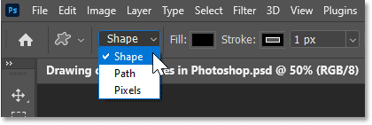

*Setting the mode for the Custom Shape Tool to Shape.*

### Step 5: Choose a fill color

Then choose a color for the shape. The default color is black. To choose a different color, click the **Fill** color swatch.

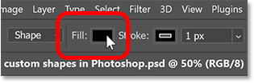

*Clicking the Fill color swatch in the Options Bar.*

Choose the kind of fill you need using the icons along the top of the panel. From left to right, we have **No Color**, a **Solid Color** preset, a **Gradient** preset, or a **Pattern** preset. If you choose one of the three preset options, then select a preset from one of the groups below.

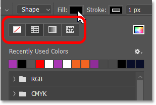

*The No Color, Solid Color, Gradient and Pattern preset options for the fill.*

Or to choose a custom color for your shape, click the icon on the far right.

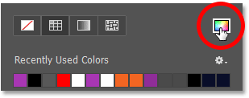

*Clicking the custom color icon for the fill.*

Then choose a color from the Color Picker. I’ll choose a shade of purple by setting the H (Hue) to 295 degrees, the S (Saturation) to 70 percent, and the B (Brightness) also to 70 percent. Click OK to close the Color Picker.

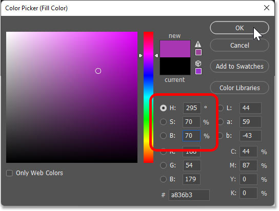

*Choosing a fill color from the Color Picker.*

### Step 6: Choose a stroke color and size

By default, Photoshop adds a 1 pixel-wide black stroke around shapes. To choose a different color, or to turn off the stroke, click the Stroke color swatch in the Options Bar.

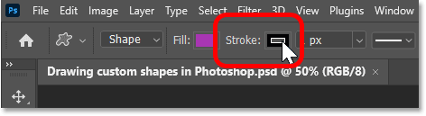

*Clicking the Stroke color swatch in the Options Bar.*

Then along the top of the panel, choose from the same options that we saw with the fill color. From left to right, click the **No Color** option to turn off the stroke. Or choose either a **Solid Color** preset, a **Gradient** preset or **Pattern** preset.

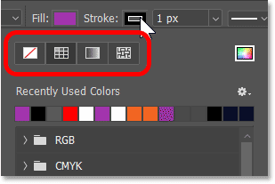

*The stroke color options are the same as the fill options.*

Or click the icon on the far right to open the Color Picker and choose a custom color. But I’ll leave the stroke set to black.

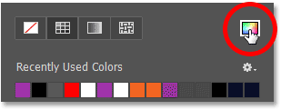

*The custom color icon for the stroke.*

In the **Size** box next to the color swatch, enter a width or thickness for the stroke. I’ll set mine to 10 px. Press **Enter** (Win) / **Return** (Mac) to accept it.

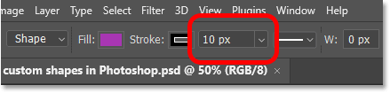

*Entering a size for the stroke.*

### Step 7: Choose the stroke type and alignment

If you click the Stroke Options box next to the size value:

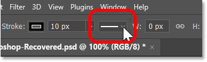

*The Stroke Options box.*

You’ll find a few more options you can set before drawing the shape. At the top of the panel, set the stroke’s **type** to either a **solid**, dashed or **dotted line**. The default is solid which is usually what you want. And in the bottom left of the panel, set the stroke’s **alignment** to either **inside** the shape’s edge, **outside** the edge or **centered** on the edge. The default is centered.

You can also change the stroke’s **cap type** and **corner type** from here, but the defaults are usually fine.

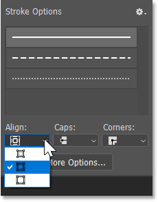

*The stroke options include the line type, alignment, cap type and corner type.*

### Step 8: Draw the shape

To draw your custom shape, click on the canvas to set a starting point, keep your mouse button held down, and drag away from that point. As you drag, all you will see is the shape’s path outline.

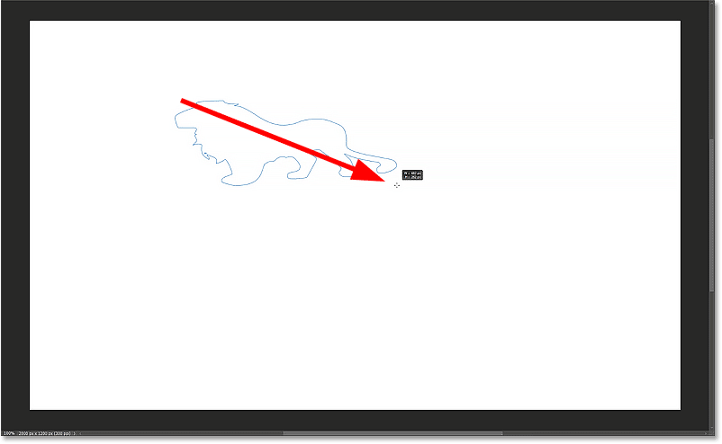

*Click and drag to begin drawing the shape.*

#### How to draw the shape at the correct aspect ratio

By default, Photoshop lets us draw the shape freely with the aspect ratio unlocked, which can make it look warped. So to force the shape into its correct aspect ratio, press and hold the **Shift** key on your keyboard as you drag.

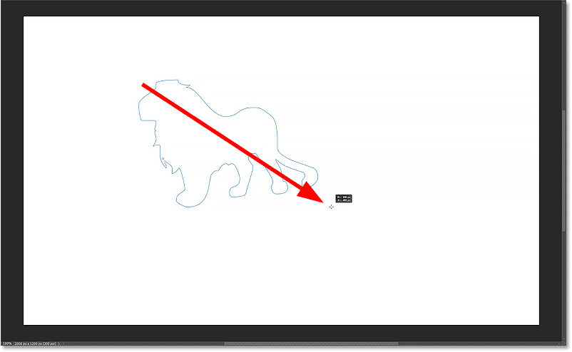

*Hold Shift to draw the shape at the proper aspect ratio.*

#### How to reposition the shape as you draw

To reposition the shape on the canvas as you draw it, press and hold the **spacebar** on your keyboard. With the spacebar down, drag to move the path outline into place. Then release the spacebar to continue drawing the shape.

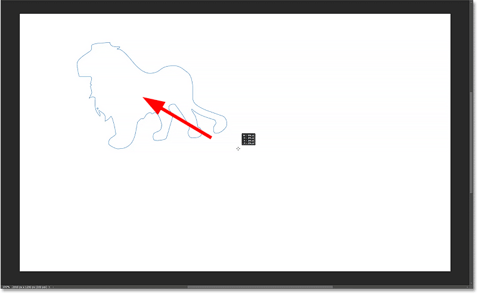

*Hold the spacebar to reposition the shape.*

#### How to complete the shape

Release your mouse button to finish drawing the shape, at which point the fill color and stroke appear.

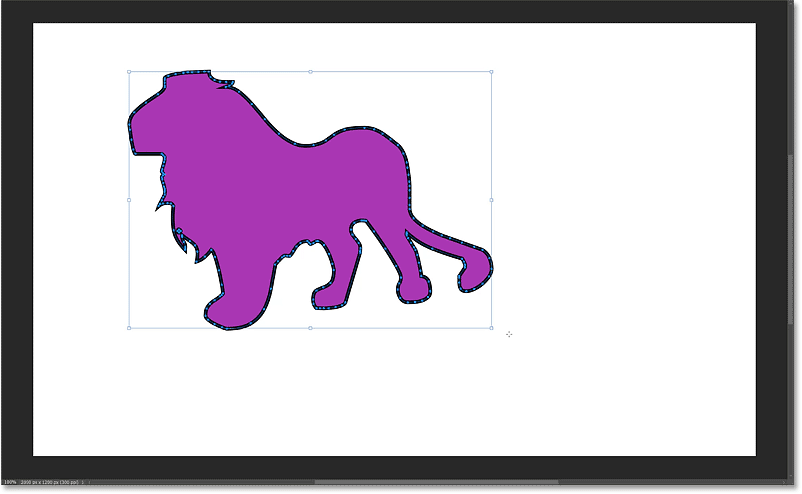

*Release your mouse button to add the fill and stroke to the shape.*

### Step 9: Resize or rotate the shape

Photoshop automatically places a [transform box](/basics/transform-and-warp-images-with-free-transform-in-photoshop-cc-2019/ "Learn more") around the shape so we can resize or rotate it if needed.

#### How to resize the shape

To resize the shape, click and drag any of the **transform handles** (the little squares). Hold the **Shift** key as you drag a handle to maintain the shape’s correct aspect ratio as you resize it.

To resize the shape outward from its center rather than from the opposite side or corner, hold the **Alt** (Win) / **Option** (Mac) key as you drag a handle. Holding **Shift** plus the **Alt** (Win) / **Option** (Mac) key will lock the shape’s aspect ratio and resize it from the center.

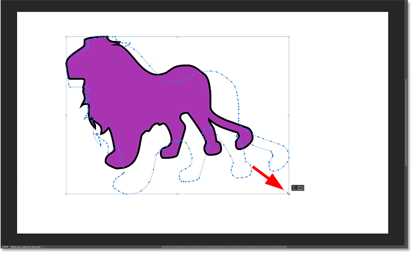

*Use the transform handles to resize the shape. Hold Shift to lock the aspect ratio.*

#### How to rotate the shape

To rotate the shape, hover your mouse cursor just outside one of the transform handles. When the cursor changes to a **rotate icon** (a curved double-sided arrow), click and drag to rotate the shape around its center. Hold **Shift** as you drag to rotate the shape in 15 degree increments.

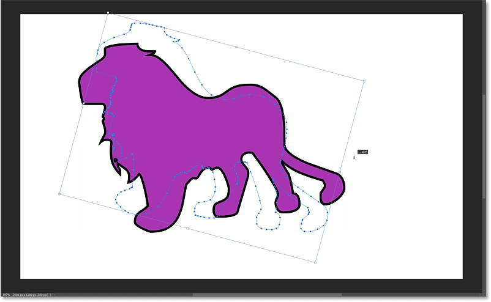

*Drag outside a transform handle to rotate the shape.*

I’ll rotate my shape back to its original angle.

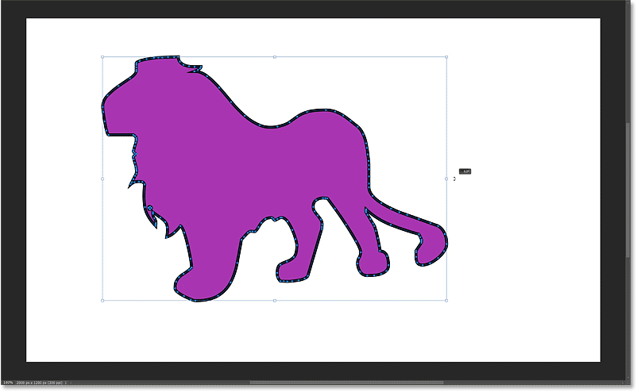

*Resetting the angle.*

### Step 10: Accept the shape and close the Transform command

Press **Enter** (Win) / **Return** (Mac) on your keyboard when you're done to accept it and close the transform box.

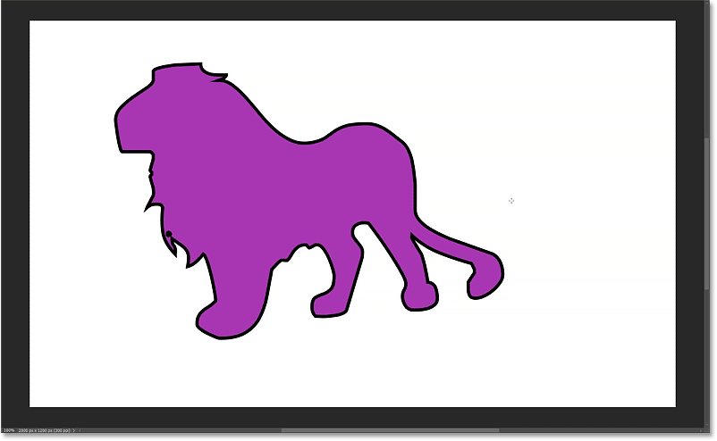

*The final shape.*

### The shape layer

In the [Layers panel](/basics/layers/layers-panel/ "Learn more"), the new shape appears on its own shape layer. And since I chose the lion shape, Photoshop named the layer "Lion 1".

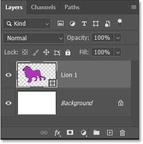

*The Layers panel showing the new shape layer.*

## How to edit the shape’s fill and stroke

Even though we’ve already drawn the shape, we can always go back and edit the fill color and stroke options as long as the shape layer is selected in the Layers panel. And there's a few places to do it.

### From the Options Bar

You can go back to the **Options Bar** and change the fill or stroke using the options we looked at before drawing the shape.

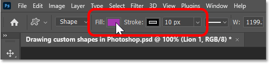

*Editing the fill and stroke in the Options Bar.*

### From the Properties panel

Or you can change the fill or stroke from Photoshop’s **Properties panel**.

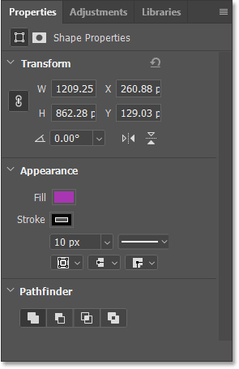

*The fill, stroke and other shape options in the Properties panel.*

For example, I don’t like the stroke around my shape. So to remove it, I’ll click the **Stroke** color swatch in the [Properties panel](/basics/using-the-enhanced-properties-panel-in-photoshop/ "Learn more").

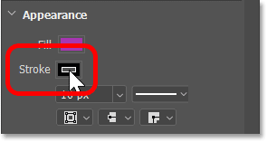

*Editing the stroke color in the Properties panel.*

Then I’ll choose the **No Color** option at the top, just like we saw earlier in the Options Bar.

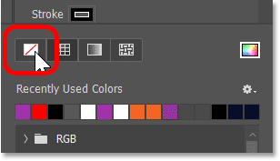

*Setting the stroke to No Color.*

And now the stroke is gone, leaving the shape with just its fill color.

*The stroke has been removed from the shape.*

## Other options in the Properties panel

Along with the fill and stroke options in the Properties panel, you can use the **Transform** section at the top to enter a specific **Width** or **Height** for the shape. Just make sure the **link icon** is selected before entering a value to keep the shape’s original aspect ratio.

I’ll change the width to 800 px, and then I’ll press **Enter** (Win) / **Return** (Mac) to accept it. Since the link icon was selected, Photoshop automatically changed the height to keep the aspect ratio the same.

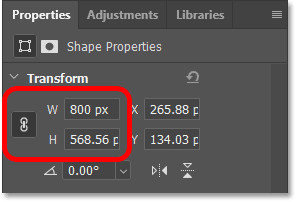

*Changing the shape's width and height in the Properties panel.*

And the shape instantly resizes on the canvas.

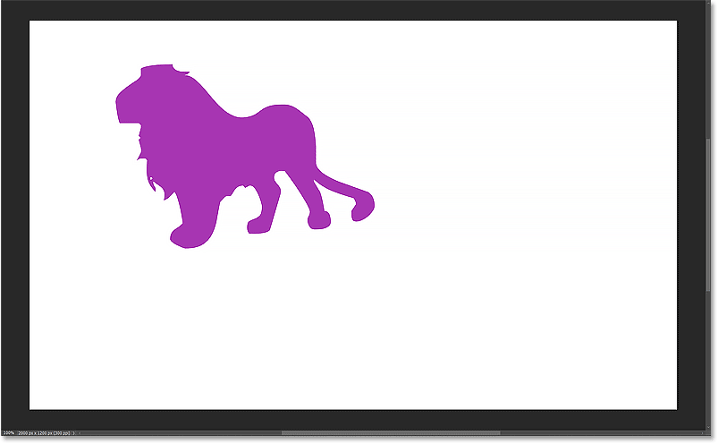

*The shape at its new size.*

Click the **Flip Horizontal** or **Flip Vertical** icons to flip the shape’s orientation.

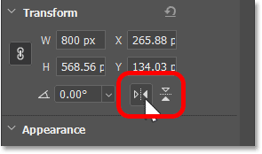

*The Flip Horizontal and Flip Vertical options in the Properties panel.*

Or rotate the shape by entering a value into the **Angle** box.

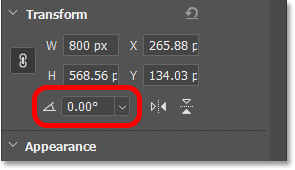

*The rotation value in the Properties panel.*

Click the arrow to the right of the box to choose from a list of angle presets.

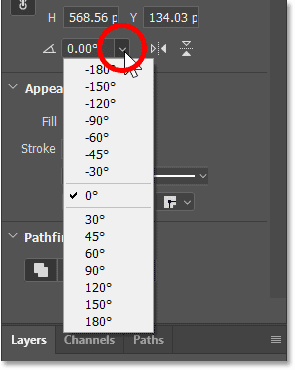

*The rotation box includes preset angles.*

## How to bring back the transform box around the shape

To bring back the transform box if you need to further resize, rotate or reposition the shape, select the **Path Selection Tool** from the toolbar, located directly above the shape tools.

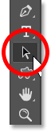

*Selecting the Path Selection Tool.*

The transform box should appear around the shape as soon as you select the Path Selection Tool. If not, click on the shape to select it.

*The transform box reappears around the shape.*

### Resizing or rotating the shape

Drag a **handle** to resize the shape. Hold **Shift** as you resize it to keep the shape’s original aspect ratio. Or rotate the shape by clicking and dragging just outside one of the transform handles. Hold **Shift** to rotate the shape in 15 degree increments.

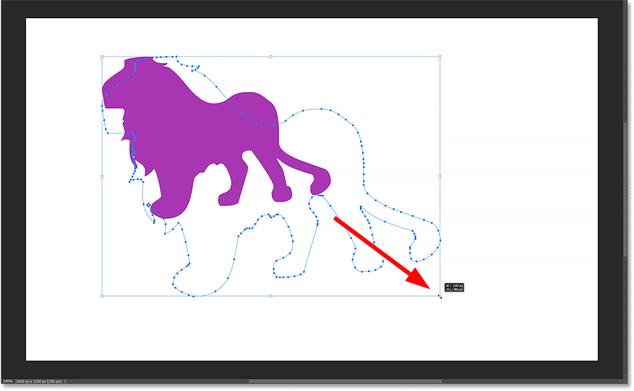

*Holding Shift and dragging a handle to resize the shape.*

### Repositioning the shape

To move the shape around the canvas while the transform box is visible, click on the shape with the Path Selection Tool, keep your mouse button held down, and drag it into place.

Press **Enter** (Win) / **Return** (Mac) on your keyboard when you’re done to close the transform box.

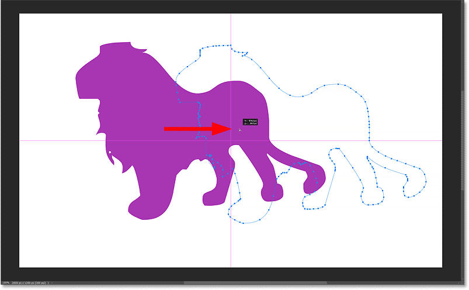

*Moving the shape with the Path Selection Tool.*

## How to center the shape on the canvas

Here’s an easy way to center the shape on the canvas. Click on the shape with the Path Selection Tool so that not only is the transform box visible but so is the path outline around the shape.

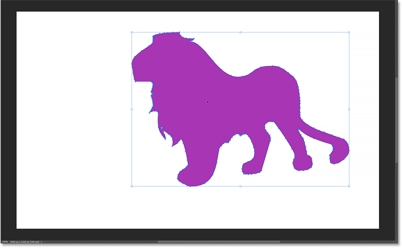

*Click on the shape with the Path Selection Tool so the path outline is visible.*

Then in the Options Bar, click the **Path Alignment** icon.

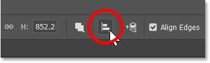

*Clicking the Path Alignment icon.*

In the bottom right of the panel, change **Align To** from Selection to **Canvas**.

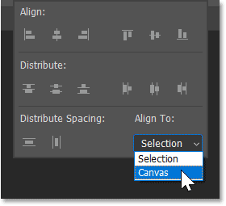

*Setting Align To to Canvas.*

Then at the top of the panel, click the **Align Horizontal Centers** and **Align Vertical Centers** icons. Press **Enter** (Win) / **Return** (Mac) to close the panel.

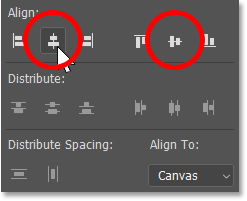

*Clicking Align Horizontal Centers (left) and Align Vertical Centers (right).*

Press **Enter** (Win) / **Return** (Mac) again to close the transform box around the shape. And the shape is now centered on the canvas.

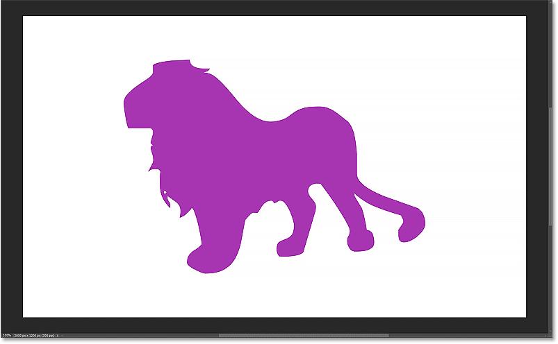

*The shape is centered on the canvas.*

## How to delete a shape

To delete your shape, make sure its **shape layer** is selected in the Layers panel. Then press the **Delete** key on your keyboard.

You can also delete the shape by dragging its shape layer onto the **trash bin** at the bottom of the Layers panel.

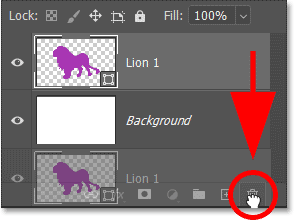

*Deleting the shape layer.*

## The Shapes panel in Photoshop

That’s the basics of how to draw shapes using the Custom Shape Tool. But the most recent Photoshop versions, beginning with Photoshop 2020, now include a dedicated **Shapes panel**. And the Shapes panel has a few advantages over the Custom Shape Tool.

Not only does the Shapes panel hold all of our custom shapes, but it also gives us a faster way to add those shapes to the document. And the Shapes panel is where we load the hundreds of missing shapes that are included with Photoshop, which we’ll do next.

## Where to find the Shapes panel

The Shapes panel is not part of Photoshop’s default workspace. So to open it, go up to the **Window** menu in the Menu Bar and choose **Shapes**.

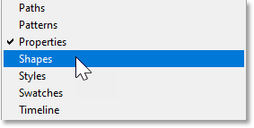

*Going to Window > Shapes.*

The Shapes panel opens in the secondary panel column to the left of the main column. You can show or hide a panel in this column by clicking its icon.

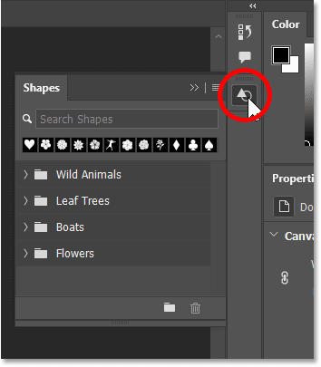

*The Shapes panel.*

## Photoshop’s default shapes

The Shapes panel holds the same default shapes that we saw earlier in the Custom Shape Picker. Twirl any group open to view the shapes inside it.

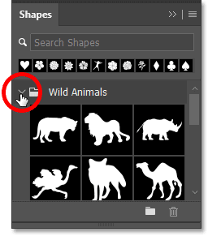

*Opening a shape group.*

### Changing the shape thumbnail size

By default, the Shapes panel displays the shapes as large thumbnails which take up a lot of room. To view smaller thumbnails, click the panel's **menu icon**.

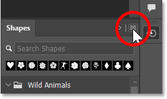

*Clicking the Shapes panel menu icon.*

And choose **Small Thumbnail** from the menu.

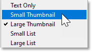

*Choosing Small Thumbnail.*

### The Recents bar

The **Recents** bar above the shape groups gives you quick access to your recently used shapes. Of course, nothing will appear in the Recents bar until you start adding shapes to your documents.

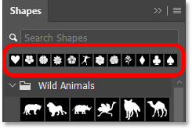

*The Recents bar.*

You can hide the Recents bar if you don’t use it by clicking the Shapes panel **menu icon** and choosing **Show Recents** to turn it off. Reselect it from here if you want to turn it back on.

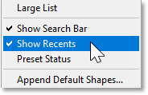

*Use the Show Recents option to turn the bar on or off.*

## How to load Photoshop's missing shapes

To load all of the missing shapes that are included with Photoshop, click the Shapes panel **menu icon**.

*Clicking the menu icon.*

Then choose **Legacy Shapes and More**.

*Choosing Legacy Shapes and More.*

A new Legacy Shapes and More group appears below the default groups.

*The Legacy Shapes and More group.*

### The 2019 Shapes and All Legacy Default Shapes groups

Twirl the group open and inside are two more groups, **2019 Shapes** and **All Legacy Default Shapes**.

*The 2019 Shapes and All Legacy Default Shapes groups.*

2019 Shapes holds hundreds of new custom shapes that were added in Photoshop 2020. Use the scroll bar along the right to scroll through the list. Or to view more shapes at once, click and drag the bottom of the Shapes panel downward to expand it.

*Expanding the Shapes panel to view the 2019 shapes.*

The All Legacy Default Shapes group holds the classic shapes from earlier Photoshop versions.

*Photoshop's legacy shapes.*

### Using the new shapes with the Custom Shape Tool

Once the missing shapes have been loaded in the Shapes panel, they will be available for use with the Custom Shape Tool the next time you open the Custom Shape Picker in the Options Bar.

*The missing shapes are now available in the Custom Shape Picker.*

## How to draw shapes with the Shapes panel

The Shapes panel holds our custom shapes, but it also lets us add shapes to our document without needing to use the Custom Shape Tool. Here’s how to add a shape to your document from the Shapes panel.

### Step 1: Choose a shape in the Shapes panel

In the Shapes panel, choose the shape you want to draw. I’ll open the Playing Cards group, found in the 2019 Shapes group, so I can choose the heart shape. I’ve switched to the Large Thumbnail view just to make things easier to see.

*Choosing a shape in the Shapes panel.*

### Step 2: Drag the shape into the document

Then to add the shape to your document, simply click and drag the shape’s thumbnail from the Shapes panel and drop it onto the canvas.

*Dragging and dropping the shape from the Shapes panel into the document.*

Release your mouse button and Photoshop instantly draws the shape. And it draws it at the correct aspect ratio.

In my case, the shape was filled with purple and given a 10 pixel black stroke because those were the settings I chose earlier in the Options Bar when we were using the Custom Shape Tool.

*The shape added from the Shapes panel.*

### Step 3: Resize, rotate or reposition the shape

To resize the shape, click and drag any of the **transform handles**. When you add a shape from the Shapes panel, its aspect ratio is automatically locked as you resize it so there’s no need to hold the Shift key as you drag. Holding Shift will unlock the aspect ratio if you want to resize it freely.

Hold the **Alt** (Win) / **Option** (Mac) key as you drag to resize the shape from its center.

*Resizing the shape by dragging a handle. No need to hold Shift.*

Rotate the shape if needed by clicking and dragging just outside any of the transform handles. Hold **Shift** as you drag to rotate the shape in 15 degree increments.

*Rotating the shape.*

To reposition the shape on the canvas, click on the shape and drag it into place. I’ll move mine into the center.

*Dragging the shape to reposition it.*

Then to accept it and close the transform box, click the **checkmark** in the Options Bar.

*Clicking the checkmark.*

### The shape layer

In the Layers panel, the shape appears on its own shape layer, just as it would if we had drawn it with the Custom Shape Tool. And because I chose a heart shape, Photoshop named the layer "Hearts 1".

*The Layers panel showing the new shape layer.*

### Step 4: Choose a fill and stroke for the shape

There are a few ways to change the shape's fill and stroke.

#### From the Layers panel

The easiest way to choose a new fill color is to double-click on the shape layer’s **thumbnail** in the Layers panel.

*Double-clicking the shape layer thumbnail.*

Then choose a new color from the Color Picker. I’ll choose a shade of red. Click OK to close the Color Picker when you’re done.

*Choosing a new fill color for the shape from the Color Picker.*

And Photoshop fills the shape with the new color.

*The fill color has been changed.*

#### From the Properties panel

Or with the shape layer active in the Layers panel, go to the **Properties panel** and click the **Fill** color swatch.

*Clicking the Fill color swatch in the Properties panel.*

Then choose from the same options we saw earlier. Use the four icons in the upper left of the panel to choose (from left to right) either **No Color**, a **Solid Color** preset, a **Gradient** preset or a **Pattern** preset. Or click the **custom color** icon in the upper right to choose a fill color from the Color Picker.

*The fill color options.*

To change the stroke, click the **Stroke** color swatch in the Properties panel.

*Clicking the Stroke color swatch.*

Then choose from the same options we had for the fill color. I don’t want a stroke around the shape, so I’ll remove it by clicking the **No Color** option in the upper left.

*Choosing No Color for the stroke.*

The Properties panel also gives you access to the other stroke options, including the stroke **size**, **line type** (solid, dashed or dotted line) and **alignment** (outside, centered or inside), as well as the **cap type** and **corner type**.

*Choosing a shape by clicking its thumbnail.*

#### From the Swatches, Gradients or Patterns panel

Another way to choose a new fill color for the shape is from the **Swatches**, **Gradients** or **Patterns** panel. These panels were added along with the Shapes panel back in Photoshop 2020.

The Swatches panel holds all of Photoshop’s color presets. The Gradients panel holds the gradient presets. And the Patterns panel holds the pattern presets. All three panels are grouped together next to the Color panel.

*The Swatches, Gradients and Patterns panels.*

If your shape layer is active in the Layers panel, you can fill the shape with any of these presets just by clicking on one to select it. Here I’m selecting the pink swatch from the RGB group in the Swatches panel.

*Clicking on a preset to select it.*

And because my shape layer was active, the shape is instantly filled with the new color.

*The preset becomes the new fill color.*

### Dragging and dropping presets onto the shape

But what if your shape layer is not active? For example, I’ll click on my [Background layer](/basics/background-layer-photoshop-cc/ "Learn more") in the Layers panel to select it and deselect the shape.

*Selecting the Background layer.*

In that case, you can click and drag a preset from the Swatches, Gradients or Patterns panel directly onto the shape. I’ll open the Gradients panel and I’ll twirl open the Pinks preset group.

*Opening a preset group in the Gradients panel.*

Then I’ll drag one of the gradients from the panel onto the shape.

*Dragging and dropping a preset onto the shape.*

And the shape is instantly filled with the gradient.

*The shape is filled with the preset.*

Back in the Layers panel, notice that Photoshop automatically selected the shape layer when I dropped the preset onto it.

*Dropping the preset onto the shape selected the shape layer.*

## Adding more shapes from the Shapes panel

By default, Photoshop places each new shape on its own layer. And normally, new layers are added above the currently selected layer. But when we drag and drop shapes from the Shapes panel, where the new layer ends up in the stacking order depends on what we drop the shape onto in the document. And the fill and stroke of the new shape also depend on where we drop it. That may sound confusing, so let me show you what I mean.

At the moment, I have my shape layer selected in the Layers panel.

*The shape layer is active.*

### Dragging a new shape onto the background

If I drag another heart shape from the Shapes panel and drop it onto an area where the white background is showing:

*Dragging and dropping a second shape onto the white background.*

Then instead of adding the new layer above my original shape layer, Photoshop adds it directly above the Background layer. That’s because I dropped the shape onto the background.

*The new shape layer is added above the Background layer.*

In the document, the new shape appears behind the original shape. And notice that instead of filling the new shape with the same gradient as the original shape, Photoshop instead used the purple fill and 10 pixel black stroke that I chose earlier in the Options Bar.

*The new shapes does not share the same fill or stroke as the original.*

### Dragging a new shape onto an existing shape

But if I drag another heart shape from the Shapes panel and drop it onto my original shape:

*Dragging and dropping a new shape onto the original shape.*

This time, Photoshop adds the new shape layer directly above the original shape layer. So whichever layer you drag the shape onto, Photoshop will place the new shape layer directly above it.

*The new shape layer appears above the original.*

And in the document, not only does the new shape appear in front of the original shape, but it also takes on the same gradient fill as the original, with no stroke around it.

*The new shape shares the same fill and stroke as the original.*

So just remember that if you want your new shape to share the same fill and stroke as an existing shape, make sure to drop the new shape directly onto the existing shape. Otherwise, you’ll get the fill and stroke that were set in the Options Bar.

And to see what those fill and stroke settings were, select the Background layer in the Layers panel (or any layer other than a shape layer).

*Selecting the Background layer.*

Then with the Custom Shape Tool (or any of the shape tools) selected in the toolbar:

*Selecting the Custom Shape Tool.*

You’ll see the fill and stroke settings that you’re using as the defaults in the Options Bar.

*The Options Bar showing the default fill and stroke for new shapes.*

## How to copy and paste a shape’s attributes

You can copy and paste the fill and stroke from one shape layer onto another.

For example, let’s say I want my second shape, the one with the purple fill and black stroke, to share the same gradient fill and no stroke as the other two shapes. So in the Layers panel, all I need to do is **right-click** (Win) / **Control-click** (Mac) on one of the shape layers that has the fill and stroke settings I want to copy:

*Right-click (Win) / Control-click (Mac) on the shape you want to copy.*

And choose **Copy Shape Attributes** from the menu.

*Choosing Copy Shape Attributes.*

Then I’ll **right-click** (Win) / **Control-click** (Mac) on the shape layer where I want to paste them:

*Right-click (Win) / Control-click (Mac) on the other shape.*

And choose **Paste Shape Attributes** from the menu.

*Choosing Paste Shape Attributes.*

All three shapes now share the same fill and stroke.

*The fill and stroke are applied to the other shape.*

## A faster way to select your shapes

Once you start adding multiple shapes to your document, selecting individual shapes from the Layers panel can become a hassle. A faster way is to select shapes just by clicking on them with the Path Selection Tool. But we first need to make one quick change to the tool’s behavior in the Options Bar.

Select the **Path Selection Tool** in the toolbar.

*Selecting the Path Selection Tool.*

Then in the Options Bar, change the **Select** option from Active Layers to **All Layers**.

*Setting Select to All Layers.*

And now with the Path Selection Tool active, you can click on any shape in the document to select it.

*Selecting a shape by clicking on it with the Path Selection Tool.*

### How to select multiple shapes at once

To select two or more shapes at once, hold **Shift** as you click on the shapes with the Path Selection Tool.

I’ll click on the shape in the upper left to select it. Then I’ll hold Shift and click on the shape in the lower right. And now both shapes are selected. We can tell they’re both selected by the path outline that appears around each shape, and by the transform box surrounding both shapes together. I’ve hidden the Shapes panel (by clicking the panel’s icon) so it’s not blocking the shapes from view.

*Hold Shift and click to select multiple shapes.*

The Layers panel also shows both shape layers selected.

*The selected shape layers are highlighted in the Layers panel.*

## Editing all selected shapes at once

With multiple shapes selected, any changes you make to the shape properties will affect all selected shapes at once.

Here in the Properties panel, I’ve changed the fill to blue and the stroke from No Color to black.

*Changing the fill and stroke for the selected shapes in the Properties panel.*

The change is instantly applied to both selected shapes.

*The fill and stroke are changed for both selected shapes.*

If I change the stroke’s alignment from centered to outside, and the stroke type from a solid line to a dotted line:

*Changing the line type and alignment of the stroke.*

Again the change is applied to both shapes.

*The stroke options are applied to both shapes.*

And if I set the stroke back to No Color:

*Removing the stroke.*

The stroke disappears around both shapes. To deselect the shapes when you’re done, press **Enter** (Win) / **Return** (Mac) on your keyboard.

*The stroke is removed from both shapes.*

### When to edit shapes individually

But if you need to change any of the options in the Transform section of the Properties panel, like the size, angle or orientation, you’ll want to do that to each shape individually.

I’ll click on the shape in the upper left to select it. And in the Properties panel, I’ll change its width to 400 pixels, with the link icon enabled so Photoshop will change the height automatically. Then I’ll do the same thing with the shape in the lower right, clicking on it to select it and changing its width to 400 pixels.

*Changing the width of each blue shape in the Properties panel.*

Then with both shapes resized, I can rearrange them on the canvas.

*Dragging the resized shapes into place.*

### Deleting multiple shapes at once

To delete multiple shapes at once, hold **Shift** and click on each shape with the Path Selection Tool to select it. Here I’ve selected both of my smaller shapes.

*Holding Shift and clicking on the two smaller shapes to select them.*

Then press the **Delete** key on your keyboard to delete them. And now I'm back to just my original shape.

*The two smaller shapes have been deleted.*

## How to draw multiple shapes on the same layer

By default, Photoshop places each new shape on its own shape layer. To add a shape to an existing shape layer, hold the **Shift** key on your keyboard and then drag a shape from the Shapes panel onto an existing shape.

Here I’m holding Shift while dragging a butterfly shape (found under 2019 Shapes > Insects and Arachnids) onto my existing heart shape.

*Holding Shift, then dragging and dropping a shape onto the existing shape.*

Release your mouse button and the new shape appears as it normally would.

*The new shape is added to the document.*

But in the Layers panel, we see that instead of adding a new layer, Photoshop combined the two shapes on the *same* layer.

*Both shapes are on the same layer.*

### Shapes on the same layer share the same fill and stroke

All shapes on the same layer share the same fill and stroke. I’ll drag my new shape into the upper right of the canvas so it’s easier to see that both are sharing the same gradient.

The gradient extends from the bottom of the heart to the top of the butterfly as if they were one larger shape.

*The two combined shapes share the same gradient fill.*

And if I add a black stroke to the shape layer, then because the shapes are overlapping, the stroke appears around the combined area of the shapes.

*The stroke appears around the combined shapes.*

### Selecting shapes on the same shape layer

Even though the shapes are on the same layer, you can still select the shapes individually by clicking on them with the Path Selection Tool.

*Combined shapes can still be selected on their own.*

And you can resize or rotate the selected shape without affecting the other(s).

*Resizing and rotating one of the shapes.*

## How to subtract one shape from another

One benefit to having both shapes on the same layer is that you can combine them in interesting ways. For example, you can use one shape to cut a hole through the other.

I’ll drag my butterfly shape into the center of my heart shape. Then I’ll resize the butterfly by dragging the **transform handles**, holding **Shift** as I drag to lock the aspect ratio, plus the **Alt** (Win) / **Option** (Mac) key to resize the shape from its center.

*Resizing and centering the butterfly shape inside the heart shape.*

### Aligning the two shapes

To make sure the centers of the two shapes are perfectly aligned, with my butterfly shape still active, I’ll hold **Shift** and click with the Path Selection Tool on the heart shape so that both shapes are selected at the same time.

*Selecting both shapes at once.*

Then in the Options Bar, I’ll click the **Path Alignment** icon, and then the **Align Horizontal Centers** option. I could also click Align Vertical Centers, but in this case I just want to align them horizontally.

*Choosing Align Horizontal Centers from the Path Alignment options.*

With both shapes aligned, I’ll hold **Shift** and click on the heart shape to deselect it, leaving just the butterfly selected.

*Deselecting the heart shape.*

### Subtracting one shape from another

Finally, to use the butterfly shape to cut a hole through the heart shape behind it, I’ll click the **Path Operations** icon in the Options Bar:

*Clicking the Path Operations icon.*

And I’ll choose **Subtract Front Shape**:

*Choosing the Subtract Front Shape command.*

I’ll press **Enter** (Win) / **Return** (Mac) to accept it and close the transform box. And now the heart has a cut-out of the butterfly.

*The result after subtracting the front shape.*

It may look like a white butterfly in front of the heart, but that’s only because we’re seeing the white background behind it. If I turn off the Background layer in the Layers panel by clicking its **visibility icon**:

*Turning off the Background layer.*

We see the **checkerboard pattern** through the butterfly shape, which is how Photoshop represents transparency.

*Turning off the Background layer reveals the transparency through the shape.*

### The shapes are still separate

The only problem is that even though one shape is cutting a hole through the other, we still have two separate shapes. If I select the heart shape and reposition it on the canvas, the butterfly shape does not move.

*The heart shape moves but the butterfly does not.*

And if I resize the heart shape, the butterfly does not resize. That’s because they are two separate shapes and only one shape is selected.

*The heart shape resizes but the butterfly does not.*

## How to merge the shapes

But if you’re happy with the result, you can merge the shapes into one.

Drag around the shapes with the Path Selection Tool to select them.

*Dragging around all the shapes to select them.*

Then go up to the **Options Bar**, click the **Path Operations** icon, and choose **Merge Shape Components**.

*Choosing Merge Shape Components from the Path Operations menu.*

Photoshop will warn that merging the shapes will turn your live shape into a regular path. That means you won’t be able to edit the shapes individually once you merge them. But if you’re okay with that, click Yes to accept it.

*Click Yes to accept the warning.*

And now you can resize, rotate or move the shapes as one. If I reposition the shape on the canvas, both the heart and the butterfly now move together because they are no longer separate shapes.

*The result after merging the two shapes together.*

## How to edit a merged shape

Since we’re no longer working with a live shape, we can’t change the shape's options in the Properties panel. But we can still access those same options in the Options Bar. Here I’m adding a 4 pixel black stroke.

*A merged shape's fill and stroke can be changed from the Options Bar.*

And the stroke appears not only around the outside of the shape but also the inside where the hole was cut through it.

*The stroke appears around the entire shape, inside and out.*

To enter a specific size for the merged shape, use the Width and Height boxes in the Options Bar. Make sure the link icon is selected before entering a new size to keep the original aspect ratio.

*The width and height of a merged shape can be set in the Options Bar.*

Or to resize a merged shape using the transform handles, go up to the **Edit** menu and choose **Free Transform**. It may say **Free Transform Path** depending on which tool is selected in the toolbar, but the command is the same.

*Going to Edit > Free Transform.*

Drag a handle to resize the shape. Hold **Alt** (Win) / **Option** (Mac) as you drag to resize the shape from its center. Or rotate the shape by clicking and dragging just outside a handle.

*Resizing the merged shape using the Free Transform command.*

To accept it and close Free Transform, click the **checkmark** in the Options Bar.

*Clicking the checkmark.*

## How to save a merged shape as a custom preset

Finally, here’s how to save your merged shape as a new preset so you can reuse it without needing to redraw it.

### Step 1: Create a new shape group

First, if you have not done so already, create a new shape group to hold your presets. In the Shapes panel, click on the group at the bottom of the list to select it. If you’ve been following along, it’s most likely the Legacy Shapes and More group. Our new group will appear below it.

*Selecting the bottom group in the Shapes panel.*

Then click the **New Group** icon.

*Clicking the New Group icon.*

Name the group. I’ll name it "My Shapes". Then click OK.

*Naming the new shape group.*

The new group appears below the others. If you already made a group to hold your presets, make sure the group is selected.

*The new shape group appears.*

### Step 2: Select the shape

Click on the shape with the Path Selection Tool to select it.

*Selecting the shape.*

### Step 3: Save the shape as a new preset

Then go up to the **Edit** menu in the Menu Bar and choose **Define Custom Shape**.

*Going to Edit > Define Custom Shape.*

Name the shape. I’ll name mine "Heart with Butterfly". Then click OK.

*Naming the new shape preset.*

And back in the Shapes panel, the shape appears as a new preset in the group. You can drag the preset into the document the next time you need it.

*The new shape preset.*

And there we have it! Check out more of my [Photoshop Basics](/basics/) section for more tutorials. And don't forget that all of my tutorials are now available to [download as PDFs](/print-ready-pdfs/ "Learn more")!