# How To Draw Gradients With The Gradient Tool In Photoshop

> Source: [https://www.photoshopessentials.com/basics/how-to-draw-gradients-with-the-gradient-tool-in-photoshop/](https://www.photoshopessentials.com/basics/how-to-draw-gradients-with-the-gradient-tool-in-photoshop/)
> Downloaded and converted to Markdown.

**Version Note:** Using Photoshop 2023? Check out my new [Live Gradients tutorial](/basics/how-to-use-live-gradients-in-photoshop-2023/).

In this tutorial, we'll learn **how to draw gradients in Photoshop**! There are many places within Photoshop where gradients are used. The Gradient Tool, for example, lets us draw gradients across layers or selections, or across layer masks to create smooth transitions from one layer to another.

We can fill text and shapes with gradients. We can colorize a photo using a Gradient Map image adjustment, or add color effects with a Gradient Overlay layer style, and more! Gradients are invaluable in Photoshop, and they're a great way to add more interest and life to what would have been a flat-looking image or design.

In this tutorial, we'll cover the basics of how to draw gradients using the simplest (and possibly the most useful) of Photoshop's gradient-related features, the **Gradient Tool**. We'll look at other ways of applying gradients in other tutorials, but you'll find that they all work essentially the same way, so once you've learned the basics with the Gradient Tool, you'll be able to take advantage of all the other gradient features that Photoshop has to offer!

Along with learning how to draw gradients, we'll also look at how to select from Photoshop's many preset gradients using the **Gradient Picker**, including how to load additional gradient sets that are included with Photoshop. We'll look at different **gradient styles** that we can draw, and we'll look at a few of the more commonly-used gradients, including what may be the most useful one of all, the default **Foreground to Background** gradient!

Once we've learn the basics of how to draw gradients, in the next tutorial, we'll learn how to edit and save our own custom gradients using Photoshop's [Gradient Editor](/basics/how-to-use-the-gradient-editor-in-photoshop/).

I'll be using [Photoshop CC](https://prf.hn/l/dlXjD2w) here but this tutorial is also fully compatible with Photoshop CS6.

Let's get started!

## Drawing Gradients In Photoshop

### Creating A New Document

Let's start by creating a new Photoshop document. To do that, I'll go up to the **File** menu in the Menu Bar along the top of the screen and choose **New**:

*Going to File > New.*

This opens the New dialog box. For this tutorial, I'll set the **Width** of my document to **1200 pixels** and the **Height** to **800 pixels.** There's no particular reason why I'm using this size, so if you're working along with me and have a different size in mind, feel free to use it. I'll leave the **Resolution** value set to its default of **72 pixels/inch**, and I'll make sure **Background Contents** is set to **White**. I'll click **OK** when I'm done to close out of the dialog box, at which point a new white-filled document appears on the screen:

*The New dialog box.*

### Selecting The Gradient Tool

Photoshop's **Gradient Tool** is found in the **Tools panel** along the left of the screen. I'll select it by clicking on its icon. You can also select the Gradient Tool simply by pressing the letter **G** on your keyboard:

*Selecting the Gradient Tool from the Tools panel.*

### The Gradient Picker

With the Gradient Tool selected, the next thing we need to do is choose a gradient, and there's a couple of ways we can do that. One is by opening Photoshop's **Gradient Picker**; the other is by opening the larger **Gradient Editor**. The difference between the two is that the Gradient Picker simply allows us to choose from ready-made preset gradients, while the Gradient Editor, as its name implies, is where we can edit and customize our own gradients. For this tutorial, we'll focus on the Gradient Picker itself. We'll learn all about the [Gradient Editor](/basics/how-to-use-the-gradient-editor-in-photoshop/) in the next tutorial.

When you just want to choose one of Photoshop's preset gradients, or one that you've previously created on your own and saved as a custom preset (again, we'll learn how to do that in the next tutorial), click on the small **arrow** to the right of the **gradient preview bar** in the Options Bar. Make sure you click on the arrow itself, *not* on the preview bar (clicking the preview bar will open the Gradient Editor and we don't want to go there just yet):

*Clicking the arrow to open the Gradient Picker.*

Clicking the arrow opens the Gradient Picker, with thumbnails of all the preset gradients we can choose from. To choose a gradient, click on its thumbnail, then press **Enter** (Win) / **Return** (Mac) on your keyboard, or click on any empty space in the Options Bar, to close the Gradient Picker. You can also **double-click** on the thumbnail, which will both select the gradient and close out of the Gradient Picker:

*The Gradient Picker.*

### Loading More Gradients

By default, only a small number of preset gradients are available, but Photoshop includes other **gradient sets** that we can choose from. All we need to do is load them in. To do that, click on the **gear icon** in the upper right:

*Clicking the gear icon in the Gradient Picker.*

If you look in the bottom half of the menu that appears, you'll find the list of additional gradient sets, each based on a specific theme, like color harmonies, metals, pastels, and more. If you're a photographer, the Neutral Density and Photographic Toning gradients are particularly useful:

*The other gradient sets we can choose from.*

To load any of the sets, click on its name in the list. I clicked on the Photographic Toning set. Photoshop will ask if you want to replace the current gradients with the new ones. If you click **Append**, rather than replacing the original gradients, it will simply add the new ones below the originals. As we'll see in a moment, it's easy to restore the originals, so I'll click **OK** to replace them with the Photographic Toning set:

*Clicking OK to replace the original gradients with the new set.*

And now, we see in the Gradient Picker that the original gradients have been replaced with the Photographic Toning gradients. To learn more about the Photographic Toning set and how to use it, check out our complete [Photographic Toning Presets](http://www.photoshopessentials.com/photo-editing/photographic-toning-cs6/) tutorial:

*The original gradients have been replaced with the new set.*

### Restoring The Default Gradients

To keep us focused on the basics, we'll stick with the original default gradients for now. To restore them, click once again on the **gear icon** in the Gradient Picker:

*Clicking the gear icon.*

Then choose **Reset Gradients** from the menu:

*Choosing "Reset Gradients".*

Photoshop will ask if you want to replace the current gradients with the defaults. Click **OK**:

*Replacing the current gradients with the defaults.*

And now, we're back to the originals:

*The default gradients have been restored.*

### The Foreground To Background Gradient

Before we learn how to draw gradients, let's quickly look at one gradient in particular - the **Foreground to Background** gradient. It's the one that Photoshop selects for us by default, but you can also select it manually if you need to by clicking on its thumbnail (first one on the left, top row):

*Selecting the Foreground to Background gradient.*

As you may have guessed, the Foreground to Background gradient gets its colors from your Foreground and Background colors. You can see your current Foreground and Background colors in the **color swatches** near the bottom of the Tools panel. The swatch in the **upper left** shows the **Foreground** color, and the one in the **lower right** shows the **Background** color. By default, the Foreground color is set to **black** and the Background color is set to **white**:

*The current Foreground (upper left) and Background (lower right) colors.*

Since it's based on your current Foreground and Background colors, the Foreground to Background gradient is the easiest of all the gradients to customize and the one that often proves most useful. Let's use it to help us learn how to actually draw a gradient, and along the way, we'll see how easy it is to change its colors to whatever we need!

### Drawing A Gradient With The Gradient Tool

Drawing a gradient with the Gradient Tool in Photoshop is as easy as clicking and dragging your mouse. Simply click in your document to set a starting point for the gradient, then keep your mouse button held down and drag away from the starting point to where you want the gradient to end. As you're dragging, you'll see only a thin line indicating the direction of the gradient. When you release your mouse button, Photoshop completes the gradient and draws it with your chosen colors.

For example, I'll click on the left side of my document, then with my mouse button still held down, I'll drag over to the right side. Notice that so far, all we can see is a thin line between the starting point and the end point. If you want to make it easier to draw a perfectly horizontal gradient, press and hold your **Shift** key as you're dragging, which will limit the angle in which you can drag. Just remember to wait until *after* you've released your mouse button before releasing the Shift key or it won't work:

*Clicking and dragging (with the mouse button held down) from one side of the document to the other.*

When I release my mouse button, Photoshop draws the gradient. Since my Foreground color was set to black and my Background color was set to white, I end up with a black to white gradient:

*Photoshop draws the gradient when you release your mouse button.*

### Reversing The Colors

You can reverse the colors in your gradient by selecting the **Reverse** option in the Options Bar:

*Selecting "Reverse" in the Options Bar.*

With Reverse selected, if I draw the exact same gradient, we see that this time, the colors appear on opposite sides, with white on the left and black on the right. This is a handy feature, but just make sure to uncheck the Reverse option when you're done, otherwise the next gradients you draw will also be reversed:

*The same gradient as before but with the colors reversed.*

Of course, gradients don't need to run horizontally like this. They can run in any direction you choose. I'll draw another gradient, this time from top to bottom. Notice that I don't need to undo or delete my existing gradient. Photoshop will simply replace the current gradient with the new one. I'll click near the top of my document, then keep my mouse button held down and drag downward towards the bottom. Just as with drawing a horizontal gradient, it's much easier to draw a vertical gradient if you press and hold your **Shift** key as you're dragging, making sure to wait until *after* you've released your mouse button before releasing the Shift key. Here again, we see only a thin outline at first:

*Clicking and dragging out a vertical gradient from top to bottom.*

When I release my mouse button, Photoshop completes the gradient, replacing the initial horizontal one with a vertical black to white gradient:

*The new black to white vertical gradient.*

### Changing The Default Gradient's Colors

Since the default gradient gets its colors from the current Foreground and Background colors, all we need to do to change the colors of the gradient is select different colors for the Foreground and Background. For example, I'll choose a different Foreground color by clicking on the Foreground **color swatch** in the Tools panel (the one that's currently set to black):

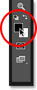

*Clicking the Foreground color swatch.*

This opens Photoshop's **Color Picker**. I'll select red for my new Foreground color, then I'll click **OK** to close out of the Color Picker:

*Choosing red for the new Foreground color.*

Next, I'll change my Background color by clicking its **color swatch** (the one currently filled with white):

*Clicking the Background color swatch.*

This once again opens the Color Picker. I'll change the Background color from white to a bright yellow, then I'll **OK** to close out of the Color Picker:

*Choosing yellow for the new Background color.*

Notice that the color swatches have updated to show the new colors I've chosen for the Foreground and Background:

*The swatches have updated with the new colors.*

The **gradient preview bar** in the Options Bar has also updated to show me what the new gradient colors will look like:

*The gradient preview bar always shows the current gradient colors.*

I'll draw the gradient, this time diagonally, by clicking in the bottom left of my document and dragging to the upper right. Again, there's no need to undo or delete the previous gradient. Photoshop will replace it with the new one:

*Drawing the new gradient from the bottom left to the upper right of the document.*

When I release my mouse button, Photoshop draws the red to yellow gradient diagonally across the document:

*The new red to yellow diagonal gradient.*

### Resetting The Foreground And Background Colors

Notice that if I open my Gradient Picker in the Options Bar, the Foreground to Background gradient's thumbnail is also showing my new red and yellow colors:

*The updated Foreground to Background thumbnail in the Gradient picker.*

You can change the colors for this gradient any time you like by clicking on the Foreground and/or Background color swatches in the Options Bar and choosing different colors. But if you need to quickly **reset the colors** back to their defaults, making the Foreground color **black** and the Background color **white**, simply press the letter **D** (think "D" for "Defaults") on your keyboard. You'll see the swatches in the Tools panel revert back to the default black and white:

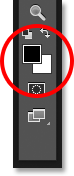

*The Foreground and Background swatches have been reset.*

And you'll see that both the gradient preview bar in the Options Bar and the Foreground to Background gradient's thumbnail in the Gradient Picker are once again showing the default colors:

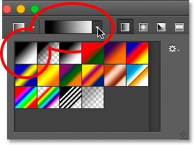

*Everything is now back to the way it was initially.*

### Drawing A Gradient On Its Own Layer

If we look in my [Layers panel](/basics/layers/layers-panel/), we see that up to this point, I've been drawing my gradients directly on the [Background layer](/basics/layers/background-layer/):

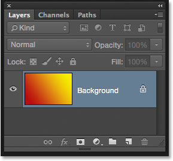

*The Layers panel showing the gradient on the Background layer.*

Drawing on the Background layer may be fine for our purposes here, but a much better way to work in Photoshop is to take advantage of [layers](/basics/layers/) and place each item in our document on its own separate layer. To do that, I'll first clear away my gradient by going up to the **Edit** menu at the top of the screen and choosing **Fill**:

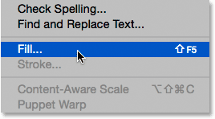

*Going to Edit > Fill.*

When the Fill dialog box opens, I'll set the **Contents** option at the top to **White**, then I'll click **OK**. This fills the Background layer with white:

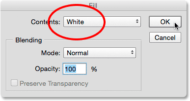

*The Fill dialog box.*

Next, I'll add a new layer for my gradient by pressing and holding the **Alt** (Win) / **Option** (Mac) key on my keyboard and clicking the **New Layer** icon at the bottom of the Layers panel:

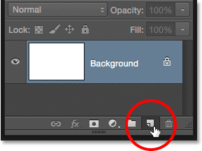

*Pressing and holding Alt (Win) / Option (Mac) while clicking the New Layer icon.*

Adding the Alt (Win) / Option (Mac) key while clicking the New Layer icon tells Photoshop to first open the **New Layer** dialog box where we can name the layer before it's added. I'll name my layer "Gradient", then I'll click **OK**:

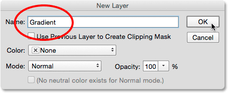

*The New Layer dialog box.*

Photoshop adds a new blank layer named "Gradient" above the Background layer. I can now draw my gradient on this new layer and keep it separate from everything else (even though "everything else" in this case is really just the Background layer, but it's still a good workflow habit to get into):

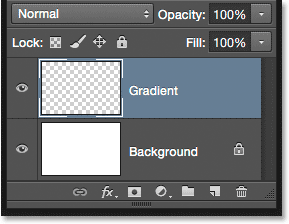

*I now have a separate layer for my gradient.*

### The Transition Area

One thing that's very important to understand when it comes to drawing gradients is that it's not just the direction in which you drag that matters; the **distance between your starting and end points** also matters.

The reason is that what you're actually drawing with the Gradient Tool, along with the direction of the gradient, is the **transition area** between the colors. The distance you drag from your starting point to your end point determines the size of the transition area. Longer distances will give you smoother, more gradual transitions, while shorter distances will create harsher, more abrupt transitions.

To show you what I mean, I'll use the Foreground to Background gradient set to its default black and white. First, I'll draw a gradient from left to right, starting from near the left edge of the document and ending near the right edge. The area between my starting and end points will become the transition area between my two colors (in this case, black and white):

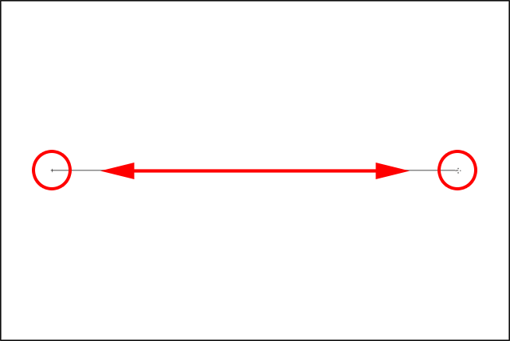

*Drawing a gradient with a wide transition area.*

I'll release my mouse button to let Photoshop draw the gradient, and because there was such a wide gap between my starting and end points, we're seeing a smooth, very gradual transition between black on the left and white on the right:

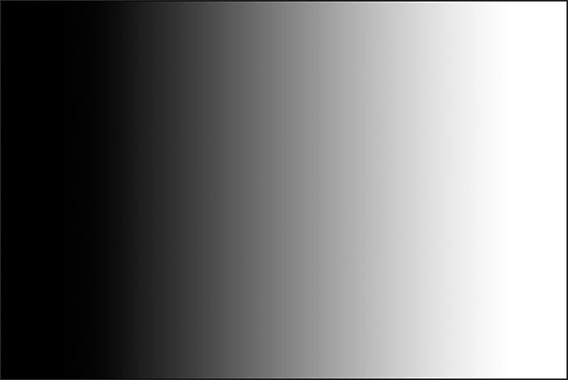

*A gradient with a gradual transition between the colors.*

I'll undo the gradient, just to make things easier to see, by going up to the **Edit** menu at the top of the screen and choosing **Undo Gradient**. I could also press **Ctrl+Z** (Win) / **Command+Z** (Mac) on my keyboard:

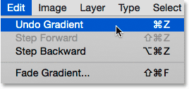

*Going to Edit > Undo Gradient.*

This time, I'll draw my gradient in the same direction (left to right) but with a much smaller gap between my starting and end points:

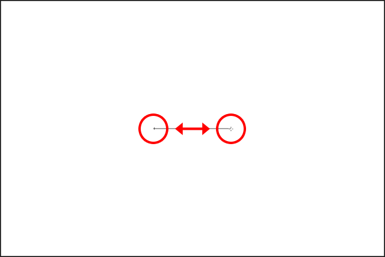

*Drawing a gradient with a narrow transition area.*

When I release my mouse button, we see that while this gradient was drawn in the same direction as the one before, the transition between black on the left and white on the right is much more sudden and abrupt. As we can see, the distance between your starting and end points is every bit as important as the direction when it comes to the overall appearance of the gradient:

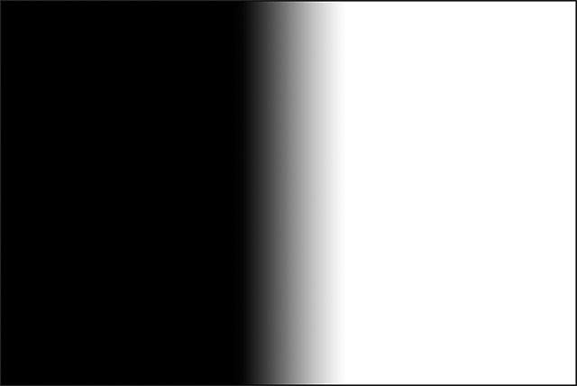

*A similar gradient but with a much smaller transition area.*

Before we move on, let's take a quick look in my Layers panel where we see that, because I added a new layer earlier, my gradient is now being drawn on the separate "Gradient" layer rather than on the Background layer. Again, it's not a huge issue in this case, but getting into the habit of keeping everything on its own layer will make working with Photoshop so much easier:

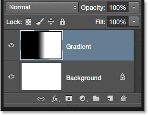

*The gradient now sits on its own layer above the Background layer.*

### The Foreground to Transparent Gradient

So far, we've looked mainly at Photoshop's default Foreground to Background gradient, but another one that's often very useful is the **Foreground to Transparent** gradient, and it's worth looking at because it behaves a bit differently than the others. I'll select it from the Gradient Picker by double-clicking on its thumbnail. You'll find it directly beside the Foreground to Background thumbnail:

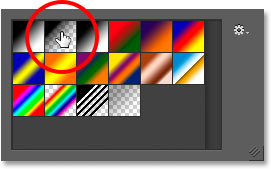

*Choosing the Foreground to Transparent gradient.*

The Foreground to Transparent gradient is similar to the Foreground to Background gradient in that it gets its color from your current **Foreground color**, which means you can easily change it by choosing a different Foreground color. What makes it special, though, is that there is no second color. Instead, it transitions from a single color into transparency.

I'll undo my current gradient by going up to the **Edit** menu and choosing **Undo Gradient**. Then, I'll choose a color by clicking on the Foreground **color swatch** in the Tools panel. At the moment, it's set to black:

*Clicking the Foreground color swatch.*

When the Color Picker opens, I'll choose purple, then I'll click OK:

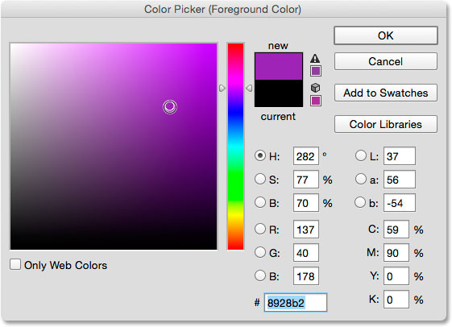

*Choosing purple as the new Foreground color.*

With my Foreground color now set to purple, we see in the gradient preview bar in the Options Bar that I'll be drawing a purple to transparent gradient (the **checkerboard pattern** you can see behind the purple is how Photoshop represents transparency):

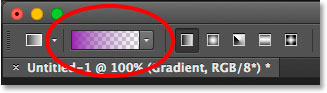

*The gradient will now run from purple to transparent.*

I'll draw a vertical gradient from near the top of my document down to the center:

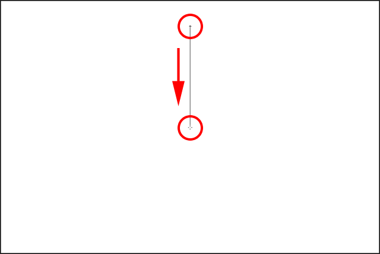

*Drawing a vertical Foreground to Transparent gradient down through the top half of the document.*

When I release my mouse button, it *looks* like what I've drawn is a basic purple to white gradient. However, the white we're seeing is actually from the Background layer *below* the gradient. It's not part of the gradient itself:

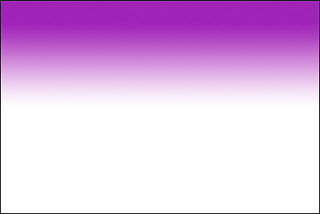

*The purple is from the gradient, but the white is from the background below it.*

To prove it, I'll temporarily turn off my Background layer by clicking on its **visibility icon** (the eyeball icon) in the Layers panel:

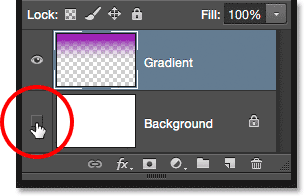

*Turning off the Background layer.*

This hides the white background in the document, revealing just the gradient itself, and now we can clearly see that it's really a purple to transparent gradient. Again, the checkerboard pattern is how Photoshop represents transparency:

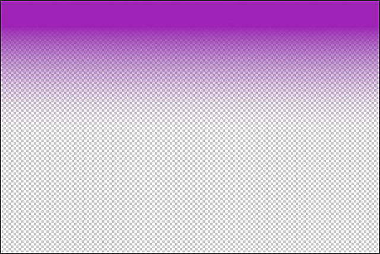

*The actual purple to transparent gradient.*

Another reason why the Foreground to Transparent gradient is different from the others is that Photoshop does not overwrite the previous Foreground to Transparent gradient if we draw another one over top of it. Instead, it simply adds the new gradient to the original. I'll draw a second Foreground to Transparent gradient, this time from near the bottom of the document up to the center:

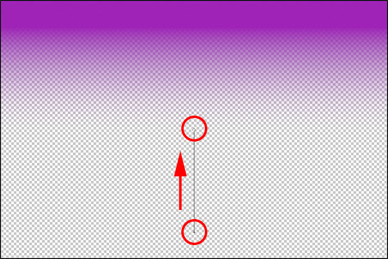

*Adding a second Foreground to Transparent gradient.*

I'll release my mouse button, and rather than overwriting my original gradient, Photoshop adds my second one to it. If I drew a third or fourth gradient (maybe one from the left and the other from the right) it would add those ones as well:

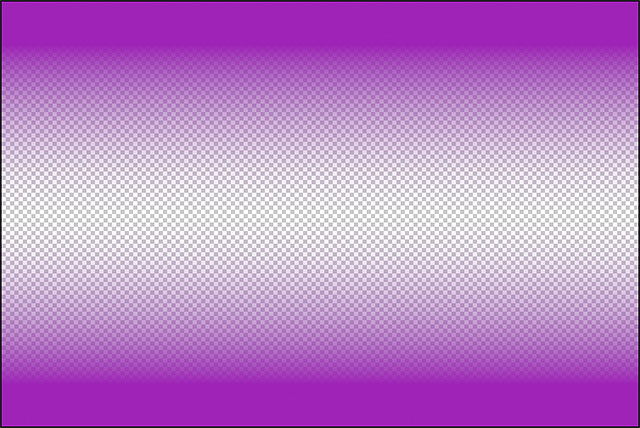

*Both Foreground to Transparent gradients have been merged together.*

I'll turn my Background layer back on in the document by clicking once again on its **visibility icon**:

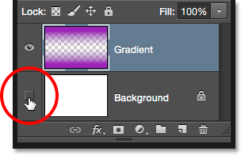

*Turning the Background layer on.*

And now we're back to seeing what looks like a purple to white (to purple) gradient, even though we know that the white is really just the Background layer showing through the transparency:

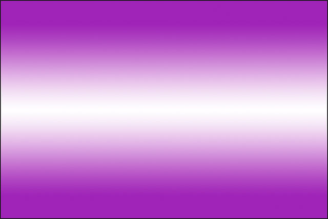

*The same gradient with the Background layer turned on.*

### The Transparency Option

The Foreground to Transparent gradient in Photoshop is great for things like darkening the edges of a photo, or darkening the sky in an image to bring out more detail (which we'll see how to do in another tutorial). But for the transparency part to work, you need to make sure the **Transparency** option in the Options Bar is selected:

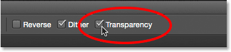

*Make sure Transparency is turned on when drawing a gradient that uses transparency.*

If the Transparency option is turned off when drawing a Foreground to Transparent gradient, all you'll end up doing is filling the layer or selection with your chosen Foreground color:

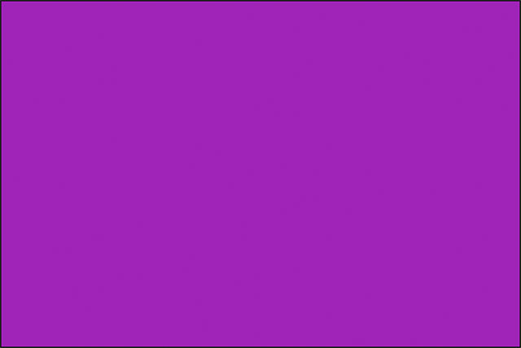

*With the Transparency option turned off, Photoshop can't draw the transparent part of the gradient.*

### The Black, White Gradient

We won't go through every gradient that we can choose from in Photoshop (since you can easily do that on your own), but if you need to draw a black to white gradient and your Foreground and Background colors are currently set to something other than black and white, just grab the **Black, White** gradient from the Gradient Picker (third thumbnail from the left, top row). Unlike the Foreground to Background gradient, the Black, White gradient will always draw a black to white gradient regardless of your current Foreground and Background colors:

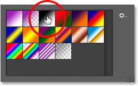

*The Black, White gradient's thumbnail.*

### The Gradient Styles

So far, we've seen examples of gradients that transition in a straight line from the starting point to the end point. This type of gradient is known as a **linear** gradient, but it's actually just one of five different gradient styles we can choose from in Photoshop.

If you look to the right of the gradient preview bar in the Options Bar, you'll see the five **Gradient Style** icons. Starting from the left, we have **Linear**, **Radial**, **Angle**, **Reflected**, and **Diamond**:

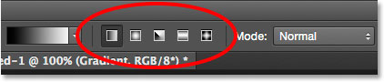

*The Linear, Radial, Angle, Reflected, and Diamond gradient style icons.*

Let's see what each of these gradient styles can do. I'll press **Ctrl+Alt+Z** (Win) / **Command+Option+Z** (Mac) a few times on my keyboard to undo my previous steps until I'm back to seeing just a white-filled document. Then, I'll switch back to the **Foreground to Background** gradient by selecting it in the Gradient Picker:

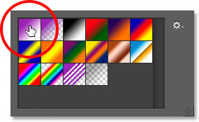

*Choosing the Foreground to Background gradient.*

I'll press the letter **D** on my keyboard to reset my Foreground and Background colors back to black and white. Then, just to keep things interesting, I'll change my Background color from white to a light blue:

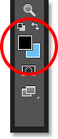

*My latest Foreground and Background colors.*

### Linear

The default gradient style in Photoshop is **Linear**, but you can select it manually if you need to by clicking the first icon on the left:

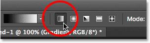

*Selecting the Linear gradient style.*

We've already seen several examples of the linear style, which draws the gradient from the starting point to the end point in a straight line based on the direction in which you dragged. Selecting **Reverse** in the Options Bar will swap the order of the colors:

*An example of a standard linear gradient.*

### Radial

The **Radial** style (second icon from the left) will draw a circular gradient outward from your starting point:

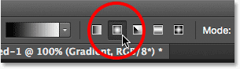

*Selecting the Radial gradient style.*

I'll undo my linear gradient by pressing **Ctrl+Z** (Win) / **Command+Z** (Mac) on my keyboard. To draw a radial gradient, I'll click in the center of my document to set the starting point, then I'll drag outward towards the edge:

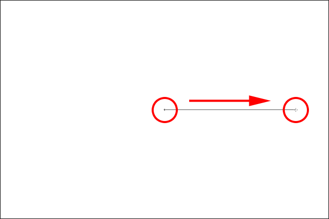

*Drawing a radial gradient from the center of the document.*

I'll release my mouse button, and here we see what the radial gradient looks like. It begins with my Foreground color (black) at my starting point in the center and moves outward in all directions as it transitions into my Background color (blue):

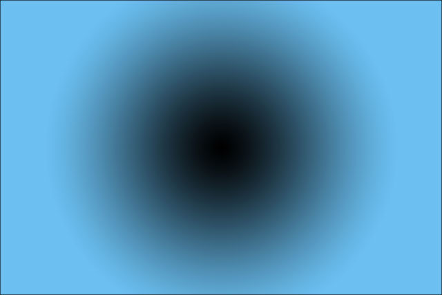

*The radial gradient.*

If I had selected the **Reverse** option in the Options Bar, the colors would be reversed, starting with blue in the center and transitioning outward in a circular fashion into black:

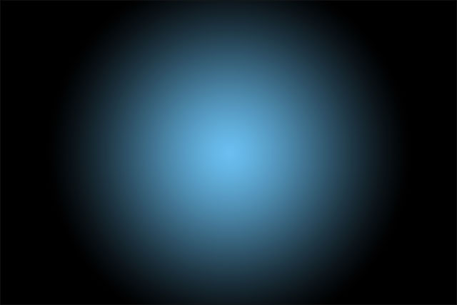

*The same radial gradient with the colors reversed.*

### Angle

The **Angle** style (middle icon) is where things start to get interesting (although maybe not quite as useful):

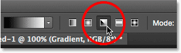

*Selecting the Angle gradient style.*

Much like the Radial style, the Angle style also uses your starting point as the center of the gradient. But rather than transitioning outward in all directions, it wraps itself around the starting point in a counterclockwise fashion. I'll once again press **Ctrl+Z** (Win) / **Command+Z** (Mac) on my keyboard to undo my last gradient. Then, I'll draw the angle-style gradient the same way as the radial gradient by clicking in the center of the document to set the starting point, then dragging away from it:

*Drawing an angle-style gradient from the center.*

Here's what the angle style looks like when I release my mouse button. As with all of Photoshop's gradient styles, selecting Reverse in the Options Bar would give you the same result but with the colors swapped:

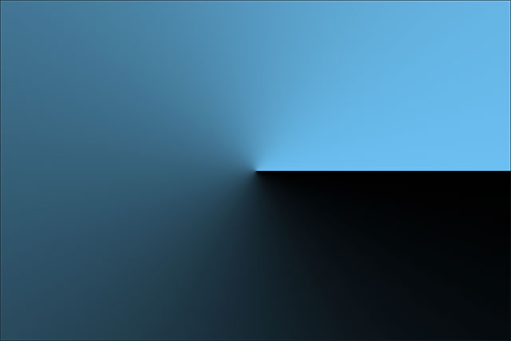

*The angle style wraps the gradient around your starting point counterclockwise.*

### Reflected

The **Reflected** style (fourth icon from the left) is very similar to the standard linear style, but it goes a step further by taking everything on one side of your starting point and mirroring it on the other side:

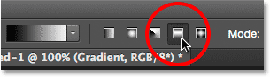

*Selecting the Reflected gradient style.*

Here, I'm clicking in the center of the document to set my starting point, then dragging upward:

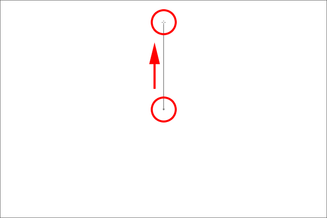

*Drawing a reflected-style gradient.*

When I release my mouse button, Photoshop draws a standard linear gradient in the top half of my document between my starting and end points, but then mirrors it in the bottom half to create the reflection:

*The reflected-style gradient.*

Here's what the reflected gradient would look like with the colors reversed:

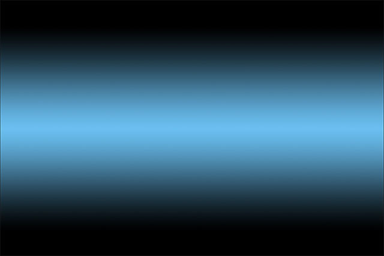

*The reflected-style gradient with Reverse selected in the Options Bar.*

### Diamond

Finally, the **Diamond** gradient style transitions outward from your starting point, similar to the Radial style, except that it creates a diamond shape:

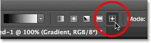

*Selecting the Diamond gradient style.*

I'll once again click in the center of my document to set the starting point and then drag away from it:

*Drawing a diamond-style gradient from the center.*

When I release my mouse button, we get this interesting diamond shape:

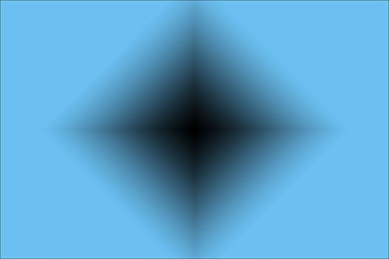

*The diamond-style gradient.*

In this case, I think the diamond shape looks better with the colors reversed, but of course it will depend on the colors you've chosen for the gradient and how it's being used in your design our layout:

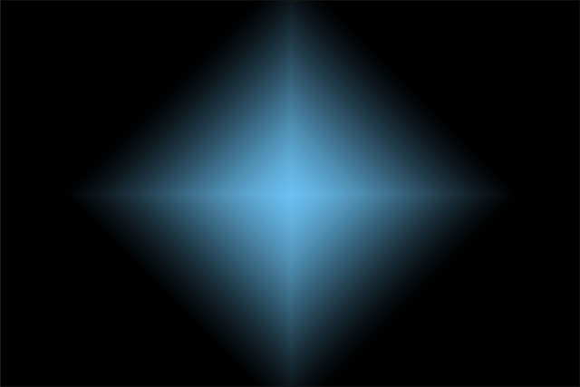

*The diamond gradient with the colors reversed.*

### The Dither Option

One last option we should look at in the Options Bar is **Dither**. With Dither selected, Photoshop will mix a bit of noise into your gradients to help smooth out the transitions between colors. This helps to reduce *banding* (visible lines that form between colors when the transitions are not smooth enough). The Dither option is turned on by default and you'll usually want to leave it selected:

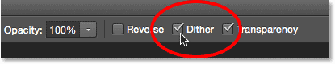

*The Dither option helps reduce ugly banding between colors.*

### The Mode And Opacity Options

There's a couple of other Gradient Tool options in the Options Bar that we'll save for another tutorial because they go a bit beyond the basics. Both the **Mode** option (short for Blend Mode) and the **Opacity** option affect how the gradient will blend in with the original contents of the layer. If you're familiar with [layer blend modes](/photo-editing/layer-blend-modes/intro/), gradient blend modes work much the same way, while the gradient opacity option works much like the Opacity option found in the [Layers panel](/basics/layers/opacity-vs-fill/). In most cases, you'll want to leave them set to their defaults, but again, we'll cover these two options in detail in their own separate tutorial:

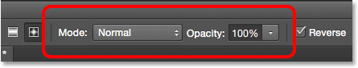

*The Mode and Opacity options.*