# How to Draw Shapes with the Shape Tools in Photoshop

> Source: [https://www.photoshopessentials.com/basics/how-to-draw-shapes-with-the-shape-tools/](https://www.photoshopessentials.com/basics/how-to-draw-shapes-with-the-shape-tools/)
> Downloaded and converted to Markdown.

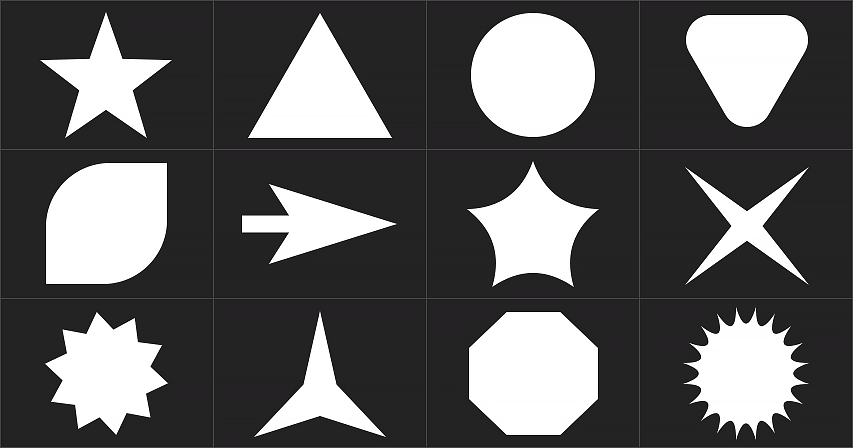

*How to draw shapes with the shape tools in Photoshop*

Learn the basics of drawing shapes using the shape tools in Photoshop! Covers the geometric shape tools which include the Rectangle, Ellipse, Triangle, Polygon and Line Tools. Updated for Photoshop 2022.

In this tutorial, I show you the basics of how to draw shapes using the shape tools in Photoshop. Specifically, we’ll look at how to use the geometric shape tools, which are the Rectangle Tool, the Ellipse Tool, the Triangle Tool, the Polygon Tool, and the Line Tool. Photoshop also includes a Custom Shape Tool for drawing more ellaborate pre-made shapes. But because the Custom Shape Tool behaves differently than the geometric shape tools, I’ll cover it in a [separate tutorial](/basics/how-to-draw-custom-shapes-in-photoshop/ "Learn more").

Let's get started!

## Which version of Photoshop do I need?

Adobe has made quite a few changes to the shape tools in recent versions of Photoshop. So to follow along, you’ll want to be using Photoshop 2022 or newer. You can [get the latest Photoshop version here](https://adobe.prf.hn/click/camref:1100lrdjJ/destination:https%3A%2F%2Fwww.adobe.com%2Fproducts%2Fphotoshop.html "Get Adobe Photoshop").

## Setting up the document

You can follow along with me by [creating a new Photoshop document](/basics/create-new-documents-photoshop-cc/ "Learn more"). To create one from the Home Screen, click the **New file** button.

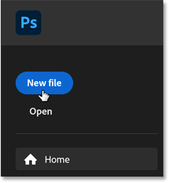

*Clicking <q>New file</q> on the Home Screen.*

Or if you're on Photoshop's main interface, go up to the **File** menu and choose **New**.

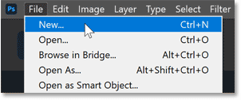

*Going to File > New in the Menu Bar.*

Then in the New Document dialog box, choose the **Default Photoshop Size** preset and click **Create**.

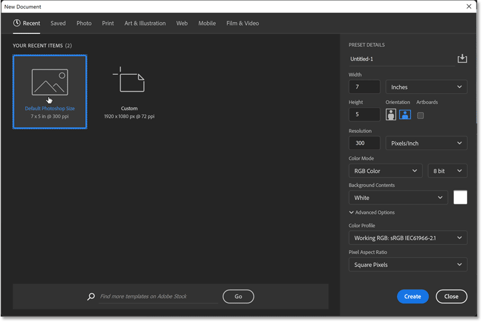

*Creating a new document at the default size.*

The new document appears, ready for us to draw some shapes.

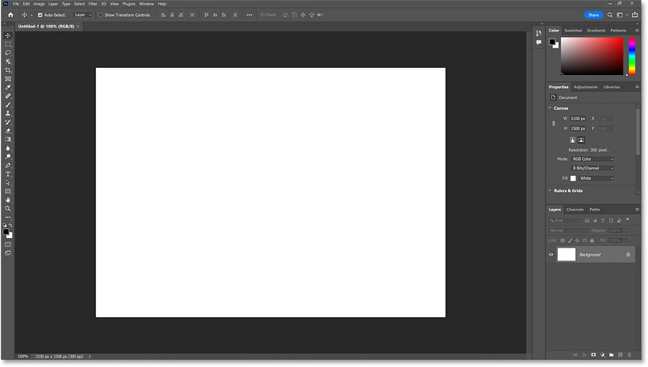

*The new Photoshop document.*

## Where do I find Photoshop's shape tools?

The shape tools in Photoshop are all found in the [toolbar](/basics/photoshop-tools-toolbar-overview/ "Learn more"), nested together in the same spot. By default, the **Rectangle Tool** is the tool that's visible.

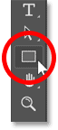

*The Rectangle Tool's icon in the toolbar.*

Click and hold on the Rectangle Tool's icon to open a fly-out menu showing the other shape tools hiding behind it. We'll look at each tool as we go along. For now, select the Rectangle Tool.

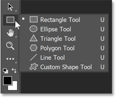

*Photoshop's shape tools.*

## The shape tool options in the Options Bar

The options for the active shape tool appear in the **Options Bar**. And most of the options are the same no matter which shape tool is selected. So let's look at these options from left to right.

### Resetting the shape tool to its default settings

The **tool icon** on the far left of the Options Bar tells us which tool is active. But it's also how we reset the tool to its default settings. To reset it, **right-click** (Win) / **Control-click** (Mac) on the tool icon.

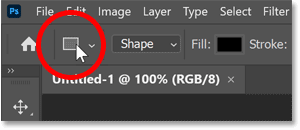

*Right-click (Win) / Control-click (Mac) on the tool icon.*

Then choose **Reset Tool** from the menu.

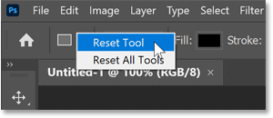

*Choosing the <q>Reset Tool</q> command.*

### The Tool Mode

Next is the **Tool Mode** option where we choose which kind of shape we want to draw. Shapes in Photoshop can be drawn as either vectors, paths or pixels.

*Vector* shapes are drawn using points connected together by straight or curved lines, and they remain scalable and editable without ever losing quality. A *path* is also scalable and editable, but it's simply the outline of the shape without any fill or stroke. And a *pixel* shape is made of pixels, just like images.

In most cases, you'll want to draw vector shapes. And for that, the mode needs to be set to **Shape**, which it is by default.

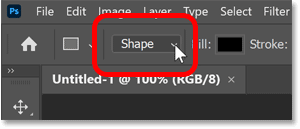

*Make sure the Tool Mode is set to Shape.*

### The Fill Color

The **Fill** option is where we choose a color for the shape. The default shape color is black. To choose a different color, click the Fill color swatch.

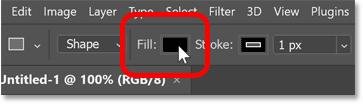

*Clicking the Fill color swatch.*

Then choose the kind of fill you need using the icons along the top of the panel. From left to right, we have **No Color** (which leaves the inside of the shape empty), a **Solid Color** preset, a **Gradient** preset or a **Pattern** preset.

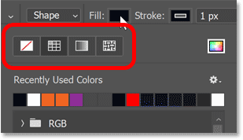

*The No Color, Solid Color, Gradient and Pattern fill options.*

If you choose Solid Color, Gradient or Pattern, then twirl open one of the preset groups and choose a preset by clicking its thumbnail. Here I’ve selected the Solid Color preset option and I’ve opened the RGB group to select a preset color.

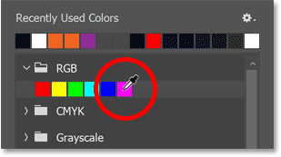

*Choosing a Solid Color preset.*

Or to choose your own custom fill color for the shape, click the icon in the upper right corner.

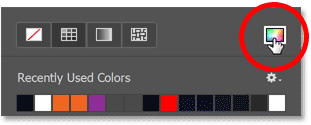

*Clicking the Custom Fill Color icon.*

Then select a color from the Color Picker. I’ll choose a purple color by setting the **H** (Hue) value to **295** degrees, the **S** (Saturation) value to **70** percent and the **B** (Brightness) also to **70** percent. Click OK to close the Color Picker when you’re done.

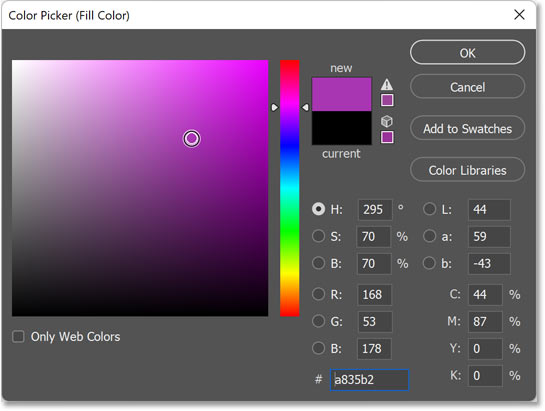

*Choosing a custom fill color for the shape.*

### The Stroke Color

The next two options in the Options Bar are for adding a stroke around the shape. By default, Photoshop adds a 1 pixel black stroke. To choose a different color, or no color, click the **Stroke** color swatch.

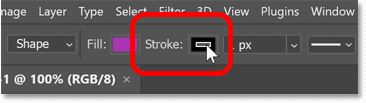

*Clicking the Stroke color swatch.*

Then use the icons along the top of the panel to choose from the same options we saw with the fill color. Again from left to right, we have **No Color** (for when you don't want a stroke around the shape), a **Solid Color** preset, a **Gradient** preset, or a **Pattern** preset.

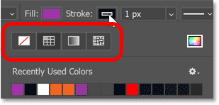

*The No Color, Solid Color, Gradient and Pattern stroke options.*

Or click the icon in the upper right corner to choose a custom stroke color from the Color Picker. But in my case, I'll stick with the default black.

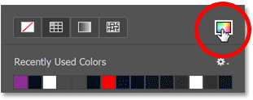

*The Custom Stroke Color icon.*

### The Stroke Size

Next, set the width or thickness of the stroke by entering a **Size** value. I'll set it to **16 pixels**. As we'll see, all of these options (fill color, stroke color, stroke size and more) can also be changed from the Properties panel after we draw the shape.

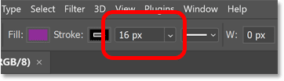

*Entering a size for the stroke.*

### The Stroke Type, Alignment and more

For even more stroke options, click the **Stroke Options** box.

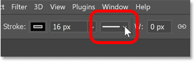

*Opening the stroke options.*

From here, you can set the stroke **Type** to either a **Solid**, **Dashed** or **Dotted line**. Solid is the default. Or change the stroke's **Alignment** to either **Inside**, **Outside** or **Centered** on the outline of the shape. And you can change the **Cap Type** or **Corner Type** if needed.

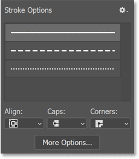

*Choose the stroke type, alignment and more.*

If you click the **More Options** button at the bottom.

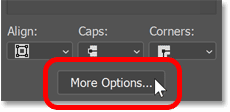

*The More Options button.*

A separate dialog box opens with most of the same options, but you can also create your own custom dashed or dotted line, and save your settings as a preset. Since we're only covering the basics here (and there's lots more to cover), I'll click Cancel to close the dialog box.

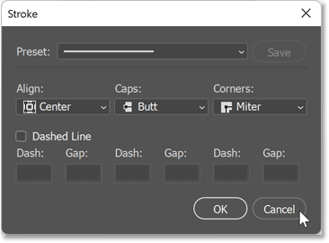

*The Stroke Options dialog box.*

### The Width and Height

Next in the Options Bar are the **Width** (**W**) and **Height** (**H**) fields. But rather than allowing you to set a width and height for your shape before you draw it, these options are used to change the width and height *after* you’ve drawn the shape.

You can ignore the Width and Height options in the Options Bar because they can easily be changed in the Properties panel after we draw the shape.

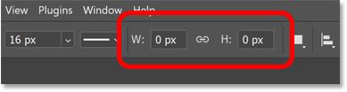

*The Width and Height fields (used for changing the size after the shape is drawn).*

### Path Operations, Path Alignment and Path Arrangement

The next three icons after the Width and Height fields hold options that I'll cover in more detail in a separate tutorial.

But briefly, clicking the first icon, **Path Operations**, opens a list of ways to combine two or more shapes into a larger or more complex shape. The default setting, New Layer, draws a separate and independent shape each time.

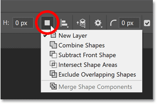

*The Path Operations commands.*

The next icon, **Path Alignment**, opens all the ways to align or distribute multiple shapes. The **Align To** option at the bottom lets you switch between aligning shapes to a selection or to the canvas.

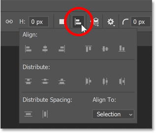

*The Path Alignment options.*

And the third icon, **Path Arrangement**, holds commands for moving the selected shape above or below the other shape(s) that it's combined with, similar to moving layers above or below each other in the Layers panel.

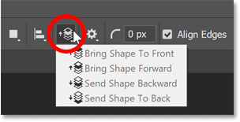

*The Path Arrangement commands.*

### The Gear icon

The next set of options are found by clicking the **Gear icon** in the Options Bar.

First are the **Path Options** for changing the **Thickness** or **Color** of the path outline around the shape. But don't confuse a path outline with a stroke. Paths exist only in Photoshop and do not appear when you print your work or when you save it as a jpeg, png or other file format. These path options exist only to make the path outline easier to see while working in Photoshop. To place an actual outline or border around the shape, you need to add a stroke.

I'll increase the thickness to **2 px** just to make the path easier to see as we go through this tutorial. But in most cases, the default thickness of 1 px works fine.

Below that are options for setting a custom size or aspect ratio for the shape before you draw it, along with the option to draw the shape out from its center rather than from a corner. But I would avoid these options because they are *sticky*, meaning that they remain selected until you come back and choose a different one, which can quickly become annoying. Instead, I'll show you a better way to access these options from your keyboard.

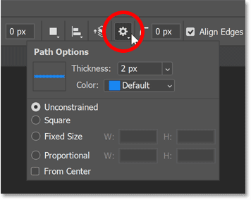

*The options under the Gear icon.*

### The Corner Radius

Next is the **Corner Radius** option, which is only visible when the Rectangle Tool, Triangle Tool or Polygon Tool is active in the toolbar. Corner Radius lets you set the roundness of the shape's corners before you draw the shape by entering a value, in pixels.

But again, there are easy ways to adjust the corner radius after the shape is drawn, so there's no reason to set it here unless you know the exact value you need.

*The Corner Radius option.*

### Align Edges

Finally, the **Align Edges** option aligns the edges of your shape to Photoshop's pixel grid, which I covered in the [Zooming and Scrolling Images](/basics/photoshop-zoom/ "Learn more") tutorial. Aligning the edges to the pixel grid keeps the shape's edges looking sharp, so you’ll want to leave Align Edges checked.

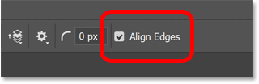

*The Align Edges option.*

## How to draw shapes with the shape tools

So now that we've gone through the shape options in the Options Bar, let's look at how to draw different kinds of shapes using Photoshop's various shape tools. We'll start with the Rectangle Tool which draws simple four-sided shapes. I'll show you all the ways to use the Rectangle Tool, but much of what we'll cover applies to the other shape tools as well.

### Select the Rectangle Tool

First, in the toolbar, make sure the **Rectangle Tool** is selected.

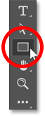

*Selecting the Rectangle Tool.*

### How to draw a rectangle shape

Click on the canvas to set a starting point for the shape, and then drag away from that point. As you drag, you won't see the shape's fill or stroke color. All you will see is the path outline.

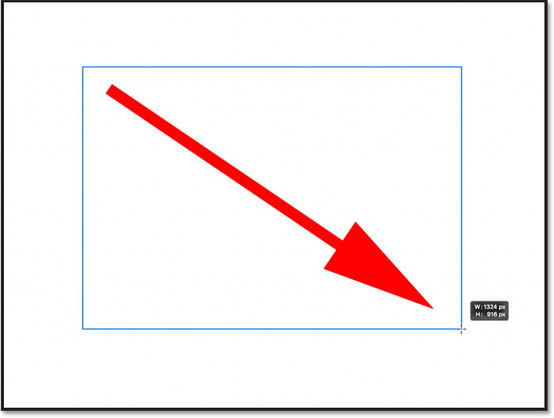

*Click and drag to start drawing the shape.*

### How to reposition the shape as you draw

If you press and hold the **spacebar** on your keyboard while your mouse button is still down, you can drag the shape outline around the canvas to reposition it. Then release the spacebar to continue dragging out the shape.

### Completing the shape

Release your mouse button to complete the shape. The path outline is still visible but so are the fill and the stroke.

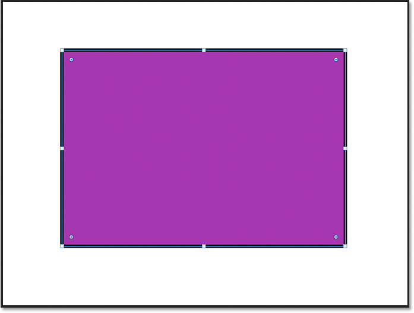

*Photoshop completes the shape when you release your mouse button.*

### The shape layer

In the Layers panel, the new shape appears on its own **shape layer**. And because the shape was drawn using the Rectangle Tool, Photoshop names the layer <q>Rectangle 1</q>. Since shapes are added on their own layers, it means a shape can be scaled, edited, moved or deleted without affecting any other shapes or other elements in the document.

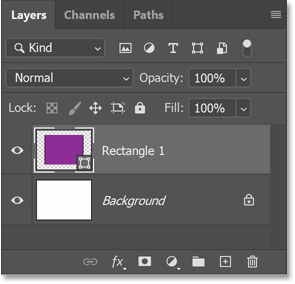

*Each new shape automatically appears on its own shape layer.*

### Turning shape layers on and off

I’ll hide the shape so we can look at more ways to use the Rectangle Tool by clicking the shape layer's **visibility icon**.

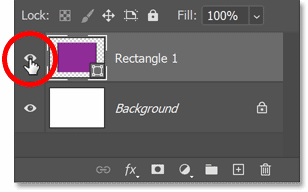

*Clicking the shape layer's visibility icon.*

### How to draw a perfect square

To draw a perfect square with the Rectangle Tool, click to set a starting point for the shape and then begin dragging. Press and hold the **Shift** key on your keyboard to lock the shape's aspect ratio to a perfect square and then continue dragging.

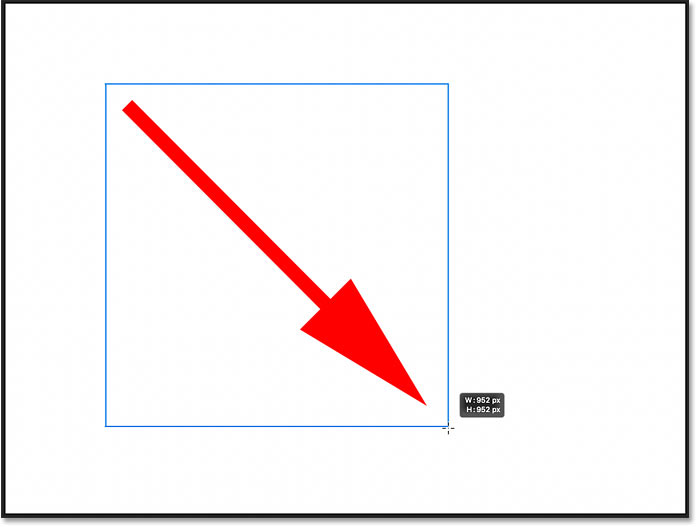

*Begin dragging, then hold Shift and continue dragging.*

Release your mouse button to complete the shape, and then release the Shift key. Make sure to release your mouse button *before* releasing Shift, otherwise it won't work.

The Shift key can also be used to draw a perfect circle with the Ellipse Tool, an equilateral triangle with the Triangle Tool, or a symmetrical polygon shape with the Polygon Tool, all of which we'll look at in a moment.

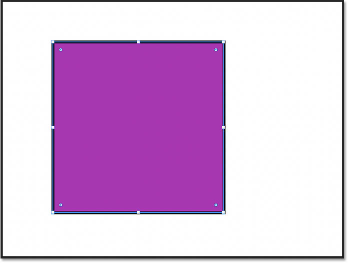

*A perfect square drawn using the Rectangle Tool.*

In the Layers panel, the second shape appears on its own shape layer above the first. Hide the second shape by clicking its **visibility icon** so we can look at a third way to use the Rectangle Tool.

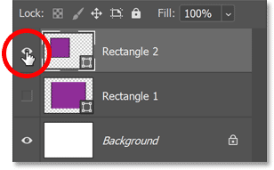

*Hiding the second shape.*

### How to draw a shape at an exact size

If you know the exact size that the shape needs to be, then instead of clicking and dragging, simply click on the canvas and release your mouse button.

The **Create Rectangle** dialog box opens where you can enter a width and height for the shape, in pixels. Note that while the dialog box currently says "Create Rectangle" because I'm using the Rectangle Tool, this trick can be used with any shape tool to draw the shape at an exact size.

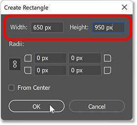

*Entering exact dimensions for the shape.*

Click OK to close the dialog box, and the shape instantly appears.

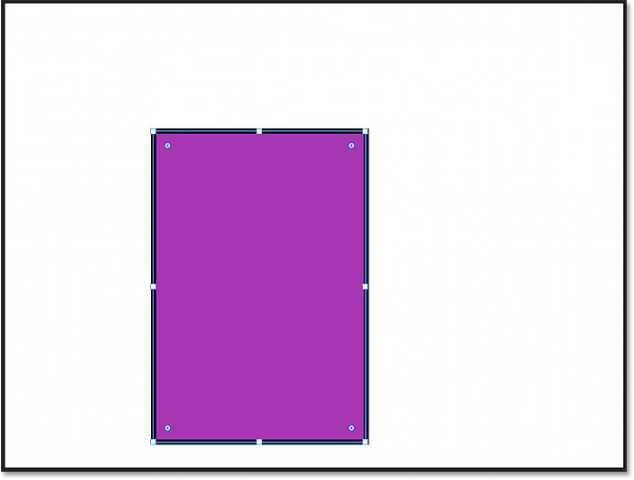

*Photoshop draws the shape at the exact width and height.*

### How to move a shape around the canvas

To move the shape to a new location after you draw it, switch from your shape tool to the **Path Selection Tool** (the black arrow) in the toolbar, located directly above the shape tools.

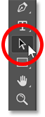

*Selecting the Path Selection Tool.*

Then simply click on the shape and drag it into place.

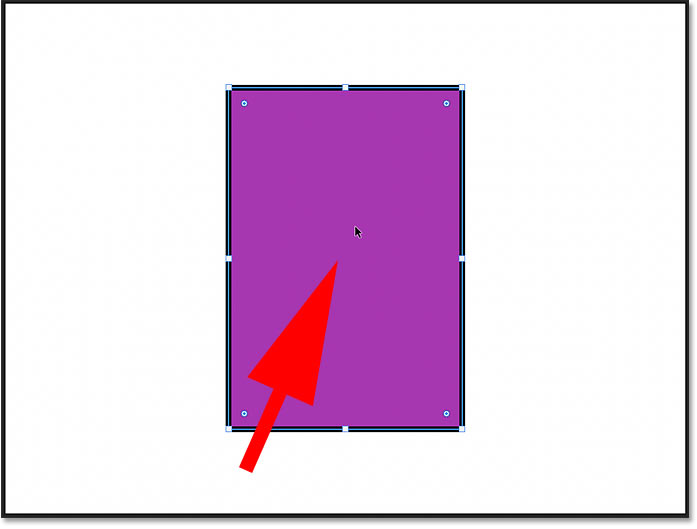

*Moving the shape with the Path Selection Tool.*

#### Tip! Access the Path Selection Tool temporarily

Instead of choosing the Path Selection Tool from the toolbar, you can access it temporarily from your keyboard by holding the **Ctrl** (Win) / **Command** (Mac) key. With the key held down, click and drag to move the shape. Then release the key to switch back to your shape tool.

#### Tip! Select shapes just by clicking on them

And here's a tip you can use when you've drawn multiple shapes in your document, each on its own layer, and you need to select individual shapes to move them around.

Select the **Path Selection Tool** from the toolbar so you can access its options in the Options Bar. Then in the Options Bar, change the **Select** option from Active Layers to **All Layers**. You can then click on any shape to select it without needing to click on the shape's layer in the Layers panel.

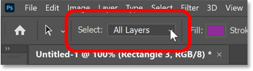

*Changing Select to All Layers in the Options Bar.*

### More tricks for drawing shapes

Earlier I mentioned that you can **reposition a shape as you draw it** by holding the **spacebar** on your keyboard, dragging the shape into place, and then releasing your spacebar to continue dragging out the shape. This works with any of Photoshop's shape tools.

To **draw a shape from its center** rather than from a corner, click to set the starting point and begin dragging. Then hold the **Alt** (Win) / **Option** (Mac) key on your keyboard and continue dragging. Release your mouse button to complete the shape, and then release the Alt (Win) / Option (Mac) key.

### How to delete a shape

To delete a shape, click on its shape layer in the Layers panel and drag the layer down onto the **Trash Bin**. Or with the layer selected, press the **Delete** on your keyboard.

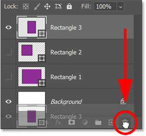

*Dragging a shape layer onto the trash bin to delete it.*

### How to reselect a shape

To reselect an existing shape in your document, click on its shape layer in the Layers panel. And if the shape was turned off, click its visibility icon to turn it back on.

*Selecting and turning on the second shape layer.*

## Editing the shape with the on-canvas controls

Back in Photoshop 2021, Adobe added **on-canvas controls** to shapes. These controls appear around the shape after you draw it, and make it easy to scale, resize or rotate the shape without needing to use the [Free Transform command](/basics/transform-and-warp-images-with-free-transform-in-photoshop-cc-2019/ "Learn more"). The on-canvas controls can also be used to adjust the roundness of a shape's corners. Here’s how to use them.

### How to resize the shape

To resize a shape using the on-canvas controls, click and drag any of the **handles** (the squares that appear around the path outline). By default, dragging a handle will resize the shape non-proportionally, meaning that each side or corner can be moved without moving any others.

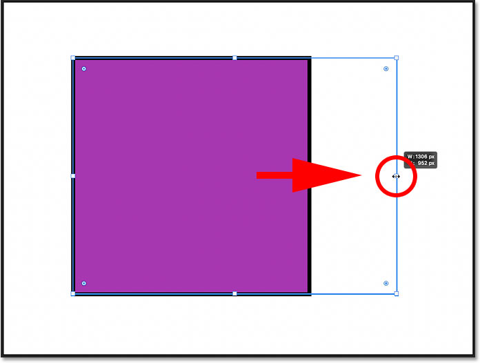

*Drag a handle to resize the shape.*

To scale the shape proportionally, hold the **Shift** key on your keyboard as you drag a handle. Just remember to release your mouse button first before releasing the Shift key.

You can also hold **Alt** (Win) / **Option** (Mac) while dragging to resize the shape from its center, or **Shift+Alt** (Win) / **Shift+Option** (Mac) to resize it proportionally from its center.

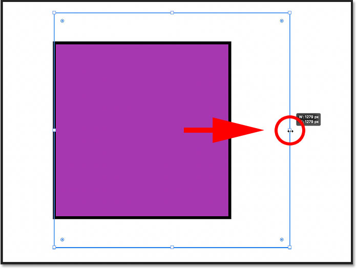

*Hold Shift while dragging a handle to resize the shape with the aspect ratio locked.*

### How to undo a transformation

To undo the last transformation you made to the shape, go up to the **Edit** menu and choose **Undo Transform Path**. Or press **Ctrl+Z** (Win) / **Command+Z** (Mac) on your keyboard. Press Ctrl+Z (Win) / Command+Z (Mac) repeatedly to undo multiple steps in a row.

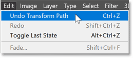

*Going to Edit > Undo Transform Path.*

### How to rotate a shape

To rotate a shape using the on-canvas controls, move your cursor just outside the path outline. When the cursor changes to a rotate icon (a curved double-sided arrow), click and drag to rotate the shape around its center.

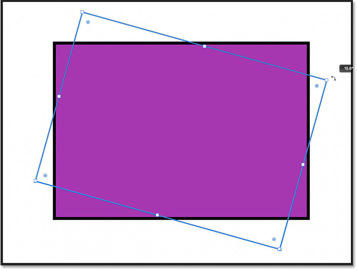

*Click and drag outside a corner to rotate the shape.*

### How to rotate a shape from its corner

Shapes can also be rotated around a corner or other location by moving the **reference point**. The reference point is the target icon that appears in the center of the shape by default. If you're not seeing the reference point, I show you how to turn it on next.

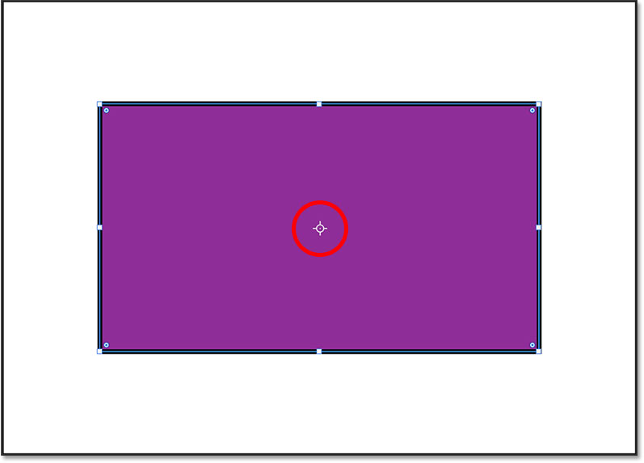

*The reference point in the center of the shape.*

#### How to show the reference point

If the reference point is not visible, you’ll need to turn it on in Photoshop’s preferences. On a Windows PC, go up to the **Edit** menu in the Menu Bar. On a Mac, go up to the **Photoshop** menu. From there, choose **Preferences** and then **Tools**.

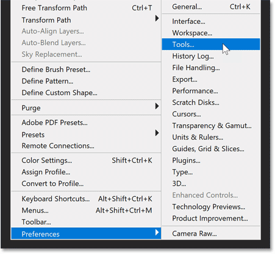

*Opening the Tools preferences.*

Then in the Preferences dialog box, select **Show Reference Point when using Transform**. You'll only need to do this once. And as a bonus, the reference point will now be visible not only with shapes but anytime you use Photoshop's Free Transform command. Click OK to close the dialog box when you’re done.

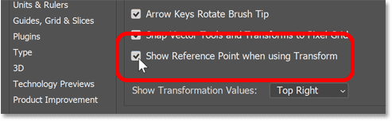

*Turning on <q>Show Reference Point when using Transform</q>.*

Click and drag the reference point to a new location. I'll move it onto the handle in the upper left corner:

*Moving the reference point onto a corner handle.*

And now when you rotate the shape, it rotates around the new point. Note that the reference point icon automatically resets to the center of the shape when you release your mouse button.

*The shape is rotating around the upper left corner.*

### How to round the shape's corners

The on-canvas controls can also be used to adjust the roundness, or radius, of the shape's corners, although this feature depends on which shape tool was used.

With the Rectangle Tool, all four corners can be rounded at once, or a single corner can be rounded independently. But shapes drawn with the Triangle Tool or Polygon Tool are limited to a single control that affects all corners at the same time. And the Ellipse Tool and Line Tool do not allow rounded corners at all.

The radius controls are the small circles just inside the corners.

*The corner radius controls for the shape.*

#### Rounding all corners at once

For rectangle and square shapes that have a radius control in each corner, drag any of the controls to round all four corners at the same time and by the same amount:

*Dragging a radius control to round all corners at the same time.*

#### Rounding a single corner independently

To adjust a single corner without affecting the others, hold **Alt** (Win) / **Option** (Mac) on your keyboard and drag the corner's radius control.

But if you know the exact radius value you need for the corner(s), then instead of dragging with the on-canvas controls, you can enter the exact value in Photoshop's Properties panel, which we'll look at next.

*Hold Alt (Win) / Option (Mac) to round a single corner.*

## The Live Shape properties in the Properties panel

While the on-canvas controls are convenient, they're not the only way to adjust the appearance of your shape. In fact, any shape drawn with one of Photoshop's geometric shape tools (the Rectangle, Ellipse, Triangle, Polygon, or Line Tool) is what Adobe calls a **Live Shape**.

A Live Shape means that after the shape is drawn, all of its properties remain <q>live</q> and editable. And the properties are found in the **Properties panel**.

Since I currently have a rectangle shape selected, the [Properties panel](/basics/using-the-enhanced-properties-panel-in-photoshop/ "Learn more") is showing options for a shape drawn with the Rectangle Tool. But most of the options will be the same no matter which tool was used.

*The Live Shape properties in the Properties panel.*

### The Transform properties

The Properties panel is divided into sections, and the first section at the top is **Transform**. The Transform options are the same for all shape tools.

#### The shape's Width, Height and Location

In the Transform properties, you can edit the shape's **Width** (W) or **Height** (H), and click the **link icon** to link or unlink the width and height values. The **X** and **Y** coordinates can be used to set a specific location for the shape on the canvas. X is the horizontal distance from the left of the canvas and Y is the vertical distance from the top.

*The Width, Height and X, Y values.*

#### The Rotation angle

The **Angle** option sets the rotation of the shape. To reset the angle, enter a value of 0 degrees. If you rotated the shape using the on-canvas controls, the current angle appears and can be adjusted from here.

*The Angle option.*

Clicking the arrow next to the angle value opens a list of preset angles to choose from.

*The angle presets.*

#### Tip! Changing values with the scrubby slider

The width and height, X and Y values, and the rotation angle can all be changed using Photoshop's **scrubby slider**. Click on a property's name (for example, the letter W for the width), keep your mouse button held down, and drag left or right to change the value.

*Click and drag to use the scrubby slider.*

#### Flipping the shape's orientation

Finally, you can use the **Flip Horizontal** or **Flip Vertical** icons to flip the shape's orientation.

*The Flip Horizontal and Flip Vertical options.*

### The Appearance properties

The **Appearance** section in the Properties panel holds options for changing the shape's fill color, the stroke color, the thickness of the stroke, and more. It’s also where we adjust the roundness of the corners. The fill and stroke options are the same for all shapes, but the corner options will change depending on the shape tool that was used.

#### The Fill and Stroke color

Click the Fill or Stroke **color swatches** to change the colors. You’ll find the same options for choosing colors that we saw earlier in the Options Bar.

*The Fill and Stroke color options.*

#### The stroke Size and other options

Below the color swatches are more options for the stroke that are copied over from the Options Bar. You can change the **Size** of the stroke, or click the **Stroke Options** box to the right of the size to change the stroke **Type** from a solid to a dashed or dotted line.

The three icons below the stroke size let you change, from left to right, the stroke's **Alignment** (Inside, Outside or Centered), the **Cap Type** and the **Corner Type**.

*The stroke size, line type, alignment, cap type and corner type properties.*

#### The Corner Radius

Earlier we learned how to adjust the roundness of the shape's corners using the on-canvas controls. But you can also adjust the corner radius here in the Properties panel. In fact, when you use the on-canvas controls, you'll see the radius values changing in the Properties panel.

By default, the four boxes (one for each corner) are linked together, so entering a new value for one corner changes all four by the same amount. To unlink the boxes (or link them together again), click the **link icon**.

Here I’ve changed the radius value of the upper left corner to **60 pixels**. And because all four corners were linked together, they all changed to 60 pixels when I pressed **Enter** (Win) / **Return** (Mac) to accept the new value.

*By default, changing one corner changes them all.*

Below the individual boxes is a larger box that displays the current radius values for all corners at once. The first value is the top left corner, then the top right, the bottom right, and the bottom left. You can highlight any value to change it and only that one corner will be affected, even if the corners are linked together.

*The bottom box shows all corner radius values at once.*

### The Pathfinder properties

Finally, the Pathfinder section at the bottom of the Properties panel holds the same options for combining shapes that we saw earlier in the Options Bar. From left to right, we have Combine Shapes, Subtract front shape, Intersect shape areas, and Exclude overlapping areas. These options are the same for all shape tools, and again, I'll cover them in a separate tutorial.

*The Pathfinder options.*

## Drawing shapes with Photoshop's other shape tools

At this point, we've covered most of the basics for drawing shapes in Photoshop. We know where to find the various shape tools in the toolbar, and we've looked at the options in the Options Bar, like choosing a fill and stroke color, which are mostly the same for each tool. We know how to draw shapes by clicking and dragging on the canvas, how to edit the shapes using the on-canvas controls, and how to edit the Live Shape properties in the Properties panel.

But since the only shape tool we've used so far is the Rectangle Tool, let's take a quick look at Photoshop's other geometric shape tools. I won't repeat everything that's the same with each tool and that we've already covered. Instead, we'll focus mostly on features that are unique to each tool.

### The Ellipse Tool

While the Rectangle Tool draws rectangles and squares, the **Ellipse Tool** draws round or elliptical shapes, including perfect circles. Other than that, both tools behave much the same. But since elliptical shapes have no corners, you won't find any options to adjust them.

To select the Ellipse Tool, click and hold on the Rectangle Tool in the toolbar, or whichever shape tool you used last. Then choose the Ellipse Tool from the menu.

*Selecting the Ellipse Tool.*

#### Drawing an elliptical shape

Click and drag in the document to draw an elliptical shape, or hold **Shift** as you drag to draw a perfect circle as I'm doing here:

*Click and drag an elliptical shape, or add Shift to draw a circle.*

#### Editing the shape with the on-canvas controls

Release your mouse button to draw the shape, and then drag any of the on-canvas control handles to resize it as needed. Hold **Shift** as you drag to lock the original aspect ratio in place, or hold **Alt** (Win) / **Option** (Mac) to resize the shape from its center.

*Holding Alt (Win) / Option (Mac) to resize the elliptical shape from its center.*

#### The Live Shape properties

In the Properties panel, the Ellipse Tool shares the same editable Live Shape properties as the Rectangle Tool. The only properties missing are the corner radius options since they don't apply. But you can still change the width and height, the fill and stroke color, and more.

*The Live Shape properties for the Ellipse Tool.*

### The Triangle Tool

The **Triangle Tool** was first introduced in Photoshop 2021. Before that, drawing a triangle shape involved selecting the Polygon Tool (which we'll look at next) and setting the number of sides to 3. But we now have a dedicated Triangle Tool so you don’t need to remember that a triangle is just a 3-sided polygon. And we can even round the triangle's corners using either the on-canvas controls or the Live Shape properties in the Properties panel.

To select the Triangle Tool, click and hold on whichever shape tool appears in the toolbar, which will always be the last tool that was used. Then choose the Triangle Tool from the list:

*Selecting the Triangle Tool.*

#### The Corner Radius option in the Options Bar

Like the Rectangle Tool, the Triangle Tool includes a **Corner Radius** option in the Options Bar which can be used to set the roundness of the corners before drawing the shape. But to draw a triangle with sharp corners, leave the radius at its default value of **0 px**.

*The Triangle Tool's corner radius option in the Options Bar.*

#### Drawing a triangle shape

Click and drag in the document to draw a triangle shape, or hold **Shift** as you drag to draw an equilateral triangle where all three sides are the same length. And as with all the shape tools, you can hold **Alt** (Win) / **Option** (Mac) to draw the shape out from its center.

*Drawing a triangle with the new Triangle Tool.*

#### Rounding the triangle corners

Release your mouse button to complete the shape, and then use the on-canvas controls to scale, resize or rotate the triangle if needed.

Triangles also include a single corner radius control at the top.

*The corner radius control for triangle shapes.*

Dragging the control up or down will adjust the roundness of all three corners of the triangle at once.

*Rounding the corners by dragging the radius control.*

The corner radius can also be adjusted in the Properties panel along with all of the other Live Shape properties that are common with all shapes:

*The corner radius option in the Properties panel.*

### The Polygon Tool

While the Triangle Tool draws 3-sided shapes and the Rectangle Tool draws shapes with 4 sides, the **Polygon Tool** in Photoshop can draw shapes with as many sides as you need. It can even draw stars, as we’ll see in a moment.

Select the Polygon Tool in the toolbar by clicking and holding on the last shape tool that was used, and then choose the Polygon Tool from the list:

*Selecting the Polygon Tool.*

#### The Sides and Radius options

Along with the standard shape tool options in the Options Bar, the Polygon Tool also includes a box for entering the **number of sides** and for setting the **corner radius**. If you know the number of sides you need, you can set it here before drawing the shape. Or you can leave these options at their defaults (sides = 5, radius = 0 px) and adjust them in the Properties panel after the shape is drawn.

*The number of sides (left) and corner radius (right) options for the Polygon Tool.*

#### Drawing the polygon shape

Click and drag in the document to draw the polygon shape. Hold **Shift** as you drag to draw a symmetrical polygon with all sides the same length.

*Holding Shift while dragging to draw a symmetrical polygon.*

Release your mouse button to complete the shape:

*The completed polygon shape.*

#### The on-canvas Radius control

Just like the Triangle Tool, shapes drawn with the Polygon Tool include a single corner radius control at the top. Drag the control up or down to round all corners of the polygon at once.

*Rounding the corners with the On-Canvas Controls.*

#### The Radius option in the Properties panel

Or you can adjust the radius from the Properties panel. I'll reset it back to 0 px.

*The Radius option.*

#### Changing the number of sides

You can change the number of sides for the polygon in the Properties panel. I'll increase it from 5 to 6:

*The Sides option.*

And since the polygon is a Live Shape, it instantly updates from 5 to 6 sides:

*The six-sides polygon shape.*

#### How to draw stars with the Polygon Tool

To turn your polygon shape into a star, lower the **Star Ratio** option in the Properties panel. The more you lower the value below 100%, the more the sides of the polygon will indent towards the center.

I'll set the number of sides back to 5. And I'll lower the Star Ratio down to **47%**, which is the value you need to [draw a perfect 5-point star](/basics/draw-5-point-star/ "Learn more").

*The Star Ratio option.*

And the polygon instantly turns into a star shape.

*The result after lowering the Star Ratio value.*

#### The Smooth Star Indents option

Click the **ellipsis icon** (the three dots):

*Clicking the ellipsis.*

To reveal the **Smooth Star Indents** option.

*Selecting "Smooth Star Indents".*

With Smooth Star Indents enabled, the star's indents become rounded instead of sharp:

*The star with Smooth Star Indents turned on.*

### The Line Tool

The last of Photoshop's geometric shape tools, and the final tool we'll look at in this tutorial, is the **Line Tool**. The Line Tool is used to draw straight lines, and you can add an arrowhead at either the start or end of the line.

To select the Line Tool in the toolbar, click and hold on the last shape tool that was used, and then choose the Line Tool from the list:

*Selecting the Line Tool.*

#### Choosing a line color

The Line Tool is different from the other shape tools in that the color of the line is actually controlled by the *stroke* color, not the fill color. That's because a line is really just a straight path with a stroke around it.

To choose a line color, click the **Stroke** color swatch:

*Clicking the Stroke color swatch.*

Then use the icons along the top left of the panel to choose from a Solid Color preset, a Gradient preset or a Pattern preset. Or click the icon in the top right to select a custom color from the Color Picker.

I'll click the **Solid Color preset** option. Then I'll twirl open the **Pure** group of presets and choose orange as my line color by clicking its thumbnail:

*Choosing a line (stroke) color.*

#### Setting the line weight with the stroke size

The weight, or width, of a line is controlled by the stroke size. So still in the Options Bar, I'll set the size to 100 px just to make the line easy to see.

*Changing the stroke size to set the line weight.*

#### How to draw an arrow with the Line Tool

While you may, on occasion, have a need to draw simple straight lines, the Line Tool is more often used to draw arrows. Arrowheads can be added to the start or end of a line but must be added before the line is drawn. Even though lines are Live Shapes with editable properties in the Properties panel, arrowheads are not something that can be added or edited later.

To add an arrowhead to the line, click the **Gear icon** in the Options Bar.

*Clicking the Line Tool's Gear icon.*

In the Arrowhead options, add the arrowhead to either the **Start** or **End** of the line, or both. I'll choose the end. Then enter a **Width** and **Length** for the arrowhead, in pixels. I'll set the width to 120 px and the length to 150 px, again just so it's easy to see.

Unfortunately, choosing the correct arrowhead size can be tricky because there is no way to preview the result until you draw the shape, and you can't edit the size after you draw the shape. So if you get it wrong, you'll need to delete or undo the line, click the Gear icon in the Options Bar, change the width or length value, and then draw a new line to try again.

Use the **Concavity** option if you want to indent the base, or bottom, of the arrowhead. I'll set it to 20%.

*The Arrowhead options for the Line Tool.*

#### How to draw the line

To draw your line or arrow, click on the canvas to set the starting point. Then keep your mouse button held down and drag away from that point to set the line's length and direction. Hold **Shift** as you drag to limit the direction to horizontal, vertical or a 45 degree angle.

As you drag, all you will see is the line's path. If you added an arrowhead, you'll also see the arrowhead's path. And notice that because I set the Concavity option to 20%, the base of the arrowhead is indented.

*Clicking and dragging to draw the line.*

Release your mouse button to complete the line, at which point the stroke around the path appears, giving the line its color.

*The stroke appears when your mouse button is released.*

#### How to rotate the line

You can rotate the line around its center by clicking and dragging just outside one of the end points. Hold **Shift** to rotate the line in 15 degree increments:

*Rotating the line with the On-Canvas Controls.*

To rotate the line from an end rather than from its center, click and drag the **reference point** (which, if you're not seeing it, we turned on earlier in Photoshop's Preferences) to one of the ends.

*Dragging the reference point to the start of the line.*

And then click and drag just outside the opposite end to rotate it.

*Rotating the line around the new rotation point.*

#### The Live Shape properties

Finally, the Line Tool shares the same Live Shape properties in the Properties panel as the other shape tools. There are no options for rounding the corners, but you can change the line's color or weight (using the Stroke options), adjust the rotation angle, flip the line vertically or horizontally, and more.

*The options for the Line Tool in the Properties panel.*

And there we have it! That's the basics of drawing shapes using the geometric shape tools in Photoshop! The one shape tool we didn't cover here is the Custom Shape Tool. But you can learn all about it in my [Drawing Custom Shapes in Photoshop](/basics/how-to-draw-custom-shapes-in-photoshop/ "Learn more") tutorial

Check out more of my [Photoshop Basics tutorials](/basics/), and don't forget that all of my tutorials are now available to [download as PDFs](/print-ready-pdfs/ "Learn more")!