# How To Draw Vector Shapes In Photoshop CS6

> Source: [https://www.photoshopessentials.com/basics/how-to-draw-vector-shapes-in-photoshop-cs6/](https://www.photoshopessentials.com/basics/how-to-draw-vector-shapes-in-photoshop-cs6/)
> Downloaded and converted to Markdown.

In this tutorial, we'll learn the essentials of how to draw vector shapes in **Photoshop CS6** with its easy-to-use **shape tools**!

We'll start by learning how to draw basic geometric shapes using the **Rectangle Tool**, the **Rounded Rectangle Tool**, the **Ellipse Tool**, the **Polygon Tool**, and the **Line Tool**. We'll learn how to choose fill and stroke colors for the shapes, how to change the appearance of the stroke, how to edit the shapes later thanks to the flexibility of Shape layers, and more! There's a lot to cover, so this tutorial will focus on everything we need to know about these five geometric shape tools. In the next tutorial, we'll learn how to add more complex shapes to our documents using Photoshop's **Custom Shape Tool**!

This tutorial is for Photoshop CS6 users**. If you're using an older version of Photoshop, you'll want to check out the original [Shapes And Shape Layers Essentials](/basics/shapes/photoshop-shape-essentials/) tutorial.

Most people think of Photoshop as a pixel-based image editor, and if you were to ask someone to recommend a good vector-based drawing program, Adobe Illustrator would usually be at the top of their list. It's true that Photoshop doesn't share all of Illustrator's features, but as we'll see in this and other tutorials in this series, it's various shape tools make Photoshop more than capable of adding simple vector-based artwork to our designs and layouts!

If you're not sure what a *vector* shape is and how it differs from a *pixel-based* shape, be sure to check out the previous tutorial in this series, [Drawing Vector vs Pixel Shapes in Photoshop CS6](/basics/drawing-vector-vs-pixel-shapes-in-photoshop-cs6/).

## Drawing Vector Shapes In Photoshop

### The Shape Tools

Photoshop gives us six shape tools to choose from - the **Rectangle Tool**, the **Rounded Rectangle Tool**, the **Ellipse Tool**, the **Polygon Tool**, the **Line Tool**, and the **Custom Shape Tool**, and they're all nested together in the same spot in the **Tools panel**. By default, the Rectangle Tool is the one that's visible, but if we click and hold on the tool's icon, a fly-out menu appears showing us the other tools we can choose from:

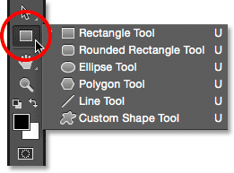
*Clicking and holding on the Rectangle Tool icon reveals the other shape tools hiding behind it.*

I'll start by selecting the first one in the list, the **Rectangle Tool**:

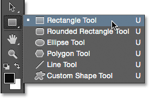
*Selecting the Rectangle Tool.*

### Shapes, Pixels Or Paths

Before we draw any shapes, we first need to tell Photoshop which *kind* of shape we want to draw. That's because Photoshop actually lets us draw three very different kinds of shapes. We can draw **vector shapes**, **paths**, or **pixel shapes**. We'll look more closely at the differences between the three in other tutorials, but as we've already learned in the [Drawing Vector vs Pixel Shapes](/basics/drawing-vector-vs-pixel-shapes-in-photoshop-cs6/) tutorial, in most cases you'll want to be drawing vector shapes. Unlike pixels, vector shapes are *flexible*, *scalable* and *resolution-independent*, which means we can draw them any size we like, edit and scale them as much as we want, and even print them at any size without any loss in quality! Whether we're viewing them on screen or in print, the edges of vector shapes always remain crisp and sharp.

To make sure you're drawing vector shapes, not paths or pixels, select **Shape** from the **Tool Mode** option in the Options Bar along the top of the screen:

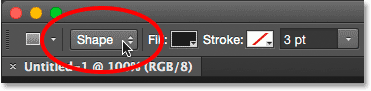
*Setting the Tool Mode option to Shape.*

### Filling The Shape With Color

The next thing we'll usually want to do is pick a color for the shape, and in Photoshop CS6, we do that by clicking on the **Fill** color swatch in the Options Bar:

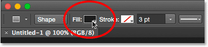
*Clicking the Fill color swatch.*

This opens a box that lets us choose from four different ways to fill the shape, each represented by one of **four icons** along the top. Starting from the left, we have the **No Color** icon (the one with the red diagonal line through it), the **Solid Color** icon, the **Gradient** icon, and the **Pattern** icon:

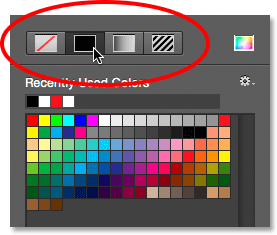
*The four options for filling the shape (No Color, Solid Color, Gradient, and Pattern).*

### No Color

As its name implies, selecting **No Color** on the left will leave the shape completely empty. Why would you want to leave a shape empty? Well, in some cases, you may want your shape to contain only a stroke outline. We'll see how to add a stroke in a few moments, but if you want your shape to contain just a stroke, with no fill color at all, select No Color:

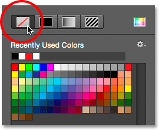
*The No Color option will leave the shape empty.*

Here's a quick example of what a shape with no fill color looks like. All we're seeing is the basic outline of the shape, known as the *path*. The path is only visible in Photoshop, so if you were to print your document or save your work in a format like JPEG or PNG, the path would not be visible. To make it visible, we'd need to add a stroke to it, which we'll be learning how to do after we've covered the Fill options:

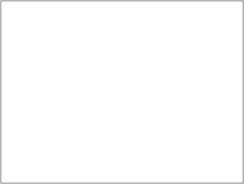
*Only the path of the shape is visible (and only in Photoshop) when Fill is set to No Color.*

### Solid Color

To fill your shape with a solid color, choose the **Solid Color** option (second from left):

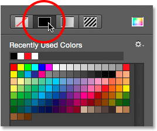
*Clicking the Solid Color fill option.*

With Solid Color selected, choose a color for the shape by clicking on one of the **color swatches**. Colors you've used recently will appear in the **Recently Used Colors** row above the main swatches:

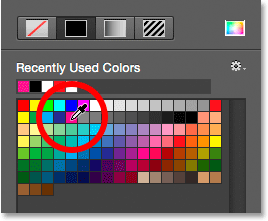
*Choosing a color by clicking on a swatch.*

If the color you need is not found in any of the swatches, click the **Color Picker** icon in the upper right of the box:

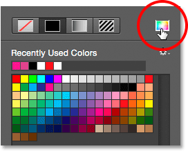
*Clicking the Color Picker icon.*

Then, choose the color you need from the Color Picker. Click OK to close out of the Color Picker when you're done:

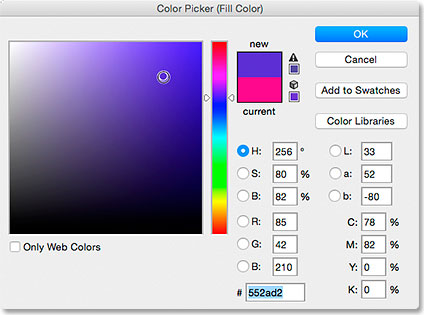
*Choosing a fill color for the shape from the Color Picker.*

Here's the same shape as before, this time filled with a solid color:

*A basic shape filled with a solid color.*

### Gradient

To fill your shape with a gradient, choose the **Gradient** option. Then, click on one of the **thumbnails** to select a preset gradient, or use the options below the thumbnails to create your own. We'll learn all about creating and editing gradients in a separate tutorial:

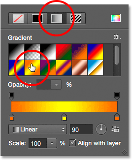
*Choosing the Gradient option at the top, then selecting a preset gradient.*

Here's the same shape filled with a gradient:

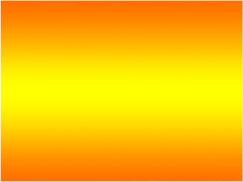
*The shape filled with one of Photoshop's preset gradients.*

### Pattern

Finally, choosing the **Pattern** option lets us fill the shape with a pattern. Click on one of the thumbnails to select a preset pattern. Photoshop doesn't give us many patterns to choose from initially, but if you've created your own or downloaded some off the internet, you can load them in by clicking on the small **gear icon** (below the Color Picker icon) and choosing **Load Patterns** from the menu:

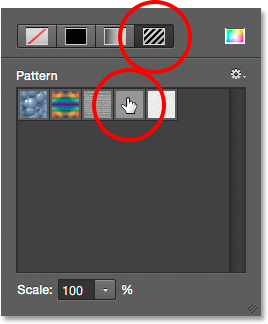
*Choosing the Pattern option, then selecting a preset pattern.*

Here's what the shape looks like filled with one of Photoshop's preset patterns. To close out of the Fill color options box when you're done, press **Enter** (Win) / **Return** (Mac) on your keyboard, or click on an empty spot in the Options Bar. If you're not sure which color, gradient or pattern you need for your shape, don't worry. As we'll see, you can always come back and change it later:

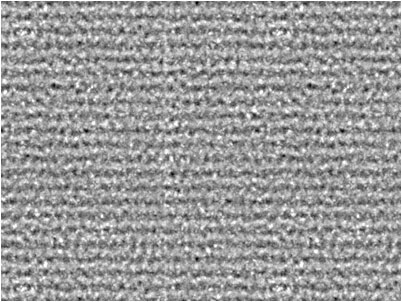
*The shape filled with a preset pattern.*

### Adding A Stroke Around The Shape

By default, Photoshop will not add a stroke around the edges of your shape, but adding one is just as easy as adding a fill color. In fact, the options for Stroke and Fill in Photoshop CS6 are exactly the same, so you already know how to use them!

To add a stroke, click on the **Stroke** color swatch in the Options Bar:

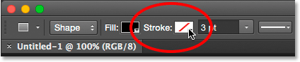
*Clicking the Stroke color swatch.*

This opens a box giving us the exact same options that we saw with the fill color, except this time we're choosing a color for our stroke. Along the top, we have the same **four icons** for choosing between **No Color**, **Solid Color**, **Gradient**, or **Pattern**. By default, the No Color option is selected. I'll choose Solid Color, then I'll set black as my stroke color by choosing it from the swatches. As with the fill color, if the color you need for your stroke is not found in the swatches, click the **Color Picker** icon in the upper right to manually choose the color you need:

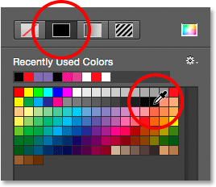
*Selecting the Solid Color option for the stroke, then choosing a color from the swatches.*

### Changing The Width Of The Stroke

To change the width of the stroke, use the **Stroke Width** option directly to the right of the Stroke color swatch in the Options Bar. By default, it's set to 3 pt. To change the width, you can either enter a specific value directly into the box (press **Enter** (Win) / **Return** (Mac) on your keyboard when you're done to accept it), or click on the small arrow to the right of the value and drag the slider:

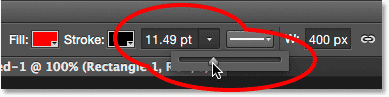
*Changing the width of the stroke.*

### The Align Edges Option

If you look further to the right in the Options Bar, you'll see an option called **Align Edges**. With this option turned on (checked), Photoshop will make sure the edges of you vector shape are aligned with the pixel grid, which keeps them looking crisp and sharp:

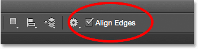
*You'll usually want to make sure Align Edges is checked.*

However, for Align Edges to work, not only does it need to be selected, but you also need to set the width of your stroke in **pixels (px)**, not **points (pt)**. Since my stroke width is currently using points (the default measurement type), I'll go back and enter a new width of 10 px:

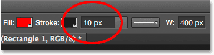
*For Align Edges to work, set your stroke width in pixels (px).*

Here's an example of a black, 10 px stroke applied to the shape:

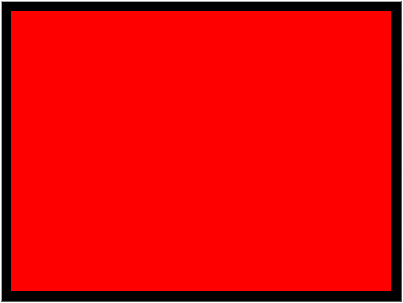
*A simple shape with a black stroke surrounding it.*

Now that I've added a stroke, if I go back and click on the **Fill** color swatch in the Options Bar and change the fill to **No Color**, I'm left with just the stroke outline. The inside of the shape is empty. It looks like it's filled with white only because the background of my document is white, so what we're actually seeing is the document's background:

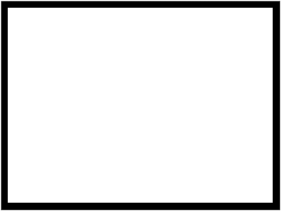
*The same shape, now with Fill set to No Color.*

### More Stroke Options

By default, Photoshop draws the stroke as a solid line, but we can change that by clicking the **Stroke Options** button in the Options Bar:

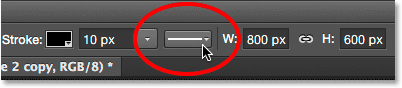
*Clicking the Stroke Options button.*

This opens the Stroke Options box. From here, we can change the stroke **type** from a **solid** line to a **dashed** or **dotted** line. The **Align** option lets us choose whether the stroke should fall **inside** the path outline, **outside** the path or be **centered** on the path. We can set the **Caps** option to **Butt**, **Round** or **Square**, and change the **Corners** to either **Miter**, **Round** or **Bevel**. Clicking the **More Options** button at the bottom will open a more detailed box where you can set specific **dash** and **gap** values, and even save your settings as a preset:

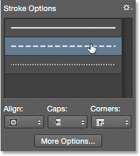
*The Stroke options.*

Here's the same stroke as before, this time as a dashed rather than a solid line:

*The stroke type changed from solid to dashed.*

### The Rectangle Tool

Now that we know how to select Photoshop's various shape tools from the Tools panel, how to choose a fill and stroke color and how to change the appearance of the stroke, let's learn how to actually draw vector shapes! We'll start with the first tool in the list, the **Rectangle Tool**. I'll select it from the Tools panel just as I did earlier:

*Selecting the Rectangle Tool.*

The Rectangle Tool lets us draw simple four-sided rectangular shapes. To draw one, start by clicking in the document to set a starting point for the shape. Then, keep your mouse button held down and drag diagonally to draw the rest of the shape. As you drag, you'll see only a thin outline (known as the *path*) of what the shape will look like:

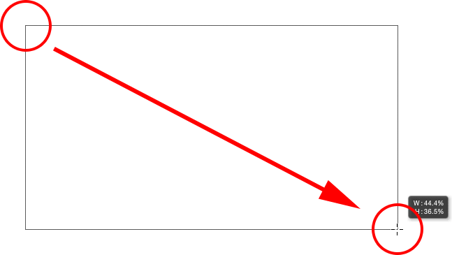
*Dragging out a rectangle shape. As you drag, only an outline of the shape appears.*

When you release your mouse button, Photoshop fills the shape with the color you selected in the Options Bar:

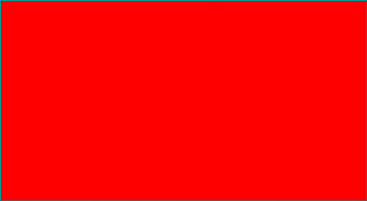
*Photoshop fills the shape with color when you release your mouse button.*

### Resizing The Shape After You've Drawn It

Once you've drawn your initial shape, its current dimensions will appear in the **Width** (**W**) and **Height** (**H**) boxes in the Options Bar. Here, we see that my shape was drawn 533 px wide and 292 px high:

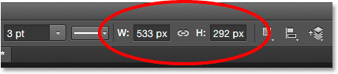
*The Options Bar showing the initial width and height of the shape.*

If you need to resize the shape after you've drawn it (and this works for all the shape tools, not just the Rectangle Tool), simply enter the dimensions you need into the Width (W) and Height (H) fields. For example, let's say what I really needed was for my shape to be exactly 500 px wide. All I need to do is change the width value to **500 px**. I could also enter a specific height if needed. If you want to change either the width or the height but keep the original aspect ratio of your shape intact, first click on the small **link icon** between the width and height values:

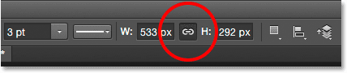
*Use the link icon to maintain the aspect ratio of the shape when resizing it.*

With the link icon selected, entering a new width or height tells Photoshop to automatically change the other one to maintain the aspect ratio. Here, I've manually entered a new width of 500 px, and because I had the link icon selected, Photoshop changed the height to 273 px:

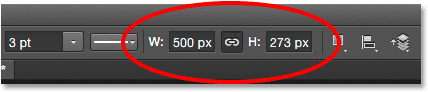
*Resizing the shape.*

### Choosing The Size Before You Draw The Shape

If you happen to know the exact width and height you need for your shape before you draw it, here's a trick. With your shape tool selected, simply click inside your document. Photoshop will pop open a dialog box where you can enter in your width and height values. Click OK to close out of the dialog box and Photoshop will automatically draw the shape for you:

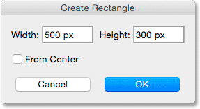
*Click once inside the document to enter a width and height, then let Photoshop draw the shape.*

### Drawing A Shape From Its Center

Here's a few simple yet very useful keyboard shortcuts. If you press and hold the **Alt** (Win) / **Option** (Mac) key on your keyboard as you're dragging out the shape, you'll draw it from its **center** rather than from the corner. This works with any of Photoshop's shape tools, not just the Rectangle Tool. It's very important, though, that you wait until *after* you've started dragging before pressing the Alt / Option key, and that you keep the key held down until *after* you've released your mouse button, otherwise it won't work:

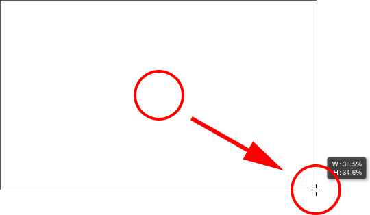
*Press and hold Alt (Win) / Option (Mac) to draw a shape from its center.*

### Drawing Squares

To draw a perfect **square** with the Rectangle Tool, click inside the document to set a starting point and begin dragging as usual. Once you've started dragging, press and hold the **Shift** key on your keyboard. This forces the rectangle into a perfect square. Again, make sure you wait until *after* you've started dragging before pressing your Shift key, and keep it held down until *after* you've released your mouse button or it won't work. You can also combine these two keyboard shortcuts together by pressing and holding **Shift+Alt** (Win) / **Shift+Option** (Mac) as you drag with the Rectangle Tool, which will force the shape into a perfect square and draw it out from the center:

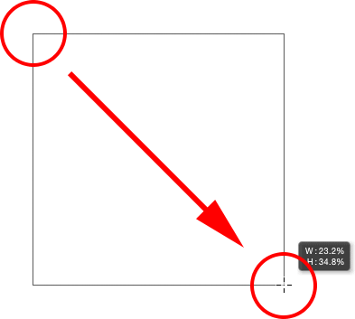
*Press and hold Shift as you drag to draw a square.*

Again, you'll see only a path outline of the square as you're dragging, but when you release your mouse button, Photoshop fills it with your chosen color:

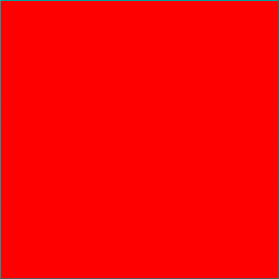
*Photoshop always waits until you release your mouse button before filling the shape with color.*

### The Shape Options

If you look up in the Options Bar, to the left of the Align Edges option, you'll see a **gear icon**. Clicking this icon opens a box with additional options for whichever shape tool you currently have selected:

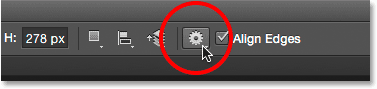
*Clicking the gear icon.*

Since I have the Rectangle Tool selected, clicking the gear icon shows me options for the Rectangle Tool. With the exception of the Polygon Tool and the Line Tool, both of which we'll look at later, you won't find yourself using this menu very often because we've already learned how to access most of these options from the keyboard. For example, the **Unconstrained** option lets us freely draw shapes at any dimensions we need, but since it's the default behavior of the shape tools, there's no need to select it. The **Square** option allows us to draw perfect squares with the Rectangle Tool, but we can already do that by pressing and holding the **Shift** key. And **From Center** will draw the shape from its center, but again, we can already do that by pressing and holding **Alt** (Win) / **Option** (Mac).

If you select either the **Fixed Size** or **Proportional** options and enter width and height values, they will affect the *next* shape you draw, not one you've already drawn. Also, you'll need to remember to come back and reselect the **Unconstrained** option when you're done, otherwise every shape you draw from that point on will be set to the same size or proportions:

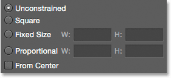
*The options you see will depend on which shape tool is selected.*

### Editing Shape Layers

Earlier, we learned that to draw vector shapes in Photoshop, we need to make sure we have the Tool Mode option in the Options Bar set to **Shapes** (as opposed to Path or Pixels). When we draw a vector shape, Photoshop automatically places it on a special type of layer known as a **Shape layer**. If we look in my **[Layers panel](/basics/layers/layers-panel/)**, we see that the shape I've drawn with the Rectangle Tool is sitting on a shape layer named "Rectangle 1". The name of the layer will change depending on which shape tool was used, so if I had drawn a shape with, say, the Ellipse Tool, it would be named "Ellipse 1":

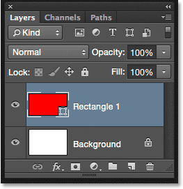
*Each new vector shape you draw appears on its own Shape layer.*

An easy way to tell the difference between a Shape layer and a normal pixel layer is that Shape layers have a small **shape icon** in the lower right corner of the **preview thumbnail**:

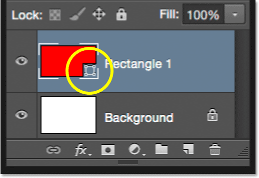
*The icon in the preview thumbnail tells us it's a Shape layer.*

The main difference between a Shape layer and a normal pixel layer is that Shape layers remain fully editable. Back when we were learning how to choose fill and stroke colors for our shapes, I mentioned that we can always come back and change the colors after we've drawn the shape. All we need to do is make sure we have the **Shape layer** selected in the Layers panel, and that we still have our **shape tool** selected from the Tools panel. Then, simply click on either the Fill or Stroke color swatch in the Options Bar to choose a different color. You can also change the stroke width if needed, along with the other stroke options. I'll click on my Fill color swatch:

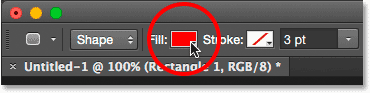
*Clicking the Fill color swatch with the Shape layer selected.*

Then I'll choose a different color for my shape from the swatches:

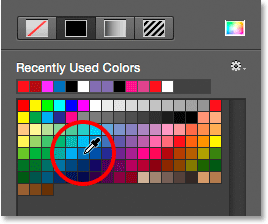
*Clicking a blue color swatch.*

As soon as I click on the swatch, Photoshop instantly updates the shape with the new color:

*The color of the shape has been changed without needing to redraw it.*

And, if we look again in the Layers panel, we see that the **preview thumbnail** for the Shape layer has also been updated with the new color:

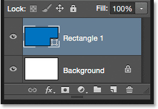
*The shape preview in the Layers panel also updates when we make changes.*

### The Rounded Rectangle Tool

Let's look at the second of Photoshop's shape tools, the **Rounded Rectangle Tool**. I'll select it from the Tools panel:

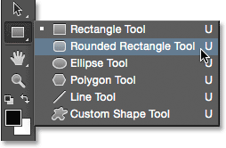
*Selecting the Rounded Rectangle Tool.*

The Rounded Rectangle Tool is very similar to the standard Rectangle Tool except that it lets us draw rectangles with rounded corners. We control the roundness of the corners using the **Radius** option in the Options Bar. The higher the value, the more rounded the corners will appear. You need to set the Radius value *before* drawing your shape, so I'll set mine to 50 px:

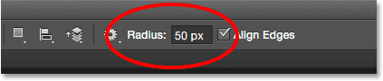
*Use the Radius option to control the roundness of the corners.*

Once you've set your radius, drawing a rounded rectangle is exactly the same as drawing a normal rectangle. Start by clicking inside the document to set a starting point for the shape, then keep your mouse button held down and drag diagonally to draw the rest of it. Just as we saw with the Rectangle Tool, Photoshop will display only the path outline of the shape as you're dragging:

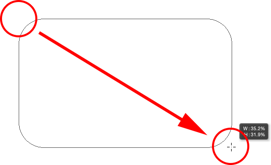
*Dragging out a rounded rectangle after setting the Radius value in the Options Bar.*

When you release your mouse button, Photoshop completes the shape and fills it with color:

*The shape is filled with color when you release your mouse button.*

Here's another example of a rounded rectangle, this time with my Radius value set to 150 px, large enough (in this case anyway) to make the entire left and right sides of the rectangle appear curved:

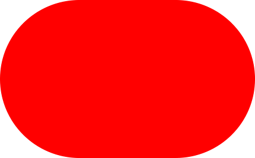
*A higher Radius value produces more rounded corners.*

And here's a rectangle but with a much lower Radius value of only 10 px, giving me very small rounded corners:

*A smaller Radius value gives us less rounded corners.*

Unfortunately, in Photoshop CS6, there's no way to preview how rounded the corners will appear with our chosen Radius value before we actually draw the rectangle. Also, we can't adjust the Radius value on the fly while we're drawing the shape, and Photoshop doesn't let us go back and make changes to the Radius value after it's been drawn. All of this means that drawing rounded rectangles is very much a "trial and error" situation.

If you draw a rounded rectangle and decide you're not happy with the roundness of the corners, all you can really do is go up to the **Edit** menu in the Menu Bar along the top of the screen and choose **Undo Rounded Rectangle Tool** (or press **Ctrl+Z** (Win) / **Command+Z** (Mac) on your keyboard) which will remove the rounded rectangle from the document. Then, enter a different Radius value into the Options Bar and try again:

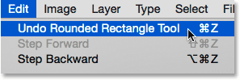
*Going to Edit > Undo Rounded Rectangle Tool.*

The same keyboard shortcuts that we learned about for the standard Rectangle Tool also apply to the Rounded Rectangle Tool. To force the shape into a **perfect square** (with rounded corners), begin dragging out the shape, then press and hold your **Shift** key. Release the Shift key only *after* you've released your mouse button.

To draw a rounded rectangle from its **center** rather than from the corner, begin dragging out the shape, then press and hold your **Alt** (Win) / **Option** (Mac) key. Finally, pressing and holding **Shift+Alt** (Win) / **Shift+Option** (Mac) will force the shape into a perfect square and draw it out from the center. Release the keys only *after* you've released your mouse button.

### The Ellipse Tool

Photoshop's **Ellipse Tool** lets us draw elliptical or circular shapes. I'll select it from the Tools panel:

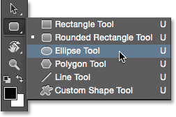
*Selecting the Ellipse Tool.*

Just as with the other shape tools we've looked at, to draw an elliptical shape, click inside the document to set a starting point, then keep your mouse button held down and drag diagonally to draw the rest of it:

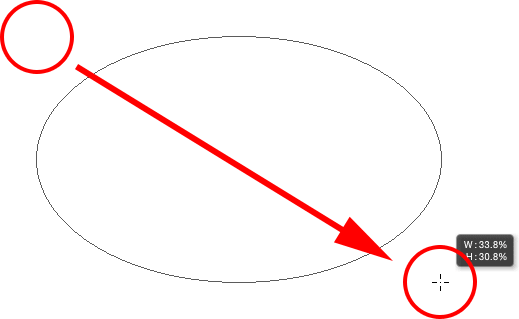
*Drawing an elliptical shape with the Ellipse Tool.*

Release your mouse button to complete the shape and have Photoshop fill it with your chosen color:

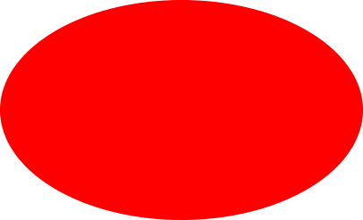
*The color-filled shape.*

To draw a perfect **circle** with the Ellipse Tool, begin dragging out the shape, then press and hold your **Shift** key. To draw an elliptical shape out from its **center**, press and hold **Alt** (Win) / **Option** (Mac) after you start dragging. Pressing and holding **Shift+Alt** (Win) / **Shift+Option** (Mac) will draw a perfect circle out from its center. As always, release the keys only *after* you've released your mouse button:

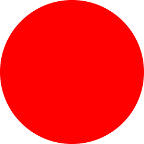
*A circle drawn with the Ellipse Tool.*

### The Polygon Tool

The **Polygon Tool** is where things start to get interesting. I'll select it from the Tools panel:

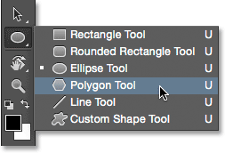
*Selecting the Polygon Tool.*

While Photoshop's Rectangle Tool is limited to drawing four-sided polygons, the Polygon Tool lets us draw polygonal shapes with as many sides as we like! It even lets us draw stars, as we'll see in a moment. To draw a shape with the Polygon Tool, first enter the number of sides you need into the **Sides** option in the Options Bar. You can enter any number from 3 to 100. I'll leave mine set to the default value of 5 for now:

*Enter the number of sides you need into the Sides option.*

Once you've entered the number of sides, click in the document and drag out your shape. Photoshop always draws polygon shapes out from their center so there's no need to hold down your Alt (Win) / Option (Mac) key. Holding your **Shift** key down after you start dragging will limit the number of angles at which the shape can be drawn, which can help position the shape the way you need it:

*A 5-sided shape drawn with the Polygon Tool.*

Setting the Sides option to 3 in the Options Bar gives us an easy way to draw a triangle:

*A simple triangle drawn with the Polygon Tool.*

And here's a polygon shape with Sides set to 12. Like the Radius option for the Rounded Rectangle Tool, Photoshop does not let us change the number of sides once we've drawn our shape, so if you made a mistake, you'll need to go up to the **Edit** menu at the top of the screen and choose **Undo Polygon Tool** (or press **Ctrl+Z** (Win) / **Command+Z** (Mac)), then enter a different value into the Sides option and redraw the shape:

*A twelve-sided polygon shape.*

### Drawing Stars With The Polygon Tool

To draw stars with the Polygon Tool, click on the **gear icon** in the Options Bar, then select **Star**:

*Clicking the gear icon and choosing Star.*

Then, just click inside the document and drag out a star shape. With Star selected, the Sides option in the Options Bar controls the number of points in the star, so at its default value of 5, we get a 5-pointed star:

*A 5-pointed star drawn with the Polygon Tool.*

Changing the Sides value to 8 gives us an 8-pointed star:

*Control the number of points with the Sides option.*

We can create a starburst shape by increasing the **Indent Sides By** option beyond its default value of 50%. I'll increase it to 90%. I'll also increase my Sides value to 16:

*Creating a starburst by increasing the Indent Sides By value.*

And here's the result:

*A starburst drawn with the Polygon Tool.*

By default, stars have sharp corners on the ends of their points, but we can make them rounded by choosing the **Smooth Corners** option:

*Turning on Smooth Corners.*

Here's a standard 5-pointed star with the Smooth Corners option enabled:

*The Smooth Corners option gives stars a fun, friendly look to them.*

We can smooth the indents as well and make them rounded by selecting the **Smooth Indents** option:

*Turning on Smooth Indents.*

With both Smooth Corners and Smooth Indents selected, we get more of a starfish shape:

*A star with Smooth Corners and Smooth Indents turned on.*

### The Line Tool

The last of Photoshop's basic geometric shape tools is the **Line Tool**. I'll select it from the Tools panel:

*Selecting the Line Tool.*

The Line Tool allows us to draw simple straight lines, but we can also use it to draw arrows. To draw a straight line, first, set the thickness of the line by entering a value, in pixels, into the **Weight** field in the Options Bar. The default value is 1 px. I'll increase it to 16 px:

*The Weight option controls the thickness, or width, of the line.*

Then, as with the other shape tools, click inside the document and drag out your line. To make it easier to draw a horizontal or vertical line, hold down your **Shift** key after you start dragging, then release the Shift key after you release your mouse button:

*Hold Shift as you drag to draw horizontal or vertical lines.*

### Drawing Direction Arrows

To draw arrows, click on the **gear icon** in the Options Bar to open the **Arrowheads** options. Choose whether you want the arrowhead to appear at the **start** of the line, the **end**, or both (if you want the arrow to face the same direction in which the line is being drawn, choose End):

*Click the gear icon to access the Arrowhead options.*

Here's a line similar to the one drawn previously, this time with an arrowhead on the end:

*The Line Tool makes it easy to draw direction arrows.*

If the default size of the arrowhead doesn't work for you, you can adjust it by changing the **Width** and **Length** options. You can also make the arrowhead appear more concave by increasing the **Concavity** option. I'll increase it from its default value of 0% to 50%:

*Change the shape of the arrowhead by increasing its concavity.*

Here's what the arrowhead now looks like. Make sure you change the Line Tool options before you draw your shape since they can't be adjusted afterwards (if you need to make changes, you'll need to undo the shape and start over):

*An arrowhead with a Concavity value to 50%.*

### Hiding The Path Outline Around The Shape

As we've seen throughout this tutorial, whenever we draw a shape using any of the shape tools, Photoshop displays only the **path outline** while the shape is being drawn. When we release our mouse button, that's when Photoshop completes the shape and fills it with color. Problem is, if you look closely after drawing the shape, you'll see that the path outline is still there surrounding it. Here, we can see the thin black outline surrounding the shape. This isn't a big deal because the outline will not print or appear in any saved file format like JPEG or PNG, but it can still be annoying to look at while you're working.

*The path outline is still visible even after the shape is drawn.*

To hide the path outline in Photoshop CS6, simply press **Enter** (Win) / **Return** (Mac) on your keyboard and it disappears:

*Press Enter (Win) / Return (Mac) and the outline is gone.*