# How To Edit Smart Objects In Photoshop

> Source: [https://www.photoshopessentials.com/basics/how-to-edit-and-replace-smart-object-contents-in-photoshop/](https://www.photoshopessentials.com/basics/how-to-edit-and-replace-smart-object-contents-in-photoshop/)
> Downloaded and converted to Markdown.

Learn how to edit a smart object in Photoshop, and how to easily replace its contents so you can use smart objects as reusable templates!

Two powerful advantages of using smart objects in Photoshop are that we can edit their contents, and we can even replace their contents, and have our changes instantly appear in the document. Editing the contents is great for when you want to keep the same image inside the smart object and just change its appearance. But we can also replace the contents with a completely new image, making smart objects perfect for creating reusable templates! Let's see how it works.

I'll be using [Photoshop CC](https://prf.hn/l/dlXjD2w) but everything is fully compatible with Photoshop CS6.

If you're not yet familiar with smart objects in Photoshop, you'll want to read through the [first tutorial](/basics/how-to-create-smart-objects-in-photoshop/) in this series where I cover what smart objects are and how to create them. And with that, let's get started!

## What we'll be learning

To help us learn about editing and replacing a smart object's contents, we're going to convert an image into a smart object and then place it inside a frame. Once it's in the frame, we'll learn how to edit the image inside the smart object, and then how to replace it with a different image.

Here's the [first image](https://prf.hn/l/dlXjNY5) I have open in my document. I downloaded all of the images for this tutorial from Adobe Stock. This is the frame that I'll be placing the other image into:

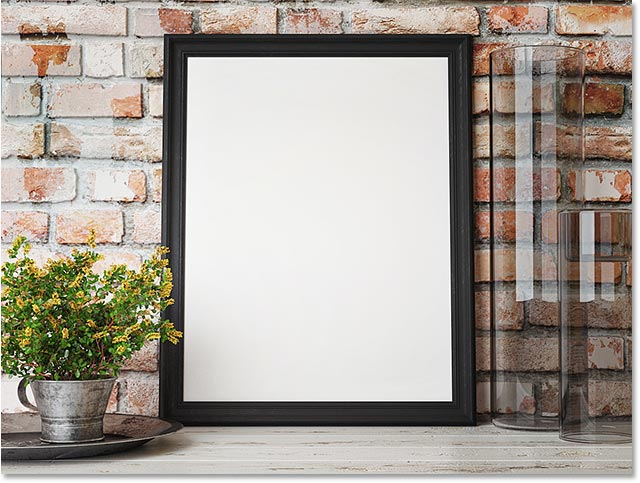

*The first image. Photo credit: Adobe Stock.*

If we look in the [Layers panel](/basics/layers/layers-panel/), we see that I also have a second image sitting on a layer above it. I'll turn the second image on by clicking the top layer's **visibility icon**:

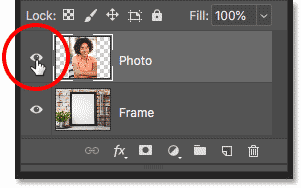

*Turning on the second image in the document.*

And now we see the [second image](https://prf.hn/l/ZYkOEGX). I'll convert this image into a smart object and then place it inside the frame:

*The second image. Photo credit: Adobe Stock.*

## Placing the image in the frame

### Selecting the frame

To place the image into the frame, we first need to select the area *inside* the frame. I'll turn the top image off so we can see the frame by once again clicking the layer's visibility icon:

*Turning the top image off.*

Then, I'll choose Photoshop's **Polygonal Lasso Tool** from the Toolbar. By default, the Polygonal Lasso Tool is nested behind the standard Lasso Tool, so I'll **right-click** (Win) / **Control-click** (Mac) on the Lasso Tool and choose the Polygonal Lasso Tool from the fly-out menu:

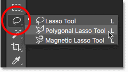

*Selecting the Polygonal Lasso Tool from the Toolbar.*

To select the area inside the frame, all we need to do is click with the [Polygonal Lasso Tool](/basics/selections/polygonal-lasso-tool/) in each of the four corners, starting in the upper left, then the upper right, down to the bottom right, and then in the bottom left. To complete the selection, click again on the starting point in the upper left corner. A selection outline now appears around the inside of the frame:

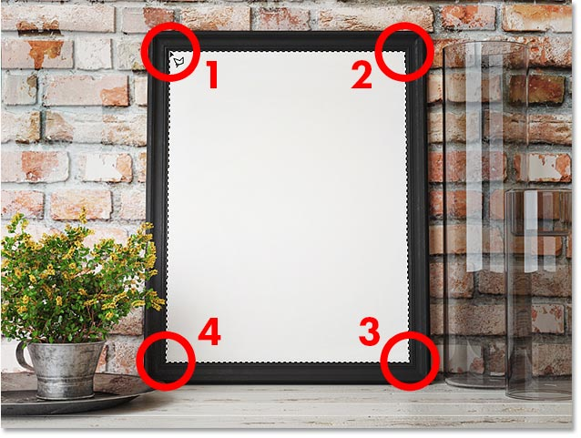

*Clicking in each corner with the Polygonal Lasso Tool to select the frame.*

With the frame selected, I'll turn the top image back on:

*Turning the top image back on in the document.*

And the same selection outline now appears in front of the second image. In a moment, we're going to place the top image into the selection using a layer mask. But before we do, we first need to convert the layer into a smart object:

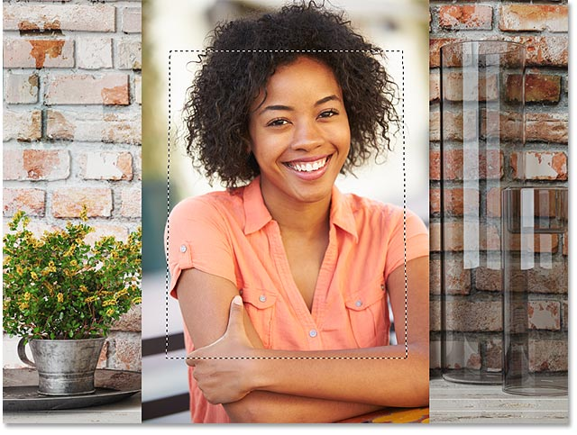

*The top image will be placed into the selection of the frame.*

### Converting the layer into a smart object

To convert the top layer into a smart object, **right-click** (Win) / **Control-click** (Mac) directly on the layer in the Layers panel:

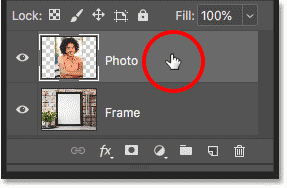

*Right-click (Win) / Control-click (Mac) on the top layer.*

Then choose **Convert to Smart Object** from the menu:

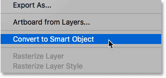

*Choosing "Convert to Smart Object".*

A **smart object icon** appears in the layer's preview thumbnail, telling us that the layer is now a smart object:

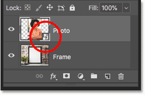

*The smart object icon.*

[Related: How to create smart objects in Photoshop](/basics/how-to-create-smart-objects-in-photoshop/)

### Adding a layer mask

To place the smart object into the selection, we'll use a [layer mask](/basics/understanding-photoshop-layer-masks/). Click the **Add Layer Mask** icon at the bottom of the Layers panel:

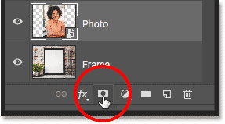

*Adding a layer mask.*

Photoshop converts the selection into a layer mask, and now the image appears inside the frame:

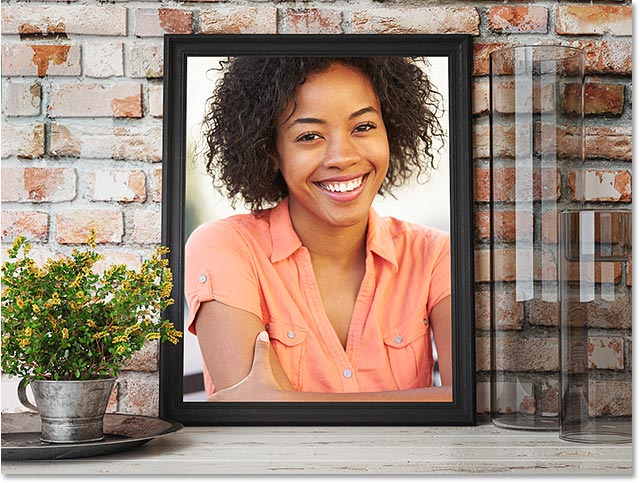

*The result after adding the layer mask.*

And in the Layers panel, we see the new **layer mask thumbnail** beside the preview thumbnail. The reason we converted the layer into a smart object *before* adding the layer mask was to keep the smart object and the mask separate from each other. If we had added the mask and *then* converted the layer to a smart object, the mask would have become part of the smart object. We need to keep them separate, so we converted the layer to a smart object first and then added the mask:

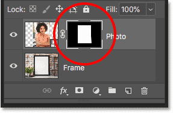

*The layer mask thumbnail.*

### Resizing the smart object inside the frame

The reason we need to keep them separate is so we can resize and reposition the smart object within the mask, or within the frame. To do that, click the **link icon** between the smart object's preview thumbnail and the layer mask thumbnail. This unlinks the smart object from its mask so we can resize and reposition the smart object without affecting the size or position of the mask itself:

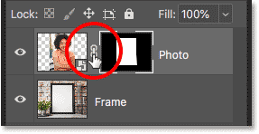

*Unlinking the smart object from its layer mask.*

Click the smart object's **preview thumbnail** to select the smart object:

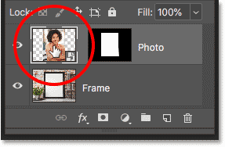

*Selecting the smart object.*

Then go up to the **Edit** menu in the Menu Bar and choose **Free Transform**:

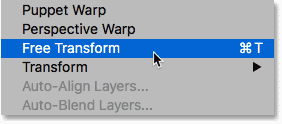

*Going to Edit > Free Transform.*

To resize the image within the frame, press and hold the **Shift** key on your keyboard, and then click and drag any of the **corner handles**. The Shift key locks the aspect ratio of the image as you drag so you don't distort the original shape. If you need to move the image inside the frame, click anywhere inside the Free Transform box and drag the image into place:

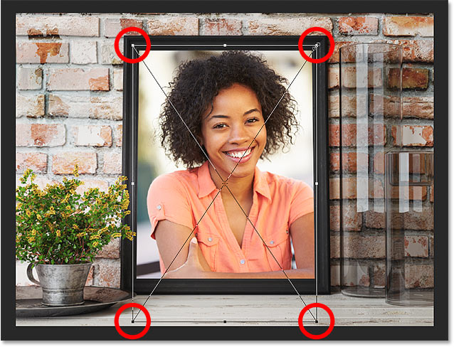

*Resizing and repositioning the image inside the frame.*

When you're done, press **Enter** (Win) / **Return** (Mac) on your keyboard to accept it:

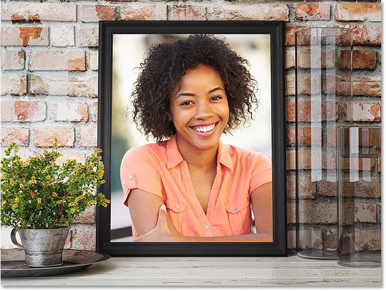

*The image now fits nicely within the frame.*

## How to edit the contents of a smart object

Now that we've placed the image into the frame as a smart object, let's learn how to edit the smart object's contents. Think of a smart object as a Photoshop document *within* your Photoshop document. And pretty much anything that we can do in the main document, we can do in a smart object.

To open a smart object and edit its contents, make sure your smart object is selected in the Layers panel. Then go up to the **Layer** menu in the Menu Bar, choose **Smart Objects**, and then choose **Edit Contents**:

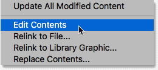

*Going to Layer > Smart Objects > Edit Contents.*

Or, a faster way to open a smart object is to simply double-click on its **thumbnail** in the Layers panel:

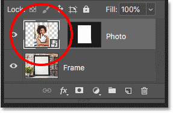

*Double-clicking on the smart object thumbnail.*

### The smart object document

The smart object opens in its own separate document:

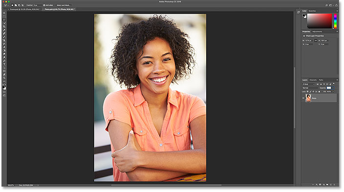

*The contents of the smart object open in a separate document.*

If we look in the document **tabs** along the top, we see that the name of my smart object's document is "Photo.psb". Smart objects use a special type of document known as a **PSB** file, which stands for "Photoshop Big". The name of the document (in this case, "Photo") is based on the name of your layer *before* you converted it to a smart object, which is why it's a good idea to rename your layers before converting them:

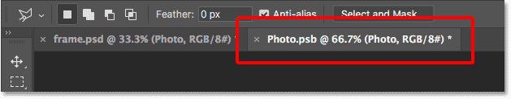

*Smart objects open as PSB (Photoshop Big) files.*

### Editing the contents

Since smart objects are actual Photoshop documents, there's really no limit to what we can do with them. All of Photoshop's tools, commands, filters, and other features, like layers and adjustment layers, are available to us for editing a smart object's contents. For this tutorial, we'll keep things simple and look at a few quick examples.

Let's say I want to flip the image inside the frame so that the woman is facing the opposite direction. I can do that by flipping the image in my smart object. I'll go up to the **Edit** menu, then I'll choose **Transform**, and then **Flip Horizontal**:

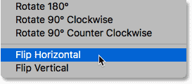

*Going to Edit > Transform > Flip Horizontal.*

This flips the image horizontally:

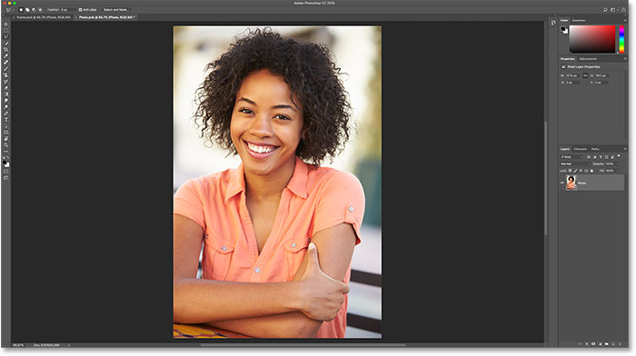

*The image in the smart object is now flipped.*

### Saving the changes

To have our changes appear in the main document, we need to save and close the smart object's document. To save it, go up to the **File** menu and choose **Save**:

*Going to File > Save.*

Then to close the smart object, go back up to the **File** menu and choose **Close**:

*Going to File > Close.*

Back in the main document, the smart object in the frame updates to show the flipped version of the image inside it:

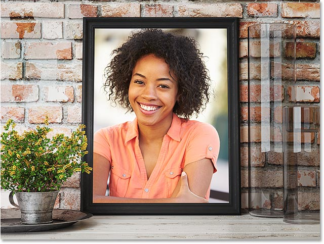

*The result after flipping the contents of the smart object.*

### Editing a smart object non-destructively

Just like when editing a normal Photoshop document, it's best to edit a smart object non-destructively and avoid making any permanent changes. One of the easiest ways to do that is by taking advantage of **adjustment layers**. I'll reopen my smart object by double-clicking on is thumbnail in the Layers panel:

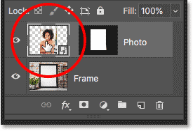

*Reopening the smart object's document.*

The contents reopen in the same "Photo.psb" document, and with the change that I made previously:

*The contents reopen with my previous edit.*

I'll flip the image back to the way it was originally by once again going up to the **Edit** menu, choosing **Transform**, and then choosing **Flip Horizontal**:

*Going back to Edit > Transform > Flip Horizontal.*

This flips the image back to its original direction:

*The image is back to its original orientation.*

#### Using a Black & White adjustment layer

Let's say I want to convert the image from color to black and white. Since smart objects are Photoshop documents, we can use adjustment layers inside them just like we can in a normal document. To convert the image to black and white, I'll click on the **New Fill or Adjustment Layer** icon at the bottom of the Layers panel:

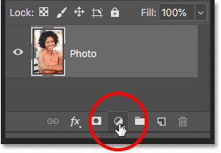

*Clicking the New Fill or Adjustment Layer icon.*

And then I'll choose **Black & White** from the list:

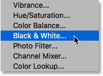

*Adding a Black & White adjustment layer.*

A Black & White adjustment layer appears above the photo:

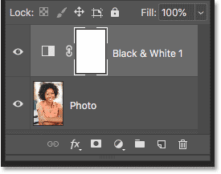

*The Layers panel showing the adjustment layer.*

And in the document. we see the image now in [black and white](/photo-editing/converting-color-photos-to-black-and-white-in-photoshop/). You can customize the black and white conversion using the sliders in the **Properties panel**, but for our purposes, I'll stick with the default settings:

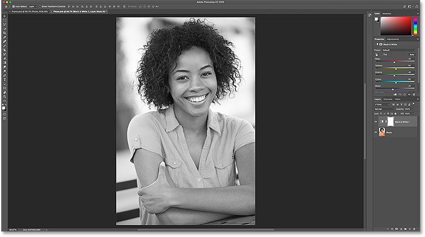

*The image in the smart object has been converted to black and white.*

To save my changes, I'll go up to the **File** menu and choose **Save**. And then to close the smart object, I'll go back up to the **File** menu and choose **Close**. And back in the main document, we see that the smart object in the frame has once again updated, this time showing my black and white version of the image:

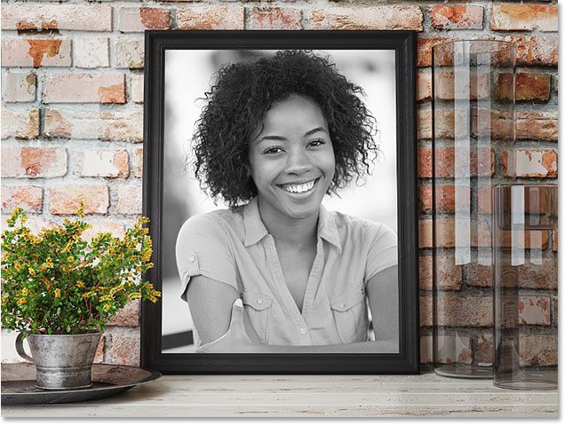

*The image in the frame now appears in black and white.*

#### Using a Photo Filter adjustment layer

What if, instead of converting it to black and white, I just want to adjust the colors in the image to cool it down a bit? For that, we can use a Photo Filter adjustment layer. I'll once again reopen my smart object by double-clicking on its thumbnail:

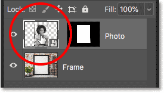

*Reopening the smart object.*

And then in the smart object's document, I'll delete my Black & White adjustment layer by dragging it down onto the **Trash Bin** at the bottom of the Layers panel:

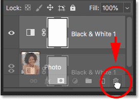

*Deleting the Black & White adjustment layer.*

Since adjustment layers are non-destructive, deleting the adjustment layer instantly restores the original colors in the image:

*Deleting the adjustment layer restored the colors.*

To add a Photo Filter adjustment layer, I'll again click the **New Fill or Adjustment Layer** icon:

*Clicking the New Fill or Adjustment Layer icon.*

And this time, I'll choose **Photo Filter** from the list:

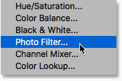

*Adding a Photo Filter adjustment layer.*

The new adjustment layer appears above the image:

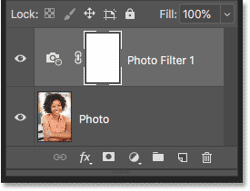

*A Photo Filter adjustment layer is added in the smart object.*

In the **Properties panel**, I'll choose one of the cooling filters from the **Filter** menu:

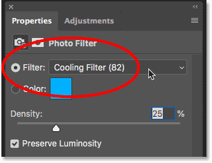

*Choosing a cooling filter in the Properties panel.*

This cools down the image by adding more blue:

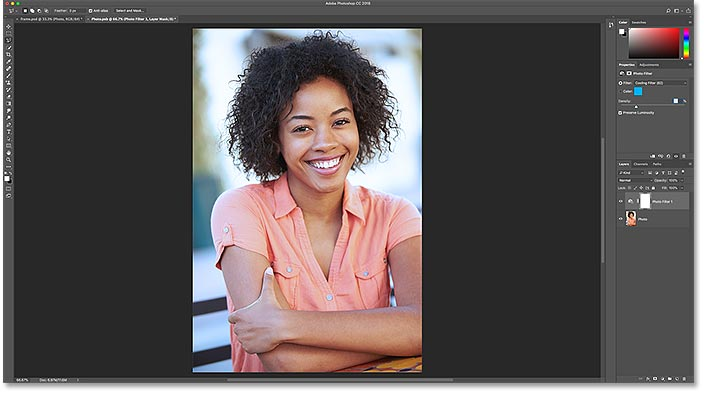

*The effect of the Photo Filter adjustment.*

I'll save my changes by going up to the **File** menu and choosing **Save**. Then I'll close the smart object by going up to the **File** menu and choosing **Close**. Back in the main document, the image in the frame now appears with the Photo Filter applied. And that's how to edit the contents of a smart object:

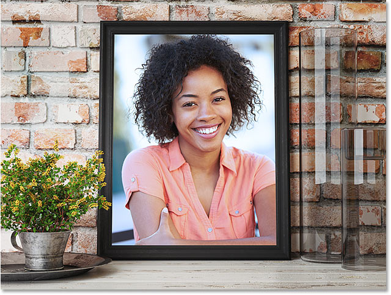

*The smart object once again updates with the new changes.*

## How to replace the contents of a smart object

Now that we know how to edit the contents, let's learn how to replace the contents of a smart object. Replacing the contents means we can use smart objects as templates for different layouts or effects. We already have our smart object in the frame, so let's see how to replace the image inside the smart object with a different image.

First, make sure you have your smart object selected in the Layers panel. There's no need to open it. We just need to select it:

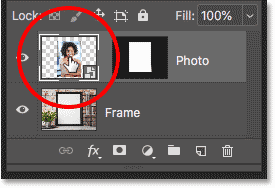

*Selecting the smart object.*

To replace its contents, go up to the **Layer** menu, choose **Smart Objects**, and then choose **Replace Contents**:

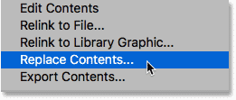

*Going to Layer > Smart Objects > Replace Contents.*

Navigate to the image that you want to replace the contents with. Click on it to select it, and then click **Place**:

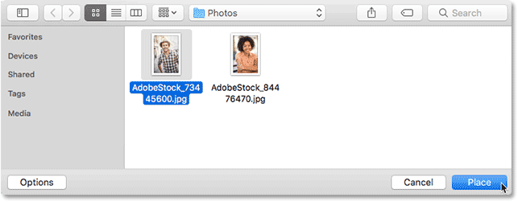

*Selecting the new image to place in the smart object.*

And instantly, the original image in the smart object is replaced with the [new image](https://prf.hn/l/yOJG1aO). The only problem is that the new image is too big to fit in the frame, so we'll fix that next:

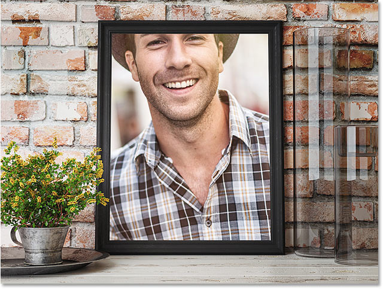

*The previous image has been replaced with the new image. Photo credit: Adobe Stock.*

### Resizing the contents

To resize the new image, I'll do the same thing I did with my previous image by going up to the **Edit** menu and choosing **Free Transform**:

*Going to Edit > Free Transform.*

Then, I'll press and hold my **Shift** key as I drag the corner handles to fit the new image into the frame. Again, the Shift key locks the aspect ratio of the image in place:

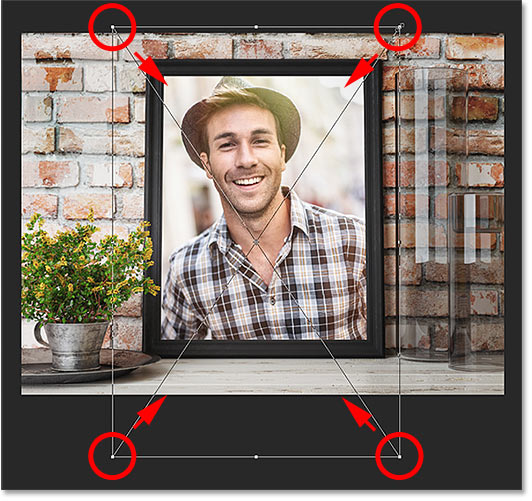

*Resizing the new image after replacing the smart object's contents.*

To accept it, I'll press **Enter** (Win) / **Return** (Mac) on my keyboard. And now, after replacing the contents of the smart object, my new image fits perfectly in the frame:

*The result after replacing and resizing the smart object's contents.*

And there we have it! That's how to edit and replace the contents of a smart object in Photoshop! For more on smart objects, learn how to [open and place images](/basics/how-to-create-smart-objects-in-photoshop/) as smart objects, how to [scale and resize images without losing quality](/basics/scale-resize-images-smart-objects-photoshop/), how to use editable [smart filters](/basics/how-to-use-smart-filters-in-photoshop/), or how smart objects make it easy to [transform and distort type](/basics/transform-type-smart-objects/)! You'll also find many more tutorials in our [Photoshop Basics](/basics/) section.