# How to Keep An Image Centered After Cropping in Photoshop

> Source: [https://www.photoshopessentials.com/basics/how-to-keep-images-centered-after-cropping/](https://www.photoshopessentials.com/basics/how-to-keep-images-centered-after-cropping/)
> Downloaded and converted to Markdown.

Does Photoshop throw your images off-center after you crop them? This quick tutorial shows you why it happens and how easy it is to fix! For Photoshop 2022 or any recent version.

Is Photoshop not keeping your image centered after you crop it? Is the cropped image snapping into the corner instead of staying centered on the screen? In this tutorial, I show you when it happens, why it happens and how to fix it!

I'm using Photoshop 2022 but this fix applies to any recent version. You can [get the latest Photoshop version here](https://adobe.prf.hn/click/camref:1100lrdjJ/destination:https%3A%2F%2Fwww.adobe.com%2Fproducts%2Fphotoshop.html).

And I'll use [this image](https://adobe.prf.hn/click/camref:1100lrdjJ/destination:https%3A%2F%2Fstock.adobe.com%2Fimages%2Fyoung-indian-man-wearing-red-elegant-shirt-standing-over-isolated-grey-background-with-hands-together-and-crossed-fingers-smiling-relaxed-and-cheerful-success-and-optimistic%2F297245133) from Adobe Stock.

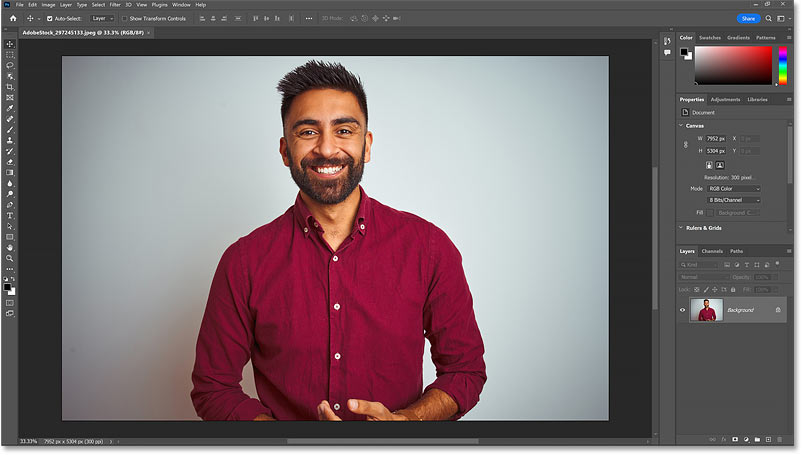
*An image waiting to be cropped.*

Let's get started!

## The problem: Photoshop not centering images after cropping

First, let’s quickly look at the problem and when you’ll encounter it. There are a few ways to crop an image in Photoshop, and depending on which way you choose, you may not run into this problem. But here are three examples of when you definitely will.

### Example 1: Cropping with the Rectangular Marquee Tool

The official way to crop an image in Photoshop is with the [Crop Tool](/basics/how-to-crop-images-photoshop-cc/) which we’ll come back to in a moment. But many people find it easier to crop images with the [Rectangular Marquee Tool](/basics/photoshop-selection-basics-the-rectangular-and-elliptical-marquee-tools/). 

So I’ll select the Rectangular Marquee Tool from the [toolbar](https://www.photoshopessentials.com/basics/photoshop-tools-toolbar-overview/).

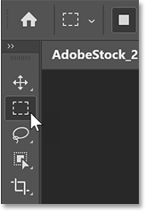
*Selecting the Rectangular Marquee Tool.*

Then I’ll drag out a selection outline around the part of the image I want to keep.

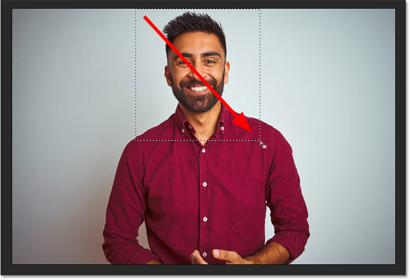
*Drawing a rectangular selection outline.*

To crop the image, I’ll go up to the **Image** menu in the Menu Bar and choose **Crop**.

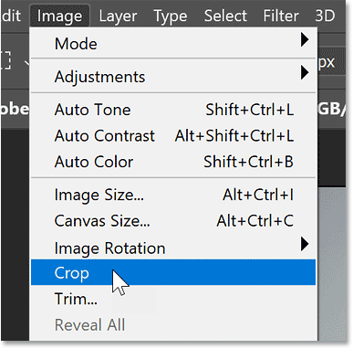
*Going to Image > Crop.*

But instead of centering the cropped image, Photoshop snaps it into the upper left of the screen. To recenter it, I would need to drag the image back into the center manually with the Hand Tool.

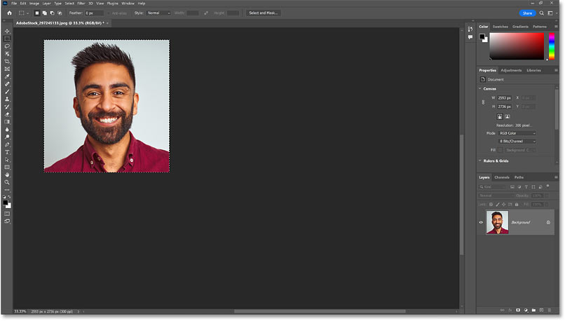
*The image is not centered after cropping with the Rectangular Marquee Tool.*

### Example 2: Cropping with the Crop Tool in Classic Mode

The same thing happens when cropping images with the Crop Tool *if* you use the Crop Tool in Classic Mode.

I’ll select the [Crop Tool](/basics/photoshop-crop-tool-tips-and-tricks/) from the toolbar.

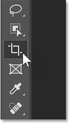
*Selecting the Crop Tool.*

Then in the Options Bar, I’ll click the **gear icon** and I’ll turn on **Use Classic Mode**.

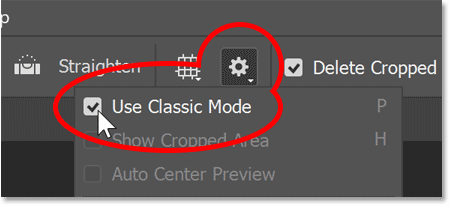
*Turning on Classic Mode for the Crop Tool.*

I’ll drag a cropping border around part of the image.

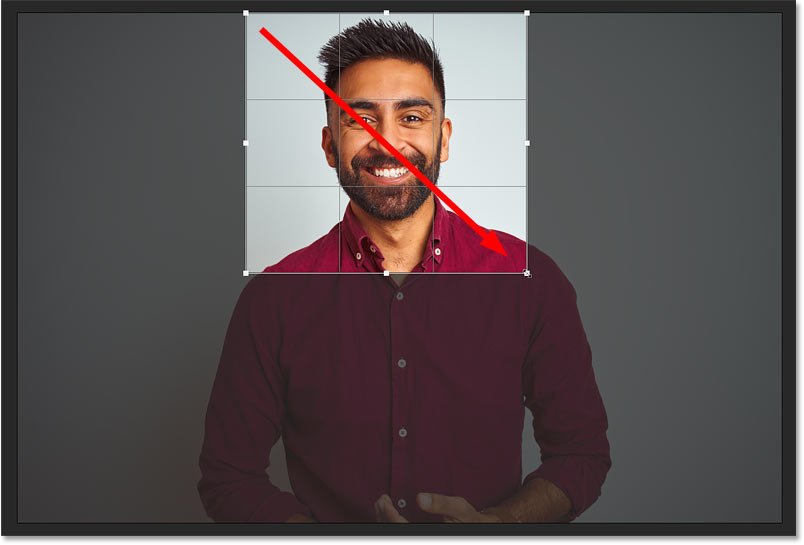
*Dragging out a crop border.*

Then to crop it, I’ll click the checkmark in the Options Bar.

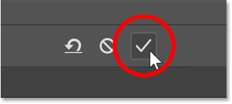
*Clicking the checkmark.*

And again, Photoshop throws the cropped image into the upper left of the screen.

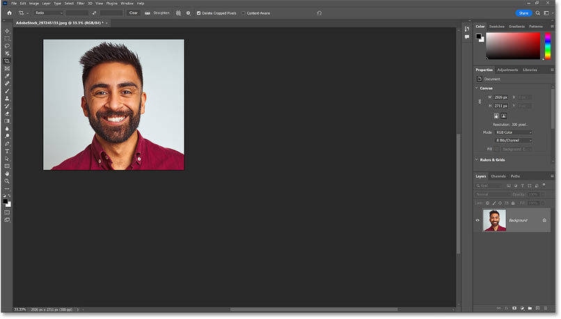
*The image is off-center after cropping with the Crop Tool's Classic Mode.*

### Example 3: Undoing a crop after cropping with the Crop Tool

Even if the Crop Tool is not in Classic Mode, which is turned off by default, you’ll still run into the problem if you undo your crop.

I’ll keep the Crop Tool selected but in the Options Bar, I’ll turn Classic Mode off.

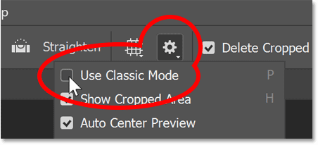
*Turning off Classic Mode for the Crop Tool.*

Then I’ll crop the image with the Crop Tool. And with Classic Mode turned off, the cropped image is centered as expected.

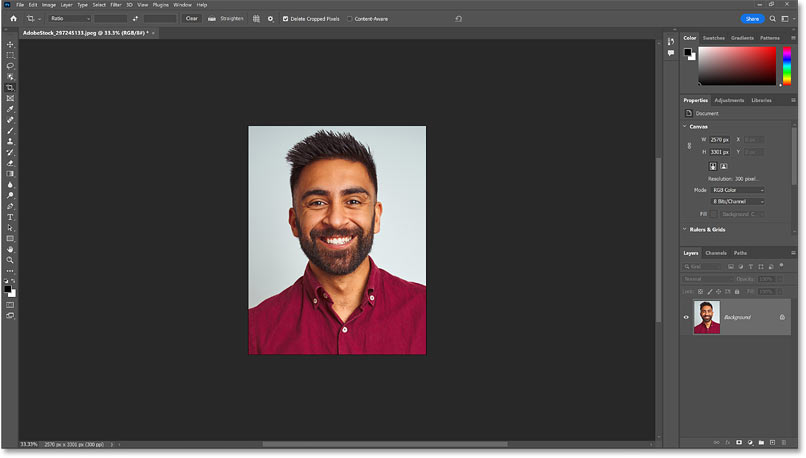
*The image is centered after cropping with the Crop Tool.*

But if you change your mind and undo the crop by going up to the **Edit** menu and choosing **Undo Crop**:

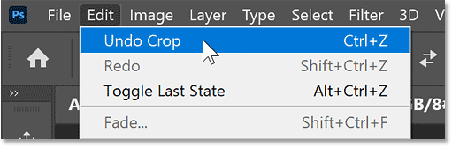
*Going to Edit > Undo Crop.*

Photoshop restores the original image but still throws it off-center.

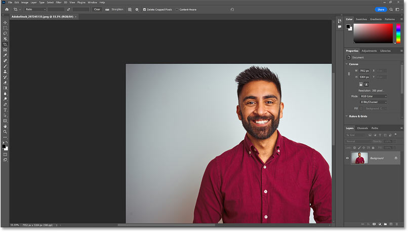
*The image is no longer centered after undoing the crop.*

## The reason images are not centered after cropping

So why, in these examples, did Photoshop not center the image after cropping it? The reason is because of a feature called **Overscroll**.

Overscroll lets you scroll an image around on your screen even when you are already zoomed out far enough to view the entire image. The idea is that you may still find it easier to inspect different areas, or to work on an area that’s in a corner or along the side, if you can drag that part of the image into the center of your screen.

I cover Overscroll in more detail in my complete [How to Zoom Images in Photoshop](/basics/photoshop-zoom/) tutorial.

## The solution: Turn Overscroll off

Overscroll is turned on by default. But if it’s not a feature you care about, you can fix the problem of Photoshop not centering images after cropping them by turning Overscroll off. And here’s how to do it.

On a Windows PC (which is what I’m using), go up to the **Edit** menu. On a Mac, go up to the **Photoshop** menu.

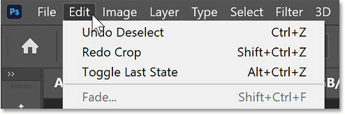
*Go to Edit (Win) / Photoshop (Mac).*

From there, choose **Preferences** and then **Tools**.

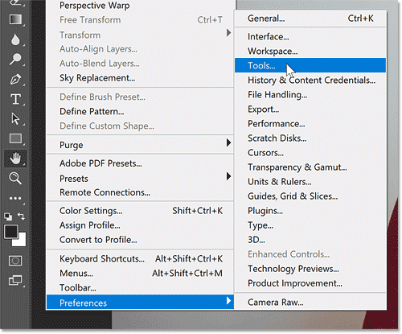
*Going to Preferences > Tools.*

In the Preferences dialog box, look for the **Overscroll** option and uncheck it to turn it off. Then click OK to accept it and close the dialog box.

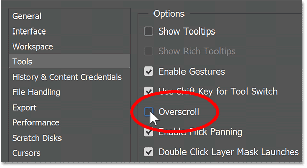
*Unchecking the Overscroll option.*

That’s all there is to it! The next time you crop an image, either with the Rectangular Marquee Tool or with the Crop Tool set to Classic Mode, the cropped image will remain centered on your screen.

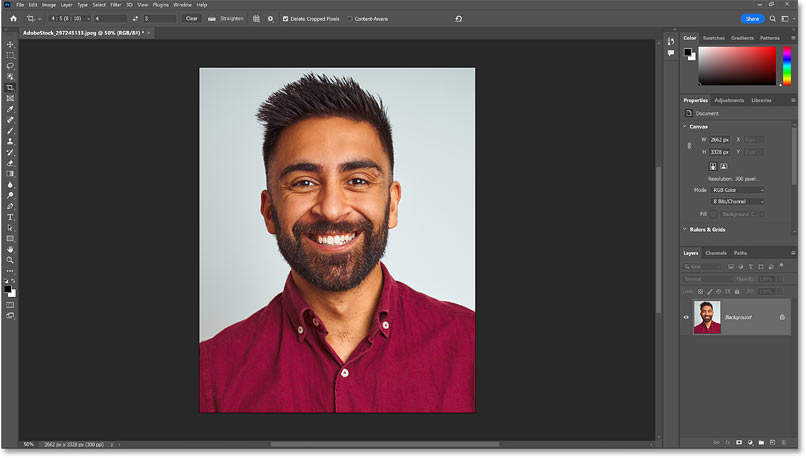
*The cropped image remains centered with Overscroll turned off.*

And there we have it! Be sure to check out my complete [Cropping Images with the Crop Tool](/basics/how-to-crop-images-photoshop-cc/) tutorial as well as my [Crop Tool Tips and Tricks](/basics/photoshop-crop-tool-tips-and-tricks/). And don’t forget, all of my Photoshop tutorials are now available to [download as PDFs](/print-ready-pdfs/)!