# How To Merge Layers As Smart Objects In Photoshop

> Source: [https://www.photoshopessentials.com/basics/how-to-merge-layers-as-smart-objects-in-photoshop/](https://www.photoshopessentials.com/basics/how-to-merge-layers-as-smart-objects-in-photoshop/)
> Downloaded and converted to Markdown.

A popular way to work non-destructively in Photoshop is to merge our existing layers onto a new layer above them. By merging layers onto a separate layer, we can apply sharpening or make other changes to the entire image, without the need to flatten the image and throw all of our existing layers away.

But even merging layers onto a new layer still isn't the best way to work. Any time we need to make changes to the underlying layers, we need to delete the merged copy, make our changes, and then merge the layers again. A better way is to merge our layers as a smart object. That way, if we need to make a change, we can simply edit the contents of the smart object, save the change, and then have our changes instantly appear in the document. And, since we're working with smart objects, any filters we apply will be added as smart filters, which means we can sharpen the image or make other changes non-destructively. Let's see how it works.

I'll be using [Photoshop CC](https://prf.hn/l/dlXjD2w) but everything is fully compatible with Photoshop CS6. Let's get started!

## The problem with merging layers onto a new layer

To help us see the benefits of merging layers as smart objects, let's quickly look at the problem with merging them onto a new layer. Here's an effect I'm currently working on in Photoshop. I downloaded the [original image](https://prf.hn/l/BOxVGQe) from Adobe Stock:

*The image open in Photoshop. Photo credit: Adobe Stock.*

If we look in the **Layers panel**, we see the [layers](/photoshop-layers-learning-guide/) I've used to create the effect. I started by converting the original image on the bottom layer into a smart object, and then I blurred the area around the woman's face using Photoshop's Blur Gallery, which was applied as a smart filter. I converted the image to [black and white](/photo-editing/converting-color-photos-to-black-and-white-in-photoshop/) by adding a Black & White adjustment layer. And finally, I changed her eye color by adding a Hue/Saturation adjustment layer at the top:

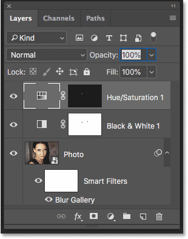
*The layers used to create the effect.*

[Related: How to create smart objects in Photoshop](/basics/how-to-create-smart-objects-in-photoshop/)

### How to merge layers onto a new layer

To merge all of my existing layers onto a new layer above them, I'll make sure I have the top layer selected (the Hue/Saturation adjustment layer). Then, on my keyboard, I'll use the secret trick for merging layers onto a new layer, which is by pressing **Shift+Ctrl+Alt+E** (Win) / **Shift+Command+Option+E** (Mac). This merges all three of my layers onto a new layer at the top:

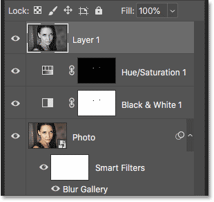
*All three layers have been merged onto a fourth layer.*

#### Applying sharpening to the merged layer

At this point, I can apply sharpening to the entire image by applying it directly to the merged layer. With the merged layer selected, I'll go up to the **Filter** menu, and then I'll choose **Sharpen**, and then **Smart Sharpen**:

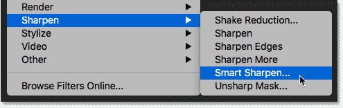
*Going to Filter > Sharpen > Smart Sharpen.*

In the Smart Sharpen dialog box, I'll accept my current settings and I'll click OK:

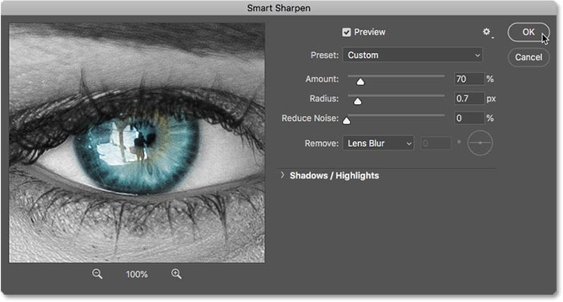
*Applying sharpening to the merged layer.*

And here's the image with the sharpening applied:

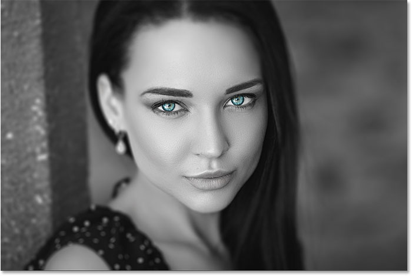
*The image after applying Smart Sharpen to the merged layer.*

### The problem with merged layers

But here's the problem we run into. Merging the layers onto a new layer made it easy to sharpen the image. But what if I need to make a change at this point to the effect? Maybe I want to adjust the blur amount, or remove the Black & White adjustment layer, or even change her eye color. To make any of these changes, I would first need to delete my merged layer. And since I've already applied sharpening to the layer, I would lose my sharpening effect. Once I've made my changes, I would then need to merge the layers again onto another new layer above them, and then reapply my sharpening. And, if I decided to make another change at that point, I'd again have to delete my merged layer and redo all of the steps.

## How to merge layers as a smart object

A better way to merge layers is to merge them as a **smart object**. Smart objects are entirely non-destructive, so we can make any changes we need, whenever we need, without having to delete any merged copies, and the changes will instantly appear in the document. And, when we sharpen the image, or apply any of Photoshop's other filters to the smart object, the filters will be added as smart filters, which means they remain fully editable!

### Deleting the merged layer

To see how it works, I'll delete my merged layer by dragging it down onto the Trash Bin at the bottom of the Layers panel:

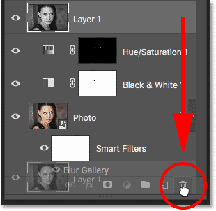
*Deleting the merged layer.*

### Merging layers as a smart object

To merge all three of my original layers into a smart object, I'll click on the top layer (the Hue/Saturation adjustment layer) to select it. Then I'll press and hold my **Shift** key and I'll click on the bottom layer (the "Photo" layer). This selects all three layers at once:

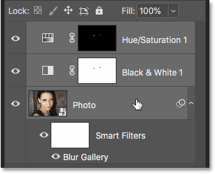
*Selecting all three layers.*

With all three layers selected, I'll click on the **menu icon** in the upper right corner of the Layers panel:

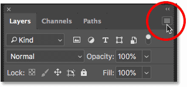
*Clicking the Layers panel menu icon.*

And then I'll choose **Convert to Smart Object** from the menu:

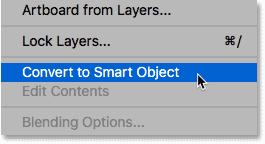
*Choosing the "Convert to Smart Object" command.*

This merges all of my layers into a smart object. We know it's a smart object by the **smart object icon** in the lower right of the thumbnail:

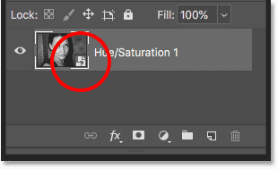
*All three layers have been merged into a smart object.*

## Editing the merged smart object

To make changes to the effect, I can simply [edit the smart object](/basics/how-to-edit-and-replace-smart-object-contents-in-photoshop/) by double-clicking on its **thumbnail**:

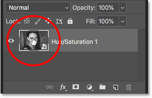
*Double-clicking on the smart object thumbnail.*

This opens the contents of the smart object in a separate document:

*The smart object opens in its own document.*

If we look in the Layers panel, we see all of my original layers still intact:

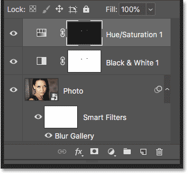
*None of the original layers have been lost.*

### Restoring the color in the image

I'll turn off the Black & White adjustment layer by clicking its **visibility icon**:

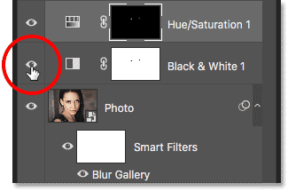
*Clicking the Black & White adjustment layer's visibility icon.*

This restores the original color in the image:

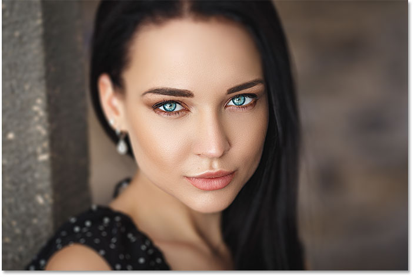
*Turning off the adjustment layer restored the original color.*

### Changing the eye color

Then, back in the Layers panel, I'll select the Hue/Saturation adjustment layer:

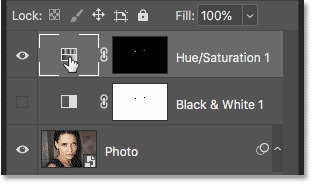
*Clicking the Hue/Saturation adjustment layer to select it.*

And in the **Properties panel**, I'll [change her eye color](/photo-editing/eye-color/) from blue to green by dragging the **Hue** slider to the left:

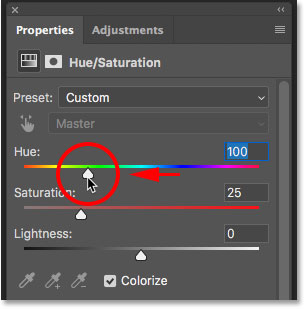
*Changing the eye color with the Hue slider.*

And here's the result with the new eye color:

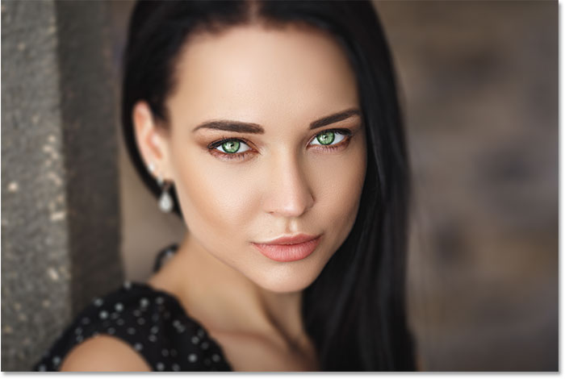
*The effect after changing the eye color.*

### Saving the changes and updating the smart object

To have our changes appear in the main document, we need to save and close the smart object document. To save it, I'll go up to the **File** menu and choose **Save**:

*Going to File > Save.*

And then to close the smart object, I'll go back up to the **File** menu and I'll choose **Close**:

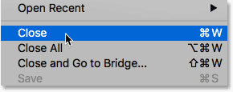
*Going to File > Close.*

Back in the main document, the smart object instantly updates with our changes. And because we merged the layers as a smart object, there's no need to merge them again at this point if I want to apply sharpening. I can simply apply the sharpening directly to the smart object:

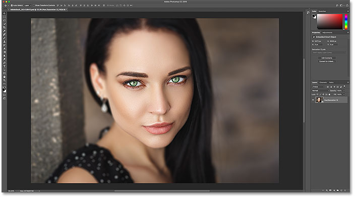
*The smart object updates with the changes.*

### Sharpening the smart object

To sharpen the image, I'll do the same thing I did before by going up to the **Filter** menu, choosing **Sharpen**, and then choosing **Smart Sharpen**:

*Going again to Filter > Sharpen > Smart Sharpen.*

In the Smart Sharpen dialog box, I'll use the same settings and I'll click OK:

*Applying sharpening to the smart object.*

Photoshop applies the sharpening to the effect, just as did when we were using a merged copy of the layers:

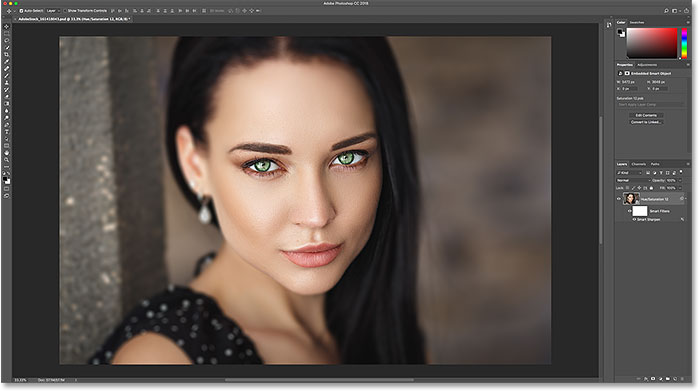
*The image after applying Smart Sharpen to the smart object.*

#### Applying the sharpening as a smart filter

But this time, because the sharpening filter was used on a smart object, Photoshop converted it into a **smart filter**, which we see in the Layers panel:

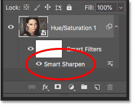
*Photoshop converted Smart Sharpen into a smart filter.*

Just like smart objects, [smart filters](/basics/how-to-use-smart-filters-in-photoshop/) are non-destructive. If you need to edit the sharpening amount, you can just double-click on the name "Smart Sharpen" to reopen its dialog box and make your changes. And, because the sharpening is being applied directly to the smart object itself, not to the layers inside it, it will remain applied even if you reopen the smart object and make further changes.

I'll reopen my smart object by double-clicking once again on its thumbnail:

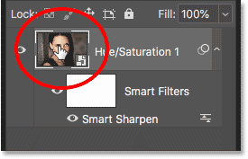
*Reopening the smart object.*

This again reopens the contents, with all of my layers, in the separate document:

*The smart object reopens.*

I'll turn the Black & White adjustment layer back on by clicking once again on its **visibility icon**:

*Turning the Black & White adjustment layer back on in the Layers panel.*

This converts the image back to black and white:

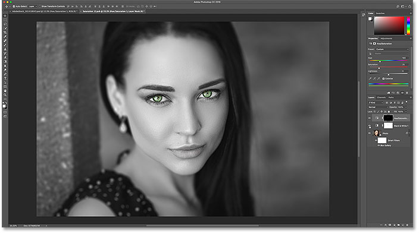
*The image is back to black and white.*

#### Saving the new changes

Again I'll save my change by going up to the **File** menu and choosing **Save**:

*Going to File > Save.*

And then I'll close the smart object by going back to the **File** menu and choosing **Close**:

*Going to File > Close.*

Back in the main document, the smart object once again updates with my latest change:

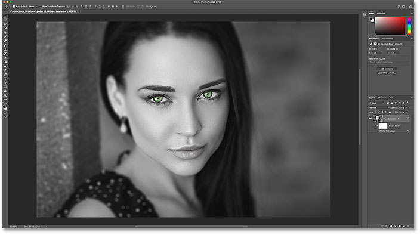
*The smart object again updates.*

And if we look in the Layers panel, we see that there's no need to re-sharpen the image because the Smart Sharpen smart filter is still being applied:

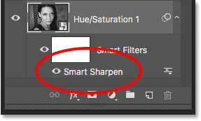
*The sharpening filter remain even after editing the smart object.*

And there we have it! That's how, and why, to merge layers as smart objects in Photoshop! For more on smart objects, check out our tutorials on how to [create smart objects](/basics/how-to-create-smart-objects-in-photoshop/), how to [edit smart objects](/basics/how-to-edit-and-replace-smart-object-contents-in-photoshop/), how to [scale and resize images](/basics/scale-resize-images-smart-objects-photoshop/) without losing quality, and even how to [warp and distort text](/basics/transform-type-smart-objects/) using smart objects! And don't forget, all of our Photoshop tutorials are available to [download as PDFs](/print-ready-pdfs/)!