# How to Paste an Image into a Layer Mask in Photoshop

> Source: [https://www.photoshopessentials.com/basics/how-to-paste-an-image-into-a-layer-mask-in-photoshop/](https://www.photoshopessentials.com/basics/how-to-paste-an-image-into-a-layer-mask-in-photoshop/)
> Downloaded and converted to Markdown.

Learn the simple trick that lets you paste an image or a texture directly into a layer mask in Photoshop! A step-by-step tutorial for Photoshop 2023 or earlier.

Copying an image from one Photoshop document and pasting it into another is easy. Photoshop places the image on its own layer, which is usually what we want.

But pasting an image directly into a layer mask is not so easy. At least, not until you've learned the one simple trick I show you in this tutorial. I also show you a couple of quick ways to adjust the contrast of the image after pasting it into the mask, which can have a big impact on the intensity of the effect.

### Which version of Photoshop do I need?

I’m using Photoshop 2023 but this applies to any recent version. You can [get the latest Photoshop version here](https://adobe.prf.hn/click/camref:1100lrdjJ/destination:https%3A%2F%2Fwww.adobe.com%2Fproducts%2Fphotoshop.html).

### The document setup

To demonstrate how to paste an image into a layer mask, I'm going to create a layer mask on a type layer and then paste a texture image into it. But you can use these same steps with pixel layers and shape layers as well.

Here's the [texture image](https://adobe.prf.hn/click/camref:1100lrdjJ/destination:https%3A%2F%2Fstock.adobe.com%2Fimages%2Fgrey-cement-background-wall-texture%2F281239239) I'll be using, which is open in its own document.

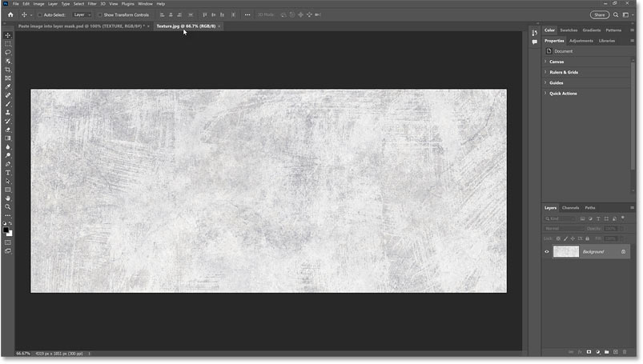
*The image that will be pasted into the layer mask.*

And here's the document with my text. It's just a simple type layer above a background image.

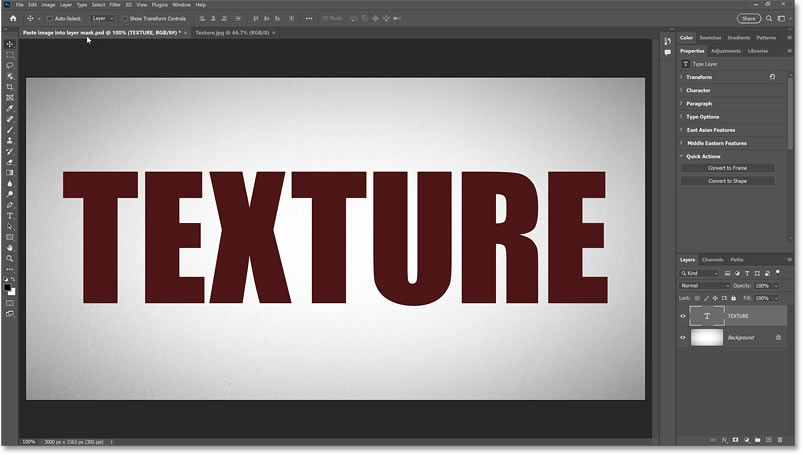
*The image will be pasted into a layer mask on the type layer.*

Let's get started!

## Step 1: Add a layer mask

First we need to add a [layer mask](/basics/understanding-photoshop-layer-masks/). Since I'm adding the mask to my type layer, I'll click on the type layer in the [Layers panel](/basics/layers/layers-panel/) to select it.

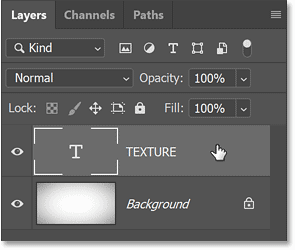
*Selecting the layer.*

Then add the mask by clicking the **Add Layer Mask** icon at the bottom of the Layers panel.

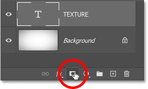
*Clicking the Add Layer Mask icon.*

A **layer mask thumbnail** appears on the layer.

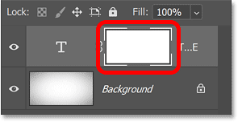
*The layer mask thumbnail.*

## Step 2: Open the image to paste into the layer mask

Next we need to open the image we're going to paste into the mask.

In my case, the image is already open in its own document so I'll switch to the document by clicking its **tab** at the top.

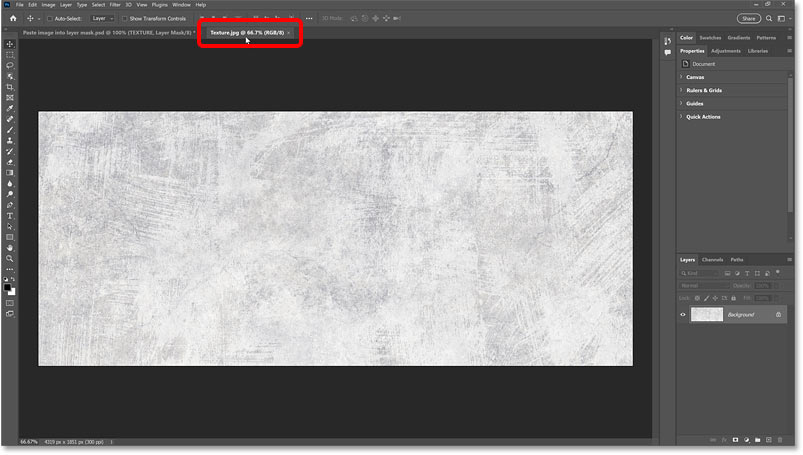
*Switching to the document that holds the image.*

## Step 3: Select and copy the image

We need to move the image into our main document (the one with the layer mask). And an easy way to do that is to copy and paste it.

Select the image by going up to the **Select** menu and choosing **All**.

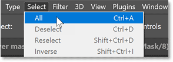
*Going to Select > All.*

Then copy it by going up to the **Edit** menu and choosing **Copy**.

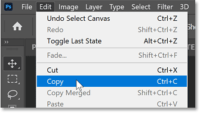
*Going to Edit > Copy.*

## Step 4: Switch back to the main document

With the image copied, switch back to your main document by clicking its **tab**.

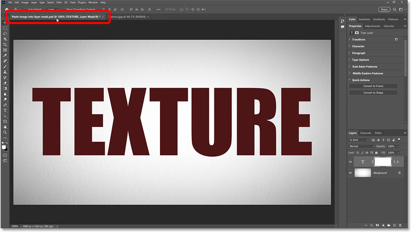
*Switching back to the main document.*

[Related tutorial: Five ways to move images between documents](/basics/5-ways-move-images-photoshop-documents/)

## Step 5: Change your view to the layer mask

If we were to simply paste the image into the document (by going up to the Edit menu and choosing Paste), Photoshop would paste the image onto its own [layer](/basics/understanding-photoshop-layers/), which is not what we want.

Instead, the trick to pasting into a layer mask is to first change your view in the document to the layer mask itself.

To do that, on a Windows PC, hold the **Alt** key on your keyboard. On a Mac, hold the **Option** key. Then with the key held down, click the **layer mask thumbnail** in the Layers panel.

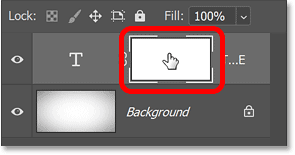
*Holding Alt / Option and clicking the layer mask thumbnail.*

Notice that my view has changed from my text to the layer mask. It looks like we're viewing a plain white background but that's because the mask is currently filled with nothing but white.

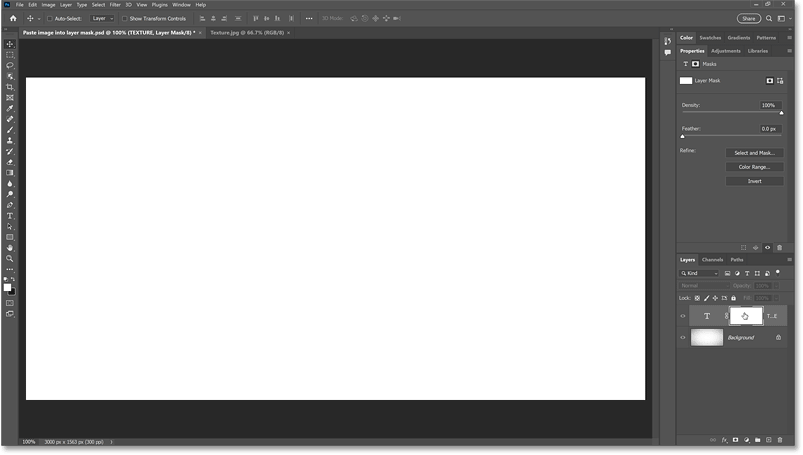
*Viewing the layer mask in the document.*

## Step 6: Paste the image into the layer mask

Now that we're viewing the mask, we can paste our image into it by going up to the **Edit** menu and choosing **Paste**.

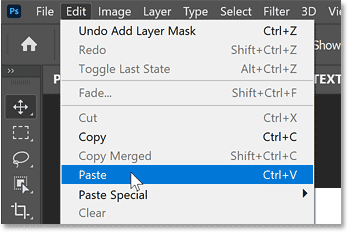
*Going to Edit > Paste.*

It may look like we've just pasted the image into the document.

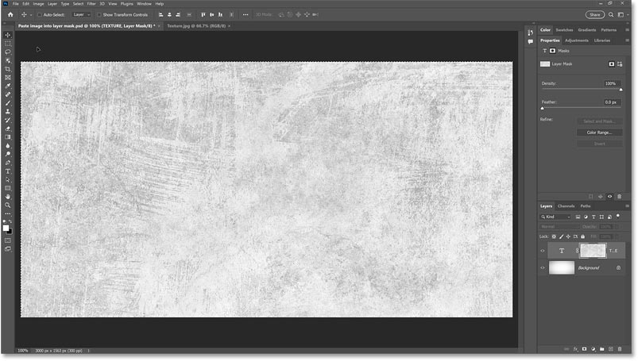
*The result after pasting the image.*

But we know it was pasted into the layer mask because we can see the image in the layer mask thumbnail.

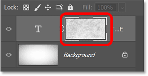
*The mask thumbnail showing the pasted image.*

## Step 7: Resize the image inside the mask

Before switching out of the layer mask and back to the main view, resize the image inside the mask if needed.

To resize the image, go up to the **Edit** menu and choose **Free Transform**.

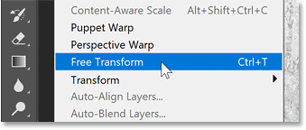
*Going to Edit > Free Transform.*

This places transform handles around the image. But in my case, because my image is larger than the document it was pasted into, most of the handles are outside the visible area of the canvas.

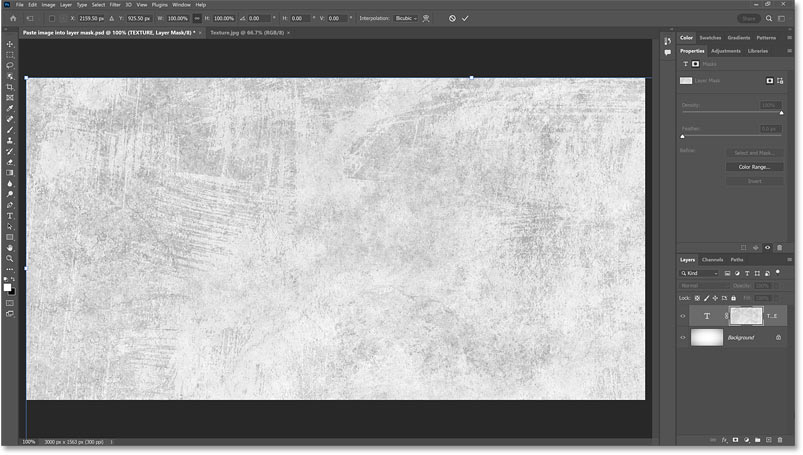
*The transform box and handles extend beyond the viewable area.*

[Related tutorial: How to use Free Transform in Photoshop](/basics/transform-and-warp-images-with-free-transform-in-photoshop-cc-2019/)

### Zooming out the view the transform handles

To view all of the handles, I'll go up to the **View** menu and choose **Fit on Screen**.

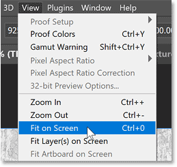
*Going to View > Fit on Screen.*

And now all of the transform handles are visible.

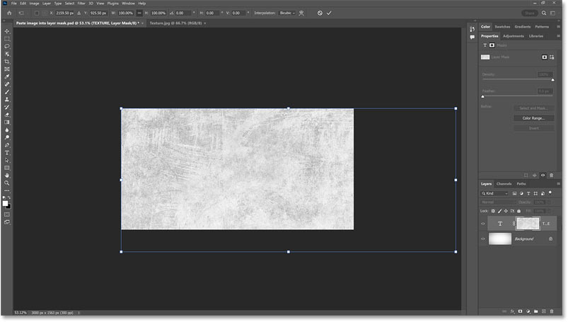
*The result after changing the view.*

### Resizing the image inside the layer mask

Notice in the Options Bar that the **link icon** between the Width and Height boxes is selected. If yours is not, click on it to select it. This will lock the aspect ratio of the image as we resize it.

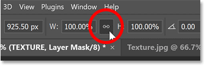
*The Width and Height fields should be linked.*

Then simply drag the handles to resize the image.

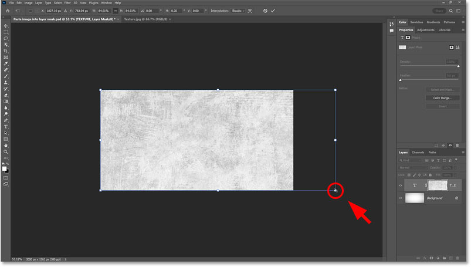
*Resizing the image inside the mask.*

I'll center the image as well by clicking and dragging inside the transform box.

I'm not worried about those areas on the sides that are still outside the canvas because I'm just using the image as a texture. As long as it will fit nicely inside the text, it's good enough.

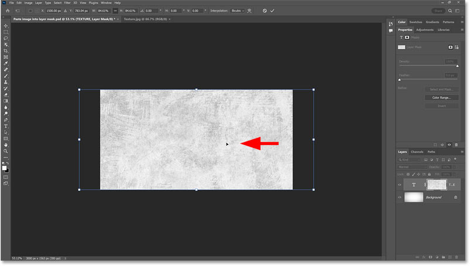
*Centering the image in the layer mask.*

To accept it and close Free Transform, click the **checkmark** in the Options Bar.

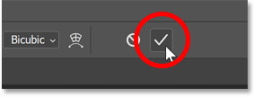
*Clicking the checkmark.*

### Removing the selection outline

Go up to the **Select** menu and choose **Deselect** to remove the selection outline from around the image.

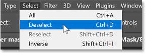
*Going to Select > Deselect.*

### Zooming back in on the document

Then I'll zoom back in by holding the **Ctrl** key (on a Windows PC) or the **Command** key (on a Mac) and pressing the **plus sign** on my keyboard a couple of times.

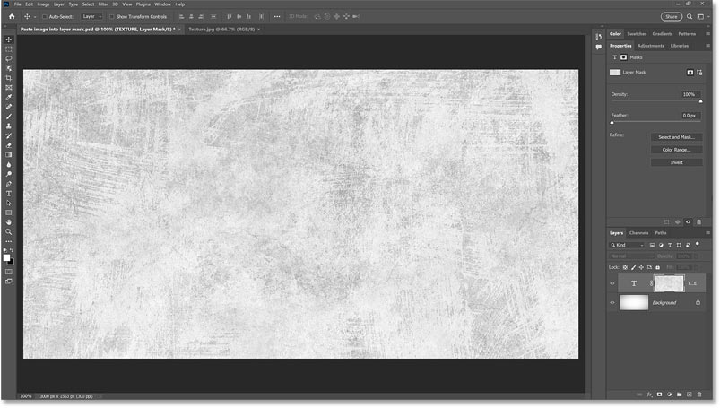
*Zooming in on the document.*

[Related tutorial: Zoom images like a pro in Photoshop](/basics/photoshop-zoom/)

## Step 8: Change your view back to the main document

Change your view from the layer mask back to the main document by clicking the layer's **visibility icon** in the Layers panel.

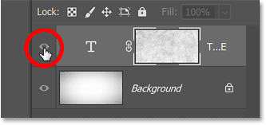
*Clicking the visibility icon.*

And now we see my type with the texture image inside the layer mask.

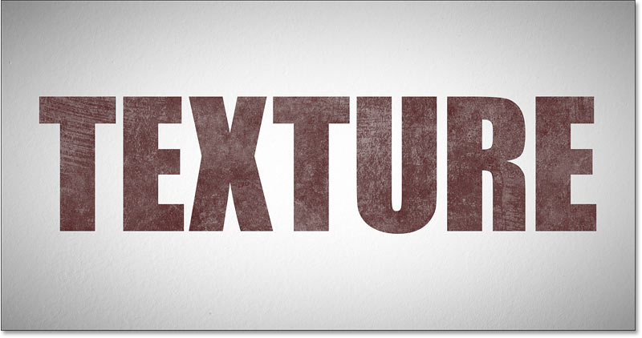
*The result with the image pasted into the layer mask.*

## How to boost the contrast of the image inside the layer mask

At this point, we've pasted the image into the layer mask and we could stop here. Or we could adjust the intensity of the effect by boosting or fading the contrast of the image inside the mask. And here are a couple of quick ways to do it.

### How to boost the layer mask contrast

If the image you pasted into the mask is low contrast (mine is mostly gray with no truly dark or light areas) and you want to boost the contrast, click on the **layer mask thumbnail** in the Layers panel to make it active.

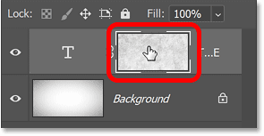
*Clicking the layer mask thumbnail.*

Then go up to the **Image** menu and choose **Auto Contrast**.

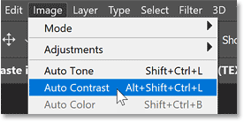
*Going to Image > Auto Contrast.*

This instantly darkens the darker areas of the mask and brightens the brighter areas. And notice how much stronger the texture now appears inside my text.

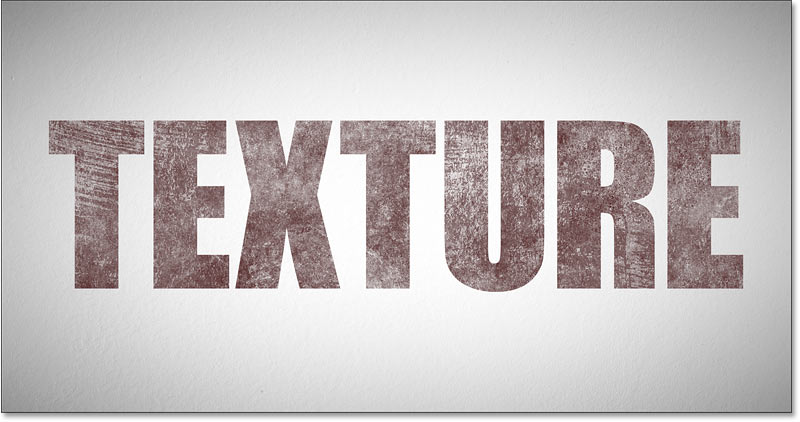
*The result after applying Auto Contrast to the layer mask.*

[Related tutorial: The Auto Tone, Auto Contrast and Auto Color commands](/photo-editing/auto-tone-auto-contrast-and-auto-color-in-photoshop/)

### How to fade the layer mask contrast

Or if the contrast of the mask is too strong and you want to fade it, again make sure the **layer mask thumbnail** is active in the Layers panel.

Then go up to the **Properties** panel and fade the mask by dragging the **Density** slider to the left.

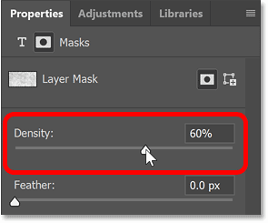
*Dragging the Density slider to fade the layer mask.*

And now the texture is less intense.

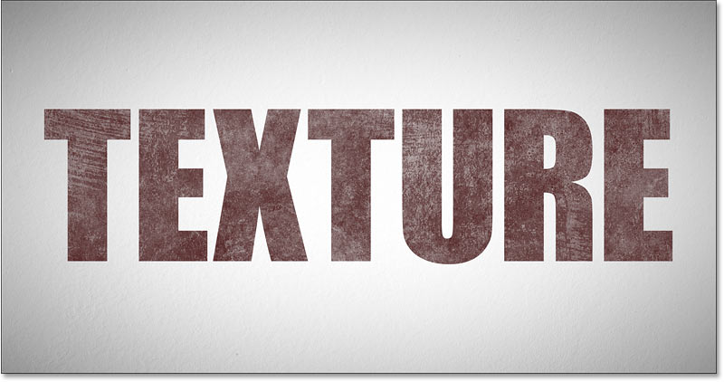
*The result after fading the layer mask.*

And there we have it! That's how to paste an image directly into a layer mask in Photoshop.