# How to Resize Images for Email and Photo Sharing with Photoshop

> Source: [https://www.photoshopessentials.com/basics/how-to-resize-images-for-email-and-photo-sharing-with-photoshop/](https://www.photoshopessentials.com/basics/how-to-resize-images-for-email-and-photo-sharing-with-photoshop/)
> Downloaded and converted to Markdown.

Learn how easy it is to resize photos for emailing to family and friends, and for sharing online, using the Image Size command in Photoshop!

In this fourth tutorial in my series on image size, you'll learn how to resize images for email and for sharing online with Photoshop! Resizing a photo for the web is different from resizing it for print, which we learned how to do in the [previous lesson](/basics/how-to-resize-images-for-print-with-photoshop/ "How to resize images for print with Photoshop"). With print, there's often no need to change the number of pixels in the image. Instead, we control the print size by simply changing the photo's resolution.

But when emailing or sharing an image online, we almost always need to downsize the image and make it smaller, for a couple of reasons. First, we need to make sure that the *dimensions* of the image (the width and height, in pixels) are small enough that it can fit entirely on the viewer's screen without needing to scroll or zoom out. And second, the *file size* of the image, in megabytes, needs to be small enough that we can send or upload the photo without any problems. Thankfully, as we'll see in this tutorial, taking care of the first issue (the pixel dimensions of the image) usually takes care of the second (the file size) at the same time.

Once we're done resizing the image, I'll show you how to save your photo to get the best results. To follow along, you can open any image in Photoshop. I'll use [this photo](https://prf.hn/l/Gl3BNXD) that I downloaded from Adobe Stock:

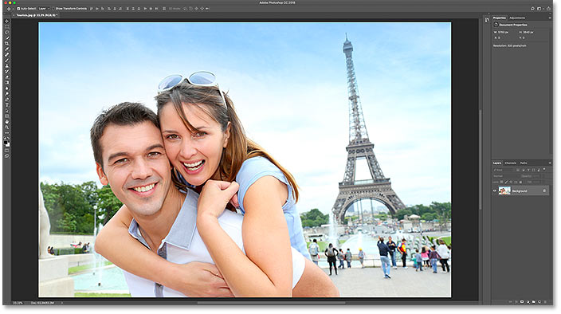
*The original image. Photo credit: Adobe Stock.*

This is lesson 4 in my [Resizing Images in Photoshop](/basics/how-to-resize-images-in-photoshop-complete-guide/ "View the complete Image Resizing guide") series.

Let's get started!

## Duplicating the image before resizing it

Since resizing an image for email or the web usually means we'll be throwing pixels away, it's a good idea to make a copy of the image first before resizing it. To duplicate the image, go up to the **Image** menu in the Menu Bar and choose **Duplicate**:

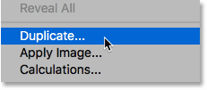
*Going to Image > Duplicate.*

In the Duplicate Image dialog box, give the copy a name, or just accept the original name with the word "copy" at the end. If your document contains more than one layer, select **Duplicate Merged Layers Only** to create a flattened copy of the image:

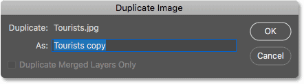
*The Duplicate Image dialog box.*

Click OK to close the dialog box, and a copy of the image opens in a separate document. The name of the currently-active document is highlighted in the [tabs](/basics/tabbed-and-floating-documents-in-photoshop/ "Working with tabbed and floating documents in Photoshop") along the top:

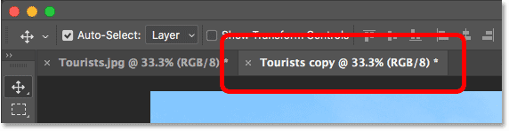
*The copy of the image opens in a separate document.*

## The Image Size dialog box

To resize the image, go back up to the **Image** menu and this time, choose **Image Size**:

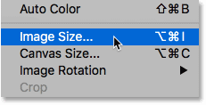
*Going to Image > Image Size.*

This opens the Image Size dialog box, which in [Photoshop CC](https://prf.hn/l/dlXjD2w) includes a preview window on the left, and options for changing the size of the image along the right:

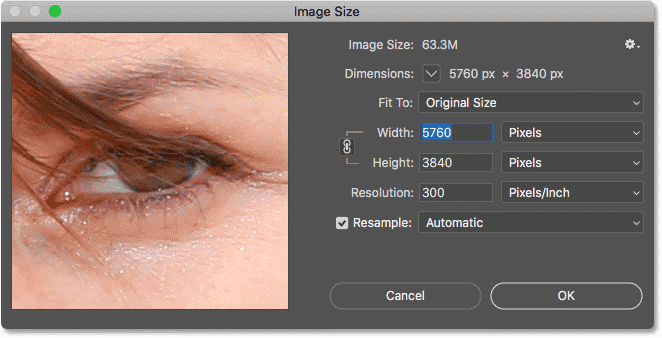
*The Image Size dialog box in Photoshop CC.*

### Getting a larger image preview

To give yourself a larger preview window, you can make the dialog box itself bigger. Just drag the dialog box into the upper left of the screen, and then drag the bottom right handle outward. Once you've resized the dialog box, click and drag inside the preview window to center it on your subject:

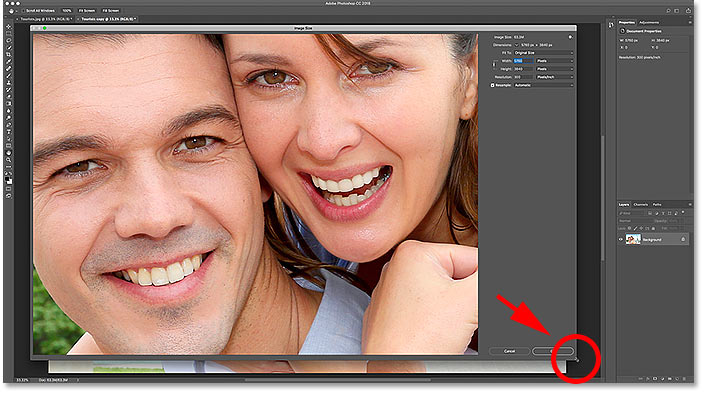
*Resizing the Image Size dialog box.*

[Related: Photoshop's Image Size command - Features and Tips](/basics/photoshops-image-size-command-features-and-tips/ "View tutorial")

## Viewing the current image size

You'll find the current image size, both in pixels and in megabytes, at the top of the column on the right. The number beside the words **Image Size** shows the current size in megabytes (M), and next to the word **Dimensions**, we see the current size in pixels. 

My image is currently taking up 63.3 megabytes in memory, and it has a width of 5760 pixels and a height of 3840 pixels. Both of these sizes are too big to email the image or share it online, but we'll learn how to change them in a moment:

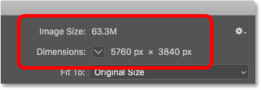
*The current size of the image.*

### Changing the Dimensions measurement type

If the dimensions are shown in a measurement type other than pixels, click on the small arrow to the right of the word "Dimensions" to view a list of all the measurement types you can choose from. Then choose **Pixels** from the list:

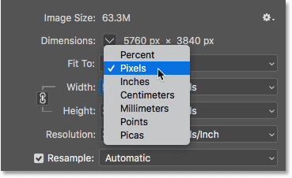
*Choosing Pixels as the measurement type.*

## Resizing vs resampling an image

Before we learn how to resize an image for the web, let's make sure we understand the difference between *resizing* an image and *resampling* an image. I covered the difference in the previous tutorials in this series, but we'll quickly review it here.

### What is image resizing?

*Resizing* means that we're not changing the number of pixels in the image, or its file size. Resizing only changes the size that the image will *print*. We control the print size not by changing the number of pixels but by changing the photo's resolution. You can learn more about [image size and resolution](/basics/pixels-image-size-resolution-photoshop/ "Pixels, image size and resolution in Photoshop") in the first tutorial in this series, and [how to resize an image for print](/basics/how-to-resize-images-for-print-with-photoshop/ "How to resize an image for print with Photoshop") in the third lesson.

### What is image resampling?

*Resampling* means that we're changing the number of pixels. Adding more pixels to the image is called *upsampling*, and throwing pixels away is known as *downsampling*. You'll rarely, if ever, need to upsample an image for email or the web. But you'll almost always need to downsample it. And as we'll see, by downsampling an image to make its width and height smaller, we make the file size smaller at the same time!

## How to resample the image

Now that we know the difference between resizing and resampling, let's learn how to resample the image so we can optimize it for email and photo sharing. 

### Step 1: Turn Resample on

In the Image Size dialog box, we choose between resizing and resampling using the **Resample** option, which you'll find directly below the Resolution option. Since we want to reduce the number of pixels in the image, make sure Resample is checked:

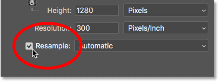
*Turning "Resample" on.*

### Step 2: Enter the new Width and Height

With Resample turned on, also make sure that the measurement type for both the **Width** and the **Height** options is set to **Pixels**:

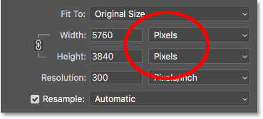
*Setting the Width and Height to Pixels.*

Then, enter the width and height you need. Since the Width and Height fields are linked together, changing one will automatically change the other depending on the aspect ratio of your image.

#### What Width and Height values should I use?

Of course, the question is, what's the best width and height to use for emailing the image or for sharing it online? Most photo sharing and social media platforms have their own recommended sizes, and a quick Google search for your favorite platform will give you the size you need. 

For email, it really depends on the screen size that the person you're emailing the image to is using. While monitors with 4K and 5K resolutions are gaining popularity, the most common screen resolution is still 1920 x 1080, more commonly known as 1080p. Ideally, you'll want the image to fit entirely on the viewer's screen without them needing to scroll or zoom out. So if we stick with the most common screen size (1920 x 1080), you'll want the width of your image to be no more than 1920 pixels and the height no more than 1080 pixels.

#### Changing the Width and Height

I'll lower my Width value from 5760 pixels down to 1920 pixels. Photoshop keeps the aspect ratio intact by automatically lowering the Height, from 3840 pixels down to 1280 pixels:

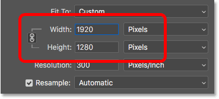
*Changing the Width also changes the Height.*

#### Checking the new image size

Notice that the new pixel dimensions (1920 px x 1280 px) now appear in the **Dimensions** section at the top of the dialog box. But more importantly, by reducing the number of pixels in the image, the **Image Size** section is showing that we've also lowered the file size of the image. We've gone from 63.3 megabytes down to just 7.03 megabytes.

Note that the number you see next to Image Size is *not* the final file size of the image. It's simply the amount of space that the image is currently taking up in your computer's memory. You won't know the actual file size until you save the image as a JPEG or other file type, and the final size will be even lower than what we're seeing here. We'll look at how to save the image at the end of this tutorial:

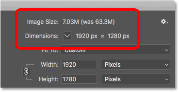
*Lowering the pixel dimensions also lowered the file size.*

#### Viewing the new dimensions as a percentage

If you'd rather view the new dimensions of the image as a percentage rather than in pixels, click the arrow next to the word "Dimensions" and choose **Percent** from the list:

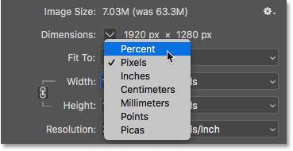
*Changing the Dimensions measurement type to Percent.*

And now we can see that the width and height of the image have been reduced to just 33.33% of their original size:

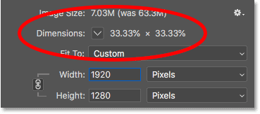
*Viewing the new image dimensions as a percentage of the original size.*

#### Lowering the pixel dimensions even further

Earlier, we learned that if we want the image to fit on a standard 1080p display, we need the Width to be no more than 1920 pixels and the Height no more than 1080 pixels. I've lowered the Width to 1920 px, but because of the aspect ratio of my image, the Height was lowered to only 1280 pixels, which means it's still too tall for a 1080p display.

#### Unlinking the Width and Height

I *could* try to fix the problem by unlinking the Width and Height. By default, they're linked together, but you can toggle the link on or off by clicking the **link icon** between them. Then, with the Width and Height unlinked, I'll leave the Width at 1920 px but I'll change the Height to 1080 px:

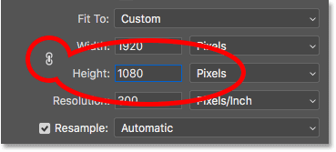
*Unlinking the Width and Height, and then changing the Height separately.*

But the problem is that, by unlinking the Height from the Width, I've changed the aspect ratio of my image. And as we can see in the preview window, the photo is now stretched horizontally, which isn't what we want:

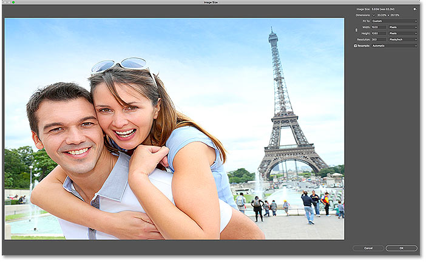
*Unlinking the Width and Height is usually a bad idea.*

#### Relinking the Width and Height

Since that's not what I wanted to do, I'll relink the Width and Height by again clicking the **link icon**. This also resets the image back to its original size:

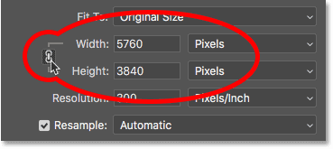
*Relinking the Width and Height and resetting their values.*

Then, to fit the image entirely on a 1080p display, this time I'll change the Height to 1080 pixels. This lowers the Width to 1620 pixels, and how anyone viewing it on a 1920 x 1080 display will see the entire image without zooming or scrolling:

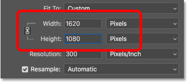
*Resizing the image to fit entirely on a standard 1080p monitor.*

#### Checking the new image size

And if we look at the **Image Size** and **Dimensions** at the top, we see that the width and height are now roughly 28% of the original size, and the size of the image in memory is down to just 5M, which is even better than before:

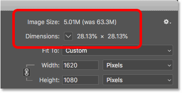
*The image size after downsampling the image.*

### Step 3: Choose the interpolation method

One last but important option when resampling an image is the **interpolation method**. You'll find it next to the Resample option, and by default, it's set to Automatic:

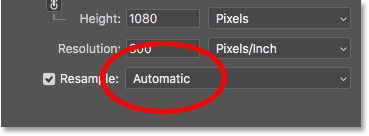
*The Interpolation method next to the Resample option.*

#### What is image interpolation?

When we resample an image, Photoshop has to add or remove pixels. And the method it uses to do that is known as the *interpolation method*. There are several interpolation methods to choose from, and you can view them by clicking on the option. Some methods are best for upsampling, and others for downsampling:

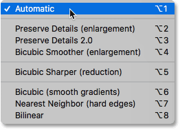
*Photoshop's image interpolation methods.*

#### Which interpolation method should I choose?

Each interpolation method will produce different results, some softer or sharper than others. And choosing the wrong one can have a negative impact on the resampled image. If you're not sure which one to choose, leaving this option set to **Automatic** is the safest choice. Photoshop will automatically choose what it considers to be the best method for the job, which when downsampling images is **Bicubic Sharper**:

*Leaving the interpolation method set to Automatic.*

#### What's the best interpolation method for downsampling?

Even though Photoshop will choose Bicubic Sharper as the best choice for downsampling images, it's actually *not* the best choice if you really want the best results. If you just want the *sharpest* results with the least amount of hassle, then yes, stick with Bicubic Sharper. And by that, I mean leave the interpolation method set to Automatic.

But, for the *absolute* best results when downsampling an image, you'll want to choose **Bicubic (smooth gradients)** instead. This will produce the smoothest, cleanest looking image. Note, though, that you'll need to apply more sharpening to the image afterwards, otherwise it will look too soft. But if you're comfortable with [sharpening images](/photo-editing/sharpen-high-pass/ "How to sharpen images in Photoshop with High Pass") and you want the most professional results, change the interpolation method from Automatic to Bicubic:

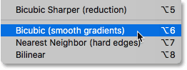
*Choose Bicubic (smooth gradients) for the cleanest results.*

### What about the image resolution?

One option that we have not looked at in this tutorial is **Resolution**, found directly below the Width and Height options. And the reason we haven't looked at it is because resolution only affects the size that the image will *print*. Resolution has no effect at all on the pixel dimensions or on the file size of the image. 

So when you're resizing an image for email, for sharing online or for any type of screen viewing, ignore the resolution. You can learn more about [image resolution](/basics/pixels-image-size-resolution-photoshop/ "Pixels, image size and resolution in Photoshop") in the first lesson in this series. And to learn more about why resolution has no effect on file size, see my [72ppi web resolution myth](/essentials/the-72-ppi-web-resolution-myth/ "The 72ppi web resolution myth") tutorial:

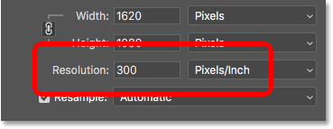
*Ignore the Resolution value when resampling images for email or the web.*

### Step 4: Click OK to resample the image

Once you've entered the pixel dimensions you need and you've chosen your interpolation method, click OK to close the Image Size dialog box and resample the image:

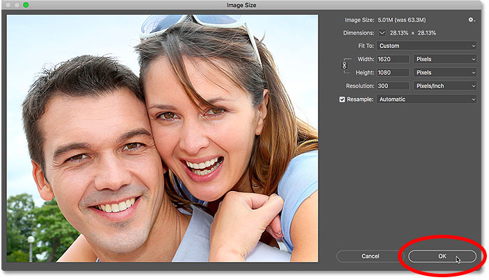
*Click OK to resample the image.*

### Step 5: Save the image as a JPEG file

When you're ready to save the image so you can email or share it, go up to the **File** menu in the Menu Bar and choose **Save As**:

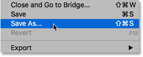
*Going to File > Save As.*

In the Save As dialog box, set the **Format** (the file type) to **JPEG**. Give your image a name (I'll name mine "Tourists-small.jpg") and choose where you want to save it on your computer. Then, click **Save**:

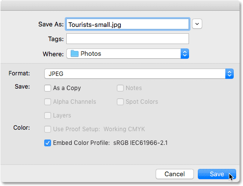
*The Save As options.*

And finally, in the JPEG Options dialog box, set the **Quality** to **Maximum**, and in the **Format Options**, choose **Baseline Optimized**. If you look below the word "Preview", you'll see the final size of the image, which in my case is just 1.0M, which means I'll have no trouble emailing or sharing it. Click OK to save the image as a JPEG and close the dialog box:

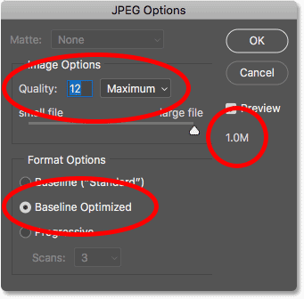
*Choosing the highest quality JPEG options.*

And there we have it! That's how to resize an image for email and for sharing online with Photoshop! In the next lesson, you'll learn exactly how Photoshop [calculates the file size of your image](/basics/how-to-calculate-image-size-in-photoshop/ "View tutorial") and how easy it is to figure out the file size yourself!

You can jump to any of the other lessons in this [Resizing Images in Photoshop](/basics/how-to-resize-images-in-photoshop-complete-guide/ "View the complete Image Resizing guide") chapter. Or visit our [Photoshop Basics](/basics/ "Learn more") section for more topics!