# How to Resize Images for Print with Photoshop

> Source: [https://www.photoshopessentials.com/basics/how-to-resize-images-for-print-with-photoshop/](https://www.photoshopessentials.com/basics/how-to-resize-images-for-print-with-photoshop/)
> Downloaded and converted to Markdown.

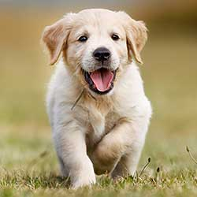

Learn all about resizing images for print with Photoshop! You'll learn how print size works, how (and when) to enlarge your photos, how to resize for different frame sizes, and how to get the highest quality prints every time!

In this tutorial, the third in my series on image size, I'll show you how easy it is to resize an image for print with Photoshop! Resizing for print is different from resizing for the web or for screen viewing. That's because there's often no need to change the number of pixels in the image. 

Most of today's digital cameras capture images that are already large enough to print at standard frame sizes, like 8 x 10 or 11 x 14, and get great results. So rather than changing the number of pixels, all we need to do is change the print size. And as we'll see, we change the print size just by changing the photo's *resolution*. I'll cover what resolution is, and how much of it you need for high quality prints, in this tutorial.

If you *do* need to print the image at a larger size, then you'll need to enlarge it by adding more pixels.  Also, if you want to fit your image to a frame size that doesn't match the aspect ratio of the photo, you'll first need to crop the image before resizing it. I'll be covering both of these topics as well.

To follow along, you can open any image in Photoshop. I'll use this cute little fella that I downloaded from Adobe Stock:

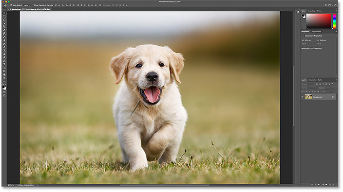
*The original image. Photo credit: Adobe Stock.*

This is lesson 3 in my [Resizing Images in Photoshop](/basics/how-to-resize-images-in-photoshop-complete-guide/ "View the complete Image Resizing guide") series.

Let's get started!

## The Image Size dialog box

To resize an image for print in Photoshop, we use the Image Size dialog box. To open it, go up to the **Image** menu in the Menu Bar and choose **Image Size**:

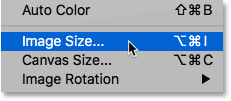
*Going to Image > Image Size.*

In [Photoshop CC](https://prf.hn/l/dlXjD2w "Get Photoshop CC"),  the Image Size dialog box features a preview window on the left, and options for viewing and changing the image size on the right. I covered the [Image Size dialog box](/basics/photoshops-image-size-command-features-and-tips/ "View tutorial") in detail in the previous tutorial:

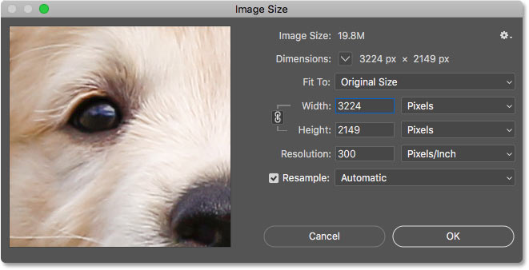
*The Image Size dialog box in Photoshop CC.*

### Getting a larger image preview

The first thing you'll want to do is increase the size of the preview window, and you can do that by making the Image Size dialog box larger. Just drag the dialog box into the upper left of the screen, and then drag its bottom right corner outward.

Once you've resized the dialog box, click and drag inside the preview window to center your subject:

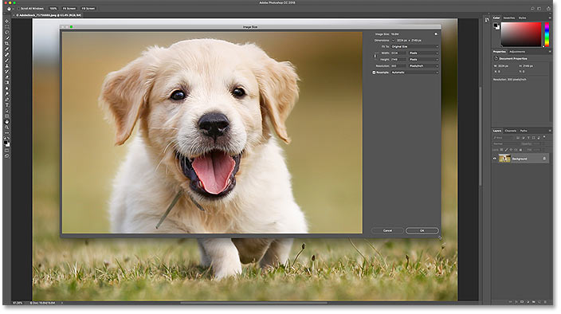
*Resizing the dialog box for a larger image preview.*

### Viewing the current image size

The current size of your image is displayed at the top. The number next to the words **Image Size** shows the size of the image in megabytes (M). And below that, next to the word **Dimensions**, we see the image size in pixels. Neither of these tell us the print size, but we'll get to that in a moment:

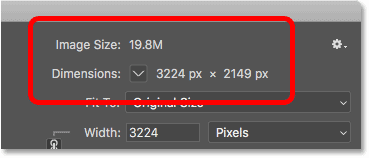
*The current image size is displayed at the top.*

## Resizing vs resampling an image

Before we look at how to resize the image for print, we first need to know the important difference between *resizing* an image and *resampling* it.

### What is image resizing?

*Resizing* means that we're not changing the number of pixels in the image. All we're doing is changing the size that the image will *print*. We control the print size not by changing the number of pixels but by changing the image *resolution*. I covered [image size and resolution](/basics/pixels-image-size-resolution-photoshop/ "View tutorial") in the first tutorial in this series, but we'll look at it again in a moment.

### What is image resampling?

*Resampling* means that we're changing the number of pixels. Adding more pixels is known as *upsampling*, and throwing pixels away is called *downsampling*. Downsampling is used when you're reducing the size of an image, whether it's for email, for uploading to the web, or for general screen viewing. But you won't need to downsample an image for print. You *may* need to upsample it, though, if the current pixel dimensions are too small to print it at the size you need. I'll show you how to upsample the image a bit later.

## How print size works

To see if your image already has enough pixels to print it at your target size, start by turning the **Resample** option off. You'll find it directly below the Resolution option. With Resample off, Photoshop won't let us change the number of pixels. All we can change is the print size:

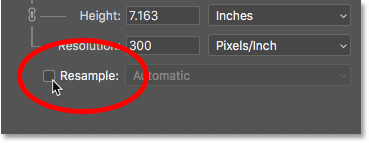
*Turning the Resample option off.*

### Where is the current print size?

The current print size is shown in the **Width**, **Height** and **Resolution** fields. In my case, my image will print 10.747 inches wide and 7.163 inches tall at a resolution of 300 pixels per inch:

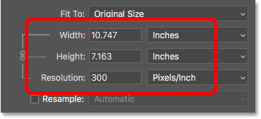
*The current width, height and resolution.*

### What is image resolution?

The width and height are pretty straightforward. But what is resolution? *Resolution* is the number of pixels in your image that will print in one linear inch of paper. Since the image has a limited number of pixels, the more pixels you print per inch, the smaller the image will print. And likewise, printing fewer pixels per inch will give you a larger print size. 

Since we're not changing the *number* of pixels in the image, changing the resolution has no effect on the file size or on how the image looks on screen. Resolution only applies to print.

[Learn more: The 72 ppi web resolution myth](/essentials/the-72-ppi-web-resolution-myth/)

With my image, the resolution is currently set to **300 pixels/inch**. This means that 300 pixels from the width, *and* 300 pixels from the height, will print inside every inch of paper. That may not sound like a lot. But if you do the math, 300 x 300 = 90,000. So this means that 90,000 pixels will print inside every *square inch*:

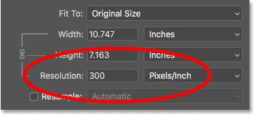
*The Resolution value is for both the width *and* the height.*

### How does resolution affect the print size?

To understand how resolution affects the print size, all we need to do is divide the current width and height of the image, in pixels, by the current resolution. In my case, my image has a width of 3224 pixels:

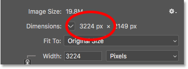
*The current image width, in pixels.*

If we divide 3224 pixels by 300 pixels/inch, we get 10.747 inches for the width:

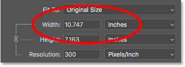
*The pixel width, divided by the resolution, gives us the print width.*

And my image has a height of 2149 pixels:

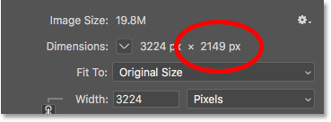
*The current image height, in pixels.*

So if we take 2149 pixels and divide it by 300 pixels/inch, we get 7.163 inches for the height:

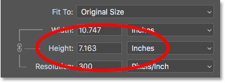
*The pixel height, divided by the resolution, gives us the print height.*

### How much resolution do you need for high quality prints?

Now that we know how resolution affects the print size, the real question becomes, how *much* resolution do we need for the print to look good? I'll answer that one question with three different answers. First, I'll tell you the official answer. Then, I'll explain why many people think the official answer is nonsense. And finally, I'll share what I consider to be the *best* answer and the one I agree with.

#### Answer #1: The industry standard resolution

First, the official answer. The long-held industry standard for high quality printing is a resolution of **300 pixels/inch**. This means you need at least 300 pixels per inch if you want your image to look crisp and sharp with lots of detail when printed. There's nothing wrong with this standard, and printing at 300 pixels/inch will definitely give you great results.

#### Answer #2: The "good enough" resolution

But there's a couple of arguments against the industry standard resolution. The first is that it only considers pixel count as a factor in print quality. It doesn't take other important factors, like viewing distance, into consideration. Generally speaking, the larger the print, the farther away people view it. You may hold a 4" x 6" print up close, but you're more likely to stand a few feet back from a 24" x 36" or 30" x 40" poster. And a billboard off the highway is usually viewed from *hundreds* of feet away.

Since our eyes can't resolve the same amount of detail at farther distances, the argument goes that it makes no sense to print everything, no matter the viewing distance, at the same resolution. 300 pixels/inch may be what you need for smaller prints viewed up close, but larger prints with lower resolutions can look just as good when viewed from far enough away:

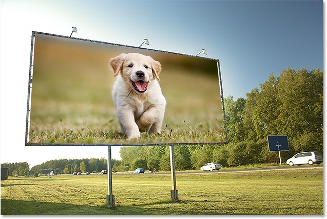
*Resolution becomes less important as you move farther from the image.*

Another argument against the industry standard is that while 300 pixels/inch will give you the highest print quality possible, it raises a question. Do you really *need* the highest quality? Or, is there a lower resolution that's "good enough"? Many professional photographers settle on **240 pixels/inch** as being the sweet spot for resolution. Sure, a 300 pixels/inch print will look slightly better in a side-by-side comparison. But 240 pixels/inch still produces a sharp and detailed image that most people would be perfectly happy with. And by not having to upscale the image to 300 pixels/inch, the file size remains smaller.

#### Answer #3: Your printer's native resolution

While the arguments against the industry standard resolution of 300 pixels/inch are strong, they leave out one very important detail. In fact, it's *such* an important detail that it tends to make the arguments against the industry standard rather pointless. 

The fact is, your printer has its own **native print resolution**. And it expects to receive your images at this native resolution. Most printers have a native resolution of **300 pixels/inch**, which matches the industry standard. If you send the printer an image with a lower resolution, like 240 pixels/inch, the printer will automatically upsample it to its native resolution for you. In other words, it's simply not possible to print an image at anything less than your printer's native resolution. If *you* don't enlarge the image, your *printer* will. 

Epson printers, like my Epson Stylus Pro 3880, use an even higher native resolution of **360 pixels/inch**. So with Epson printers, any resolutions lower than 360 will automatically be upsampled to 360. Other printer manufacturers (Canon, HP, etc) stick to 300.

#### Which answer is right?

So what does all of this mean? What's the correct resolution for high quality prints? The answer, for most inkjet printers, is **300 pixels/inch**. That's the printer's native resolution. For Epson printers, it's **360 pixels/inch**. Anything less and your printer will upsample the image anyway. But Photoshop can do a better job of upsampling than your printer can. So if your image's resolution drops below 300 pixels/inch, you'll want to upsample it in the Image Size dialog box before sending it off to print.

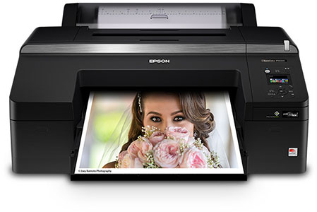
*The best resolution is your printer's native resolution.*

### Is there such a thing as *too much* resolution?

What if your image resolution is *higher* than your printer's native resolution? Do you need to downsample the image to make it smaller? No, you don't. It's perfectly okay to send the printer more pixels than it needs, and it will help to make sure your image looks as sharp as it possibly can.

## How to change the print size

So now that we know how image resolution affects print size, and the minimum resolution we need for high quality prints, let's look at how to *change* the print size. To change it, with the Resample option turned off, just enter the new print size into the **Width** and **Height** fields.  Since the Width and Height are linked together, changing one will automatically change the other. 

### Matching the aspect ratio and orientation of the image

Note, though, that you'll only be able to enter a size that matches the current *aspect ratio* of the image. So for example, if your image uses a 4 x 6  aspect ratio, as mine does, you won't be able to print it as an 8 x 10. The aspect ratios don't match. To print the image to a different aspect ratio, you'll first need to crop it, and I'll show you how to do that later.

Along with the aspect ratio, you'll also want to be aware of the *orientation* of your image. If the image is in *portrait* orientation, where the width is smaller than the height, then you'll want to set the width to the smaller of the two values. And if it's in *landscape* mode, where the width is larger than the height, set the width to the larger value.

### Changing the width and height

For example, let's say I want to print my image as a 4" x 6". I  know that it's in landscape orientation, with the width larger than the height, so I'll set the Width value to 6 inches. Photoshop automatically sets the Height to 4 inches, or in this case, to 3.999 inches, to match the aspect ratio:

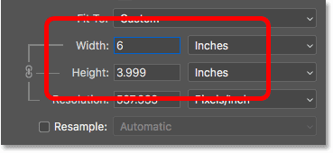
*Entering a Width value automatically sets the Height value.*

If I wanted the height to be exactly 4 inches, I could change the Height value to 4 inches, which would then change the Width  to 6.001 inches. So the aspect ratio of my image isn't *exactly* 4 x 6, but  it's close enough:

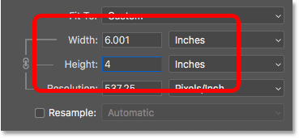
*Changing the Height automatically changes the Width.*

### Checking the image resolution

Notice that the Resolution value is also linked to the Width and Height. And by lowering the width and height, the resolution has increased, from 300 pixels/inch up to 537.25 pixels/inch. That's because we need to pack *more* pixels per inch in order to print the image at the smaller size. But, since the new resolution is much higher than the minimum resolution we need (300 pixels/inch), there's no need to upsample it. This image will look great just the way it is:

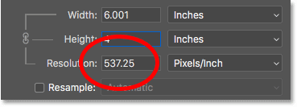
*Lowering the width and height raised the resolution.*

### Checking the image size

Also, notice that changing the print size had no effect on the actual image size, in pixels or in megabytes. It's still the exact same image, and all we've done is changed the size that it will print:

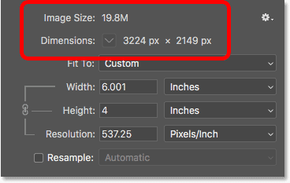
*The print size has no effect on anything else.*

## When to enlarge the image

But let's say that, instead of printing it as a 4" x 6" (or 6" x 4", in this case), I need to double the width and height so that it prints at 12"  by 8". I'll change the Height value from 4 to 8 inches, and Photoshop  automatically doubles the Width, from 6 to 12 inches. Notice, though, that by doubling the width and height, we've cut the Resolution value in half, and it's now *below* the minimum resolution we need of 300 pixels/inch:

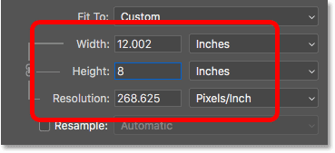
*Increasing the width and height dropped the resolution below 300 ppi.*

Going back to what we learned earlier, some people would say that any resolution over 240 pixels/inch is fine, and so our new resolution of roughly 268 ppi is okay. But, since your printer's native resolution is  300 ppi (or 360 ppi for Epson printers), and the printer will upsample the image on its own if we don't do it ourselves, there's no reason for us not to upsample it here in the Image Size dialog box. Doing so will give us better results than if we left it up to the printer.

## How to upsample an image

To upsample the image, turn the **Resample** option on:

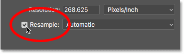
*Clicking the Resample checkbox.*

Then enter the resolution you need into the **Resolution** field. Again, for most printers, it's 300 ppi, or 360 ppi for Epson printers:

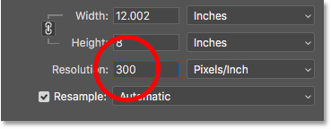
*Entering the new resolution.*

### Checking the width and height

Notice that with Resample turned on, the Resolution field is no longer linked to the Width and Height fields. So even though we've increased the resolution, the image is still going to print 12" wide and 8" tall:

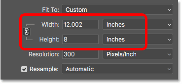
*Changing the resolution had no effect on the width and height.*

### Checking the image size

What *has* changed this time is the actual size of the image, both in pixels and in megabytes. With Resample turned on, increasing the resolution forced Photoshop to add more pixels. If you remember, my image was originally 3224 px wide and 2149 px tall. But after resampling it, the width has increased to 3601 px and the height is now up to 2400 px.

Also, because we've added more pixels, the size of the image in memory has increased as well, from 19.8 megabytes to 24.7 megabytes:

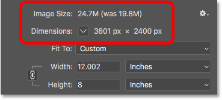
*Upsampling the image increased the pixel dimensions and the file size.*

### The Interpolation method

Whenever we resample an image, Photoshop adds or removes pixels. And the method it uses to do that is known as the *interpolation* method. There are several interpolation methods to choose from, and the differences between them can have a big impact on the quality of the image.

You'll find the **Interpolation** option to the right of the Resample option. By default, it's set to **Automatic**. Interpolation only applies to resampling. So when the Resample option is turned off, the Interpolation option is grayed out:

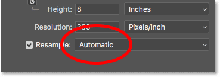
*The Interpolation option. Only available when Resample is checked.*

#### Choosing an interpolation method

If you click on the option, you'll open a list with all the different interpolation methods to choose from. Some are for upsampling, and others for downsampling:

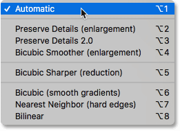
*The interpolation methods.*

Learning how each one works would take an entire lesson on its own. But luckily, you don't really need to know anything about them. By default, the Interpolation option is set to **Automatic**, which lets Photoshop choose the one that will work best. Leaving it set to Automatic is a safe choice.

#### Preserve Details 2.0

However, in Photoshop CC 2018, Adobe added a *new* upscaling method known as **Preserve Details 2.0**. This new method is now the best choice for enlarging your images. But the problem is that, for now at least, Photoshop will not select it if you leave the Interpolation option set to Automatic. So if you're using CC 2018 (or later) and you're upsampling your image, you'll want to change the interpolation method from Automatic to Preserve Details 2.0:

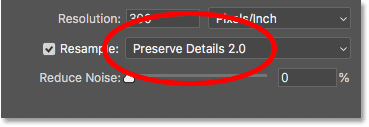
*In CC 2018, choose Preserve Details 2.0 when upsampling an image.*

If you're not seeing Preserve Details 2.0 in the list, you'll first need to enable it in Photoshop's Preferences. I cover how to do that, and why it's the best choice, in my [Best Way to Enlarge Images in CC 2018](/basics/upscale-images-photoshop-cc-2018/ "View tutorial") tutorial.

## How to resize an image for print -  Quick summary

Before we continue and look at how to resize an image to a different aspect ratio, let's quickly summarize what we've learned.

To resize an image for print, open the Image Size dialog box (Image > Image Size) and start by turning the **Resample** option **off**. Enter the size you need into the **Width** and **Height** fields, and then check the **Resolution** value. If the resolution is the *same*, or *higher*, than your printer's native resolution (300 ppi for most printers, or 360 ppi for Epson printers), then there's nothing more you need to do.

If the resolution is *less* than your printer's native resolution, upsample the image by turning the **Resample** option **on**. Then set the **Resolution** value to **300 pixels/inch** (or **360 **for Epson printers). Leave the **Interpolation** method set to **Automatic**, or in Photoshop CC 2018 (or later), change it to **Preserve Details 2.0**.

## How to resize to a different aspect ratio

Earlier, I mentioned that you can only choose a print size that matches the current aspect ratio of the image. But what if you need a *different* aspect ratio? For example, what if I need to print my 4 x 6 image so that it will fit within an 8" x 10" photo frame?

### The problem with different aspect ratios

We can already see the problem. With the Height set to 8 inches, the Width is set to 12 inches, not 10, so that's not going to work:

*Setting the height gives me the wrong width.*

If I try changing the Width to 10 inches, the Height becomes 6.666 inches. Still not what I want:

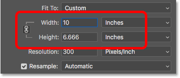
*Changing the width  gives me the wrong height.*

And if I change the Width to 8 inches, Photoshop sets the Height to 5.333 inches. There's no way for me to choose an 8" x 10" print size while my image is using a 4 x 6 aspect ratio:

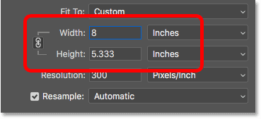
*No matter what I do, I can’t get the size I need.*

### How to crop to a different aspect ratio

To resize the image to print at a different aspect ratio, we first need to crop the image to the new ratio. Here's how to do it.

#### Step 1: Cancel the Image Size command

Close the Image Size dialog box without making any changes by clicking the **Cancel** button at the bottom:

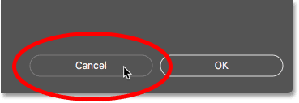
*Canceling and closing the Image Size command.*

#### Step 2: Select the Crop Tool

In the Toolbar, select the **Crop Tool**:

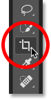
*Selecting the Crop Tool.*

### Step 3: Set the new aspect ratio in the Options Bar

Then in the Options Bar, enter your new aspect ratio into the **Width** and **Height** boxes. Don't enter a specific measurement type, like inches. Just enter the numbers themselves. I'll enter 8 and 10:

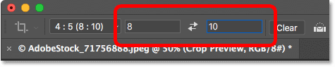
*Entering the new aspect ratio in the Options Bar.*

### Step 4: Resize the crop border if needed

Photoshop instantly reshapes the crop border to the new ratio. You can resize the border if needed by dragging the handles, but I'll  just leave mine the way it is:

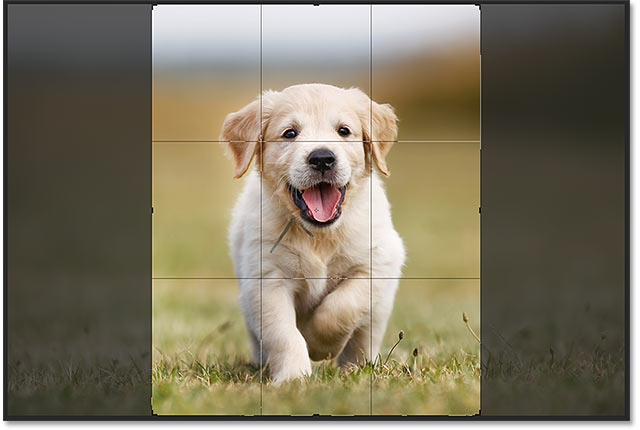
*Cropping the image to the new aspect ratio.*

### Step 5: Crop the image

Back in the Options Bar, make sure the **Delete Cropped Pixels** is turned off. This way, you won't be making any permanent changes:

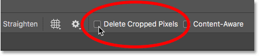
*Leave Delete Cropped Pixels turned off.*

Then, to crop the image to the new ratio, click the **checkmark** in the Options Bar:

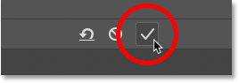
*Clicking the checkmark.*

And here’s the image, now cropped to the 8 x 10 aspect ratio. It still won’t *print* at 8” by 10” yet, but we know how to fix that, which we’ll do next:

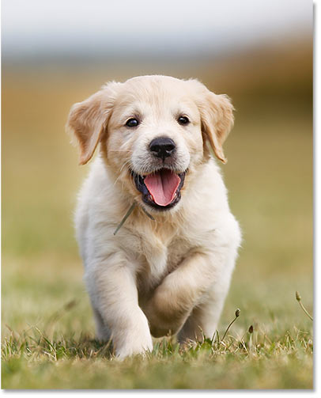
*The cropped version of the image.*

### Step 6: Resize the image in the Image Size dialog box

At this point, to resize the image for print,  just follow the same steps we've already learned. First, open the Image Size dialog box by going up to the **Image** menu and choosing **Image Size**:

*Going to Image > Image Size.*

Uncheck the **Resample** option, and then enter your new print size into the **Width** and **Height** fields. This time, I have no trouble choosing an 8" by 10" size, although the Width value is just slightly off at 8.004 inches. Still close enough.

Notice, though, that the **Resolution** value has dropped below 300 pixels/inch, which means I'll need to upsample it:

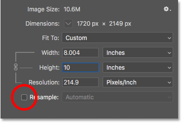
*Turn Resample off, enter the new Width and Height, and then check the Resolution.*

To upsample it, I'll turn the **Resample** option on, and then I'll change the **Resolution** value to **300 pixels/inch**. Or again, if the image was heading to an Epson printer, I would enter **360 ppi** instead:

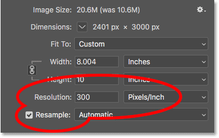
*Turning on Resample, then setting the Resolution to 300 ppi.*

Finally, for the **Interpolation** method, I could either leave it set to **Automatic**, or since I'm using Photoshop CC 2018, I'll change it to **Preserve Details 2.0**:

*Setting the interpolation method.*

When you're ready to resize the image, click OK to accept your settings and close the Image Size dialog box:

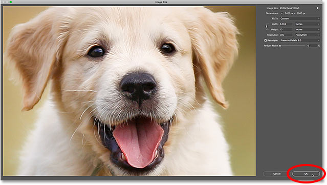
*Click OK to resize the image.*

And there we have it! That's everything you need to know to resize images for print in Photoshop! In the next lesson, we'll learn how to [resize images for email and sharing online](/basics/how-to-resize-images-for-email-and-photo-sharing-with-photoshop/ "View tutorial")!

You can jump to any of the other lessons in this [Resizing Images in Photoshop](/basics/how-to-resize-images-in-photoshop-complete-guide/ "View the complete Image Resizing guide") chapter. Or visit our [Photoshop Basics](/basics/ "Learn more") section for more topics!