# How to Resize Pixel Art in Photoshop

> Source: [https://www.photoshopessentials.com/basics/how-to-resize-pixel-art-in-photoshop/](https://www.photoshopessentials.com/basics/how-to-resize-pixel-art-in-photoshop/)
> Downloaded and converted to Markdown.

Need to resize pixel art? Learn how to enlarge your artwork and keep those blocky shapes looking crisp and sharp with Photoshop!

In this tutorial, you'll learn how to get great results when resizing pixel art in Photoshop! Pixel art is different from standard images and presents unique challenges when resizing it. Normally when enlarging an image and adding more pixels, Photoshop tries to prevent the result from looking blocky and pixelated by blending the pixels together and smoothing everything out.

But "blocky and pixelated" is the whole point of pixel art! So to resize pixel art, we need a way for Photoshop to just add more pixels, and that's it. Instead of smoothing things out, we need to keep the shapes and the edges of the artwork looking crisp and sharp. In this lesson, I'll show you exactly how to do it.

Along with resizing pixel art, I also use this same technique for resizing screenshots used in my tutorials. And you can use it to resize any graphic where you need to maintain sharp, hard edges or readable text. To get the best results with this lesson, you'll want to be using [Photoshop CC](https://prf.hn/l/dlXjD2w), but any version of Photoshop will work.

I'll use this [little pixel art character](https://prf.hn/l/8x3waQp) that I downloaded from Adobe Stock:

*Our pixel art hero. Credit: Adobe Stock.*

This is lesson 7 in my [Resizing Images in Photoshop](/basics/how-to-resize-images-in-photoshop-complete-guide/) series.

Let's get started!

## How to enlarge pixel art in Photoshop

Here's the character open in Photoshop. And as you can see, he's looking pretty small:

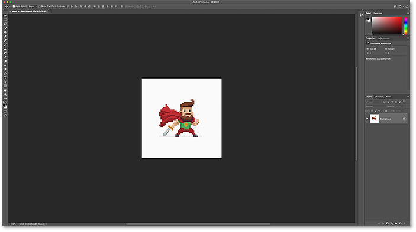
*The pixel art at its original size.*

### Step 1: Open the Image Size dialog box

The best way to enlarge pixel art is by using Photoshop's Image Size dialog box. To open it, go up to the **Image** menu in the Menu Bar and choose **Image Size**:

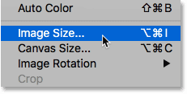
*Going to Image > Image Size.*

In Photoshop CC, the dialog box includes a handy preview window on the left, along with the image size options on the right:

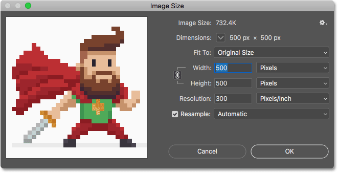
*The Image Size dialog box in Photoshop CC.*

#### Viewing the current image size

The current size of the image is found at the top. Next to the word **Dimensions**, we see that my artwork is pretty small, with a width and height of just 500 pixels:

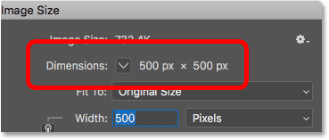
*The current pixel dimensions of the artwork.*

### Step 2: Turn on the Resample option

Let's say I need to make my character much bigger. Maybe I want to use him in a poster or as a desktop background. To do that, I'll need to enlarge the artwork by adding more pixels.

First, make sure that the **Resample** option in the dialog box in turned **on**. With Resample off, the pixel dimensions are locked and all we can change is the [print size](/basics/how-to-resize-images-for-print-with-photoshop/). To add or remove pixels, Resample needs to be on:

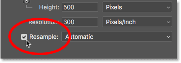
*Resample should be on.*

### Step 3: Enter a percentage into the Width and Height boxes

Rather than upsampling pixel art to a specific size, the best way to enlarge it is by using *percentages*. And to avoid distortions and keep each block in the artwork perfectly square, you'll want to stick to percentages that are *multiples of 100* (so 200%, 300%, 400%, and so on). I'll enlarge the image by setting both the **Width** and **Height** to **400 Percent**:

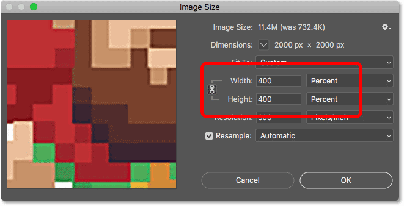
*Upsampling the width and height by 400 percent.*

This will increase the pixel dimensions from 500 px by 500 px up to **2000 px by 2000 px**:

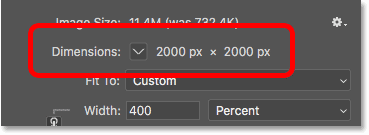
*The new pixel dimensions after resizing the artwork.*

### Resizing the preview window

Notice that, by making the width and height 4 times larger, the artwork is now too big to fit within the small preview window. To make the preview window bigger, I'll make the Image Size dialog box itself bigger by dragging the bottom right corner outward. Then, I'll click and drag inside the preview window to center the artwork inside it:

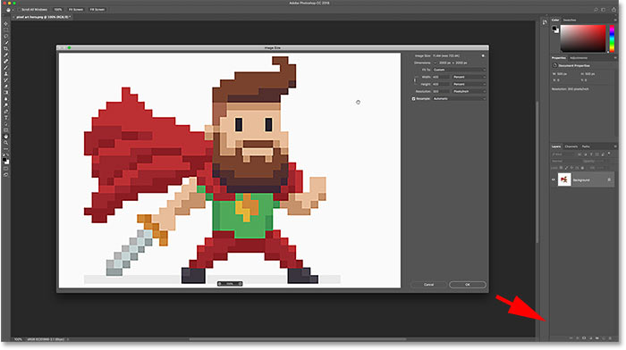
*Resizing the Image Size dialog box for a larger preview.*

[Learn more: Photoshop CC's Image Size dialog box - Features and Tips](/basics/photoshops-image-size-command-features-and-tips/)

### The problem with resizing pixel art

So far so good. Or is it? If we look at the artwork in the preview window, we see that it doesn't look right. Instead of the edges around the shapes looking crisp and sharp, they're looking a bit soft and blurry:

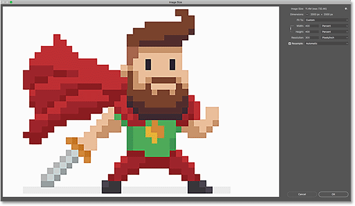
*The edges look too soft after enlarging the artwork.*

And if we look closer, we can see *halos* around the shapes, especially in higher contrast areas. I'll zoom in on the artwork using the **zoom buttons** at the bottom of the preview window. And here, at a zoom level of 400%, we can clearly see the halos, especially around the character's eyes:

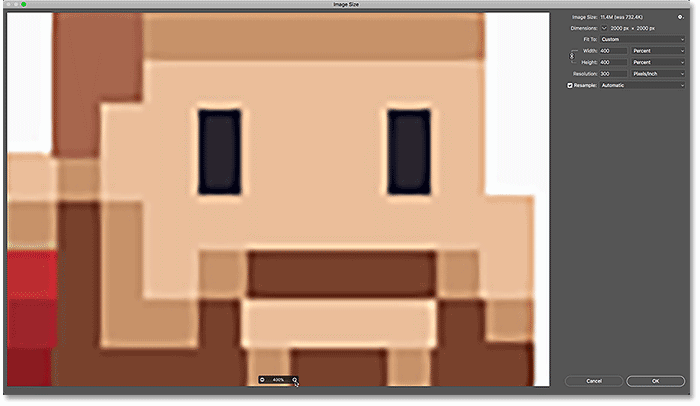
*Enlarging the pixel art blurred the shapes and added halos around them.*

Notice, though, that if you *click and hold* on the artwork in the preview window, the halos disappear and the edges look very sharp, which is exactly what we want:

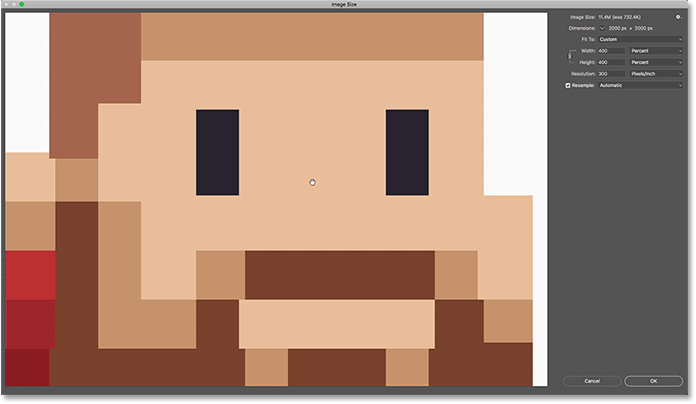
*The pixel art looks great when you click and hold.*

But as soon as you *release* your mouse button, you're back to seeing the halos:

*The softness and halos return when the mouse button is released.*

### The image interpolation method

The reason is that when you click and hold in the preview window, you're seeing the upsampled artwork *before* Photoshop applies any *image interpolation*. Interpolation is how Photoshop averages the pixels together and smooths out the result. When you release your mouse button, you see the artwork with the interpolation applied. And it's the interpolation method that's causing the problems and creating that halo effect.

The **Interpolation** option is found to the right of the Resample option. And by default, it's set to **Automatic**:

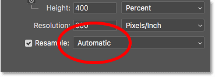
*The image interpolation option.*

Usually, the Automatic setting is fine because it lets Photoshop choose the best method for the job. But the problem here is that Photoshop assumes we're resizing a standard image with lots of fine detail. So it's choosing a method that would make a standard image look good. But that same method makes pixel art, and similar types of graphics, look bad. So when upsampling pixel art, we need to choose a different interpolation method ourselves.

### Step 4: Set the interpolation method to Nearest Neighbor

To do that, click on the Interpolation option to open a list of the methods we can choose from. If you're using Photoshop CC, then the interpolation method Photoshop chooses for upsampling images is **Preserve Details**. And in Photoshop CS6, it chooses **Bicubic Smoother**. But neither of them work well with pixel art:

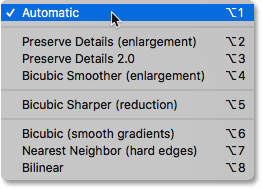
*Photoshop's interpolation methods.*

To upsample your artwork without averaging the pixels, the interpolation method you need is **Nearest Neighbor**:

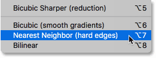
*Choosing Nearest Neighbor.*

As soon as you choose Nearest Neighbor, the artwork in the preview window looks crisp and sharp! And if you click and hold in the preview window, and then release your mouse button, you'll see that this time, nothing happens. The artwork looks just as sharp before *and after* the interpolation method is applied.

That's because it's now the *same* interpolation method both times. Photoshop always adds the pixels initially using Nearest Neighbor. But now that we've chosen Nearest Neighbor ourselves, it's not using anything else that would cause the pixel art to look worse:

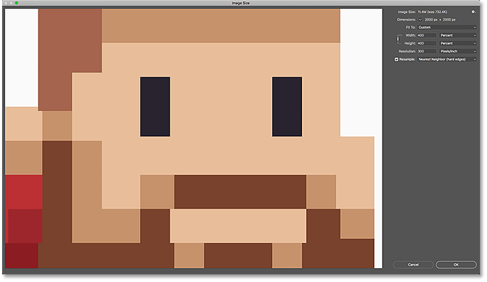
*Nearest Neighbor is perfect for upsampling pixel art.*

### Step 5: Click OK

When you're ready to upsample the artwork, click OK to accept your settings and close the Image Size dialog box:

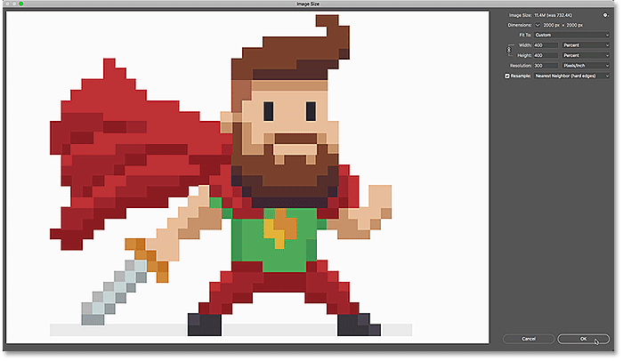
*Clicking OK to enlarge the pixel art and close the Image Size dialog box.*

And now, my little pixel art hero looks a whole lot bigger, yet he still maintains the same blocky, pixelated look that we'd expect:

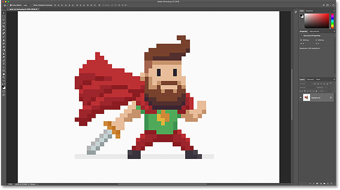
*The upsampled pixel art.*

### How to enlarge pixel art - Quick summary

Before we go any further, let's quickly summarize the steps for getting the best results when enlarging pixel art in Photoshop.

- 1. Open the Image Size dialog box (Image > Image Size).
- 2. Set the Width and Height to Percent, and then for best results, choose a percentage that's a multiple of 100 (200%, 300%, 400%, and so on).
- 3. Change the interpolation method to Nearest Neighbor.
- 4. Click OK.

## How to resize pixel art to an exact size

So far, we've learned that the best way to enlarge pixel art is by upsampling it using a percentage that's a multiple of 100. But what if you need to enlarge it to specific pixel dimensions, and you can't get there using one of those percentages?

For example, by upsampling my artwork by 400%, I've enlarged the width and height from 500 pixels up to 2000 pixels:

*The dimensions of the upsampled artwork.*

But what if I needed the width and height to be something a bit smaller, like 1600 pixels? If I had upsampled my 500 px x 500 px image by 300%, it would have made the width and height only 1500 pixels, leaving it still too small. And upsampling it by 400% made it too big. What I really needed was something in between. In that case, what you'll want to do is resize the artwork in *two steps*.

### Step 1: Upsample the pixel art as a percentage

First, upsample the pixel art using a percentage, and a multiple of 100, that will make it *larger* than you need. In my case, I've already done that by upsampling it by 400%, so the first step is done.

### Step 2: Re-open the Image Size dialog box

Then, resize it a second time, this time to *downsample* it to the exact pixel dimensions. To do that, open the Image Size dialog box once again by going up to the **Image** menu and choosing **Image Size**:

*Going to Image > Image Size.*

### Step 3: Leave the Resample option turned on

Make sure the **Resample** option is still **on** so you can change the number of pixels:

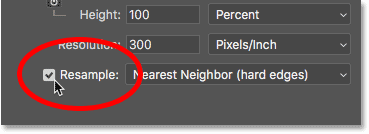
*Leaving the Resample option checked.*

### Step 4: Set the Width and Height, in pixels

Enter the exact size you need, in **pixels**, into the **Width** and **Height** fields. I'll set them both to 1600 pixels:

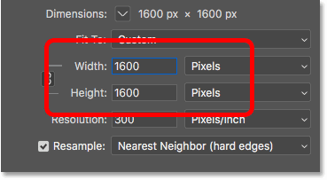
*Entering the new pixel dimensions.*

### Step 5: Set the interpolation method to Automatic

And finally, while the Nearest Neighbor interpolation method works great for *upsampling* pixel art, you don't want to use it when downsampling. Instead, for the sharpest results, change the interpolation method back to **Automatic**. This will hand control back to Photoshop, and when downsampling images, it will automatically choose **Bicubic Sharper**:

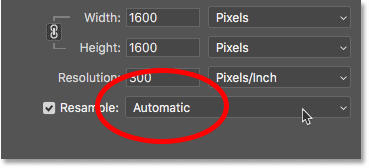
*Setting the interpolation method back to Automatic.*

When you're ready to resize the artwork to the exact size, click OK to close the dialog box, and you're done:

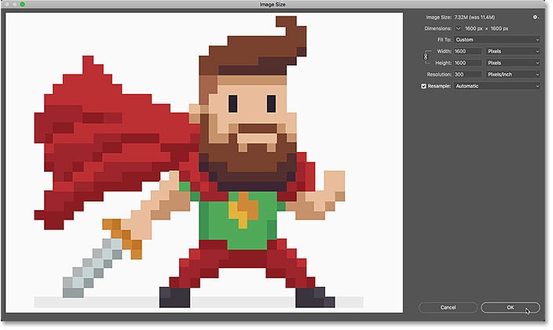
*Clicking OK to downsample the pixel art.*

And there we have it! That's how to get the best results when resizing pixel art, screenshots, or similar graphics, in Photoshop! In the next and final lesson in this series, we'll look at the best way to enlarge images in Photoshop using a brand new feature known as [Preserve Details 2.0](/basics/upscale-images-photoshop-cc-2018/)!

You can jump to any of the other lessons in this [Resizing Images in Photoshop](/basics/how-to-resize-images-in-photoshop-complete-guide/) chapter. Or visit our [Photoshop Basics](/basics/) section for more topics!