# How to Rotate and Straighten Images in Photoshop

> Source: [https://www.photoshopessentials.com/basics/how-to-rotate-and-straighten-images-in-photoshop-cc/](https://www.photoshopessentials.com/basics/how-to-rotate-and-straighten-images-in-photoshop-cc/)
> Downloaded and converted to Markdown.

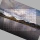

Learn a good way, a better way and the best way to rotate and straighten images with Photoshop in part 2 of our Cropping Images series!

We'll start by learning how to rotate an image by hand using the Crop Tool. Then, we'll learn how to more accurately straighten an image using the Straighten Tool. Finally, we'll look at a lesser-known but arguably the best way to rotate and straighten images in Photoshop, and that's by using the Ruler Tool.

As I mentioned, this is the second tutorial in our series on cropping images. If you're not yet familiar with the basics of using the Crop Tool, you'll want to read through the first tutorial, [How to Crop Images in Photoshop](/basics/how-to-crop-images-photoshop-cc/), before you continue.

Here's a photo I shot from the deck of a ship in Alaska (you can see part of the ship sticking out from the right side of the image). I don't know if I was getting sea sick or what the story was, but obviously, the image is a little crooked. Let's learn how to easily rotate and straighten it. You can follow along with any image of your own:

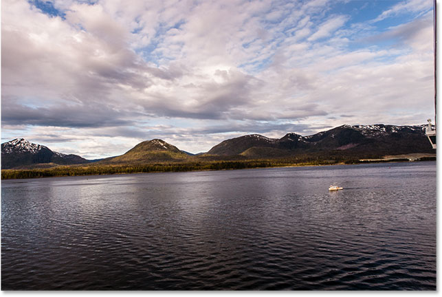
*The original image. © Steve Patterson.*

This is lesson 2 in our [Cropping Images in Photoshop](/basics/cropping-images-in-photoshop-complete-lesson-guide "View chapter") series.

Let's get started!

### How to rotate an image with the Crop Tool

The first thing we'll learn is how to simply rotate an image by hand. We do that using the **Crop Tool**. I'll select the Crop Tool from the [Toolbar](/basics/the-new-customizable-toolbar-in-photoshop-cc-2015/) along the left of the screen:

*Selecting the Crop Tool.*

As soon as I select the Crop Tool, Photoshop surrounds the image with an initial **crop border**. As we learned in the [how to crop images](/basics/how-to-crop-images-photoshop-cc/) tutorial, I could ignore this default crop border and instead click and drag within the image to draw my own. But, since I want to rotate and straighten the image before I crop it, I'll stick with the default crop border for now.

To make the crop border more visible, I'll click on the image with the Crop Tool. This displays the *Rule of Thirds* 3 x 3 grid in front of the image:

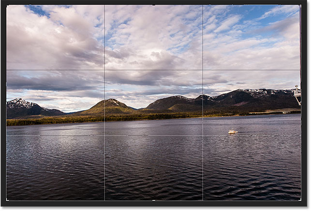
*The initial crop border surrounding the image.*

To rotate the image, move your mouse cursor anywhere outside the crop border. Your cursor will change into a **Rotate** icon (a curved line with an arrow on each end). I've zoomed in on it here to get a closer look after moving my cursor outside the upper right corner of the image:

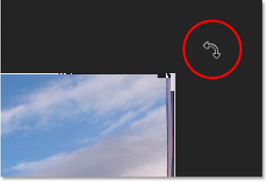
*The Rotate cursor appears outside the crop border.*

With your mouse cursor outside the crop border, click your mouse button and keep it held down. As soon as you click, the 3 x 3 grid will change into a more detailed grid:

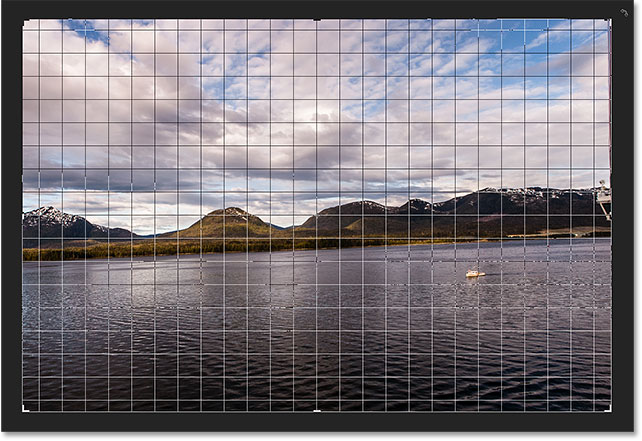
*A different grid appears when you click and hold your mouse button.*

Then, with your mouse button still held down, drag your mouse to rotate the image. As you're rotating it, look for something in the image that should be straight, either vertically or horizontally, and try to align it with the grid lines. Here, I'm using the water line just below the mountains as my guide:

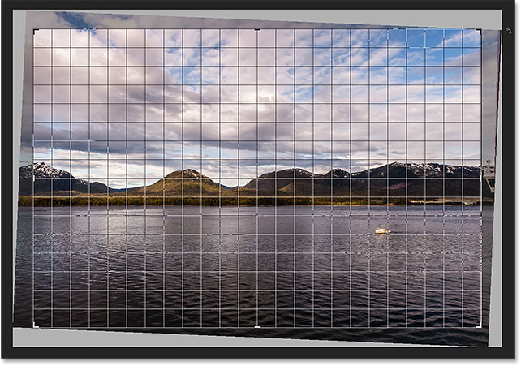
*Aligning the water line with the grid lines as I rotate the image.*

Notice that as you rotate, Photoshop automatically resizes the crop border to keep it within the boundaries of the image. Here, I've rotated it too far just so we can see how much smaller the crop border has become:

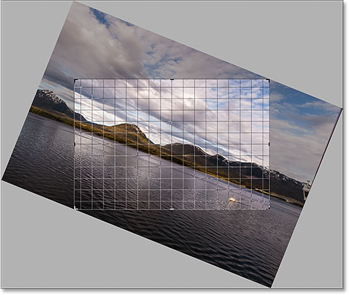
*Photoshop keeps the crop border within the image boundaries as you rotate.*

I'll rotate the image back to the way I had it so that the water line and the horizontal grid lines match up:

*Rotating the image until it appears straight.*

Once the image looks straight, release your mouse button. The overlay in front of the image will switch back to the Rule of Thirds 3 x 3 grid:

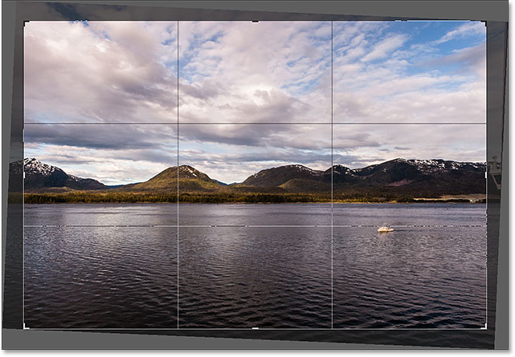
*The Rule of Thirds grid returns when you release your mouse button.*

At this point, you can resize the crop border as needed by clicking and dragging any of the **handles** around the border. I covered resizing the crop border in detail in our [first lesson](/basics/how-to-crop-images-photoshop-cc/) in this chapter. So here, I'll quickly resize the border to make it a bit smaller, and I'll click and drag inside the crop border to reposition the image:

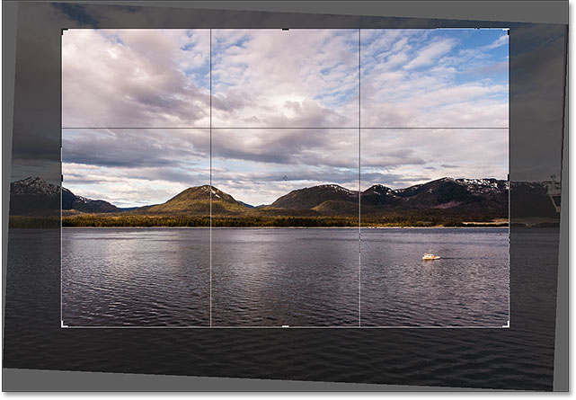
*Resizing the crop border and repositioning the image after rotating it.*

When you're happy with how things look, press **Enter** (Win) / **Return** (Mac) on your keyboard to commit the crop. Here's my result, a definite improvement over the original version:

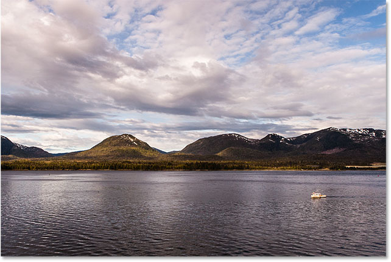
*The rotated and cropped image.*

### How to straighten an image with the Straighten Tool

So far, we've seen how to rotate an image by hand. Let's look at how to straighten an image using Photoshop's **Straighten Tool**.

First, I'll undo my crop by going up to the **Edit** menu in the Menu Bar along the top of the screen and choosing **Undo Crop**. Or, I could simply press **Ctrl+Z** (Win) / **Command+Z** (Mac) on my keyboard:

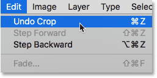
*Going to Edit > Undo Crop.*

This returns my image back to the way it looked originally:

*Back to the original, uncropped image.*

The Straighten Tool is somewhat of a hidden tool in Photoshop. You won't find it anywhere in the Toolbar. Instead, you'll find it in the **Options Bar** whenever you have the **Crop Tool** selected.

I'll reselect the Crop Tool from the Toolbar:

*To use the Straighten Tool, we first need to select the Crop Tool.*

Then, with the Crop Tool active, I'll select the **Straighten Tool** from the Options Bar along the top of the screen:

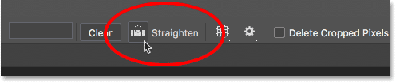
*Selecting the Straighten Tool from the Options Bar.*

Using the Straighten Tool is very simple. Just look for something in your image that should be straight, either horizontally or vertically, and draw a line across it with the Straighten Tool. Photoshop will then use the angle of the line to automatically rotate and straighten the image.

Since the water line in my photo should be horizontal, I'll click on the left side of it to set a starting point for the line. Then, with my mouse button still held down, I'll drag across to the right side of the water line to set the end point. Photoshop draws a thin, straight line between the two points:

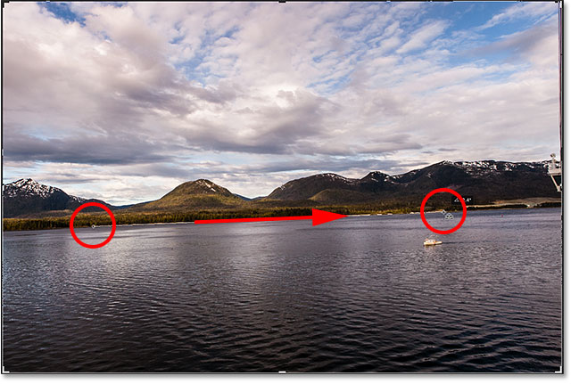
*Click on one side of something that should be straight, then keep your mouse button held and drag to the other side.*

When I release my mouse button, Photoshop looks at the angle of the line and instantly rotates the image so that the water line appears straight. Notice that once again, Photoshop has also resized the crop border to keep it within the boundaries of the image:

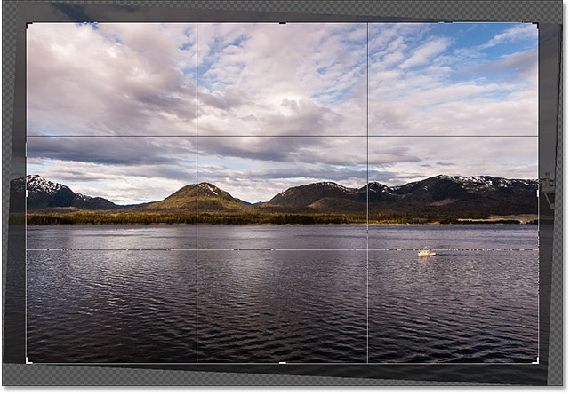
*Photoshop straightens the image when you release your mouse button.*

**Quick Tip:** Here's a handy tip for using the Straighten Tool. You don't actually need to select it from the Options Bar. Instead, with the Crop Tool active, you can quickly switch to the Straighten Tool just by pressing and holding the **Ctrl** (Win) / **Command** (Mac) key on your keyboard.

Now that the image has been straightened, I'll again resize my crop border by dragging the handles, and I'll click and drag inside the border to reposition the image and adjust the composition:

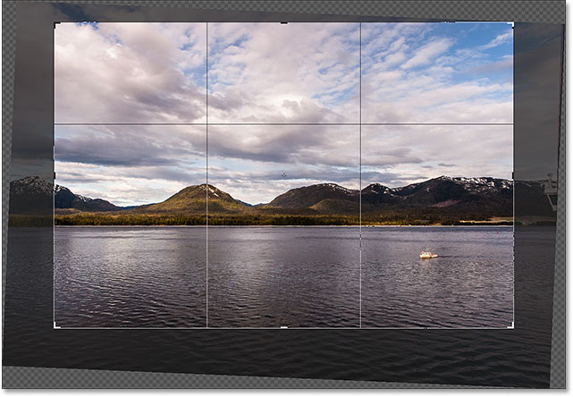
*Resizing the crop border and repositioning the image once again.*

I'll press **Enter** (Win) / **Return** (Mac) on my keyboard to commit the crop, and here's the result after straightening the image with the Straighten Tool:

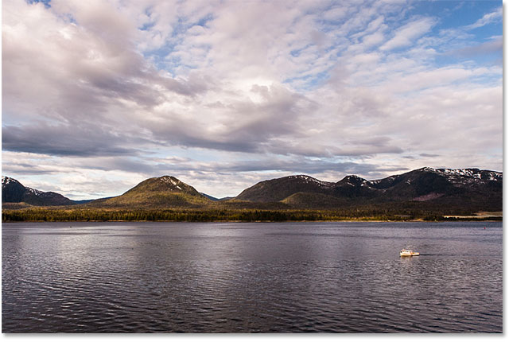
*The cropped version after using the Straighten Tool.*

### How to straighten an image with the Ruler Tool

Let's look at one more way to straighten an image in Photoshop, and why it's my favorite of the three. This time, we won't be using the Crop Tool or the Straighten Tool. Instead, we'll use the **Ruler Tool**.

Before we do, I'll quickly undo my last crop by once again going up to the **Edit** menu and choosing **Undo Crop**, or by pressing **Ctrl+Z** (Win) / **Command+Z** (Mac) on my keyboard:

*Going to Edit > Undo Crop.*

This returns me to the original, uncropped version:

*The original, crooked image.*

By default, the Ruler Tool is nested behind the **Eyedropper Tool** in the Toolbar. To select it, **right-click** (Win) / **Control-click** (Mac) on the Eyedropper Tool, then choose the Ruler Tool from the fly-out menu:

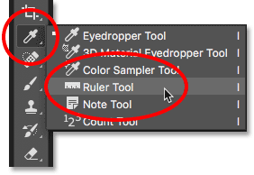
*Selecting the Ruler Tool from behind the Eyedropper Tool.*

Using the Ruler Tool to straighten an image is similar to using the Straighten Tool, but with a couple of important differences. Like the Straighten Tool, we start by drawing a line across something in the image that should be straight, either vertically or horizontally.

I'll click on the left side of the water line in my photo to set a starting point for the line. Then, with my mouse button still held down, I'll drag across to the right side to set the end point. Just like with the Straighten Tool, Photoshop draws a thin, straight line between the two points, and it will use the angle of this line to figure out how much it needs to rotate the image:

*Click and drag with the Ruler Tool across something that should be straight.*

But here's the first big difference between the Straighten Tool and the Ruler Tool, and why I prefer using the Ruler Tool. With the Straighten Tool, the moment you release your mouse button, Photoshop rotates the image to straighten it. That may seem like a nice feature, but it really isn't because it means that you only get one shot at drawing the line correctly. If the start or end point was a bit off, then the angle of the line will also be off, and the image will still be crooked even after it's been rotated.

With the Ruler Tool, though, Photoshop does *not* automatically rotate the image. Instead, we're free to go back and make adjustments to the start and end points as needed.

If I zoom in on my starting point, we can see that it's not actually on the water line where it should be. Instead, it's a bit too low:

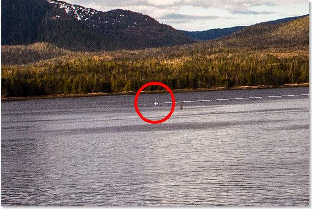
*The starting point of the line is not where I wanted it.*

To fix it, all I need to do is click on the starting point with the Ruler Tool, keep my mouse button held down, and drag the point upward to reposition it. The Straighten Tool doesn't give us the chance to do this, but with the Ruler Tool, it's easy:

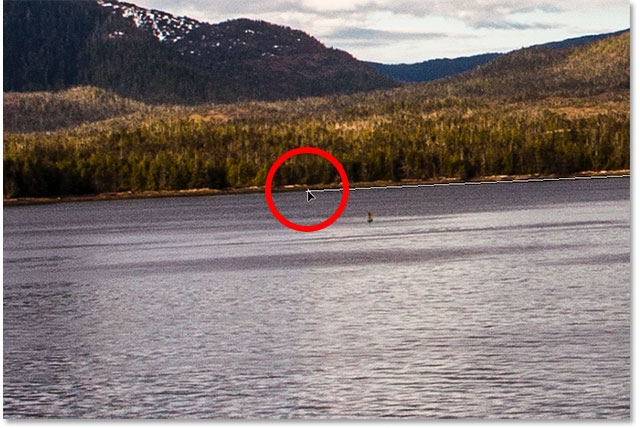
*Moving the starting point up to the water line.*

I'll do the same thing with the end point on the right, where we see that it's a bit too high:

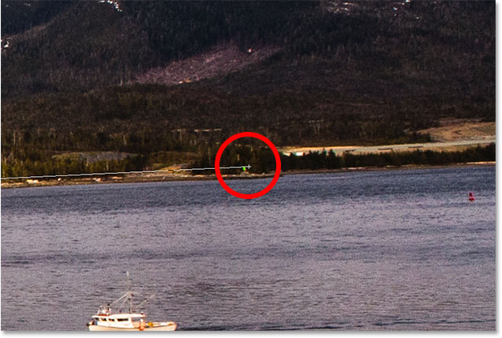
*The end point is also not where I wanted it.*

Again, all I need to do is click on it with the Ruler Tool, keep my mouse button held down, and drag it down onto the water line where it should be:

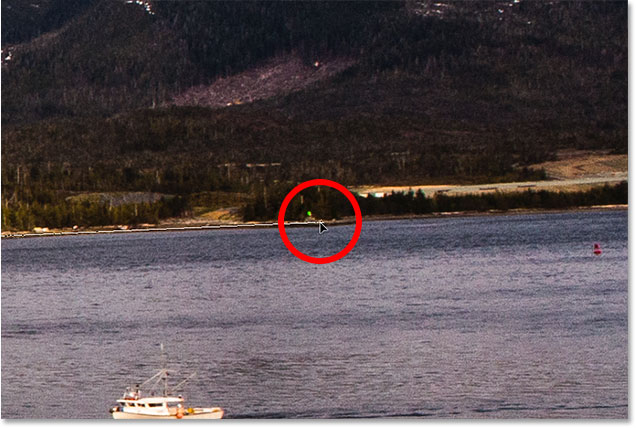
*Dragging the end point down to the water line.*

Once you have the start and end points exactly where you need them, to straighten the image, click the **Straighten Layer** button in the Options Bar:

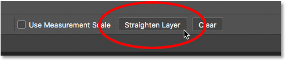
*Clicking the "Straighten Layer" button.*

Photoshop rotates the image to straighten it. Notice, though, that we're now seeing a **checkerboard pattern** in the corners around the image. The checkerboard pattern is how Photoshop represents **transparency**, which means that we no longer have any part of our image in those areas. We need to crop those areas away, which we'll do next:

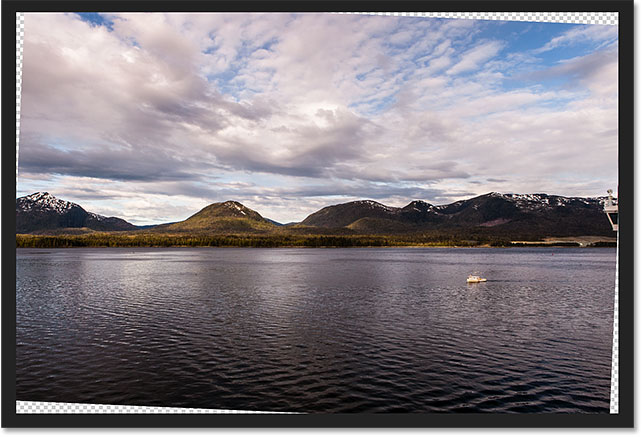
*The image has been straightened, but it no longer fills the entire canvas.*

This brings us to the other big difference between the Ruler Tool and the Straighten Tool. With the Ruler Tool, Photoshop makes no attempt to automatically crop the image after it’s been straightened. And in fact, there’s no way to crop the image using the Ruler Tool at all. That's okay, though, because all we need to do at this point is switch to the **Crop Tool**:

*Selecting the Crop Tool after straightening the image with the Ruler Tool.*

With the Crop Tool now selected, I'll quickly resize my crop border and reposition the image within in, making sure to stay clear of the transparent areas in the corners:

*Resizing the crop border and repositioning the image.*

Then, I'll press **Enter** (Win) / **Return** (Mac) on my keyboard to commit the crop. And here, after straightening the image with the Ruler Tool and then cropping it with the Crop Tool, is my final result:

*The straightened and cropped version of the image.*

And there we have it! That's how to rotate and straighten images using the Crop Tool, the Straighten Tool, and my personal favorite, the Ruler Tool, in Photoshop CC! In the next lesson, I show you how to use the Crop Tool to quickly [add a border around your photo](/basics/increasing-canvas-size-crop-tool-photoshop/ "View tutorial")!

You can jump to any of the other lessons in this [Cropping Images in Photoshop](/basics/cropping-images-in-photoshop-complete-lesson-guide "How to Crop Images in Photoshop - Complete Guide") series. Or visit our [Photoshop Basics](/basics/ "Learn more") section for more topics!