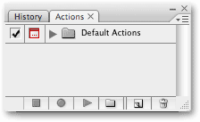
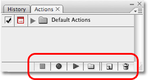
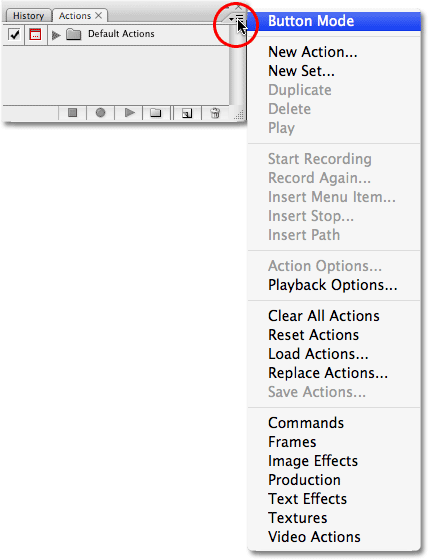

# How To Use Actions In Photoshop

> Source: [https://www.photoshopessentials.com/basics/photoshop-actions/how-to-use-actions/](https://www.photoshopessentials.com/basics/photoshop-actions/how-to-use-actions/)
> Downloaded and converted to Markdown.

In this series of tutorials, we're going to look at everything you need to know to get up and running with **Photoshop Actions**! We'll look at what Photoshop actions are and what the difference is between an action and an **action set**. We'll explore some of Photoshop's **Default Actions** as well as the **additional action sets** that install for free with Photoshop. We'll learn all about the **Actions palette**, how to **play an action**, how to **edit an action**, how to **view the details** of an action, how to **analyze an action** by playing through it one step at a time, how to **load**, **save** and **delete** actions, and of course, how to **record our very own actions** from scratch! There's lots to learn, so let's get started!

### Tutorial Quick Links...

If you want to learn everything you need to know about Photoshop actions, I highly suggest you read through the entire tutorial from beginning to end since each section builds on topics covered in the previous sections. If, for example, you skip straight to the section on how to record an action, you'll be missing out on quite a bit of information. However, if you do want to jump to a specific section, here's some handy links:

- [**Photoshop's Default Actions**](/basics/photoshop-actions/default-actions/) - A look at the actions that are automatically loaded into Photoshop!
- [**Photoshop's Additional Built-In Action Sets**](/basics/photoshop-actions/more-built-in-actions/) - Even more free actions that install with Photoshop!
- [**Stepping Through An Action**](/basics/photoshop-actions/step-through/) - Learn to analyze actions by playing them one step at a time!
- [**Editing An Action In Photoshop**](/basics/photoshop-actions/editing-an-action/) - Everything you need to know to edit and customize actions!
- [**Recording An Action**](/basics/photoshop-actions/record-action/) - Learn how to record your own actions from scratch!
- [**Saving And Loading Actions**](/basics/photoshop-actions/save-load-actions/) - How to make sure you don't lose your actions!

### Automating Photoshop With Actions - Introduction

Let's face it, you're lazy. It's okay, no one's looking. We're all friends here. Between you and me, though, you don't really like to work. At least, not when it comes to the boring stuff. Sure, you enjoy working when you get to do things that are fun, interesting or challenging. Everyone likes to show off their skills. But when it comes to those repetitive, mundane, no-brainer tasks (affectionately known as "grunt work") that seem to take up way too much of your life, even when you're on someone else's time, you'd be more than happy to pass those things off to someone else while you head off for a well-deserved extended coffee break.

What if you could pass many of those repetitive tasks off to Photoshop? What if there was a way that you could run through something once while Photoshop watches, paying close attention to each step, and then from that point on, whenever you need the work done, you could just let Photoshop do it for you? Good news! Photoshop is ready and willing to free you from the boredom of repetition! Of course, good news is usually followed by bad news, and the bad news is that Photoshop can't do absolutely *everything* for you, which is actually good news since we'd all be out of a job if it could. There are certain things that Photoshop simply can't do on its own. For example, you couldn't select someone in a photo with the Lasso Tool and then expect Photoshop to automatically know how to select someone in any photo from that point on. Maybe one day, but we're not quite there yet. Even so, there's still plenty of things Photoshop *can* do automatically for you once you show it how. In fact, as you become more familiar with using actions, learning what you can and can't do with them, and even how to get around some of the things you wouldn't normally think you'd be able to do, you'll probably find yourself coming up with some pretty amazing and elaborate stuff! Imagine completing work on a complicated, time-consuming, fifty-step photo effect and then being able to instantly recreate that same effect on a different photo, or on as many photos as you like, simply by pressing Play on an action! Now you're starting to see the possibilities!

Of course, actions can be used with much simpler tasks as well, as we'll see.

### Photoshop Actions: The Essential Non-Essentials, Essentially

Technically speaking, actions are not what you would call absolutely essential when working in Photoshop. By that, I mean there's nothing you can do in Photoshop *with* an action that you couldn't do *without* using an action. You could go your entire life without ever using them if you really wanted to. Actions were designed purely to make your life easier, sort of like how you could argue that it's not absolutely essential to know how to drive a car (or at least know someone who's willing to drive you around). Technically, you *could* walk from place to place and you'd eventually end up at your destination, but environmental, financial and health benefits aside, why spend hours getting there by foot when a car would have taken you to the same place in a fraction of the time?

Imagine that you had a hundred or even a thousand (or more!) photos that you had to resize for print or for the web, and you had to sit at your computer resizing each one individually. At best, you may find yourself getting really good at using keyboard shortcuts, but it would still take you a long time to resize them all, time that could have been spent taking more photos! With actions, you could resize one of the images, save the process as an action, and then let Photoshop automatically resize the rest for you! Or let's say you wanted to add a copyright watermark to all the photos. Again, you could add it to each image individually, or you could add it to one image, save the steps as an action, and then sit back while Photoshop does the rest! These are just a couple of basic examples of how you can put Photoshop to work for you using actions. With a little thought and some practice, there's no telling how many uses you'll come up with for them!

### Fear, Anxiety And Confusion, Oh My!

As amazingly helpful and wonderful as actions are, many Photoshop users, even long-time users, stay as far away from actions as possible, with fear, anxiety and confusion being the biggest reasons. Many people press the Record button and then suddenly feel like the little red button in the Actions palette is watching them, mocking them, laughing at them. Sweat starts pouring down their face, hands start shaking, and in no time, they're in the grips of a full-blown panic attack! The reason is because the controls for recording and playing actions look very much like the traditional controls you find on most recording devices, and since most recording devices record everything in real time, people mistakenly assume that once you press Record in the Actions palette, Photoshop is also recording everything in real time. They click through the steps as quickly as possible before Photoshop loses patience with them, which causes them to panic, which leads to mistakes that cause even more panicking. Then, suddenly, they realize they missed a step somewhere, the whole thing looks completely wrong, and before they know it, they're in such a mess that they hit the Escape key for dear life, promising themselves never to go through that nightmare again.

If this sounds like you, take a few deep breaths and relax. Just chill. There's absolutely no reason to rush or panic when recording actions because they are *not* recorded in real time. Let's say that again just to be clear. Actions are **not** recorded in real time. You could press the Record button, leave the house, go out for dinner and a movie, come back, watch some tv, take a shower, and then, hours later, come back to your computer to actually work through the steps necessary for your action and Photoshop wouldn't care. Not even a little. All Photoshop records are the steps themselves, not how long it took you to do them or how much time you wasted in between steps. Feel free to take as much time as you need recording an action. Even if you make a mistake, which you will from time to time no matter how long you've been using actions, you can easily go back and make changes later since actions are completely editable. Actions are meant to make your life easier, not stress you out.

### Actions Compatibility

Another great thing about actions is how portable they are. Generally speaking, you can record an action in any version of Photoshop and it will work in any other version of Photoshop! Actions are even cross-platform compatible, meaning that an action recorded on a PC will work on a Mac and vice versa!

Now, notice that I did say "generally speaking", and that's because you can run into situations where an action recorded in one version of Photoshop will not work in a different version, at least not without some editing. A little common sense, though, explains why. If you're recording an action in Photoshop CS3, for example, and your action uses a feature that's new in CS3, and then you load that action into an earlier version of Photoshop, one where the feature isn't available, the action won't work. Why? Because the action uses a feature that's only available in Photoshop CS3. In most cases, you should be fine using actions that were recorded in older versions of Photoshop, since most of the features from older versions are still available in the newest versions. But if you're recording an action in a newer version of Photoshop and you know it's going to be used with older versions, you'll want to stick to using features and commands that are available in older versions as well. See? Common sense stuff.

### The Actions Palette

A little later on, we'll see how to record a simple action so you can get a feel for how they work. Before we record anything though, we should first take a look at Command Central for actions in Photoshop - the *Actions palette*. The Actions palette is where anything and everything related to actions is done, from recording and playing them to saving, loading, editing, deleting, and organizing them. By default, the Actions palette is grouped in beside the History palette, even though the two palettes have nothing to do with each other. Also by default, the History palette is the one "in focus", meaning that it's the one visible while the Actions palette is hiding behind it. You'll need to click on the Actions palette's **name tab** to bring it to the front:

*The Actions palette.*

If, for some reason, the Actions palette is not open on your screen, you can access it by going up to the **Window** menu at the top of the screen and choosing **Actions**. As you can see, there really isn't much going on inside the Actions palette at first, but let's take a closer look at what's there.

### The Controls

If you look down at the very bottom of the Actions palette, you'll see a series of icons, similar to what we see with most of Photoshop's palettes:

*The icons at the bottom of the Actions palette.*

As I mentioned earlier, notice how the three icons on the left look very similar to traditional recording device controls, and in fact, they represent the exact same functions. Starting from the left (the square icon), we have *Stop*, *Record*, and *Play*, followed by the *New Action Set* icon, the *New Action* icon, and finally, the standard *Trash Bin* icon for deleting actions and action sets.

### The Palette Menu

As with all of the palettes in Photoshop, the Actions palette comes with its own fly-out menu where we can access various options and commands, as well as load in some additional action sets. I'm using Photoshop CS3 here, and if you are as well, you can access the fly-out menu by clicking on the *menu icon* in the top right corner of the Actions palette. If you're using an older version of Photoshop, you'll see a small right-pointing arrow in the top right corner of the palette. Click on it to access the palette menu:

*Click on the menu icon (Photoshop CS3) or the right-pointing arrow (Photoshop CS2 and earlier) in the top right corner to access the fly-out menu.*

All of the commands we just looked at along the bottom of the Actions palette (Stop, Record, Play, New Action Set, New Action, and Delete) are available in the fly-out menu, so there's a bit of repetition here (as there is pretty much everywhere in Photoshop), along with a few additional commands for editing actions, like Insert Menu Item, Insert Stop, and Insert Path. The fly-out menu is also where we find the options for **loading**, **saving**, **replacing**, **resetting**, and **clearing** actions. These are the menu options you'll use most often.