# How to use Content-Aware Fill in Photoshop CC 2020

> Source: [https://www.photoshopessentials.com/basics/how-to-use-content-aware-fill-in-photoshop-cc-2019/](https://www.photoshopessentials.com/basics/how-to-use-content-aware-fill-in-photoshop-cc-2019/)
> Downloaded and converted to Markdown.

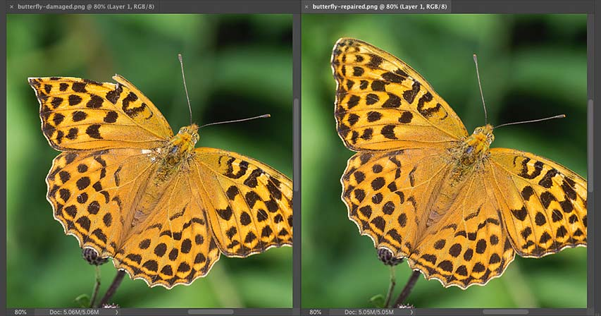

Learn how to use the powerful and improved Content-Aware Fill command in Photoshop CC 2020 to remove unwanted objects or repair missing detail in your photos!

Photoshop's Content-Aware Fill command was designed to make removing unwanted objects or distracting elements from your photos as easy as possible. Simply by drawing a selection around an area, Photoshop can instantly replace it with new image detail from surrounding areas.

Adobe first added Content-Aware Fill back in Photoshop CS5 as a new option in the Fill dialog box. But in Photoshop CC 2019, Content-Aware Fill was given its own separate workspace. And in Photoshop CC 2020, Content-Aware Fill has been improved even further.

The workspace adds powerful features that offer complete control over which "good" parts of the image are used to replace the unwanted areas. We can resize our initial selection, rotate, scale and mirror content, preview the results, and more! And we can apply our fills non-destructively so the original image is never harmed.

In this tutorial, I walk you through every feature of Content-Aware Fill, including the new features in CC 2020, and I show you step-by-step how to get great results. To follow along, you'll need [Photoshop 2020 or later](https://prf.hn/l/dlXjD2w) and you'll want to make sure that your copy is up to date.

Let's get started!

## Removing unwanted objects with Content-Aware Fill

Content-Aware Fill includes lots of great features designed to improve the results when removing unwanted objects from your photos. But not all of these features are useful in every situation. So to learn how they all work, we'll look at a few different examples. We'll start with the basics and cover the steps you'll use all the time.

### The document setup

In [this image](https://prf.hn/l/OVRDlGm) that I downloaded from Adobe Stock, I'll use Content-Aware Fill to remove the woman on the left:

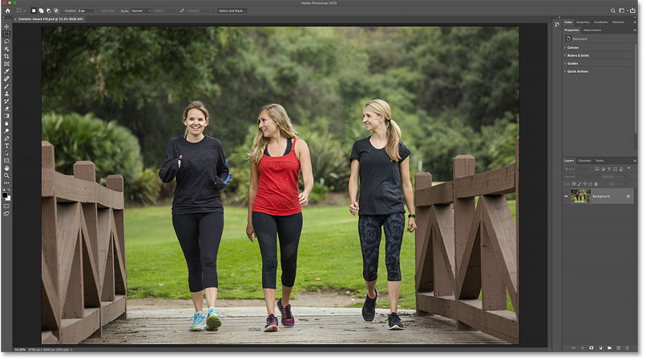

*The original image. Photo credit: Adobe Stock.*

## Draw a selection around the unwanted object

Start by drawing a selection around the object (or person) you want to remove.

The best selection tool for the job is the [Lasso Tool](/basics/selections/lasso-tool/), so I'll grab it from the toolbar:

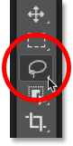

*Selecting the Lasso Tool.*

Then I'll draw a rough selection outline around the woman on the left. For best results, stay close to the person or object but also keep a bit of space around them. This gives Photoshop some surrounding image detail to work with:

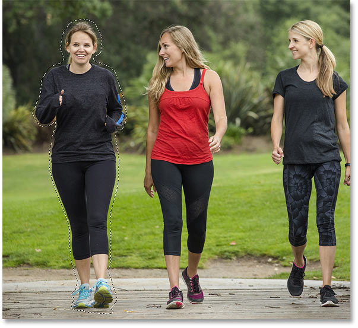

*Drawing a selection around the area that will be removed.*

[Related: How to use the new Object Selection Tool in Photoshop CC 2020](/basics/object-selection-tool/)

## Open Content-Aware Fill

With the selection in place, go up to the **Edit** menu in the Menu Bar and choose **Content-Aware Fill**:

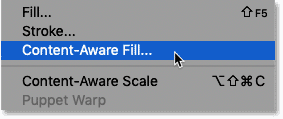

*Going to Edit > Content-Aware Fill*

### The Content-Aware Fill workspace

The image opens inside the Content-Aware Fill workspace, which was first introduced in Photoshop CC 2019 and has been further improved in Photoshop CC 2020.

We'll learn all about this workspace as we go along. But let's take a quick tour:

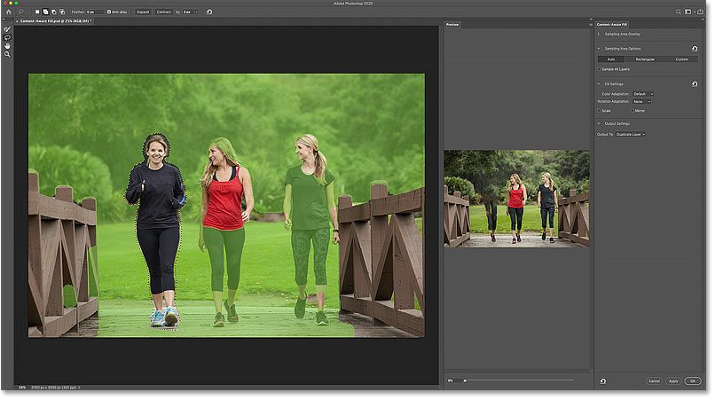

*The Content-Aware Fill workspace in Photoshop CC 2020.*

### The work area and Preview panel

The center of the Content-Aware Fill workspace is divided vertically into two sections. On the left is the **work area** and on the right is the **Preview panel**.

The work area is where we can make adjustments to our initial selection around the unwanted object, and where we tell Photoshop which areas of the image can be used to fill in the selection. And the Preview panel lets us preview the results before we commit our changes.

In the work area, notice the green overlay that covers much of the image. This is the **sampling area overlay** and it represents the area that Photoshop can sample image detail from. Adjusting this sampling area is the key to getting great results from Content-Aware Fill:

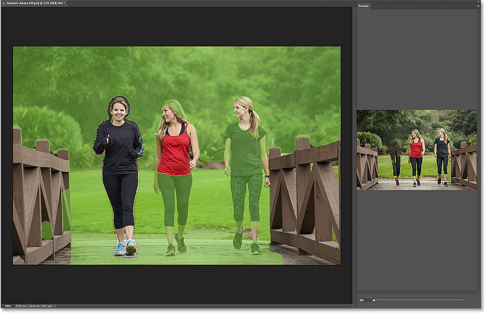

*The work area (left) and Preview panel (right).*

#### How to adjust the Preview panel size

If the Preview panel is too small, you can make it larger by dragging the left side of the Preview panel towards the left:

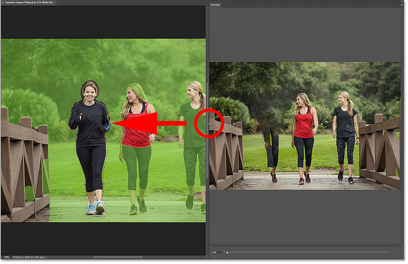

*Making the Preview panel larger (and the work area smaller).*

### The tools and toolbar

Just like Photoshop itself, the Content-Aware Fill workspace includes a [**toolbar**](/basics/photoshop-tools-toolbar-overview/) along the left. And inside the toolbar are four main tools to choose from, plus one hidden tool that we'll look at in a moment:

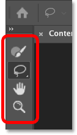

*The Content-Aware Fill toolbar.*

### The Sampling Brush Tool

At the top of the toolbar is the **Sampling Brush Tool**. This tool is used to adjust the size of the sampling area. The current sampling area is represented by the green overlay.

We can paint with the Sampling Brush Tool to add more of the image to the sampling area, or to remove areas from it:

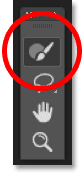

*The Sampling Brush Tool.*

### The Lasso Tools

Below the Sampling Brush Tool is the [**Lasso Tool**](/basics/selections/lasso-tool/). And if you click and hold on the Lasso Tool, you'll find the [**Polygonal Lasso Tool**](/basics/selections/polygonal-lasso-tool/) hiding behind it, bringing the total number of tools in the toolbar to five.

The Lasso tools are used to refine the initial selection around the unwanted object, or to select and remove other unwanted areas:

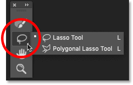

*The Lasso tools.*

### The Hand Tool and Zoom Tool

Next we have the [**Hand Tool**](/basics/photoshop-zoom/), used to pan and scroll the image when zoomed in. And below the Hand Tool is the [**Zoom Tool**](/basics/photoshop-zoom/) for zooming in and out of the image.

The Hand Tool and the Zoom Tool can be used in both the work area and the Preview panel:

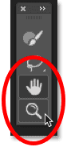

*The Hand and Zoom Tools.*

### The Options Bar

Above the work area is the **Options Bar**. This is where we select various options for whichever tool in the toolbar is currently active:

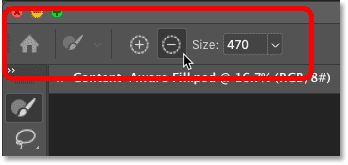

*The Options Bar.*

### The Content-Aware Fill panel

And finally, to the right of the Preview panel is the **Content-Aware Fill** panel. The options in this panel are divided into four main sections, one of which is brand new as of Photoshop CC 2020:

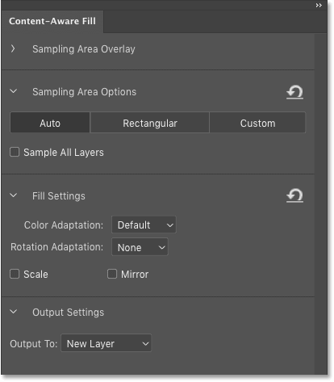

*The Content-Aware Fill panel.*

### The Sampling Area Overlay options

The first section at the top is where we find the **Sampling Area Overlay** options. If this (or any other) section is closed, click the arrow next to the section's name to expand it:

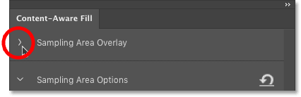

*Clicking the arrow to expand the section.*

These options control the appearance of the sampling area overlay in the work area.

- Use the **Show Sampling Area** checkbox to toggle the overlay on and off.
- Drag the **Opacity** slider to adjust the transparency of the overlay. The default opacity is 50%.
- Click the **color swatch** to change the color of the overlay. The default color is green.
- Use the **Indicates** option to change whether the overlay represents the sampling area (default) or the excluded area.

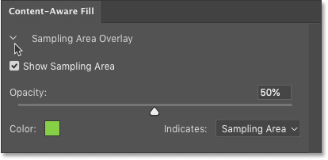

*The Sampling Area Overlay options.*

### The Sampling Area options

Next we have the **Sampling Area Options**. This section is brand new as of Photoshop CC 2020 and it controls how Photoshop chooses the initial sampling area.

- **Auto**: The default setting. Photoshop analyzes the image and sets the sampling area automatically. This is the most powerful option and is almost always what you want.
- **Rectangular**: Photoshop sets a simple rectangular area around the selection as the sampling area.
- **Custom**: This option does not set a sampling area at all. Instead, it's up to you to choose the sampling area by painting over the image with the Sampling Brush Tool.
- **Sample All Layers**: Also new as of Photoshop CC 2020. If your document contains multiple layers, turn this option on to let Photoshop sample image detail from all visible layers.

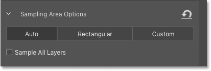

*The Sampling Area options (new in Photoshop CC 2020).*

### Fill Settings

The **Fill Settings** are powerful options that, depending on your image, can greatly improve the Content-Aware Fill results. We'll look more closely at these options later, but here's a quick summary:

- **Color Adaptation** adjusts the brightness and contrast of the filled area to better match its surroundings. This can be very useful when removing objects in areas with gradual color or brightness transitions.
- **Rotation Adaptation** allows Photoshop to rotate the content to better match the angle and direction. Great for curved or rotated patterns.
- **Scale** lets Photoshop adjust the size of the content when removing objects in perspective.
- And **Mirror** will flip the contents horizontally, perfect for symmetrical images or patterns.

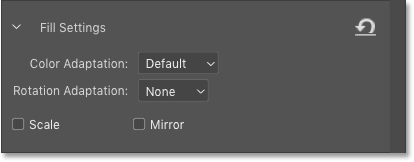

*The Fill Settings options.*

### Output Settings

And the final section in the Content-Aware Fill panel is **Output Settings**. This is where we decide how we want to output the results. There are three choices:

- **New Layer** (the default setting) will output just the filled area itself to its own layer.
- **Duplicate Layer** will place a copy of the entire image, including the filled area, on a new layer.
- And **Current Layer** will output the result onto the same layer you're working on. This creates a destructive edit and is not recommended.

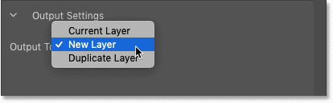

*The Content-Aware Fill output options.*

### The Cancel, Apply and OK options

Finally, in the bottom right of the Content-Aware Fill workspace are the Cancel, Apply and OK options.

- **Cancel** will close Content-Aware Fill and discard any and all edits.
- **Apply** is new as of Photoshop CC 2020. Choose Apply to commit the current fill but keep the workspace open so you can continue removing more unwanted objects.
- **OK** will commit your edits and close Content-Aware Fill.

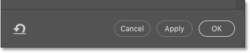

*The Cancel, Apply and OK options.*

So now that we've taken a tour of the Content-Aware Fill workspace, let's get back to the image.

## Resizing the sampling area with the Sampling Brush Tool

In the Preview panel, we see that my initial results with Content-Aware Fill are not great. Photoshop is using detail from the woman in the center to fill in my selection on the left:

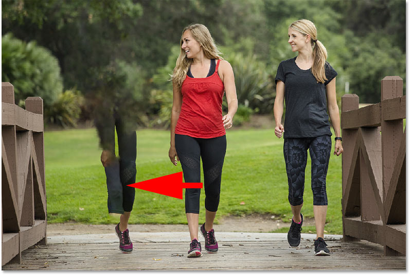

*The initial result.*

### Inspecting the sampling area

And in the work area, we see the problem. Too much of the image is included in the sampling area.

The green overlay is covering much of the woman in the center, and most of the woman on the left. But none of this detail is needed to fill in the selection. So I'll remove it from the sampling area using the Sampling Brush Tool:

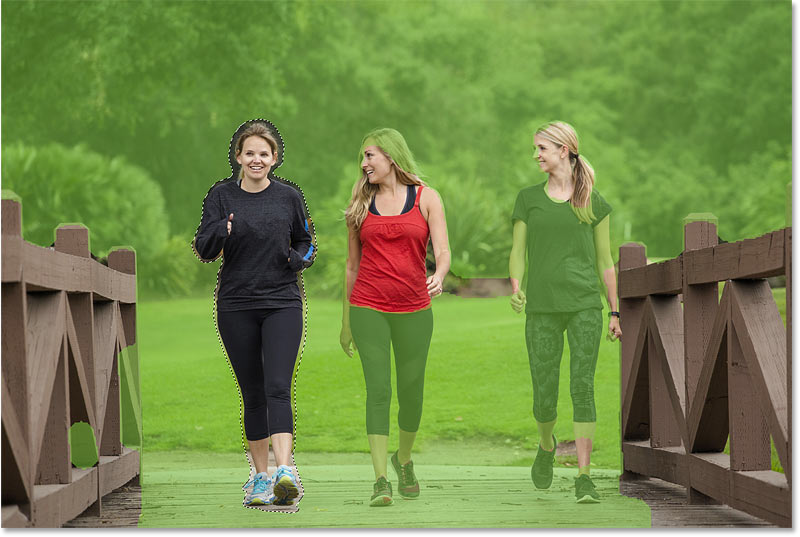

*The overlay shows the current sampling area.*

### Selecting the Sampling Brush Tool

Start by selecting the **Sampling Brush Tool** from the toolbar:

*Selecting the Sampling Brush Tool.*

### Changing the brush size

Then with the Sampling Brush Tool active, change the size of your brush using the **Size** option in the Options Bar.

Or you can change your brush size using the **left and right bracket keys** ( **[** and **]** ) on your keyboard. The left bracket key makes the brush smaller and the right bracket key makes it larger:

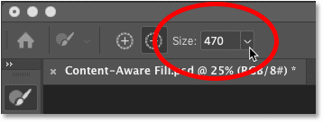

*The Brush Size option in the Options Bar.*

[Related: Discover Photoshop's hidden Brush Tool tips and tricks!](/basics/photoshop-brush-tool-hidden-tips-tricks/)

### Painting away image detail from the sampling area

Then simply paint over an area to remove it from the sampling area. I'll paint over the woman in the center. Notice that as I paint, the green overlay disappears:

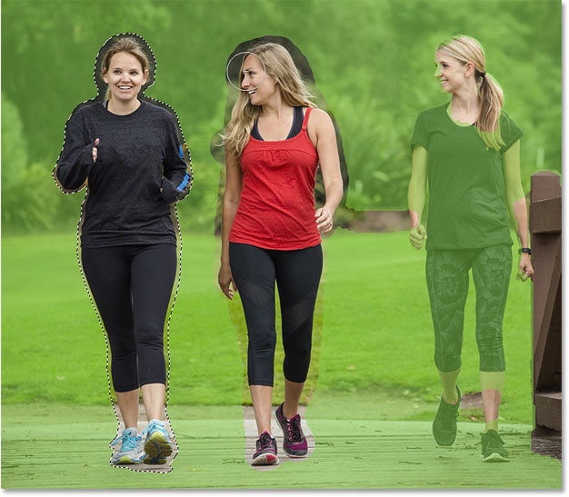

*Painting away some of the sampling area with the Sampling Brush Tool.*

And I'll also paint over the woman on the right:

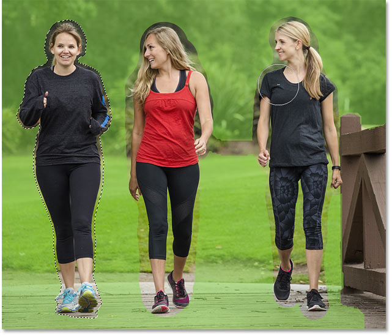

*Removing more of the sampling area.*

### Previewing the results

Back in the Preview panel, the results are already looking much better. After removing the other two people in the photo from the sampling area, none of that detail is being used to fill the selection:

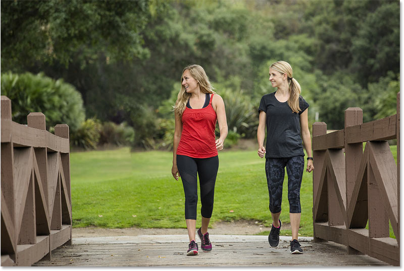

*The result after removing some of the image from the sampling area.*

But now we have a new problem with some obvious repeating detail:

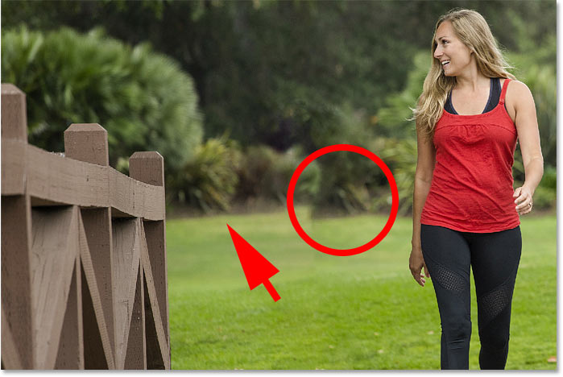

*Photoshop has copied and pasted detail from one area to another.*

### Removing more of the sampling area

So with the Sampling Brush Tool still active, I'll paint over the detail that's repeating to remove it from the sampling area:

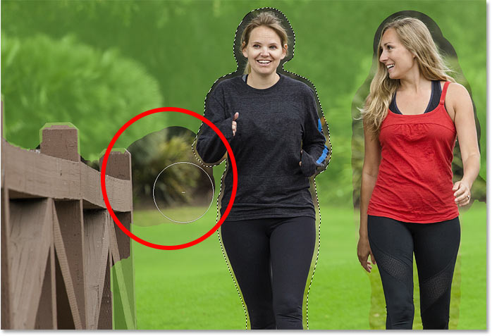

*Painting away more of the sampling area.*

### How to undo a mistake

Unfortunately, sometimes trying to fix a problem can actually make it worse.

In my case, Photoshop replaced the repeating detail with a blob of random pixels:

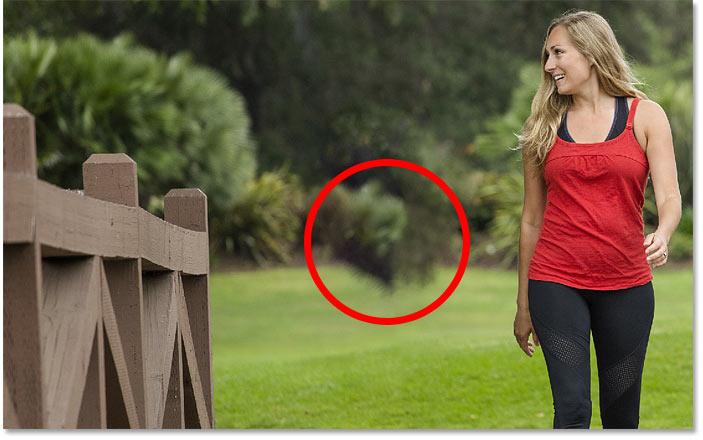

*The results with Content-Aware Fill are not always what you expect.*

If you or Photoshop make a mistake, simply undo your last step by going up to the **Edit** menu in the Menu Bar and choosing **Undo**. Or press **Ctrl+Z** (Win) / **Command+Z** (Mac) on your keyboard. Press the keys repeatedly to undo multiple steps.

To redo a step, press **Shift+Ctrl+Z** (Win) / **Shift+Command+Z** (Mac):

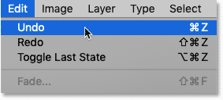

*Going to Edit > Undo.*

And then try again, either by painting over the same area with the Sampling Brush Tool or by trying a different area.

This time, instead of painting over the exact same image detail, I'll paint more to the left of it. I'll also try removing the top of that wooden post to see if that makes a difference:

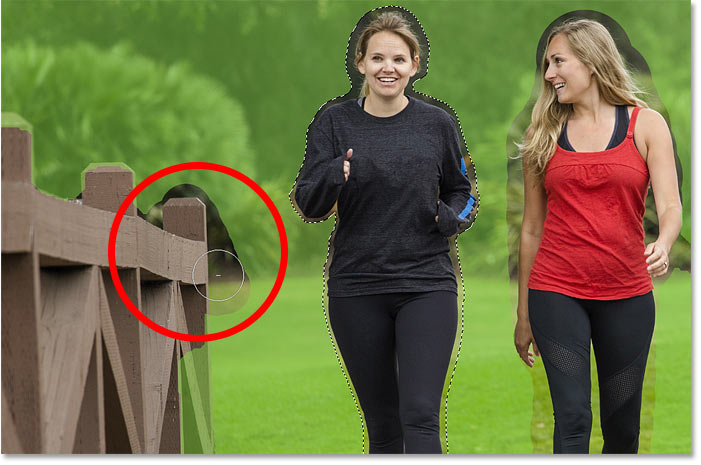

*Removing a different part of the image from the sampling area.*

And sure enough, the new result looks much better. It's still not perfect, but there's nothing a couple of minutes with the Clone Stamp Tool can't fix:

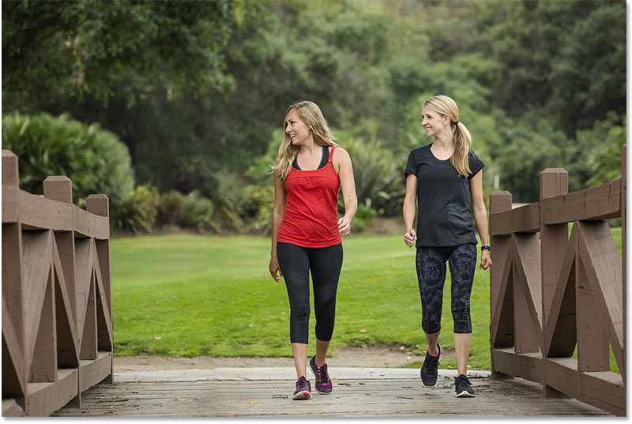

*A much better result.*

### How to add to the sampling area with the Sampling Brush Tool

By default, the Sampling Brush Tool will *remove* any parts of the image you paint over from the sampling area. To *add* to the sampling area, press and hold the **Alt** (Win) / **Option** (Mac) key on your keyboard. The minus sign (-) in the center of the brush cursor will change to a plus sign (+). Paint over the areas you want to add, and then release the Alt / Option key.

You can also switch between Add and Remove mode from the Options Bar. But since you'll spend most of your time removing areas from the overlay, the keyboard shortcut is faster:

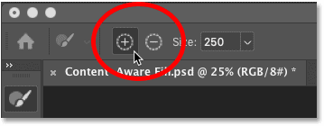

*The Add and Remove icons in the Options Bar.*

### The progress indicators in the Preview panel

After a change is made in the work area, the Preview panel can take time to fully update, especially with larger images. So while you're waiting, you'll see two **progress icons** in the lower right corner of the Preview panel.

The first icon that appears (little circles rotating around the center) means that Photoshop is working on your changes. And after a few moments, a warning icon will appear beside it. The warning icon means that you are currently seeing a low resolution preview while Photoshop continues to work on the high resolution version. Both icons disappear when the high resolution version is displayed:

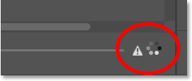

*The progress icons in the lower right of the Preview panel.*

## How to resize the initial selection with the Lasso tools

Along with adjusting the size of the sampling area using the Sampling Brush Tool, the Content-Aware Fill workspace also lets us resize our initial selection around the object using either of the Lasso tools (the standard **Lasso Tool** or the **Polygonal Lasso Tool** nested behind it).

I'll select the standard Lasso Tool from the toolbar:

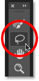

*Selecting the Lasso Tool.*

[Related: Make One-Click Selections with the Select Subject command!](/basics/select-subject-select-and-mask-photoshop-cc-2018/)

### The Selection Modes (New, Add, Remove, Intersect)

By default, Photoshop will add areas to the current selection. To remove part of the selection, press and hold **Alt** (Win) / **Option** (Mac) on your keyboard as you drag with the tool.

You can also switch between modes (New selection, Add to selection, Remove from selection, and Intersect with selection) in the Options Bar:

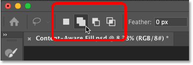

*From left to right: New, Add, Remove, and Intersect with selection.*

Here I'm adding more of the area to the left of the woman's arm by dragging around it with the Lasso Tool. If you don't like the results in the Preview panel, just press **Ctrl+Z** (WIn) / **Command+Z** (Mac) on your keyboard to undo it and return to the previous selection:

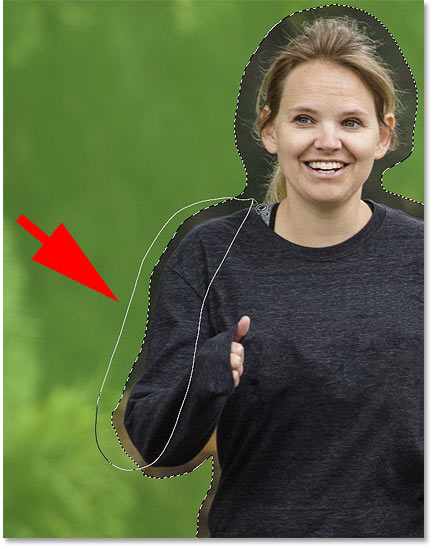

*Using the Lasso Tool to add to the main selection.*

## How to apply a fill without closing the workspace

New as of Photoshop 2020, the Content-Aware Fill workspace now lets you apply your current fill without closing the workspace, so you can continue removing other unwanted areas from the image. This is different from clicking the OK button which not only commits the fill but also closes the workspace.

First, in the **Output Settings** section of the Content-Aware Fill panel, make sure **Output To** is set to **New Layer**. This way, each time we apply a new fill, Photoshop will place the fill on its own separate layer above the original image. We'll see what that looks like in a moment:

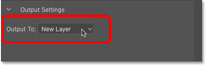

*Setting the output to New Layer.*

Then to apply your current fill, click the **Apply** button in the bottom right corner:

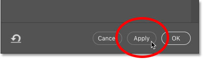

*Clicking the Apply button.*

## Selecting and removing more unwanted areas

Once the fill has been applied, you can select a different unwanted area to remove it.

### How to hide the sampling area overlay

If the green overlay makes it difficult to see your image, hide the overlay by unchecking **Show Sampling Area** in the Content-Aware Fill panel:

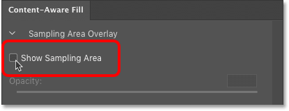

*Hiding the sampling area overlay.*

### Selecting a different area

Then choose either the **Lasso Tool** or the **Polygonal Lasso Tool** from the toolbar:

*Selecting the Lasso Tool.*

This time, we don't want to add to the existing selection. Instead, we want to create a *new* selection. So in the Options Bar, make sure the **New Selection** icon is selected:

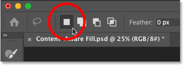

*Setting the selection mode to New Selection.*

And then draw a selection around a different area. I'll select the rough patch of grass and dirt between the two remaining people in the photo:

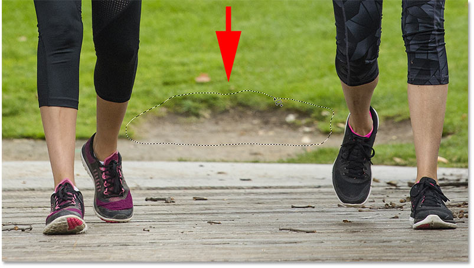

*Selecting a new area to remove.*

But in the Preview panel, we see that Photoshop chose the wrong image detail to fill the selected area:

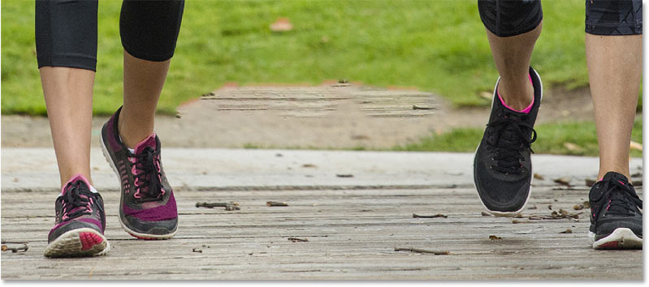

*The initial result.*

### Showing the sampling area overlay

To find the problem, I'll turn the sampling area overlay back on:

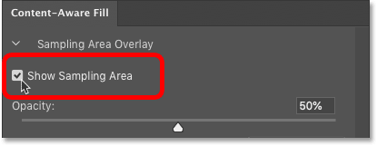

*Showing the sampling area overlay.*

And in the work area, we see that the sampling area includes too much of the image surrounding the selection, plus a few other random areas that are not very useful:

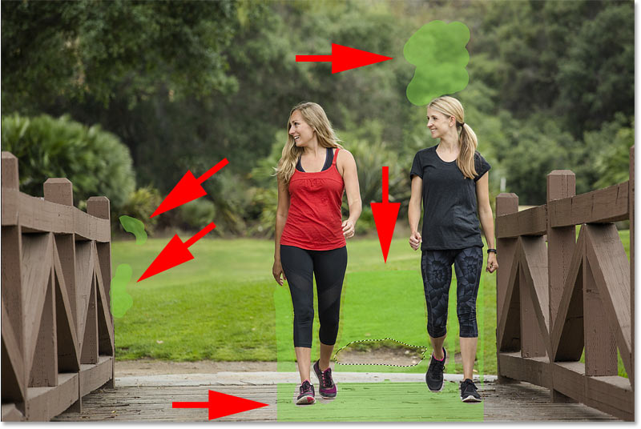

*The Auto sampling area results.*

## How to create a custom sampling area

Rather than trying to fix the sampling area that Photoshop chose automatically, another way to work is to create your own custom sampling area from scratch. Here's how to do it.

### Choosing the Custom sampling area option

First, in the Content-Aware Fill panel, set the sampling area to **Custom**. This will clear away the Auto sampling area that Photoshop created:

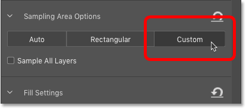

*Setting the Sampling Area Options to Custom.*

With Custom selected, Photoshop informs you that you'll need to use the Sampling Brush Tool to select a sampling area before you continue. Click OK to close the info box:

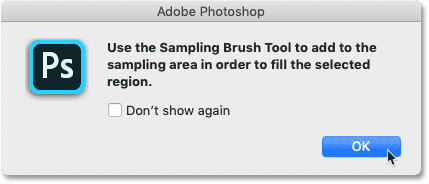

*The Custom sampling area info box.*

### Choosing the Sampling Brush Tool

Grab the **Sampling Brush Tool** from the toolbar:

*Selecting the Sampling Brush Tool.*

### Painting a custom sampling area

And then paint with the brush to add areas to the sampling area. Or hold **Alt** (Win) / **Option** (Mac) as you paint to remove an area if you make a mistake.

Here I've added areas where the grass and dirt texture most closely matches the area I selected. I'm also avoiding most of the background since those areas are not as sharp as the foreground detail due to the photo's shallow depth of field:

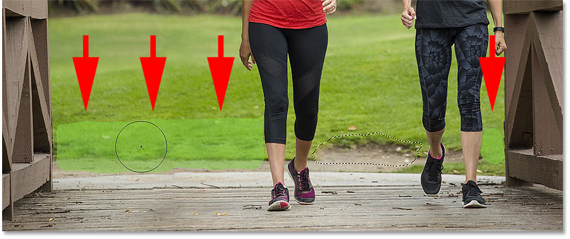

*Painting over the best detail to use for the fill.*

With the custom sampling area in place, I'll switch back over to the Preview panel. And this time, Content-Aware Fill does a much better job:

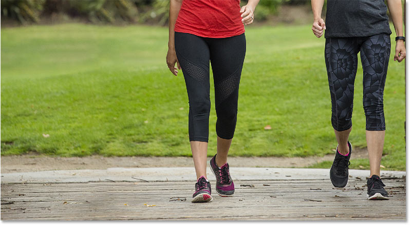

*The better result using a custom sampling area.*

## How to commit and close Content-Aware Fill

Once you have removed the final unwanted area from the image and you're happy with the results, again make sure the **Output To** option in the Content-Aware Fill panel is set to **New Layer**:

*Setting the output to New Layer.*

And then click **OK** to commit the fill and close the Content-Aware Fill workspace:

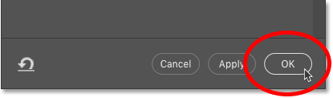

*Clicking the OK button.*

## Viewing the Content-Aware Fill results

Back in the main Photoshop document, we see the results. In my case, the woman on the left has been completely removed from the photo, and the rough patch of grass and dirt between the remaining two people has been cleaned up:

*The final Content-Aware Fill result.*

### The fills remain separate from the image

But in the [**Layers panel**](/basics/layers/layers-panel/), notice that the fills were not applied directly to the image. Instead, because the Output in the Content-Aware Fill workspace was set to New Layer, each of my two fills appears on its own [separate layer](/photoshop-layers-learning-guide/) *above* the image:

*The Layers panel showing the fills on separate layers.*

### Showing and hiding the fills

You can turn each fill on and off to compare it with the original photo by clicking a layer's **visibility icon**.

I'll turn off the layer that holds the fill for the woman I removed from the image:

*Turning off one of the fill layers.*

And with the layer turned off, the woman on the left instantly returns. So not only is the Content-Aware Fill workspace a powerful way to remove unwanted objects, but it also makes it easy to edit our images non-destructively:

*Outputting the fills to new layers means we never harm the original image.*

[Related: How to use Content-Aware Crop in Photoshop!](/basics/new-content-aware-crop-tool-photoshop-cc/)

## The Fill Settings in the Content-Aware Fill panel

So far, we've covered the basic steps for removing unwanted objects with Content-Aware Fill. But there are a few more options in the workspace that, depending on your image, can greatly improve your results.

These additional options are found in the **Fill Settings** section of the Content-Aware Fill panel. And to see how they work, we'll look at a few different images:

*The four Fill Settings options.*

### Color Adaptation

The first option, **Color Adaptation**, lets Photoshop adjust the brightness and contrast of the filled area to better match its surroundings. This can be very useful when replacing an object in an area with subtle color and brightness transitions.

Color Adaptation is turned on by default. But along with the Default setting, you can also choose High or Very High. Or choose None to turn Color Adaptation off completely:

*The Color Adaptation settings.*

In [this image](https://prf.hn/l/ERPwDe0), I want to remove the windmill and leave only the sunrise in the background. So I'll draw a selection outline around the windmill using the Lasso Tool:

*Selecting the windmill to remove it with Content-Aware Fill. Photo credit: Adobe Stock.*

Then I'll open the image inside the Content-Aware Fill workspace by going up to the **Edit** menu and choosing **Content-Aware Fill**:

*Going to Edit > Content-Aware Fill.*

### Color Adaptation results comparison

And here is a comparison of the results I get using different Color Adaptation settings. On the left is the result with Color Adaptation set to **None**, where we can clearly see the problem. The filled area looks very harsh against the subtle gradients of the sunrise.

In the center is the **Default** setting. Here things look much better, but we can still see blotches just above the horizon.

And on the right is the much smoother result with Color Adaptation set to **Very High**. The result you'll get from Color Adaptation will depend on the amount of detail in your image. For areas of very high detail, the Default or None settings tend to work best. For smoother areas, try High or Very High:

*The result with Color Adaptation set to None (left), Default (center) and Very High (right).*

### Rotation Adaptation

The second option in the Fill Settings is **Rotation Adaptation**. This lets Photoshop rotate the contents in the filled area, useful when removing an object from an area with curved or rotating patterns. Rotation Adaptation is set to None by default, but you can choose Low, Medium, High, or Full:

*The Rotation Adaptation settings.*

In [this image](https://prf.hn/l/LbdQXyd), I want to remove the ladybug from the flower. But with the flower rotating around its center, it might be a challenge. So I'll select the ladybug, and then I'll open the image into the Content-Aware Fill workspace:

*Selecting the ladybug to remove it. Photo credit: Adobe Stock.*

### Rotation Adaptation results comparison

With Rotation Adaptation set to **None** (left), the result looks terrible. Part of the flower's center is now sticking out to the side. But with Rotation Adaptation set to **High** (right), Photoshop was able to rotate the textures to match the rotation of the flower:

*The result with Rotation Adaptation set to None (left) and High (right).*

### Scale

The third option in the Fill Settings is **Scale**, which lets Photoshop resize the content in the filled area to better match the perspective of the surrounding textures. Scale can be useful when replacing objects in images that were shot on an angle. By default, Scale is turned off:

*The Scale option.*

In [this image](https://prf.hn/l/Gl3BDwD), I want to remove the reflective signboard in the center of the brick wall:

*Selecting the signboard to remove it. Photo credit: Adobe Stock.*

### Scale results comparison

With Scale turned off (left), the result again looks really bad. Photoshop simply filled the selection with random parts of the wall. But with Scale turned on (right), the textures are resized to better align them with the perspective. It's not perfect, but it does give me a much better starting point:

*The result with Scale off (left) and on (right).*

### Mirror

And finally, the **Mirror** option can flip textures horizontally from one side of the image to the other. Mirror is great for removing or repairing objects that are part of a symmetrical pattern. By default, Mirror is turned off:

*The Mirror option.*

In this [final image](https://prf.hn/l/A3PwDnX), I want to repair the missing left corner of the butterfly's wing. So I'll draw a selection outline around the general area where the missing part should be. Then I'll open the image inside the Content-Aware Fill workspace:

*Drawing a selection around the area that needs to be repaired.*

### Mirror results comparison

With Mirror turned off (left), all Photoshop can do is copy and paste a section of the wing into the missing area. But with Mirror turned on (right), almost like magic, Photoshop was able to take the corner of the wing from the right side of the butterfly and flip it onto the left side.

Since the butterfly is rotated on an angle, I also set Rotation Adaptation (which we looked at earlier) to Full, resulting in a near perfect repair:

*The Mirror option, along with Rotation Adaptation, has no trouble repairing the wing.*

And there we have it! That's your complete guide to removing objects or repairing images using Content-Aware Fill in Photoshop!

Check out our [Photoshop Basics](/basics/) section for more tutorials! And don't forget, all of our tutorials are now available to [download as PDFs](/print-ready-pdfs)!