# How to Use Live Gradients in Photoshop 2023

> Source: [https://www.photoshopessentials.com/basics/how-to-use-live-gradients-in-photoshop-2023/](https://www.photoshopessentials.com/basics/how-to-use-live-gradients-in-photoshop-2023/)
> Downloaded and converted to Markdown.

Live gradients in Photoshop 2023 make drawing and editing gradients easier than ever. This step-by-step tutorial shows you how to draw and edit a live gradient, save a custom gradient preset, apply a gradient to your image, and more!

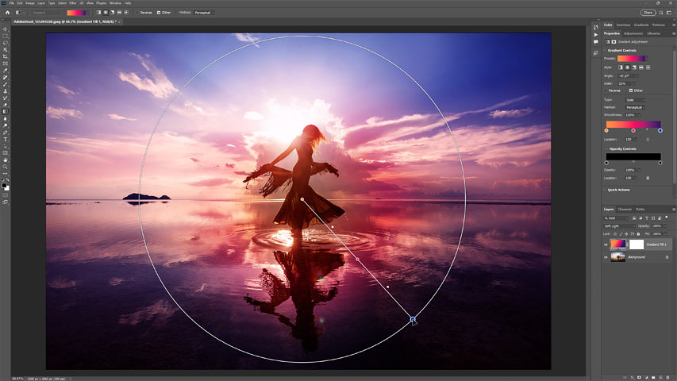

In this tutorial, I show you how easy it is to draw and edit gradients using **live gradients** in Photoshop 2023.

Live gradients are a huge improvement over Photoshop’s traditional gradients, for a number of reasons. First is the new **live preview** of the gradient as we draw it. Second, live gradients are **editable** and **non-destructive**. And third, live gradients include new and intuitive **on-canvas controls** for adjusting the colors, the size, the angle of the gradient and more. So let’s see how they work.

I’ll start by showing you everything you need to know to draw and edit a live gradient, and then we’ll look at a real world example of how you might use a gradient with your photo.

### Which version of Photoshop do I need to use live gradients?

Live gradients were added to Photoshop in the May 2023 update.

You can [get the latest Photoshop version here](https://adobe.prf.hn/click/camref:1100lrdjJ/destination:https%3A%2F%2Fwww.adobe.com%2Fproducts%2Fphotoshop.html). Or use the Creative Cloud Desktop app to make sure that your copy of Photoshop is up to date.

Let's get started!

### The document setup

For this tutorial, I’ve gone ahead and created a new document with a plain white background.

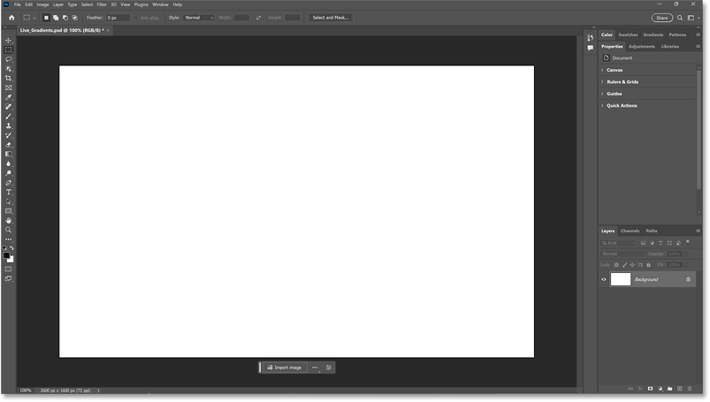
*The original Photoshop document.*

## How to draw a live gradient in Photoshop

Here are the steps for drawing a live gradient in Photoshop. Once we’ve drawn the gradient, I’ll show you how to edit the colors, the size, angle, opacity and more.

**See Also:**

- [Add a Vignette to a Photo with Live Gradients](/photo-effects/add-a-vignette-to-a-photo-with-photoshops-live-gradients/)
- [Fade an Image to Color with Live Gradients](/photo-effects/fade-an-image-to-color-in-photoshop-faster-with-live-gradients/)
- [Find Photoshop's Missing Gradients, Patterns and Shapes](/basics/find-missing-shapes-gradients-and-patterns-in-photoshop-cc-2020/)

### Step 1: Select the Gradient Tool

First select the **Gradient Tool** from the [toolbar](/basics/photoshop-tools-toolbar-overview/) (or press **G** on your keyboard).

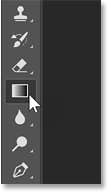
*Selecting the Gradient Tool.*

### Step 2: Set the gradient mode to Gradient

In the Options Bar, make sure the **Gradient Mode** (a new option) is set to **Gradient**. Choosing **Classic gradient** from the menu will draw a legacy gradient without any of the new live features.

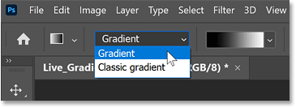
*The Gradient Mode option in the Options Bar.*

### Step 3: Choose a gradient preset (optional)

The **color swatch** next to the Gradient Mode displays the current gradient colors. By default, the gradient uses your Foreground and Background colors (black and white).

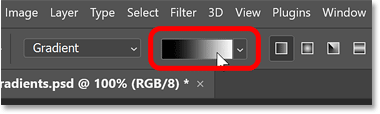
*The gradient color swatch.*

I’ll show you how to choose your own custom colors after we draw the gradient. But Photoshop includes lots of [gradient presets](/basics/find-missing-shapes-gradients-and-patterns-in-photoshop-cc-2020/) that we can choose from.

To select a preset, click the color swatch to open the **Gradient Preset picker**.

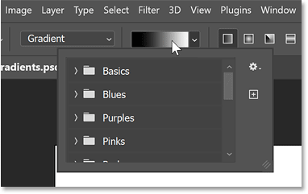
*Opening the Gradient Preset picker.*

Twirl open any of the themes (Blues, Purples, Pinks, and so on), then click on a preset’s thumbnail.

I’ll choose one from the Purples theme. Click outside the Gradient Preset picker to close it.

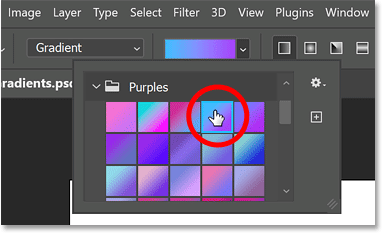
*Choosing a gradient preset.*

### Step 4: Choose a gradient style

Next to the Gradient Picker are the **Gradient Style** options. From left to right, we have **Linear**, **Radial**, **Angle**, **Reflected** and **Diamond**.

Linear and Radial are the styles we use the most. Linear draws the gradient in a straight line while Radial draws it outward in a circle. You can cycle through the styles from your keyboard using the **left and right bracket keys** ( **[** and **]** ).

I’ll use Linear, which is selected by default.

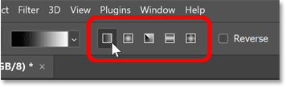
*Choosing Linear for the gradient style.*

### Step 5: Leave the other gradient options at their defaults

Still in the Options Bar, leave the **Reverse** option **unchecked** unless you want to reverse the gradient’s direction and swap the colors. You can always reverse the gradient after you draw it, if needed.

Also, leave the **Dither** option **checked**, which helps to reduce color banding.

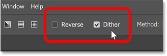
*The Reverse and Dither options.*

Finally, leave the **Method** option set to **Perceptual**, which displays colors in a way that matches how our eyes perceive colors. **Linear** is the most basic and displays color transitions in a simple straight line, while **Classic** matches how gradients appeared in previous Photoshop versions.

In most cases, Perceptual is the best choice.

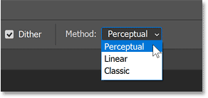
*The Gradient Method choices.*

### Step 6: Draw your gradient

Then to draw your live gradient, simply click in the document to set a starting point, keep your mouse button held down and drag away from that point. Photoshop displays a live preview of the gradient as you draw it.

To draw the gradient in a straight horizontal or vertical line, hold the **Shift** key on your keyboard as you drag.

Release your mouse button to complete the gradient.

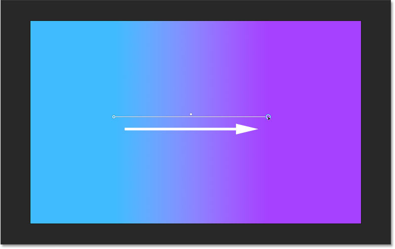
*Drawing a live gradient across the canvas.*

In the Layers panel, notice that the live gradient appears on its own **Gradient Fill** layer which keeps the gradient separate and non-destructive.

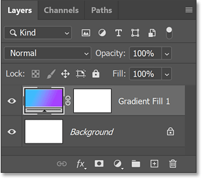
*The Gradient Fill layer in the Layers panel.*

## Editing a live gradient using the on-canvas controls

A great feature of live gradients is that they remain editable even after we draw them. And the easiest way to edit a gradient is with the new **on-canvas controls**. Here’s how to use them.

### Scale

To adjust the scale (the size or length) of the gradient using the on-canvas controls, click and drag one of the round **color stops** on either end of the gradient.

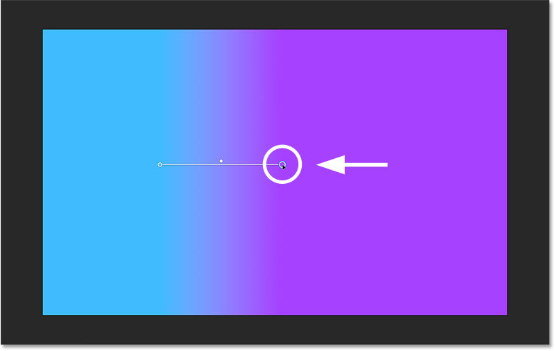
*Dragging a color stop to adjust the gradient scale.*

### Angle

You can also drag a color stop to rotate the gradient’s angle.

Hold **Shift** to rotate the angle in 15 degree increments.

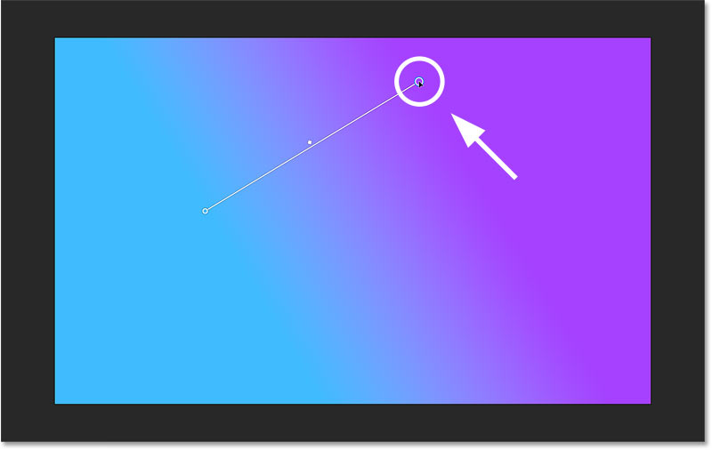
*Rotating the gradient angle by dragging the color stop.*

### Position

To reposition the gradient on the canvas, click and drag the **line** that connects the color stops.

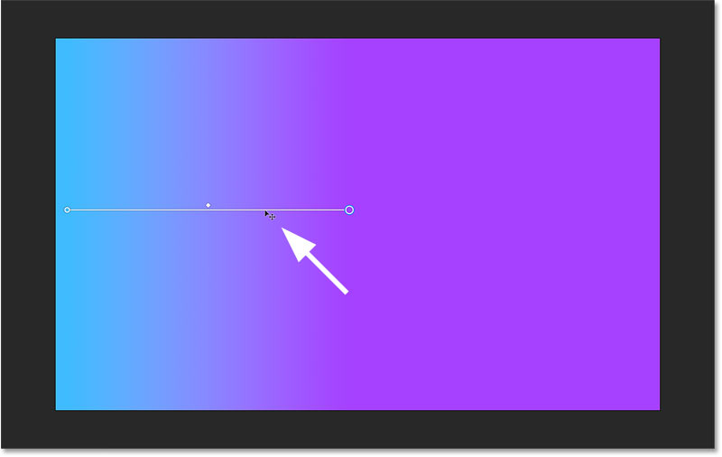
*Dragging the line to repositon the gradient.*

### Midpoint

And to adjust the midpoint of the gradient, drag the **diamond** icon above the line.

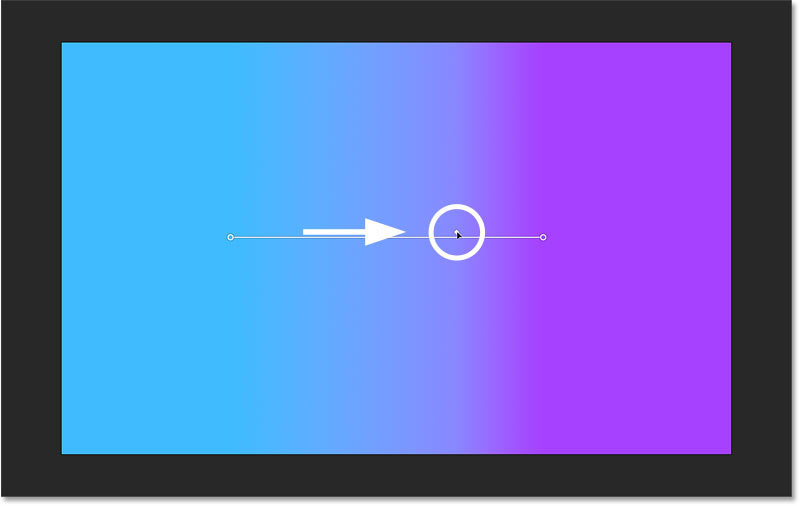
*Dragging the diamond to move the gradient midpoint.*

### How to change a gradient color

To change a color, double-click on its color stop. I’ll change the color on the left.

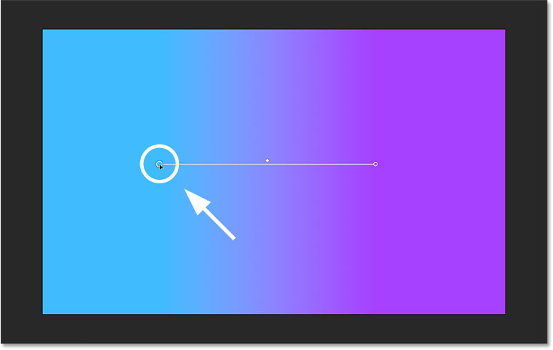
*Double-clicking on a color stop to change its color.*

Then choose a new color from the Color Picker.

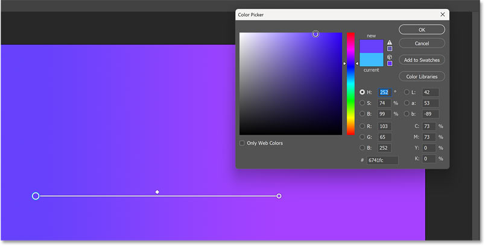
*Using the Color Picker to choose a new color.*

Or, while the Color Picker is open, you can click anywhere along the gradient to sample that color.

Here I’m sampling the purple color on the right, which temporarily makes both colors in the gradient the same.

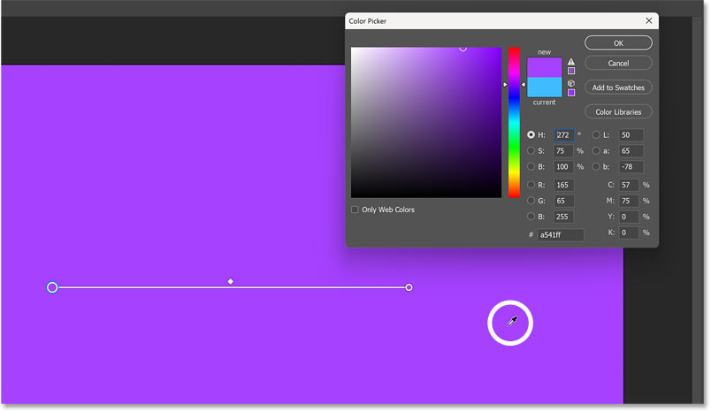
*Sampling another color in the gradient.*

Then drag the **Hue slider** in the Color Picker to choose a slightly different color.

Gradients often work best with colors that are fairly similar, with transitions that are more subtle, as opposed to using colors at opposite sides of the color wheel.

Click OK to close the Color Picker when you’re done.

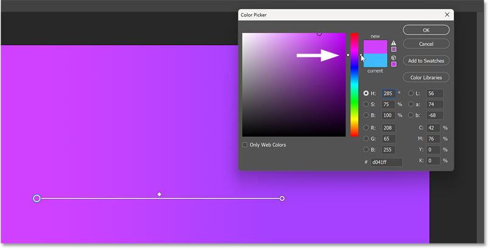
*Dragging the Hue slider to select a different but similar color.*

### How to add a new color to the gradient

To add a new color to the gradient, hover your mouse cursor just above or below the line at the spot where you want to add the new color.

A **plus sign** will appear next to your cursor.

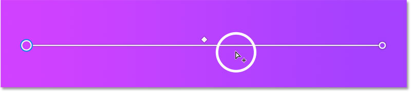
*Hovering the cursor just below the line to add a new color stop.*

Then click to add a new color stop at that location.

Photoshop will use your current Foreground color as the new color, which in my case is black.

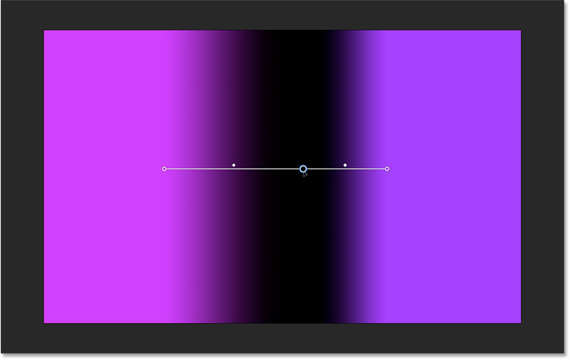
*The new color stop is added and set to the current Foreground color.*

Double-click on the new color stop to choose a color from the Color Picker.

I’ll choose white just to make it easy to see.

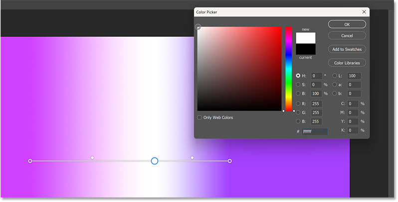
*Choosing white as the third color in the gradient.*

You can then drag the color stop along the line to reposition it.

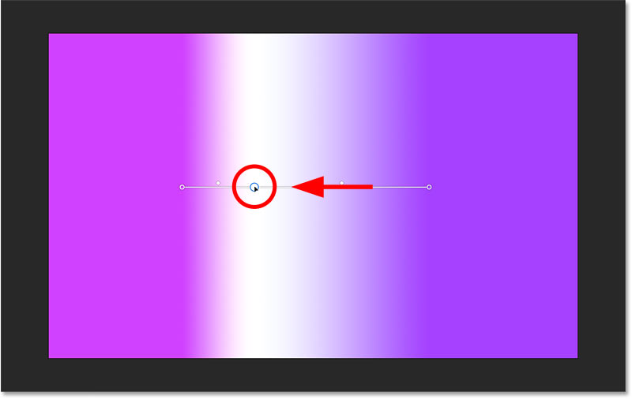
*Dragging the new color stop to change the location of the color.*

Or drag the diamond icons on either side of the new color stop to change the midpoint locations.

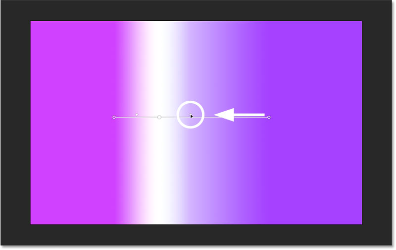
*Dragging a diamond to adjust the midpoint between two colors.*

### How to delete a color from the gradient

To delete a color from the gradient, click on its color stop to select it.

Then either drag the color stop away from the line until it disappears, or press the **Delete** key on your keyboard.

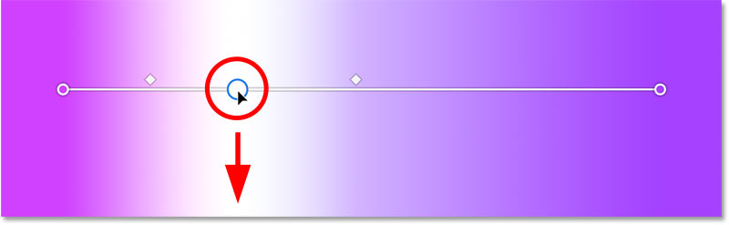
*Deleting a color stop by dragging it down and away from the line.*

## Editing a live gradient from the Properties panel

Another way to edit a live gradient in Photoshop is from the [Properties panel](/basics/using-the-enhanced-properties-panel-in-photoshop/). Here you’ll find the same options that we can edit using the on-canvas controls, plus more.

### Presets

Use the **Presets** option at the top of the Properties panel to choose a different gradient preset.

Click the color swatch to open the Gradient Preset picker, twirl open a color theme and click on a thumbnail to choose a preset.

I’ll reset my gradient back to the same preset from the Purples theme that I chose earlier in the Options Bar.

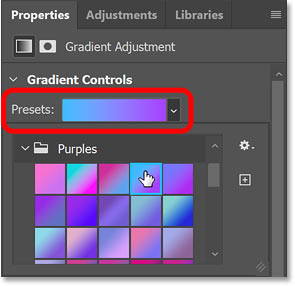
*Use the Presets option to choose a different gradient preset.*

### Style

Next we have the same **Style** options (Linear, Radial, Angle, Reflected, and Diamond) that we saw in the Options Bar, so you can change the style for your gradient after you draw it.

I’ll leave mine set to Linear.

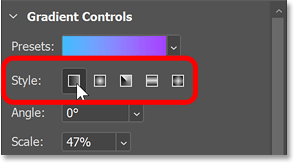
*The gradient style options in the Properties panel.*

### Angle

To adjust the **angle** of the gradient, you can enter a specific value, or click the arrow next to the value box and choose a preset angle.

You can also click and drag across the word Angle to adjust the value using the **scrubby slider**. While dragging the scrubby slider, hold the **Alt** (Win) / **Option** (Mac) key to adjust the value in smaller increments. Or hold **Shift** to adjust it in larger increments.

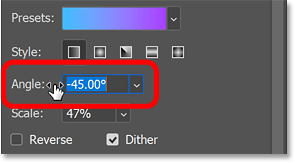
*Adjusting the gradient angle from the Properties panel.*

### Scale

Use the **Scale** option to adjust the size or length of the gradient, either by entering a specific value, clicking the arrow next to the value box and dragging the slider, or by clicking and dragging across the word Scale to adjust it using the scrubby slider.

Again hold the **Alt** (Win) / **Option** (Mac) key while dragging with the scrubby slider to adjust the scale in smaller increments, or the **Shift** key for larger increments.

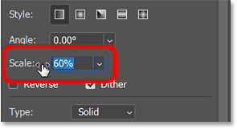
*Adjusting the gradient scale from the Properties panel.*

### Reverse and Dither

Check the **Reverse** option in the Properties panel to reverse the direction of the gradient, which swaps the colors on the left and right sides.

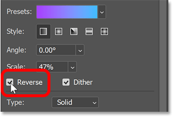
*Use Reverse to flip the direction of the gradient.*

And you can turn off **Dither** from the Properties panel, although I wouldn’t recommend it unless you want color banding to be more obvious.

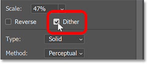
*Leave Dither on for less color banding.*

### Choosing a Solid or Noise gradient

The **Type** option in the Properties panel allows us to switch from a **Solid** gradient (the more traditional look) to a **Noise** gradient.

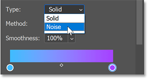
*Use Type to switch between Solid and Noise gradients.*

Noise gradients use a random mix of colors to create more of a textured effect.

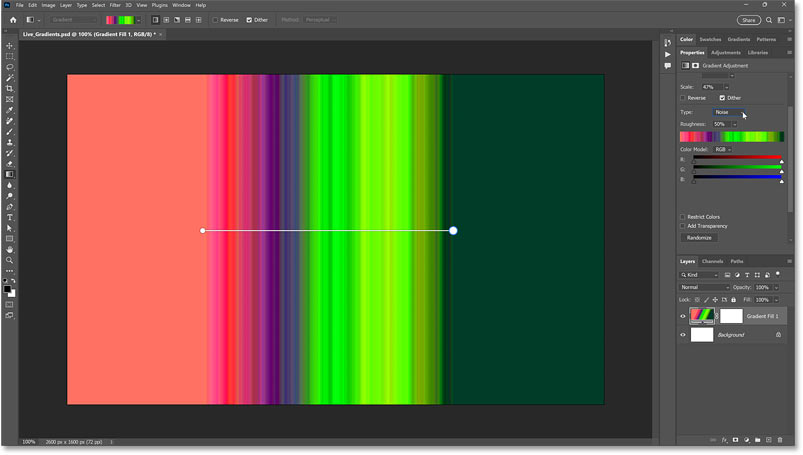
*An example of a noise gradient.*

When Type is set to Noise, the following options appear:

- Roughness
- Color Model
- Restrict Colors
- Add Transparency
- Randomize

### Roughness

Roughness controls the smoothness of the noise.

Lower values create smoother, softer variations with less contrast, as we see in the preview bar below the Roughness option.

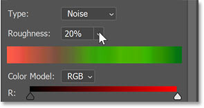
*Lowering the Roughness amount to smooth out the noise gradient.*

Higher Roughness values create a sharper, more obvious line pattern. The default value is 50 percent.

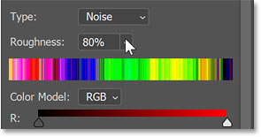
*Increasing the Roughness amount for a sharper, more abrupt noise gradient.*

### Color Model

Color Model lets you switch the noise gradient between RGB, HSB and LAB.

- **RGB** (the default model) displays colors as a random mix of red, green and blue values.
- **HSB** creates a random mix of hue, saturation and brightness values.
- **LAB** uses a random mix of lightness, “a” values (the range of colors between green and magenta) and “b” values (the range of colors between blue and yellow).

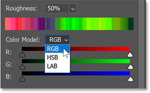
*Color Model changes the appearance of the colors in the noise gradient.*

You can then use the three **sliders** to limit the range of colors in the noise depending on your chosen color model.

For example, with the color model set to HSB:

- The **H** sliders can be used to limit the range of possible hues.
- Use the **S** sliders to limit the range of saturation values.
- The **B** sliders limit the range of brightness values.

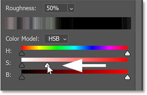
*Dragging the S sliders to limit the saturation in the colors.*

### Restrict Colors and Add Transparency

Turn on **Restrict Colors** to prevent any of the colors in the noise gradient from becoming oversaturated.

Or turn on **Add Transparency** to add random amounts of transparency across the gradient.

You may need to scroll down in the Properties panel to find these options.

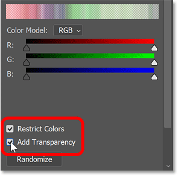
*Click Randomize to generate a new noise gradient.*

### Randomize

Finally, click the **Randomize** button to regenerate the noise gradient with new random colors.

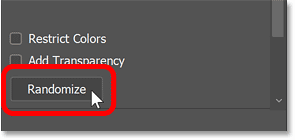
*Click Randomize to generate a new noise gradient.*

### Switching back to a Solid gradient

In most cases you’ll want a traditional solid gradient, so I’ll switch the type from Noise back to **Solid**.

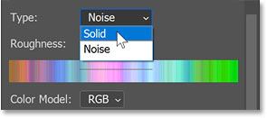
*Changing the gradient type back to Solid.*

### Method

Method allows you to change the way colors are displayed in the gradient, and is the same as what we saw earlier in the Options Bar.

- **Perceptual** (the default) displays colors that look more natural.
- **Linear** displays color transitions in a simple straight line.
- **Classic** is how gradients were displayed in previous Photoshop versions.

In most cases, leaving the method set to Perceptual is the best choice.

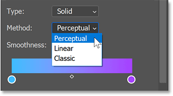
*Changing the gradient type back to Solid.*

### Smoothness

The Smoothness value controls the smoothness of the transition between colors in the gradient.

To make it easier to see, I’ll temporarily switch to the Black, White gradient preset.

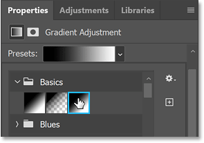
*Changing the gradient preset to Black, White.*

The default Smoothness value is 100 percent.

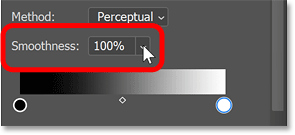
*Smoothness at the default 100 percent.*

And notice that at 100 percent, most of the transition between the colors happens closer to the middle.

This creates a higher contrast gradient, which is usually what we want and is great for creating a [high contrast black and white photo](/photo-effects/high-contrast-black-and-white/).

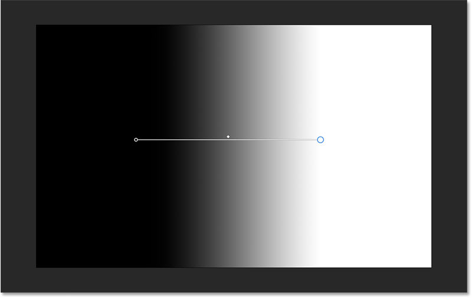
*High Smoothness values push most of the transition closer to the midpoint.*

If we lower the Smoothness to 0 percent:

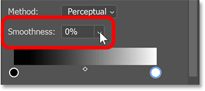
*Lowering the Smoothness value to 0 percent.*

The transition is more evenly spread out.

It can be tough to spot the difference sometimes, but leaving Smoothness at 100 percent usually looks best.

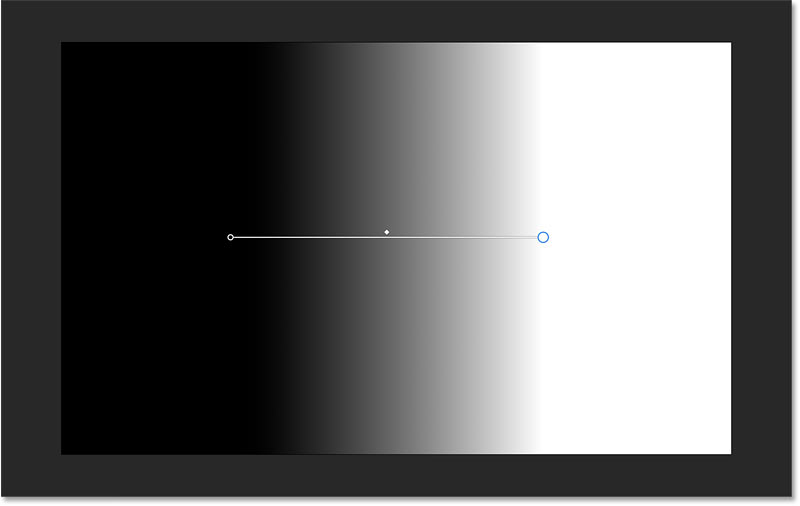
*Low Smoothness values create more linear transitions.*

I’ll switch back to my Purples gradient preset.

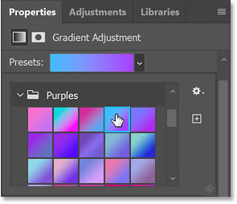
*Changing back to the original gradient preset.*

### Editing the gradient colors

Below the Smoothness option is the main **gradient preview bar** showing the current gradient colors.

Here we can edit the colors in much the same way that we did earlier using the on-canvas controls.

- Double-click on a color swatch to choose a new color from the Color Picker.
- Click below the bar to add a new color stop, then double-click on it to change the color.
- Drag a color stop left or right to change its location in the gradient.
- Drag the diamond icon between two color stops to change the midpoint location.
- Delete a color stop by dragging it away from the preview bar.

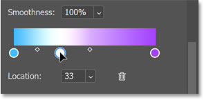
*Adding and editing colors using the gradient preview bar.*

If you moved the midpoint between two color stops and want to reset it back to the exact middle, click on its **diamond** icon to select it, then set the **Location** value to **50 percent**.

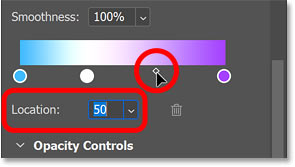
*Use Location to set a specific midpoint value.*

### Adding opacity to the gradient

To add transparency to a live gradient, we can’t use the on-canvas controls. Instead we need to use the **Opacity controls** in the Properties panel. You may need to twirl open the Opacity controls to view them.

*The gradient opacity controls in the Properties panel.*

Below the preview bar is an **opacity stop** on either end of the gradient (similar to a color stop).

Click on a stop to select it. I’ll select the one on the left.

*Clicking on an opacity stop.*

Then to add transparency at that location, either:

- Enter a specific value into the Opacity option, or
- Click the arrow next to the value and drag the slider, or
- Click and drag across the word Opacity to adjust it using the scrubby slider.

I’ll lower the opacity for the left side of the gradient to 0 percent.

*Making the left side of the gradient transparent.*

Notice that the left side now appears white on the canvas. But that’s because it’s transparent, and the white is from the Background layer below it showing through.

*The white from the Background layer is showing through the transparancy in the gradient.*

If I turn off the Background layer in the Layers panel:

*Turning off the Background layer.*

We see the transparency, indicated by the checkerboard pattern.

So I now have a gradient that runs from transparent on the left to purple on the right.

*Turning off the Background layer reveals the transparency.*

You can click below the opacity preview bar to add more opacity stops, drag to reposition them, set the opacity for each stop separately, or drag the diamond icon between two opacity stops to adjust the midpoint.

*Adding more opacity stops to the gradient.*

To delete an opacity stop, either drag it away from the preview bar until it disappears, or click to select it and then click the **trash bin** icon.

*Clicking the trash bin to delete the selected opacity stop.*

I’ll reset the opacity for the left stop back to 100 percent.

*Resetting the opacity on the left to 100 percent.*

### Reset Alignment

The **Reset Alignment** button in the **Quick Actions** section will realign the gradient to the canvas.

This resets the gradient angle to 90 degrees and stretches the gradient across the canvas from top to bottom.

*The Reset Alignment button.*

### How to save a custom gradient preset

Finally, to save a gradient with your custom colors, click the **Save Preset** button.

*The Save Preset button.*

Give the new preset a name. I’ll name mine “Transparent to Purple”.

Then click OK to save it.

*Naming the new gradient preset, then clicking OK to save it.*

Once the gradient is saved, open the Gradient Preset picker, either in the Options Bar or at the top of the Properties panel.

*Opening the Gradient Preset picker.*

Then scroll down below the default themes and you’ll find your new custom preset at the bottom.

*The saved gradient preset.*

## Example: Using a live gradient with an image

And that’s everything you need to know to draw, edit and save live gradients in Photoshop.

So let’s look at an example of how you might use a live gradient with your photo.

For this part of the tutorial, I’ll use [this image](https://adobe.prf.hn/click/camref:1100lrdjJ/destination:https%3A%2F%2Fstock.adobe.com%2Fimages%2Felegant-woman-dancing-on-water-sunset-and-silhouette%2F135264338) from Adobe Stock, and I’ll use a live gradient to quickly change and enhance the colors.

*The original photo.*

### Selecting the Gradient Tool

First I’ll select the Gradient Tool from the toolbar.

*Selecting the Gradient Tool.*

### Choosing a gradient preset

Then in the Options Bar, I’ll click the color swatch to open the Gradient Preset picker and I’ll choose a preset from the Reds theme.

*Selecting a gradient preset.*

### Choosing a gradient style

Since we’ve only looked at linear gradients so far, this time I’ll set the gradient style to **Radial**.

*Choosing the Radial gradient style.*

### Drawing the initial live gradient

Then I’ll click on the image and drag out an initial gradient.

Since the style is set to Radial, the gradient appears in a circle extending outward from the starting point.

*Drawing the radial gradient.*

### Changing the gradient’s blend mode

Of course, there’s an obvious problem. The gradient is blocking the image from view. So to fix that, I need to change the gradient’s **blend mode**.

In the Layers panel, the gradient appears on a new Gradient Fill layer above the image. So with the Gradient Fill layer selected, I’ll change its blend mode from Normal to **Soft Light**.

*Changing the Gradient Fill layer’s blend mode to Soft Light.*

And now the colors from the gradient are blending with the image.

The Soft Light blend mode also enhances contrast, making the effect really pop.

*The gradient colors blend with the image after changing the blend mode.*

### Adjusting the live gradient

Since we’re working with a live gradient, all of the gradient properties remain editable.

For example, I can reposition the gradient by dragging the line that connects the color stops. Or since this is a radial gradient, I can also drag the color stop in the center.

*Repositioning the center of the live gradient.*

Or I could scale and resize the gradient by dragging the color stop on the outer edge.

I could also change the colors by double-clicking on a color stop, or add a new color stop by clicking just above or below the line. And I could drag the color stops to reposition the colors or drag the diamonds to adjust the midpoints.

But in this case, I like the colors the way they are.

*Scaling the radial gradient.*

### How to hide or show the on-canvas controls

To hide the on-canvas controls and get a better view of the image, just select any other tool in the toolbar. I’ll select the Move Tool.

*Selecting a different tool to hide the on-canvas controls.*

And now we see how the gradient looks without the on-canvas controls in the way.

To bring the on-canvas controls back, reselect the Gradient Tool (and make sure the Gradient Fill layer is active in the Layers panel).

*Viewing the gradient effect with the on-canvas controls hidden.*

### Lowering the opacity of the gradient

Finally, if the gradient colors are too strong, simply lower the Gradient Fill layer’s **opacity** in the Layers panel. I’ll lower it to 60 percent.

*Lowering the Gradient Fill layer’s opacity.*

Here once again is the photo with the original colors.

*The photo with the original colors.*

And here is the final result after lowering the opacity of the gradient.

*The final gradient color effect.*

And there we have it! That’s how to use live gradients in the latest version of Photoshop.

**More Photoshop Gradient Tutorials:**

- [How to color grade images using gradient maps](/photo-editing/how-to-color-grade-images-in-photoshop-with-gradient-maps/)
- [Instant high contrast black and white photos with gradient maps](/photo-effects/high-contrast-black-and-white/)
- [How to warp a gradient inside text](/photoshop-text/text-effects/how-to-warp-a-gradient-in-text-with-photoshop/)
- [Find the missing gradients, patterns and shapes in Photoshop](/basics/find-missing-shapes-gradients-and-patterns-in-photoshop-cc-2020/)

Don't forget, all of my Photoshop tutorials are now available to [download as PDFs](/print-ready-pdfs/)!