# How to use Paint Symmetry in Photoshop

> Source: [https://www.photoshopessentials.com/basics/how-to-use-paint-symmetry-in-photoshop-cc-2019/](https://www.photoshopessentials.com/basics/how-to-use-paint-symmetry-in-photoshop-cc-2019/)
> Downloaded and converted to Markdown.

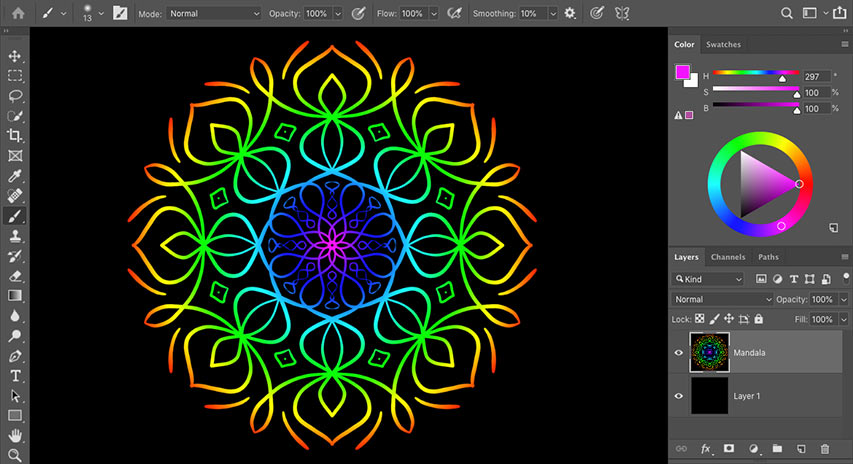

Learn how to use the new Paint Symmetry feature in Photoshop CC 2019 to easily create fun, symmetrical artwork and designs!

Paint Symmetry in Photoshop allows you to paint multiple brush strokes at once to create mirrored, symmetrical designs and patterns. It works with the Brush Tool, the Pencil Tool and the Eraser Tool, and it also works with layer masks.

First added as a technical preview in Photoshop CC 2018, Paint Symmetry is now an official part of Photoshop as of CC 2019. All of the more basic symmetry options from CC 2018, like Vertical, Horizontal and Diagonal, are included. Plus CC 2019 also adds two new symmetry modes, Radial and Mandala, that let you create amazing, highly complex symmetrical artwork in seconds! Let's see how it works.

To follow along, you'll need the [latest version of Photoshop](https://prf.hn/l/dlXjD2w). And if you're already a Creative Cloud subscriber, make sure that your copy of Photoshop CC is [up to date](/basics/update-photoshop-cc/).  Let's get started!

## How to paint with symmetry in Photoshop

We'll start by learning the basics of how to use Paint Symmetry to create symmetrical artwork and designs. Once we know the basics, I'll show you how to combine Paint Symmetry with layer masks for more creative effects!

### Step 1: Add a new blank layer

Start by adding a new blank layer to your document. This will keep your brush strokes separate from everything else. To add a new layer, click the **New Layer** icon at the bottom of the [Layers panel](/basics/layers/layers-panel/):

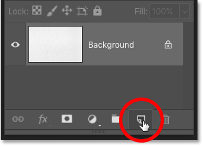
*Clicking the New Layer icon.*

### Step 2: Select the Brush Tool, Pencil Tool or Eraser Tool

Paint Symmetry works with the Brush Tool, the Pencil Tool and the Eraser Tool, all of which are found in the [Toolbar](/basics/photoshop-tools-toolbar-overview/). I'll select the **Brush Tool**:

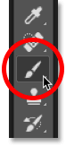
*Selecting the Brush Tool.*

[How to download over 1000 more brushes in Photoshop](/basics/get-more-brushes-photoshop-cc-2018/)

### Step 3: Open the Paint Symmetry menu

With the Brush, Pencil or Eraser Tool selected, a **Paint Symmetry icon** (a little butterfly) appears in the Options Bar. Click the icon to open the Paint Symmetry menu:

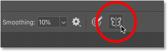
*Clicking the Paint Symmetry (butterfly) icon.*

### Step 4: Choose a symmetry option

And then in the menu, choose a symmetry option from the list. There are ten different styles to choose from in CC 2019, including the new Radial and Mandala options at the bottom:

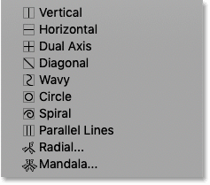
*The Paint Symmetry options in Photoshop CC 2019.*

#### The Paint Symmetry options in Photoshop CC 2019

Here's a quick summary of how each of Photoshop's ten Paint Symmetry options works:

- **Vertical:** Divides the canvas vertically and mirrors brush strokes from one side onto the other side.
- **Horizontal:** Divides the canvas horizontally and mirrors brush strokes from the top onto the bottom, or from the bottom onto the top.
- **Dual Axis:** Divides the canvas vertically *and* horizontally into four equal sections (top left, top right, bottom left, and bottom right). Painting in one section mirrors your brush strokes in the other three.
- **Diagonal:** Divides the canvas diagonally and mirrors brush strokes from one side onto the other.
- **Wavy:** Similar to Vertical but with a curved, wavy line instead of a straight line.
- **Circle:** Mirrors brush strokes painted inside a circle outside the circle, and vice versa.
- **Spiral:** Mirrors brush strokes painted along either side of a spiral path.
- **Parallel Lines:** Divides the canvas into three vertical sections using two parallel vertical lines. Brush strokes painted in the middle section are mirrored in the left and right sections.
- **Radial:** Divides the canvas into diagonal segments, or "slices". Brush strokes painted in one segment are mirrored in the others.
- **Mandala:** Similar to Radial, but mirrors the brush strokes *within* each segment as well, creating twice as many brush strokes as Radial.

We won't go through every symmetry option here since you can easily try them out on your own. But to show you the basics of how they work, I'll choose a simple one, like **Dual Axis**. Dual Axis is a combination of the Vertical and Horizontal modes listed above it:

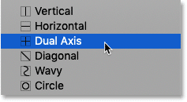
*Selecting one of the ten Paint Symmetry options.*

#### The symmetry path

Choosing an option from the menu adds a blue **symmetry path** to the document. In this case, it's a Dual Axis symmetry path, dividing the canvas vertically and horizontally into four equal sections:

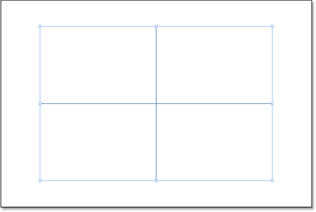
*A symmetry path appears.*

### Step 5: Resize and accept the path

Before you can paint with a symmetry path, Photoshop first places a **Transform box** around the path so you can scale and resize it  if needed. But note that the path is for **visual reference only**. Symmetry paths always affect the **entire canvas** regardless of the path's actual size. Since painting outside the path boundary has the same effect as painting inside it, there's really nothing to be gained by resizing symmetry paths. So in most cases, you won't need to resize it.

However, if you do want to resize the path, simply drag any of the transform handles to scale the path proportionally. To scale the path from its center, press and hold **Alt** (Win) / **Option** (Mac) as you drag a handle. You can also move the path to a different location in the document by clicking and dragging inside the Transform box:

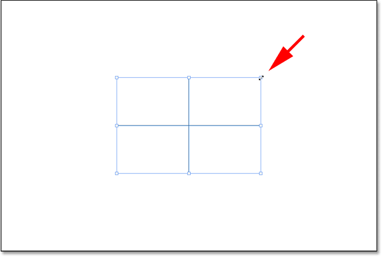
*Scaling the symmetry path by dragging a corner handle.*

[Related: Free Transform's new features and changes in CC 2019](/basics/free-transform-in-photoshop-cc-2019-new-features-and-changes/)

To accept the path (even if you did not resize it) and exit out of the Transform command, click the **checkmark** in the Options Bar, or press **Enter** (Win) / **Return** (Mac) on your keyboard:

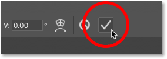
*Clicking the checkmark to commit the path.*

### Step 6: Paint in one of the sections to create symmetry

Then, with the symmetry path in place, simply paint inside one of the sections. Photoshop will automatically copy and mirror your brush stroke in the other sections, creating a symmetrical design:

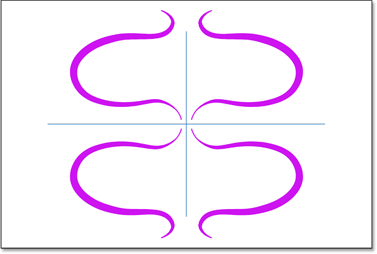
*Painting a single brush stroke creates multiple, mirrored strokes.*

The more brush strokes you paint, the more complex the design becomes. Even with limited painting skills, Photoshop makes it easy to come up with something interesting:

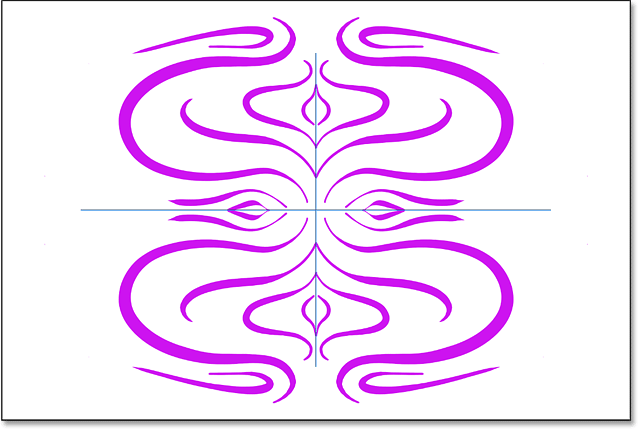
*Painting more brush strokes adds to the symmetrical design.*

#### How to  hide the symmetry path

To view your artwork without the blue symmetry path getting in the way, hide the path by clicking the **Paint Symmetry ** icon (the butterfly) in the Options Bar and choosing **Hide Symmetry**:

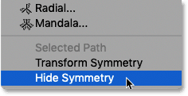
*Choosing Hide Symmetry from the Paint Symmetry options.*

Since the path is only for visual reference, you can continue painting and adding to the design even with the path hidden:

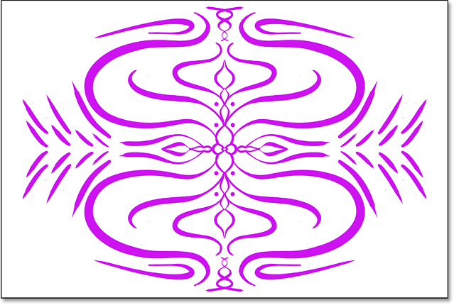
*Hiding the path still lets you paint symmetrically.*

#### How to show the symmetry path

To show the path again, click the butterfly icon in the Options Bar and choose **Show Symmetry**:

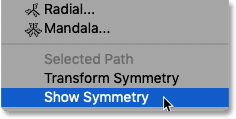
*Choosing Show Symmetry from the Paint Symmetry options.*

And now the path is once again visible:

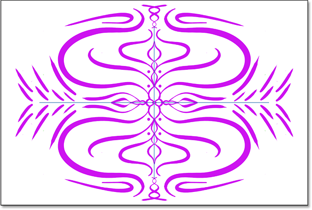
*Is it art? Probably not, but it was certainly easy.*

### Viewing the symmetry path in the Paths panel

Like regular paths in Photoshop, symmetry paths appear in the **Paths panel**. The path is named based on its symmetry mode (in this case, "Dual Axis Symmetry 1"). And the butterfly icon in the lower right of the thumbnail tells us not only that it's a symmetry path, but that it's currently active. You can have multiple symmetry paths in the same document (as we'll see in a moment), but only one can be active at a time:

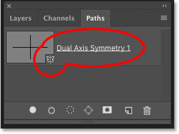
*Symmetry paths can be viewed and selected in the Paths panel.*

## The new Radial and Mandala symmetry options

New in Photoshop CC 2019 are two new Paint Symmetry options, **Radial** and **Mandala**. Let's see how they work.

### How to use the Radial symmetry option

The Radial symmetry mode divides the canvas into diagonal segments, or "slices" (think pizza slices). Painting in one slice mirrors your brush strokes in the others.

#### Step 1: Choose Radial from the Path Symmetry options

Click the butterfly icon in the Options Bar and choose **Radial** from the list:

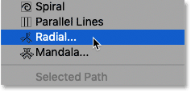
*Choosing Radial from the Paint Symmetry options.*

#### Step 2: Set the number of segments

Then choose the number of path segments (slices) you need, from 2 to 12. I'll go with 5:

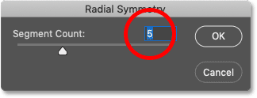
*Choosing the number of segments to divide the canvas into.*

#### Step 3: Paint in one of the segments

And then simply paint in one of the segments. Photoshop will mirror your brush stroke in the other segments, creating a radial pattern:

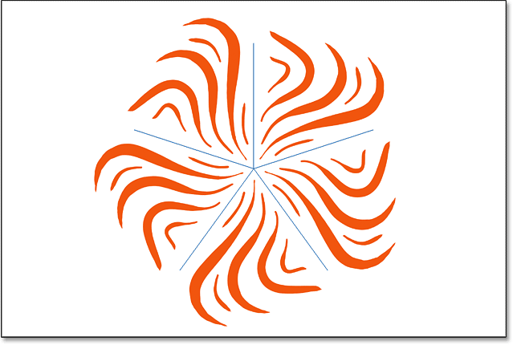
*Creating a radial symmetry design.*

### How to use the Mandala symmetry option

Like Radial, the Mandala symmetry mode also divides the canvas into diagonal segments. The difference between Radial and Mandala is that, along with mirroring your brush stroke in the other segments, Mandala also mirrors the stroke in the *same* segment. This adds twice as many brush strokes as Radial, allowing you to create highly complex symmetrical patterns with very little time and effort.

#### Step 1: Choose Mandala from the Path Symmetry options

Click the butterfly icon in the Options Bar and choose **Mandala** from the list:

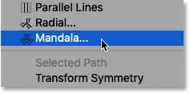
*Choosing Mandala from the Paint Symmetry options.*

#### Step 2: Set the number of segments

Then, just like with Radial, choose the number of path segments you need. While Radial lets you choose up to 12 segments, Mandala is limited to 10. I'll go with 8:

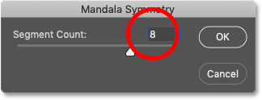
*Choosing the number of segments.*

#### Step 3: Paint in one of the segments

And then, just like before, paint in one of the segments. Photoshop will mirror your brush stroke in the same segment you paint in, and it will mirror *both* brush strokes in the other segments. This complex design took me only a couple of minutes:

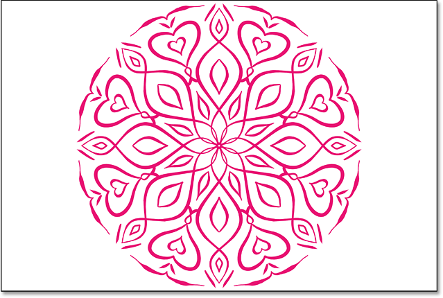
*Mandala is the most impressive (and fun) of Photoshop's Paint Symmetry options.*

### How to undo brush strokes when you make a mistake

Creating symmetrical designs in Photoshop is fun and easy, but can also involve a lot of trial and error. If you don't like the brush stroke you just painted, you can undo it from your keyboard by pressing **Ctrl+Z** (Win) / **Command+Z** (Mac). Continue pressing the shortcut to undo multiple brush strokes. To redo brush strokes, press **Shift+Ctrl+Z** (Win) / **Shift+Command+Z** (Mac).

## How to switch between symmetry paths

Photoshop lets us add multiple symmetry paths to the same document, and each one you add appears in the **Paths** panel. The **butterfly icon** in the bottom right of a thumbnail indicates the currently-active symmetry path. Only one path can be active at a time. In this case, my Mandala path is active:

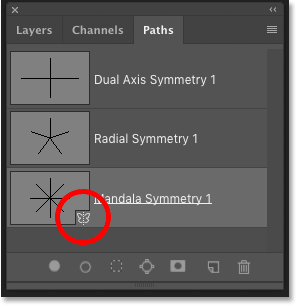
*The butterfly icon shows the active path.*

To switch to one of the other paths in the list, **right-click** (Win) / **Control-click** (Mac) on the path you need:

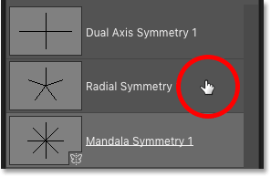
*Right-clicking (Win) / Control-clicking (Mac) on the Radial symmetry path.*

And then choose **Make Symmetry Path** from the menu:

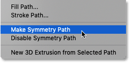
*Choosing the "Make Symmetry Path" command.*

This deactivates the previous path and activates the new one so you can paint with it in the document:

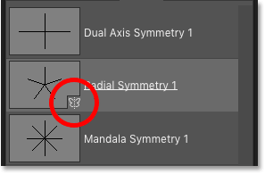
*The Radial Symmetry path is now active.*

#### The Last Used Symmetry option

You can also switch from your current symmetry path to your previously-used path by clicking the butterfly icon in the Options Bar and choosing **Last Used Symmetry**:

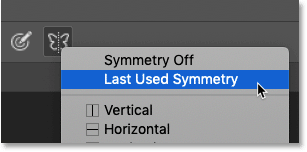
*The Radial Symmetry path is now active.*

### How to turn Paint Symmetry off

To turn Paint Symmetry off and continue painting without the symmetry effect, click the butterfly icon in the Options Bar and choose **Symmetry Off**:

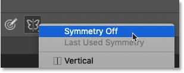
*Choosing "Symmetry Off" from the menu.*

## How to use Paint Symmetry with a layer mask

Now that we've learned the basics of how Paint Symmetry works, let's look at how we can use a symmetry path with a [layer mask](/basics/understanding-photoshop-layer-masks/) to create something even more interesting. 

In this document, I have a radial [gradient](/basics/how-to-draw-gradients-with-the-gradient-tool-in-photoshop/) on the Background layer:

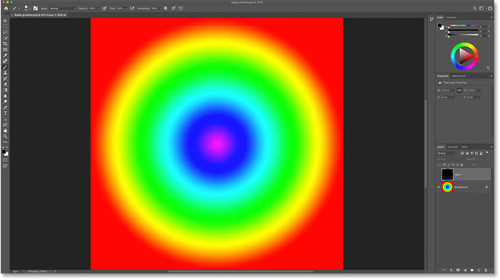
*A radial spectrum gradient.*

And if we look in the Layers panel, we see that I also have a solid black layer sitting above the gradient. I'll turn the top layer on by clicking its visibility icon:

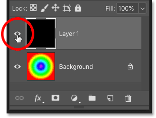
*Turning the top layer on in the document.*

And now the document is filled with black, blocking the gradient from view:

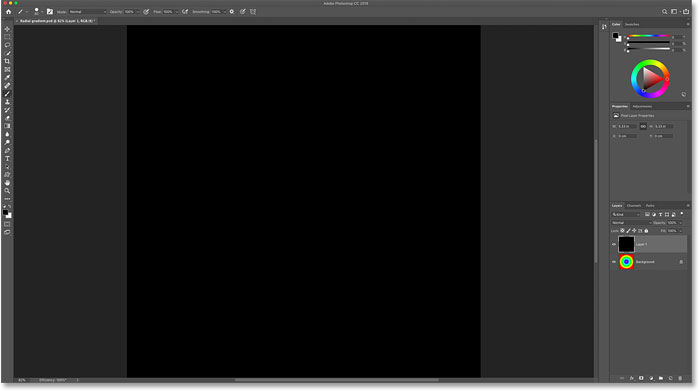
*The top layer is now hiding the gradient.*

### Step 1: Add a layer mask

With the top layer selected, I'll add a layer mask by clicking the **Add Layer Mask** icon at the bottom of the Layers panel:

*Clicking the Add Layer Mask icon.*

A layer mask thumbnail appears on the top layer:

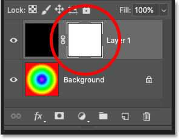
*The layer mask thumbnail.*

### Step 2: Select the Brush Tool

I'll select the Brush Tool from the Toolbar:

*Selecting the Brush Tool.*

### Step 3: Set the Foreground color to black

And since I want to hide the top layer in the areas where the symmetry effect appears, I'll make sure my **Foreground color** (the brush color) is set to **black**:

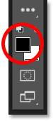
*Setting the brush color to black.*

### Step 4: Choose a Paint Symmetry option

I'll choose **Mandala** from the Paint Symmetry options in the Options Bar:

*Choosing a symmetry option.*

And Photoshop adds a Mandala symmetry path to the document. To accept it, I'll press **Enter** (Win) / **Return** (Mac) on my keyboard:

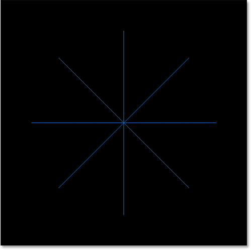
*The symmetry path is added to the document.*

### Step 5: Paint a symmetrical design on the layer mask

Then, to hide the current layer and reveal the layer below it, simply paint on the layer mask. As the symmetry effect expands, more and more of the layer below is revealed. In this case, the colors from my gradient are showing through the brush strokes:

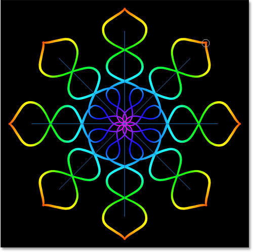
*Painting with a symmetry path on the layer mask to reveal the image below.*

I'll continue painting to add more brush strokes to the Mandala effect. And here is my final, colorful result:

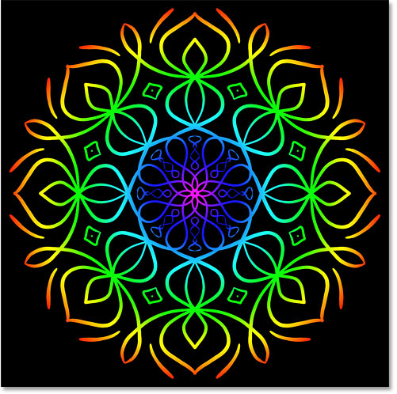
*The final Mandala design.*

And there we have it! That's how to use Paint Symmetry in Photoshop CC 2019! Check out our [Photoshop Basics](/basics/) section for more tutorials! And don' forget, all of our tutorials are now available to [download as PDFs](/print-ready-pdfs)!