# How To Use Smart Filters In Photoshop

> Source: [https://www.photoshopessentials.com/basics/how-to-use-smart-filters-in-photoshop/](https://www.photoshopessentials.com/basics/how-to-use-smart-filters-in-photoshop/)
> Downloaded and converted to Markdown.

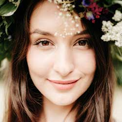

In this tutorial, I show you how to use smart filters in Photoshop! You'll learn everything you need to know about smart filters, including what smart filters are, and the advantages they have over Photoshop's regular filters. You'll learn how to apply and edit a smart filter, how to add multiple smart filters to a single image, how to control which parts of your image are effected by the smart filters, and more! We'll even learn how to apply Photoshop's most powerful filter, the Camera Raw Filter, as an editable, non-destructive smart filter!

I'll be using [Photoshop CC](https://prf.hn/l/dlXjD2w) but smart filters are available in any version of Photoshop from CS3 and up. Let's get started!

### What are smart filters?

A **smart filter** is really just a normal Photoshop filter, but one that's been applied to a smart object. A **smart object** is a container that holds the contents of a layer safely inside it. When we convert a layer into a smart object, any changes we make are applied to the container itself, not to its contents. This keeps our changes both editable and non-destructive. And when we apply one of Photoshop's *filters* to a smart object, the filter automatically becomes an editable, non-destructive *smart* filter! 

The main advantage of smart filters is that we can change a smart filter's settings any time we need without any loss in quality, and without making any permanent changes to the image. But there are other advantages as well. We can turn smart filters on and off, change the blend mode and opacity of a smart filter, and even change the order in which smart filters are being applied. Smart filters also include a built-in layer mask, giving us control over exactly which part of the image is being affected. And because smart filters are entirely non-destructive, they give us the freedom to experiment with different filters and filter settings without worrying about messing anything up. The truth is, if you're not using smart filters, you're missing out on one of Photoshop's best features, so let's see how they work! 

## How to apply a smart filter in Photoshop

For this tutorial, I'll use [this image](https://prf.hn/l/b3QO5lq) that I downloaded from Adobe Stock. Since our goal is to learn about smart filters, not to create a specific effect, you can easily follow along with any image of your own:

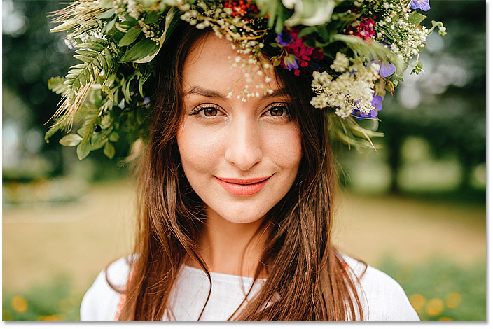
*The original image. Photo credit: Adobe Stock.*

### Converting a layer into a smart object

Before we can apply smart filters, we first need to convert our image into a smart object. In the [Layers panel](/basics/layers/layers-panel/), we see the image on the [Background layer](/basics/background-layer-photoshop-cc/):

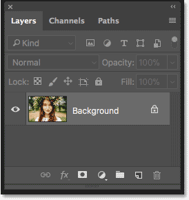
*The image opens on the Background layer.*

To convert the layer to a smart object, double-click on the name "Background" to rename it:

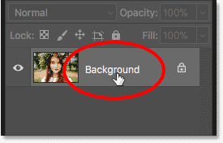
*Start by renaming the Background layer.*

In the New Layer dialog box, give the layer a more descriptive name. I'll name mine "Photo". Click OK to accept it:

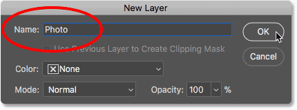
*Renaming the Background layer.*

Back in the Layers panel, we see that my Background layer is now the "Photo" layer. To convert it to a smart object, click on the **menu icon** in the upper right of the Layers panel:

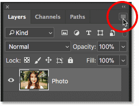
*Clicking the Layers panel menu icon.*

Then choose **Convert to Smart Object** from the list:

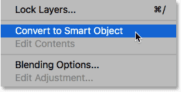
*Choosing "Convert to Smart Object".*

A **smart object icon** appears in the lower right of the layer's preview thumbnail, telling us that our layer is now a smart object:

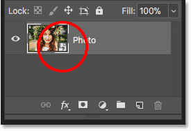
*The smart object icon.*

[Related tutorial: How to create smart objects in Photoshop](/basics/how-to-create-smart-objects-in-photoshop/)

### Applying a Photoshop filter as a smart filter

Once we've converted a layer to a smart object, any filters we apply to it from Photoshop's Filter menu will be automatically converted into smart filters. For example, let's start with something simple, like the Gaussian Blur filter. Go up to the **Filter** menu in the Menu Bar, choose **Blur**, and then choose **Gaussian Blur**:

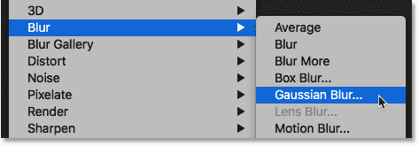
*Going to Filter > Blur > Gaussian Blur.*

We can use the Gaussian Blur filter to blur the image, and we control the amount of blur using the **Radius** option at the bottom of the dialog box. I'll set my Radius value to 10 pixels:

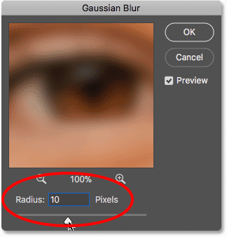
*Adjust the blur amount with the Radius slider.*

Click OK to close the dialog box, and here's my image with the blur applied:

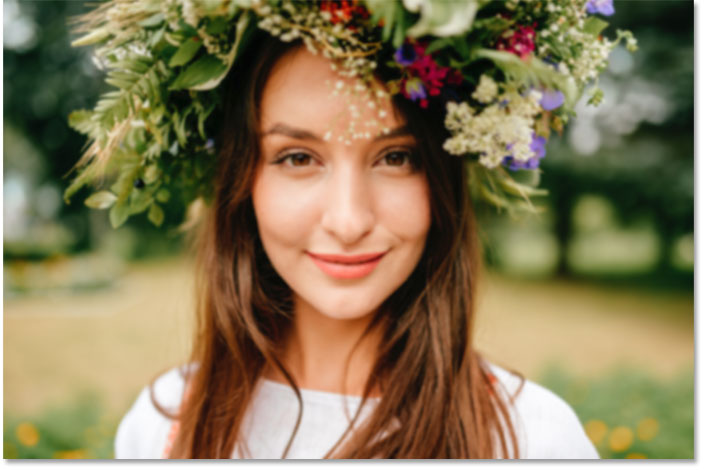
*The image after applying the Gaussian Blur filter.*

### Viewing the smart filters

If we look again in the Layers panel, we see our Gaussian Blur filter now listed as a smart filter below the "Photo" smart object. All we had to do was apply it to a smart object and Photoshop instantly converted the filter into a smart filter:

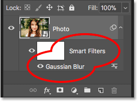
*Smart filters are listed below the smart object they've been applied to.*

## How to edit a smart filter

The main advantage that smart filters have over Photoshop's regular filters is that we can edit a smart filter and change its settings after it's been applied. To edit a smart filter, double-click on the filter's name:

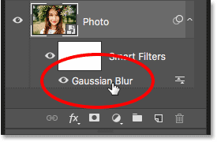
*Double-click on a smart filter to reopen it.*

This reopens the filter's dialog box. I'll increase the Radius value from 10 pixels to 20 pixels, and then I'll click OK:

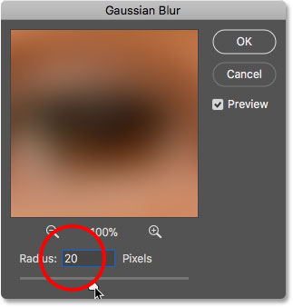
*Editing the smart filter.*

My new filter setting is instantly applied to the image. And because smart filters are non-destructive, there's no loss in image quality. The new filter setting simply replaces the previous setting, as if the previous one never happened:

*The same image after editing the Gaussian Blur smart filter.*

## Changing a smart filter's blend mode and opacity

Along with being able to change their settings, another advantage of smart filters in Photoshop is that we can change a filter's **blend mode** and **opacity**. If you look to the right of a smart filter's name in the Layers panel, you'll find an icon with two sliders. This is the filter's **Blending Options** icon. Double-click on it to open the Blending Options dialog box:

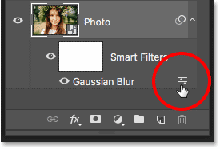
*Each smart filter will have its own Blending Options icon.*

Here we can change the blend mode and the opacity of the filter. In other words, we're changing how the effect of the filter is blending with the contents of its smart object. This is different from the Blend Mode and Opacity options in the Layers panel, which control how the *layer* blends with the layers below it. Here, we're affecting the filter itself.

I'll change the blend mode of the Gaussian Blur smart filter from Normal to **Soft Light**, and I'll lower the opacity to **50%**. Then I'll click OK to close the dialog box:

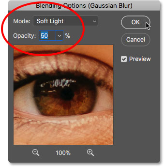
*Changing the blend mode and lowering the opacity of the smart filter.*

Changing the blend mode of the blur effect to Soft Light increases the contrast and color saturation of the image, creating a soft glow. And by lowering the opacity of the filter to 50 percent, I've reduced the intensity of the effect:

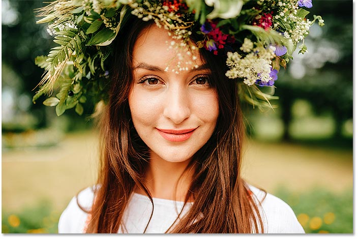
*The result after changing the Blending Options for the Gaussian Blur smart filter.*

[Related tutorial: Photoshop's Top 5 blend modes you need to know](/photo-editing/layer-blend-modes/intro/)

## Turning a smart filter on and off

Another advantage of smart filters is that we can toggle them on and off. To see what your image looked like before applying a smart filter, turn the filter off by clicking the **visibility icon** beside its name. Click the same visibility icon again (the empty spot where the eyeball appeared) to turn the filter back on and view the effect:

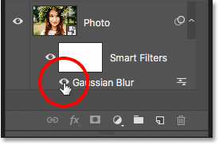
*Use the visibility icon to toggle a smart filter on and off.*

## Adding more smart filters

So far, we've applied a single smart filter, but we can add multiple smart filters to the same smart object. Let's add a second one, this time from Photoshop's Filter Gallery. Go up to the **Filter** menu in the Menu Bar and choose **Filter Gallery**:

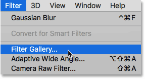
*Going to Filter > Filter Gallery.*

The Filter Gallery opens with a large preview area on the left, and the filters we can choose from, along with their settings, on the right:

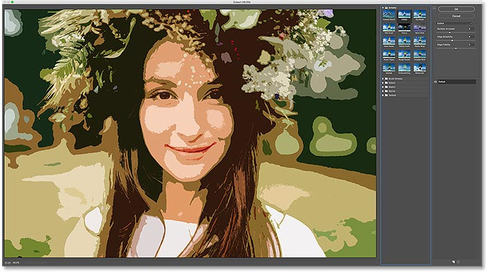
*Photoshop's Filter Gallery.*

I'll choose one of my favorite filters, **Diffuse Glow**, which is found in the **Distort** group of filters. Click on its thumbnail to select it:

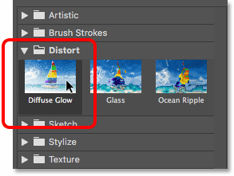
*Selecting the Diffuse Glow filter.*

In the settings for the Diffuse Glow filter, I'll set the **Graininess** to **3**, the **Glow Amount** to **5** and the **Clear Amount** to **8**. Then I'll click OK to close the Filter Gallery:

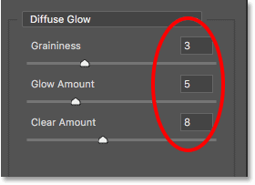
*The Diffuse Glow filter settings.*

And here's my image with Diffuse Glow applied:

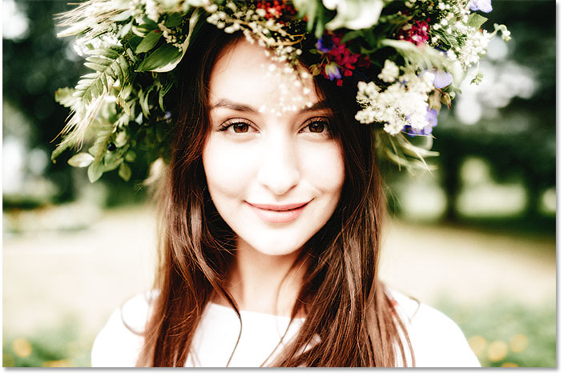
*The effect using the Diffuse Glow and the Gaussian Blur smart filters.*

In the Layers panel, we now see two smart filters listed below the smart object. Any filters that are part of the Filter Gallery are listed simply as "Filter Gallery" rather than by the name of the specific filter that was used:

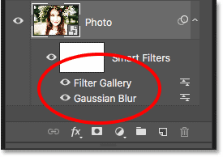
*The Layers panel showing both smart filters.*

### Editing the effect

If I wanted to try different settings for the Diffuse Glow filter, I could double-click on the name "Filter Gallery" to reopen it and make my changes. But in this case, I just want to reduce the intensity of the effect, so I'll double-click on the filter's **Blending Options** icon:

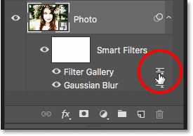
*Opening the Blending Options for the Filter Gallery.*

In the Blending Options dialog box, I'll leave the Blend Mode set to Normal but I'll lower the **Opacity** to around **80%**. Then I'll click OK:

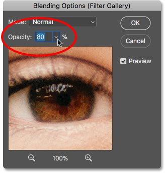
*Lowering the opacity of the Diffuse Glow filter.*

With the opacity lowered, the Diffuse Glow effect is now a bit less intense:

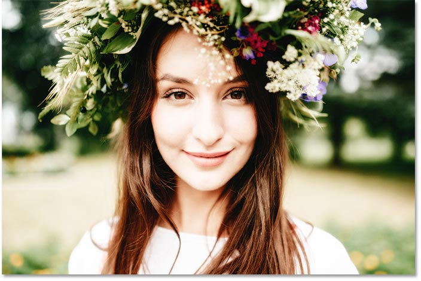
*The result after lowering the opacity.*

## Changing the order of smart filters

The order in which we apply smart filters is important because Photoshop applies them one after the other, from bottom to top. In my case, it's applying Gaussian Blur first, and then applying the Diffuse Glow filter on top of the blur effect. We can change the stacking order of smart filters by dragging them above or below each other in the list. I'll click on my Gaussian Blur filter, and then I'll drag it above the Diffuse Glow filter (the Filter Gallery). When a highlight bar appears above the Filter Gallery, I'll release my mouse button to drop Gaussian Blur into place:

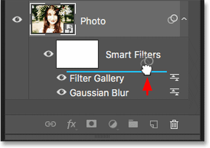
*Drag smart filters up or down to change the order in which they're applied.*

And now the Diffuse Glow filter is being applied first, and then Gaussian Blur on top of it:

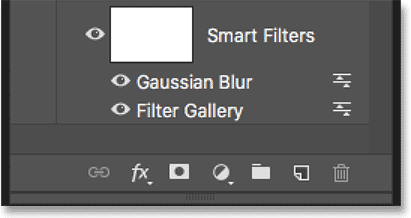
*Photoshop is now applying the filters in the opposite order.*

The difference can be subtle or more obvious depending on the filters you're using. In my case, it's subtle but noticeable. In this "before and after" comparison, we see that moving the Gaussian Blur filter above the Diffuse Glow filter added a bit more brightness and contrast to the effect (right) compared to the way it looked originally (left):

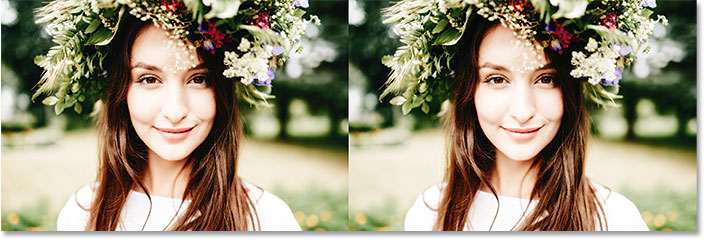
*The original (left) and new (right) version after changing the order of the smart filters.*

## Editing multiple smart filters

Here's an issue you'll run into when editing multiple smart filters. With the Gaussian Blur filter now sitting above the Filter Gallery, if I double-click on its name to edit the filter:

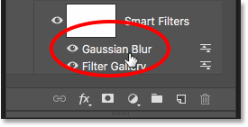
*Double-clicking on "Gaussian Blur".*

The Gaussian Blur dialog box reopens as we would expect. I'll click **Cancel** to close it without making any changes:

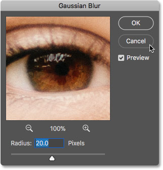
*The Gaussian Blur dialog box reopens.*

But watch what happens if I double-click on the words "Filter Gallery" *below* the Gaussian Blur filter:

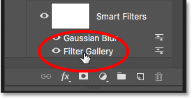
*Double-clicking on "Filter Gallery".*

Instead of the Filter Gallery opening right away, Photoshop instead pops open a message. The message tells us that any smart filters sitting above this filter will be temporarily turned off while we're making our changes. Again, the reason is because Photoshop applies smart filters from bottom to top. Since my Gaussian Blur filter is sitting above the Filter Gallery, Photoshop needs to turn off the Gaussian Blur filter so it can show an accurate preview of the Filter Gallery. Once I'm done making changes and I've closed the Filter Gallery, Photoshop will turn the Gaussian Blur filter back on. When you see this message, just click OK to accept it:

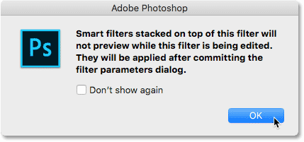
*Any smart filters above the selected filter will not preview until we're done with the edits.*

As soon as I close the message, the Filter Gallery reopens to my Diffuse Glow settings. I'll again click Cancel to close it without making any changes:

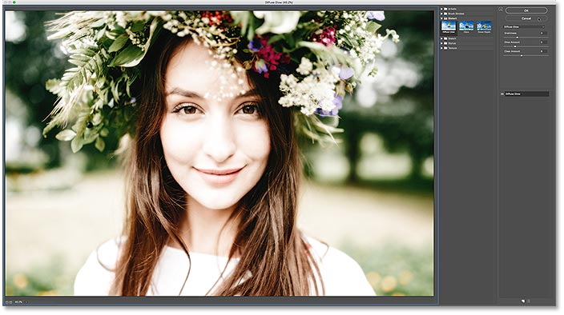
*Click OK to close the message and edit the smart filter.*

## Experimenting with smart filters

Since smart filters are completely non-destructive, we can safely play around and experiment with different filters and filter settings just to see what they do, and to see if we like the result. One of the filters I used for my [Falling Snow Effect](/photo-effects/photoshop-weather-effects-snow/) was the Crystallize filter. To see how it looks with this image, I'll select it by going up to the **Filter** menu, choosing **Pixelate**, and then choosing **Crystallize**:

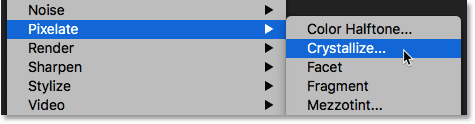
*Going to Filter > Pixelate > Crystallize.*

The Crystallize filter breaks an image into sections, or cells, of color. We control the size of the cells using the **Cell Size** option at the bottom. Since I'm just experimenting here, I'll set my Cell Size to 40, and then I'll click OK:

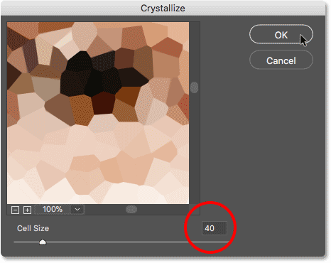
*The Crystallize filter dialog box.*

And here's the result. It's an interesting effect, and one that I'm sure I'll find a use for in the future. But for this image, it doesn't really work:

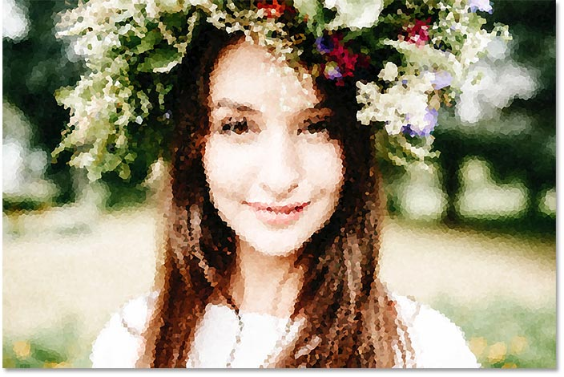
*The Crystallize filter's effect.*

## How to delete a smart filter

If you try a smart filter and don't like the results, not a problem. You can just delete it. In the Layers panel, we see the Crystallize filter now listed as a third smart filter above the others:

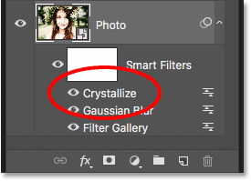
*The image now has three smart filters applied to it.*

To delete a smart filter, click on its name and drag it down onto the **Trash Bin** at the bottom of the Layers panel:

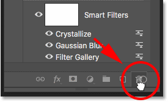
*Drag a smart filter onto the Trash Bin to delete it.*

With the filter deleted, the image instantly reverts back to the way it looked before the filter was applied:

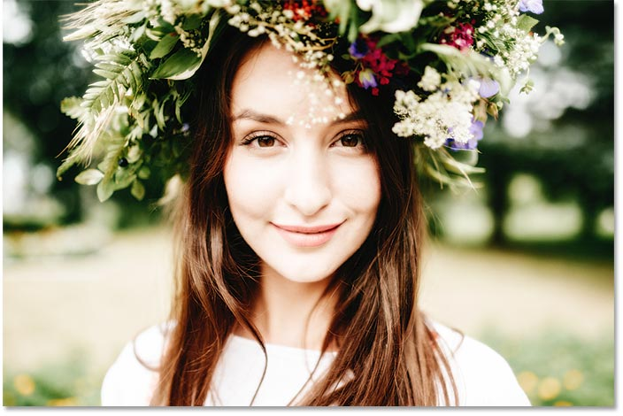
*The effect after deleting the Crystallize smart filter.*

## Applying Camera Raw as a smart filter

Let's add one more smart filter. This time, we'll add the most powerful filter in all of Photoshop, the Camera Raw Filter. Note that the Camera Raw Filter is only available in Photoshop CC, so you'll need [Photoshop CC](https://goo.gl/oiav4c) to follow along with this part.

Go up to the **Filter** menu and choose **Camera Raw Filter**:

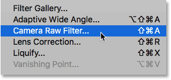
*Going to Filter > Camera Raw Filter.*

This opens the image in the Camera Raw Filter's dialog box. The Camera Raw Filter gives us access to the exact same image editing features that we'd find not only in Photoshop's main Camera Raw plugin but also in Adobe Lightroom. And by applying it as a smart filter, we're keeping the filter's settings completely editable:

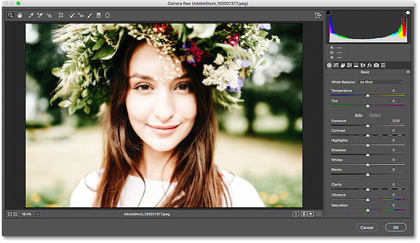
*The Camera Raw Filter dialog box.*

In the **Basic** panel on the right, I'll lower the **Clarity** value to **-25**. This will add a bit more softness to the effect by reducing contrast in the midtones. Then, to reduce the color saturation, I'll lower the **Vibrance** value also to **-25**:

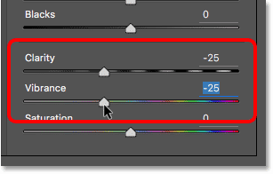
*Lowering the Clarity and Vibrance settings in the Basic panel.*

I'll click OK to close the Camera Raw Filter's dialog box, and here's the result so far:

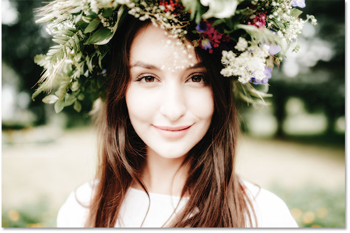
*The result after softening the image and lowering the color saturation.*

### Editing the Camera Raw Filter settings

In the Layers panel, we see the Camera Raw Filter listed as a smart filter above the Filter Gallery and the Gaussian Blur filter. To reopen its dialog box and make further edits, just double-click on the name "Camera Raw Filter":

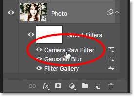
*Reopening the Camera Raw smart filter.*

I forgot that I also wanted to add a vignette effect to the image. So in the panel area on the right, I'll switch to the **Effects** panel by clicking its tab:

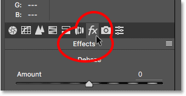
*Switching from the Basic to the Effects panel.*

Then, in the **Post Crop Vignetting** section, I'll drag the **Amount** slider to the left, to a value of around **-30**:

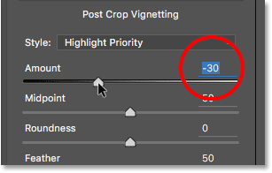
*Adding a vignette to the image.*

I'll click OK once again to close the Camera Raw Filter dialog box. And here's the result, not only with the Clarity and Vibrance adjustments that I made initially but also with the new vignette effect in the corners:

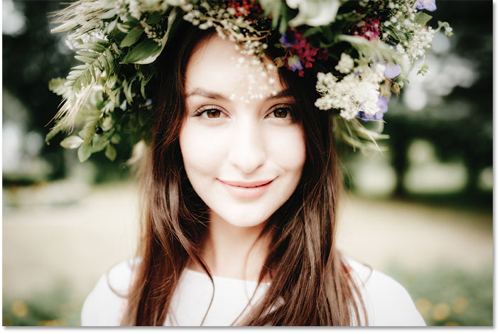
*The result after making more edits in the Camera Raw Filter.*

## Using the smart filter layer mask

And finally, another big advantage that smart filters have over regular filters is that smart filters include a built-in **layer mask**. The layer mask lets us control exactly which parts of the image are affected by the filters. In the Layers panel, we see the white-filled **layer mask thumbnail** beside the words "Smart Filters":

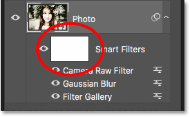
*Use the layer mask to control the visibility of the smart filters.*

I want to lower the brightness and restore some of the detail in the woman's face, so I need to reduce the impact of the smart filters in that part of the image. I can do that just by painting over that area on the layer mask with black. First, I'll click on the layer mask thumbnail to select it. The highlight border around the thumbnail tells me that the layer mask, not the smart object, is selected:

*Selecting the layer mask.*

I'll select the **Brush Tool** from the Toolbar:

*Choosing the Brush Tool.*

And still in the [Toolbar](/basics/custom-toolbar-photoshop/), I'll make sure my **brush color** (the Foreground color) is set to **black**:

*Photoshop uses the Foreground color as the brush color.*

Then, using a large, soft-edge brush, I'll paint on the layer mask over the woman's face. Notice, though, that instead of simply *reducing* the impact of the smart filters, I'm hiding them completely, which isn't what I wanted to do:

*Painting with black on the layer mask hides the effects of the smart filters.*

### Painting with a lower opacity brush

I'll undo my brush stroke by going up to the **Edit** menu and choosing **Undo Brush Stroke**:

*Going to Edit > Undo Brush Stroke.*

This restores the smart filters in the area where I painted:

*Undoing the brush stroke restored the filters.*

Then, in the Options Bar, I'll lower the **Opacity** of my brush from 100% down to around **40%**:

*Lowering the opacity of the brush to 40%.*

And this time, painting over the same area with a lower opacity brush simply reduces, rather than completely hides, the smart filter effects:

*Paint with a lower opacity brush to reduce, not remove, the effects of the smart filters.*

[Related tutorial: How to use layer masks in Photoshop](/basics/understanding-photoshop-layer-masks/)

## Showing and hiding all smart filters at once

Earlier, we learned that we can toggle an individual smart filter on and off by clicking the visibility icon beside the filter's name. But if you've applied multiple smart filters to a smart object and need to toggle all of them on and off at once, click the main **visibility icon** beside the layer mask thumbnail:

*Use the main visibility icon to toggle all smart filters on and off at once.*

Click it once to turn all the smart filters off and view the original contents of the smart object:

*Viewing the original image with the smart filters turned off.*

Click it again to turn the smart filters back on and view the effects:

*The effect with the smart filters turned on.*

And there we have it! That's everything you need to know to start using editable, non-destructive smart filters in Photoshop! For more tutorials on smart filters, learn how to create a colorful [twirl art effect](/photo-effects/twirl-art-effect/), how to create a [watercolor painting](/photo-effects/watercolor-painting-photoshop-cs6/) effect, or how to use [smart filters with text!](/basics/smart-filters-editable-type-photoshop/) Or visit our [Photoshop Basics](/basics/) section for more tutorials!