# How To Use The Custom Shape Tool In Photoshop

> Source: [https://www.photoshopessentials.com/basics/how-to-use-the-custom-shape-tool-in-photoshop-cs6/](https://www.photoshopessentials.com/basics/how-to-use-the-custom-shape-tool-in-photoshop-cs6/)
> Downloaded and converted to Markdown.

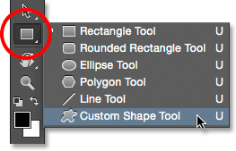
*Clicking and holding on the Rectangle Tool, then selecting the Custom Shape Tool from the menu.*

**Version Note:** This Custom Shape Tool tutorial is for Photoshop CS6. For newer versions including Photoshop 2022, please see my updated [How To Draw Custom Shapes in Photoshop](/basics/how-to-draw-custom-shapes-in-photoshop/) tutorial.

In the previous tutorial, [How To Draw Vector Shapes In Photoshop CS6](/basics/how-to-draw-vector-shapes-in-photoshop-cs6/), we learned how to use the five basic shape tools in Photoshop (the Rectangle Tool, the Rounded Rectangle Tool, the Ellipse Tool, the Polygon Tool, and the Line Tool) to add simple geometric shapes like rectangles, squares and circles, as well as stars, starbursts and direction arrows, to our documents.

While circles and squares do have their uses, what about more complex and interesting shapes? What if you wanted, say, a heart shape to use as a border for a wedding or engagement photo? Or the shape of a dog or cat to add to a pet store logo? How about shapes of flowers or leaves, snowflakes, music notes, or even a copyright symbol to add to your images? Photoshop actually includes all of these shapes and more, and we can add them to our designs and layouts just as easily as adding circles and squares.

Adobe calls these more complex shapes **custom shapes**, and we draw them using the **Custom Shape Tool**. The only problem is that, by default, only a handful of these custom shapes are available to us. Most of them are hidden. So in this tutorial, we'll learn everything we need to know about drawing shapes with the Custom Shape Tool, including how to access every custom shape that Photoshop has to offer!

If you're not yet familiar with the basics of drawing vector shapes in Photoshop, I highly recommend reading the [previous tutorial](/basics/how-to-draw-vector-shapes-in-photoshop-cs6/) before you continue.

## How To Draw Custom Shapes In Photoshop

### Selecting The Custom Shape Tool

The Custom Shape Tool is nested in with Photoshop's other shape tools in the **Tools panel**. To select it, click and hold on the icon for whichever shape tool is currently visible (which will either be the Rectangle Tool (the default) or whichever shape tool you used last). When you click and hold on the icon, a fly-out menu appears showing the other shape tools that are available. Select the **Custom Shape Tool** from the bottom of the list:

*Clicking and holding on the Rectangle Tool, then selecting the Custom Shape Tool from the menu.*

### Drawing Vector Shapes

With the Custom Shape Tool selected, the next thing we want to do is make sure we're drawing **vector shapes**, not paths or pixel-based shapes. We learned the important difference between vector shapes and pixel shapes in the [Drawing Vector vs Pixel Shapes](/basics/drawing-vector-vs-pixel-shapes-in-photoshop-cs6/) tutorial, but in short, vector shapes are *flexible*, *editable*, and *resolution-independent*, meaning we can edit and scale them as much as we want, and even print them any size we need, and the edges of vector shapes will always remain crisp and sharp.

To make sure you're working with vector shapes, set the **Tool Mode** option in the Options Bar along the top of the screen to **Shape** (short for "Vector Shape"):

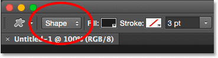
*Setting the Too Mode option to Shape.*

### Choosing A Custom Shape

Next, we need to tell Photoshop which custom shape we want to draw, and we do that by clicking on the **shape thumbnail** in the Options Bar. The thumbnail shows us the shape that's currently selected:

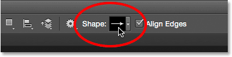
*Clicking the shape thumbnail.*

Clicking the thumbnail opens the **Custom Shape Picker**, with thumbnail previews of each shape that we can choose from. Use the **scroll bar** along the right to scroll through the thumbnails.

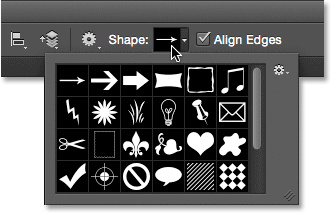
*The Custom Shape Picker, with thumbnail previews of each shape.*

### Loading More Shapes

As I mentioned at the beginning of the tutorial, only a handful of shapes are available initially, but there's many more that we can choose from. All we need to do is load them in. To do that, click on the **gear icon** in the upper right:

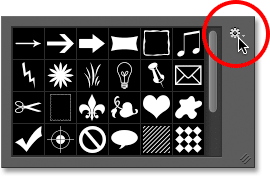
*Clicking the gear icon.*

In the bottom half of the menu that appears, you'll see a list of all the **custom shape sets** that Adobe includes with Photoshop. The shapes that are displayed initially are the default set, but looking through the list, we see that we have lots of other interesting sets, like Animals, Music, Nature, and so on. To load one of these sets, simply choose it from the list.

The only problem is that unless you've been using Photoshop for a while (and spent much of that time working with custom shapes), it's hard to know which shapes you'll find in each set. So, rather than choosing the sets individually, what I'd recommend is selecting **All** at the top of the list, which will load the shapes from every set all at once:

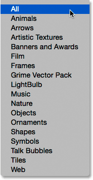
*Choosing All will save you a lot of guess work.*

Photoshop will ask if you want to replace the current shapes with the new ones. If you click the **Append** button, rather than replacing the current shapes with the new shapes, it tells Photoshop to keep the existing shapes and simply add the new ones below them. That may be a good choice if you were selecting an individual shape set from the list and you just wanted to add it to the default shapes.

In this case, because I'm choosing **All** (which includes the default shapes as part of the collection), I'm going to click **OK**. At the end of the tutorial, we'll learn how to reset the shapes back to the defaults:

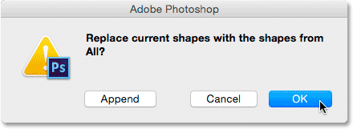
*The default shapes are included when choosing All, so just click OK.*

### Resizing The Custom Shape Picker

With all of the shapes now loaded in, we have far more to choose from. You can resize the Custom Shape Picker to see more shapes at a time by clicking and dragging its **bottom right corner**. In fact, you can make the Custom Shape Picker large enough to see every shape at once:

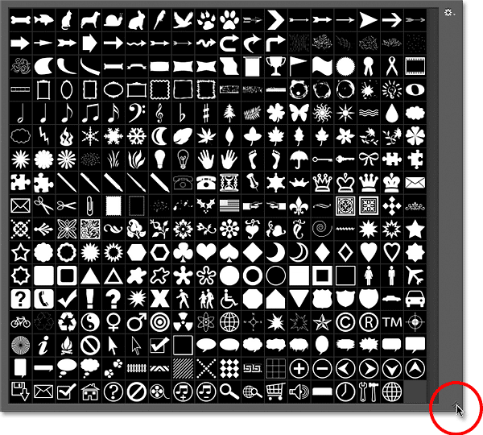
*Click and drag the bottom right corner to resize the Custom Shape Picker.*

Personally, I find that a bit too big, so I'll once again click and drag the bottom right corner of the Custom Shape Picker, this time to make it smaller. Then, I'll use the scroll bar along the right of the thumbnails to scroll through the shapes. To choose a shape, **double-click** on its thumbnail. This will select the shape and close out of the Custom Shape Picker. I'll choose the heart shape by double-clicking on it:

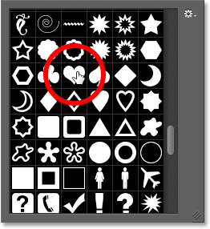
*Double-clicking the heart shape's thumbnail.*

### Choosing A Color For The Shape

Once you've selected a custom shape, choose a color for it by clicking the **Fill** color swatch in the Options Bar:

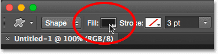
*Clicking the Fill color swatch.*

This opens a box that lets us choose from four different ways to fill the custom shape, each represented by one of **four icons** along the top. Starting from the left, we have the **No Color** icon, the **Solid Color** icon, the **Gradient** icon, and the **Pattern** icon. We covered the Fill (and Stroke) color options in detail in the previous tutorial ([How To Draw Vector Shapes In Photoshop CS6](/basics/how-to-draw-vector-shapes-in-photoshop-cs6/)) but I'll cover them again here as a refresher:

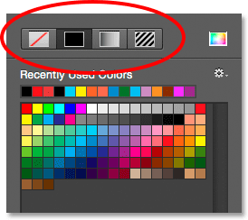
*The No Color, Solid Color, Gradient, and Pattern fill options.*

Selecting the **No Color** option on the left will leave your custom shape blank, which may be what you want if you need your shape to contain only a stroke outline. We'll see how to add a stroke in a moment.

The **Solid Color** option (second from left) lets us fill the custom shape with a single color. Choose a color by clicking on one of the **color swatches**. Colors you've used recently appear in the **Recently Used Colors** row above the main swatches:

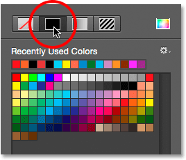
*The Solid Color fill option.*

If the color you need is not found in any of the swatches, click on the **Color Picker** icon in the upper right:

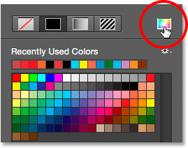
*Clicking the Color Picker icon.*

Then, choose your color manually from the Color Picker. Click **OK** when you're done to close out of the Color Picker:

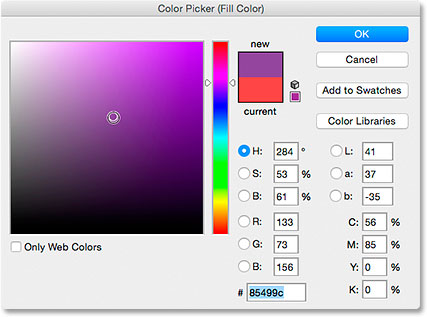
*Choosing a fill color from the Color Picker.*

The **Gradient** option lets us fill the shape with a gradient. You can choose one of the preset gradients by clicking on its **thumbnail** (use the scroll bar along the right to scroll through the thumbnails) or use the options below the thumbnails to create or edit your own gradient. We'll be covering gradients in a separate tutorial:

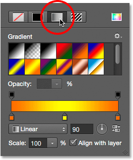
*The Gradient fill option.*

Finally, choose the **Pattern** option if you want to fill your custom shape with a pattern. Photoshop doesn't give us many patterns to choose from on its own, but if you've created or downloaded other patterns, you can load them in by clicking on the small **gear icon** (directly below the Custom Shape icon) and choosing **Load Patterns** from the menu:

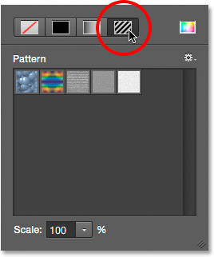
*The Pattern fill option.*

Since I chose a heart shape, I'll select the Solid Color option and choose red for my fill color by clicking on the red swatch. To close out of the color options box when you're done, press **Enter** (Win) / **Return** (Mac) on your keyboard, or just click on an empty area of the Options Bar:

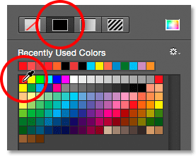
*Choosing a solid red for my fill color.*

### Drawing Your Custom Shape

To draw the shape, click inside your document to set a starting point. Then, keep your mouse button held down and drag away from the starting point. As you drag, you'll see only an outline (known as the *path*) of what the shape will look like:

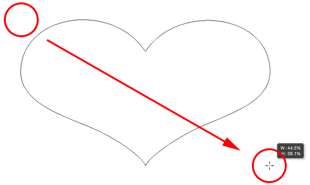
*Click to set a starting point, then drag away from the point to draw the shape.*

When you release your mouse button, Photoshop completes the shape and fills it with your chosen color:

*Photoshop fills the shape only after you release your mouse button.*

### Drawing A Shape With The Correct Proportions

Notice, though, that my heart shape looks a bit distorted. It's wider and shorter than I was expecting. That's because, by default, Photoshop lets us freely draw custom shapes to any size or proportions we like. I'll undo my shape by going up to the **Edit** menu in the Menu Bar along the top of the screen and choosing **Undo Custom Shape Tool**. I could also just press **Ctrl+Z** (Win) / **Command+Z** (Mac) on my keyboard. This removes the shape from the document:

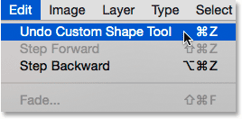
*Going to Edit > Undo Custom Shape Tool.*

To draw a custom shape with the correct proportions, begin the same way as before by clicking inside the document to set your starting point, then keeping your mouse button held down and dragging away from the point. As you're dragging, press and hold the **Shift** key on your keyboard. This will snap the shape to its correct proportions and lock them in place:

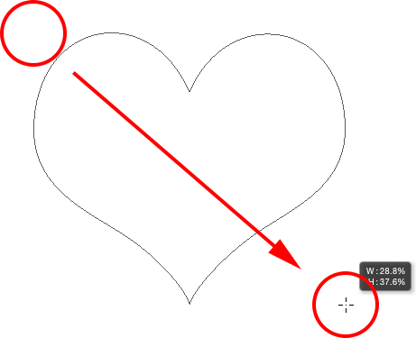
*Press and hold Shift as you drag to draw the shape with the correct proportions.*

When you're happy with the size of the shape, release your mouse button, *then* release your Shift key. It's very important that you release the Shift key only *after* you've released your mouse button or it won't work. Also, make sure you wait until *after* you've started dragging before pressing and holding the Shift key or you may get unexpected results.

I'll release my mouse button, then my Shift key, at which point Photoshop fills the shape with my chosen red color. This time, the heart looks much better:

*You'll usually want to draw custom shapes with the correct proportions.*

### Other Handy Keyboard Shortcuts

Along with pressing and holding **Shift** while dragging to draw the shape with the correct proportions, you can press and hold your **Alt** (Win) / **Option** (Mac) key while dragging to draw the shape out from its **center** rather than from a corner. Pressing and holding **Shift+Alt** (Win) / **Shift+Option** (Mac) while dragging will draw it with the correct proportions *and* draw it out from the center. Just remember to always release the keys *after* releasing your mouse button.

### Resizing The Shape

Once you've drawn your shape, you'll see its current width and height in the **Width** (**W**) and **Height** (**H**) boxes in the Options Bar. Here, we see that my shape was drawn 354 px wide and 308 px tall:

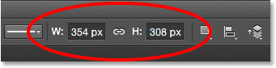
*The current width and height of the shape.*

If you need to resize the shape, simply highlight the current values with your mouse and enter new values (press **Enter** (Win) / **Return** (Mac) on your keyboard to accept them). To resize the shape and keep it locked to the correct proportions, first click on the small **link icon** between the width and height fields, then enter a new width or height. With the link icon selected, Photoshop will automatically change the other value for you:

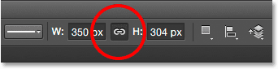
*Click the link icon before changing the width or height to lock the proportions in place.*

### Letting Photoshop Draw The Shape For You

If you haven't yet drawn your shape and you know the exact size you need, you can save time by letting Photoshop draw it for you. Simply click once inside your document. Photoshop will pop open the **Create Custom Shape** dialog box where you can enter in your width and height values. Click OK to close out of it and Photoshop will draw your shape with your chosen dimensions:

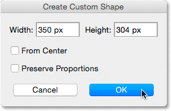
*Click once inside the document to open the Create Custom Shape dialog box.*

### Adding A Stroke

To add a stroke around the shape, click on the **Stroke** color swatch in the Options Bar. You can choose your stroke color (and other stroke options which we'll look at in a moment) either before or after you draw the shape:

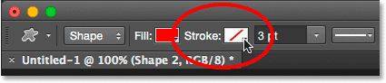
*Clicking the Stroke color swatch.*

The options for choosing a stroke color are exactly the same as the fill color options. Along the top, we have the same four icons giving us a choice between **No Color**, **Solid Color**, **Gradient**, and **Pattern**:

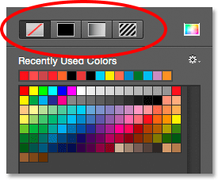
*The No Color, Solid Color, Gradient, and Pattern options, this time for the stroke.*

The No Color option is selected by default (which is why the stroke isn't visible). I'll select the Solid Color option, then I'll set my stroke color to black by clicking on the swatch. Just as with the fill color, if the color you need isn't found in any of the swatches, click the Color Picker icon to choose it manually:

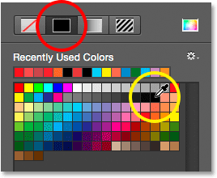
*Choosing a solid black as my stroke color.*

Just like that, Photoshop adds the black stroke around the shape:

*The same shape, now with a black stroke applied.*

### The Stroke Width

We can change the **width** of the stroke in the Options Bar. You'll find the current width displayed to the right of the Stroke color swatch. The default width is 3 pt. If you know the exact width you need, you can enter it directly into the width field (press **Enter** (Win) / **Return** (Mac) when you're done to accept it) or simply click on the small **arrow** to the right of the value and drag the **slider:**

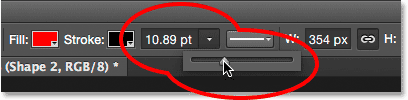
*Increasing the width of the stroke with the slider.*

### Align Edges

If you look further to the right in the Options Bar, you'll see an option called **Align Edges**. By default, this option is turned on (checked) and you'll usually want to leave it on because it tells Photoshop to line up the edges of your shape with the pixel grid, which keeps them looking crisp and sharp:

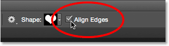
*The Align Edges option.*

However, for the Align Edges option to work, not only does it need to be selected, but you also need to specify the width of your stroke in **pixels** (**px**), not **points** (**pt**). Since the default measurement type for the stroke width is points, I'll go back and enter a new width of **10 px**:

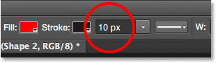
*For Align Edges to work, change the measurement type of your stroke width to pixels.*

Photoshop instantly updates the shape with the new stroke width:

*The shape after changing the stroke width to 10 ox.*

### More Stroke Options

There are other stroke options we can change as well by clicking the **Stroke Options** button in the Options Bar:

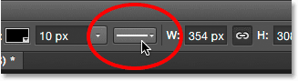
*The Stroke Options buttons.*

This opens the Stroke Options box. At the top, we can switch between having the stroke displayed as a **solid** line (the default), a **dashed** line or a **dotted** line. The **Align** option lets us choose whether the stroke should appear along the **inside** edges of the shape, the **outside** edges or **centered** along the edges. We can set the **Caps** option to either **Butt**, **Round** or **Square**, and change the **Corners** to either **Miter**, **Round** or **Bevel**. Clicking **More Options** at the bottom will open a more detailed dialog box with additional options for customizing the look of your stroke and for saving your custom settings as a preset:

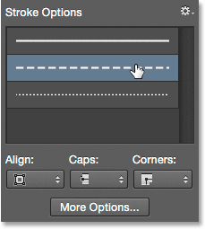
*The Stroke Options buttons.*

### Changing The Fill And Stroke Of Existing Shapes

Just as it does with the [geometric shape tools](/basics/how-to-draw-vector-shapes-in-photoshop-cs6/) (Rectangle Tool, Ellipse Tool, etc.), Photoshop places each vector shape we draw with the Custom Shape Tool on its own **Shape layer**. If we look in my Layers panel, we see my heart shape sitting on a Shape layer named "Shape 1":

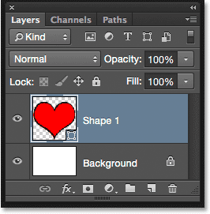
*The Layers panel showing the Shape layer.*

I'll add a second shape to my document. To do that, I'll re-open the Custom Shape Picker in the Options Bar, and this time, I'll choose the butterfly shape by double-clicking on its thumbnail:

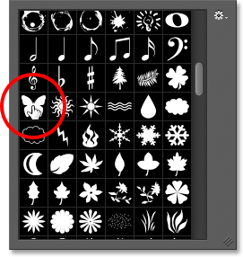
*Choosing the butterfly custom shape.*

With the butterfly shape selected, I'll quickly draw it by clicking inside the document to set a starting point, then clicking and dragging away from that point. To draw the butterfly with the correct proportions, I'll wait until I've started dragging, then I'll press and hold my **Shift** key and continue dragging:

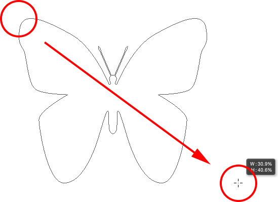
*Clicking and dragging to draw the butterfly (with Shift held down).*

To complete the shape, I'll release my mouse button, *then* release my Shift key. Photoshop fills the shape with color, but look what's happened; it used the same fill color (red) that I chose for my previous shape. It also used the same stroke options as the previous shape, including the color (black) and the width (10 px):

*The new shape used the exact same fill and stroke as the previous shape.*

Fortunately, because Shape layers in Photoshop remain fully editable, there's no need for me to undo and redraw the shape if I needed it to be a different color. As long as I have the Shape layer selected in the Layers panel (and the shape tool still selected from the Tools panel), I can easily go back and change the colors.

If we look again in my Layers panel, we see that the butterfly shape was placed on its own Shape layer named "Shape 2" above the heart shape:

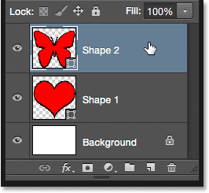
*The Layers panel showing both shapes, each on its own Shape layer.*

With the butterfly layer selected, I'll click on the **Fill** color swatch in the Options Bar and choose a different color from the swatches, maybe a nice magenta:

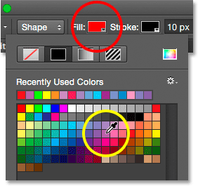
*Selecting a new fill color for the butterfly shape.*

I'm also going to lower the width of the stroke in the Options Bar, since 10 px seems too thick. I'll lower it down to **4 px**:

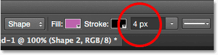
*Changing the width of the stroke for the butterfly shape.*

Photoshop instantly updates the butterfly shape with the new fill color and stroke width. The original heart shape remains untouched:

*The result after editing the butterfly shape.*

I think I want to lower the stroke width for the heart shape as well, so I'll click on the heart's Shape layer ("Shape 1") in the Layers panel to select it:

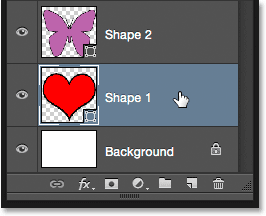
*Selecting the heart shape layer.*

I'll leave the fill color set to red, but I'll lower the stroke width in the Options Bar down to the same value (**4 px**) as the butterfly shape:

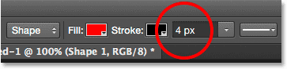
*Changing the width of the stroke for the heart shape.*

And now, both shapes share the same stroke width. You can edit the other stroke options (color, line type, alignment, etc.) as well if needed. As long as you have the correct shape layer selected in the Layers panel, and the shape tool still active, you can make whatever changes you need:

*The result after changing the stroke width for the heart shape.*

### Resetting The Custom Shapes Back To The Defaults

Earlier, we learned how to load other shape sets into the Custom Shape Picker. If you need to clear away those additional shapes and go back to viewing just the default shapes, click once again on the **gear icon** in the Custom Shape Picker:

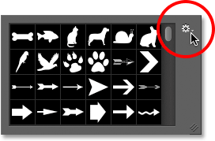
*Clicking the gear icon.*

Then choose **Reset Shapes** from the menu:

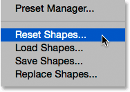
*Choosing "Reset Shapes".*

Photoshop will ask if you really want to replace the current shapes with the defaults. Click OK to say yes, and you'll be back to seeing only the original default shapes:

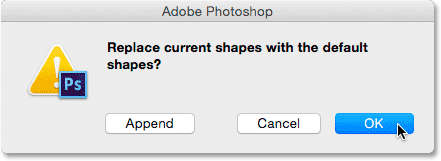
*Click OK when Photoshop asks if you want to revert back to the defaults.*