# How To Use The Gradient Editor In Photoshop

> Source: [https://www.photoshopessentials.com/basics/how-to-use-the-gradient-editor-in-photoshop/](https://www.photoshopessentials.com/basics/how-to-use-the-gradient-editor-in-photoshop/)
> Downloaded and converted to Markdown.

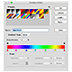

In the previous tutorial, we learned how to draw gradients in Photoshop using the Gradient Tool. Along with how to actually draw gradients, we learned how to use the Gradient Picker to choose from Photoshop's many preset gradients. Yet no matter how many gradients Adobe includes with Photoshop, it's often more useful (and *always* more fun) to create your own!

In this tutorial, we'll learn how to create, edit and save our own custom gradients using Photoshop's **Gradient Editor**. As we'll see, the Gradient Editor lets us choose from any of Photoshop's preset gradients, just like the smaller Gradient Picker, but it also lets us edit those gradients by choosing different colors, adding more colors, rearranging the colors, and removing colors! We can add transparency to the gradient, and even adjust how the colors transition from one to the other! And, we can save our gradient as a custom preset so we can choose it again quickly the next time we need it!

I covered the basics of drawing gradients in the previous tutorial, so here, we'll focus mainly on the Gradient Editor itself. If you're not yet familiar with Photoshop's Gradient Tool or how to draw gradients, I highly recommend reading our [How To Draw Gradients](/basics/how-to-draw-gradients-with-the-gradient-tool-in-photoshop/) tutorial before you continue. I'm using [Photoshop CC](https://prf.hn/l/dlXjD2w) but everything we're about to cover applies to **Photoshop CS6** as well. Let's get started!

## How To Edit Gradients In Photoshop

### Create A New Document

Let's begin by creating a new Photoshop document. To do that, I'll go up to the **File** menu in the Menu Bar along the top of the screen and choose **New**:

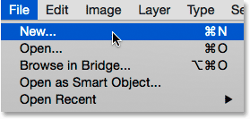
*Going to File > New.*

This opens the New dialog box. Since we’ll be focusing mainly on the Gradient Editor itself, it really doesn’t matter which size we choose for our document, but if you’re working along with me, let's create the same size document as last time, setting the **Width** to **1200 pixels** and the **Height** to **800 pixels**. I'll leave the **Resolution** set to its default **72 pixels/inch**, and I'll make sure **Background Contents** is set to **White**. I'll click **OK** to close out of the New dialog box, at which point a new white-filled document appears on the screen:

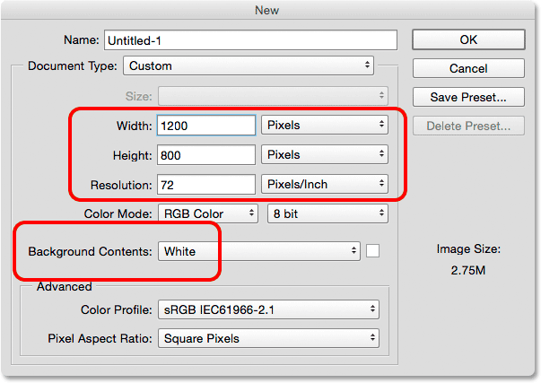
*Creating a new 1200 px by 800 px document.*

### Selecting The Gradient Tool

With my new document open, I'll select Photoshop's **Gradient Tool** from the **Tools panel**:

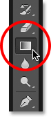
*Selecting the Gradient Tool.*

### Opening The Gradient Editor

As we learned in the previous tutorial, once we've selected the Gradient Tool, there's two different ways to choose a gradient. We can select one of Photoshop's ready-made preset gradients from the **Gradient Picker**, or we can create and edit our own gradient using the **Gradient Editor**. To open the Gradient Editor, click directly on the **gradient preview bar** in the Options Bar. If you click on the small arrow to the right of the preview bar, you'll open the [Gradient Picker](/basics/how-to-draw-gradients-with-the-gradient-tool-in-photoshop/) which we covered previously. This time, we want the Gradient Editor, so make sure you click the preview bar itself:

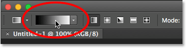
*Clicking the gradient preview bar in the Options Bar.*

This opens the Gradient Editor. It may look a bit intimidating as first, but as we're about to see, it's actually very simple to use:

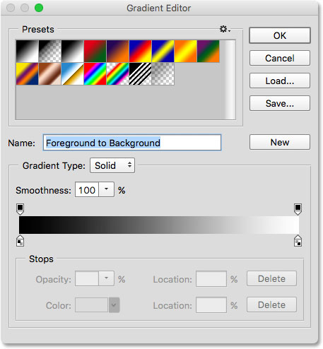
*Photoshop's Gradient Editor.*

### The Presets Area

Using the Gradient Editor is a two-step process. We don't actually create a gradient from scratch. Instead, we first choose a preset gradient to serve as a starting point. Then, we edit the preset gradient's colors to create our own custom gradient.

The Gradient Editor itself is divided into two main sections; there's the Presets area at the top and the editing section below it. The Presets area works the same way as the Gradient Picker, showing us thumbnails of all the preset gradients we can choose from. To select a gradient, just click on its thumbnail. The name of the gradient you've clicked on appears below the thumbnails:

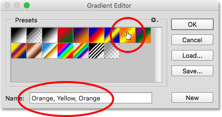
*Clicking on a thumbnail to select a preset gradient.*

Initially, we're given only a limited number of preset gradients, but Photoshop includes other **gradient sets** that we can load into the Gradient Editor, just like we can with the Gradient Picker. To see the list of additional sets, click the small **gear icon**:

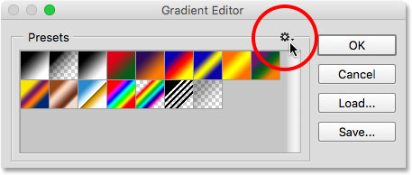
*Clicking the gear icon.*

You'll find the other gradient sets listed in the bottom half of the menu that appears. Each set is based on a certain theme, like Color Harmonies, Metals, Pastels, and so on. To select one, click on its name in the list. I'll select **Color Harmonies 1**:

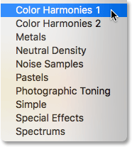
*Choosing the Color Harmonies 1 set.*

Photoshop will ask if you want to replace the current gradients with the new set. If you click **Append**, rather than replacing the current gradients, it will add the new ones below the current ones. I like to keep things as clutter free as possible, and since it's easy to restore the original gradients (as we'll see in a moment), I'll click **OK** to replace them:

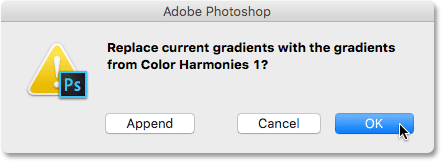
*Clicking OK to replace the default gradients with the new set.*

And now we see that the original gradients have been replaced with the new set:

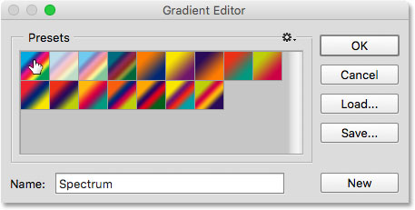
*The Color Harmonies 1 gradients.*

To restore the original default gradients, click once again on the **gear icon**:

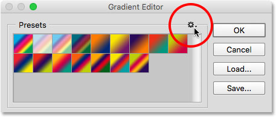
*Clicking the gear icon.*

Then choose **Reset Gradients** from the menu:

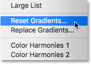
*Choosing "Reset Gradients".*

Photoshop will ask if you want to replace the current gradients with the defaults. Click **OK**:

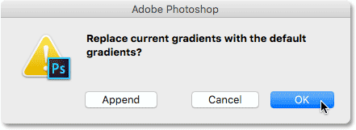
*Clicking OK to restore the default gradients.*

And now, we're back to seeing the original gradients once again:

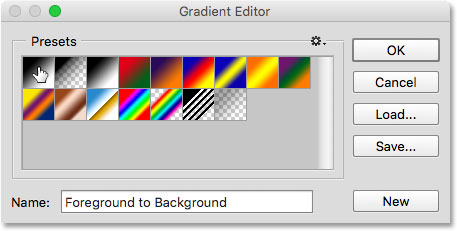
*The original gradients have been restored.*

### The Editing Area

If the whole point of the Gradient Editor is to create our own custom gradients, why does it give us access to so many presets when we can already choose presets from the Gradient Picker? Well, as I mentioned earlier, we don't actually create gradients from scratch in Photoshop. Instead, we start with one of the preset gradients and then we edit its colors.

The reason the Gradient Editor gives us access to all of Photoshop's preset gradients is so we can choose a preset that's already very similar to the gradient we want to create. That way, we'll have less work to do. For example, if we need to create a gradient that transitions between three colors, we can start by choosing a preset that already contains three colors. They may not be the colors we need, but at least it already has three of them.

Likewise, if we're creating a gradient that transitions from a solid color into transparency, we can save ourselves a bit of time by starting with a preset that already transitions into transparency. Or if the gradient will be using, say, pastel colors, it may be easier to first load the Pastels gradient set and choose a preset that's already using colors similar to the ones we need.

At least, that's the idea. The truth is, it's so easy to create any type of gradient you need with the Gradient Editor that you'll often find yourself starting with the most basic gradient of them all—the **Black, White** gradient (which is included as one of the defaults). I'll select it by clicking on its thumbnail (third one from the left, top row):

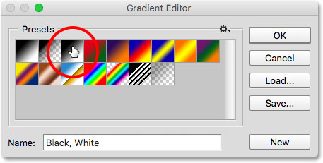
*Choosing the Black, White gradient.*

The tools and options for editing gradients are all found in the lower part of the Gradient Editor. Once you've selected a preset gradient, it appears in the large **gradient bar** which serves as your work area. This is where we "build" our gradient. In this case, since I chose the Black, White gradient, we're seeing the bar transitioning from black on the left to white on the right:

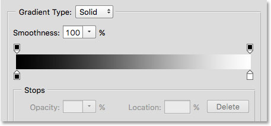
*The selected gradient appears in the preview bar.*

### The Gradient Type

If instead of a smooth gradient, you're seeing what looks like a random bunch of colored lines in the gradient bar, make sure the **Gradient Type** option above the bar is set to **Solid** and not **Noise**. We'll look at noise gradients in a separate tutorial because not only do *look* different, but the steps for creating them are also different. In general, whenever you want to create a standard gradient that transitions smoothly from one solid color to the next, you'll want the Gradient Type option set to Solid:

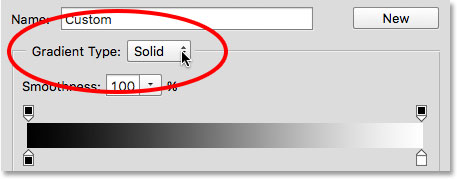
*Make sure Gradient Type is set to Solid.*

### Changing The Gradient Colors

If you look below the gradient bar, you'll see **color stops** (little square color swatches with arrows pointing up at the gradient above them). There's one for each of the main colors in the gradient. Since I chose the Black, White gradient, there's two color stops; one filled with **black** on the left and another filled with **white** on the right. These color stops tell Photoshop two important things—which colors to use in the gradient and where to put them:

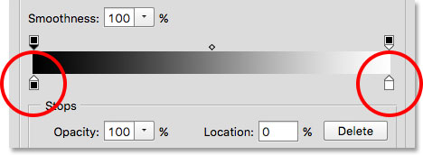
*The color stops below each end of the gradient.*

To change an existing color, first click on its stop to select it. Then, click on the **color swatch** in the **Stops** section at the bottom of the Gradient Editor to choose a different color. For example, let's say I want to change the black in my gradient to red. To do that, I'll click on the black color stop:

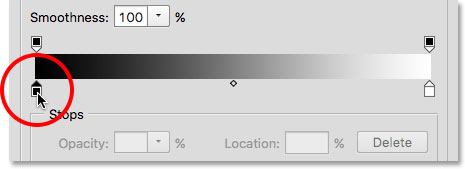
*Click the stop for the color you want to change.*

With the stop selected, I'll click on the color swatch:

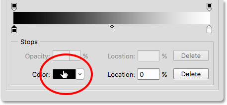
*Click the swatch to change the color.*

This opens Photoshop's **Color Picker**. I'll choose a dark red for my new color, then I'll click **OK** to close out of the Color Picker:

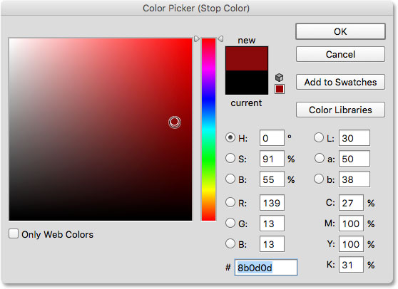
*Choosing red from the Color Picker.*

Just like that, my original *black* to white gradient is now a *red* to white gradient:

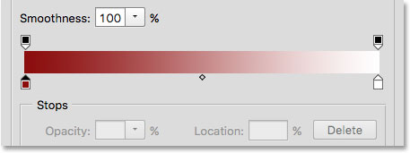
*The black in the gradient has been changed to red.*

I'll do the same thing with the other color, changing it from white to yellow. But this time, I'll use an even faster way to change the color. Rather than clicking on the stop to select it and then clicking on the color swatch, all you really need to do is **double-click** on the stop:

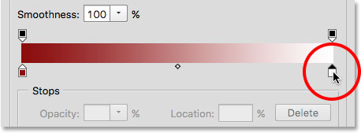
*Double-clicking on the white color stop.*

Double-clicking on it will instantly jump you straight to the Color Picker. I'll choose yellow, then I'll click **OK** to close out of it:

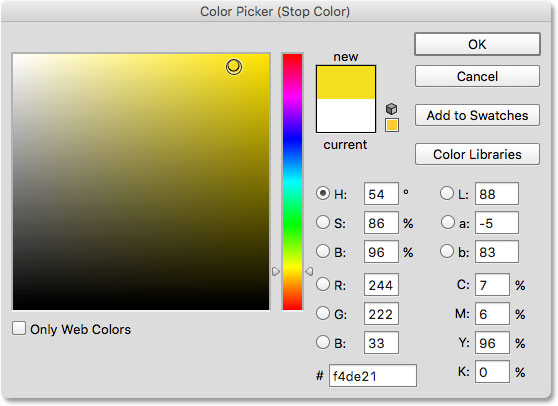
*Changing the white in the gradient to yellow.*

After just a few clicks, the original black to white gradient is now a custom red to yellow gradient:

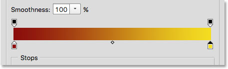
*The new gradient colors.*

### Adjusting The Midpoint

If you look directly between the two color stops, you'll see a small diamond-shaped icon. This is the **midpoint** icon. It represents the exact middle of the transition between the colors on either side of it (the spot where the two colors are mixed evenly). If you're not seeing the midpoint icon, click on one of the color stops and it will appear:

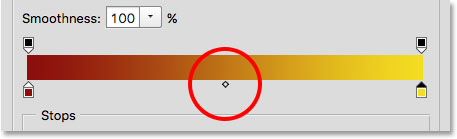
*The midpoint icon.*

We can change the location of the midpoint by dragging the icon closer to one color or the other. For example, I'll drag it towards the left so it's closer to my red stop. Notice the effect it's had on the gradient. With the midpoint now closer to red, I've shortened the transition area between red and the midpoint, and lengthened the transition between the midpoint and yellow:

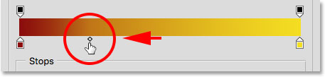
*Adjusting the transition by dragging the midpoint icon.*

### The Location Option

As we drag the midpoint icon, the **Location** option below the gradient bar updates to show us the exact spot, in percent, where the midpoint is located between the two colors. The default location is at **50%** (exactly halfway between them), but after dragging my midpoint to the left, the Location value now shows the midpoint at **25%**. In other words, it now takes only a quarter of the total distance between the colors for my gradient to transition from the color on the left to the midpoint, and three quarters of the distance to transition from the midpoint into the color on the right:

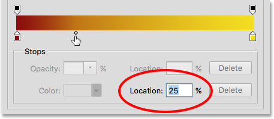
*The current midpoint location.*

We've already seen that we can change the midpoint location by dragging its icon, but we can also change it by entering a specific value into the Location field. If I want to move my midpoint from the one-quarter mark to, say, the three-quarter mark, I can do so by changing my Location value from 25% to **75%**:

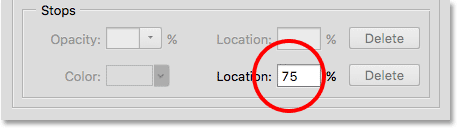
*Manually entering a new Location value.*

And now, we see that the midpoint icon has jumped over to that 75% mark, stretching out the distance between red and the midpoint while shrinking the distance between the midpoint and yellow:

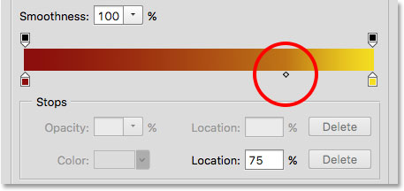
*The new midpoint location.*

I'll reset my midpoint back to its default spot by setting the Location value to **50%**:

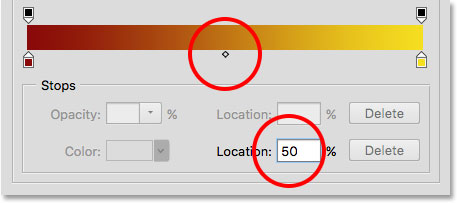
*The midpoint is now back to being halfway between the two colors.*

### Adding Colors To The Gradient

To add more colors to the gradient, all we need to do is click directly below the gradient at the spot where the new color should appear. Photoshop will add a new color stop at that location. For example, to add a third color halfway between my original two colors, I'll click on that spot below the gradient (note that I'm clicking *below* the midpoint icon, not directly on it):

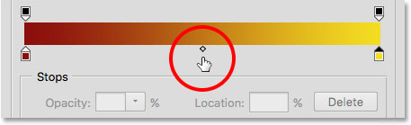
*Clicking to add a third color.*

This adds a new stop at that location. To change its color, **double-click** on the stop:

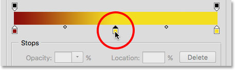
*Double-clicking on the new color swatch.*

Then choose a different color from the Color Picker. I'll choose blue:

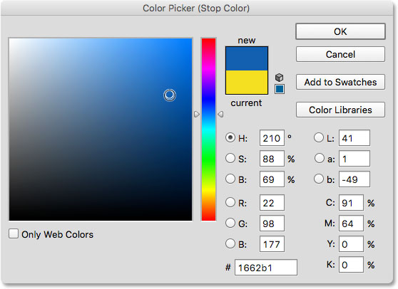
*Choosing a third color for my gradient.*

I'll click OK to close out of the Color Picker, and now my two-color gradient has become a three-color gradient. Not bad considering it started off originally as a black to white gradient:

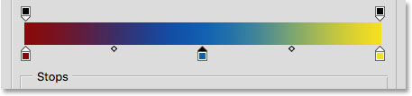
*The third color has been added.*

### Moving Colors Along The Gradient

Not only can we add colors to the gradient, but we can also move them around and even change the order in which they appear. There's a couple of ways to move them. One is to simply click on a color stop and drag it left or right. Here, I've clicked on the blue stop in the center and I'm dragging it closer to the yellow stop. Just as when we were moving the midpoint icon, the **Location** value updates as we drag the color stop to show its exact location in percent:

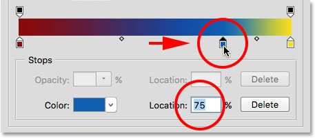
*Moving a color by dragging its stop along the gradient.*

Another way to move a color is to click on its stop to select it, then enter a value directly into the Location field. I'll click on my yellow stop to select it. Notice that its current location is at 100%:

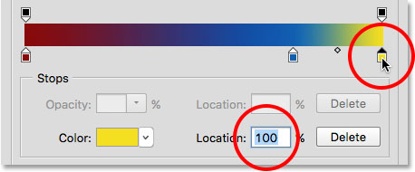
*Selecting the yellow stop.*

I'll change the location value to **50%**, which instantly jumps the yellow stop into the middle of the gradient:

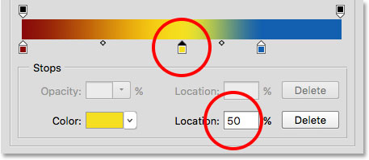
*Moving a color by entering a new Location value.*

I'll then click on the blue stop once again to select it:

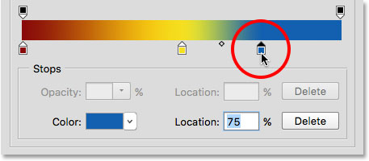
*Selecting the blue stop.*

I'll drag it all the way over to the right to where the yellow stop was originally, effectively swapping the two colors:

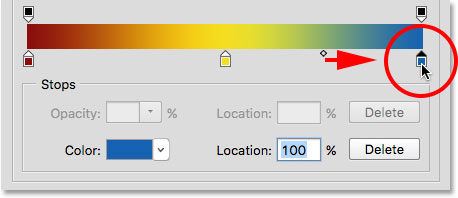
*Dragging the blue stop to the right edge of the gradient.*

### Removing A Color

To remove a color from the gradient, click on its color stop to select it, then drag down and away from the gradient until the stop disappears. I'll remove my blue color by clicking on its stop to select it:

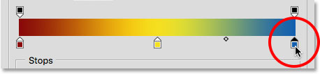
*Selecting the blue color stop.*

I'll drag it down and away from the gradient, and here we see that the blue color is now gone, leaving me with just my red and yellow colors. Photoshop gives us one level of undo when editing gradients, so if you delete a color by mistake, just press **Ctrl+Z** (Win) / **Command+Z** (Mac) on your keyboard to undo your last step and restore the color:

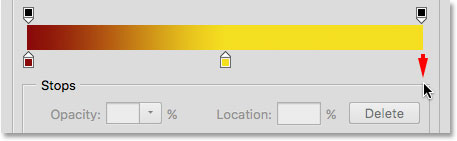
*Dragging down to remove the color stop.*

### Copying An Existing Color

Another way to add a color to a gradient is to make a copy of an existing color. To do that, press and hold the **Alt** (Win) / **Option** (Mac) key on your keyboard as you click on a color stop and drag it left or right. Rather than moving the original stop, you'll drag out a copy of the stop that you can then position anywhere you need along the gradient.

Let's say what I really want is a gradient that goes from red to yellow and then back to red. I already have the red I need over on the left. Rather than adding another color stop and manually choosing that same shade of red from the Color Picker, I can simply press and hold my Alt (Win) / Option (Mac) key, then click on the red stop and drag away from it towards the right, creating an identical copy:

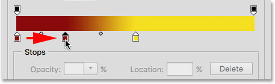
*Clicking and dragging a stop while pressing Alt (Win) / Option (Mac) creates a copy of it.*

I'll then drag the copy all the way over to the far right, creating my red to yellow to red gradient:

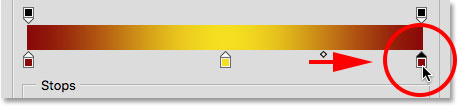
*Copying existing stops makes it easy to add the same color to different parts of the gradient.*

### Adding Transparency

If you look directly above the gradient bar, you'll see what looks like additional color stops. These are actually **transparency stops**. They allow us to adjust the transparency of different parts of the gradient. Here, we see one transparency stop at either end:

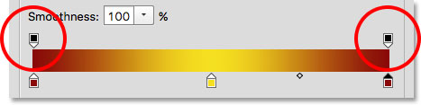
*The transparency stops.*

Some of Photoshop’s preset gradients already contain transparency while others don’t, but we can easily add it wherever we need it. For example, if I want my gradient to transition from a solid color on the left to being 100% transparent on the right, I can do that by first clicking on the transparency stop above the right side of the gradient. This enables the transparency options in the Stops section below the gradient. Notice that the stop's current **Opacity** value is **100%**, which means there's no transparency at all at that location:

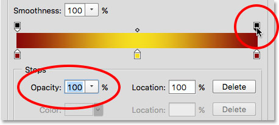
*Selecting the transparency stop on the right.*

To add transparency, I'll click on the **arrow** to the right of the current opacity value, then I'll lower the value by dragging the slider towards the left. I'll lower it all the way down to **0%** to make the right side completely transparent. You can also create partial transparency by choosing a value between 0% and 100%.

Notice that the color of the transparency stop has changed from **black** to **white**. Black means the opacity value of the stop is set to 100%. White means it's set to 0% (fully transparent). Partial transparency is represented by various shades of gray. Notice also that the gradient bar is now transitioning from a solid color on the left to a checkerboard pattern on the right. The checkerboard pattern is how Photoshop represents transparency:

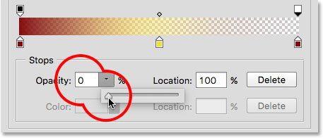
*Lowering the Opacity value of the transparency stop on the right to 0%.*

### Moving Transparency Stops

Just as we can move color stops to reposition them along the gradient, we can also move transparency stops. For example, what if I want the transition into transparency to start at yellow in the middle rather than at red on the left? There's a couple of ways I can do that. One would be to simply click on the transparency stop on the left and drag it into the middle of the gradient so it sits above yellow. My gradient now remains 100% opaque from red on the left to yellow in the the middle before transitioning into transparency on the right:

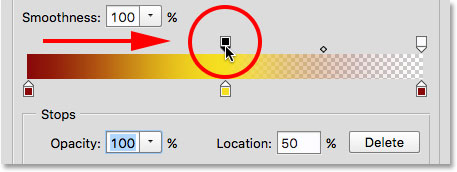
*Moving the transparency stop from the left to the center of the gradient.*

### Adding More Transparency Stops

Another way would be to leave my two transparency stops in their original locations and add a third stop above the middle of the gradient. I'll quickly jump the transparency stop back to its original spot on the left by changing its **Location** value from 50% to **0%**:

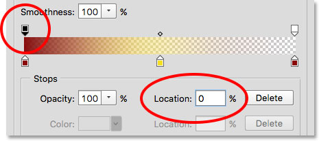
*Like color stops, transparency stops can be moved by changing their Location value.*

Then, I'll click above the gradient in the location where I want the new stop to appear. In this case, it's the middle:

*Clicking to add a third transparency stop in the middle of the gradient.*

Photoshop adds the new transparency stop. Notice that its Opacity value is already set to 100% so I don't need to change it, but I could set it to any value I wanted from 0% to 100%. Notice also that its Location is at 50%, but again I could move to it any other location either by dragging the stop itself or entering a different value into the Location field. You can add as many transparency stops as you need along the gradient for very fine-tuned control:

*Each transparency stop is fully independent of the others.*

You can copy existing transparency stops just as you can with color stops. Simply press and hold your **Alt** (Win) / **Option** (Mac) key on your keyboard as you drag the transparency stop either left or right to make a copy of it which you can then move into position. Also like color stops, you'll find **midpoint icons** between each set of transparency stops. Click and drag the midpoint closer to one stop or the other to adjust the transition:

*Adjusting the midpoint of the transparency on the right.*

### Removing Transparency Stops

To remove a transparency stop, click on it to select it, then drag up and away from the gradient until the stop disappears. I'll delete the stop on the right by clicking and dragging it upward. Since it was the only transparency stop of the three that had its Opacity value set to something other than 100%, removing it means I'm back to having no transparency at all in my gradient:

*Removing the transparency stop on the right.*

Finally, even though I don't really need to do this because my gradient no longer contains transparency, I'll put things back to the way they were originally by clicking on the transparency stop in the middle of the gradient and dragging it over to the right:

*Dragging the transparency stop from the middle to the right of the gradient.*

### Smoothness

One last option to look at in the Gradient Editor is **Smoothness** which controls how gradual the transitions appear between your main colors. At its default value of 100%, the transitions are spread out as evenly as possible. As you lower the value, it pushes more of the transitional shades towards your main colors, leaving fewer shades in the middle. This creates harsher looking transitions with more obvious banding, which usually isn’t what you want. In most cases, it’s best to leave Smoothness set to 100%:

*The Smoothness option.*

### Saving Your Gradient As A New Preset

When you're happy with how your gradient looks, you can save it as a new preset. First, enter a name for your new gradient into the **Name** field. I'll name mine "Red, Yellow, Red":

*Naming the new gradient.*

Then, click the **New** button:

*Clicking the New button.*

Photoshop will add your new gradient in with the other presets, giving it its own thumbnail that you can click on to select it the next time you need it:

*The new gradient will appear after the others in the presets area.*

When you're done, click **OK** to close out of the Gradient Editor:

*Clicking the OK button.*