# How to use the Navigator Panel in Photoshop

> Source: [https://www.photoshopessentials.com/basics/how-to-use-the-navigator-panel-in-photoshop/](https://www.photoshopessentials.com/basics/how-to-use-the-navigator-panel-in-photoshop/)
> Downloaded and converted to Markdown.

This tutorial shows you how to use the Navigator panel in Photoshop to zoom and pan images, and why the Navigator panel is like having the Zoom Tool and the Hand Tool rolled into one!

So far in this series on [navigating images in Photoshop](/basics/photoshop-image-navigation/), we’ve learned how to zoom in and zoom out of an image with the Zoom Tool and how to pan or scroll an image using the Hand Tool. But Photoshop also includes a Navigator panel designed specifically for zooming and panning. In fact, the Navigator panel is a lot like having the Zoom Tool and the Hand Tool rolled into one. Let’s see how it works.

I'm using [Photoshop 2022](https://prf.hn/l/dlXjD2w) but any recent version will work. To get the most from this lesson, be sure to read through the first tutorial in this series to [learn the basics of zooming and panning images](/basics/photoshop-zoom/) before you continue.

Let's get started!

## Opening an image

You can follow along by opening any image in Photoshop. I’ll use [this image](https://prf.hn/l/eYjk1Jy) from Adobe Stock.

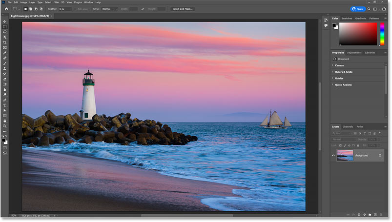
*An image newly opened in Photoshop.*

## Where do I find the Navigator panel?

The Navigator panel is not part of Photoshop’s default workspace, which means we need to open it ourselves. So to open it, go up to the **Window** menu in the Menu Bar.

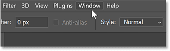
*Opening the Window menu.*

Here you’ll find a list of all the panels available in Photoshop. Click the **Navigator** panel to open it.

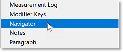
*Opening the Navigator panel.*

The Navigator panel opens in the secondary panel column to the left of the main column. And these panels are displayed only as icons until we click on an icon to expand it.

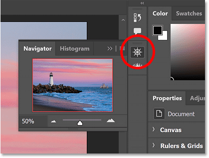
*The Navigator panel opens in the secondary panel column.*

## A quick tour of the Navigator panel

Photoshop’s Navigator panel is pretty simple. There’s a main **preview window** surrounded by a red outline (which we’ll come back to in a moment) where we see the image.

The **current zoom level** is displayed in the lower left of the panel. And a **slider bar** along the bottom lets us change the zoom level by dragging the slider left or right.

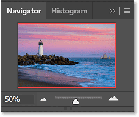
*Photoshop's Navigator panel.*

## How to resize the Navigator panel

But the first thing you’ll probably want to do is make the Navigator panel larger. And you can resize it by clicking and dragging the bottom left corner outward.

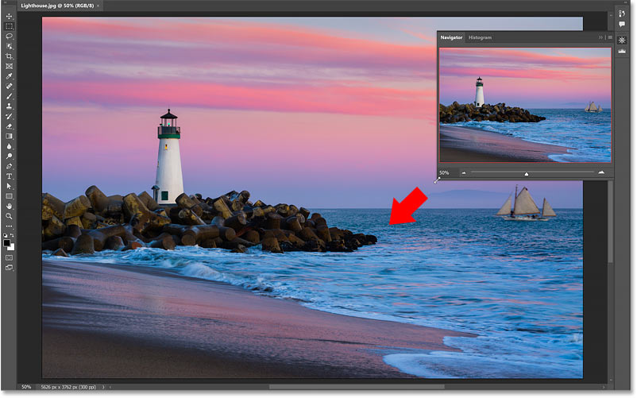
*Dragging the bottom left corner to resize the Navigator panel.*

## The view box

The red outline around the image in the preview window is the **view box**. The box surrounds the section of the image that’s visible in Photoshop's main document window at the current zoom level.

Since I’m zoomed out far enough to see my entire image in the document window, the box is surrounding the entire image.

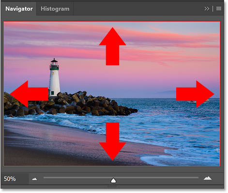
*The red outline is the view box.*

## Zooming with the slider bar

But if I zoom in on the image by dragging the bottom slider to the right, the view box shrinks to surround just the area I'm zoomed in to.

This makes it easy to keep track of exactly which part of the image you’re looking at in the document window since the entire image is always visible in the Navigator panel.

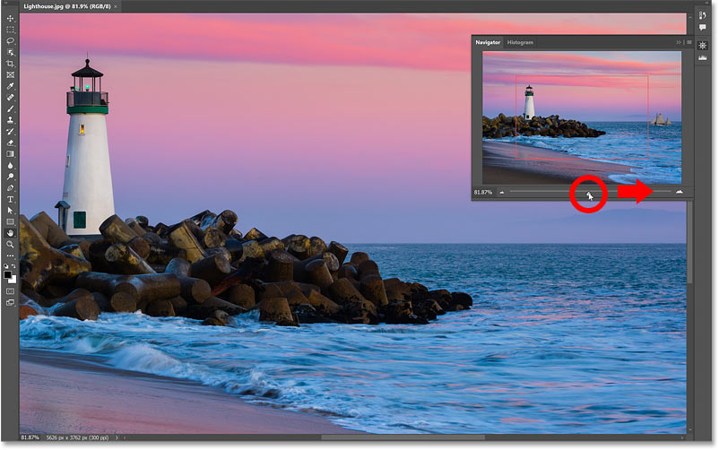
*The view box in the preview window resizes as you zoom in closer.*

## Dragging the view box to pan the image

Once you’re zoomed in, you can pan around the image to inspect different areas by clicking inside the view box in the preview window and dragging it to different spots.

Here I’ve dragged the box around the sailboat on the right, which lets me view that part of the image in the document window.

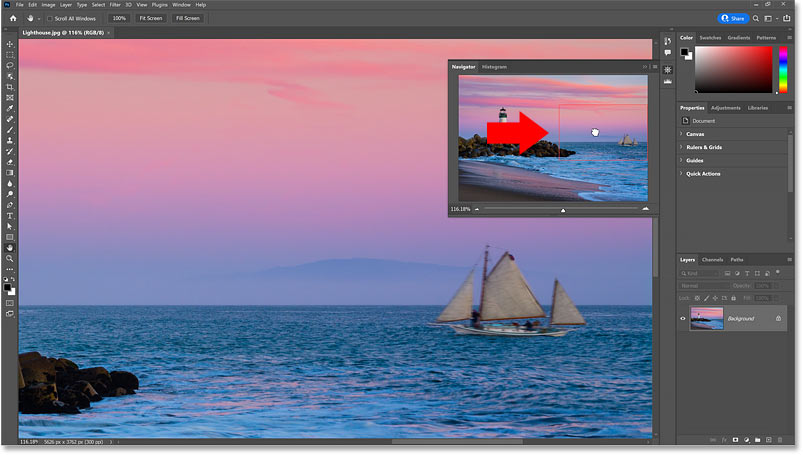
*Drag the outline to pan or scroll around the image.*

## The Zoom in and Zoom Out icons

Along with dragging the slider, you can zoom in by clicking the **large mountain icon** to the right of the slider, or zoom out by clicking the **smaller mountain icon** on the left.

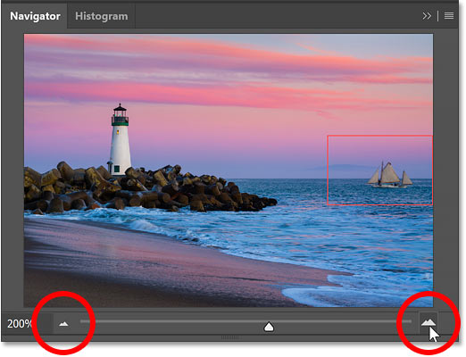
*Click the mountain icons to zoom in and out.*

## Entering a specific zoom value

You can also change the zoom level by highlighting the current value in the lower left, entering a new value, and then pressing **Enter** on a Windows PC or **Return** on a Mac.

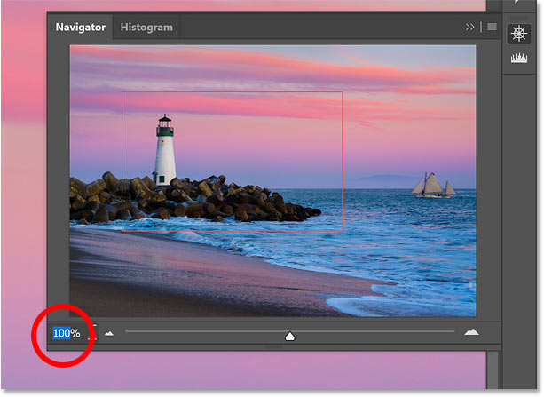
*Enter specific zoom values in the lower left.*

## Zooming with the hidden scrubby slider

And here’s a couple of tricks to use with the Navigator panel. First, if you hover your mouse cursor over the zoom level in the lower left, and press and hold the **Ctrl** (Win) / **Command** (Mac) key on your keyboard, your cursor will change to a **scrubby slider**. You can then click and drag left or right with the scrubby slider to zoom in or out.

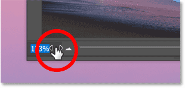
*Hold Ctrl (Win) / Command (Mac) to access the scrubby slider.*

## Dragging a view box manually

Or if you press and hold the **Ctrl** (Win) / **Command** (Mac) key and hover over the image in the preview window, your cursor will change to a **magnifying glass**.

But instead of clicking to zoom in like you would with the Zoom Tool, you can click and drag a view box around whatever it is you want to zoom in on.

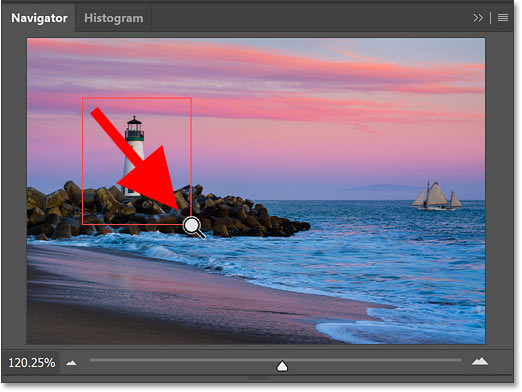
*Holding Ctrl (Win) / Command (Mac) and dragging around an area to zoom in.*

## How to change the view box color

If you’re having trouble seeing the view box in front of your image, you can change its color by clicking the Navigator panel’s **menu icon** in the upper right:

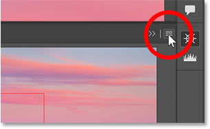
*Clicking the menu icon.*

Choosing **Panel Options**:

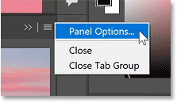
*Opening the Panel Options.*

And then choosing a new color in the Panel Options dialog box, either from the list of presets or by clicking the color swatch and choosing one from the Color Picker.

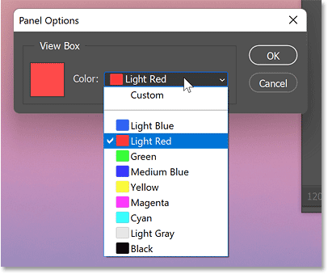
*The Panel Options dialog box.*

## How to hide the Navigator panel

Finally, to hide the Navigator panel when you’re done, just click its icon in that secondary panel column.

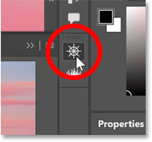
*Click the icon to hide the Navigator panel.*