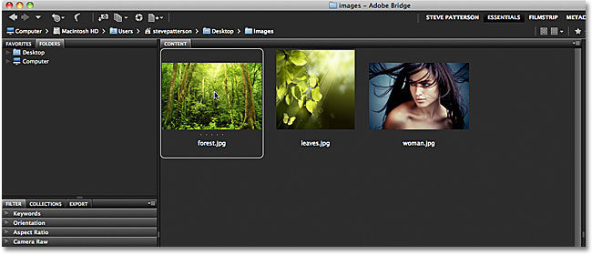
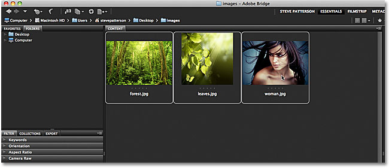
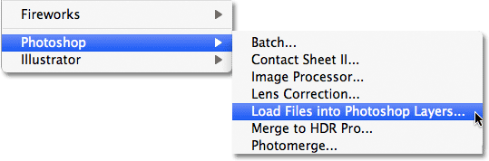
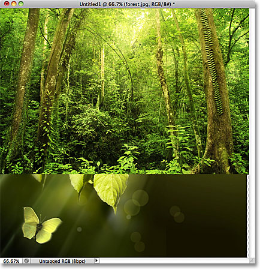
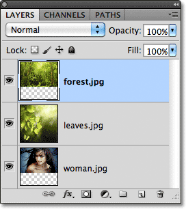
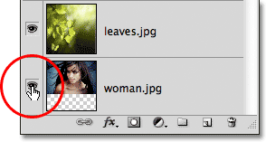
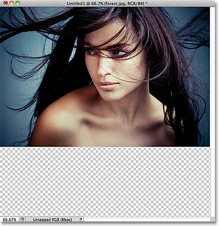
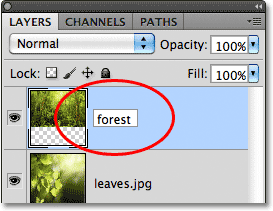
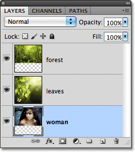
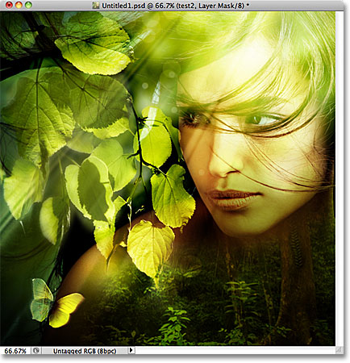

# Open Multiple Images As Photoshop Layers

> Source: [https://www.photoshopessentials.com/basics/layers/images-as-layers/](https://www.photoshopessentials.com/basics/layers/images-as-layers/)
> Downloaded and converted to Markdown.

It's very common in Photoshop to work with multiple images inside the same document, with each image on its own layer so we can blend and combine them in various ways to create interesting designs, collages or effects.

It's easy to select and open multiple photos at once from inside Adobe Bridge, but normally, Photoshop opens each photo in its own separate document, forcing us to manually [duplicate, copy or drag](/basics/moving-photos-between-documents/) each image from its own document into the main document we're working on.

In **Photoshop CS4**, Adobe introduced a great new time-saving feature to Bridge - the **Load Files into Photoshop Layers** command. If you know in advance that you're going to be working with multiple images inside your document and you know which specific images you'll need, Photoshop can now open and load all of your images into the *same document* and automatically place each image on its own layer! Here's how it works. You'll need Photoshop CS4 or higher to follow along (I'm using CS5 for this tutorial).

### Step 1: Select Your Images In Bridge

Begin by opening **Adobe Bridge** and navigate to the folder that contains the images you want to add to your document. Here, I have Bridge open to a folder on my Desktop with three photos inside of it. I'll select the first image (the one on the left) by clicking on its thumbnail:

*Clicking on the photo on the left to select it.*

Then, to select the other two images as well, I'll hold down my **Shift** key and click on the last of the three images (the one on the right). All three images are now highlighted and selected:

*Holding down Shift and clicking on the last image to select all three images at once.*

### Step 2: Select The "Load Files into Photoshop Layers" Command

With all of the images selected, go up to the **Tools** menu in the Menu Bar along the top of the screen in Bridge, choose **Photoshop** for a list of Photoshop-specific options, then choose **Load Files into Photoshop Layers**:

*In Bridge, go to Tools > Photoshop > Load Files into Photoshop Layers.*

And that's all there is to it! Photoshop will open automatically if it's not open already and will add all three images (or as many images as you selected) into the same document. It may take a few moments for Photoshop to process everything, but when it's done, you'll see a single document open on your screen containing all of your photos:

*All of the images have opened inside a single Photoshop document.*

Some images may be blocking others from view in the document window, but if we look in the Layers panel, we see that each of the three photos I selected in Bridge has been added to the document and placed on its own layer. Notice that Photoshop used the names of the images for the layer names:

*Each photo has been added on its own layer inside the Layers panel. The name of the image is now the name of the layer it sits on.*

### Viewing Individual Layers

If you want to view a specific image in the document window, hold down your **Alt** (Win) / **Option** (Mac) key and click on the **layer visibility icon** for the layer you want to view. It's the little eyeball icon on the far left of each layer in the Layers panel. Photoshop will temporarily turn off every layer in the document except the one you clicked on. For example, I want to view the photo of the woman which is currently being blocked by the other two images above it in the document, so I'll hold down my Alt (Win) / Option (Mac) key and click on the layer visibility icon for the "woman.jpg" layer:

*Holding Alt (Win) / Option (Mac) and clicking the layer visibility icon for the "woman.jpg" layer in the Layers panel.*

This turns off the other two layers and displays only the "woman.jpg" image in the document window. To turn the other layers back on when you're done, simply hold down Alt (Win) / Option (Mac) and click once again on the same layer visibility icon. Notice the checkerboard pattern below my photo, which is how Photoshop represents transparent areas of a layer. The reason part of this layer is transparent is because each image I opened was a different size, so Photoshop created a document wide and tall enough for all of them to fit into. This means that some images will still need to be resized and repositioned with the [Free Transform](http://www.photoshopessentials.com/basics/free-transform/) command after they've been loaded into the document, but that's something we would normally have to do anyway:

*Only the selected layer is now visible in the document.*

### Renaming The Layers

The only thing I don't really like about the Load Files into Photoshop Layers command is that it includes the file extension in the name of each layer ("forest.jpg", "leaves.jpg", "woman.jpg"). Fortunately, it's easy to rename layers. Simply **double-click** directly on the name of a layer to highlight it, then type in a new name. Or, in this case, simply delete the file extension from the end of the name. I'll double-click on the name "forest.jpg" to highlight it, then I'll delete the ".jpg" part at the end:

*Deleting the ".jpg" file extension from the end of the layer name.*

When you're done, press **Enter** (Win) / **Return** (Mac) to accept the name change. I'll go ahead and rename the other two layers as well, deleting the file extension at the end of each one:

*All three layers have been renamed.*

With each image already on its own layer in the same document thanks to the Load Files into Photoshop Layers command, we can spend a bit more time being creative with our designs and less time on less interesting tasks like dragging or copying images from one document into another.

Blending images and creating composites goes far beyond the scope of this tutorial (see our [Photo Effects](/photo-effects/) section for lots of great ideas with step-by-step instructions), but just for fun, here's my result after spending a few minutes playing around with the images using [blend modes](/photo-editing/layer-blend-modes/) and [layer masks](/basics/layers/layer-masks/):

*All three images combined into one.*