# Improving Focus Area Selections With Refine Edge – Photoshop CC 2014

> Source: [https://www.photoshopessentials.com/basics/selections/cc/2014/improving-focus-area-selections-refine-edge/](https://www.photoshopessentials.com/basics/selections/cc/2014/improving-focus-area-selections-refine-edge/)
> Downloaded and converted to Markdown.

In the first part of this tutorial on the new [Focus Area](/basics/selections/cc/2014/focus-area/) selection tool in **Photoshop CC 2014**, we learned that Focus Area allows us to make selections based on the in-focus areas (the depth of field) of an image, making it a potentially great choice for separating a subject from its background.

We also learned that creating a focus-based selection is really a two-step process. First, we use the tools in the Focus Area dialog box to create an initial selection of our in-focus subject. Then we take that initial selection and move it into Photoshop's **Refine Edge** command where we clean it up, fine-tune it and make it even better.

In this second part of the tutorial, we'll learn how to move our selection from Focus Area into Refine Edge, as well as everything we need to know about how Refine Edge works so we can create the best focus-based selections possible. Of course, before you jump into the Refine Edge command, you'll first want to make sure you've created your initial selection using [Focus Area](/basics/selections/cc/2014/focus-area/). Refine Edge may be an incredibly powerful tool, but it's not capable of making initial selections. It's strictly for selection edge refinement.

This tutorial is from our [How to make selections in Photoshop](/basics/make-selections-photoshop/ "Learn how to use the Photoshop selection tools") series.

Here once again is the image I'm working with ([girl with puppy photo](http://www.shutterstock.com/pic-142291096/stock-photo-children-girl-kissing-her-puppy-chihuahua-doggy-on-the-wood-fence.html) from Shutterstock):

*The original image.*

And here's what my initial selection looks like after taking things as far as I could with the tools in the [Focus Area dialog box](elections/cc/2014/focus-area/). Notice that while I was able to separate the girl and the puppy from the blurred, out of focus background, the edges of the selection are looking pretty rough and jagged:

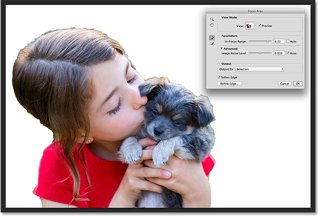

*The initial selection created with Focus Area.*

Let's see how Photoshop's Refine Edge command can take a selection like this and transform it into something more useful and more professional, beginning with how to move the selection from Focus Area into Refine Edge. Let's get started!

### Moving The Selection To Refine Edge

To move the selection from Focus Area to the Refine Edge command, we simply click on the **Refine Edge** button in the lower left of the Focus Area dialog box:

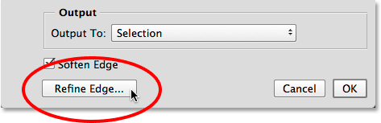

*Clicking the Refine Edge button.*

The Focus Area dialog box itself will disappear and Refine Edge will pop open in its place:

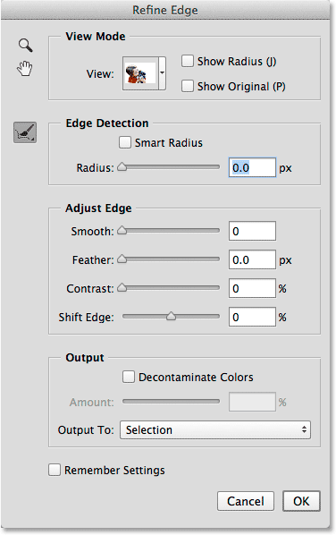

*The Refine Edge dialog box.*

### The View Mode

Refine Edge has actually been around in Photoshop for a few versions now, but you may notice that it looks very similar to the new Focus Area dialog box, at least in terms of its general layout. It even has the exact same **View** option at the very top where we can click on the thumbnail to access different backgrounds for viewing our selection, like **On White**, **On Black**, **On Layers**, and so on, along with the exact same keyboard shortcuts in parenthesis. And, just as with Focus Area, we can cycle through the view modes from the keyboard by repeatedly pressing the letter **F**:

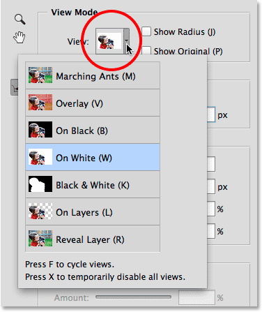

*Refine Edge gives us the same view mode choices as Focus Area.*

### The Navigation Tools

We also have the exact same navigation tools in the upper left of the Refine Edge dialog box, with icons for selecting the **Zoom Tool** (for zooming in and out) and the **Hand Tool** (for scrolling the image when you're zoomed in):

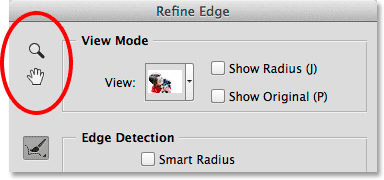

*The Zoom Tool (top) and Hand Tool (bottom).*

However, as I mentioned in [the first part](/basics/selections/cc/2014/focus-area/) of the tutorial, you're much better off using the keyboard shortcuts to *temporarily* access these navigation tools when needed. To access the **Zoom Tool**, press and hold **Ctrl+spacebar** (Win) / **Command+spacebar** (Mac) and click on the image to zoom in, or **Alt+spacebar** (Win) / **Option+spacebar** (Mac) and click to zoom out. To scroll the image, press and hold the **spacebar** on its own to access the **Hand Tool**, then click and drag the image.

### Edge Detection

Photoshop's Refine Edge dialog box is divided into four main sections - **View Mode** (which we just looked at), **Edge Detection**, **Adjust Edge**, and **Output** (another similarity to the Focus Area dialog box which we'll look at later). Of these four sections, the single most important one, by far, is Edge Detection. This is the heart and soul (and brains) of the Refine Edge command. Here's how it works.

As the name "Edge Detection" implies, Photoshop is going to try to detect where the edges of your selection should actually be. It does this by analyzing the areas surrounding your original selection outline, both inside the selected area and outside in the unselected areas, and it looks for "edges". An edge, to Photoshop, is an area where there's a sudden transition in tone or color between adjacent pixels. The only thing we need to do is tell Photoshop how far out from the original selection outline it can look, a distance known as the **Radius**.

### Adjusting The Size Of The Radius

I'm going to zoom in on my image so we can more easily see the selection edges around the girl's hair. This is how things look without any edge detection applied:

*The initial rough selection.*

By default, the Radius size (that is, the distance outward from the selection outline) is set to 0 px (pixels), which essentially means Edge Detection is turned off. I'm going to increase the size of the Radius to around 20 pixels by dragging the slider towards the right:

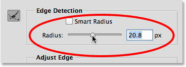

*Increasing the size of the Radius by dragging the slider.*

Notice what's already happened to my selection edges. Simply by increasing the size of the Radius, Photoshop was able to add more of the girl's hair to the selection, giving it a more natural appearance rather than those harsh, jagged edges I started off with. That's because I told Photoshop to look at an area 20 pixels wide around my original selection outline, both inside of it and out, and add any areas (any pixels) that should be part of the selection (and also, to deselect any areas that should *not* have been selected):

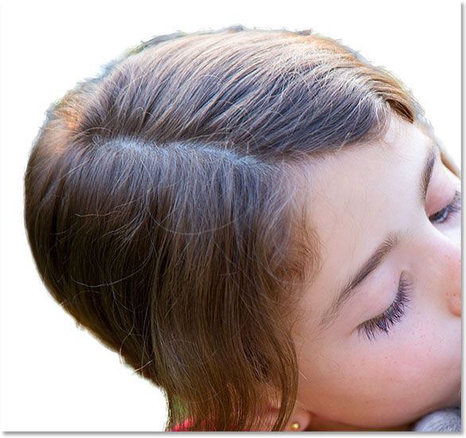

*The selection around the hair now looks a bit more natural.*

If I increase the Radius size even further, to around 40 pixels:

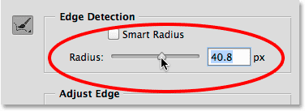

*Continuing to increase the size of the Radius.*

I now get an even more natural looking selection as more loose strands of hair are added. Again, that's because I've now told Photoshop to look at an area 40 pixels wide around the original selection outline, both inside of it and out, and add any pixels to (or subtract any pixels from) the selection as needed:

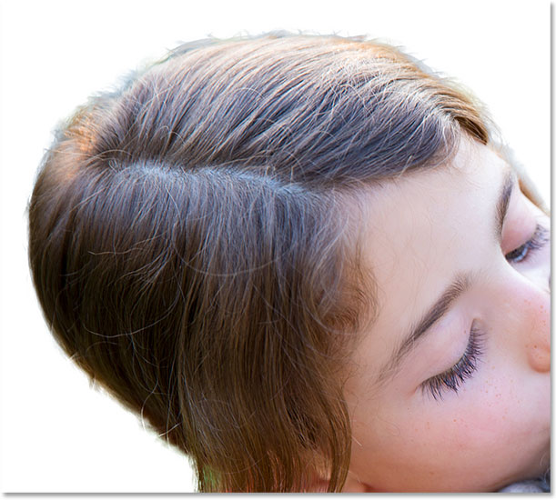

*The result of further increasing the Radius value.*

The hair is a bit difficult to see in front of the white background, so I'll press the letter **B** on my keyboard to quickly switch to the **On Black** view mode, and now I can see the hair more easily:

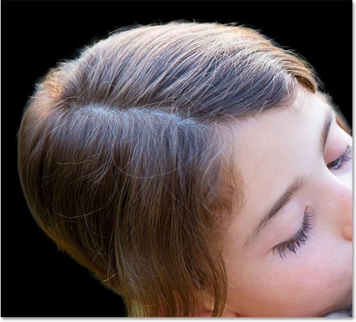

*Changing the background color to make the selection more visible.*

### Showing The Radius

To better understand how the Radius works, it helps to actually see it. We can see the Radius at any time by selecting the **Show Radius** option at the top of the dialog box (to the right of the View thumbnail). You can also quickly toggle the Show Radius option on and off by pressing the letter **J** on your keyboard:

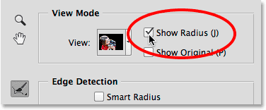

*Turning on the Show Radius option.*

With Show Radius turned on, we now see the actual Radius appearing around the original selection outline, similar to if we have applied a stroke to it. This "stroke" is the transition area between what's absolutely selected and what's not selected, where Photoshop analyzes the image trying to refine the selection further:

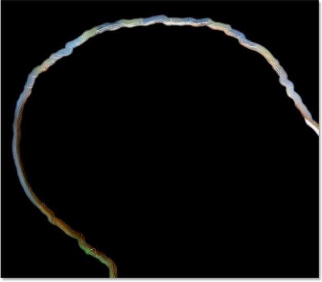

*Turning on Show Radius allows us to see the Radius itself.*

If I increase the Radius value even more, this time to around 80 pixels, we can see the width of the Radius increasing, which means that even more of the area around the original selection outline will be analyzed:

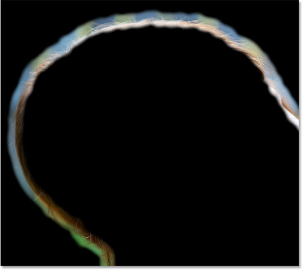

*A larger Radius value means a larger transition area for Photoshop to look for edges.*

However, if we increase the size of the Radius *too* much, we give Photoshop too much area to work with and things can start to go wrong. Unwanted background areas may start blending into the selection, and we can even lose areas that we initially selected and wanted to keep. I'll press the letter **J** on my keyboard to quickly toggle the **Show Radius** option off so that we're back to viewing the selection itself. And now, if we look at the area of the puppy's fur just above the ear, as well as the girl's hair above her eye, we see that because the Radius is too wide, the selection is loosing definition in those areas. In this case, I'd need to lower the Radius value to something smaller. The actual value you need will depend entirely on your image and on the type of subject you're selecting, so it will be different each time and you'll need to experiment:

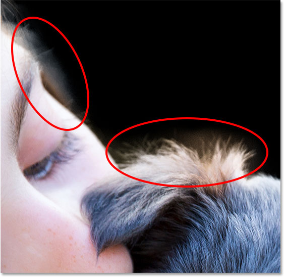

*Setting the Radius too high can cause the background to start blending in with the selection, something we want to avoid.*

### Smart Radius

Photoshop can do quite a good job of refining the selection just by increasing the size of the Radius with the main slider, but with images like the one I'm using where the type of edge varies, we can add even more intelligence to Edge Detection. When I say "the type of edge varies", what I mean is that there's some larger, less-pronounced edges like the girl's hair and the dog's fur, but there's also sharper, more clearly-defined areas like the edges of the girl's shirt. And when I say we can "add even more intelligence", what I mean is that in situations like this, we can enable an option called **Smart Radius**.

Areas like hair and fur need a larger Radius to fit all those loose strands into the selection, while sharper, harder-edged areas like the edge of a shirt need a smaller Radius. Yet if I turn my Show Radius option back on for a moment (by pressing the letter **J** on my keyboard), we see that my Radius remains exactly the same width all around the selection, no matter what type of edge it encounters:

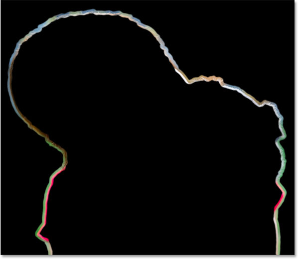

*The width of the Radius doesn't change even though the type of edge does.*

To fix that, I'll enable **Smart Radius** by clicking inside its checkbox directly above the slider:

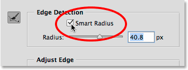

*Turning on Smart Radius.*

With Smart Radius turned on, Photoshop is able to alter the width of the Radius to match the type of edge it encounters. Here, I've zoomed in on the area above the puppy's head so we can get a closer look. Notice that in areas where the fur is longer, the width of the Radius remains larger, while in areas with shorter fur, the Radius is now tighter and more narrow. Once you've enabled Smart Radius, you'll usually want to re-adjust the Radius size with the main slider to see if you can get even better results (and of course you'll want to do that with Show Radius turned off so you're seeing the image, not the Radius itself):

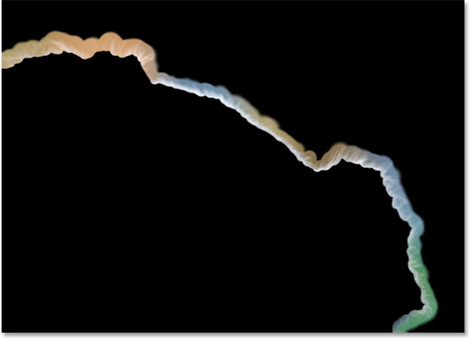

*Smart Radius allows the Radius size to change depending on the type of edge.*

### The Refine Radius And Erase Refinements Tools

Sometimes, increasing the Radius size with the slider, and even turning on Smart Radius, won't be enough. In fact, it will rarely be enough. You'll still have areas that need further refinement, and that's why Photoshop lets us manually paint in additional areas of Radius using a brush known as the **Refine Radius Tool**. It's already selected for us by default, but you can also get to it by clicking on its icon on the left of the dialog box:

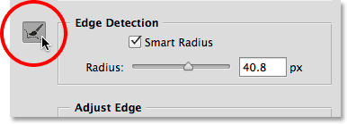

*Selecting the Refine Radius Tool.*

Even though there's only one icon, there's actually two related brush tools that we can access from it. If you click and hold on the icon, both tools will appear in a fly-out menu. At the top is the Refine Radius Tool, and below it is the **Erase Refinements Tool** which lets us erase the Radius in areas where we don't need it. In general, though, the Refine Radius Tool is the one you'll use the most, so let's see how it works:

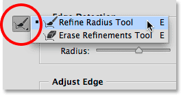

*Click and hold on the icon to access both the Refine Radius and the Erase Refinements Tools.*

With the Refine Radius Tool selected, we simply brush over areas around the selection edge that still need work. Since it's a brush tool, we can change its size according to the size of the area we're painting over. One way to change the brush size is by dragging the slider for the **Size** option in the Options Bar:

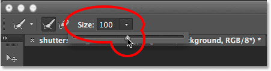

*Click on the small arrow to access the slider, then drag the slider to change the brush size.*

Another way is from the keyboard. Press the **left bracket key** ( **[** ) repeatedly to make the brush smaller, or the **right bracket key** ( **]** ) to make it larger. Then, simply paint over an area where you need to clean up the edge. Here's an area along the top of the girl's hair that still looks a bit jagged and clumpy:

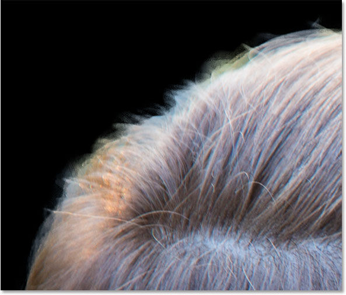

*And area that needs further refinement.*

I'll paint a single stroke over the area with the Refine Radius Tool, trying to get as many of the loose strands of hair as possible without going too far into the background:

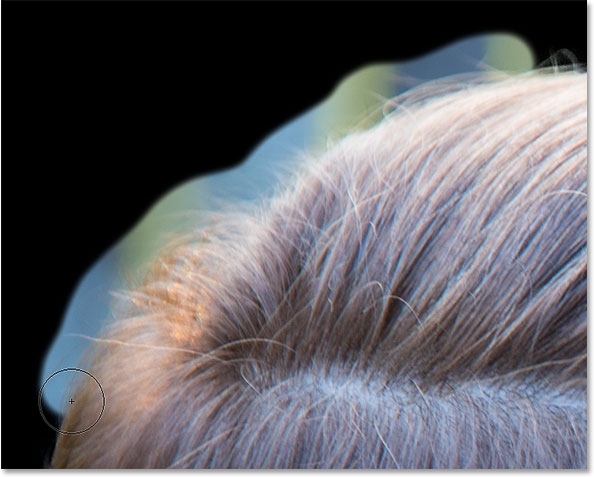

*Painting along the top of the hair.*

When I release my mouse button, Photoshop adds that area to the Radius, analyzes it for edges, and is able to add more of the hair to the selection while at the same time removing the unwanted background. It's powerful stuff:

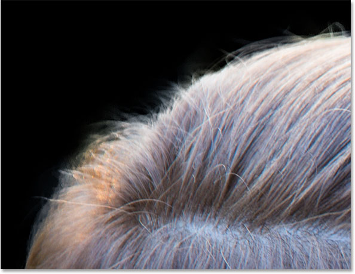

*The Refine Radius Tool was able to clean up the edge nicely.*

Sometimes it may take a few passes with the Refine Radius Tool, or several smaller brush strokes rather than one continuous stroke, to clean up an area. Here's that same problem spot we saw before with the puppy's fur above the ear. The selection edge is still looking too soft and fuzzy:

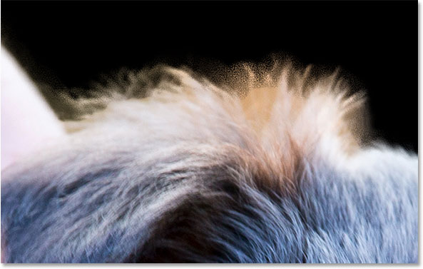

*Another area that needs more work.*

This time, I'll try painting several smaller brush strokes, which lets Photoshop analyze the problem in smaller chunks. If you make what seems like a big mistake, Refine Edge gives us one level of undo. Simply press **Ctrl+Z** (Win) / **Command+Z** (Mac) to undo your last brush stroke, then continue on:

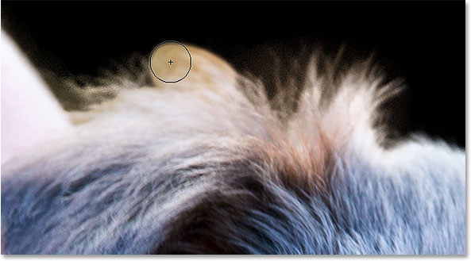

*Painting with small strokes over the fur.*

Another option if you (or Photoshop) make a mistake is to switch to the **Erase Refinements Tool**, which does the opposite of the Refine Radius Tool. Rather than expanding the Radius by painting more of it around a selection edge, the Erase Refinements Tool erases the Radius where you paint. It won't erase any parts of your initial selection (that is, the selection as it appeared before you opened it in Refine Edge). It will **only erase the Radius itself** that was added using either the Radius slider or the Refine Radius Tool.

As we saw earlier, you can select the Erase Refinements Tool by clicking and holding on the tool icon on the left of the dialog box and selecting it from the fly-out menu:

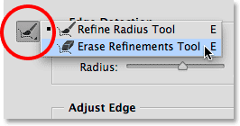

*Clicking and holding on the tool icon, then choosing the Erase Refinements Tool.*

You can also switch between the two tools by pressing the letter **E** on your keyboard. But an even faster and better way to access the Erase Refinements Tool is to *temporarily* access it when you need it. With the Refine Radius Tool active, simply press and hold the **Alt** (Win) / **Option** (Mac) key on your keyboard to temporarily switch to the Erase Refinements Tool (you'll see the plus sign (+) in the brush cursor switch to a minus sign (-)), then paint over an area to erase the Radius in that spot. Release the Alt (Win) / Option (Mac) key to return to the Refine Radius Tool and continue on. The Erase Refinements Tool is especially helpful if you start noticing important areas of your initial selection that are becoming partially deselected. Simply paint over those areas with the Erase Refinements Tool to add them back to the selection.

Here, after several small brush strokes with the Refine Radius Tool, is the much improved selection around the fur:

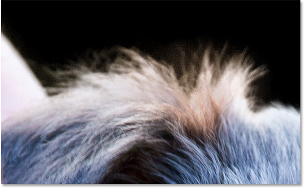

*The fur is now looking much better.*

### Toggling The Preview On And Off

At any time, we can compare the work we're doing in Refine Edge with what our original selection edges looked like by turning on the **Show Original** option below Show Radius at the top of the dialog box. We can also toggle Show Original on and off by pressing the letter **P** on the keyboard:

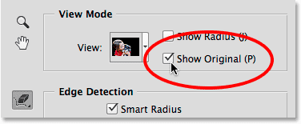

*Clicking inside the checkbox for Show Original.*

Unlike the Preview option in the Focus Area dialog box, turning on Show Original won't show us the original image. Instead, it shows us our original selection edges as they appeared before opening Refine Edge (**Tip:** If you *do* want to see your original image while working in Refine Edge, press the **X** key on your keyboard. Press X again to return to the Refine Edge view):

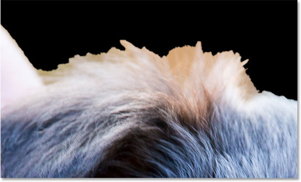

*Use Show Original to see how well you're doing compared with the original unrefined edge.*

### The Adjust Edge Options

Below Edge Detection are four **Adjust Edge** options which we can use for some additional fine-tuning, although these options are much more basic and lack the intelligence of the Edge Detection tools. Dragging the **Smooth** slider will smooth out any remaining jagged edges, while the **Feather** slider will simply feather the selection, something you usually want to avoid.

The third and fourth options are often more useful. Dragging the **Contrast** slider towards the right will tighten up the selection edges (sort of the opposite of the Feather slider), while **Shift Edge** will expand or contract the entire selection as a whole (a negative Shift Edge value will move the entire selection edge inward, while a positive value will expand it outward). Here's a close-up of the girl's shirt sleeve. Notice how the edge looks soft and not well-defined:

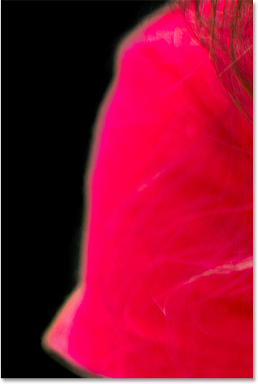

*The sleeve before increasing edge contrast.*

I'll drag the **Contrast** slider to around 20%:

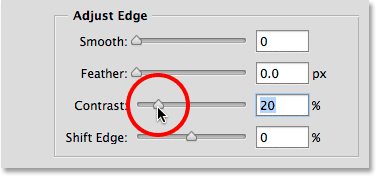

*Raising the Contrast to 20%.*

By increasing the contrast, the edge now appears tighter and cleaner. I could also try to bring the edge in even further by dragging the Shift Edge slider a little towards the right:

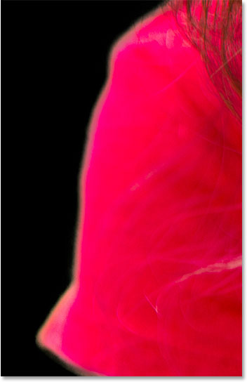

*The shirt sleeve after increasing edge contrast.*

I'll continue making my way around the image to clean up any remaining problem areas. Here's my final result:

*The selection is looking much better than it did with just the Focus Area tools.*

### Outputting The Final Selection

We've created our initial focus-based selection with Focus Area and we've refined the edges with the Refine Edge tools. The **Output** section is where we decide how we want to output the final selection, and we can choose from several options, including a traditional selection outline, a layer mask, a new layer, and so on. Click the **Output To** box to view all the options:

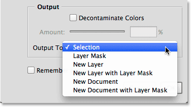

*The output options.*

Before I output my selection, though, there's one remaining option to look at first — **Decontaminate Colors**. If we look along the edge of the dog's fur in this area, we can see that it's looking a little greenish, not because the puppy is sick (hopefully not, at least) but because some of the green background is bleeding into the pixels right along the very edge of the selection:

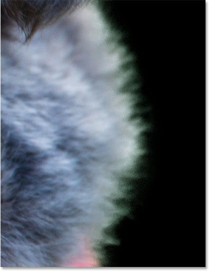

*Some green from the background is blending in with the fur.*

To fix problems like this, we can turn on Decontaminate Colors which will attempt to correct this color fringing by physically changing the color of the pixels around the outer edge. Once you've enabled Decontaminate Colors, you can adjust the **Amount** of correction by dragging the slider:

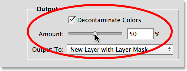

*Selecting Decontaminate Colors.*

After turning on Decontaminate Colors, the problem disappears and the green is removed:

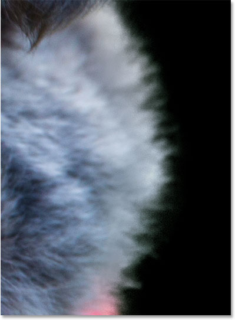

*The color fringing is corrected.*

There's several issues to be aware of before you decide to use the Decontaminate Colors option. First, as I mentioned, Photoshop physically changes the color of some of the pixels in your image, which means it's a **destructive modification** (the type of permanent edit we usually try to avoid). Second, it doesn't always work, or it may work well in one area but actually introduce new problems in another. And third, as soon as you select Decontaminate Colors, Photoshop limits your output options. It automatically selects **New Layer with Layer Mask** and prevents you from outputting to either a standard selection outline or a layer mask. Notice that the top two options are now grayed out:

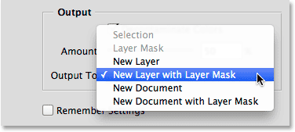

*Selection and Layer Mask are no longer available as output options.*

For this tutorial, I just want to output my selection as a traditional "marching ants" selection outline, so to do that, I'll turn off the Decontaminate Colors option and choose **Selection** from the menu:

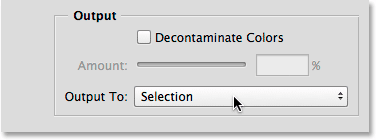

*Outputting my final selection as, well, a selection.*

I'll click **OK** at the very bottom of the Refine Edge dialog box to accept all of my settings and output the selection:

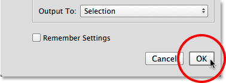

*Clicking the OK button.*

The Refine Edge dialog box disappears and I'm once again back to seeing my original image, this time with a standard selection outline appearing around my subjects:

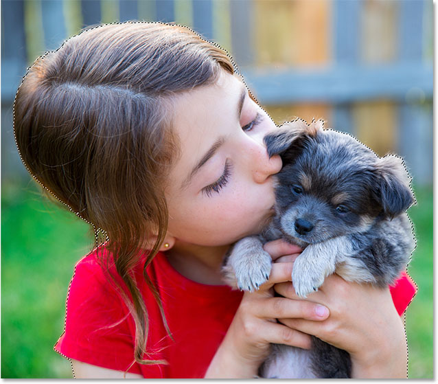

*The selection created with Focus Area and Refine Edge.*

I mentioned back at the very beginning of part one that my ultimate goal was to leave my subjects in color while converting the background to black and white, so now that I have my focus-based selection, let's quickly finish off the effect. First, I'll click on the **New Adjustment Layer** icon at the bottom of the **Layers panel**:

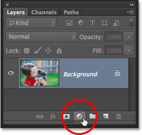

*Clicking the New Adjustment Layer icon.*

I'll choose a **Hue/Saturation** adjustment layer from the list:

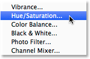

*Selecting Hue/Saturation.*

The controls and options for the Hue/Saturation adjustment layer appear in Photoshop's **Properties panel**. To remove the color, I'll simply lower the **Saturation** value all the way down to **-100** by dragging the slider to the far left:

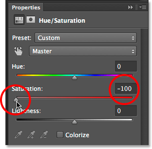

*Dragging the Saturation slider to remove the color.*

The only problem is that I've ended up with the exact opposite of what I wanted. My subjects are now in black and white while the background remains in color, and that's because I had my subjects selected, not the background:

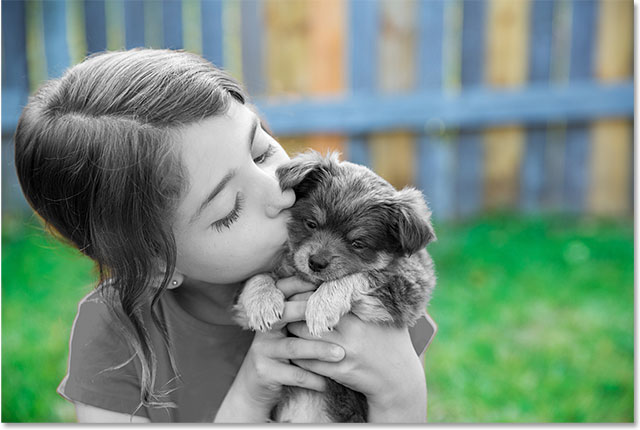

*The wrong part of the image was desaturated.*

To fix that, I'll switch from the Hue/Saturation controls over to my **layer mask** by clicking the **Masks icon** at the top of the Properties panel:

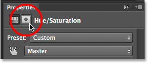

*Clicking the Masks icon.*

In the layer mask options, I'll click the **Invert** button at the very bottom:

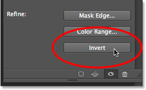

*Clicking the Invert button.*

This inverts the [layer mask](/basics/layers/layer-masks/) so that the background is now affected by the Hue/Saturation adjustment layer while my main subjects are protected, giving me the [selective coloring effect](/photo-effects/selective-coloring/) I'm after:

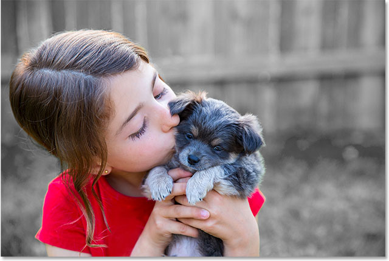

*The final effect.*

As with most automated tools in Photoshop, the selections you'll get with Focus Area and Refine Edge won't always be perfect. There's still a few areas in my image that I could touch up by painting manually with a brush on the adjustment layer's mask. However, for the most part, as we saw in [part one of the tutorial](/basics/selections/cc/2014/focus-area/), the new Focus Area tool was able to do a great job of separating my subjects from their background, and here in part two, Refine Edge was able to take that initial selection even further with impressive results.