# Increasing Canvas Size with the Crop Tool in Photoshop

> Source: [https://www.photoshopessentials.com/basics/increasing-canvas-size-crop-tool-photoshop/](https://www.photoshopessentials.com/basics/increasing-canvas-size-crop-tool-photoshop/)
> Downloaded and converted to Markdown.

Think the Crop Tool is only for cropping images? Learn how it can also be used to quickly add more canvas and a border around your photos!

So far in this series on cropping images in Photoshop, we've seen several examples of how the Crop Tool is used to crop away unwanted areas of an image. But a lesser-known feature of the Crop Tool is that it can also be used to **add more canvas space** around an image, giving us a quick and easy way to add a decorative border around a photo! In this tutorial, we'll learn how to add canvas space with the Crop Tool, and how to turn the extra space into a simple, customizable photo border!

If you're not yet familiar with using the Crop Tool in Photoshop, you may want to read through the first tutorial in this series, [how to crop images](/basics/how-to-crop-images-photoshop-cc/), before you continue. I'll be using [Photoshop CC](https://prf.hn/l/dlXjD2w) here but this tutorial is fully compatible with CS6 and earlier.

You can use any image of your own to follow along. Here's [the photo](https://prf.hn/l/dlgEoyY) I'll be using which I downloaded from Adobe Stock:

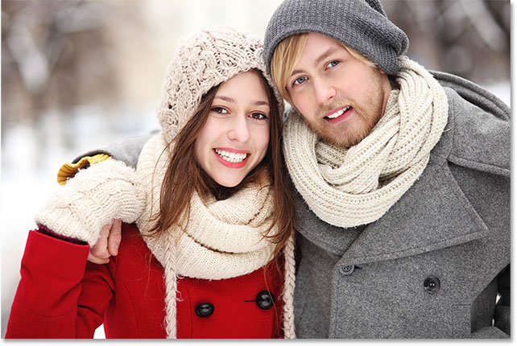
*The original photo. Image credit: Adobe Stock.*

This is lesson 3 in my [Cropping Images in Photoshop](/basics/cropping-images-in-photoshop-complete-lesson-guide) series.

Let's get started!

## How to add more canvas with the Crop Tool

### Step 1: Convert the Background layer into a normal layer

With our image newly-opened in Photoshop, if we look in the [Layers panel](/basics/layers/layers-panel/), we find the image sitting on the **Background layer**, currently the only layer in our document:

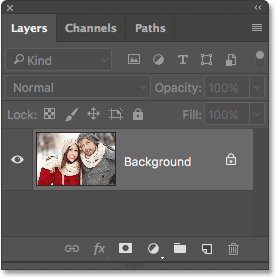
*The Layers panel showing the image on the Background layer.*

Before we add more canvas space around the image, the first thing we should do is convert the Background layer into a normal layer. The reason is that we want the extra space to appear on its own separate layer *below* the image, but Photoshop doesn't allow us to place layers below a [Background layer](/basics/background-layer-photoshop-cc/). The easy solution is to simply convert the Background layer into a normal layer.

To do that, in Photoshop CC, all we need to do is click on the small **lock icon** to the right of Background layer's name:

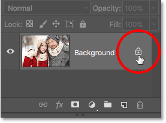
*Clicking the Background layer's lock icon.*

If you're using Photoshop CS6 or earlier (this also works in CC), press and hold the **Alt** (Win) / **Option** (Mac) key on your keyboard and **double-click** on the name "Background":

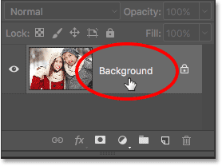
*In CS6 and earlier, hold Alt (Win) / Option (Mac) and double-click on the layer's name.*

The Background layer is instantly converted to a normal layer and renamed "Layer 0":

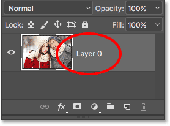
*The Background layer is now a normal layer named "Layer 0".*

[Understanding Layers In Photoshop](/basics/understanding-photoshop-layers/)

### Step 2: Select the Crop Tool

Now that we've solved that little problem, let's learn how to add extra space around the image. Select the [Crop Tool](/basics/how-to-crop-images-photoshop-cc/) from the [Toolbar](/basics/the-new-customizable-toolbar-in-photoshop-cc-2015/) along the left of the screen. You can also select the Crop Tool by pressing the letter **C** on your keyboard:

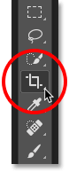
*Selecting the Crop Tool.*

With the Crop Tool selected, Photoshop places a default **crop border** around the image, along with **handles** on the top, bottom, left and right of the border, and one in each corner. We'll use these handles to resize the crop border and add our extra canvas space:

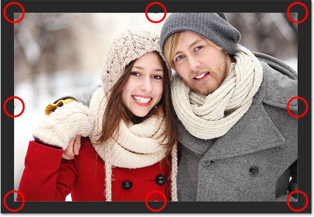
*The crop handles (circled in red) around the image.*

### Step 3: Drag the handles to resize the crop border

To add extra space around the image, all we need to do is click on the handles and drag them outward. Photoshop will then expand the size of the canvas to match the new size of the crop border.

For example, if I wanted to add space on the right side of the photo, I would click on the **right handle** and drag it further to the right, away from the image:

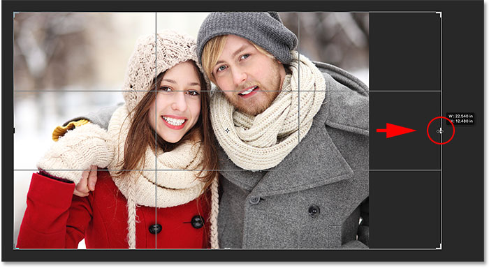
*Dragging the right handle towards the right.*

When I release my mouse button, Photoshop adds the extra space and fills it with a **checkerboard pattern**. The checkerboard pattern is how Photoshop represents **transparency**, which means that the extra space is currently empty. We'll fix that in a few moments:

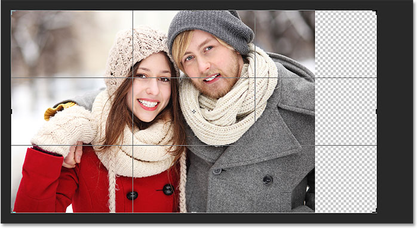
*Photoshop adds extra, blank space on the right side of the image.*

Rather than committing the crop just yet, let's look at how to add space around the rest of the image, along with a few important keyboard shortcuts. I'll cancel my crop and reset my crop border by pressing the **Cancel** button in the **Options Bar**. You can also cancel the crop by pressing the **Esc** key on your keyboard:

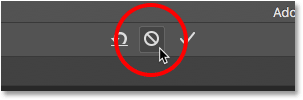
*Clicking the Cancel button.*

To add extra space on the left side of the photo, click on the **left handle** and drag it towards the left. Or, to add an equal amount of space on *both sides* of the image at the same time, press and hold your **Alt** (Win) / **Option** (Mac) key as you click and drag either the left or right handle. This will resize the crop border from its center, causing the handle on the opposite side to move at the same time, in the opposite direction:

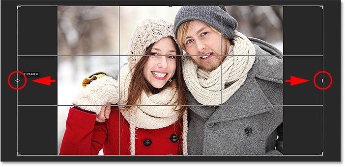
*Adding extra space to both sides by holding Alt (Win) / Option (Mac) as I drag.*

I'll release my mouse button, then I'll release my Alt (Win) / Option (Mac) key, and now we see an equal amount of blank space on both sides of the photo. Make sure you release your mouse button first, *then* the Alt (Win) / Option (Mac) key, or this trick won't work:

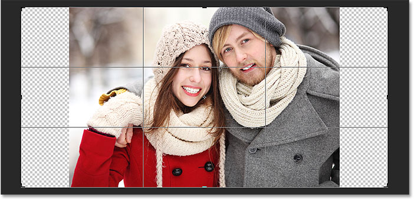
*An equal amount of space has been added to both sides.*

We can also add extra space above and below the image. To add space above it, click and drag the **top handle** upward. To add space below it, click and drag the **bottom handle** downward.

Or, to add an equal amount of space above *and* below the image at the same time, once again press and hold the **Alt** (Win) / **Option** (Mac) key on your keyboard as you drag either the top or bottom handle. The opposite handle will move along with it, in the opposite direction:

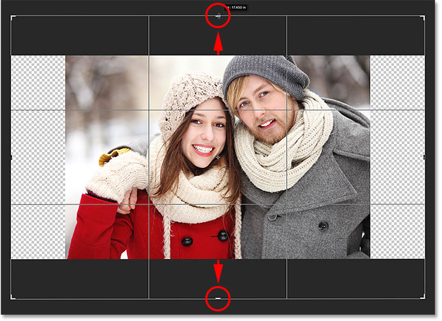
*Adding extra space to the top and bottom by holding Alt (Win) / Option (Mac) as I drag either handle.*

I'll release my mouse button, then I'll release my Alt (Win) / Option (Mac) key, and now I have an equal amount of blank space above and below the image. Again, make sure you release your mouse button first, *then* the key, or it won't work:

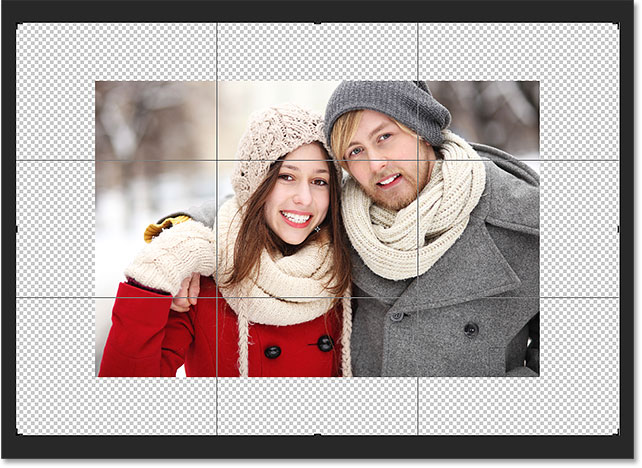
*An equal amount of space has been added above and below the photo.*

Let's cancel the crop one more time by pressing the **Cancel** button in the Options Bar, or by pressing the **Esc** key on your keyboard, so we can look at one more important keyboard shortcut:

*Clicking the Cancel button.*

### Keeping the photo's original aspect ratio

What if you want to keep the original aspect ratio of the image as you add extra canvas space around it? For example, you may have already cropped the image to, say, an 8 x 10, and now you want to maintain that 8 x 10 ratio as you add the extra space.

To do that, press and hold **Shift+Alt** (Win) / **Shift+Option** (Mac) as you drag any of the **corner handles** outward. The Alt (Win) / Option (Mac) key tells Photoshop to resize the crop border from its center, while the Shift key tells it to lock the original aspect ratio in place.

Here, I'm holding the keys as I drag the **top left** corner outward. Notice that all four corners move outward together:

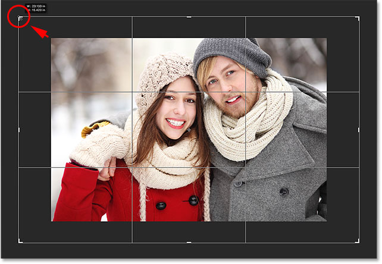
*Adding extra space around the entire image at once while keeping the original aspect ratio.*

I'll release my mouse button, then I'll release my Shift key and my Alt (Win) / Option (Mac) key (remembering to release the mouse button *before* releasing the keys). Photoshop adds the extra blank space around the entire image, while the aspect ratio remains the same as it was originally:

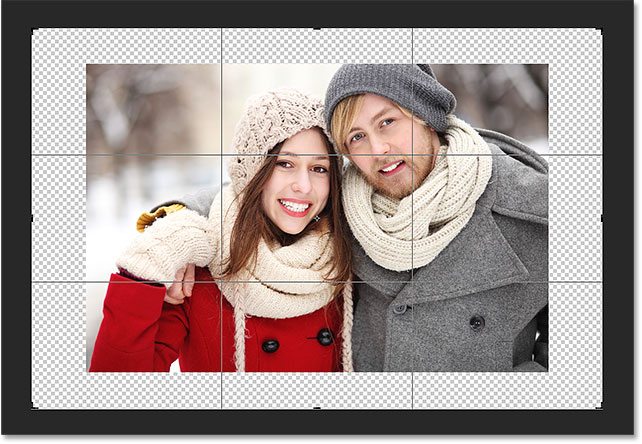
*The extra space has been added, yet the aspect ratio remains the same.*

### Step 4: Apply the crop

To apply the crop, click the **checkmark** in the Options Bar, or press **Enter** (Win) / **Return** (Mac) on your keyboard:

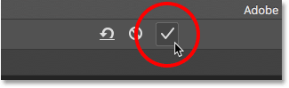
*Clicking the checkmark to apply the crop.*

Photoshop "crops" the image, although in this case, we've actually done the opposite; we've *added* space with the Crop Tool rather than deleted it:

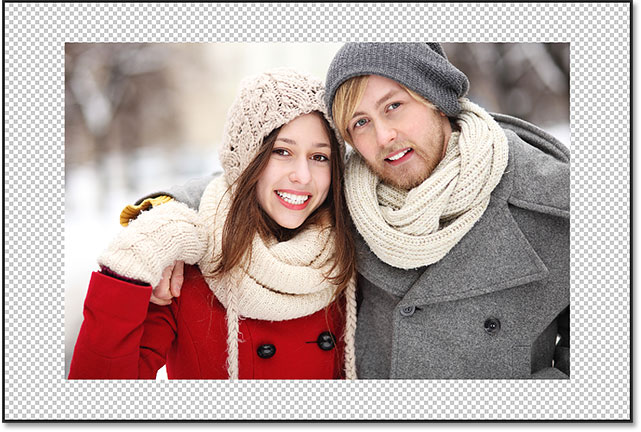
*The result after applying the crop.*

### Step 5: Add a Solid Color fill layer

So far, so good. We've added the extra canvas space. But at the moment, the space is blank. Let's turn it into a photo border by filling it with a color, and we'll do that using one of Photoshop's Solid Color fill layers.

Click on the **New Fill or Adjustment Layer** icon at the bottom of the Layers panel:

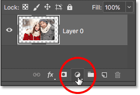
*Clicking the New Fill or Adjustment Layer icon.*

Then choose **Solid Color** from the top of the list that appears:

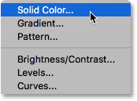
*Choosing "Solid Color" from the list.*

Photoshop will pop open the **Color Picker** where we can choose a color for the border. The default color is black, but choose **white** for now. At the end of the tutorial, we'll learn how to customize the look of the border by choosing a color directly from the image:

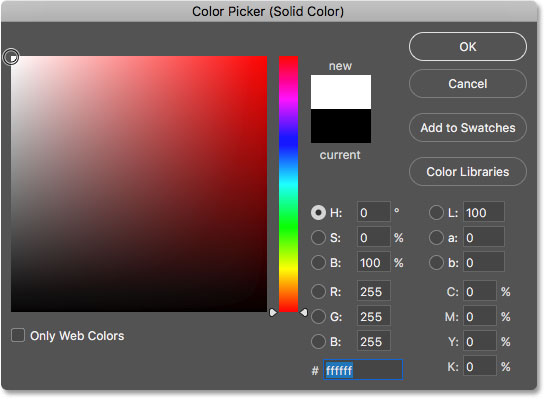
*Choosing white for the color of the border.*

Click OK to close out of the Color Picker. Photoshop temporarily fills the entire document with white, blocking the photo from view. We'll fix this problem next:

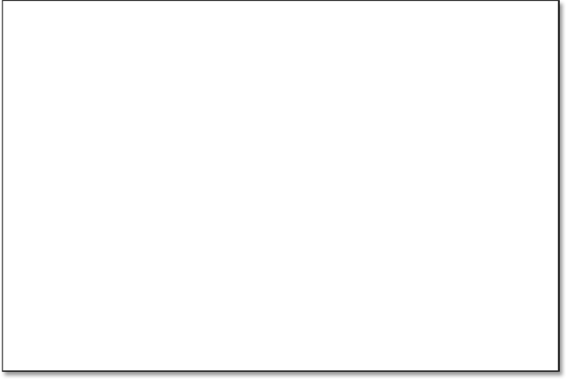
*The document is now filled with white.*

### Step 6: Drag the fill layer below the mage

If we look in the Layers panel, we can see our Solid Color fill layer, named "Color Fill 1". And, we see that the reason it's blocking our image from view is because it's currently sitting *above* the image on "Layer 0". Any layers above other layers in the Layers panel appear in *front* of those layers in the document:

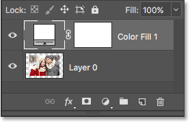
*The Layers panel showing the fill layer above the image.*

We need to move the fill layer *below* the image in the Layers panel so that it appears *behind* the image in the document. To do that, simply click on the fill layer and drag it down below "Layer 0". When you see a horizontal **highlight bar** appear below "Layer 0", release your mouse button:

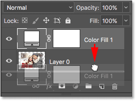
*Dragging the Solid Color fill layer below "Layer 0".*

Photoshop drops the fill layer into place below the image:

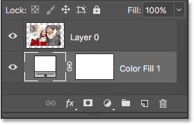
*The Layers panel now showing the image above the fill layer.*

And now, the image appears in front of the white Solid Color fill layer in the document, creating our photo border effect:

*The image now appears with a white border around it.*

### Step 7: Select "Layer 0"

Now that we can see our photo again, let's add a drop shadow to it. First, click on the image layer (**Layer 0)** in the Layers panel to select it:

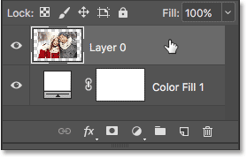
*Selecting "Layer 0".*

### Step 8: Add a drop shadow

Then, click the **Layer Styles** icon (the "**fx**"icon) at the bottom of the Layers panel:

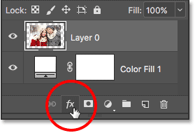
*Clicking the Layer Styles icon.*

Choose **Drop Shadow** from the list that appears:

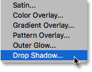
*Choosing "Drop Shadow" from the list of layer styles.*

This opens Photoshop's **Layer Style** dialog box set to the Drop Shadow options in the middle column:

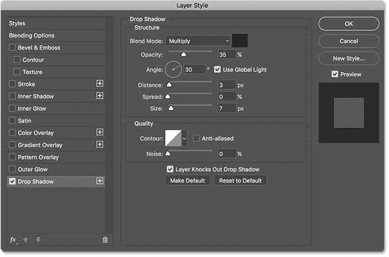
*The Drop Shadow options in the Layer Style dialog box.*

The first thing we usually want to do when adding a drop shadow is set the angle and distance of the shadow. We *could* do this by adjusting the **Angle** and **Distance** values directly in the dialog box. But an easier way is to simply click on the image in the document, keep your mouse button held down, and drag away from the image in the direction you want the shadow to fall. As you drag, the shadow will move along with you.

Here, I've dragged the shadow a short distance away from the image towards the lower right of the document:

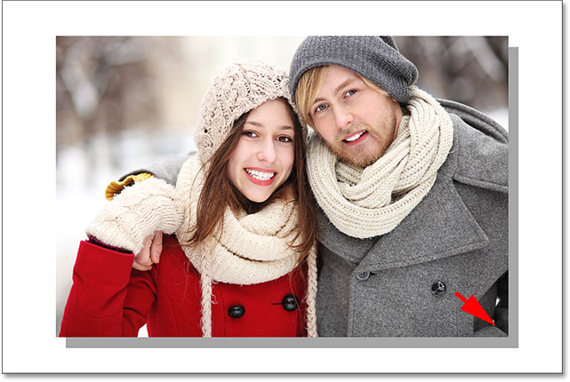
*Setting the angle and distance of the shadow by clicking and dragging inside the document.*

As you drag, you'll see the Angle and Distance values updating in the dialog box. The exact angle and distance values you choose may be different from what I'm using here (the distance will depend largely on the size of your image), but for me, an angle of around **135°** and a distance of **180px** looks good:

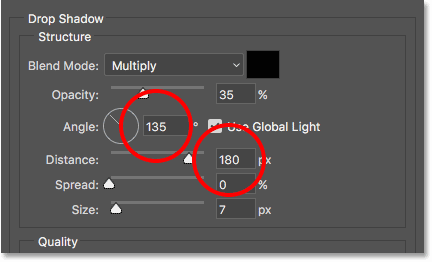
*The Angle and Distance values.*

Once you've set the angle and distance, soften the edges of shadow by dragging the **Size** slider in the dialog box. The higher the value, the softer the shadow will appear. Like the Distance value, the Size value you need will depend largely on the size of your image. For me, a value of around **50px** works well.

You can also control how light or dark the shadow appears by dragging the **Opacity** slider, but I'll leave mine set to the default value of **35%**:

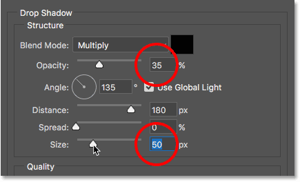
*The Size and Opacity values.*

When you're happy with the results, click OK to close out of the Layer Style dialog box. Here's my result with the drop shadow applied:

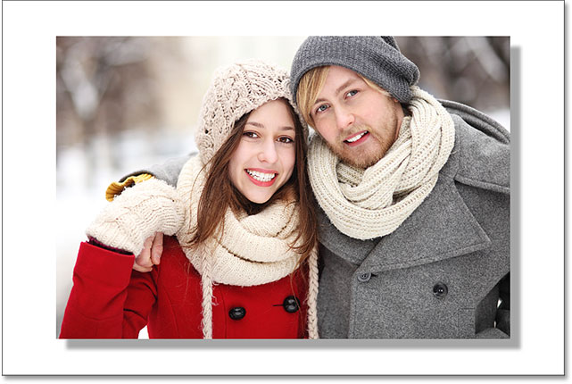
*The effect after adding the drop shadow.*

### Changing the color of the border

Finally, even though we've set the color of the border to white, you can easily go back and change it to any color you like. In fact, you can even choose a color directly from the image itself.

To change the color, double-click on the fill layer's **color swatch** in the Layers panel:

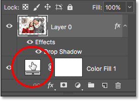
*Double-clicking on the color swatch.*

This re-opens Photoshop's **Color Picker**:

*The Color Picker re-opens.*

If you know the exact color you need, you can select it in the Color Picker. Or, to choose a color directly from the image, simply move your mouse cursor over the image. Your cursor will change into an **eyedropper** icon. Click on a color from the image to sample it and Photoshop will instantly set it as the new color for the border.

For example, I'll click on a spot in the man's gray jacket (circled in yellow), and here, we see that the color of my border is now that same shade of gray:

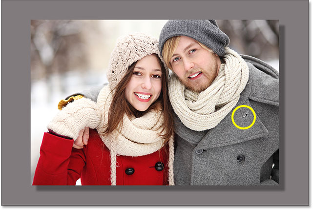
*Clicking on the man's jacket changes the border to gray.*

If you don't like the color, just click on a different color in the image to sample it and try again. I'll click on the woman's hat this time, and Photoshop instantly updates the border color to match. When you're happy with the results, click OK to close out of the Color Picker:

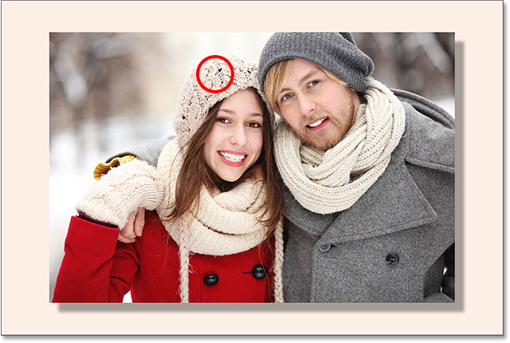
*The color of the woman's hat ends up being a better choice for the border.*

And there we have it! That's how to easily add extra canvas space around an image using the Crop Tool, along with how to turn the extra space into a simple photo border effect, in Photoshop! In the next lesson, I show you the essential [Crop Tool tips and tricks](/basics/photoshop-crop-tool-tips-and-tricks/) that make cropping images easier than ever!

You can jump to any of the other lessons in this [Cropping Images in Photoshop](/basics/cropping-images-in-photoshop-complete-lesson-guide) series. Or visit our [Photoshop Basics](/basics/) section for more topics!