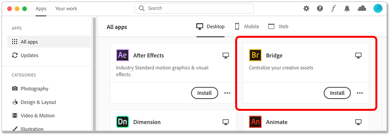
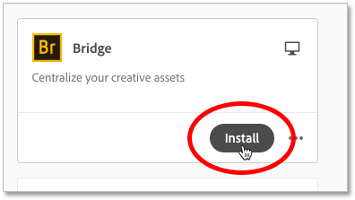
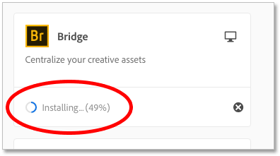
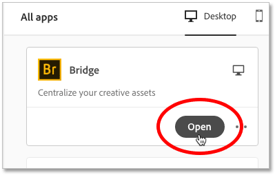

# How to install Adobe Bridge

> Source: [https://www.photoshopessentials.com/basics/install-adobe-bridge-cc/](https://www.photoshopessentials.com/basics/install-adobe-bridge-cc/)
> Downloaded and converted to Markdown.

This tutorial shows you how to install Adobe Bridge, a powerful file browser included with your Creative Cloud subscription that makes it easy to find your images and open them into Photoshop!

In this second tutorial in [Getting Started with Photoshop](/basics/getting-started-photoshop/), you'll learn how to install Adobe Bridge. Bridge is a file browser that lets you find, organize and open images into Photoshop. Your computer's operating system also has a built-in file browser, whether it's File Explorer in Windows or Finder on a Mac. So you may wonder, "Why not just use that?".

The reason is that Bridge is much more powerful and easier to use, with lots of great features that your operating system's file browser doesn't have. And Bridge is one of the best ways to open images directly into Camera Raw, Photoshop's powerful image editing plugin.

But before we can use Bridge, we first need to install it. That's because Bridge is its own separate application. So let's learn how to quickly install Bridge using the Adobe Creative Cloud desktop app.

Let's get started!

### Step 1: Open the Creative Cloud app

First, we need to open the Creative Cloud app, the same app we used in the previous tutorial when we learned [how to keep Photoshop up to date](/basics/update-photoshop-cc/). And the easiest way to open it is from within Photoshop.

In Photoshop, go up to the **Help** menu in the Menu Bar and choose **Updates**:

*Going to Help > Updates in Photoshop.*

### Step 2: Scroll down to Bridge

The Creative Cloud app opens with a list of all the Adobe software currently installed on your computer. And below that is a list of other apps that are available. The number of available apps depends on your Creative Cloud subscription, but Bridge is included with all of them.

Scroll down the list until you see **Bridge**:

*Scrolling through the list to find the Bridge app.*

### Step 3: Click "Install"

Then to install Bridge, simply click the **Install** button:

*Installing Bridge.*

The installation can take a few minutes:

*The progress indicator.*

When it's done, Bridge will move up the list in the Creative Cloud app so it appears with your other installed software. You can now open Bridge at any time from within the Creative Cloud app by clicking the **Open** button.

Bridge can also be opened from within Photoshop, as we'll see in the next chapter when we learn [how to open images into Photoshop from Bridge](/basics/open-images-photoshop-adobe-bridge/):

*Installed apps show an "Open" button instead of "Install".*