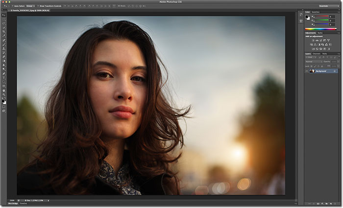
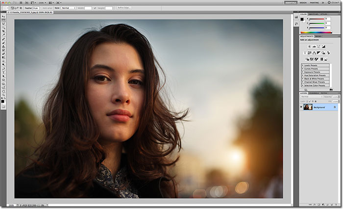
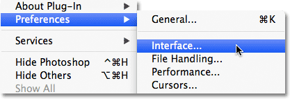
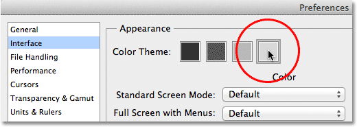
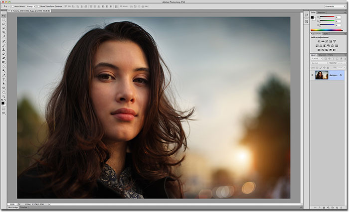
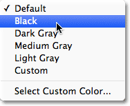
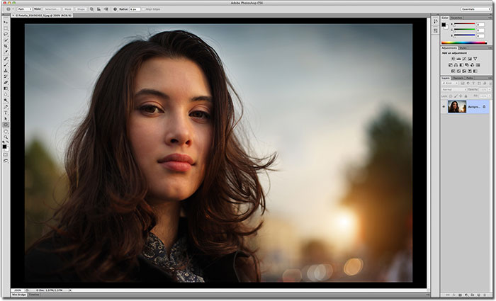
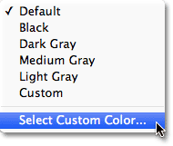
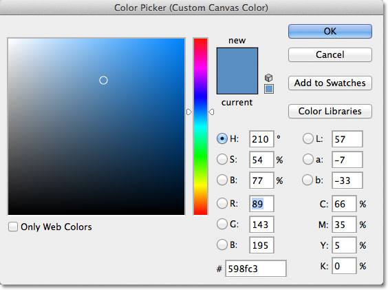

# Photoshop CS6 New Features – The Interface

> Source: [https://www.photoshopessentials.com/basics/interface-cs6/](https://www.photoshopessentials.com/basics/interface-cs6/)
> Downloaded and converted to Markdown.

Photoshop CS6 is finally here, and with it, Adobe has given us the biggest and best update to Photoshop in years! With so many amazing new features and improvements, like Content-Aware Move, the Blur Gallery, Background and Auto Saves, a searchable Layers panel, enhanced image cropping, a new 3D engine, video editing (yes, video editing!), plus so much more, there's never been a better time to start your journey with the world's most powerful image editor, or to upgrade from an earlier version of Photoshop!

If you are upgrading from CS5 or earlier, though, you may be in for quite a shock the first time you open Photoshop CS6 because things now look very different. By that, I mean the interface itself is much darker than anything we've seen before:

*The new darker interface in Photoshop CS6.*

If we compare this new dark interface to the much lighter interface of Photoshop CS5, the difference is obvious:

*Previous versions of Photoshop all featured a much lighter interface.*

Adobe's reason for switching to the darker interface makes perfect sense. With the interface darker, it remains in the background where it should be so we can focus more easily on what's really important - the image itself. It make take some getting used to, but once you're comfortable with the darker color, you'll most likely agree that Adobe made the right decision.

Then again, you may not. If you find it's just too dark and want to go back to the more familiar lighter gray interface, you can. In fact, with Photoshop CS6, Adobe gives us four different interface **color themes** to choose from, and we access them from the Preferences dialog box. To get to the Preferences, on a PC, go up to the **Edit** menu in the Menu Bar along the top of the screen, choose **Preferences**, and then choose **Interface**. On a Mac (which is what I'm using here), go up to the **Photoshop** menu at the top of the screen, choose **Preferences**, then choose **Interface**:

*Go to Edit > Preferences > Interface (PC) or Photoshop > Preferences > Interface (Mac).*

This opens Photoshop's Preferences dialog box set to the Interface options, and at the very top, you'll find the four **Color Themes**, each represented by a thumbnail displaying one of four shades of gray. The default theme is the second one from the left. To switch to a different theme, simply click on its thumbnail. For example, to switch to the more familiar light gray interface from previous versions of Photoshop, click on the lightest of the four thumbnails (the one on the far right):

*Choose from any of the four interface color themes by clicking on its thumbnail.*

You'll see the interface instantly update to the new theme. Try all four to see which one you like best, then click OK to close out of the Preferences dialog box. You can go back at any time and switch to a different theme:

*The lightest of the four color themes in Photoshop CS6.*

Now that you know where to find the Color Theme thumbnails in the Preferences dialog box, there's actually no reason to go back there because you can cycle through the four interface themes directly from your keyboard! To cycle forward through the themes (from darker to lighter), press **Shift+F2** repeatedly. To cycle backwards through the themes (from lighter to darker), press **Shift+F1** repeatedly.

We can also change the **pasteboard color** (the canvas area surrounding the image) independently of the rest of the interface. Simply **Right-click** (Win) / **Control-click** (Mac) anywhere inside the pasteboard. This will open a menu with a list of the different colors we can choose from (Black, Dark Gray, Medium Gray, or Light Gray, along with a Custom color). I'll choose Black from the list, just to make things easier to see:

*Right-click (Win) / Control-click (Mac) in the pasteboard to select a different color.*

And here we can see that the pasteboard around my image is now black while the rest of the interface retains the light gray from the color theme:

*The pasteboard color has been changed independently of the overall color theme.*

You can also choose your own custom color for the pasteboard area by selecting the **Select Custom Color** option at the bottom of the list:

*Choosing the Select Custom Color option.*

This will open Photoshop's **Color Picker**, allowing you to choose any color you want for the pasteboard. The default custom color is a light blue:

*Use the Color Picker to choose a new color for the pasteboard.*

Keep in mind, though, that it's never a good idea to choose anything but a neutral gray color for the pasteboard area, since you don't want some other color interfering with the colors in your image. Unless you need to select your own custom shade of gray with the Color Picker, you're better off ignoring the Select Custom Color option and choosing one of the preset shades of gray (or black) instead.