# Photoshop CS4 Interface Quick Tour

> Source: [https://www.photoshopessentials.com/basics/photoshop-cs4/interface/](https://www.photoshopessentials.com/basics/photoshop-cs4/interface/)
> Downloaded and converted to Markdown.

Adobe has been making major changes lately to Photoshop's user interface, and Photoshop CS4 brings with it the most streamlined, efficient and user-friendly interface we've seen yet. In this Photoshop Basics tutorial, we'll take a quick, general tour of the new interface to see what's what, what's new and where it all is in this latest and greatest version of the world's most popular image editor!

If you've upgraded to Photoshop CS4 from a previous version, you'll find that even though the overall appearance of the interface may seem quite a bit different from older versions (especially if you've upgraded from Photoshop CS2 or earlier), everything is pretty much where you'd expect to find it in Photoshop CS4, and considering how massive Photoshop has become over the years, it's a definite nod to the talents of Adobe's designers that they've managed to keep the interface so clean and elegant.

The screenshot below is of the Mac version of Photoshop CS4. Generally speaking, both the Mac and Windows versions of Photoshop CS4 are identical, but there are a couple of small differences which we'll look at as we come to them. Also, I'm running Photoshop CS4 Extended here which contains some additional features not found in the standard version of Photoshop CS4. Again, we'll look at these differences when needed:

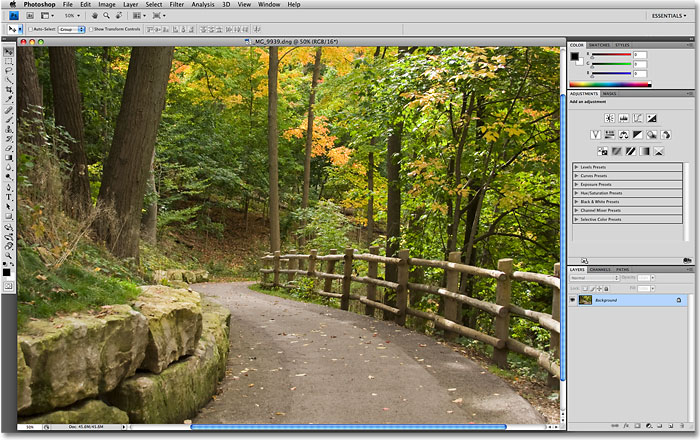
*The new user interface in Photoshop CS4.*

### The Menu Bar

At the very top of the screen as always is the **Menu Bar**, a common feature of most programs these days. Clicking on the various menu headings brings up a list of related options and commands. For example, the **File** menu is where we find options for opening, saving and closing Photoshop documents. The **Layer** menu contains options for working with layers. Photoshop's many filters can be found under the **Filter** menu, and so on:

*The Menu Bar in Photoshop CS4 (Extended).*

We won't bother going through all the menu options here since we'd both die of boredom and most of the important options and commands are covered in our other tutorials. As I mentioned, I'm using the Mac version of Photoshop CS4. The **Photoshop** menu option on the far left, which is where we find Photoshop's **Preferences** on the Mac, is not found in the Windows version. You'll find the Preferences under the **Edit** menu in Windows. Also, the **Analysis** and **3D** menu headings are exclusive to the Extended version of Photoshop CS4 and not found in the Standard version.

### The Tools Panel

Along the left side of the screen is Photoshop's **Tools panel**, formerly known as the Tools palette (palettes are now officially known as panels in Photoshop CS4), and also commonly referred to simply as the Toolbox. This is where we find all of the various tools we need for working on our images. In Photoshop CS4, you'll find the Tools panel displayed in a single column, but I've split it in half here just to make it easier to fit on the page:

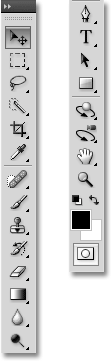
*The Tools panel in Photoshop CS4.*

Again, there's a couple of tools shown here that are exclusive to the Extended version of Photoshop CS4 (the **3D Rotate** and **3D Orbit** tools directly above the Hand Tool), but the majority of the tools are available in both the Standard and Extended versions and most have been around in Photoshop since forever.

**Single Or Double Column Layout**

Photoshop CS4, like CS3 before it, gives us a choice of how we want the Tools panel displayed. We can leave it in the default single column, or if you prefer, you can click on the small double-arrow icon at the top of the panel which will switch it to a double column layout, handy if you've upgraded from Photoshop CS2 or earlier and you can't get used to the new single column design. Click again on the icon to switch back to a single column:

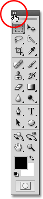
*You can switch between a single or double column layout in Photoshop CS4.*

**Accessing The Hidden Tools**

Photoshop CS4, like earlier versions, comes with so many tools that if Adobe tried to display them all at once, the Tools panel would need its own scroll bar. So instead, Adobe has grouped many related tools together, with one tool in the group visible in the Tools panel and the others hidden behind it. Whenever you see a tool in the Tools panel with a small arrow to the bottom right of the icon, it means there are additional tools behind it waiting to be selected, and if you click and hold your mouse button down on one of these tools, a fly-out menu will appear showing you the additional tools. For example, by clicking and holding on the **Rectangular Marquee Tool** at the top of the Tools panel, a fly-out menu appears giving me access to the **Elliptical Marquee Tool**, the **Single Row Marquee Tool** and the **Single Column Marquee Tool**. Simply move your mouse cursor over the name of the tool you want, then release your mouse button to select it:

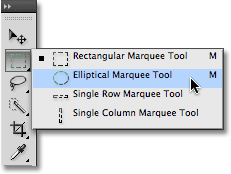
*Click and hold on some tools in the Tools panel to access additional tools behind it.*

Click and hold on the other tools in the Tools panel to see all of the tools available to us in Photoshop CS4.

### The Options Bar

Directly related to the Tools panel is the **Options Bar** at the top of the screen. On a Windows system, the Options Bar is located below the Menu Bar. On a Mac, it's located below the **Application Bar** which is new to Photoshop CS4. We'll look at the Application Bar in a moment.

Your Options Bar may look different from mine, and that's because it always changes to display options for whichever tool you current have selected. Here, the Options Bar is displaying options for the **Move Tool**:

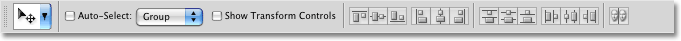
*The Options Bar displays options for the currently selected tool.*

If I select the **Crop Tool** from the Tools panel, the Options Bar changes to display options for the Crop Tool:

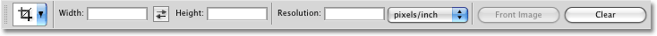
*The Options Bar now displaying options for the Crop Tool.*

And if I select the **Type Tool**, we see options displayed for the Type Tool:

*The Options Bar now displaying options for the Type Tool.*

Every tool has its own set of options which will always be available in the Options Bar.

### The Application Bar

New in Photoshop CS4 is the **Application Bar**. On a Windows system, you'll find the Application Bar combined with the Menu Bar at the top of the screen. On a Mac, the Application Bar is separate and located directly below the Menu Bar:

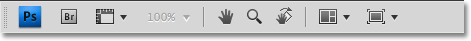
*The new Application Bar in Photoshop CS4.*

The Application Bar itself may be new, but many of the options you'll find here are not. The bar's main purpose is not really to wow us with new features (although there are some new ones) but to give us a central location for some commonly used features, tools and options rather than having them scattered throughout Photoshop. For example, the first icon on the left (not counting the blue PS icon in the Mac version) will quickly open **Adobe Bridge**:

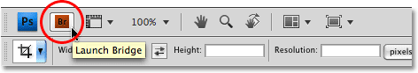
*We can launch Adobe Bridge directly from the new Application Bar in Photoshop CS4.*

To the right of that is the **View Extras** icon, giving us easy access to Photoshop's Guides, Grid and Rulers.

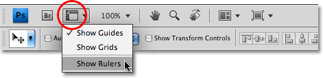
*Use the View Extras icon to quickly turn the Guides, Grid or Rulers on or off.*

Next is the **Zoom Level** icon which allows to quickly choose from four preset zoom levels - 25%, 50%, 100% or 200%. You can also type your own zoom level directly into the input box if none of the presets work for you:

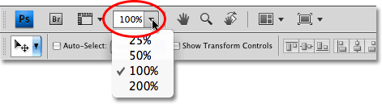
*The Zoom Level icon gives us four preset zoom levels to choose from, or type your own into the input box.*

Also found in the Application Bar are Photoshop's standard **Hand** and **Zoom Tools** which have traditionally been (and still are) found at the bottom of the Tools panel:

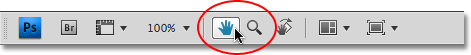
*Both the Hand Tool and Zoom Tool from the Tools panel are now available in the Application Bar.*

**The New Rotate View Tool**

Next, we come to a brand new feature in Photoshop CS4, the **Rotate View Tool**, which also happens to be available in the Tools panel (click and hold on the Hand Tool in the Tools panel and select the Rotate View Tool from the fly-out menu). We'll take an in-depth look at this new feature in another tutorial, but essentially, the Rotate View Tool allows us to rotate our view of the image on screen as if we were rotating a photo on a desk or table, which can make it easier to paint or edit certain areas. What's great about it is that since we're only rotating our view of the image, not the image itself, no pixels are harmed by the rotation and the image will still save, print and export upright. Again, we'll look more closely at the new Rotate View Tool in another tutorial:

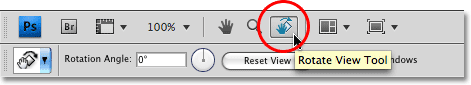
*The new Rotate View Tool allows us to rotate our view of the image without actually rotating the image itself.*

**New Multi Document Layouts**

Also new in Photoshop CS4 is the **Arrange Documents** icon which gives us lots of new layouts for viewing multiple documents on screen at once. You'll also find some standard viewing options from the Window menu like Match Zoom and Match Location, but the new multi document layouts are a great new feature and one we'll look at in more depth later:

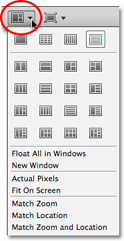
*Photoshop CS4 gives us many ways to view multiple documents at once.*

Finally, rounding out the options in the new Application Bar is the **Screen Mode** icon, allowing us to quickly choose between Photoshop CS4's three screen modes - **Standard**, **Full Screen with Menu Bar** and **Full Screen Mode**:

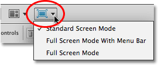
*You can quickly switch between screen modes directly from the Application Bar in Photoshop CS4.*

### The Panels

Along the right side of the screen in Photoshop CS4 is where we find the **Panels** column (panels were known as palettes in earlier versions of Photoshop). Panels give us access to all kinds of commands and options for working on our images, from organizing layers and viewing individual color channels to choosing colors, stepping back through history states, working with text, viewing information about our images, and so much more. Most of the panels in Photoshop CS4 are the same ones that have been available in earlier versions of Photoshop, but some, like the **Adjustments Panel**, are brand new to CS4:

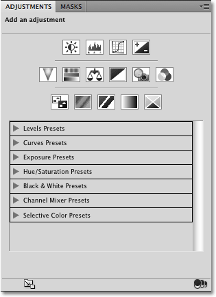
*The Adjustments Panel is new to Photoshop CS4.*

By default, only a handful of panels are displayed on the screen to begin with, but you can access any of Photoshop's panels at any time simply by choosing the one you want from the **Window** menu up in the Menu Bar. A checkmark beside a panel's name means it's already open on the screen. Selecting a panel that's already open will close it. A couple of the panels listed below are available only in the Extended version of Photoshop CS4, but most are available in the Standard version:

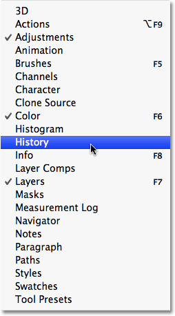
*All of Photoshop CS4's panels can be accessed from the WIndow menu.*

To keep things organized and save screen space, most of Photoshop's panels are grouped in with other related panels. This is known as a **panel group**, if you didn't already guess that on your own. For example, the Layers, Channels and Paths panels are grouped together by default. To select the panel you want from the group, simply click on the panel's name tab at the top:

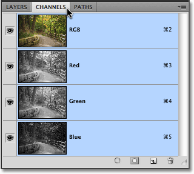
*Click on a panel's name tab to select it inside the panel group.*

All panels come with various options and commands that are specific to that panel. You can access these options by clicking on the panel's **menu icon** in the top right corner. Unfortunately, it's not the most obvious thing on the screen and many Photoshop users don't even know it's there, but you should click on each panel's menu icon to see what options and commands are available for it:

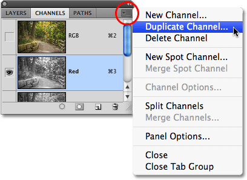
*Click on a panel's menu icon to view a list of related options and commands.*

We'll look at all the different ways we can arrange and organize Photoshop CS4's panels in another tutorial.

### Workspaces

In the top right corner of the screen is an option that allows us to quickly select from various **workspaces**, either ones that are built in to Photoshop CS4 or custom workspaces we've created ourselves. Workspaces allow us to set up different panel arrangements, menus and even keyboard shortcuts for different tasks. For example, you may want certain panels open when editing images and other panels open when painting with Photoshop's brushes or when working with type. Workspaces allow us to set up the screen any way we want, save it, and then quickly select it again any time we need it! Photoshop CS4 comes with several built in workspaces. The **Essentials** workspace is selected by default but you can access the complete list of available workspaces, including any custom ones you've created, by clicking on the word Essentials and selecting a new workspace from the list that appears:

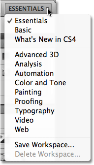
*Click on the word "Essentials" in the top right corner of the screen to view all the available workspaces.*

### The Document Window

The largest and most obvious interface element in Photoshop is the **document window**. The document window is where we view our images and where we do all of our editing work:

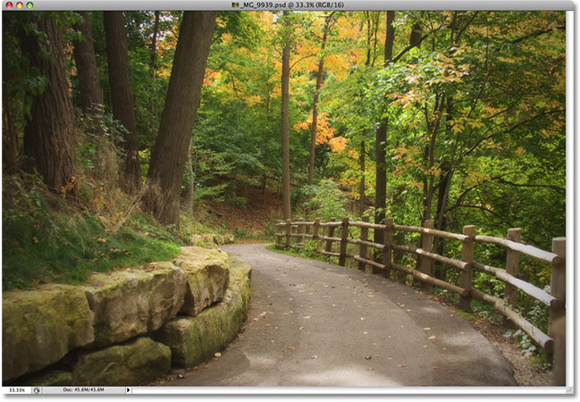
*Each image appears inside its own document window.*

Document windows in Photoshop do much more though than simply display the image. They also tell us quite a few things about the image. At the top of the document window, you'll find the name of the image, followed by the current zoom level, the color mode, and the current bit depth:

*The top of the document window gives us information about the image.*

You'll find even more information at the bottom of the document window. In the bottom left corner is the zoom level once again, followed by the current file size of the image, which includes the size with all layers intact and the size if you were to flatten the image. If you click on the right-pointing arrow, then choose **Show**, you'll see a whole list of details about the image you can view, including the document dimensions, color profile, and even which tool you currently have selected from the Tools panel:

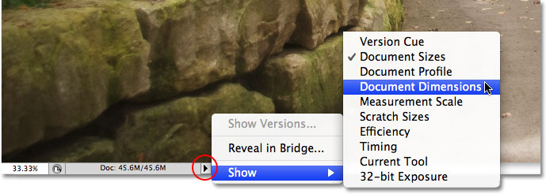
*Much more information about the image is available at the bottom of the document window.*

### The Application Frame

The last feature we need to look at in our tour of Photoshop CS4's user interface is brand new and exclusive to the Mac version of Photoshop CS4, the **Application Frame**. Before Windows users start feeling left out and abandoned by Adobe, what the Application Frame essentially does is give Mac users the Windows experience (all jokes about random system crashes aside). The Application Frame places the entire Photoshop interface inside a self-contained application window, which is how it already works in Windows and why this feature is only available in the Mac version.

Traditionally, Mac users have been used to Photoshop's interface elements floating around independently on the desktop, and if you're a Mac user and that's how you prefer to work, there's nothing you need to change. However, if you'd prefer to have Photoshop displayed entirely in its own window, similar to the interface style of Adobe Bridge and Lightroom, simply go up to the **Window** menu in the Menu Bar and choose **Application Frame** down near the bottom of the list of options:

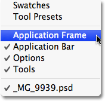
*Go to Window > Application Frame to place Photoshop inside an independent window (Mac version only).*

The Application Frame places all interface elements inside a window, and you can move the entire application around on the screen simply by clicking anywhere on the gray bar at the top of the frame and dragging it around:

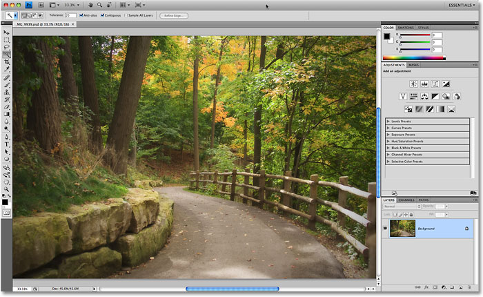
*The Application Frame places all of Photoshop CS4's interface elements inside a self contained, draggable window.*

You can resize the Application Frame by simply moving your mouse cursor to the edges or corners of the frame, then clicking and dragging to resize it. To exit out of it and return to the Mac's default view, go back up to the **Window** menu and choose **Application Frame** once again to deselect it.