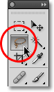
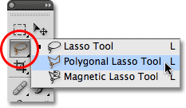
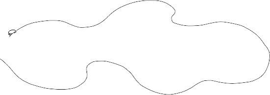
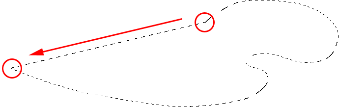
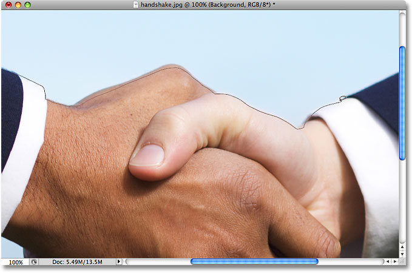
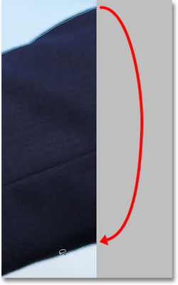
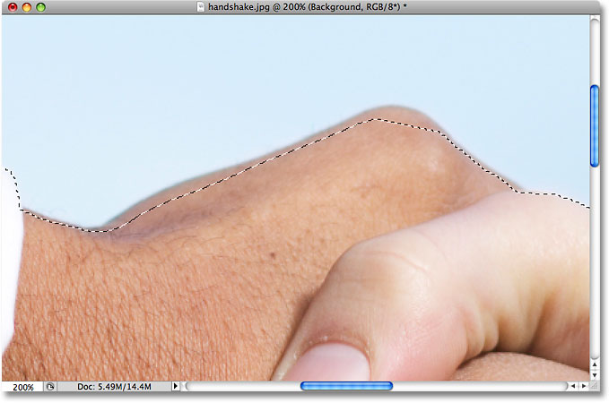
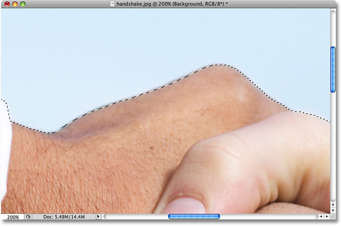
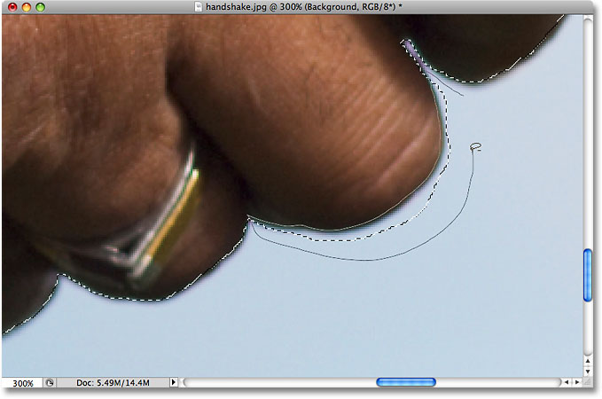

# The Lasso Tool In Photoshop

> Source: [https://www.photoshopessentials.com/basics/selections/lasso-tool/](https://www.photoshopessentials.com/basics/selections/lasso-tool/)
> Downloaded and converted to Markdown.

Please note: Although this tutorial was originally written for an earlier version of Photoshop, it is fully compatible with newer versions including Photoshop CS6 and CC.

So far in our journey through Photoshop's various selection tools, we've looked at how the **[Rectangular Marquee Tool](/basics/rectangular-marquee-tool/)** allows us to easily draw selections based on simple rectangular or square shapes, and how the [**Elliptical Marquee Tool**](/basics/elliptical-marquee-tool/) extends our selection making abilities into the exciting world of ovals and circles. But what if we need to select something in a photo that's a little more complex, like someone's eyes, an item of clothing, or maybe a car or a bottle? Something that still has a clearly defined form to it but is beyond the capabilities of Photoshop's geometry-based Marquee Tools.

If you're a more advanced Photoshop user, you'll probably head straight for the [**Pen Tool**](/basics/pen-tool-selections/), the tool of choice for making professional quality form-based selections. But if you have a good quality mouse (or even better, a pen tablet), decent drawing skills and a little patience, you may find that the **Lasso Tool**, another of Photoshop's basic selection tools, is all you need.

This tutorial is from our [How to make selections in Photoshop](/basics/make-selections-photoshop/) series.

Photoshop actually gives us three variations of lasso to work with. The one we'll be looking at in this tutorial is the standard Lasso Tool, which you can access by clicking on its icon in the Tools panel. It's the tool that looks like the sort of lasso you'd find a cowboy swinging at a rodeo:

*Selecting the standard Lasso Tool.*

For a faster way to select the Lasso Tool, simply press the letter **L** on your keyboard. There are two other types of lasso tools as well - the **Polygonal Lasso Tool** and the **Magnetic Lasso Tool**, both of which are hiding behind the standard Lasso Tool in the Tools panel. We'll look at both of these tools in separate tutorials, but to access either of them, simply click and hold your mouse button down on the standard Lasso Tool until a small fly-out menu appears, then select either tool from the menu:

*Each of the three types of lasso tool gives us a different way to draw selections.*

All three lasso tools share the letter L as their keyboard shortcut for selecting them, so depending on how you have things set up in Photoshop's Preferences, you can cycle through the three tools either by pressing the letter **L** repeatedly or by pressing **Shift+L**. We covered how to change the option in the Preferences for switching between tools in the [**Elliptical Marquee Tool tutorial**](/basics/elliptical-marquee-tool/).

### Drawing Freehand Selections

Of all the selection tools in Photoshop, the Lasso Tool is probably the easiest to use and understand because you simply drag a freehand selection around the object or area you want to select, in a similar way to how you would outline something on a piece of paper with a pen or pencil. With the Lasso Tool selected, your mouse cursor will appear as a small lasso icon, and you simply click at the spot in the document where you want to begin the selection, then continue holding your mouse button down and drag to draw a freeform selection outline:

*Drawing a selection outline with the Lasso Tool is like drawing with a pen or pencil on paper.*

To complete the selection, simply return to the spot where you began and release your mouse button. You don't necessarily *have* to return the same spot you started from, but if you don't, Photoshop will automatically close the selection for you by drawing a straight line from the point where you released your mouse button to the point where you began, so in most cases, you will want to finish where you started:

*Photoshop will close a selection automatically with a straight line if you don't drag back to the beginning point.*

To say that the Lasso Tool is not the most accurate of Photoshop's selection tools would be an understatement, but its usefulness is greatly improved with Photoshop's ability to **add to** and **subtract from** selections. I find that the best way to work with the Lasso Tool is to drag an initial selection around the object or area I'm selecting, ignoring any obvious mistakes I made, then going back around and fixing up the problem areas by adding to or subtracting from the selection as needed.

Here's a photo I currently have open on my screen of two people shaking hands. I want to select the handshake and place it into a different image:

*The Lasso Tool is a good choice for selecting freeform objects like this.*

To begin my selection, I'll first grab the Lasso Tool from the Tools panel as we saw earlier. Then I'll click somewhere along the top of the sleeve of the person on the left to begin my selection, although it really makes no difference where along the object you begin your selection with the Lasso Tool. Once I've clicked on a starting point, I'll continue holding my mouse button down as I drag to draw an outline around the area of the photo I need. I can already see that I've made some mistakes, but I'll ignore them for now and continue on:

*Don't worry about any mistakes with your initial selection. You can fix them later.*

If you need to scroll your image around inside the document window as you're drawing the selection, hold down your **spacebar**, which will temporarily switch you to Photoshop's **Hand Tool**, scroll the image as needed, then release your spacebar and continue drawing the selection.

To make sure I select all of the pixels I need along the edge of the photo, I'll press the letter **F** on my keyboard to switch to **Full Screen Mode with Menu Bar** and I'll drag my selection outline into the gray pasteboard area surrounding the image. Don't worry about selecting the pasteboard, since Photoshop only cares about the image itself, not the pasteboard area:

*It's okay to drag the Lasso Tool into the pasteboard area when you need to select pixels along the edge of a photo.*

If you want to switch back to the document window view mode, press the letter **F** a couple more times to cycle through Photoshop's screen modes. I'll continue dragging around the area I need to select until I'm back to my starting point, and to complete my initial selection with the Lasso Tool, I'll simply release my mouse button. An animated outline, commonly known as "marching ants", now appears around the selected area:

*The initial selection is complete, but there's quite a few problem areas that need fixing.*

Since the Lasso Tool is essentially a manual selection tool that relies heavily on your own drawing skills, as well as on the accuracy and performance of your mouse, you'll probably end up with an initial selection outline that falls well short of perfect, as mine did. Not to worry though, since we can easily go back and fix up the problem areas, which we'll do next!

### Adding To The Initial Selection

To inspect the selection outline for any problem areas, it usually helps to be zoomed in on the image. To zoom in, press and hold **Ctrl+spacebar** (Win) / **Command+spacebar** (Mac) to temporarily switch to Photoshop's **[Zoom Tool](/basics/photoshop-zoom/)**, then click inside the document window once or twice to zoom in (to zoom back out later, press and hold **Alt+spacebar** (Win) / **Option-spacebar** (Mac) and click inside the document window). Once you've zoomed in, hold down your **spacebar** by itself to temporarily switch to the **[Hand Tool](/basics/photoshop-zoom/)**, then click and drag the image along the selection outline to look for problems.

Here, I've come across an area where I missed the edge of the person's hand:

*One of several problem areas with the initial selection.*

No need to start all over again. I can easily fix this by simply adding to the existing selection. Make sure you still have the Lasso Tool selected, then to add to a selection, hold down your **Shift** key. You'll see a small plus sign (+) appear in the bottom right of the cursor icon, letting you know that you're now in **Add to Selection** mode. With the Shift key held down, click somewhere inside of the existing selection, then drag outside of it and along the edge of the area you want to add. When you're done adding the new area, drag back inside of the existing selection:

*Hold down your Shift key and drag around the area you want to add to the existing selection.*

Drag back to the spot where you initially clicked, then release your mouse button to finish. The area of the person's hand that I missed initially has now been added:

*More of the image has been added to the initial selection.*

There's no need to continue holding down your Shift key the whole time you're adding to a selection. Once you've started dragging your mouse, you can safely release the Shift key. You'll stay in Add to Selection mode until you release your mouse button.

### Subtracting From The Initial Selection

I'll continue scrolling along my selection outline looking for problems, and here I've come across the exact opposite problem from what I had a moment ago. This time, I selected too much of the image around the person's finger:

*Another sloppy selection area. This time, too much of the area was selected.*

No worries though, since we can remove parts of a selection just as easily as we can add to them. To remove an unwanted area from a selection, hold down your **Alt** (Win) / **Option** (Mac) key. This will place you in **Subtract from Selection** mode, and you'll see a small minus sign (-) appear in the bottom right corner of the cursor icon. With the Alt / Option key held down, simply click anywhere outside of the existing selection to set a starting point, then drag inside the selection and along the edge of the area you want to remove. In my case, I'm going to drag along the edge of the finger. When you're done, drag back outside of the existing selection:

*Removing the problem area by subtracting it from the selection.*

Drag back to the spot where you first clicked, then release your mouse button to finish. The unwanted area around the person's finger has now been removed:

*Problem area? What problem area? I don't see any problem area.*

Again, there's no need to hold your Alt / Option key down the entire time. You can safely release the key once you've started dragging. You'll remain in Subtract from Selection mode until you release your mouse button.

Once I've scrolled all around the selection outline fixing problems by adding or removing parts as needed, my final selection with the Lasso Tool is complete:

*The final selection.*

With the handshake now selected, I'll press **Ctrl+C** (Win) / **Command+C** (Mac) to quickly copy the selected area, then I'll open up a second image in Photoshop and press **Ctrl+V** (Win) / **Command+V** (Mac) to paste the handshake into the new photo, repositioning it as needed:

*Thanks to our successful Lasso Tool selection, business is booming!*

### Removing A Selection

When you're done with a selection created with the Lasso Tool, you can remove it by going up to the **Select** menu at the top of the screen and choosing **Deselect**, or you can press the keyboard shortcut **Ctrl+D** (Win) / **Command+D** (Mac). You can also simply click anywhere inside of the document with the Lasso Tool.