# Photoshop Layers – Layer Groups

> Source: [https://www.photoshopessentials.com/basics/layers/layer-groups/](https://www.photoshopessentials.com/basics/layers/layer-groups/)
> Downloaded and converted to Markdown.

Learn all about layer groups in Photoshop and how they let us group related layers together and help keep our Layers panel looking neat and tidy. You'll learn how to create layer groups, add layers to a group, nest layer groups inside other groups, and more!

In previous tutorials in our series on **Photoshop layers**, we looked at [what layers are](/basics/layers/) and why they make everything we do in Photoshop so much easier. We learned the essentials of working inside the [Layers panel](/basics/layers/layers-panel/), and we learned about the [Background layer](/basics/layers/background-layer/) and the important ways it differs from Photoshop's other types of layers.

As you become more comfortable with layers and begin using them as a normal part of your workflow, you'll soon discover another important aspect of working with layers - **keeping them organized**. Whether you're retouching or restoring images, designing print or web layouts, or creating cool special effects, the number of layers in your document can add up quickly and it doesn't take long for your Layers panel to become a cluttered mess of confusion.

There's a couple of things we can do to keep the Layers panel looking neat and tidy. One is to rename layers, replacing the default names Photoshop gives them, like "Layer 2" and "Layer 10 copy 12", with names that are descriptive and meaningful. Another way, and the way we'll look at in this tutorial, is by using **layer groups**.

A layer group is very much like having a virtual folder in your Layers panel, a folder that you can place similar or related layers into. Just like a real world folder in a filing cabinet, you can open the folder at any time to view its contents, and you can close the folder when you don't need it to keep its contents safely tucked away out of sight.

This tutorial is Part 7 of our [Photoshop Layers Learning Guide](/photoshop-layers-learning-guide/ "View our Layers Learning Guide").

Here's an ad layout I have open on my screen for a fictional garden center:

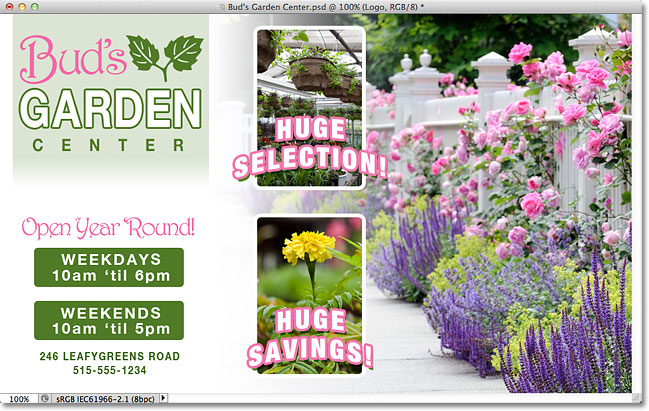
*An ad layout in Photoshop.*

If we look in my Layers panel, we see that even though I've gone ahead and renamed many of the layers, there's still quite a few layers to sort through. In fact, I've had to split the Layers panel in half here to fit it more easily on the page. The top half is on the left and the bottom half is on the right:

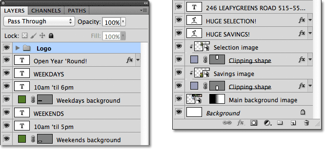
*The Layers panel showing all the layers used in the document.*

It may look like there's a lot of layers in the document, but there's actually even *more* layers than what we're seeing. If we look at the very top of the layer stack, we see that I've already added a layer group, which I've named "Logo". We know that it's a layer group because of the **folder icon** to the left of the group's name:

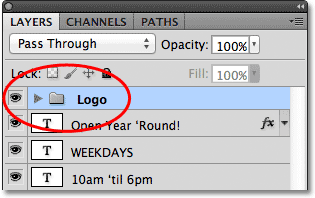
*A layer group named "Logo" appears at the top of the layer stack. The folder icon tells us it's a layer group.*

### Opening And Closing Layer Groups

I've gone ahead and placed a few layers inside the group, but by default, layer groups are closed, which is why we can't see any of the layers inside it. To open a group, simply click on the small **triangle icon** to the left of the folder icon:

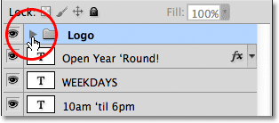
*Clicking on the triangle icon.*

This "twirls" the group open, displaying the layers inside it. Photoshop lets us know which layers are part of the group by indenting them slightly to the right. Here, we can see that my Logo group contains five layers ("Bud's", "GARDEN", "CENTER", "leaves", and "Logo background"). To close a layer group after you've opened it, just click again on the triangle icon:

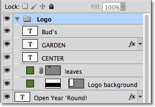
*The five layers that make up the Logo group are indented to the right.*

You may have guessed that the reason I placed those five layers into a group named "Logo" is because those are the layers that make up the "Bud's Garden Center" logo design in the top left corner of my document:

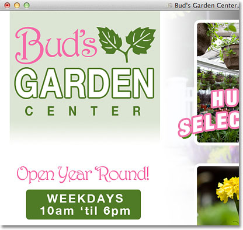
*The layers in the group make up the logo in the top left corner.*

One of the added advantages of using layer groups, besides keeping things organized, is that they make it easy to turn several layers on or off at once in the document. Normally, to turn a single layer on or off, we'd click on its **layer visibility icon** (the "eyeball") on the far left of the layer in the Layers panel. We can do the same thing with layer groups. Each group also has its own visibility icon. I'll turn the "Logo" group off temporarily by clicking on the eyeball:

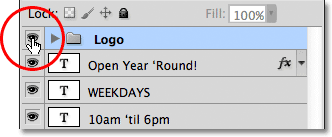
*Clicking on the Logo group's visibility icon.*

With the group itself turned off, all five layers inside the group are instantly hidden in the document. To turn them all back on at once, I'd simply need to click again on the group's visibility icon:

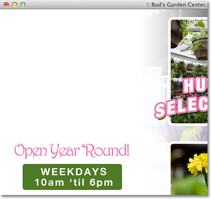
*All five layers that make up the logo are turned off by turning off the group itself.*

### Creating A New Layer Group

Let's look at how to create a new layer group. The fastest and easiest way to create a new group is by clicking on the **New Layer Group** icon at the bottom of the Layers panel. It's the icon that looks like a folder:

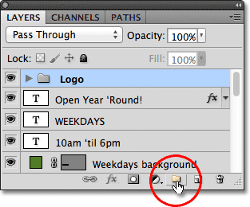
*Clicking on the New Layer Group icon.*

Photoshop will create a new layer group, give it a default, generic name (in this case, "Group 1") and place it directly above whatever layer or layer group was selected when you clicked on the New Layer Group icon. In my case, my "Logo" group was selected, so Photoshop placed the new group above it:

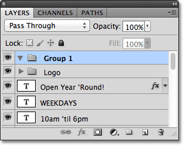
*A new group, "Group 1", appears at the top of the layer stack.*

The problem with creating new layer groups this way is that all we've done is created an empty group. There are no layers inside of it. To place layers into the group, we'd need to select and drag them in manually. I'll press **Ctrl+Z** (Win) / **Command+Z** (Mac) on my keyboard to undo my last step and remove the group I added.

A better way is to first select the layers we want to place inside the group. For example, let's say I want to take the layers that display the garden center's address and hours of operation (in the bottom left corner of the layout) and place them inside their own group. There's eight layers in total that I'll need to select. To do that, I'll start by clicking on the top-most layer that I need (the "Open Year 'Round" text layer):

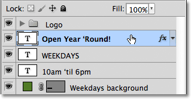
*Clicking on the top layer to select it.*

Next, I'll hold down my **Shift** key and I'll click on the bottom-most layer. This selects both layers plus all the layers in between. I now have my eight layers selected. It's very important to note here that all of the layers I'm about to place inside a group are sitting **directly above or below each other** in a continuous column. Trying to group layers together that are scattered throughout the Layers panel, with other layers between them, will usually cause problems with your layout. Layer groups work best with layers that are in a continuous column like these ones:

*Holding Shift and clicking on the bottom layer to select all 8 layers at once.*

With all of the layers you need selected, click on the **menu icon** in the top right corner of the Layers panel (in earlier versions of Photoshop, the menu icon looks like a small arrow):

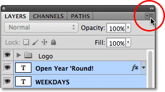
*Click on the Layers panel menu icon.*

Select **New Group from Layers** from the menu that appears:

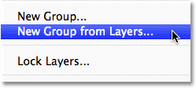
*Choose "New Group from Layers" from the menu.*

Photoshop will pop open a dialog box asking you to name the new group. I'll name mine "Address / Hours". Click OK when you're done to close out of the dialog box:

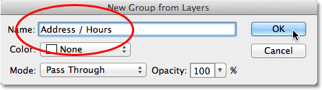
*Enter a name for the new layer group, then click OK.*

We can see in the Layers panel that I now have a new layer group named "Address / Hours" sitting below the "Logo" group. As I mentioned earlier, the new group is closed by default so the layers are currently nested away inside it:

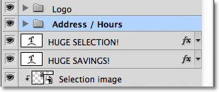
*The selected layers are now nested inside the new group.*

If I want to see the layers inside the group, I can twirl the group open by clicking on its triangle icon, and now all eight layers are visible:

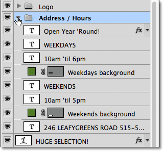
*Twirling the new group open to reveal the layers inside it.*

I'll close the group again so we can see that just by placing those eight related layers into a layer group, I've managed to save a considerable amount of space in my Layers panel and greatly reduce the clutter:

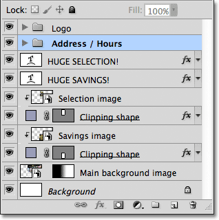
*Grouping the layers has made the Layers panel easier to work with.*

Just as we saw earlier with the "Logo" group, I can now turn off all the layers inside the "Address / Hours" group at once by clicking on the group's visibility icon:

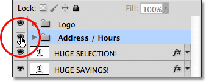
*Clicking on the visibility icon for the new "Address / Hours" group.*

Instantly, all of the information in the bottom left corner of the layout is turned off. I can turn it back on any time I want by again clicking on the group's visibility icon:

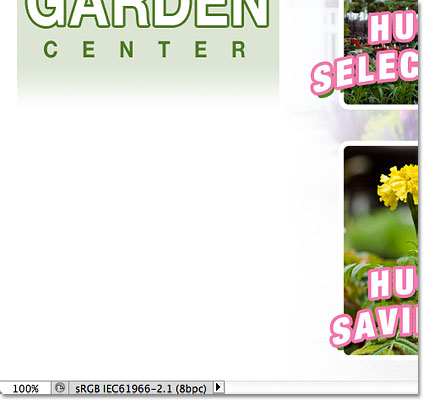
*The address and business hours information is now hidden.*

There are several other things we can do with grouped layers in Photoshop besides turning them on and off. We can move them all at once with the Move Tool, we can resize and reshape them all with the [Free Transform](/basics/free-transform/) command. We can even add [layer masks](/basics/layers/layer-masks/) to groups! To avoid going completely off topic though, in this tutorial, we'll focus on the main purpose and benefit of layer groups, which is to keep our layers and the Layers panel better organized.

### Removing Layers From A Group

If, after you've grouped layers together, you need to ungroup them, the easiest way to do it is to **right-click** (Win) / **Control-click** (Mac) anywhere on the group in the Layers panel:

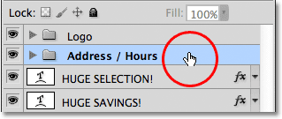
*Right-click (Win) / Control-click (Mac) anywhere on the group.*

Then choose **Ungroup Layers** from the menu that appears:

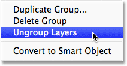
*Choose "Ungroup Layers" from the menu.*

This returns the layers back to their original ungrouped state. The layer group itself is deleted:

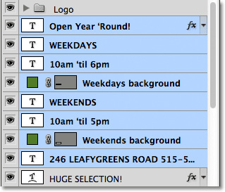
*The layers are no longer grouped together.*

### Nesting Groups Inside Other Groups

Not only does Photoshop let us group layers together, it even let's us group layer groups! For example, I want to take the two layer groups I've already added ("Logo" and "Address / Hours") and place them both inside another new group. Grouping two or more layer groups together is no different from grouping individual layers. First, we need to select the groups we want. I already have the "Address / Hours" group selected, so I'll hold down my **Shift** key and click on the "Logo" group above it. This selects both groups at once:

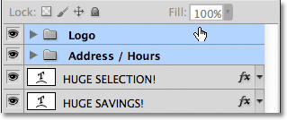
*Selecting the two layer groups I want to place inside a new group.*

With both groups selected, I'll click on the **menu icon** in the top right corner of the Layers panel, just as I did before:

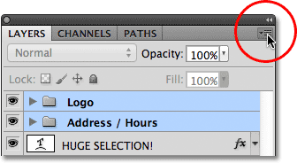
*Click on the menu icon.*

I'll select **New Group from Layers** from the menu that appears. It still says "New Group from Layers" even though we're actually creating a new group from other groups:

*Choose "New Group from Layers".*

I'll name the new group "Left Column" in the dialog box that appears, since the contents of the "Logo" and "Address / Hours" groups make up the left column of my layout:

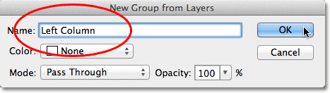
*Naming the new layer group.*

I'll click OK to close out of the dialog box, at which point Photoshop creates a new layer group named "Left Column". If I twirl the new group open by clicking on its triangle icon, we see the "Logo" and "Address / Hours" groups nested inside it:

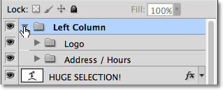
*A new layer group has been created from two existing groups.*

Removing groups from a larger group is also done the same way as ungrouping individual layers. Simply **right-click** (Win) / **Control-click** (Mac) anywhere on the layer group in the Layers panel and choose **Ungroup Layers** from the menu that appears:

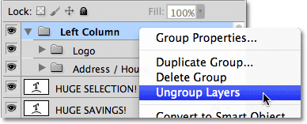
*Removing the two layer groups from the larger group.*

And now I'm back to having my two individual layer groups:

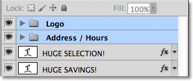
*The Layers panel after ungrouping the two layer groups.*

To finish organizing my Layers panel, I'll quickly select all the layers that make up the center column of my layout (the "Huge Selection!" and "Huge Savings!" text and images):

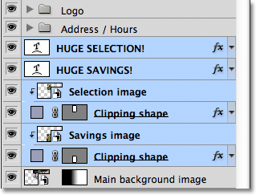
*Selecting the layers that make up the center part of the layout.*

If you're the kind of person who prefers keyboard shortcuts over menu commands, a really quick way to create a group from your selected layers is to simply press **Ctrl+G** (Win) / **Command+G** (Mac) on your keyboard. Photoshop will instantly place your layers into a group, although it will give the group a default, generic name rather than giving you the chance to name it first. Here, my layers have been placed into a new group named "Group 1":

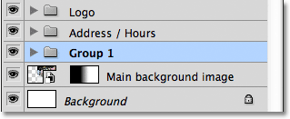
*Press Ctrl+G (Win) / Command+G (Mac) to quickly create a new group (with a default name) from selected layers.*

To ungroup the layers using a keyboard shortcut, press **Shift+Ctrl+G** (Win) / **Shift+Command+G** (Mac).

To rename the group and give it a more descriptive name, double-click directly on the group's name in the Layers panel and type in a new one, just as if you were renaming a normal layer. I'll name mine "Selection / Savings". Press **Enter** (Win) / **Return** (Mac) when you're done to accept the name change:

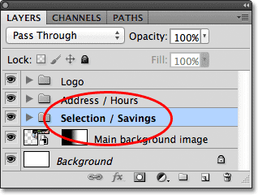
*Renaming a layer group is as easy as renaming a normal layer.*

### Where to go from here...

As we've seen in this tutorial, layer groups are an easy and convenient way to package related layers together, freeing up space in the Layers panel and keeping it from looking cluttered and disorganized. But there's more we can do with them. We'll look at the real power of layer groups in the next tutorial in our [Layers Learning Guide](/photoshop-layers-learning-guide/ "View our Photoshop Layers Learning Guide") when we learn how to [align and distribute layers](/basics/layers/align-layers/) in Photoshop. Visit our [Photoshop Basics](/basics/ "Photoshop Basics tutorials") section to learn more about the basics of Photoshop!