# Understanding Layer Masks In Photoshop

> Source: [https://www.photoshopessentials.com/basics/layers/layer-masks/](https://www.photoshopessentials.com/basics/layers/layer-masks/)
> Downloaded and converted to Markdown.

**Before we begin...** This version of our Understanding Layer Masks tutorial is for Photoshop CS5 and earlier. If you're using Photoshop CC or CS6, please see our fully-updated [Understanding Photoshop Layer Masks](/basics/understanding-photoshop-layer-masks/) tutorial.

In this **Photoshop tutorial**, we're going to look at one of the most essential features in all of Photoshop - **layer masks**. We'll cover exactly what layer masks are, how they work, and why you want to use them. If you've been staying away from using layer masks with your Photoshop work because you thought they were somehow beyond your skill level, well, if you know the difference between black and white and can paint with Photoshop's Brush Tool, you already have all the skills you need!

A wise man once said, "Nothing worth doing in life should be done without layer masks". Apparently, the wise man was a big Photoshop user who may have spent a little too much time alone on top of the mountain. But enough about him. Layer masks are right up there at the top of the list of things you really need to know about when working in Photoshop because without them, your work, your creativity and your flexibility all suffer. It's that simple. It's a good thing for us, then, that layer masks are so incredibly simple and easy to understand!

Before we continue, if you're unsure of what a [**layer**](/basics/layers/) is, you may want to [**read our tutorial on Photoshop layers**](/basics/layers/) before learning about layer masks.

So what are layer masks then? Well, if the term "mask" is what's confusing you (and who could blame you), replace the word "mask" in your mind with "transparency", because that's exactly what a layer mask does. It allows you to *control a layer's level of transparency*. That's it, that's all. There's nothing more to them than that. Now, you may be thinking, "But... I can already control the transparency level with the Opacity option, can't I?", and yes, you certainly can. The Opacity option in the top right corner of the Layers palette also allows you to control a layer's transparency.

But here's the difference. The Opacity option changes the transparency level for the *entire layer at once*. If you lower the Opacity level down to, say, 50%, the entire layer becomes 50% transparent. That may be fine for some situations, but what if you want only *part* of a layer to be transparent? What if you want the left side of the layer to be completely transparent, the right side to be completely visible, with a gradual transition between the two through the middle of the layer? That's actually a very common thing to do with a layer in Photoshop, allowing you to fade from one image to another. But you can't do that with the Opacity option since as I said, it's limited to controlling the transparency of the entire layer at once. What you would need is some way to control the transparency of different areas of the layer separately. What you would need is a layer mask.

Let's look at an example. Here I have a couple of wedding photos that I think would work well blended together. Here's the first one:

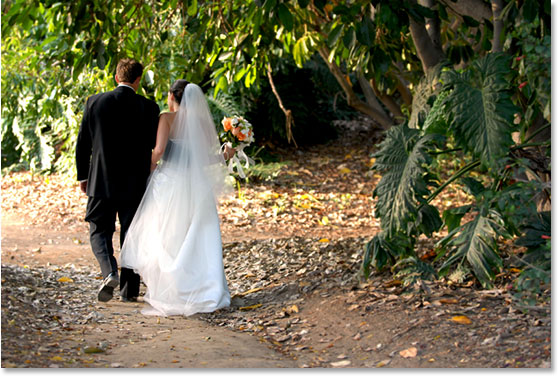

*The first wedding photo.*

And here's the second one:

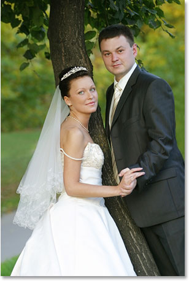

*The second wedding photo.*

In order to blend them together, whether I'll be using a layer mask or not, I need to have both photos inside the same Photoshop document, so with each photo open in its own separate document window, I'm simply going to press *V* on my keyboard to select my *Move Tool* and then click inside one of the documents and drag that photo into the document containing the other photo:

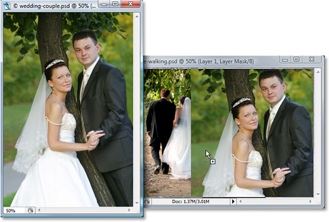

*Dragging one photo into the same Photoshop document as the other photo with the Move Tool.*

Now both photos are in the same Photoshop document, and if we look in the Layers palette, we can see that each one is on its own separate layer, with the photo of the couple facing towards the camera on top and the photo of the couple walking away from us into the woods below it:

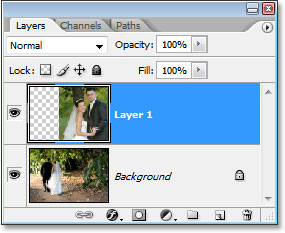

*Photoshop's Layers palette showing each photo on its own separate layer.*

So far, so good. Now, how am I going to blend these two photos together? Well, let's see what happens if I simply try lowering the opacity of the top layer. I'm going to lower it to about 70% just to see what sort of effect I end up with:

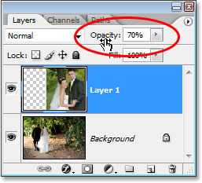

*Lowering the opacity of the top layer to blend it with the layer below it.*

Here's my result:

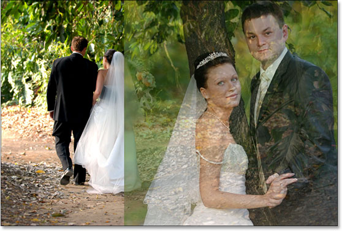

*The image on the bottom is now showing through the image on the top layer.*

Hmm. After lowering the opacity of the top layer (which again contains the image of the couple facing towards the camera on the right), the image on the bottom layer of the couple walking in the woods is now showing through the image above it. This effect may work if I was trying to turn the wedding couple into a couple of ghosts, but it's not really what I was hoping for, so I'm going to raise the opacity of the top layer back to 100% to make the top image fully visible once again. Let's try something else.

So far in our quest to blend our two photos together, we've tried lowering the opacity of the top layer with disappointing results, since all that basically did was fade the entire image. What I really want is for the couple in both images to remain fully visible, with the blending of the two images happening in the area between the bride walking away from us on the left and her looking towards us on the right. I know, why don't I just use Photoshop's *Eraser Tool*! That's what I'll do. I'll use the Eraser Tool with nice, soft edges to erase the part of the image on the right that I don't need. Yep, this should work.

I'll press *E* on my keyboard to quickly select the Eraser Tool. As I said, I want soft edges for my Eraser, so I'm going to hold down my *Shift* key and press the *left bracket key* a few times, which softens the edges. I can also increase or decrease the size of the Eraser as needed using the *left bracket key* on its own to make the Eraser smaller and the *right bracket key* to make it larger (the same keyboard shortcut works with any of Photoshop's brush tools). And now that I have my Eraser at the right size and with soft edges, I'll go ahead and erase away parts of the left side of the top image so that it blends in with the image below it:

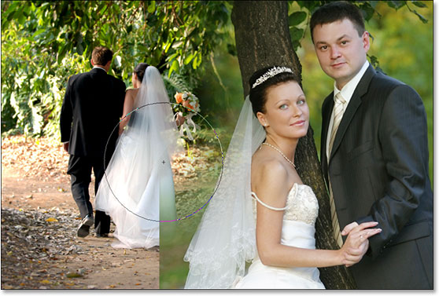

*Erasing parts of the left side of the top image so it blends seamlessly with the image below it.*

After finishing up with my Eraser, here's my result:

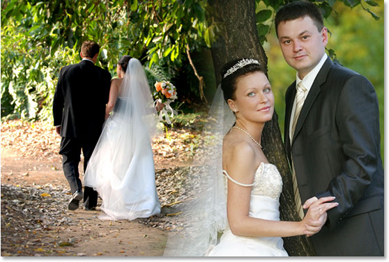

*After erasing away part of the top image, both images now seem to blend together well.*

Things definitely look much better now than they did when we tried lowering the opacity of the top layer. The couple is still visible in both images with a nice transition area in the middle, which is what I wanted. The Eraser Tool worked great! Who needs layer masks! I'm happy with this, I think my client is going to be happy with this as well, so I'll email a copy of the image off to my client, save my Photoshop document, close out of it, shut down my computer and go enjoy the rest of my day while I wait for the client to call me and tell me how awesome I am.

A couple of hours later, the phone rings and it's my client. They like the image overall, but they think I've removed too much of the bride's veil from the photo on the right and they'd like me to bring some of it back into the image, at which point they'll be happy to pay me for my work. "No problem!", I tell them. I head back to my computer, open my Photoshop document back up, and all I need to do now is bring back some of the bride's veil on the right by.... by....... hmm.

Uh oh. How do I do that when I've gone and erased that part of the image?

Simple answer? I can't. Not without doing the whole thing over again, anyway, which would be my only option in this case. There's nothing else I can do here because I've erased that part of the image and when you erase something in Photoshop, it's gone for good. If I look in the top layer's preview thumbnail in the Layers palette, I can see that I have in fact erased that part of the image:

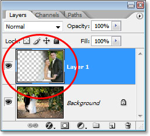

*The preview thumbnail of the top layer shows the left part of the top image now missing.*

And if I click on the eyeball icon to the left of the bottom layer to temporarily turn it off, leaving only the top layer visible in my document, it's very easy to see that the section I erased from the left of the top image is now completely gone:

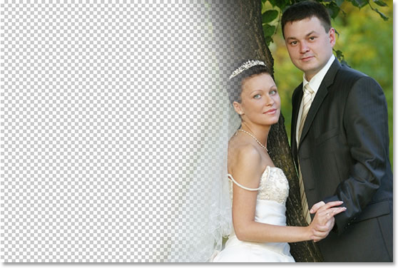

*By temporarily turning off the bottom Background layer, it's easy to see the missing left section of the top image.*

The checkerboard pattern in the image above is how Photoshop represents transparency in an image, as in there's nothing there anymore. As in I've messed up and now I have to do the work all over again from the beginning. Stupid Eraser Tool.

So now what? I've tried lowering the opacity of the top layer and that didn't really work. I've tried erasing parts of the top image away with the Eraser Tool and while that *did* work, I ended up permanently deleting that part of the image and now if I need to bring some of it back, I can't. I guess all I can really do then is set the number of undo's in Photoshop's Preferences to 100 and never close out of my Photoshop documents until after the client has paid me.

Or... What about these layer masks I keep hearing so much about? Would they work out any better? Let's find out!

The Opacity option left us disappointed. The Eraser Tool did the job but also caused permanent damage to our image. Wouldn't it be great if we could get the same results we saw with the Eraser Tool but without the "permanent damage to our image" part? Well guess what? We can! Say hello to Photoshop's layer masks.

As I mentioned at the beginning of this discussion, layer masks allow us to control the transparency of a layer, but unlike the Opacity option which controls overall transparency, layer masks allow us to set different levels of transparency for different areas of the layer (although technically, you *could* use them to control the overall opacity as well, but the Opacity option already handles that very well and layer masks are capable of so much more).

How do layer masks work? Well rather than talking about it, let's just go ahead and use one to see it in action. Before we can use a layer mask though, we first need to add one, since layers don't automatically come with layer masks. To add a layer mask, you first want to make sure that the layer you're adding it to is selected in the Layers palette (the currently selected layer is highlighted in blue), otherwise you'll end up adding it to the wrong layer. I want to add a layer mask to the top layer, which is already selected, so I'm good to go. Now if you're getting paid by the hour or you simply enjoy taking the scenic route through life, you could add a layer mask by going up to the *Layer* menu at the top of the screen, choosing *Layer Mask*, and then choosing *Reveal All*. If, on the other hand, you value your time and no one is paying you for it, simply click on the *Layer Mask* icon at the bottom of the Layers palette (it's the icon that looks like a filled rectangle with a round hole in the center of it):

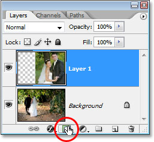

*Add a layer mask to a layer by selecting the layer in the Layers palette and then clicking on the "Layer Mask" icon.*

Once you've clicked on the icon, nothing will seem to have happened in your document, and that's because by default, layer masks are hidden from view. After all, the whole point of them is to show and hide different parts of the layer and it would be pretty difficult to do that if the mask itself was blocking our view of the image. So how do we know, then, that we've added a layer mask if we can't see it? Easy. Look back over in the Layers palette, to the right of the preview thumbnail on the layer you added the mask to, and you'll see a brand new thumbnail. This is your *layer mask thumbnail*, and it's how we know that a layer mask has been added to the layer:

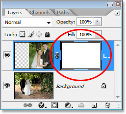

*After adding a layer mask to a layer, a layer mask thumbnail appears to the right of the layer's preview thumbnail.*

Notice that the layer mask thumbnail is filled with solid white. That's not just some random, meaningless color that Photoshop users to display layer mask thumbnails in. The reason why the thumbnail is filled with white is because the mask itself is currently filled with white, even though the mask is currently hidden from view. If you want proof that the mask really is there in your document and really is filled with white, simply hold down *Alt* (Win) / *Option* (Mac) and click directly on the layer mask thumbnail in the Layers palette:

*Hold down "Alt" (Win) / "Option" (Mac) and click on the layer mask's thumbnail in the Layers palette.*

Doing this tells Photoshop to show us the layer mask in our document, and sure enough, there it is, filled with white:

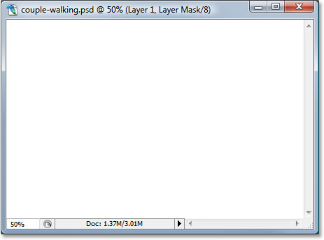

*The layer mask, filled with solid white, appears in the document window.*

The layer mask is now blocking our image from view though, so once again hold down *Alt* (Win) / *Option* (Mac) and click on the layer mask thumbnail to hide the mask.

So, why is the layer mask (and it's thumbnail in the Layers palette) filled with white? Why not red, or green, or yellow? It's because of how layer masks work in Photoshop. *Layer masks use only white, black, and all the shades of gray in between*, and they use these three colors (white, black and gray) to control the transparency of a layer. *White in a layer mask means 100% visible. Black in a layer mask means 100% transparent. And gray in a layer mask means some level of transparency depending on how light or dark the shade of gray is*. 50% gray will give us 50% transparency. The lighter the shade of gray, the closer it is to white and the less transparent that area of the layer will be. The darker the shade of gray, the closer it is to black and the more transparent that area will be.

The reason layer masks are filled with white by default is because usually, you want to see everything on your layer when you first add the mask, and white in a layer mask means 100% visible. What if instead, you wanted to *hide* everything on the layer when you add the mask, so that as soon as the mask is added, everything on that layer disappears from view? Well, we just learned that black on a layer mask means 100% transparent, so we would need a way to tell Photoshop that instead of filling the new layer mask with white, we want it to be filled what black. You'll most likely come across situations where it makes more sense to hide everything on the layer when you add the mask rather than leaving everything visible, and fortunately, Photoshop gives us a couple of easy ways to do that. First of all, I'm going to *delete my layer mask* by simply clicking on its thumbnail and dragging it down onto the trash bin icon at the bottom of the Layers palette:

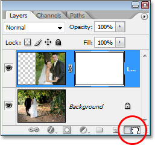

*To delete a layer mask, click on its thumbnail and drag it down onto the trash bin icon at the bottom of the Layers palette.*

Photoshop will pop up a message asking if you want to apply the mask to the layer before you delete it. "Applying" the mask basically means telling Photoshop to erase all the pixels on the layer that were hidden from view by the layer mask, as if you had erased them yourself with the Eraser Tool. This way, you can delete the mask without losing the work you've done with it, although you'll lose the ability to make any changes later. In my case, I haven't actually done anything with my mask so there's nothing to apply, so I'm simply going to press "Delete". Most times, if you find yourself deleting your mask, it will be because you're unhappy with it and want to start over, in which case you'll just want to click "Delete" as well:

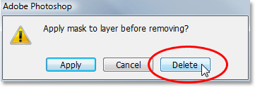

*In most cases, you'll simply want to delete your mask and start over, but there are times when you may want to apply the mask to the layer before deleting it, which will erase all the pixels on the layer that were hidden by the mask.*

Now that I've deleted my mask, both the mask itself and its thumbnail in the Layers palette are gone:

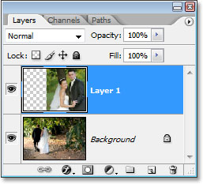

*When you delete a layer mask, its thumbnail in the Layers palette also disappears.*

This time, I want to add a mask to the top layer and have Photoshop hide everything on the layer as soon as the mask is added, which means the mask will need to be filled with black instead of white. The "getting paid by the hour" way to accomplish this would be to go up to the *Layer* menu at the top of the screen, choose *Layer Mask*, and then choose *Hide All* (remember last time, we chose "Reveal All"). The faster and easier way though is to hold down your *Alt* (Win) / *Option* (Mac) key and click on the *Layer Mask* icon at the bottom of the Layers palette:

*old down "Alt" (Win) / "Option" (Mac) and click on the "Layer Mask" icon.*

Either way you choose to do it, Photoshop adds a new layer mask to the currently selected layer, just as it did before, but this time, it fills the mask with black instead of white. We can see this in the layer mask thumbnail which is filled with solid black:

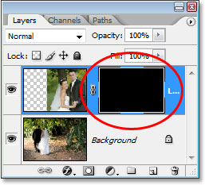

*The new layer mask thumbnail is filled with black.*

And, unlike the first time we added a layer mask where nothing seemed to have happened to our image, this time the top layer (the photo of the couple facing the camera) is completely hidden from view, leaving only the image below it visible:

*The photo on the top layer is now 100% transparent, leaving only the photo below it visible in the document.*

Once again, the layer mask itself is hidden from view, but if you want to see it in your document, hold down *Alt* (Win) / *Option* (Mac) and click directly on the layer mask's thumbnail in the Layers palette, which will tell Photoshop to show you the mask in the document window. This time, the mask is filled with black:

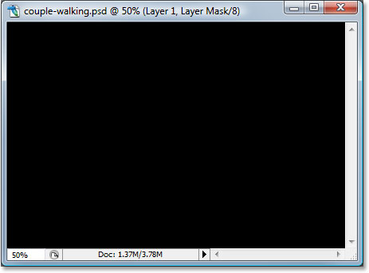

*Hold down "Alt" (Win) / "Option" (Mac) and click on the layer mask thumbnail in the Layers palette to view the mask in the document, which is filled with solid black.*

Hold "Alt/Option" and click again on the layer mask thumbnail to hide the mask in the document when you're done.

This is where the important difference between the Eraser Tool and layer masks comes in. Remember when we used the Easer Tool to blend the images together by erasing away part of the left side of the top image? The Eraser Tool physically deleted that part of the image and it was forever gone at that point, and if we looked in the top layer's preview thumbnail, we could see that large chunk of the image missing on the left. This time though, we've used a layer mask to hide not just part of the left side of the image but rather the entire image, yet if we look in the layer's preview thumbnail, the image is still there, completely intact:

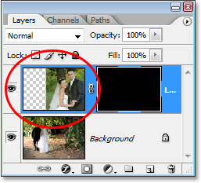

*The image on the top layer is still intact on the layer, as shown in the layer's preview thumbnail, even though it's hidden from view in the document.*

Where the Eraser Tool deleted the contents of the layer, the layer mask simply hides it from view! To prove that the photo on the top layer is still there, I'm going to fill the layer mask with white. To fill a layer mask with white, or do anything at all with a layer mask, you first need to select the mask so that you're working on the mask itself and not the actual layer, and to select it, all you need to do is click directly on the mask's thumbnail in the Layers palette:

*Select a layer mask by clicking on its thumbnail in the Layer's palette.*

You can switch between selecting the layer itself and its layer mask by clicking on the corresponding thumbnail. You can tell which one is currently selected by which thumbnail has the white highlight border around it, as we can see around the layer mask thumbnail in the image above.

To fill the mask with white, I'll go up to the *Edit* menu at the top of the screen and choose *Fill*, which brings up Photoshop's Fill command dialog box. For *Contents* I'll choose white:

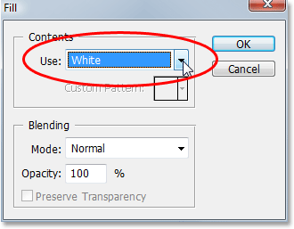

*Photoshop's "Fill" dialog box.*

With white chosen as my fill contents, I'll click OK in the top right to exit out of the dialog box and have Photoshop fill my layer mask with white. I can now see in the Layers palette that the mask thumbnail is filled with white:

*The layer mask thumbnail in the Layers palette is now filled with white.*

And with the mask now filled with solid white, my photo on the top layer is completely visible in the document once again, proving that even though the image was hidden from view a moment ago when we filled the layer mask with black, it was always there, untouched and unharmed:

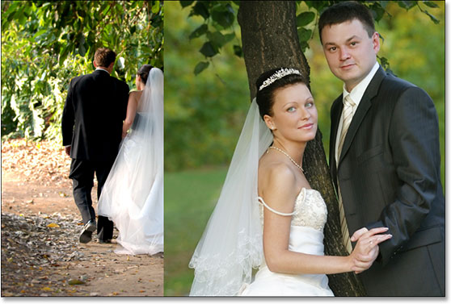

*After filling the layer mask with white, the photo on the top layer becomes fully visible once again.*

And that's the basics of how Photoshop's layer masks work! When the mask is filled with white, the contents of that layer are 100% visible in the document, and when the mask is filled with black, the contents of the layer are 100% transparent - hidden from view but not deleted as was the case with the Eraser Tool. Layer masks don't physically alter or affect the contents of the layer in any way. All they do is control which parts are visible and which are not. The contents of the layer are always there, even when we can't see them.

"Okay," you're wondering, "We've seen how we can hide a layer completely by adding a layer mask to it and filling it with black, and we've seen how we can show the layer completely once again by simply filling the layer mask with white. And we know that whether the contents on the layer are visible or not, they're still always there. The Eraser Tool deletes parts of the image but layer masks simply hide them. That's all great. But is this all we can do with a layer mask, either show the entire layer or hide it? How do we use a layer mask to blend these two images together like we did with the Eraser Tool?"

Excellent question, and the answer is, very easily! We'll do that next.

To blend the two images together using the layer mask, we don't use the Eraser Tool. In fact, while the Eraser Tool still has its place, you'll find yourself using it less and less as you become more comfortable with layer masks. Instead, we use Photoshop's *Brush Tool*, and with our layer mask filled with white as it currently is, which is making the entire layer visible, all we need to do is paint with black on the layer mask over any areas we want to hide. It's that simple!

To show you what I mean, I'm going to select my Brush Tool from the Tools palette:

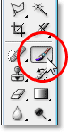

*Selecting Photoshop's Brush Tool from the Tools palette.*

I could also press *B* on my keyboard to quickly select it. Then, since we want to paint with black, we need to have black as our Foreground color, and by default, whenever you have a layer mask selected, Photoshop sets white as your Foreground color, with black as your Background color. To swap them so black becomes your Foreground color, simply press *X* on your keyboard. If I look in the color swatches near the bottom of my Tools palette, I can see now that black is my Foreground color:

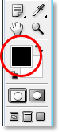

*Photoshop's Tools palette showing black as the Foreground color.*

I'm going to resize my brush to the same general size I used with the Eraser Tool by once again using the *left and right bracket keys*, and I want my brush to have nice, soft edges so I get smooth transitions between the areas of the layer that are visible and the areas that are hidden, and I can soften my brush edges by holding down *Shift* and pressing the left bracket key a few times. Then, with my layer mask selected (I know it's selected because the layer mask thumbnail has the white highlight border around it), I'm going to do basically the same thing I did with the Eraser Tool, except this time I'm painting with black on the layer mask over the areas I want to hide rather than erasing anything:

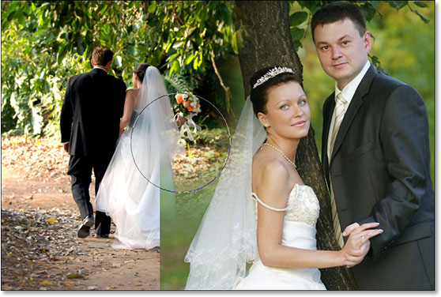

*Paint with black over areas that you want to hide.*

After spending a few more seconds painting away the areas I want to hide, here's my result, which looks pretty much the same as it did after I used the Eraser Tool:

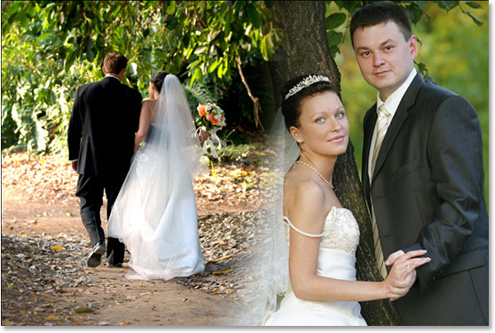

*The image after painting away the left part of the top image to blend it with the image below.*

If we look at the layer mask thumbnail in the Layers palette, we can see where I've painted with black, which are now the areas of the top image that are hidden from view:

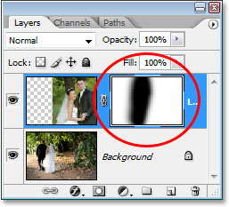

*The layer mask thumbnail now shows the areas I've painted with black.*

Let's say I'm happy with this, and I think my client will also be happy with it, so just as before, I email the image to the client for their approval, save my Photoshop document, close out of Photoshop and shut down my computer. The client calls back a couple of hours later and says they like it but they want some of the bride's veil on the right brought back in. When I faced this situation after using the Eraser Tool, I was out of luck because I had deleted that part of the image and had no choice but to start all over again. This time though, I was smarter! I used a layer mask, which means that the entire image on the top layer is still there and all I need to do is make more of it visible!

I was able to hide parts of the layer initially by painting on the layer mask with black, so to bring back some of the image that's now hidden, all I need to do is press *X* on my keyboard to swap my Foreground and Background colors, which makes white my Foreground color, and then I can simply paint with white over the areas I want to bring back into view, again making sure that my layer mask, not the layer itself, is selected, otherwise I'll be painting directly on the photo itself, and I'm fairly certain the client wouldn't approve of that. I think I'll use a smaller brush this time with harder edges so there isn't such a large transition area between the two images, and I'll use the bride's veil, along with the tree trunk above her, as the dividing point between the two images, which will look more natural. As I paint with white on the layer mask, the areas I paint over that were hidden become visible once again:

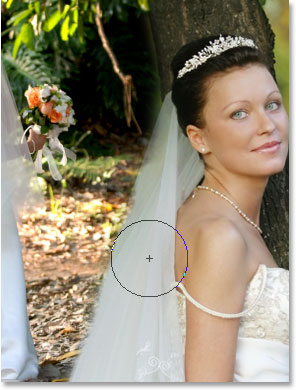

*Painting with white on the layer mask with white to bring back some of the image I had hidden originally by painting with black.*

If I make a mistake as I'm painting and accidentally show or hide the wrong area, all I need to do is press *X* to swap my Foreground and Background colors, paint over the mistake to undo it, then swap my Foreground and Background colors once again with *X* and continue on. And here, after a couple of minutes worth of work painting the veil and the tree trunk back into the image, is my final result:

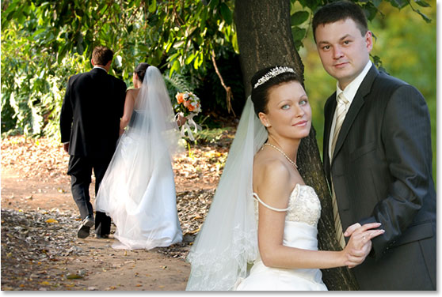

*The final result.*

Thanks to the layer mask, I didn't have to redo everything from scratch because nothing was deleted! The mask allowed me to hide parts of the layer without harming a single pixel, Not only does this give you a lot more flexibility, it also gives you a lot more confidence when working in Photoshop because nothing you do with a layer mask is permanent.