# Photoshop Layers Essential Power Shortcuts

> Source: [https://www.photoshopessentials.com/basics/layer-shortcuts/](https://www.photoshopessentials.com/basics/layer-shortcuts/)
> Downloaded and converted to Markdown.

From creating, copying and selecting layers to blend modes, clipping masks and more, learn how to speed up your Photoshop workflow with these essential layers shortcuts!

When it comes to getting the most out of Photoshop with the least amount of effort, there are two things we *absolutely* need to know—how to use **layers**, and how to use **keyboard shortcuts**. Layers keep our work flexible, while keyboard shortcuts help us complete our goals as quickly as possible.

In this tutorial, I've combined the two and rounded up Photoshop's essential keyboard shortcuts for working with layers! Learning these powerful shortcuts will increase your productivity, and they'll boost your confidence as you take a giant leap forward on the road to Photoshop mastery!

This updated version of the tutorial is for **Photoshop CS6** (which is what I'll be using) and is fully compatible with **Photoshop CC**. If you're using Photoshop CS5 or earlier, you'll want to check out the [original version](/basics/photoshop-layers-essential-shortcuts/) of this tutorial. Let's get started!

This tutorial is Part 10 of our [Photoshop Layers Learning Guide](/photoshop-layers-learning-guide/).

## The Essential Layers Shortcuts

### Show And Hide The Layers Panel

By default, Photoshop's [Layers panel](/basics/layers/layers-panel/) appears in the panel column along the right of the screen:

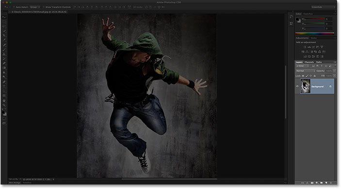
*The Layers panel opens in the lower right of Photoshop's interface.*

You can show or hide the Layers panel by pressing the **F7** key on your keyboard. Press F7 once to hide the Layers panel. Press F7 again to show it. Note that this will also show and hide the Channels and Paths panels since they're nested in with the Layers panel in the same panel group:

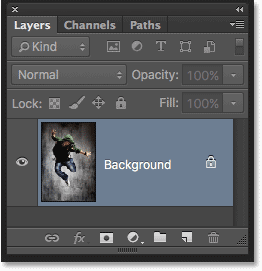
*A closer view of the Layers panel.*

### Naming A New Layer

The normal way to create a new layer in Photoshop is to click the **New Layer** icon at the bottom of the Layers panel:

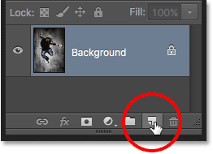
*Clicking the New Layer icon.*

Problem is, Photoshop gives the new layer a generic name, like "Layer 1", which doesn't tell us anything about what the layer will be used for:

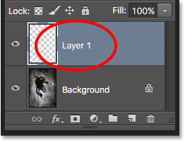
*Photoshop's generic layer names are not very helpful.*

A better way to create a new layer is to press and hold the **Alt** (Win) / **Option** (Mac) key on your keyboard as you click the New Layer icon:

*Holding Alt (Win) / Option (Mac) while clicking the New Layer icon.*

This tells Photoshop to first pop open the **New Layer** dialog box where we can name the layer before it's added. For example, if I was going to use the Clone Stamp Tool on this layer, I could name the layer "Cloning":

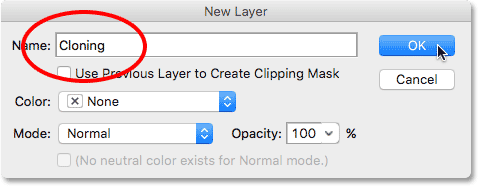
*Giving the layer a more descriptive name.*

Click OK to accept the name and close out of the New Layer dialog box. Here, we see my new "Cloning" layer in the Layers panel:

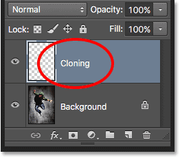
*The new layer appears with the custom name.*

### Creating A New Layer From The Keyboard

We can also create new layers directly from the keyboard without needing to click the New Layer icon at all. To create a new layer from your keyboard, press **Shift+Ctrl+N** (Win) / **Shift+Command+N** (Mac). Photoshop will pop open the New Layer dialog box so you can give the layer a descriptive name.

If you don't care about the layer's name, press **Shift+Ctrl+Alt+N** (Win) / **Shift+Command+Option+N** (Mac) on your keyboard. This will bypass the New Layer dialog box and simply add the new layer with one of Photoshop's generic names (like "Layer 2").

### Copy A Layer, Or Copy A Selection To A New Layer

To quickly make a copy of a layer, or to copy a selection to a new layer, press **Ctrl+J** (Win) / **Command+J** (Mac). Here, I've made a copy of my Background layer. Notice that Photoshop automatically named the copy "Layer 1". If you want to name the layer yourself before it's added, press **Ctrl+Alt+J** (Win) / **Command+Option+J** (Mac) which will open the New Layer dialog box:

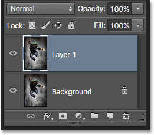
*Making a copy of the Background layer by pressing Ctrl+J (Win) / Command+J (Mac).*

### Copying A Layer While Moving It

To copy and move a layer at the same time, first select the layer you need in the Layers panel. Then press the letter **V** on your keyboard to select the **Move Tool**. Press and hold your **Alt** (Win) / **Option** (Mac) key as you click and drag on the layer in the document to move it. Rather than moving the original layer, you'll move a copy of the layer while the original stays in place.

### Adding A New Layer Below The Currently Selected Layer

By default, Photoshop adds new layers *above* the layer that's currently selected in the Layers panel, but we can also add new layers *below* the currently selected layer. Notice in this screenshot that my top layer (Layer 1) is selected. To tell Photoshop to add a new layer below it, all I need to do is press and hold the **Ctrl** (Win) / **Command** (Mac) key on my keyboard as I click the **New Layer** icon. If I wanted to name the new layer at the same time (which I'm not going to do), I'd press and hold **Ctrl+Alt** (Win / **Command+Option** (Mac) instead:

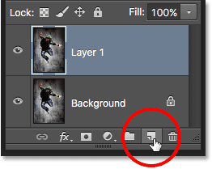
*Holding Ctrl (Win) / Command (Mac) while clicking the New Layer icon.*

Photoshop adds the new layer, and because I was holding my Ctrl (Win) / Command (Mac) key, it places the new layer below Layer 1 rather than above it. Note that this trick does not work when the [Background layer](/basics/layers/background-layer/) is selected, since Photoshop does not allow us to place layers below the Background layer:

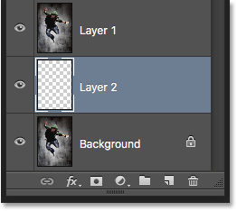
*The new layer appears below the layer that was previously selected.*

### Select All Layers At Once

To select all layers at once, press **Ctrl+Alt+A** (Win) / **Command+Option+A** (Mac). Note that this selects all layers *except* the Background layer:

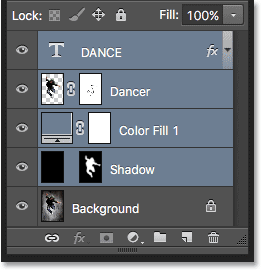
*Pressing Ctrl+Alt+A (Win) / Command+Option+A (Mac) to select all layers (except the Background layer).*

### Selecting Multiple Layers

To select multiple layers that are *contiguous* (that is, directly above or below each other), click on the top layer to select it, then press and hold your **Shift** key and click on the bottom layer (or vice versa). This will select the top layer, the bottom layer, and all layers in between. Here, I've clicked on the "Dancer" layer, then Shift-clicked on the "Shadow" layer. Photoshop selected both layers plus the "Color Fill 1" layer between them:

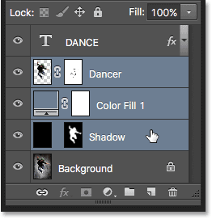
*Selecting contiguous layers.*

Another way to select multiple layers that are all directly above or below each other is to press and hold **Shift+Alt** (Win) / **Shift+Option** (Mac) and use the **left and right bracket keys** ( **[** and **]** ) on your keyboard. The right bracket key will add the layer *above* the currently selected layer to your selection. Continue pressing it to move up the layer stack and select more layers. The left bracket key will add the layer *below* the currently selected layer. Press it repeatedly to move down the layer stack adding more layers.

To select multiple layers that are *non-contiguous* (not directly above or below each other), press and hold your **Ctrl** (Win) / **Command** (Mac) key and click on each layer you want to select:

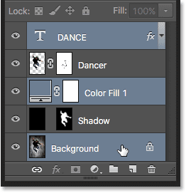
*Selecting non-contiguous layers.*

### Scroll Through The Layers

To scroll through the layers in the Layers panel, press and hold **Alt** (Win) / **Option** (Mac) and use your **left and right bracket keys** ( **[** and **]** ). The right bracket key scrolls up through the layers; the left bracket key scrolls down.

### Move Layers Up And Down The Layer Stack

To move the selected layer up or down the layer stack, press and hold **Ctrl** (Win) / **Command** (Mac) and use your **left and right bracket keys** ( **[** and **]** ). The right bracket key moves the layer up; the left bracket key moves it down. Note that this does not work with the Background layer since you can't move the Background layer. Also, you won't be able to move any other layers below the Background layer.

### Jump A Layer Directly To The Top Or Bottom Of The Layer Stack

To instantly jump the selected layer straight to the top of the layer stack, press **Shift+Ctrl+]** (Win) / **Shift+Command+]** (Mac). Here, I've jumped my "Color Fill 1" layer to the top:

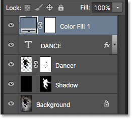
*Jumping the selected layer to the top of the stack.*

To jump the selected layer to the bottom of the layer stack, or at least to the spot just above the Background layer (since we can't place layers below the Background layer), press **Shift+Ctrl+[** (Win) / **Shift+Command+[** (Mac). Again, neither one of these shortcuts works with the Background layer:

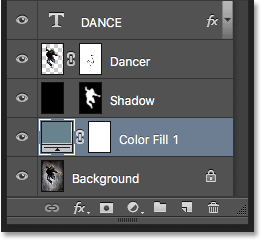
*Jumping the selected layer to the bottom of the stack (above the Background layer).*

### Show And Hide Layers

If you've been using Photoshop for a while, you probably know that you can temporarily hide a layer in the document by clicking its **visibility icon** (the eyeball) in the Layers panel:

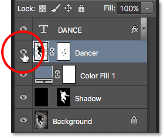
*Click the visibility (eyeball) icon to toggle a layer on or off.*

What you may not know is that you can temporarily hide every layer *except* for that one layer by pressing and holding your **Alt** (Win) / **Option** (Mac) key as you click the visibility icon. Notice that the eyeball is now visible only for my "Dancer" layer, which tells us that every other layer in the document is now hidden. Only that one layer remains visible. To turn all the layers back on, once again press and hold **Alt** (Win) / **Option** (Mac) and click the same visibility icon.

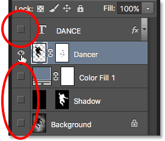
*Alt-clicking (Win) / Option-clicking (Mac) toggles all other layers on and off.*

### Viewing Layers One At A Time

One very helpful trick many people don't know about is that after you've Alt-clicked (Win) / Option-clicked (Mac) on a layer's visibility icon to hide all layers except for that one layer, you can then scroll through your layers, showing them one at a time, by keeping your *Alt* (Win) / *Option* (Mac) key held down and pressing the **left and right bracket keys** ( **[** and **]** ).

The right bracket key will scroll up through the layers; the left bracket key will scroll down. As you arrive at each new layer, Photoshop will make that layer visible in the document and leave all the others hidden. This makes it easy to scroll through your layers and see exactly what's on each one.

### Select The Contents Of A Layer

To select the contents of a layer, press and hold your **Ctrl** (Win) / **Command** (Mac) key and click directly on the layer's **preview thumbnail** in the Layers panel. A selection outline will appear around the layer's contents in the document:

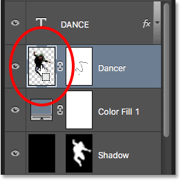
*Holding Ctrl (Win) / Command (Mac) and clicking on the layer's preview thumbnail.*

### Select The Entire Layer

To select the entire layer itself, not just its contents, first click on the layer to make it active, then press **Ctrl+A** (Win) / **Command+A** (Mac) on your keyboard.

### Create A New Group From Layers

To quickly create a layer group from your selected layers, first select the layers you want to include (we covered selecting multiple layers earlier):

*Selecting the layers to place inside the group.*

Then, with the layers selected, press **Ctrl+G** (Win) / **Command+G** (Mac) on your keyboard. Photoshop will create a new layer group and place your selected layers inside it. To ungroup the layers, press **Shift+Ctrl+G** (Win) / **Shift+Command+G** (Mac):

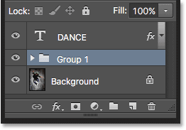
*Press Ctrl+G (Win) / Command+G (Mac) to group layers.*

### Merging Layers

To merge a layer with the layer directly below it in the Layers panel, press **Ctrl+E** (Win) / **Command+E** (Mac).

To merge multiple layers together, first select the layers you want to merge, then press **Ctrl+E** (Win) / **Command+E** (Mac).

To merge two or more layers onto a new layer while still keeping the original layers, first select the layers you want to merge, then press **Ctrl+Alt+E** (Win) / **Command+Option+E** (Mac).

To merge all layers and flatten the image onto a single layer, press **Shift+Ctrl+E** (Win) / **Shift+Command+E** (Mac).

To merge all layers onto a new, separate layer and keep the originals, press **Shift+Ctrl+Alt+E** (Win) / **Shift+Command+Option+E** (Mac).

### Create A Clipping Mask

There's a couple of quick ways to create [clipping masks](/basics/clipping-masks-essentials/) in Photoshop using keyboard shortcuts. The first way is to hover your mouse cursor directly over the dividing line between two layers in the Layers panel. Then, press and hold your **Alt** (Win) / **Option** (Mac) key and click. The top layer will be clipped to the layer below it. Do the same thing again to release the clipping mask:

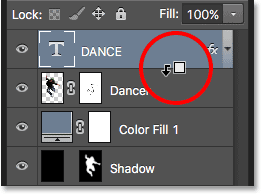
*With Alt (Win) / Option (Mac) held down, your mouse cursor will change into a clipping mask icon.*

Another way to create a clipping mask is to first select the layer that should be clipped to the layer below it. Then press **Ctrl+Alt+G** (Win) / **Command+Option+G** (Mac) on your keyboard. Pressing the same shortcut again will release the mask.

### Cycle Through Layer Blend Modes

When trying to decide which [layer blend mode](/photo-editing/layer-blend-modes/intro/) to use, most people choose one from the *Blend Mode* drop-down list in the top left corner of the Layers panel to see what effect it has on their image. Then, they choose a different one from the list to view the effect. Then they choose another, and another, and so on. There's a much better way.

To easily cycle through Photoshop's layer blend modes and preview the results, press and hold your **Shift** key and use the **plus** ( **+** ) and **minus** ( **-** ) keys on your keyboard. The plus key scrolls down through the list; the minus key scrolls up.

Note, though, that some of Photoshop’s tools, like the various brush tools, shape tools and the Gradient Tool, have their own blend modes to choose from. Using this keyboard shortcut with one of these tools selected will cycle you through the *tool's* blend modes, not the layer blend modes:

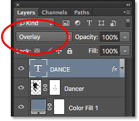
*Hold Shift and use the plus and minus keys to cycle through the blend modes.*

You can also jump to specific blend modes from the keyboard. For a complete list of blend mode shortcuts, check out our [Layer Blend Modes Essential Keyboard Shortcuts](/basics/blend-modes/keyboard-shortcuts/) tutorial.

### Changing The Layer Opacity

To quickly change the opacity of a layer, first press the letter **V** on your keyboard to select Photoshop's **Move Tool**, then type a number. Type "5" for 50% opacity, "8" for 80%, "3" for 30%, and so on. If you need a more specific opacity value, like 25%, type "25" quickly. For 100% opacity, type "0". Whatever opacity value you enter appears in the *Opacity* option in the top right corner of the Layers panel (across from the Blend Mode option):

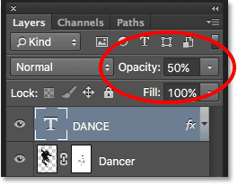
*Select a layer in the Layers panel, then type a number to change its Opacity value.*

You don't technically need to have the Move Tool selected for this shortcut to work, but you do need to have a tool selected that does not have its own independent Opacity option (otherwise you'll change the *tool's* opacity, not the layer opacity). The Move Tool does not have its own Opacity option, and since it's located at the top of the Tools panel, it's the easiest to select.

### Changing The Fill Value

We can also change a layer's Fill value from the keyboard in much the same way. The **Fill** option is located directly under the Opacity option, and like Opacity, Fill controls the transparency of a layer. The difference between them is that Opacity controls the transparency level for both the contents of the layer *and* any layer styles applied to it, while Fill ignores any layer styles and affects only the layer's actual contents. See our [Layer Opacity vs Fill](/basics/layers/opacity-vs-fill/) tutorial for more details.

To change the Fill value from the keyboard, press and hold **Shift**, then type in the new value:

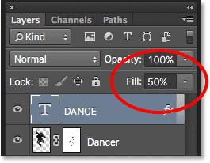
*Hold Shift and type a number to change the Fill value.*

### Deleting A Layer

Finally, to delete a layer, rather than dragging it down onto the Trash Bin at the bottom of the Layers panel, just press **Backspace** (Win) / **Delete** (Mac) on your keyboard.

And there we have it! That's our roundup of the essential shortcuts for working quickly and efficiently with layers in Photoshop! Looking for more Photoshop tips? Download our tutorials as [print-ready PDFs](/print-ready-pdfs/) and get our member-exclusive **101 Photoshop Tips & Tricks** PDF! Or, check out our [Photoshop Layers Learning Guide](/photoshop-layers-learning-guide/) section for more layers tutorials!